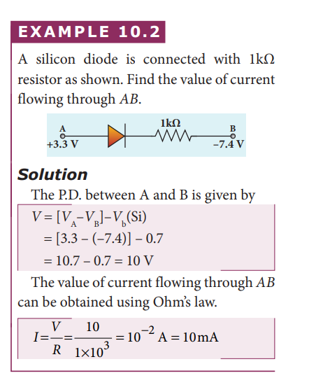

**Learning Objectives**

**In this unit, the students are exposed to**
 • Energy band diagram in semiconductors 
 • Types of semiconductors 
 • Formation of _p-n_ junction diode and its V-I ch 
 • Rectification process 
 • Special purpose diodes
  • Transistors and their immediate applications
   • Digital and analog signals
    • Logic gates, Boolean algebra and De Morgan’s 
    • Modulation and its types 
    • Basic elements of communication system
     • Propagation of electromagnetic waves through 
     • Some important communication systems

**10.1 INTRODUCTION**

&nbsp;&nbsp;&nbsp;&nbsp;&nbsp;&nbsp;Electronics has become a part of our daily life. All gadgets like mobile phones, computers, televisions, music systems etc work on the electronic principles. Electronic circuits are used to perform various operations in devices like air conditioners, microwave oven, dish washers and washing machines. Besides this, its applications are widespread in all fields like communication systems, medical diagnosis and treatments and even handling money through ATMs.

**Evolution of Electronics:** 

&nbsp;&nbsp;&nbsp;&nbsp;&nbsp;&nbsp;The history of electronics began with the invention of vacuum diode by J.A. Fleming in 1897. This was followed by a vacuum triode implemented by Lee De Forest to control electrical signals. This led to the introduction of tetrode and pentode tubes.
&nbsp;&nbsp;&nbsp;&nbsp;&nbsp;&nbsp;Subsequently, the transistor era began with the invention of bipolar junction transistor by Bardeen, Brattain and Shockley in 1948 for which they received Nobel prize in 1956. The emergence of germanium and silicon semiconductor materials made this transistor gain popularity, in turn its application in different electronic circuits.
&nbsp;&nbsp;&nbsp;&nbsp;&nbsp;&nbsp;The following years witnessed the invention of the integrated circuits (ICs) that helped to integrate the entire electronic circuit on a single chip which is small in size and cost-effective. Since 1958 ICs capable of holding several thousand electronic components on a single chip such as small- scale, medium-scale, large-scale, and very- large scale integration started coming into existence. Digital integrated circuits became another robust IC development that enhanced the architecture of computers. All these radical changes led to the introduction of microprocessor in 1969 by Intel.
&nbsp;&nbsp;&nbsp;&nbsp;&nbsp;&nbsp;The electronics revolution, in due course of time, accelerated the computer revolution. Now the world is on its way towards small particles of nano-size, far too small to see. This helps in the miniaturization to an unimaginable size. A room-size computer during its invention has now emerged as a laptop, palmtop, iPad, etc. In the recent past, IBM has released the smallest computer whose size is comparable to the tip of the rice grain, measuring just 0.33 mm on each side.
&nbsp;&nbsp;&nbsp;&nbsp;&nbsp;&nbsp;Electronics is the branch of physics which incorporates technology to design electrical circuits using transistors and microchips. It depicts the behaviour and movement of electrons and holes in a semiconductor, electrons and ions in vacuum or gas. Electronics deals with electrical circuits that involve active components such as transistors, diodes, integrated circuits and sensors, associated with the passive components like resistors, inductors, capacitors and transformers.
&nbsp;&nbsp;&nbsp;&nbsp;&nbsp;&nbsp;This chapter deals with semiconductor devices like _p-n_ junction diodes, bipolar junction transistors and logic circuits. 

**Note**

**Passive components:** components that cannot generate power in a circuit.
**Active components:** components that can generate power in a circuit.

**Figure 10.1** Evolution of computers (a) One of the world’s first computers (b) Desktop computer (c) Laptop computer (d) Palmtop computer (e) Smallest computer by IBM kept near the tip of the rice grain

The world’s first computer ‘ENIAC’ was invented by J. Presper Eckert and

John Mauchly at the University of Pennsylvania. The construction work started in 1943 and got over in 1946. It occupied an area of around 1800 square feet. It had 18,000 vacuum tubes and it weighed around 50 tons.

### 10.1.1 Energy band diagram of solids

&nbsp;&nbsp;&nbsp;&nbsp;&nbsp;&nbsp;In an isolated atom, the electronic energy levels are widely separated and are far apart and the energy of the electron is decided by the orbit in which it revolves around the nucleus. However, in the case of a solid, the atoms are closely spaced and hence the electrons in the outermost energy levels of nearby atoms influence each other. This changes the nature of the electron motion in a solid from that in an isolated atom to a large extent.
&nbsp;&nbsp;&nbsp;&nbsp;&nbsp;&nbsp;The valence electrons in an atom are responsible for the bonding nature. Let us consider an atom with one electron in the outermost orbit. It means that the number of valence electrons is one. When two such atoms are brought close to each other, the valence orbitals are split up into two. Similarly the unoccupied orbitals of each atom will also split up into two. The electrons have the choice of choosing any one of the orbitals as the energy of both the orbitals is the same. When the third atom of the same element is brought to this system, the valence orbitals of all the three atoms are split into three.The unoccupied orbitals also will split into three.
&nbsp;&nbsp;&nbsp;&nbsp;&nbsp;&nbsp;In reality, a solid is made up of millions of atoms. When millions of atoms are brought close to each other, the valence orbitals and the unoccupied orbitals are split according to the number of atoms. In this case, the

**Figure 10.2** (a)  Schematic representation of valence band, conduction band and forbidden energy gap. Energy band structure of (b) Insulator (c) Conductor (d) Semiconductor

energy levels will be closely spaced and will be difficult to differentiate the orbitals of one atom from the other and they look like a band as shown in Figure 10.2. **This band of very large number of closely spaced energy levels in a very small energy range is known as energy band.**
&nbsp;&nbsp;&nbsp;&nbsp;&nbsp;&nbsp;The energy band formed due to the valence orbitals is called **valence band (VB)** and that formed due to the unoccupied orbitals to which electrons can jump when energised is called the **conduction band (CB).** The energy gap between the valence band and the conduction band is called **forbidden energy gap (_Eg_).** Electrons cannot exist in the forbidden energy gap.
&nbsp;&nbsp;&nbsp;&nbsp;&nbsp;&nbsp;A simple pictorial representation of the valence band and conduction band is shown in Figure 10.2(a). _EV_ represents the maximum energy of the valence band and _EC_ represents minimum energy of the conduction band. The forbidden energy gap, _Eg_ = _EC_– _Ev_. We know that the Coulomb force of attraction between the orbiting electron and the nucleus is inversely proportional to the distance between them. Therefore, the electrons in the orbitals closer to the nucleus are strongly bound to it. Hence, the electrons closer to nucleus require a lot of energy to be excited. The electrons in the valence band are loosely bound to the nucleus and can be easily excited to become free electrons.

**Note**
The energy of the orbiting electrons is measured in electron volts (eV).

### Classification of materials
&nbsp;&nbsp;&nbsp;&nbsp;&nbsp;&nbsp;The classification of solids into insulators, metals, and semiconductors can be explained with the help of the energy band diagram.

**i) Insulators** 

&nbsp;&nbsp;&nbsp;&nbsp;&nbsp;&nbsp;The energy band structure of insulators is shown in Figure 10.2(b). The valence band and the conduction band are separated by a large energy gap. The forbidden energy gap is approximately 6 eV in insulators. The gap is very large that electrons from valence band cannot move into conduction band even on the application of strong external electric field or the increase in temperature. Therefore, the electrical conduction is not possible as the free electrons are not available for conduction and hence these materials are called insulators. Its resistivity is in the range of 1011–1019 Ωm.

**ii) Conductors** 

&nbsp;&nbsp;&nbsp;&nbsp;&nbsp;&nbsp;In condutors, the valence band and conduction band overlap as shown in Figure 10.2(c). Hence, electrons can move freely into the conduction band which results in a large number of free electrons available in the conduction band. Therefore, conduction becomes possible even at low temperatures. The application of electric field provides sufficient energy to the electrons to drift in a particular direction to constitute a current. For condutors, the resistivity value lies between 10–2 Ωm and 10–8 Ωm.

**iii) Semiconductors** 

&nbsp;&nbsp;&nbsp;&nbsp;&nbsp;&nbsp;In semiconductors, there exists a narrow forbidden energy gap(_E eVg_ <( )3eV) between the valence band and the conduction band (Figure 10.2(d)). At a finite temperature, thermal agitations in the solid can break the covalent bond between the atoms (covalent bond is formed due to the sharing of electrons to attain stable electronic configuration). This releases some electrons from valence band to conduction band. Since free electrons are small in number, the conductivity of the semiconductors is not as high as that of the conductors. The resistivity value of semiconductors is from 10–5 Ωm to 106 Ωm.

**Note**
In semiconductors, electrons in the valence band are bound electrons which cannot move. Hence, they cannot contribute for conduction.
&nbsp;&nbsp;&nbsp;&nbsp;&nbsp;&nbsp;When the temperature is increased further, more number of electrons are promoted to the conduction band and they increase the conduction. Thus, we can say that the electrical conduction increases with the increase in temperature. In other words, resistance decreases with increase in temperature. Hence, semiconductors are said to have negative temperature coefficient of resistance. The most important commonly used elemental semiconducting materials are silicon (Si) and germanium (Ge). The values of forbidden energy gap for Si and Ge at room temperature are 1.1 eV and 0.7 eV respectively.

**10.2 TYPES OF SEMICONDUCTRORS**

### 10.2.1 Intrinsic semiconductors

&nbsp;&nbsp;&nbsp;&nbsp;&nbsp;&nbsp;**A semiconductor in its pure form without any impurity is called an intrinsic semiconductor**. Here, impurity means

**Figure 10.3** (a) Two dimensional crystal lattice of silicon (b) Valence band and conduction band of intrinsic semiconductor

presence of any other foreign atom in the crystal lattice. The silicon lattice is shown in Figure 10.3(a). Each silicon atom has four electrons in the outermost orbit and is covalently bonded with four neighbouring atoms to form the lattice. The band diagram for this case is shown in Figure 10.3(b).
&nbsp;&nbsp;&nbsp;&nbsp;&nbsp;&nbsp; A small increase in temperature is sufficient enough to break some of the covalent bonds and release the electrons free from the lattice (10.4(a)). As a result, some states in the valence band become empty and the same number of states in the conduction band will be occupied by

**Figure 10.4** (a) The presence of free electron, hole and broken covalent bond in the intrinsic silicon crystal (b) Presence of electrons in the conduction band and holes in the valence band at room temperature
 
electrons as shown in Figure 10.4(b). The vacancies produced in the valence band are called holes. As the holes are deficiency of electrons, they are treated to possess positive charges. Hence, electrons and holes are the two charge carriers in semiconductors.
&nbsp;&nbsp;&nbsp;&nbsp;&nbsp;&nbsp;In intrinsic semiconductors, the number of electrons in the conduction band is equal to the number of holes in the valence band. The electrical conduction is due to the electrons in the conduction band and holes in the valence band. The corresponding currents are represented as _Ie_ and _Ih_ respectively.

**Note**
Definition of a hole: When an electron is excited, covalent bond is broken. Now octet rule will not be satisfied. Thus each excited electron leaves a vacancy to complete bonding. This ‘deficiency’ of electron is termed as a ‘hole’

&nbsp;&nbsp;&nbsp;&nbsp;&nbsp;&nbsp;The total current _I_ is always the sum of the electron current and the hole current. That is, _I I Ie h_\= + .
&nbsp;&nbsp;&nbsp;&nbsp;&nbsp;&nbsp;An intrinsic semiconductor behaves like an insulator at 0 K. The increase in temperature increases the number of charge carriers (electrons and holes). The schematic diagram of the intrinsic semiconductor in band diagram is shown in Figure 10.4(b). **The intrinsic carrier concentration is the number of electrons in the conduction band or the number of holes in the valence band in an intrinsic semiconductor**.

### 10.2.2 Extrinsic semiconductors 

&nbsp;&nbsp;&nbsp;&nbsp;&nbsp;&nbsp;The carrier concentration in an intrinsic semiconductor is not sufficient enough to develop efficient electronic devices. Another way of increasing the carrier concentration in an intrinsic semiconductor is by adding impurity atoms.

&nbsp;&nbsp;&nbsp;&nbsp;&nbsp;&nbsp;**The process of adding impurities to the intrinsic semiconductor is called doping.** It increases the concentration of charge carriers (electrons and holes) in the semiconductor and in turn, its electrical conductivity. The impurity atoms are called dopants and its order is approximately 100 ppm (parts per million).

On the basis of the type of impurity added, extrinsic semiconductors are classified into:  

i) _n_\-type semiconductor
ii) _p_\-type semiconductor

**i) _n_\-type semiconductor**

 
&nbsp;&nbsp;&nbsp;&nbsp;&nbsp;&nbsp;A _n_\-type semiconductor is obtained by doping a pure silicon (or germanium) crystal with pentavalent impurity atoms (from V group of periodic table) such as phosphorus, arsenic and antimony as shown in Figure 10.5(a). The dopant has five valence electrons while the silicon atom has four valence electrons. During the process of doping, a few of the silicon atoms are replaced by pentavalent

**Figure 10.5** _n_\-type extrinsic semiconductor: (a) Free electron which is loosely attached to the lattice (b) Representation of donor energy level

dopants. Four of the five valence electrons of the impurity atom form covalent bonds with four silicon atoms. The fifth valence electron of the impurity atom is loosely attached with the nucleus as it is not used in the formation of the covalent bond.
&nbsp;&nbsp;&nbsp;&nbsp;&nbsp;&nbsp;The energy level of the loosely attached fifth electron from the dopant is found just below the conduction band edge and is called the donor energy level as shown in Figure 10.5(b). At room temperature, these electrons can easily move to the conduction band with the absorption of thermal energy. It is shown in the Figure 10.6. Besides, an external electric field also can set free the loosely bound electrons and lead to conduction.

**Figure 10.6** Thermally generated 
holes in the valence band and the 
free electrons generated by the dopants
 in the conduction band (_n_\-type semiconductor)

&nbsp;&nbsp;&nbsp;&nbsp;&nbsp;&nbsp;It is important to note that the energy required for an electron to jump from the valence band to the conduction band in an intrinsic semiconductor is 0.7 eV for Ge and 1.1 eV for Si, while the energy required to set free a donor electron is only 0.01 eV for Ge and 0.05 eV for Si.
&nbsp;&nbsp;&nbsp;&nbsp;&nbsp;&nbsp;The V group pentavalent impurity atoms donate electrons to the conduction band and are called donor impurities. Therefore, each impurity atom provides one extra electron to the conduction band in addition to the thermally generated electrons. These thermally generated electrons leave holes in valence band. Hence, the majority carriers of current in an _n_\-type semiconductor are electrons and the minority carriers are holes. Such a semiconductor doped with a pentavalent impurity is called an _n_\-type semiconductor.

**ii) _p_\-type semiconductor** 

&nbsp;&nbsp;&nbsp;&nbsp;&nbsp;&nbsp;In _p_\-type semiconductor, trivalent impurity atoms (from III group of periodic table) such as boron, aluminium, gallium and indium are added to the silicon (or germanium) crystal. The dopant with three valence electrons can form three covalent bonds with three silicon atoms. Of the four covalent bonds, three bonds are complete and the remaining one bond is incomplete with one electron. This electron vacancy present in the fourth covalent bond is represented as a hole.
&nbsp;&nbsp;&nbsp;&nbsp;&nbsp;&nbsp;To make complete covalent bonding with all four neighbouring atoms, the dopant is in need of one more electron. These dopants can accept electrons from the neighbouring atoms. Therefore, this impurity is called an acceptor impurity. The energy level of the hole created by each impurity atom is just above the valence band and is called the acceptor energy level, as shown in Figure 10.7(b).
&nbsp;&nbsp;&nbsp;&nbsp;&nbsp;&nbsp;For each acceptor atom, there will be a hole in the valence band; this is in addition to the holes left by the thermally generated electrons. In such an extrinsic semiconductor, holes are the majority carriers and thermally generated electrons are minority carriers as shown in Figure 10.8. The extrinsic semiconductor thus formed is called a _p_\-type semiconductor.

**Figure 10.7** _p_\-type extrinsic semiconductor
 (a) Hole generated by the dopant
  (b) Representation of acceptor energy level  

  

**Figure 10.8** Thermally generated 
electron in the conduction band and the
 holes generated by the dopants in the
  valence band (_p_\-type semiconductor)

The _n_\-type and _p_\-type semiconductors are neutral because only neutral atoms are doped to the intrinsic semiconductors.

**10.3 DIODES**

### 10.3.1 P-N Junction formation

**i) Formation of depletion layer** 

&nbsp;&nbsp;&nbsp;&nbsp;&nbsp;&nbsp;A single piece of semiconductor crystal is suitably doped such that its one side is _p_\-type semiconductor and the other side is _n_\-type semiconductor. The contact surface between the two sides is called _p-n_ junction. Whenever _p-n_ junction is formed, some of the free electrons diffuse from the _n_\-side to the _p_\-side while the holes from the _p_\-side to the _n_\-side. The diffusion of charge carriers happens due to the fact that the _n_\-side has higher electron concentration and the _p_\-side has higher hole concentration. **The diffusion of the majority charge carriers across the junction gives rise to an electric current, called diffusion current**.
&nbsp;&nbsp;&nbsp;&nbsp;&nbsp;&nbsp;When an electron leaves the _n_\-side, a pentavalent atom in the _n_\-side becomes a positive ion. The free electron migrating into _p_\-side recombines with a hole present in a trivalent atom near the junction and the trivalent atom becomes a negative ion. Since such ions are bonded to the neighbouring atoms in the crystal lattice, they are unable to move. As the diffusion process continues, a layer of positive ions and a layer of negative ions are created on either side of the junction accordingly. **The thin region near**

## 

**Figure 10.9** Formation of _p–n_ junction 

**the junction which is free from charge carriers (free electrons and holes) is called depletion region** (Figure 10.9).

&nbsp;&nbsp;&nbsp;&nbsp;&nbsp;&nbsp;An electric field is set up between the positively charged layer in the _n_\-side and the negatively charged layer in the _p_\-side in the depletion region as shown in the Figure 10.9. This electric field makes electrons in the _p_\-side drift into the _n_\-side and the holes in the _n_\-side into the _p_\-side. **The electric current produced due to the motion of the minority charge carriers by the electric field is known as drift current**. The diffusion current and drift current flow in opposite directions.
&nbsp;&nbsp;&nbsp;&nbsp;&nbsp;&nbsp;Though drift current is less than diffusion current initially, equilibrium is reached between them at a particular time. With each electron (or hole) diffusing across the junction, the strength of the electric field increases thereby increasing the drift current till the two currents become equal. Hence at equilibrium, there is no net electric current across the junction. Thus, a _p-n_ junction is formed.

**ii) Junction potential or barrier potential** 
&nbsp;&nbsp;&nbsp;&nbsp;&nbsp;&nbsp;The movement of charge carriers across the junction takes place only to a certain point beyond which the depletion layer acts like a barrier to further diffusion of free charges across the junction. This is due to the fact that the immobile ions on both sides establish an electric potential difference across the junction.

**Figure 10.10** Barrier potential formed
 across the junction

&nbsp;&nbsp;&nbsp;&nbsp;&nbsp;&nbsp;**This difference in potential across the depletion layer is called the** **barrier potential (_V_b)** as shown in Figure 10.10. At 25 0C, this barrier potential is approximately 0.7 V for silicon and 0.3 V for germanium.

### 10.3.2 P-N Junction diode
&nbsp;&nbsp;&nbsp;&nbsp;&nbsp;&nbsp;**A _p-n_ junction diode is formed when a _p_\-type semiconductor is fused with an _n_\-type semiconductor**. It is a device with single _p-n_ junction as shown in Figure 10.11(a) and its circuit symbol is shown in Figure 10.11(b).

**Figure 10.11** _p-n_ junction diode (a) Schematic representation (b) Circuit symbol

**Biasing a diode**
&nbsp;&nbsp;&nbsp;&nbsp;&nbsp;&nbsp;**Biasing means providing external energy to charge carriers to overcome the barrier potential and make them move in a particular direction.** The charge carriers can either move towards the junction or away from the junction. **The external voltage applied to the _p-n_ junction is called bias voltage**. Depending on the polarity of the external source to the _p-n_ junction, we have two types of biasing:

&nbsp;&nbsp;&nbsp;&nbsp;&nbsp;&nbsp;i) Forward bias 
&nbsp;&nbsp;&nbsp;&nbsp;&nbsp;&nbsp;ii) Reverse bias

**i) Forward bias** 
&nbsp;&nbsp;&nbsp;&nbsp;&nbsp;&nbsp;If the positive terminal of the external voltage source is connected to the _p_\-side and the negative terminal to the _n_\-side, it is called forward bias as shown in Figure 10.12. The application of a forward bias potential pushes electrons in the _n_\-side and the holes in the _p_\-side towards the junction. This initiates the recombination with the ions near the junction which in turn reduces the width of the depletion region and hence the barrier potential.
&nbsp;&nbsp;&nbsp;&nbsp;&nbsp;&nbsp;The electron from the _n_\-side is now accelerated towards the _p_\-side as it experiences a reduced barrier potential at the junction. In addition, the accelerated electrons experience a strong attraction by the positive potential applied to the _p_\-side. This results in the movement of electrons in the _n_\-side towards the _p_\-side and similarly, holes in the _p_\-side towards the _n_\-side. When the applied voltage is increased, the width of the depletion region and hence the barrier potential are further reduced. This results in a large number of electrons passing through the junction resulting in an exponential rise in current through the junction.

**Figure 10.12** Schematic representation of a _p-n_ junction diode under forward bias

**ii) Reverse bias** 
&nbsp;&nbsp;&nbsp;&nbsp;&nbsp;&nbsp;If the positive terminal of the battery is connected to the _n_\-side and the negative terminal to the _p_\-side, the junction is said to be reverse biased as shown in Figure 10.13.

**Figure 10.13** Schematic representation 
of a _p-n_ junction diode under reverse bias

&nbsp;&nbsp;&nbsp;&nbsp;&nbsp;&nbsp;As the positive terminal is connected to the _n_\-type material, the electrons in the _n_\-side are attracted towards the positive terminal and the holes in the _p_\-side are attracted by the negative terminal. This increases the immobile ion concentration at the junction. The net effect is the widening of the depletion region leading to an increase in the barrier potential. Consequently, the majority charge carriers from both sides experience a great potential barrier to cross the junction. This reduces the diffusion current across the junction drastically.
&nbsp;&nbsp;&nbsp;&nbsp;&nbsp;&nbsp;Yet, a small current flows across the junction due to the minority charge carriers in both regions. The reverse bias for majority charge carriers serves as the forward bias for minority charge carriers. The current that flows under a reverse bias is called the reverse saturation current**.** It is represented as _I_s.
&nbsp;&nbsp;&nbsp;&nbsp;&nbsp;&nbsp;The reverse saturation current is independent of the applied voltage and it depends only on the concentration of the thermally generated minority charge carriers. Even a small voltage is sufficient enough to drive the minority charge carriers across the junction.

**Note**
The reverse saturation current of a silicon diode doubles for every 10 °C rise in temperature.

### 10.3.3 Characteristics of a junction diode

**i) Forward characteristics** 
&nbsp;&nbsp;&nbsp;&nbsp;&nbsp;&nbsp;It is the study of the variation in current through the diode with respect to the applied voltage across the diode when it is forward biased.
&nbsp;&nbsp;&nbsp;&nbsp;&nbsp;&nbsp;The _p-n_ junction diode is forward biased as shown in Figure 10.14(a). An external resistance (_R_) is used to limit the flow of current through the diode. The voltage across the diode is varied by varying the biasing voltage across the DC power supply. The forward bias voltage and the corresponding forward bias current are noted. A graph is plotted by taking the forward bias voltage (_VF_) along the x-axis and the current (_IF_) through the diode along the y-axis. This graph is called the **forward V-I characteristics** of the _p-n_ junction diode and is shown in Figure 10.14(b). Four inferences can be brought out from the graph:

**Figure 10.14** _p-n_ junction diode (a) Diode under forward bias (b) Forward characteristics

&nbsp;&nbsp;&nbsp;&nbsp;&nbsp;&nbsp;(i) At room temperature, a potential difference equal to the barrier potential is required before a reasonable forward current starts flowing across the diode. This voltage is known as **threshold voltage or cut-in voltage or knee voltage** (_Vknee_). It is approximately 0.3 V for germanium and 0.7 V for silicon. The current flow is negligible when the applied voltage is less than the threshold voltage. Beyond the threshold voltage, increase in current is significant even for a small increase in voltage.

&nbsp;&nbsp;&nbsp;&nbsp;&nbsp;&nbsp;(ii) The graph clearly infers that the current flow is not linear and is exponential. Hence it does not obey Ohm’s law.

&nbsp;&nbsp;&nbsp;&nbsp;&nbsp;&nbsp;(iii) The forward resistance ($r_F$) of the diode is the ratio of the small change in voltage ($\Delta V_F$) to the small change in current ($\Delta I_F$). That is, $r_F = \frac{\Delta V_F}{\Delta I_F}$.

&nbsp;&nbsp;&nbsp;&nbsp;&nbsp;&nbsp;(iv) Thus the diode behaves as a conductor when it is forward biased.
&nbsp;&nbsp;&nbsp;&nbsp;&nbsp;&nbsp;However, if the applied voltage is increased beyond a rated value, it will produce an extremely large current which may destroy the junction due to overheating. This is called as the breakdown of the diode and the voltage at which the diode breaks down is called the breakdown voltage. Thus, it is safe to operate a diode between the threshold voltage and the breakdown voltage.

**ii) Reverse characteristics** 
&nbsp;&nbsp;&nbsp;&nbsp;&nbsp;&nbsp;The circuit to study the reverse characteristics is shown in Figure 10.15(a). In the reverse bias, the _p_\-side of the diode is connected to the negative terminal and _n_\-side to the positive terminal of the dc power supply.
&nbsp;&nbsp;&nbsp;&nbsp;&nbsp;&nbsp;A graph drawn between the reverse bias voltage and the current across the junction is called the reverse characteristics of a _p-n_ junction diode. It is shown in Figure 10.15(b). Under this bias, a very small  

**Figure 10.15** _p-n_ junction diode 
(a) Diode under reverse bias 
(b) Reverse characteristics

current in µA flows across the junction. This is due to the flow of the minority charge carriers and is called **t**he leakage current or reverse saturation current. This reverse current is independent of the voltage up to a certain voltage, known as breakdown voltage.

**Note**
Ideal diode: It acts like a conductor when it is forward biased. When it is reverse biased, it acts like an insulator. For ideal diodes, the forward resistance is zero and barrier potential is considered negligible.

&nbsp;&nbsp;&nbsp;&nbsp;&nbsp;&nbsp;The forward and reverse charactristics are given in one graph as shown in Figure 10.16.

**Figure 10.16** Forward and reverse charactristics of a diode 

  

**EXAMPLE 10.1**

An ideal diode and a 5 Ω resistor are connected in series with a 15 V power supply as shown in figure below. Calculate the current that flows through the diode.

**5Ω15V + –**

**_Solution_**
&nbsp;&nbsp;&nbsp;&nbsp;&nbsp;&nbsp;The diode is forward biased and it is an ideal one. Hence, it acts like a closed switch with no barrier voltage. Therefore, current that flows through the diode can be calculated using Ohm’s law.

 $V = IR$

$I = \frac{V}{R}$ $= \frac{15}{5}$ $=3A$

### 10.3.4 Rectification

&nbsp;&nbsp;&nbsp;&nbsp;&nbsp;&nbsp;**The process in which alternating voltage or alternating current is converted into direct voltage or direct current is known as rectification**. The device used for this process is called as rectifier. In this section, we will discuss two types of rectifiers namely, half wave rectifier and full wave rectifier

**i) Half wave rectifier circuit**
&nbsp;&nbsp;&nbsp;&nbsp;&nbsp;&nbsp;The half wave rectifier circuit consists of a transformer, a _p-n_ junction diode and a resistor (Figure 10.17(a)). In a half wave rectifier circuit, either a positive half or the negative half of the AC input is passed through by the diode while the other half is blocked. Only one half of the input wave is rectified. Therefore, it is called half wave rectifier. Here, a _p-n_ junction diode acts as a rectifier diode.

_During the positive half cycle_ 
&nbsp;&nbsp;&nbsp;&nbsp;&nbsp;&nbsp;When the positive half cycle of the AC input signal passes through the circuit, terminal _A_ becomes positive with respect to terminal _B_. The diode is forward biased and hence it conducts. The current flows through the load resistor _R_L and the AC voltage developed across _R_L constitutes the output voltage _V_0 and the waveform of the output voltage is shown in Figure 10.17(b).

_During the negative half cycle_ 
&nbsp;&nbsp;&nbsp;&nbsp;&nbsp;&nbsp;When the negative half cycle of the AC input signal passes through the circuit, terminal _A_ is negative with respect to terminal _B_. Now the diode is reverse biased and does not conduct. Hence no current passes through _R_L. The reverse saturation current in a diode is negligible. Since there is no voltage drop across _R_L, the negative half cycle of AC supply is suppressed at the output.

**Figure 10.17** (a) Half wave rectifiercircuit (b) Input and output waveforms  

&nbsp;&nbsp;&nbsp;&nbsp;&nbsp;&nbsp; The output of the half wave rectifier is not a steady DC voltage but a pulsating wave. This pulsating voltage cannot be used for electronic equipments. A constant or a steady voltage is required which can be obtained with the help of filter circuits and voltage regulator circuits.
&nbsp;&nbsp;&nbsp;&nbsp;&nbsp;&nbsp;**Efficiency (η) is the ratio of the output DC power to the AC input power supplied to the circuit**. Its value for half wave rectifier is 40.6 %.

**Note**
If the direction of the diode is reversed, the negative half of the AC signal is passed through and the positive half is blocked.

**ii) Full wave rectifier** 
&nbsp;&nbsp;&nbsp;&nbsp;&nbsp;&nbsp;The positive and negative half cycles of the AC input signal are rectified in this circuit and hence it is called the full wave rectifier. The circuit is shown in Figure 10.18(a). It consists of two _p-n_ junction diodes, a centre tap transformer and a load resistor _RL_. The centre is usually taken as the ground or zero voltage reference point. With the help of the centre tap transformer, each diode rectifies one half of the total secondary voltage.

_During positive half cycle_
&nbsp;&nbsp;&nbsp;&nbsp;&nbsp;&nbsp;When the positive half cycle of the AC input signal passes through the circuit, terminal _M_ is positive, _C_ is at zero potential and _N_ is at negative potential. This forward biases diode _D_1 and reverse biases diode _D_2\. Hence, being forward biased, diode _D_1 conducts and current flows along the path _MD ABC_1 .

_During negative half cycle_ 
&nbsp;&nbsp;&nbsp;&nbsp;&nbsp;&nbsp;When the negative half cycle of the AC input signal passes through the circuit, terminal _N_ becomes positive, _C_ is at zero

**Figure 10.18** (a) Full wave rectifier circuit
 (b) Input and output waveforms  

  

potential and _M_ is at negative potential. This forward biases diode _D_2 and reverse biases diode _D_1\. Hence, being forward biased, diode _D_2 conducts and current flows along the path _ND ABC_2 .
&nbsp;&nbsp;&nbsp;&nbsp;&nbsp;&nbsp;During both postive and negative half cycles of the input signal, the current flows through the load in the same direction. The output signal corresponding to the input signal is shown in Figure 10.18(b). Though both half cycles of AC input are rectified, the output is still pulsating in nature.

&nbsp;&nbsp;&nbsp;&nbsp;&nbsp;&nbsp;The efficiency (η) of full wave rectifier is twice that of a half wave rectifier and is found to be 81.2 %. It is because of power losses in the winding, the diode and the load resistance.

**Note**
**Centre tap transformer**: There is a facility to tap at halfway point in the
secondary windings. This helps to measure the induced voltage from one end of the secondary to the centre point. If the centre tap point is grounded, then the voltage across the secondary will be divided into two halves. For example, if the voltage across the secondary is 240 V, then the voltage across one end and the centre tap point is +120 V and at the other end it is –120 V.

### 10.3.5 Breakdown mechanism

&nbsp;&nbsp;&nbsp;&nbsp;&nbsp;&nbsp;The reverse current or the reverse saturation current due to the minority charge carriers is small. If the reverse bias applied to a _p-n_ junction is increased beyond a point, the junction breaks down and the reverse current rises sharply. The voltage at which breakdown happens is called the breakdown voltage and it depends on the width of the depletion region, which in turn depends on the doping level.
&nbsp;&nbsp;&nbsp;&nbsp;&nbsp;&nbsp;A normal _p-n_ junction diode gets damaged at this point. Specially designed diodes like Zener diode can be operated at this region and can be used for the purpose of voltage regulation in circuits. There are two mechanisms that are responsible for breakdown under increasing reverse voltage.

**i) Avalanche breakdown** 
&nbsp;&nbsp;&nbsp;&nbsp;&nbsp;&nbsp;Avalanche breakdown occurs in a lightly doped junctions which have wide depletion region. When reverse bias voltage exceeds a certain value, the minority charge carriers are accelerated by reverse voltage and their kinetic energy increases. These charge carriers collide with semiconductor atoms while passing through the depletion region. This leads to the breaking up of covalent bonds and this results in the generation of electron - hole pairs.
&nbsp;&nbsp;&nbsp;&nbsp;&nbsp;&nbsp;The newly generated charge carriers are also accelerated by the reverse voltage resulting in more collisions and further production of charge carriers. This cumulative process leads to an avalanche (uncontrollably large number) of charge carriers across the junction. This causes diode current to rise abruptly and breakdown takes place. This breakdown is called avalanche breakdown.

**ii) Zener breakdown** 
&nbsp;&nbsp;&nbsp;&nbsp;&nbsp;&nbsp;Heavily doped _p-n_ junctions have narrow depletion layers whose width is of the order of <10–6 m. When reverse voltage across this junction is increased to the breakdown limit, a very strong electric field of strength 3 × 107 V m–1 is set up across the narrow layer. This electric field is strong enough to break or rupture the covalent bonds in the lattice and thereby generating electron-hole pairs. This effect is called **Zener effect**.
&nbsp;&nbsp;&nbsp;&nbsp;&nbsp;&nbsp;Even a small further increase in reverse voltage produces a large number of charge carriers which move across the junction through the thin depletion region. This process gives rise to a large amount reverse current or breakdown current and this breakdown is called Zener breakdown.

**Note** 
In Avalanche breakdown, the minority charge carriers gain sufficient energy from excessive reverse bias voltage to
break covalent bond in order to produce new charge carriers. But Zener breakdown occurs due to the direct rupture of covalent bonds because of the existence of the strong electric field. Since depletion region is thin, Zener breakdown occurs usually at lesser reverse bias voltage compared to Avalanche breakdown voltage.

 

### 10.3.6 Zener diode

&nbsp;&nbsp;&nbsp;&nbsp;&nbsp;&nbsp;Zener diode is a heavily doped silicon diode used in reverse biased condition and is named after its inventor Clarence Melvin Zener. It is specially designed to be operated in the breakdown region. The doping level of the silicon diode can be varied to have a wide range of breakdown voltages from 2 V to over 1000 V.
&nbsp;&nbsp;&nbsp;&nbsp;&nbsp;&nbsp;As explained in the previous section, Zener breakdown occurs due to the breaking up of covalent bonds by the strong electric field set up in the depletion region by the reverse voltage. It produces an extremely large number of electrons and holes which constitute the reverse saturation current. The current is limited by both external resistance and power dissipation of the diode. A Zener diode is shown in Figure 10.19(a) and its circuit symbol is given in Figure 10.19(b).
&nbsp;&nbsp;&nbsp;&nbsp;&nbsp;&nbsp;It looks like an ordinary _p-n_ junction diode except that _n_\-side lead resembles the shape of the letter ‘z’. The arrow head points the direction of conventional current. In Figure 10.19(a), black ring indicates the _n_\-side lead.

**Figure 10.19** Zener diode 
(a) Commercial picture (b) Circuit symbol

**V-I Characteristics of Zener diode** 
&nbsp;&nbsp;&nbsp;&nbsp;&nbsp;&nbsp;The circuit to study the forward and reverse characteristics of a Zener diode is shown in Figure 10.20(a) and Figure 10.20 (b). The V-I characteristics of a Zener diode is shown in Figure 10.20(c). The forward characteristic of a Zener diode is similar to that of an ordinary _p-n_ junction diode. It starts conducting approximately around 0.7 V. However, the reverse characteristics is highly significant in Zener diode. The increase in reverse voltage normally generates very small reverse current. While in Zener diode, when the reverse voltage is increased to the breakdown voltage (_V_Z), the increase in current is very sharp. The voltage remains almost constant throughout the breakdown region. In Figure 10.20(c), _I_Z(max) represents the maximum reverse current. If the reverse current is increased further, the diode will be damaged. The important parameters of the reverse characteristics are
 • Zener breakdown voltage, _VZ_
 • Minimum current to sustain breakdown,

_IZ_ min( ) →

**Figure 10.20** Zener diode (a) Forward bias 
(b) Reverse bias (c) V-I characteristics  

• Maximum current limited by maximum power dissipation, _IZ_ max( ) →

&nbsp;&nbsp;&nbsp;&nbsp;&nbsp;&nbsp;The Zener diode is operated in the reverse bias condition with the voltage greater than _V_Z and current less than _I_Z(max). The reverse characteristic is not exactly vertical which means that the diode possesses some small resistance called Zener dynamic impedance. Zener resistance is the inverse of the slope of the curve in the breakdown region. It means an increase in the Zener current produces only a very small increase in the reverse voltage. However this can be neglected. The voltage of an ideal Zener diode does not change once it goes into breakdown. In other words, **_V_Z remains almost constant even when _I_Z increases considerably**.

**Note**
The maximum reverse bias that can be applied before entering into the Zener region is called the peak inverse voltage, commercially referred as PIV rating.

**Applications** 
&nbsp;&nbsp;&nbsp;&nbsp;&nbsp;&nbsp;The zener diode can be used
• as voltage regulator 
• for calibrating voltages 
• to provide fixed reference voltage in a network for biasing 
• to protect of any gadget against damage from accidental application of excessive voltage.

**Zener diode as a voltage regulator** 
&nbsp;&nbsp;&nbsp;&nbsp;&nbsp;&nbsp;Zener diode working in the breakdown region can serve as a voltage regulator whose circuit diagram is given in Figure 10.21. A series resistance _R_s of suitable value is used to limit the Zener current to avoid any damage to the diode. This resistance also plays a role in voltage regulation. The fluctuating DC input voltage is applied to the circuit and constant output voltage _V_o is taken across the load resistance _R_L which is connected in parallel with Zener diode. The output voltage is maintained constant as long as the input voltage is greater than _VZ_ .

**Figure 10.21** Circuit to study voltage 
regulation by Zener diode

&nbsp;&nbsp;&nbsp;&nbsp;&nbsp;&nbsp;If the input DC voltage is increased, the Zener current increases thereby increasing current through _R_s and the voltage drop across _R_s is also increased. The increased current flows through the diode without affecting the _I_L. Since Zener diode is operated in the breakdown region, the Zener breakdown voltage across the diode is nearly constant even though the reverse bias current through the diode increases considerably. The increase in input voltage is dropped across _R_s and hence it is also called dropping resistance. Because of the parallel connection, the voltage across _R_L is also equal to Zener breakdown voltage which is taken as constant output voltage _V_0.
&nbsp;&nbsp;&nbsp;&nbsp;&nbsp;&nbsp;If the input DC voltage is decreased, the diode takes a smaller current and the voltage drop across _R_s is reduced. Thus, the output voltage _V_0 remains constant. To sum up, if there is any change in input voltage, the voltage drop across _R_s changes accordingly. But the voltage across Zener diode or voltage across _R_L remains constant. Thus the Zener diode acts as a voltage regulator.  

### 10.3.7 Optoelectronic devices
&nbsp;&nbsp;&nbsp;&nbsp;&nbsp;&nbsp;Optoelectronics deals with devices which convert electrical energy into light and light into electrical energy using semiconductors. Optoelectronic device is an electronic device which utilizes light for useful applications. We will discuss some important optoelectronic devices namely, light emitting diodes, photo diodes and solar cells.

**i) Light Emitting Diode (LED)** 
&nbsp;&nbsp;&nbsp;&nbsp;&nbsp;&nbsp;LED is a _p-n_ junction diode which emits visible or invisible light when it is
forward biased. Since electrical energy is converted into light energy, this process is also called electroluminescence. The circuit symbol of LED is shown in Figure 10.22(a). The direction of arrows indicates that light is emitted from the diode.

**Figure 10.22** (a) Circuit symbol of LED
 (b) Schematic diagram to explain recombination process

&nbsp;&nbsp;&nbsp;&nbsp;&nbsp;&nbsp;When the _p-n_ junction is forward biased, the conduction band electrons on _n_\-side and valence band holes on _p_\-side diffuse across the junction. When they cross the junction, they become excess minority carriers (electrons in _p_\-side and holes in _n_\-side). These excess minority carriers recombine with oppositely charged majority carriers in the respective regions, i.e. **the electrons in the conduction band recombine with holes in the valence band** as shown in the Figure 10.22(b).
&nbsp;&nbsp;&nbsp;&nbsp;&nbsp;&nbsp;During recombination process, energy is released in the form of light (radiative) or heat (non-radiative). For radiative recombination, a photon of energy _hv_ is emitted. For non-radiative recombination, energy is liberated in the form of heat.  
&nbsp;&nbsp;&nbsp;&nbsp;&nbsp;&nbsp;The colour of the light is determined by the energy band gap of the material. Therefore, LEDs are available in a wide range of colours such as blue (SiC), green (AlGaP) and red (GaAsP). Now a days, LED which emits white light (GaInN) is also available.

**Applications** 
&nbsp;&nbsp;&nbsp;&nbsp;&nbsp;&nbsp;The light emitting diodes are used in
**·** indicator lamps on the front panel of the scientific and laboratory equipments.

**·** seven-segment displays. · traffic signals, emergency vehicle lighting
etc.
 **·** remote control of television, air-conditioner etc.

**EXAMPLE 10.4**

Determine the wavelength of light emitted from LED which is made up of GaAsP semiconductor whose forbidden energy gap is 1.875 eV. Mention the colour of the light emitted (Take _h_ = 6.6 × 10–34 Js).

**_Solution_**

\(E~g = \frac{hc}{E}\)

\(\lambda = \frac{6.6 \times 10^{-34} \times 3 \times 10^8}{1.875 \times 1.6 \times 10^{-19}}\)

\(    = 660 \text{ nm}\)

The wavelength 660 nm corresponds to red-colourlight.

**ii) Photodiodes**
 &nbsp;&nbsp;&nbsp;&nbsp;&nbsp;&nbsp;A _p-n_ junction diode which converts an optical signal into electric signal is known as photodiode. Thus, the operation of photodiode is exactly inverse to that of an LED. Photodiode works in reverse bias condition. Its circuit symbol is shown in Figure 10.23(a). The direction of arrows indicates that the light is incident on the photodiode.
&nbsp;&nbsp;&nbsp;&nbsp;&nbsp;&nbsp;The device consists of a _p-n_ junction semiconductor made of photosensitive material kept safely inside a plastic case as shown in Figure 10.23(b). It has a small transparent window that allows light to be incident on the _p-n_ junction. Photodiodes can generate current when the _p-n_ junction is exposed to light and hence are called as light sensors. 

**Figure 10.23** (a) Circuit symbol 
(b) Schematic view of photodiode

&nbsp;&nbsp;&nbsp;&nbsp;&nbsp;&nbsp;When a photon of sufficient energy (_hv_) strikes the depletion region of the diode, some of the valence band electrons are elevated into conduction band, in turn holes are developed in the valence band. This creates electron-hole pairs. The amount of electron-hole pairs generated depends on the intensity of light incident on the _p-n_ junction.
&nbsp;&nbsp;&nbsp;&nbsp;&nbsp;&nbsp;These electrons and holes are swept across the _p-n_ junction by the electric field created by reverse voltage before recombination takes place. Thus, holes move towards the _p_\-side and electrons towards the _n_\-side. When the external circuit is made, the electrons flow through the external circuit and constitute the photocurrent.
&nbsp;&nbsp;&nbsp;&nbsp;&nbsp;&nbsp;When there is no incident light, there exists a reverse current which is negligible.  
This reverse current in the absence of any incident light is called dark current and is due to the thermally generated minority carriers.

**Applications** 
&nbsp;&nbsp;&nbsp;&nbsp;&nbsp;&nbsp;The photodiodes are used in
**·** alarm system 
**·** count items on a conveyor belt 
**·** photoconductors
**·** compact disc players, smoke detectors 
**·** medical applications such as detectors for
computed tomography etc.

**iii) Solar cell** 
&nbsp;&nbsp;&nbsp;&nbsp;&nbsp;&nbsp;A solar cell, also known as photovoltaic cell, works on the principle of **photovoltaic effect**. Accordingly, the _p-n_ junction of the solar cell generates emf when solar radiation falls on it. The construction details and cross-sectional view are shown in Figure 10.24.
&nbsp;&nbsp;&nbsp;&nbsp;&nbsp;&nbsp;In a solar cell, electron–hole pairs are generated due to the absorption of light photons near the junction. Then the charge carriers are separated due to the electric field of the depletion region. Electrons move towards _n_–type silicon layer and holes move towards _p_\-type silicon layer. The electrons reaching the _n_\-side are collected by the front contact (metal finger contact) and holes reaching _p_\-side are collected by the back

**Figure 10.24** Cross-sectional view of a solar cell

electrical contact. Thus a potential difference is developed across solar cell.When an external load is connected to the solar cell, photocurrent flows through the load.
&nbsp;&nbsp;&nbsp;&nbsp;&nbsp;&nbsp;Many solar cells are connected together either in series or in parallel combination to form a solar panel. Many solar panels are connected with each other to form solar arrays. For high power applications, solar panels and solar arrays are used.

**Applications:** 
&nbsp;&nbsp;&nbsp;&nbsp;&nbsp;&nbsp;i) Solar cells are widely used in calculators, watches, toys, portable power supplies, etc.
&nbsp;&nbsp;&nbsp;&nbsp;&nbsp;&nbsp;ii) Solar cells are used in satellites and space applications.
&nbsp;&nbsp;&nbsp;&nbsp;&nbsp;&nbsp;iii) Solar panels are used for commercial production of electricity.

**10.4 THE BIPOLAR JUNCTION TRANSISTOR [BJT]**

**Introduction** 
&nbsp;&nbsp;&nbsp;&nbsp;&nbsp;&nbsp;In 1951, William Schockley invented the modern version of transistor. It is a semiconductor device that led to a technological revolution in the twentieth century. The heat loss in transistor is very less. This has laid the foundation for integrated chips which contain thousands of miniaturized transistors. The emergence of the integrated chips led to increasing applications in the fast developing electronics industry.

**Bipolar Junction Transistor (BJT)** 
&nbsp;&nbsp;&nbsp;&nbsp;&nbsp;&nbsp;The BJT consists of a semiconductor (silicon or germanium) crystal in which an _n_\-type material is sandwiched between two _p_\-type materials (PNP transistor) or a _p_\-type material sandwiched between two _n_\-type materials (NPN transistor). To protect it against moisture, it is sealed inside a metal or a plastic case. The two types of transistors with their circuit symbols are shown in Figure 10.25.

 
**Figure 10.25** Schematic Diagram of 
(a) NPN transistor and circuit symbol 
(b) PNP transistor and circuit symbol

&nbsp;&nbsp;&nbsp;&nbsp;&nbsp;&nbsp;The three regions formed are called as emitter, base and collector which are provided with terminals or ohmic contacts labeled as _E, B_, and _C_. As BJT has two _p-n_ junctions, two depletion layers are formed across the emitter-base junction (JEB) and collector-base junction (JCB) respectively. The circuit symbol carries an arrowhead at the emitter lead pointing from _p_ to _n_ indicating the direction of conventional current.

_Emitter_: 
&nbsp;&nbsp;&nbsp;&nbsp;&nbsp;&nbsp;The main function of the emitter is to supply majority charge carriers to the collector region through the base region. Hence, emitter is more heavily doped than the other two regions.

_Base:_ 
&nbsp;&nbsp;&nbsp;&nbsp;&nbsp;&nbsp;Base is very thin (10–6 m) and very lightly doped region when compared to the other two regions.

_Collector:_ 
&nbsp;&nbsp;&nbsp;&nbsp;&nbsp;&nbsp;The main function of collector is to collect the majority charge carriers supplied by the emitter through the base. Hence, collector is made physically larger than the other two as it has to dissipate more power. It is modarately doped.

**Note**
Because of the differing size and the amount of doping, the emitter and collector cannot be interchanged.

**Transistor Biasing** 
&nbsp;&nbsp;&nbsp;&nbsp;&nbsp;&nbsp;The application of suitable DC voltages across the transistor terminals is called biasing. The transistor biasing is done differently for different uses. The different modes of transistor biasing are given below.

_Forward Active:_ 
&nbsp;&nbsp;&nbsp;&nbsp;&nbsp;&nbsp;In this bias, the emitter-base junction is forward biased and the collector-base junction is reverse biased. The transistor is in the active mode of operation. In this mode, the transistor functions as an amplifier.

_Saturation:_ 
&nbsp;&nbsp;&nbsp;&nbsp;&nbsp;&nbsp;Here, the emitter-base junction and collector-base junction are forward biased. The transistor has a very large flow of currents across the junctions. In this mode, transistor is used as a closed switch.

_Cut-off:_ 
&nbsp;&nbsp;&nbsp;&nbsp;&nbsp;&nbsp;In this bias, the emitter-base junction and collector-base junction are reverse biased. Transistor in this mode acts an open switch.  

**Note**
In a PNP transistor, base and collector will be negative with respect to emitter indicated by the middle letter N whereas base and collector will be positive in an NPN transistor indicated by the middle letter P.

### 10.4.1 Transistor circuit configurations

&nbsp;&nbsp;&nbsp;&nbsp;&nbsp;&nbsp;There are three types of circuit connections for operating a transistor based on the terminal that is used in common to both input and output circuits.

**i) Common-Base (CB) configuration** 
&nbsp;&nbsp;&nbsp;&nbsp;&nbsp;&nbsp;The base is common to both the input and output circuits. The schematic and circuit symbol are shown in Figure 10.26(a) and 10.26(b). The input current is the emitter current _I_E and the output current is the collector current _I_C. The input signal is applied between emitter and base while the output is measured between collector and base.

**Figure 10.26** NPN transistor in common 
base configuration (a) Schematic circuit
 diagram (b) Circuit symbol

  

**ii) Common-Emitter (CE) configuration** 
&nbsp;&nbsp;&nbsp;&nbsp;&nbsp;&nbsp;In this configuration, the emitter is common to both the input and output circuits as shown in Figure 10.27. The base current _I_B is the input current and the collector current _I_C is the output current. The input signal is applied between emitter and base while the output is measured between collector and emitter.

**Figure 10.27** NPN transistor in common 
emitter configuration (a) Schematic
 circuit diagram (b) Circuit symbol

**iii) Common-Collector (CC) configuration**

&nbsp;&nbsp;&nbsp;&nbsp;&nbsp;&nbsp;Here, the collector is common to both the input and output circuits as shown in Figure 10.28. The base current _I_B is the input current and the emitter current _I_E is the output current. The input signal is applied between base and collector while the output is measured between emitter and collector.

**Note**
As the output is taken from the emitter in common collector configuration, it is called an emitter follower.

  

**Figure 10.28** NPN transistor in 
common collector configuration
 (a) Schematic circuit diagram 
 (b) Circuit symbol

### 10.4.2 Transistor action in the common base mode

&nbsp;&nbsp;&nbsp;&nbsp;&nbsp;&nbsp;The operation of an NPN transistor in the common base mode is explained below. The current flow in a common base NPN transistor in the forward active mode is shown in Figure 10.29.

**Figure 10.29** Flow of current in a NPN transistor

&nbsp;&nbsp;&nbsp;&nbsp;&nbsp;&nbsp;Basically, a BJT can be considered as two _p-n_ junction diodes connected back- to-back. In the forward active bias of the transistor, the emitter-base junction is forward biased by a DC power supply _V_EB and the collector-base junction is reverse biased by the bias power supply _V_CB. The forward bias decreases the depletion region across the emitter-base junction and the reverse bias increases the depletion region across the collector-base junction. Hence, the barrier potential across the emitter-base junction is decreased and that across the collector-base junction is increased. The voltage across the emitter- base junction is represented as _V_EB and that across the collector-base junction as _V_CB.
&nbsp;&nbsp;&nbsp;&nbsp;&nbsp;&nbsp;In an NPN transistor, the majority charge carriers in the emitter are electrons. As it is heavily doped, it has a large number of electrons. The forward bias across the emitter-base junction causes the electrons in the emitter region to flow towards the base region and constitutes the emitter current (_I_E). The electrons after reaching the base region recombine with the holes in the base region. Since the base region is very narrow and lightly doped, the number of holes in it is not sufficient to recombine with electrons from emitter. Hence most of the electrons reach the collector region.
&nbsp;&nbsp;&nbsp;&nbsp;&nbsp;&nbsp;Eventually, the electrons that reach the collector region will be attracted by the collector terminal as it has positive potential and flow through the external circuit. This constitutes the collector current (_I_C). The holes that are lost due to recombination in the base region are replaced by the positive potential of the bias voltage _V_BE and constitute the base current (_I_B). The magnitude of the base current will be in microamperes as against milliamperes for emitter and collector currents.
&nbsp;&nbsp;&nbsp;&nbsp;&nbsp;&nbsp;It is to be noted that if the emitter current is zero, then the collector current is almost zero. It is therefore imperative that a BJT is called a current controlled device. Applying Kirchoff ’s law, we can write the emitter current as the sum of the collector current and the base current.

\[I_E = I_C + I_B \quad \text  \quad \text \quad \text{(10.1)}\]

&nbsp;&nbsp;&nbsp;&nbsp;&nbsp;&nbsp;Since the base current is very small, we can write _I IE C_≈ . There is another component of collector current due to the thermally generated electrons called reverse saturation current, denoted as _ICO_ . This factor is temperature sensitive. Therefore, care must be taken towards the stability of the system at high temperatures.
&nbsp;&nbsp;&nbsp;&nbsp;&nbsp;&nbsp;The ratio of the collector current to the emitter current is called the forward current gain α( ) of a transistor.

\[\alpha = \frac{I_C}{I_E}\quad \text  \quad \text \quad \text{(10.2)}\]

The α of a transistor is a measure of the quality of a transistor. Higher the value of a, better is the quality of the transistor. It means that the collector current is closer to the emitter current. The value of a is less than unity and it ranges from 0.95 to 0.99. This indicates that the collector current is 95% to 99% of the emitter current.

**Working of a PNP transistor** 

&nbsp;&nbsp;&nbsp;&nbsp;&nbsp;&nbsp;The working of a PNP transistor is similar to that of the NPN transistor except for the fact that the emitter current  I_E  is due to holes and the base current _IB_ is due to electrons. However, the current through the external circuit is due to the flow of electrons.

**EXAMPLE 10.5**

In a transistor connected in the common base configuration, \(\alpha = 0.95\), \(I_{\text{mA}} = 1\). Calculate the values of \(I_C\) and \(I_B\).

**_Solution_**

\(\alpha = \frac{I_C}{I_E} \)

\(I_{\text{C}} = \alpha \cdot I_{\text{E}} = 0.95 \times 1 = 0.95 \, \text{mA}\)

\(I_{\text{B}} = I_{\text{E}} - I_{\text{C}} = 1 - 0.95 = 0.05 \, \text{mA}\)

### 10.4.3 Static Characteristics of Transistor in Common Emitter Mode

&nbsp;&nbsp;&nbsp;&nbsp;&nbsp;&nbsp;The know-how of certain parameters like the input resistance, output resistance, and current gain of a transistor are very important for the effective use of transistors in circuits. The circuit to study the static characteristics

**Figure 10.30** NPN transistor in common emitter configuration

of an NPN transistor in the common emitter mode is given in Figure 10.30. The bias supply voltages _V_BB and _V_CC bias the base-emitter junction and collector-emitter junction respectively. The junction potential at the base-emitter is represented as _V_BE and that at the collector-emitter as _V_CE. The rheostats _R_1 and _R_2 are used to vary the base current and collector current respectively.

&nbsp;&nbsp;&nbsp;&nbsp;&nbsp;&nbsp;The static characteristics of the BJT are
&nbsp;&nbsp;&nbsp;&nbsp;&nbsp;&nbsp;i) Input characteristics
 &nbsp;&nbsp;&nbsp;&nbsp;&nbsp;&nbsp;ii) Output characteristics 
 &nbsp;&nbsp;&nbsp;&nbsp;&nbsp;&nbsp;iii) Transfer characteristics

**i) Input characteristics**  
&nbsp;&nbsp;&nbsp;&nbsp;&nbsp;&nbsp;Input characteristic curves give the relationship between the base current (_I_B) and base to emitter voltage (_V_BE) at constant collector to emitter voltage (_V_CE) and are shown in Figure 10.31.  
&nbsp;&nbsp;&nbsp;&nbsp;&nbsp;&nbsp;Initially, the collector to emitter voltage is set to a particular value (above 0.7 V to reverse bias the junction). Then the base-emitter voltage is increased in suitable steps, and The corresponding base-current is recorded. A graph is plotted with _V_{BE}_ along the x-axis and _I_{B}_ along the y-axis. The procedure is repeated for different values of _V_{CE}_.

**Figure 10.31** Input characteristics

&nbsp;&nbsp;&nbsp;&nbsp;&nbsp;&nbsp;The following observations are made from the graph. · The curve looks like the forward characteristics of an ordinary _p-n_ junction diode. 
**·** There exists a threshold voltage or knee voltage (_V_knee) below which the base current is very small. This value is 0.7 V for silicon and 0.3 V for germanium transistors. Beyond the knee voltage, the base current increases with the increase in base-emitter voltage.
 **·**  It is also noted that the increase in the collector-emitter voltage decreases the base current. This shifts the curve outward. This is because the increase in collector-emitter voltage increases the width of the depletion region which in turn, reduces the effective base width and thereby the base current.

_Input impedance_  
&nbsp;&nbsp;&nbsp;&nbsp;&nbsp;&nbsp;The ratio of the change in base-emitter voltage ∆_V_{BE}_ to the corresponding change in base current ∆_I_{B}_ at a constant collector-emitter voltage _V_{CE}_ is called the input impedance (_r_i_). The input impedance is not constant in the lower region of the curve.  

\[r_i = \left(\frac{\Delta V_{BE}}{\Delta I_{B}}\right)_{V_{CE}} \quad (10.3)\]

The input impedance is high for a transistor in common emitter configuration.

**ii) Output characteristics**
 &nbsp;&nbsp;&nbsp;&nbsp;&nbsp;&nbsp;The output characteristics give the relationship between the collector current (_I_C) and the collector to emitter voltage (_V_CE) at constant input current (_I_B) and are shown in Figure 10.32.

&nbsp;&nbsp;&nbsp;&nbsp;&nbsp;&nbsp;Initially, the base current is set to a particular value. Then collector-emitter voltage is increased in suitable steps and the corresponding collector current is recorded. A graph is plotted with _V_CE along the x-axis and _I_C along the y-axis. This procedure is repeated for different values of _I_B. The four important regions in the output characteristics are:

**Figure 10.32**  Output characteristics

i) _Saturation region_ 
&nbsp;&nbsp;&nbsp;&nbsp;&nbsp;&nbsp; When _V_{CE}_ is increased,above 0 V, the _IC_ increases rapidly and reaches a saturation value at a particular value of _VCE_ , called knee voltage. The initial part of the curve OA (the ohmic region) between the origin 0 and the knee point A is called saturation region. Transistors are always operated above this knee voltage.

ii) _Cut-off region_ 
&nbsp;&nbsp;&nbsp;&nbsp;&nbsp;&nbsp; A small collector current exists even after the base current is reduced to zero. This region below the curve for _I_B = 0 is called cut-off region because the main collector current is cut-off.

iii) _Active region_ 
&nbsp;&nbsp;&nbsp;&nbsp;&nbsp;&nbsp; The central region of the curves is called active region. In this region, the base-emitter junction remains in the forward biased condition and the collector-emitter junction remains in the reverse biased condition. The transistor in this region can be used for voltage, current and power amplification.

iv) _Breakdown region_ 
&nbsp;&nbsp;&nbsp;&nbsp;&nbsp;&nbsp; If the collector-emitter voltage is increased beyond the rated value given by the manufacturer, the collector current increases enormously leading to the junction breakdown of the transistor. This avalanche breakdown can damage the transistor.

_Output impedance_  
&nbsp;&nbsp;&nbsp;&nbsp;&nbsp;&nbsp;The ratio of the change in the collector-emitter voltage ∆_V_{CE}_ to the corresponding change in the collector current ∆_I_{C}_ at constant base current (_I_B_) is called output impedance (_r_0_).

\[r_0 = \left(\frac{\Delta V_{CE}}{\Delta I_C}\right)_{I_B} \quad (10.4)\]

The output impedance for transistor in common emitter configuration is very low.

**iii) Current transfer characteristics** 
&nbsp;&nbsp;&nbsp;&nbsp;&nbsp;&nbsp;This gives the relationship between the collector current (_I_C) and the base current (_I_B) at constant collector-emitter voltage (_V_CE) and is shown in Figure 10.33. It is seen that a small _I_C flows even when _I_B is zero. This current is called the common emitter leakage current (_I_CEO), which is due to the flow of minority charge carriers.  

_Forward current gain_  
The ratio of the change in collector current ∆_I_{C}_ to the corresponding change in base current ∆_I_{B}_ at constant collector-emitter voltage (_V_{CE}) is called forward current gain (β).

\[ \beta = \left(\frac{\Delta I_{C}}{\Delta I_{B}}\right)_{V_{CE}} \quad \quad\quad\quad (10.5) \]

Its value is very high and it generally ranges from 50 to 200.

**Figure 10.33** Current transfer characteristics

### 10.4.4 Relation between \( \alpha \)  and \( \beta \) 

There is a relation between current gain in the common base configuration \( \alpha \) and current gain in the common emitter configuration \( \beta \) which is given below.

\( \alpha = \frac{\beta}{1 + \beta} \) or \( \beta = \frac{\alpha}{1 - \alpha} \quad \quad\quad\quad(10.6) \)

**Note**
The collector current is independent of the collector- emitter voltage in the active region.

### 10.4.5 Operating Point

&nbsp;&nbsp;&nbsp;&nbsp;&nbsp;&nbsp;The operating point is a point where the transistor can be operated efficiently. A straight line drawn by joining the points _A_ (_VCC_ , 0) and _B_ (0, _VCC_ / _RC_ ) is called the DC load line. The DC load line superimposed on the output characteristics of a transistor is used to learn the concept of operating point of the transistor as shown in Figure 10.34.

**Figure 10.34** Output characteristics of a 
transistor in common emitter mode with 
the DC load line

&nbsp;&nbsp;&nbsp;&nbsp;&nbsp;&nbsp;In Figure 10.34, the points P, Q, R are called Q points or quiescent points  which determine the operating point or the working point of a transistor. If the operating point is chosen at the middle of the DC load line (point _Q_), the transistor can effectively work as an amplifier. The operating point determines the maximum signal that can be obtained without being distorted.
&nbsp;&nbsp;&nbsp;&nbsp;&nbsp;&nbsp;For a transistor to work as a open switch, the _Q_ point can be chosen at the cut-off region and to work as a closed switch, the _Q_ point can be chosen in the saturation region.

### 10.4.6 Transistor as a switch

&nbsp;&nbsp;&nbsp;&nbsp;&nbsp;&nbsp;A transistor in saturation region acts as a closed switch while in cut-off region; it acts as an open switch. It functions like an electronic switch that helps to turn ON or OFF a given circuit by a small control signal which keeps the transistor either in saturation region or in cut-off region. The circuit is shown in Figure 10.35.

**Figure 10.35** Transistor as a switch

· **When the input is low:** 
&nbsp;&nbsp;&nbsp;&nbsp;&nbsp;&nbsp;When the input is low (say 0V), the base current is zero and transistor is not properly forward biased. It is in cut off region. As a result, the collector current is zero and correspondingly the voltage drop across _R_C also becomes nearly zero. The output voltage is high and is equal to _V_CC. It means that the no current flows through the transistor and it is said to be switched off. The transistor acts as an open switch.
  

· **When the input is high:**
 &nbsp;&nbsp;&nbsp;&nbsp;&nbsp;&nbsp;When the input voltage is increased to a certain high value (say +5 V), the base current (_IB_) increases and in turn increases the collector current to its maximum. The transistor will move into the saturation region. The increase in collector current (_IC_) increases the voltage drop across _RC_, thereby lowering the output voltage, close to zero (since _V0_ = _VCC_ – _ICRC_). It means that maximum current flows through the transistor and it is said to be switched on. The transistor acts as a closed switch.

It is manifested that a high input to the transistor gives a low output and a low input gives a high output. In addition, we can say that the output voltage is opposite to the applied input voltage. Therefore, a transistor can be used as an inverter (NOT gate) in computer logic circuitry.

### 10.4.7 Transistor as an amplifier

&nbsp;&nbsp;&nbsp;&nbsp;&nbsp;&nbsp;A transistor operating in the active region has the capability to amplify weak signals. **Amplification is the process of increasing the signal strength (increase in the amplitude).** If a large amplification is required, the transistors are cascaded with coupling elements like resistors, capacitors, and transformers and they are called multistage amplifiers.
&nbsp;&nbsp;&nbsp;&nbsp;&nbsp;&nbsp;Here, the amplification of an electrical signal is explained with a single stage transistor amplifier which is shown in Figure 10.36(a). Single stage indicates that the circuit consists of one transistor with the allied components. An NPN transistor is connected in the common emitter configuration.

**Figure 10.36** (a) Transistor as an
 amplifier (b) Input and output waveforms 
 showing 180° phase reversal.

&nbsp;&nbsp;&nbsp;&nbsp;&nbsp;&nbsp;To start with, the _Q_ point or the operating point of the transistor is fixed so as to get the maximum signal swing at the output (neither towards saturation point nor towards cut-off).

&nbsp;&nbsp;&nbsp;&nbsp;&nbsp;&nbsp;A load resistance _RC_ is connected in series with the collector circuit to measure the output voltage. The resistance _R_1, _R_2 and _R_E form the biasing and stabilization circuit. The capacitor _C_1 allows only the AC signal to pass through. The emitter bypass capacitor _C_E provides a low reactance path to the amplified AC signal. The coupling capacitor _C_C is used to couple one stage of the amplifier with the next stage while constructing multistage amplifiers.

&nbsp;&nbsp;&nbsp;&nbsp;&nbsp;&nbsp; _VS_ is the sinusoidal input signal source applied across the base-emitter. The output is taken across the collector-emitter.

Applying Kirchhoff ’s voltage law to the output loop, the collector-emitter voltage is given by

**Working of the amplifier** 
**·** _During the positive half cycle_

&nbsp;&nbsp;&nbsp;&nbsp;&nbsp;&nbsp;Input signal (_V_S) increases the forward voltage across the emitter-base. As a result, the base current (_I_B in μA) increases. Consequently, the collector current (_I_C in mA) increases β times. This increases the voltage drop across _R_c (_I_c_R_c) which in turn decreases the collector-emitter voltage (_V_CE). Therefore, the input signal during the positive half cycle produces negative half cycle of the amplified signal at the output. Hence, the output signal is reversed by 180° as shown in Figure 10.36(b).

**·** _During the negative half cycle_ 
&nbsp;&nbsp;&nbsp;&nbsp;&nbsp;&nbsp;Input signal (_V_S) decreases the forward voltage across the emitter-base. As a result, base current (_I_B in μA) decreases and in turn decreases the collector current (_I_C in mA). The decrease in collector current (_I_C) decreases the potential drop across _R_C which in turn increases the collector-emitter voltage (_V_CE). Thus, the input signal during the negative half cycle produces positive half cycle of the amplified signal at the output.Therefore, 1800 phase reversal is observed during the negative half cycle of the input signal also as shown in Figure 10.36(b).

### 10.4.8 Transistor as an oscillator

&nbsp;&nbsp;&nbsp;&nbsp;&nbsp;&nbsp;**An electronic oscillator basically converts DC energy into AC energy of frequency ranging from a few Hz to several MHz.** Hence, it is a source of alternating current or voltage. Unlike an amplifier, oscillator does not require any external signal source.

&nbsp;&nbsp;&nbsp;&nbsp;&nbsp;&nbsp;Basically, there are two types of oscillators: **Sinusoidal and non-sinusoidal**. Sinusoidal oscillators generate oscillations in the form of sine waves at constant amplitude and frequency as shown in Figure 10.37(a). Non- sinusoidal oscillators generate complex, non-sinusoidal waveforms like square- wave, triangular-wave and sawtooth-wave as shown in Figure 10.36 (b), (c), (d).
*

**Figure 10.37** (a) Sinusoidal waveform 
(b) Square waveform (c) Triangular waveform
(d)Sawtooth waveform

&nbsp;&nbsp;&nbsp;&nbsp;&nbsp;&nbsp;Sinusoidal oscillations are of two types: **Damped and undamped.** If the amplitude of the electrical oscillations decreases with time due to energy loss, it is called damped oscillations as shown in Figure 10.38(a). On the other hand, the amplitude of the electrical oscillations remains constant with time in undamped oscillations as shown in Figure 10.38(b).

 
 **Figure 10.38** (a) Damped oscillations
  (b) Undamped oscillations

**Transistor oscillator** 
&nbsp;&nbsp;&nbsp;&nbsp;&nbsp;&nbsp;An oscillator circuit consists of three
components. They are i) tank circuit ii) amplifier and iii) feedback network. The block diagram is shown in Figure 10.39(a).  

**i) _Tank circuit_** 
&nbsp;&nbsp;&nbsp;&nbsp;&nbsp;&nbsp;The _LC_ tank circuit consists of an inductance _L_ and a capacitor _C_ connected in parallel as shown in Figure 10.39(b). Whenever energy is supplied to the tank circuit from a DC source, the energy is stored in inductor and capacitor alternatively. This produces electrical oscillations of definite frequency.

**ii) _Amplifier_** 
&nbsp;&nbsp;&nbsp;&nbsp;&nbsp;&nbsp;This is a single stage amplifier which amplifies the weak signal produced by the tank circuit. The required output is supplied by this amplifier.

**Figure 10.39** (a) Block diagram of an 
oscillator (b) Tank circuit

**iii) _Feedback network_** 
&nbsp;&nbsp;&nbsp;&nbsp;&nbsp;&nbsp;The circuit used to feed a portion of the output back to the input is called the feedback network. If the portion of the output fed to the input is in phase with the input, then the magnitude of the input signal increases. This process is called positive feedback which is necessary for sustained oscillations.

**Working** 
&nbsp;&nbsp;&nbsp;&nbsp;&nbsp;&nbsp;The tank circuit generates electrical oscillations and acts as the AC input source to the transistor amplifier. Amplifier amplifies the input AC signal. In practical oscillator circuits, there is loss of some energy in inductor coils and capacitors due to electrical resistance. A small amount of energy is used up in overcoming these losses during every cycle of charging and discharging of the capacitor. Due to this, the amplitude of the oscillations decreases gradually. Hence, the tank circuit produces damped electrical oscillations.

&nbsp;&nbsp;&nbsp;&nbsp;&nbsp;&nbsp;In order to produce undamped oscillations, a positive feedback is provided from output to input by feedback network. This compensates energy loss in tank circuit. The frequency of oscillations is determined by the values of L and C and is given by

**Barkhausen conditions for sustained oscillations**

&nbsp;&nbsp;&nbsp;&nbsp;&nbsp;&nbsp;The following conditions called Barkhausen conditions should be satisfied for sustained oscillations in the oscillator. 
**·** There should be positive feedback.
**·** The loop phase shift must be 00 or integral

multiples of 2π. 
**·** The loop gain must be unity. That is,
|Aβ| =1.
 &nbsp;&nbsp;&nbsp;&nbsp;&nbsp;&nbsp;Here, _A_ is the voltage gain of the amplifier,
β is the feedback ratio (the fraction of the output that is fed back to the input).

&nbsp;&nbsp;&nbsp;&nbsp;&nbsp;&nbsp;There are different types of oscillator circuits based on the different types of tank circuits. Examples: Hartley oscillator, Colpitts oscillator, Phase shift oscillator and Crystal oscillator.

**Applications of oscillators** 
&nbsp;&nbsp;&nbsp;&nbsp;&nbsp;&nbsp;Transistor oscillators are used

**·** to generate periodic sinusoidal or non sinusoidal wave forms

**·** to generate RF carriers  

**·** to generate audio tones · to generate clock signal in digital circuits · as sweep circuits in TV sets and CRO

**10.5 DIGITAL ELECTRONICS**

&nbsp;&nbsp;&nbsp;&nbsp;&nbsp;&nbsp;Digital Electronics is the branch of electronics which deals with digital signals. It is increasingly used in numerous applications ranging from high end processor circuits to miniature circuits for signal processing, communication etc. Digital signals are preferred over analog signals due to their better performance, accuracy, speed, flexibility and immunity to noise.

### 10.5.1 Analog and Digital Signals

&nbsp;&nbsp;&nbsp;&nbsp;&nbsp;&nbsp;There are 2 different types of signals used in Electronics. They are (i) Analog signals and (ii) Digital signals. An analog signal is a continuously varying voltage or current with respect to time. Such signals are employed in rectifying circuits and transistor amplifier circuits.

Digital signals are signals which contain only discrete values of voltages. Digital signals need two states: switch ON and OFF. ON is considered as one state and OFF is considered as the other state. It can also be defined as high (ON) or low (OFF) state, closed (ON) or open (OFF). These high and low states are defined using binary numbers 1 or 0 in Boolean Algebra. The state 1 represents the terms: circuit on, high voltage, a closed switch. Similarly a 0 state represents circuit off, low voltage or an open switch.

**Positive and Negative Logic** 
&nbsp;&nbsp;&nbsp;&nbsp;&nbsp;&nbsp;In digital systems, there exists two voltage levels: 5V (high) and 0V (low). In a positive logic system; a binary 1 stands for 5V and 0 stands for 0V while in negative logic system, 1 stands for 0V and 0 stands for 5V as shown in Figure 10.40.

**Figure 10.40** (a) Positive logic 
(b) Negative logic  

### 10.5.2 Logic gates

&nbsp;&nbsp;&nbsp;&nbsp;&nbsp;&nbsp;A logic gate is an electronic circuit whose function is based on digital signals. They are binary in nature. The logic gates are considered as the basic building blocks of most of the digital systems. They have one output with one or more inputs. There are three types of basic logic gates: AND, OR, and NOT. The other logic gates are Ex-OR, NAND, and NOR. They can be constructed from the basic logic gates.

&nbsp;&nbsp;&nbsp;&nbsp;&nbsp;&nbsp;Digital electronics deals with logical operations. The variables are called logical variables. The operators like logical addition (+) and logical multiplication (.) are called logical operators. When the logical operators (+, .) operate on logical variables (A, B), they give logical constant (Y). The equation that represents this operation is called logical statement.

For example,

Logical operator: +

Logical variable: _A, B_

Logical constant: _Y_

Logical statement: _Y_ = _A_ + _B_

&nbsp;&nbsp;&nbsp;&nbsp;&nbsp;&nbsp;The possible combinations of inputs and the corresponding output are given in the form of a table called truth table. The circuits which perform the basic logical operations such as logical addition, multiplication and inversion are discussed below.

**AND gate** 
_Circuit symbol_

&nbsp;&nbsp;&nbsp;&nbsp;&nbsp;&nbsp;The circuit symbol of a two input AND gate is shown in Figure 10.41(a). _A_ and _B_ are inputs and _Y_ is the output. It is a logic gate and hence _A_, _B_, and _Y_ can have the value of either 1 or 0.

  

(b) 
**Figure 10.41** (a) Two input AND gate
 (b) Truth table

_Boolean equation:_

_Y = A.B_

&nbsp;&nbsp;&nbsp;&nbsp;&nbsp;&nbsp;It performs logical multiplication and is different from arithmetic multiplication.

_Logic operation_ 
&nbsp;&nbsp;&nbsp;&nbsp;&nbsp;&nbsp;The output of AND gate is high only when all the inputs are high. In the rest of the cases, the output is low. It is represented in the truth table (Figure 10.41(b)).

**OR gate**

_Circuit Symbol_

&nbsp;&nbsp;&nbsp;&nbsp;&nbsp;&nbsp;The circuit symbol of a two input OR gate is shown in Figure 10.42(a). _A_ and _B_ are inputs and _Y_ is the output.

 
 **Figure 10.42** (a) Two input OR gate 
 (b) Truth table

_Boolean equation:_

_Y = A+ B_

&nbsp;&nbsp;&nbsp;&nbsp;&nbsp;&nbsp;It performs logical addition and is different from arithmetic addition.
 _Logic operation_
&nbsp;&nbsp;&nbsp;&nbsp;&nbsp;&nbsp;The output of OR gate is high (logic 1 state) when either of the inputs or both are high. The truth table of OR gate is shown in Figure 10.42(b).

**NOT gate**
 _Circuit symbol_

&nbsp;&nbsp;&nbsp;&nbsp;&nbsp;&nbsp;The circuit symbol of NOT gate is shown in Figure 10.43(a). _A_ is the input and _Y_ is the output.

**Figure 10.43** (a) NOT gate (b) Truth table

_Boolean equation:_

_Y = A_

_Logic operation_ 
&nbsp;&nbsp;&nbsp;&nbsp;&nbsp;&nbsp;The output is the complement of the input. It is represented with an overbar. It is also called as inverter. The truth table infers that the output _Y_ is 1 when input _A_ is 0 and vice versa. The truth table of NOT is shown in Figure 10.43(b).

**NAND gate**
 _Circuit symbol_

&nbsp;&nbsp;&nbsp;&nbsp;&nbsp;&nbsp;The circuit symbol of NAND gate is shown in Figure 10.44(a). _A_ and _B_ are inputs and _Y_ is the output.

 
 **Figure 10.44** (a)Two input NAND gate (b) Truth table

_Boolean equation:_

_Y = A B_\= .

_Logic operation_ 
&nbsp;&nbsp;&nbsp;&nbsp;&nbsp;&nbsp;The output _Y_ equals the complement of AND operation. The circuit is an AND gate followed by a NOT gate. Therefore, it is summarized as NAND. The output is at logic zero only when all the inputs are high. The rest of the cases, the output is high (Logic 1 state). The truth table of NAND gate is shown in Figure 10.44(b).

**NOR gate**
 _Circuit symbol_

&nbsp;&nbsp;&nbsp;&nbsp;&nbsp;&nbsp;The circuit symbol of NOR gate is shown in Figure 10.45(a). _A_ and _B_ are inputs and _Y_ is the output.

_Boolean equation:_

_Y A B_\= +

_Logic operation_ 
&nbsp;&nbsp;&nbsp;&nbsp;&nbsp;&nbsp;The output _Y_ equals the complement of OR operation (_A_ OR _B_). The circuit is an OR gate followed by a NOT gate and is summarized as NOR. The output is high when all the inputs are low. The output is low for all other combinations of inputs. The truth table of NOR gate is shown in Figure 10.45(b).  

**Figure 10.45** (a) NOR gate (b) Truth table

**Ex-OR gate**
 _Circuit symbol_

&nbsp;&nbsp;&nbsp;&nbsp;&nbsp;&nbsp;The circuit symbol of Ex-OR gate is shown in Figure 10.46(a). _A_ and _B_ are inputs and _Y_ is the output. The Ex-OR operation is denoted as ⊕.

_Boolean equation_

_Y =A .B+ A.B_
_Y =A⊕ B_

_Logic operation_ 

&nbsp;&nbsp;&nbsp;&nbsp;&nbsp;&nbsp;The output is high only when either of the two inputs is high. In the case of an Ex-OR gate with more than two inputs, the output will be high when odd number of inputs are high. The truth table of Ex-OR gate is shown in Figure 10.46(b).

 
 **Figure 10.46** (a) Ex-OR gate (b) Truth table

**Note**

NAND and NOR gates are known as universal gates because any other logic gate can be made from NAND or

NOR gates.

**EXAMPLE 10.9**

What is the output _Y_ in the following circuit, when all the three inputs _A_, _B_, and _C_ are first 0 and then 1?

**_Solution_**

**EXAMPLE 10.10**

In the combination of the following gates, write the Boolean equation for output _Y_ in terms of inputs _A_ and _B_.

**_Solution_**

The output at the 1st AND gate: _AB_

The output at the 2nd AND gate: _A B_

The output at the OR gate: _Y A B A B_\= +. .  

**10.6 BOOLEAN ALGEBRA**

&nbsp;&nbsp;&nbsp;&nbsp;&nbsp;&nbsp;Boolean Algebra is basically a choice between two options (i) yes or no (ii) high or low. These two options in Boolean algebra are represented by binary numbers 0 or 1. It is a concept that relates logic and mathematics which is a century old, made up by George Boole in 1854. Later the importance of Boolean algebra was realized in the design of computer circuits. Today we are in a digital world and most of the comforts that we experience is due to digitization with the foundation based on Boolean algebra.

The concept of high (1) and low (0) is not a new one. In fact, it was applied in telephone switching circuits by Shannon in 1938.

**Laws of Boolean Algebra** 
&nbsp;&nbsp;&nbsp;&nbsp;&nbsp;&nbsp;The NOT, OR and AND operations discussed in section 10.5.2 are the Boolean operations. The results of these operations can be summarised as:

**Complement law**

| A | _Y=A_ |
|--|--|
| 0 | _y=0= 1_ |
| 1 |  0 |

The complement law can be realised as

_A= A_

**10.6**

  

**OR laws**
| A | B |Y= A+ B |
|---|---|--------|
| 0 | 0 | Y= 0+0 = 0    |
| 0 | 1 |  Y= 0+1 = 1     |
| 1 | 0 |  Y= 1+0 = 1   |
| 1 | 1 |   Y= 1+1 = 1   |

The OR laws can be realised as
| 1st law | _A_ + 0 = _A_ |
|---|---|
| 2nd law | _A_ + 1 = 1   |
| 3rd law | _A_ + _A_ = _A_ |
| 4th law | _A_ + _A_ = 1   |

**AND laws**

| _A_ | _B_ | _Y = A.B_ |
|---|---|-----|
| 0 | 0 | _Y_ = 0.0 = 0  |
| 0 | 1 |  _Y_ = 0.1 = 0  |
| 1 | 0 | _Y_ = 1.0 = 0 |
| 1 | 1 |  _Y_ = 1.1 = 1 |

The AND laws can be realised as

| 1st law | _A_ . 0 = 0   |
|---|---|
| 2nd law | _A_ . 1 = _A_ |
| 3rd law | _A_ . _A_ = _A_|
| 4th law | _A_ . _A_ = 0 |

The Boolean operations obey the following laws.

**Commutative laws**

_A + B = B + A A . B = B . A_

**Associative laws**

_A + (B + C) = (A + B) + C A . (B . C) = (A .B) . C_

**Distributive laws**

_A( B + C) = AB + AC A + BC = (A + B) (A + C)_  

The above laws are used to simplify complicated expressions and to simplify the logic circuitry.

**10.7 DE MORGAN’S THEOREM**

### 10.7.1 De Morgan’s First Theorem

**Statement**
&nbsp;&nbsp;&nbsp;&nbsp;&nbsp;&nbsp; The first theorem states that the complement of the sum of two logical inputs is equal to the product of its complements.

**Proof** 
&nbsp;&nbsp;&nbsp;&nbsp;&nbsp;&nbsp;The Boolean equation for NOR gate is

_Y A B_\= + .

&nbsp;&nbsp;&nbsp;&nbsp;&nbsp;&nbsp;The Boolean equation for a bubbled AND gate is _Y A B_\= . .

&nbsp;&nbsp;&nbsp;&nbsp;&nbsp;&nbsp;Both cases generate same outputs for same inputs. It can be verified using the following truth table.

| A |B |A+B |A+B |A |B |A . B |
|------|------|------|------|------|------|------|
| 0 |0 |0 |1 |1 |1 |1 |
| 0 |1 |1 |0 |1 |0 |0 |
| 1 |0 |1 |0 |0 |1 |0 |
| 1 |1 |1 |0 |0 |0 |0 |

&nbsp;&nbsp;&nbsp;&nbsp;&nbsp;&nbsp;From the above truth table, we can conclude _A B A B_\+ = . .

&nbsp;&nbsp;&nbsp;&nbsp;&nbsp;&nbsp;Thus De Morgan’s first theorem is proved. Hence, a NOR gate is equal to a bubbled AND gate.

&nbsp;&nbsp;&nbsp;&nbsp;&nbsp;&nbsp;The corresponding logic circuit diagram is shown in Figure 10.47.

**Figure 10.47** NOR gate equals bubbled 
AND gate

### 10.7.2 De Morgan’s Second Theorem

**Statement** 
&nbsp;&nbsp;&nbsp;&nbsp;&nbsp;&nbsp;The second theorem states that the complement of the product of two inputs is equal to the sum of its complements.

**Proof** 
&nbsp;&nbsp;&nbsp;&nbsp;&nbsp;&nbsp;The Boolean equation for NAND gate is

_Y A B_\= . . 
&nbsp;&nbsp;&nbsp;&nbsp;&nbsp;&nbsp;The Boolean equation for bubbled OR

gate is _Y A B_\= + . _A_ and _B_ are the inputs and _Y_ is the output.

The above two equations produces the same output for the same inputs. It can be verified by using the truth table

| A |B |A.B |A.B |A |B |A + B |
|------|------|------|------|------|------|------|
| 0 |0 |0 |1 |1 |1 |1 |
| 0 |1 |0 |1 |1 |0 |1 |
| 1 |0 |0 |1 |0 |1 |1 |
| 1 |1 |1 |0 |0 |0 |0 |

&nbsp;&nbsp;&nbsp;&nbsp;&nbsp;&nbsp;From the above truth table we can conclude _A B A B_. = + .
&nbsp;&nbsp;&nbsp;&nbsp;&nbsp;&nbsp;Thus De Morgan’s second theorem is proved. Hence, a NAND gate is equal to a bubbled OR gate.
&nbsp;&nbsp;&nbsp;&nbsp;&nbsp;&nbsp;The corresponding logic circuit diagram is shown in Figure 10.48

**Figure 10.48** NAND gate equals bubbled 
OR gate  

**EXAMPLE 10.11**

Prove the Boolean identity _AC + ABC = AC_ and give its circuit description.

**_Solution_**

Step 1: \(AC \cdot (1 + B) = AC \cdot 1\) [OR law-2]

Step 2: \(AC \cdot 1 = AC\) [AND law – 2]

Therefore, \(AC + ABC = AC\)

Thus the Boolean identity is proved.

_Circuit description:_

### 10.7.3  Integrated Chips

&nbsp;&nbsp;&nbsp;&nbsp;&nbsp;&nbsp;An integrated circuit is also referred as an IC or a chip or a microchip (Figure 10.49). It consists of thousands to millions of transistors, resistors, capacitors, etc. integrated on a small flat piece of semiconductor material that is normally silicon.
&nbsp;&nbsp;&nbsp;&nbsp;&nbsp;&nbsp;Integrated circuits (ICs) are the keystone of modern electronics. With the advancement in technology and the emergence of Very Large Scale Integration (VLSI) era it is possible to fit more and more transistors on chips of same piece.
&nbsp;&nbsp;&nbsp;&nbsp;&nbsp;&nbsp;ICs have two main advantages over ordinary circuits: cost and performance. The size, speed, and capacity of chips have progressed enormously with the advancement in technology. Computers, mobile phones, and other digital home appliances are now made possible by the

**Figure 10.49** Circuits with integrated chips  
  

small size and low cost of ICs. ICs can function as an amplifier, oscillator, timer, microprocessor and computer memory.

&nbsp;&nbsp;&nbsp;&nbsp;&nbsp;&nbsp;These extremely small ICs can perform calculations and store data using either digital or analog technology. Digital ICs use logic gates, which work only with values of ones and zeros. A low signal sent to a component on a digital IC will result in a value of 0, while a high signal creates a value of 1.

&nbsp;&nbsp;&nbsp;&nbsp;&nbsp;&nbsp;**Digital ICs** usually find their applications in computers, networking equipment, and most consumer electronics. **Analog ICs** or linear ICs work with continuous values. This means a component on a linear IC can take any value and output another value. Linear ICs are typically used in audio and radio frequency amplification.

## 10.8 COMMUNICATION SYSTEMS

**Introduction**
&nbsp;&nbsp;&nbsp;&nbsp;&nbsp;&nbsp;**Communication is the process of exchanging information by speaking, writing or using some other medium**.
&nbsp;&nbsp;&nbsp;&nbsp;&nbsp;&nbsp;Communication has existed since the dawn of life in this world. Growth in science and technology removed the locational disadvantage effectively. Information can be exchanged from one person to another anywhere on this Earth. Right from the researches done in communication by great scientists like J.C. Bose, G. Marconi and Alexander Graham Bell, communication has witnessed development by leaps and bounds. The communication industry is one of the largest in size and is the oldest since communication through telegraph (1844), telephone (1876), and Radio (1887) started centuries back.
&nbsp;&nbsp;&nbsp;&nbsp;&nbsp;&nbsp;The intensive research in the mid- and late nineteenth century has led to the development of long-distance transmission in the shortest possible time. However, the 20th century witnessed a leap over the development of communication, meeting the demands of speed and secured transfer of data. This section provides a glimpse of the basic concepts of electronic communication, some important communication systems and their applications.

## 10.9 **MODULATION**

&nbsp;&nbsp;&nbsp;&nbsp;&nbsp;&nbsp;The transmission of information through short distances does not require

  
