## 3.9 AMPÈRE’S CIRCUITAL LAW

Ampère’s circuital law is used to calculate magnetic field at a point whenever there is a symmetry in the problem. This is similar to Gauss’s law in electrostatics.

### 3.9.1 Ampère’s circuital law

**Ampère’s law: The line integral of magnetic field over a closed loop is μ0 times net current enclosed by the loop.**

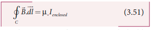

where Ienclosed is the net current linked by the closed loop C. Note that the line integral does not depend on the shape of the path or the position of the conductor with the magnetic field.

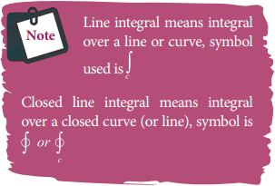

### Magnetic field due to the current carrying wire of infinite length using Ampère’s law

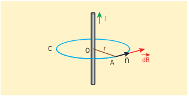

Consider a straight conductor of infinite length carrying current I and the direction of magnetic field lines is shown in Figure 3.37. Since the wire is
geometrically cylindrical in shape and symmetrical about its axis, we construct an Ampèrian loop in the form of a circular shape at a distance r from the centre of the conductor as shown in Figure 3.37. From
the Ampère’s law, we get

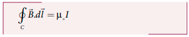

where dl is the line element along the Amperian loop (tangent to the circular loop). Hence, the angle between magnetic field vector and line element is zero. Therefore

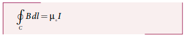

where I is the current enclosed by the Ampèrian loop. Due to the symmetry, the magnitude of the magnetic field is uniform over the Ampèrian loop. Hence

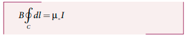

For a circular loop, the circumference is 2πr, which implies,

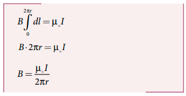

In vector form, the magnetic field is

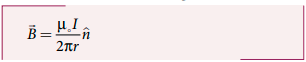

where n is the unit vector along the tangent to the Ampèrian loop as shown in the Figure 3.37.

\*EXAMPLE 3.15\*\*

Compute the magnitude of the magnetic field of a long, straight wire carrying a current of 1 A at distance of 1m from it. Compare it with Earth’s magnetic field.

**_Solution_**

Given that I = 1 A and radius r = 1 m

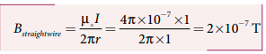

But the Earth’s magnetic field is BEarth  10−5 T.
So, Bstraightwire is one hundred times smaller
than BEarth.

**Solenoid**

A solenoid is a long coil of wire closely wound in the form of helix as shown in Figure 3.38. When electric current is passed through the solenoid, the magnetic field is produced. The magnetic field of the solenoid is due to the superposition of magnetic fields of each turn of the solenoid. The direction of magnetic field due to solenoid is given by right hand
palm-rule. Inside the solenoid, the magnetic field
is nearly uniform and parallel to its axis whereas outside the solenoid the field is negligibly small. Based on the direction of the current, one end of the solenoid behaves like North Pole and the other end behaves like South Pole. The current carrying solenoid is held in right hand. If the fingers curl in the direction of current, then extended thumb gives the direction of magnetic field of current carrying solenoid. It is shown in

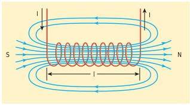

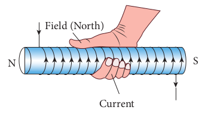

Figure 3.39. Hence, the magnetic field of a solenoid looks like the magnetic field of a bar magnet.

The solenoid is assumed to be long which means that the length of the solenoid is large when compared to its diameter. The winding need not to be always circular, it can also be in other shapes. We consider
here only circularly wound solenoid as shown in Figure 3.40.

### Magnetic field due to a long current carrying solenoid

Consider a solenoid of length _L_ having _N_ turns. The diameter of the solenoid is assumed to be much smaller when compared to its length and the coil is wound very closely.

**Figure 3.41 Amperian loop for solenoid**

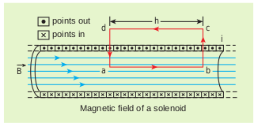

In order to calculate the magnetic field at any point inside the solenoid, we use Ampere’s circuital law. Consider a rectangular loop abcd as shown in Figure 3.41. Then from Ampère’s circuital law,

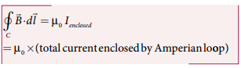

The left hand side of the equation is

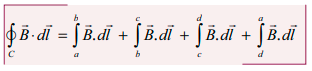

Since the elemental lengths along bc and da are perpendicular to the magnetic field which is along the axis of the solenoid, the integrals

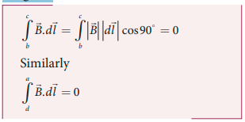

Since the magnetic field outside the
solenoid is zero, the integral.
For the path along ab, the integral is

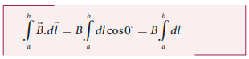

where the length of the loop ab as shown in
the Figure 3.41 is h. But the choice of length
of the loop ab is arbitrary. We can take very
large loop such that it is equal to the length
of the solenoid L. Therefore the integral is

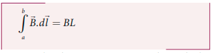

Let I be the current passing through the
solenoid of N turns, then

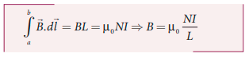

The number of turns per unit length is
given by N/L =n, Then

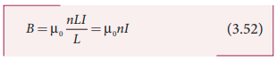

Since n is a constant for a given solenoid and μ0
is also constant. For a fixed current I, the magnetic field inside the solenoid is also
a constant.

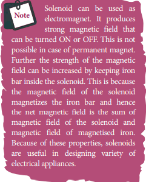

**EXAMPLE 3.16**

Calculate the magnetic field inside a solenoid, when

(a) the length of the solenoid becomes twice with fixed number of turns

(b) both the length of the solenoid and number of turns are doubled

(c) the number of turns becomes twice for the fixed length of the solenoid

Compare the results.

**_Solution_**

The magnetic field of a solenoid (inside) is

length of the solenoid becomes twice with fixed number of turns L→2L (length becomes twice) N→N (number of turns remains constant)
The magnetic field is

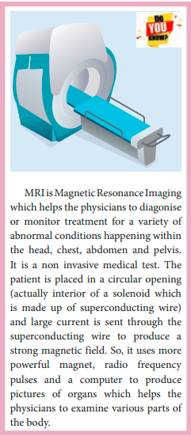

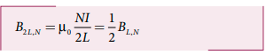

(b) both the length of the solenoid and
number of turns are doubled
L→2L (length becomes twice)
N→2N (number of turns becomes
twice)
The magnetic field is

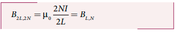

(c) the number of turns becomes twice
but the length of the solenoid remains same
L→L (length is fixed)
N→2N (number of turns becomes twice)
The magnetic field is

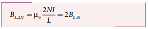

From the above results,

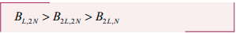

### Toroid

A solenoid is bent in such a way its ends are joined together to form a closed ring shape, is called a toroid which is shown in Figure 3.42. The magnetic field has constant magnitude inside the toroid whereas in the interior region (say, at point P) and exterior region (say, at point Q), the magnetic field is zero.

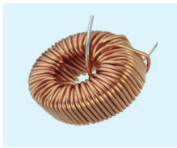

**(a) Open space interior to the toroid**
Let us calculate the magnetic field BP at
point P. We construct an Amperian loop 1
of radius r1 around the point P as shown in

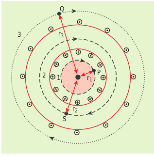

Figure 3.43. For simplicity, we take circular
loop so that the length of the loop is its
circumference.

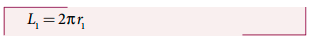

Ampère’s circuital law for the loop 1 is

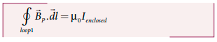

Since the loop 1 encloses no current, Ienclosed= 0

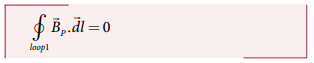

This is possible only if the magnetic field at point P vanishes i.e.

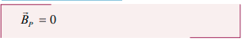

**(b) Open space exterior to the toroid**
Let us calculate the magnetic field BQ at point Q. We construct an Amperian loop 3 of radius r3 around the point Q as shown in Figure 3.43. The length of the loop is

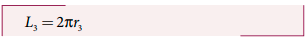

Ampère’s circuital law for the loop 3 is

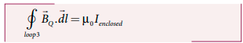

Since in each turn of the toroid loop,
current coming out of the plane of paper is
cancelled by the current going into the plane
of paper. Thus, I
enclosed= 0

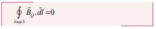

This is possible only if the magnetic field
at point Q vanishes i.e.

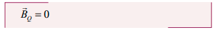

**(c) Inside the toroid**

Let us calculate the magnetic field BS at point S by constructing an Amperian loop 2 of radius r2 around the point S as shown in Figure 3.43. The length of the loop is

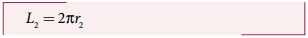

Ampere’s circuital law for the loop 2 is

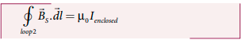

Let I be the current passing through the toroid and N be the number of turns of the toroid, then

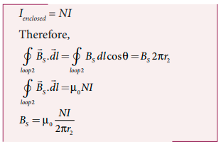

If the number of turns per unit length
$n = $ frac{N}\{2\pi r^2} $, then the magnetic field at point S is

