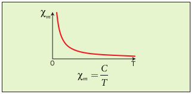
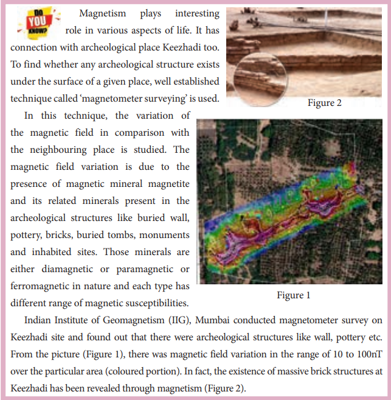

---
title: 'classification of magnetic materials'
weight: 5
extensions:
- katex
---   

## Classification of magnetic materials

The magnetic materials are generally classified into three types based on their behaviour in a magnetising field. They are diamagnetic, paramagnetic and ferromagnetic materials.

 **(a) Diamagnetic materials**

The orbital motion of electrons around the nucleus produces a magnetic field perpendicular to the plane of the orbit. Thus each electron orbit has finite orbital 
magnetic dipole moment. Since the orbital 
planes of the other electrons are oriented in 
random manner, the vector sum of magnetic 
moments is zero and there is no resultant 
magnetic moment for each atom.

In the presence of a uniform external 
magnetic field, some electrons are speeded 
up and some are slowed down. The electrons 
whose moments were anti-parallel are 
speeded up according to Lenz’s law and this 
produces an induced magnetic moment in a 
direction opposite to the field. The induced 
moment disappears as soon as the external 
field is removed. 

When placed in a non-uniform magnetic 
field, the interaction between induced 
magnetic moment and the external field 
creates a force which tends to move the 
material from stronger part to weaker part of 
the external field. It means that diamagnetic 
material is repelled by the field. 
This action is called diamagnetic action 
and such materials are known as diamagnetic 
materials. Examples: Bismuth, Copper and 
Water etc.

The properties of diamagnetic materials 
are 

1. Magnetic susceptibility is negative.

2. Relative permeability is slightly less than 
unity.

3. The magnetic field lines are repelled or 
expelled by diamagnetic materials when 
placed in a magnetic field.

4. Susceptibility is nearly temperature 
independent.

**Figure 3.18** Meissner effect – 
superconductors behave like perfect 
diamagnetic materials below 
transition temperature TC.

**(b) Paramagnetic materials**

In some magnetic materials, each atom or 
molecule has net magnetic dipole moment 
which is the vector sum of orbital and spin 
magnetic moments of electrons. Due to 
the random orientation of these magnetic 
moments, the net magnetic moment of the 
materials is zero.

**Magnetic levitated train**

Magnetic levitated train 
is also called Maglev train. 
This train floats few centimetres above 
the guideway because of electromagnet 
used. Maglev train does not need wheels 
and also achieve greater speed. The basic 
mechanism of working of Maglev train 
involves two sets of magnets. One set is 
used to repel which makes train to float 
above the track and another set is used to 
move the floating train ahead at very great 
speed. These trains are quieter, smoother 
and environmental friendly compared 
conventional trains and have potential 
for moving with much higher speeds with 
technology in future.

In the presence of an external 
magnetic field, the torque acting on the 
atomic dipoles will align them in the field 
direction. As a result, there is net magnetic 
dipole moment induced in the direction 
of the applied field. The induced dipole 
moment is present as long as the external 
field exists.
When placed in a non-uniform 
magnetic field, the paramagnetic 
materials will have a tendency to move 
from weaker to stronger part of the field. 
Materials which exhibit weak magnetism 
in the direction of the applied field 
are known as paramagnetic materials. 

Examples: Aluminium, Platinum, 
Chromium and Oxygen etc.

The properties of paramagnetic materials 
are: 
1. Magnetic susceptibility is positive and 
small.
2. Relative permeability is greater than 
unity.
3. The magnetic field lines are attracted 
into the paramagnetic materials when 
placed in a magnetic field.
4. Susceptibility is inversely proportional 
to temperature.

**Curie’s law**

When temperature is increased, thermal 
vibration will upset the alignment of 
magnetic dipole moments. Therefore, the 
magnetic susceptibility decreases with 
increase in temperature. In many cases, the 
susceptibility of the materials is 

This relation is called Curie’s law. Here 
C is called Curie constant and temperature 
T is in kelvin. The graph drawn between 
magnetic susceptibility and temperature 
is shown in Figure 3.19, which is a 
rectangular hyperbola. 

**Figure 3.19** Curie’s law – susceptibility vs 
temperature

**(c) Ferromagnetic materials**

An atom or a molecule in a ferromagnetic 
material possesses net magnetic dipole 
moment as in a paramagnetic material. 
A ferromagnetic material is made up of 
smaller regions, called ferromagnetic 
domains (Figure 3.20). Within each 
domain, the magnetic moments are 
spontaneously aligned in a direction. This 
alignment is caused by strong interaction 
arising from electron spin which depends 
on the inter-atomic distance. Each domain 
has net magnetisation in a direction. 
However the direction of magnetisation 
varies from domain to domain and 
thus net magnetisation of the specimen is 
zero.

**Figure 3.20** Magnetic domains – ferromagnetic materials

In the presence of external magnetic 
field, two processes take place 

1. The domains having magnetic moments 
parallel to the field grow bigger in size 

2. The other domains (not parallel to field)
are rotated so that they are aligned with 
the field.

As a result of these mechanisms, 
there is a strong net magnetisation of the 
material in the direction of the applied field 
(Figure 3.21).

**Figure 3.21** Processes of domain magnetization

When placed in a non-uniform 
magnetic field, the ferromagnetic materials 
will have a strong tendency to move 
from weaker to stronger part of the field. 
Materials which exhibit strong magnetism 
in the direction of applied field are called 
ferromagnetic materials. Examples: Iron, 
Nickel and Cobalt. 
The properties of ferromagnetic 
materials are:

1. Magnetic susceptibility is positive and 
large.

2. Relative permeability is large.

3. The magnetic field lines are strongly 
attracted into the ferromagnetic 
materials when placed in a magnetic 
field.

4. Susceptibility is inversely proportional 
to temperature.

**Curie-Weiss law**

As temperature increases, the 
ferromagnetism decreases due to the 
increased thermal agitation of the atomic 
dipoles. At a particular temperature, 
ferromagnetic material becomes 
paramagnetic. This temperature is known 
as Curie temperature TC. The susceptibility 
of the material above the Curie temperature 
is given by

This relation is called Curie-Weiss law. 
The constant C is called Curie constant and 
temperature T is in kelvin scale. A plot of 
magnetic susceptibility with temperature is 
as shown in Figure 3.22.

**Figure 3.22** Curie-Weiss law – 
susceptibility vs temperature

**Spin**

Like mass and charge for 
particles, spin is also another 
important attribute for an elementary 
particle. Spin is a quantum mechanical 
phenomenon which is responsible for 
magnetic properties of the material. 
Spin in quantum mechanics is entirely 
different from spin we encounter in 
classical mechanics. Spin in quantum 
mechanics does not mean rotation; it 
is intrinsic angular momentum which 
does not have classical analogue. For 
historical reason, the name spin is 
retained. Spin of a particle takes only 
positive values but the orientation of the 
spin vector takes plus or minus values 
in an external magnetic field. For an 
example, electron has spin s = 1/2. In the 
presence of magnetic field, the spin will 
orient either parallel or anti-parallel to 
the direction of magnetic field. 

