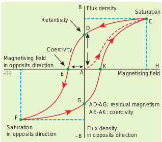
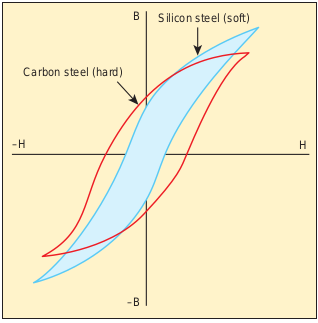
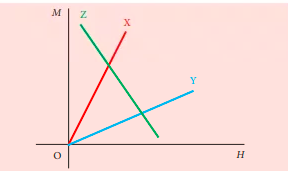
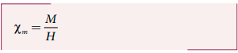

## 3.6 HYSTERESIS

When a ferromagnetic material is kept in a magnetising field, the material gets magnetised by induction. An important characteristic of ferromagnetic material is that the variation of magnetic induction  B with magnetising field  H is not linear.

It means that the ratio B/H = µ is not a constant. Let us study this behaviour in detail.

A ferromagnetic material (example, Iron) is magnetised slowly by a magnetising field  H . The magnetic induction B of the material increases from point A with the magnitude of the magnetising field and then attains a saturation level. This response of the material is depicted by the path AC as shown in Figure 3.23. Saturation magnetization is defined as the maximum point up to which the material can be magnetised by applying the magnetising field.

If the magnetising field is now reduced, the magnetic induction also decreases but does not retrace the original path CA. It takes different path CD. When the magnetising field is zero, the magnetic induction is not zero and it has positive value. This implies that some magnetism is left in the specimen even when _H_ = 0. The residual magnetism AD present in the specimen is called remanence or retentivity. **Remanence is defined as the ability of the materials to retain the magnetism in them even after the magnetising field disappears.**

In order to demagnetise the material, the magnetising field is gradually increased in the reverse direction. Now the magnetic induction decreases along DE and becomes zero at E. The magnetising field AE in the reverse direction is required to bring residual magnetism to zero. **The magnitude of the reverse magnetising field for which the residual magnetism of the material vanishes is called its coercivity.**

Further increase of  _H_ in the reverse direction causes the magnetic induction to increase along EF until it reaches saturation at F in the reverse direction. If magnetising field is decreased and then increased with direction reversed, the magnetic induction traces the path FGKC. This closed curve ACDEFGKC is called hysteresis loop and it corresponds to one cycle of magnetisation.

In the entire cycle, the magnetic induction _B_ lags behind the magnetising field _H_. This **phenomenon of lagging of magnetic induction behind the magnetising field is called hysteresis.** Hysteresis means ‘lagging behind’.

**Hysteresis loss**
During the magnetisation of the specimen through a cycle, there is loss of energy in the form of heat. This loss is attributed to the rotation and orientation of molecular magnets in various directions. It is found that the energy lost (or dissipated) per unit volume of the material when it is carried through one cycle of magnetisation is equal to the area of the hysteresis loop.

**Hard and soft magnetic materials** Based on the shape and size of

the hysteresis loop, ferromagnetic materials are classified as soft magnetic materials with smaller area and hard magnetic materials with larger area. The comparison of the hysteresis loops for two magnetic materials is shown in Figure 3.24. Properties of soft and hard magnetic materials are compared in Table 3.2.

**Table 3.2 Differences between soft and hard ferromagnetic materials**

| **S.No.** | **Properties**                           | **Soft ferromagnetic materials**                   | **Hard ferromagnetic materials**     |
| --------- | ---------------------------------------- | -------------------------------------------------- | ------------------------------------ |
| 1         | When external field is removed           | Magnetisation disappears                           | Magnetisation persists               |
| 2         | Area of the loop                         | Small                                              | Large                                |
| 3         | Retentivity                              | Low                                                | High                                 |
| 4         | Coercivity                               | Low                                                | High                                 |
| 5         | Susceptibility and magnetic permeability | High                                               | Low                                  |
| 6         | Hysteresis loss                          | Less                                               | More                                 |
| 7         | Uses                                     | Solenoid core, transformer core and electromagnets | Permanent magnets                    |
| 8         | Examples                                 | Soft iron, Mumetal, Stalloy etc.                   | Carbon steel, Alnico, Lodestone etc. |

**Applications of hysteresis loop** The significance of hysteresis loop is that it provides information such as retentivity, coercivity, permeability, susceptibility and energy loss during one cycle of magnetisation for each ferromagnetic material. Therefore, the study of hysteresis loop will help us in selecting proper and suitable material for a given purpose. Some examples:

**i) Permanent magnets:** The materials with high retentivity, high coercivity and low permeability are suitable for making permanent magnets. Examples: Carbon steel and Alnico

**ii) Electromagnets:** The materials with high initial permeability, low retentivity, low coercivity and thin hysteresis loop with smaller area are preferred to make electromagnets.

Examples: Soft iron and Mumetal (Nickel Iron alloy).

**iii) Core of the transformer:** The materials with high initial permeability, large magnetic induction and thin hysteresis loop with smaller area are needed to design transformer cores. **Examples:** Soft iron

**EXAMPLE 3.11**

The following figure shows the variation of intensity of magnetisation with the applied magnetic field intensity for three magnetic materials X, Y and Z. Identify the materials X,Y and Z.

**_Solution_**

The slope of _M-H_ graph is a measure of the magnetic susceptibility, which is given by

Material X: Slope is positive and larger value. So, it is a ferromagnetic material.

Material Y: Slope is positive and lesser value than X. So, it could be a paramagnetic material.

Material Z: Slope is negative and hence, it is a diamagnetic material.
