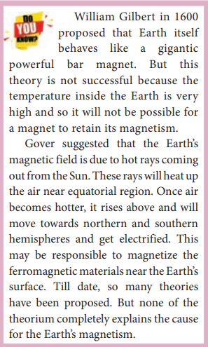
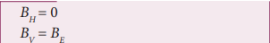
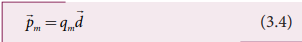
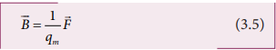
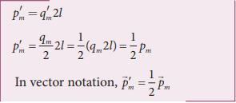
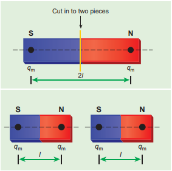
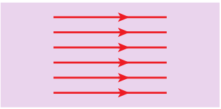
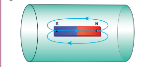

---
title: 'Introduction to Magnetism'
weight: 1
extensions:

- katex
---   
# INTRODUCTION TO MAGNETISM

Magnets! No doubt, their behaviour will 
attract everyone. The world enjoys their 
benefits, to lead a modern luxurious life. 
The study of magnets fascinated scientists 
around our globe for many centuries and 
even now, door for research on magnets is 
still open (Figure 3.1).

Magnetism exists everywhere from tiny particles like electrons to the entire universe. Historically the word ‘magnetism’ was derived from iron ore magnetite (Fe3O4). In olden days, magnets were used as magnetic compass for navigation, magnetic therapy for treatment and also used in magic shows.

In modern days, many things we use in our daily life contain magnets (Figure 3.2). Motors, cycle dynamo, loudspeakers, magnetic tapes used in audio and video recording, mobile phones, head phones, CD, pen-drive, hard disc of laptop, refrigerator door, generator are a few examples.

Earlier, both electricity and magnetism were thought to be two independent branches in physics. In 1820, H.C. Oersted observed the deflection of magnetic compass needle kept near a current carrying wire. This unified the two different branches, electricity and magnetism as a single subject ‘electromagnetism’ in physics.

In this unit, basics of magnets and their properties are given. Later, how a current carrying conductor (here only steady current, not time-varying current is considered) behaves like a magnet is presented.

**Figure 3.2** Uses of magnets in modern 
world – (a) speakers (b) head phones 
(c) MRI scan (d) Hard disc of laptop

## Earth’s magnetic field and magnetic elements

**Figure 3.3** Earth’s magnetic field

From the activities performed in lower 
classes, you might have noticed that the needle 
in a magnetic compass or freely suspended 
magnet comes to rest in a position which is 
approximately along the geographical northsouth direction of the Earth.

The north pole of magnetic compass 
needle is attracted towards the magnetic 
south pole of the Earth which is near the 
geographic north pole (Figure 3.3). Similarly, 
the south pole of magnetic compass needle is 
attracted towards the magnetic north-pole of 
the Earth which is near the geographic south 
pole. **The branch of physics which deals 
with the Earth’s magnetic field is called 
Geomagnetism or Terrestrial magnetism**.
 There are three quantities required to 
specify the magnetic field of the Earth on its 
surface, which are often called as the elements 
of the Earth’s magnetic field. They are 

(a) magnetic declination (D)

(b) magnetic dip or inclination (I)

(c) the horizontal component of the 
Earth’s magnetic field (BH)

**Figure 3.4** Declination angle

Day and night occur because Earth spins 
about an axis called geographic axis. A vertical 
plane passing through the geographic axis is 
called geographic meridian and a great circle 
perpendicular to Earth’s geographic axis is 
called geographic equator. 

The straight line which connects magnetic 
poles of Earth is known as magnetic axis. 

A vertical plane passing through magnetic 
axis is called magnetic meridian and a great 
circle perpendicular to Earth’s magnetic axis 
is called magnetic equator.

When a magnetic needle is freely 
suspended, the alignment of the magnet 
does not exactly lie along the geographic 
meridian as shown in Figure 3.4. **The angle 
between magnetic meridian at a point 
and geographical meridian is called the 
declination or magnetic declination (D)**. At 
higher latitudes, the declination is greater 
whereas near the equator, the declination is 
smaller. In India, declination angle is very 
small and for Chennai, magnetic declination 
angle is –1o 16ʹ (which is negative (west)). 

**The angle subtended by the Earth’s 
total magnetic field 
B with the horizontal 
direction in the magnetic meridian is 
called dip or magnetic inclination (I)
at that point** (Figure 3.5). For Chennai, 
inclination angle is 14o
 28ʹ. **The component of Earth’s magnetic field along the horizontal direction in the magnetic 
meridian is called horizontal component of Earth’s magnetic field, denoted by BH**.

 Let BE be the net Earth’s magnetic field 
at any point on the surface of the Earth. 
BE can be resolved into two perpendicular 
components.

Dividing equation (3.2) and (3.1), we get

**Figure 3.5** Inclination angle

1. At magnetic equator
The Earth’s magnetic field is parallel to the 
surface of the Earth (i.e., horizontal) which 
implies that the needle of magnetic compass 
rests horizontally at an angle of dip, I = 0^0
.

This implies that the horizontal component is maximum and vertical component is zero at the equator.

2. At magnetic poles 
The Earth’s magnetic field is perpendicular to the surface of the Earth (i.e., vertical) which implies that the needle of magnetic compass rests vertically at an angle of dip, I = 90o. Hence,

This implies that the vertical component 
is maximum at poles and horizontal 
component is zero at poles. 

   **Aurora Borealis and Aurora Australis**

People living at high latitude regions (near Arctic or Antarctic) might experience dazzling coloured natural lights across the night sky. This ethereal display on the sky is known as aurora borealis (northern lights) or aurora 
australis (southern lights). These lights are often called as polar lights. The lights are seen above the magnetic poles of the northern and southern hemispheres. They are called as “Aurora 
borealis” in the north and “Aurora australis” in the south. This occurs as a result of interaction 
between the gaseous particles in the Earth’s atmosphere with highly charged particles released 
from the Sun’s atmosphere through solar wind. These particles emit light due to collision and variations in colour are due to the type of the gas particles that take part in the collisions. A pale yellowish – green colour is produced when the ionized oxygen takes part in the collision and a blue or purplish – red aurora is produced due to ionized nitrogen molecules.

 

## Basic properties of magnets

Some basic terminologies and properties 
used in describing bar magnet. 

**(a) Magnetic dipole moment**

Consider a bar magnet as shown in 
Figure 3.6. Let qm be the pole strength of 
the magnetic pole and let l be the distance 
between the geometrical centre of bar 
magnet O and one end of the pole.**The 
magnetic dipole moment is defined as the 
product of its pole strength and magnetic 
length**. It is a vector quantity, denoted 
by pm.

**Figure 3.6** A bar magnet

where d is the vector drawn from south 
pole to north pole and its magnitude 
d = 2l . The magnitude of magnetic dipole 
moment is pm=2 qm l
The SI unit of magnetic moment is A m2. 
The direction of magnetic moment is from 
south pole to north pole.

**(b) Magnetic field**

Magnetic field is the region or space 
around every magnet within which its 
influence will be felt by keeping another 
magnet in that region. **The magnetic field B at a point is defined as a force experienced 
by the bar magnet of unit pole strength**.

Its unit is N A–1 m–1. 

**(c) Types of magnets**

Magnets are classified into natural 
magnets and artificial magnets. For 
example, iron, cobalt, nickel, etc. are natural 
magnets. Strengths of natural magnets are 
very weak and the shapes of the magnet are 
irregular. Artificial magnets are made in 
order to have desired shape and strength. 
If the magnet is in the form of rectangular 
shape or cylindrical shape, then it is known 
as bar magnet.

**Properties of magnet**

The following are the properties of bar 
magnet (Figure 3.7),
1. A freely suspended bar magnet will always 
point along the north-south direction.
2. A magnet attracts or repels another 
magnet or magnetic substances towards 
itself. The attractive or repulsive force 
is maximum near the end of the bar 
magnet. When a bar magnet is dipped 
into iron filling, they cling to the ends of 
the magnet. 
3. When a magnet is broken into pieces, each 
piece behaves like a magnet with poles at 
its ends.
4. Two poles of a magnet have pole strength 
equal to one another. 
5. The length of the bar magnet is called 
geometrical length and the length between 
two magnetic poles in a bar magnet is 
called magnetic length. Magnetic length 
is always slightly smaller than geometrical 
length. The ratio of magnetic length and 
geometrical length is 5/6.

**Figure 3.7** Properties of bar magnet

**EXAMPLE 3.2**
Let the magnetic moment of a bar magnet 
be pm whose magnetic length is d = 2l and 
pole strength is qm. Compute the magnetic 
moment of the bar magnet when it is cut 
into two pieces 

(a) along its length

(b) perpendicular to its length. 

**Solution**

(a) a bar magnet cut into two pieces along 
its length:

When the bar magnet is cut along the axis 
into two pieces, new magnetic pole strength 
is q′m = qm/2 but magnetic length does not 
change. So, the magnetic moment is 

(b) A bar magnet cut into two pieces 
perpendicular to the axis:

When the bar magnet is cut perpendicular 
to the axis into two pieces, magnetic pole 
strength will not change but magnetic length 
will be halved. So the magnetic moment is 

**EXAMPLE 3.3**

Compute the magnetic length of a uniform 
bar magnet if the geometrical length of the 
magnet is 12 cm. Mark the positions of 
magnetic pole points. 

 

**Magnetic field lines**

1. Magnetic field lines are continuous closed 
curves. The direction of magnetic field lines 
is from North pole to South pole outside the 
magnet and from South pole to North pole 
inside the magnet. 
2. The direction of magnetic field at any point 
on the curve is known by drawing tangent 
to the magnetic field lines at that point. 
3. Magnetic field lines never intersect each 
other. Otherwise, the magnetic compass 
needle would point towards two different 
directions, which is not possible. 
4. The degree of closeness of the field lines 
determines the relative strength of the 
magnetic field. The magnetic field is 
strong where magnetic field lines crowd 
and weak where magnetic field lines are 
well separated.

**(d) Magnetic flux**

**The number of magnetic field lines 
crossing any area normally is defined 
as magnetic flux ΦB through the area**.
Mathematically, the magnetic flux through 
a surface of area A in a uniform magnetic 
field B is defined as

where θ is the angle between B and A as 
shown in Figure 3.8.

**Figure 3.8** Magnetic flux

**Special cases**

(a) When B is normal to the surface i.e.,
θ = 0o, the magnetic flux is ΦB = BA
(maximum). 

(b) When B is parallel to the surface i.e., 
θ = 90o, the magnetic flux is ΦB = 0. 
Suppose the magnetic field is not uniform over the surface, the equation (3.6) can be written as

Magnetic flux is a scalar quantity. The 
SI unit for magnetic flux is weber, which 
is denoted by symbol Wb. Dimensional 
formula for magnetic flux is [ML2T-2A-1] . The CGS unit of magnetic flux is maxwell.

**The magnetic flux density is defined 
as the number of magnetic field lines 
crossing per unit area kept normal to 
the direction of lines of force**. Its unit is 
Wb m–2 or tesla (T). 

**(e) Uniform magnetic field and Non-uniform magnetic field**

**Uniform magnetic field**

Magnetic field is said to be uniform if it 
has same magnitude and direction at all the 

**Figure 3.9** Uniform magnetic field

points in a given region. Example, locally 
Earth’s magnetic field is uniform.
  The magnetic field of Earth has same value over the entire area of your school!

**Non-uniform magnetic field**

Magnetic field is said to be non-uniform 
if the magnitude or direction or both vary 
at different points in a region. Example: 
magnetic field of a bar magnet

**Figure 3.10** Non-uniform magnetic field 
(a) direction is constant (b) direction is 
not a constant (c) both magnitude and 
direction are not constant (d) magnetic 
field of a bar magnet

**EXAMPLE 3.4**

Calculate the magnetic flux coming out 
from closed surface containing magnetic 
dipole (say, a bar magnet) as shown in 
figure.

**Solution**

The total flux emanating from the 
closed surface S enclosing the dipole is 
zero. So, 

Here the integral is taken over closed 
surface. Since no isolated magnetic pole 
(called magnetic monopole) exists, this 
integral is always zero,

This is similar to Gauss’s law in 
electrostatics.

