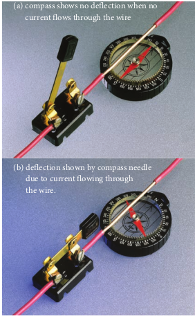
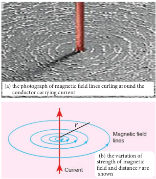
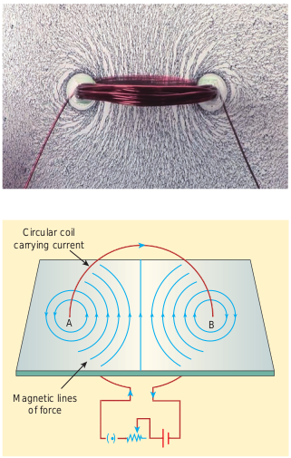
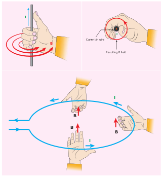
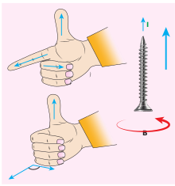
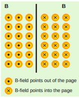
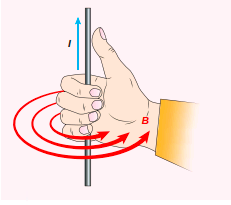

## 3.7 MAGNETIC EFFECTS OF CURRENT

### 3.7.1 Oersted experiment

In 1820 Hans Christian Oersted, while preparing for his lecture in physics, noticed that electric current passing through a wire deflects the nearby magnetic needle in the compass. By proper investigation, he observed that the deflection of magnetic needle is due to the change in magnetic field produced around current carrying conductor (Figure 3.25). When the direction of current is reversed, the magnetic needle is deflected in the opposite direction. This lead to the development of the theory ‘electromagnetism’ which unifies two branches in physics namely, electricity and magnetism.

(b) deflection shown by compass needle due to current flowing through the wire.

(a) compass shows no deflection when no current flows through the wire

### 3.7.2 Magnetic field around a straight current-carrying conductor and circular loop

**(a) Current carrying straight conductor:**
Suppose we keep a magnetic compass near a current-carrying straight conductor, then the needle of the magnetic compass experiences a torque and deflects to align in the direction of the magnetic field at that point. Tracing out the direction shown by magnetic needle , we can draw the magnetic field lines at a distance. For a straight current-carrying conductor, the nature of magnetic field is like concentric circles having their common centre on the axis of the conductor as shown in Figure 3.26 (a).

**(b) Circular coil carrying current**
Suppose we keep a magnetic compass near a current carrying circular conductor, then the needle of the magnetic compass experiences a torque and deflects to align in the direction of the magnetic field at that point. We can notice that at the points A and B in the vicinity of the coil, the magnetic field lines are circular. The magnetic field lines are nearly parallel to each other near the centre of the loop, indicating that the field present near the centre of the coil is almost uniform (Figure 3.27).

The strength of the magnetic field is increased if either the current in the coil or the number of turns or both are increased. The polarity (north pole or south pole) depends on the direction of current in the loop.

**Figure 3.27 The magnetic field lines** curling around the circular coil carrying current.

### 3.7.3 Right hand thumb rule

The right hand rule is used to find the direction of magnetic field when the direction of current in a conductor is known.

**Assume that we hold the current carrying conductor in our right hand such that the thumb points in the direction of current flow, then the fingers encircling the conductor point in the direction of the magnetic field lines produced.**

The Figure 3.28 shows the right hand rule for current carrying straight conductor and circular coil.

### 3.7.4 Maxwell’s right hand cork screw rule

This rule can also be used to find the direction of the magnetic field around the current-carrying conductor. If we rotate a right-handed screw using a screw driver, then the direction of current is same as the direction in which screw advances and the direction of rotation of the screw gives the direction of the magnetic field. (Figure 3.29)

**EXAMPLE 3.12**

The magnetic field shown in the figure is due to the current carrying wire. In which direction does the current flow in the wire?.

**_Solution_**

