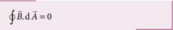
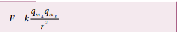
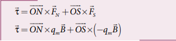
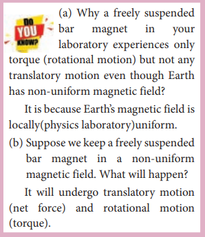
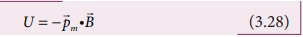

  

 **U N I T 3 MAGNETISM AND MAGNETIC EFFECTS OF ELECTRIC CURRENT**

> “The magnetic force is animate, the human soul while it imitates a soul; in many respects it surpasses s united to an organic body”_ – William Gilbert

## **Learning Objectives**

>>>>>>> 69cc6d398c5d50866a02f0fb7bd63d73e2532e75

**In this unit, the student is exposed to**

• Earth’s magnetic field and magnetic elements

• Basic properties of magnets

• Statement of Coulomb inverse square law of m

• Magnetic dipole

• Magnetic field due to a dipole along axial line a

• Torque acting on a bar magnet in a uniform m

• Potential energy of a bar magnet placed in a un

• Magnetic properties – permeability, susceptibi

• Classification of magnetic materials – dia, para

• Concept of Hysteresis

• Magnetic effects of electric current – long strai

• Right hand thumb rule and Maxwell’s right han

• Biot-Savart’s law – applications

• Tangent law and Tangent Galvanometer

• Current loop as a magnetic dipole

• Magnetic dipole moment of revolving electron

• Ampère’s circuital law – applications

• Solenoid and toroid

• Lorentz force – charged particle moving in an

• Cyclotron

• Force on a current carrying conductor in a ma

• Force between two long parallel current carryi

• Torque on a current loop in a magnetic field

• Moving Coil Galvanometer
<<<<<<< HEAD
  
## 3.1  INTRODUCTION TO MAGNETISM

=======

  

## INTRODUCTION TO MAGNETISM

>>>>>>> 69cc6d398c5d50866a02f0fb7bd63d73e2532e75
**Figure 3.1:** Magnetic levitation

Magnets! No doubt, their behaviour will attract everyone. The world enjoys their benefits, to lead a modern luxurious life. The study of magnets fascinated scientists around our globe for many centuries and even now, door for research on magnets is still open (Figure 3.1).

Many birds and animals have magnetic sense in their eyes using Earth’s

magnetic field for navigation.

Magnetic sensing in eyes - for Zebra finch bird, due to protein cryptochromes Cry4 present in retina; the bird uses Earth's magnetic field for navigation  

Magnetism exists everywhere from tiny particles like electrons to the entire universe. Historically the word ‘magnetism’ was derived from iron ore magnetite (Fe3O4). In olden days, magnets were used as magnetic compass for navigation, magnetic therapy for treatment and also used in magic shows.

In modern days, many things we use in our daily life contain magnets (Figure 3.2). Motors, cycle dynamo, loudspeakers, magnetic tapes used in audio and video recording, mobile phones, head phones, CD, pen-drive, hard disc of laptop, refrigerator door, generator are a few examples.

Earlier, both electricity and magnetism were thought to be two independent branches in physics. In 1820, H.C. Oersted observed the deflection of magnetic compass needle kept near a current carrying wire. This unified the two different branches, electricity and magnetism as a single subject ‘electromagnetism’ in physics.

In this unit, basics of magnets and their properties are given. Later, how a current carrying conductor (here only steady current, not time-varying current is considered) behaves like a magnet is presented.

Figure 3.2  Uses of magnets in modern world – (a) speakers (b) head phones (c) MRI scan (d) Hard disc of laptop

<<<<<<< HEAD

### Earth’s magnetic field and magnetic elements
**Figure 3.1.1 Earth’s magnetic field**

=======
**Figure 3.2 Uses of magnets in modern 
world – (a) speakers (b) head phones 
(c) MRI scan (d) Hard disc of laptop**

  

### Earth’s magnetic field and magnetic elements

**Figure 3.3 Earth’s magnetic field**
>>>>>>> 69cc6d398c5d50866a02f0fb7bd63d73e2532e75

**Figure 3.3 Earth’s magnetic field**From the activities performed in lower classes, you might have noticed that the needle in a magnetic compass or freely suspended magnet comes to rest in a position which is approximately along the geographical north- south direction of the Earth.

William Gilbert in 1600 proposed that Earth itself behaves like a gigantic

powerful bar magnet. But this theory is not successful because the temperature inside the Earth is very high and so it will not be possible for a magnet to retain its magnetism.

Gover suggested that the Earth’s magnetic field is due to hot rays coming out from the Sun. These rays will heat up the air near equatorial region. Once air becomes hotter, it rises above and will move towards northern and southern hemispheres and get electrified. This may be responsible to magnetize the ferromagnetic materials near the Earth’s surface. Till date, so many theories have been proposed. But none of the theorium completely explains the cause for the Earth’s magnetism.  

The north pole of magnetic compass needle is attracted towards the magnetic south pole of the Earth which is near the geographic north pole (Figure 3.3). Similarly, the south pole of magnetic compass needle is attracted towards the magnetic north-pole of the Earth which is near the geographic south pole. **The branch of physics which deals with the Earth’s magnetic field is called Geomagnetism or Terrestrial magnetism.**

There are three quantities required to specify the magnetic field of the Earth on its surface, which are often called as the elements of the Earth’s magnetic field. They are

(a) magnetic declination (_D_) (b) magnetic dip or inclination (_I_) (c) the horizontal component of the

Earth’s magnetic field (_BH_)

<<<<<<< HEAD

=======
>>>>>>> 69cc6d398c5d50866a02f0fb7bd63d73e2532e75

**Figure 3.4 Declination Angle**

**Figure 3.4 Declination angle**

Day and night occur because Earth spins about an axis called geographic axis. A vertical plane passing through the geographic axis is called geographic meridian and a great circle perpendicular to Earth’s geographic axis is called geographic equator.

The straight line which connects magnetic poles of Earth is known as magnetic axis.A vertical plane passing through magnetic axis is called magnetic meridian and a great circle perpendicular to Earth’s magnetic axis is called magnetic equator.

When a magnetic needle is freely suspended, the alignment of the magnet does not exactly lie along the geographic meridian as shown in Figure 3.4. **The angle between magnetic meridian at a point and geographical meridian is called the _declination or magnetic declination_** (_D_). At higher latitudes, the declination is greater whereas near the equator, the declination is smaller. In India, declination angle is very small and for Chennai, magnetic declination angle is –1o 16ʹ (which is negative (west)).

**The angle subtended by the Earth’s total magnetic field**_B_ **with the horizontal direction in the magnetic meridian is called dip or magnetic inclination** (_I_) **at that point** (Figure 3.5). For Chennai, inclination angle is 14o 28ʹ. **The component of Earth’s magnetic field along the horizontal direction in the magnetic meridian is called horizontal component of Earth’s magnetic field, denoted by _BH_.**

Let _BE_ be the net Earth’s magnetic field at any point on the surface of the Earth. _BE_ can be resolved into two perpendicular components.

Dividing equation (3.2) and (3.1), we get

<<<<<<< HEAD

**Figure 3.5 Inclination Angle**

**(i) At magnetic equator** The Earth’s magnetic field is parallel to the
=======

**Figure 3.5 Inclination angle**
Horizontal

_I_

_B_

_BH_  

tan _I B B_

_V_

_H_

\= (3.3)

**1. At magnetic equator** The Earth’s magnetic field is parallel to the
>>>>>>> 69cc6d398c5d50866a02f0fb7bd63d73e2532e75

surface of the Earth (i.e., horizontal) which implies that the needle of magnetic compass rests horizontally at an angle of dip, _I_ = 0o.

This implies that the horizontal component is maximum and vertical component is zero at the equator.

**2. At magnetic poles** The Earth’s magnetic field is

perpendicular to the surface of the Earth (i.e., vertical) which implies that the needle of magnetic compass rests vertically at an angle of dip, _I_ = 90o. Hence,

This implies that the vertical component is maximum at poles and horizontal component is zero at poles.

**EXAMPLE 3.1**

The horizontal component and vertical component of Earth’s magnetic field at a place are 0.15 G and 0.26 G respectively. Calculate the angle of dip and resultant magnetic field. (G-gauss, cgs unit for magnetic field 1G = 10–4 T) 
**_Solution:_**

_BH_ = 0.15 G and _BV_ = 0.26 G

The resultant magnetic field of the Earth is

  

**3.1.2 Basic properties of magnets**

Some basic terminologies and properties used in describing bar magnet.

**(a) Magnetic dipole moment**

Consider a bar magnet as shown in Figure 3.6. Let _qm_ be the pole strength of the magnetic pole and let _l_ be the distance between the geometrical centre of bar magnet O and one end of the pole. **The magnetic dipole moment is defined as the product of its pole strength and magnetic length**. It is a vector quantity, denoted by _pm_.

<<<<<<< HEAD

=======
**S**

_q_m _l l_

_d_

_2l_

_q_m

**O N**

>>>>>>> 69cc6d398c5d50866a02f0fb7bd63d73e2532e75
**Figure 3.6 A bar magnet**

where _d_ is the vector drawn from south pole to north pole and its magnitude
_d l_\= 2 .

The magnitude of magnetic dipole moment is _p q lm m_\= 2

The SI unit of magnetic moment is A m2. The direction of magnetic moment is from south pole to north pole.

**(b) Magnetic field**

Magnetic field is the region or space around every magnet within which its influence will be felt by keeping another magnet in that region. **The magnetic field _B_ at a point is defined as a force experienced by the bar magnet of unit pole strength**.  

Its unit is N A–1 m–1.

 **(c) Types of magnets**

Magnets are classified into natural magnets and artificial magnets. For example, iron, cobalt, nickel, etc. are natural magnets. Strengths of natural magnets are very weak and the shapes of the magnet are irregular. Artificial magnets are made in order to have desired shape and strength. If the magnet is in the form of rectangular shape or cylindrical shape, then it is known as bar magnet.

 ## Properties of magnet

The following are the properties of bar magnet (Figure 3.7), 1. A freely suspended bar magnet will always

point along the north-south direction. 2. A magnet attracts or repels another

magnet or magnetic substances towards itself. The attractive or repulsive force is maximum near the end of the bar magnet. When a bar magnet is dipped into iron filling, they cling to the ends of the magnet.

3\. When a magnet is broken into pieces, each piece behaves like a magnet with poles at its ends.

4\. Two poles of a magnet have pole strength equal to one another.

5\. The length of the bar magnet is called geometrical length and the length between two magnetic poles in a bar magnet is called magnetic length. Magnetic length is always slightly smaller than geometrical length. The ratio of magnetic length and geometrical length is 5/6.

 Magnetic length/Geometrical length=5/6 =0.833.

**Figure 3.7 Properties of bar magnet**

**EXAMPLE 3.2**

Let the magnetic moment of a bar magnet be _pm_ whose magnetic length is _d_ = 2_l_ and pole strength is _qm_. Compute the magnetic moment of the bar magnet when it is cut into two pieces 
(a) along its length 
(b) perpendicular to its length.

 **_Solution_**
(a) a bar magnet cut into two pieces along its length:
<<<<<<< HEAD
=======

**S**

_q_m

2_l_

_Cut into two pieces along the axis_

_q_m

**N**

NORTHERLY DIRECTION

NS

N S

N S

NS Magnetic field lines

**S**

_q_m 2_l_

Cut into two pieces

_q_m

**N**

**\=**

**Figure 3.7 Properties of bar magnet**
**S**

_q_m

2_l_

_Cut into two pieces along the axis_

_q_m

**N**

2_l_

**S** _q_m 2

**S** _q_m 2

2_l_

**S** _q_m

**N**

2 _q_m 2

**S** _q_m

**N**

2 _q_m 2

**S**

_q_m _l_

_q_m

**N S**

_q_m _l_

_q_m

**N**

**S**

_q_m

2_l_

L

_q_m

**N**

Geometrical length of a bar magnet

Magnetic length of a bar magnet

|------|------|------|
| 2l |
>>>>>>> 69cc6d398c5d50866a02f0fb7bd63d73e2532e75
  

When the bar magnet is cut along the axis 
into two pieces, new magnetic pole strength 
is q′ m= q m/2 but magnetic length does not 
change. So, the magnetic moment is

(b) a bar magnet cut into two pieces 
perpendicular to the axis:

When the bar magnet is cut perpendicular 
to the axis into two pieces, magnetic pole strength will not change but magnetic length will be halved. So the magnetic moment is 

### EXAMPLE 3.3
Compute the magnetic length of a uniform 
bar magnet if the geometrical length of the 
magnet is 12 cm. Mark the positions of 
magnetic pole points. 

**Solution**

Geometrical length of the bar magnet is 12 cm

In this figure, the dot implies the pole 
points.

**Magnetic field lines**

1\. Magnetic field lines are continuous closed curves. The direction of magnetic field lines is from North pole to South pole outside the magnet and from South pole to North pole inside the magnet.

2\. The direction of magnetic field at any point on the curve is known by drawing tangent to the magnetic field lines at that point.

3\. Magnetic field lines never intersect each other. Otherwise, the magnetic compass needle would point towards two different directions, which is not possible.

4\. The degree of closeness of the field lines determines the relative strength of the magnetic field. The magnetic field is strong where magnetic field lines crowd and weak where magnetic field lines are well separated.

**(d) Magnetic flux The number of magnetic field lines**

**crossing any area normally is defined as magnetic flux** _ΦB_ **through the area.** Mathematically, the magnetic flux through a surface of area _A_ in a uniform magnetic field
_B_ is defined as

where _θ_ is the angle between _B_ and _A_ as shown in Figure 3.8.

<<<<<<< HEAD

=======

>>>>>>> 69cc6d398c5d50866a02f0fb7bd63d73e2532e75
**Figure 3.8 Magnetic flux**  

**Special cases**

(a) When _B_ is normal to the surface i.e., _θ_ \= 0o, the magnetic flux is _ΦB_ = _BA_ (maximum).

(b) When _B_ is parallel to the surface i.e., _θ_ = 90o, the magnetic flux is _ΦB_ = 0.

Suppose the magnetic field is not uniform over the surface, the equation (3.6) can be written as

Magnetic flux is a scalar quantity. The SI unit for magnetic flux is weber, which is denoted by symbol Wb. Dimensional formula for magnetic flux is ML T A2 2 1− −  . The CGS unit of magnetic flux is maxwell.

**The magnetic flux density is defined as the number of magnetic field lines crossing per unit area kept normal to the direction of lines of force.** Its unit is Wb m–2 or tesla (T).

**(e) Uniform magnetic field and Non- uniform magnetic field**

**Uniform magnetic field** Magnetic field is said to be uniform if it has same magnitude and direction at all the

<<<<<<< HEAD

**Figure 3.9 Uniform magnetic field**  
  points in a given region. Example, locally Earth’s magnetic field is uniform.
=======
has same magnitude and direction at all the

**Figure 3.9 Uniform magnetic field**

| A |
|------|------|

  

points in a given region. Example, locally Earth’s magnetic field is uniform.
>>>>>>> 69cc6d398c5d50866a02f0fb7bd63d73e2532e75

The magnetic field of Earth has same value over the entire area of your school!

**Non-uniform magnetic field** Magnetic field is said to be non-uniform

if the magnitude or direction or both vary at different points in a region. Example: magnetic field of a bar magnet

<<<<<<< HEAD

=======

>>>>>>> 69cc6d398c5d50866a02f0fb7bd63d73e2532e75
**Figure 3.10 Non-uniform magnetic field** (a) direction is constant (b) direction is not a constant (c) both magnitude and direction are not constant (d) magnetic field of a bar magnet

**EXAMPLE 3.4**

Calculate the magnetic flux coming out from closed surface containing magnetic dipole (say, a bar magnet) as shown in figure..

  

**_Solution_**

The total flux emanating from the closed surface S enclosing the dipole is zero. So,

Here the integral is taken over closed surface. Since no isolated magnetic pole (called magnetic monopole) exists, this integral is always zero,

This is similar to Gauss’s law in electrostatics.

##3.2 COULOMB’S INVERSE SQUARE LAW OF MAGNETISM

Consider two bar magnets A and B as shown in Figure 3.11. When the north pole of magnet A and the north pole of magnet B or the south pole of magnet A and the south pole of magnet B are brought closer, they repel each other.

On the other hand, when the north pole of magnet A and the south pole of magnet B or the south pole of magnet A and the north pole of magnet B are brought closer, their poles attract each other.

This looks similar to Coulomb’s law for static charges studied in Unit I (opposite charges attract and like charges repel each other). So analogous to Coulomb’s law in electrostatics, we can state Coulomb’s law for magnetism (Figure 3.12) as follows:

**Figure 3.11: Magnetic poles behave like 
electric charges – like poles repel and 
unlike poles attract**

<<<<<<< HEAD
**Figure 3.11:** Magnetic poles behave like electric charges – like poles repel and unlike poles attract**The force of attraction or repulsion between two magnetic poles is directly proportional to the product of their pole strengths and inversely proportional to the square of the distance between them.**
=======

| Solution∫The t otal f lux em anating f rom t he closed s urface S en closing t he di pole i s zero. So,  Φ == BA.d 0Here  the  integral  is  taken  over  closed ∫surface. S ince n o i solated m agnetic p ole B(called m agnetic m onopole) exi sts, t his integral is always zero, BA.d = 0This i s simi lar t o Ga uss’s l aw in electrostatics. |
|------|

  

**Figure 3.11: Magnetic poles behave like electric charges – like poles repel and unlike poles attract**

**S S**

**N**

**S**

**NN**

**S**

**N**

Repulsive force

Repulsive force

Magnet A

Magnet A

Magnet B

Magnet B

Attractive force

Attractive force

Opposite poles (unlike poles) attract each other

Magnet A Magnet B

**N S N S**

Magnet B Magnet A

**N S N S**

**The force of attraction or repulsion between two magnetic poles is directly proportional to the product of their pole strengths and inversely proportional to the square of the distance between them.**
>>>>>>> 69cc6d398c5d50866a02f0fb7bd63d73e2532e75

Mathematically, we can write as

where _qmA_ and _qmB_ are pole strengths of two poles and _r_ is the distance between two magnetic poles.

where _k_ is a proportionality constant whose value depends on the surrounding medium. In SI unit, the value of _k_ for free space is _k_ \= −µ/4π ~~$10^{-7} , where μo is the absolute permeability of free space (air or vacuum) and H stands for henry.             

**EXAMPLE 3.5**

The repulsive force between two magnetic poles in air is 9 × 10^{–3} N. If the two poles are equal in strength and are separated by a distance of 10 cm, calculate the pole strength of each pole.

**_Solution_:** The magnitude of the force between two poles is given by

Given : _F_ = 9 × 10–3 N, _r_ = 10 cm = 10 × 10–2 m Since _qmA_ \= _qmB_ \= _qm_, we have

### Magnetic field at a point along the axial line of the magnetic dipole (bar magnet)

Consider a bar magnet NS as shown in Figure 3.13. Let N be the north pole and S be the south pole of the bar magnet, each of pole strength _qm_ and are separated by a distance of 2_l_. The magnetic field at a point C (lies along the axis of the magnet)

**Figure 3.13 Magnetic field at a point along the axial line due to magnetic dipole**

at a distance _r_ from the geometrical centre O of the bar magnet can be computed by keeping unit north pole (_qmC_ \= 1 Am) at C.

The magnetic field at C due to the north pole is

where (_r_ – _l_) is the distance between north pole of the bar magnet and unit north pole at C.

The magnetic field at C due to the south pole is

where (_r_ + _l_) is the distance between south pole of the bar magnet and unit north pole at C.

The net magnetic field due to the magnetic dipole at point C

Since the magnitude of magnetic dipole moment is _p p q lm m m_  2 , the magnetic field at a point C can be written as

If the distance between two poles in a bar magnet is small (looks like short magnet) when compared to the distance between geometrical centre O of bar magnet and the location of point C (_r_ >>_l_),

Therefore, using equation (3.13) in equation (3.12), we get

where pm = p i m

### 3.2.2 Magnetic field at a point along the equatorial line due to a magnetic dipole (bar magnet)

Consider a bar magnet NS as shown in Figure 3.14. Let N be the north pole and S be the south pole of the bar magnet, each with pole strength _qm_ and separated by a distance of 2_l_. The magnetic field at a point C (lies along the equatorial line) at a distance _r_ from the geometrical centre O of the bar magnet can be computed by keeping unit north pole (_qmC_ = 1 A m) at C.

**Figure 3.14 Magnetic field at a point** along the equatorial line due to a magnetic dipole

The magnetic field at C due to the north 
pole is

The magnetic field at C due to the south 
pole is

**Figure 3.15 Components of magnetic field**

where, B q
r S = mµ/4π

From equations (3.15) and (3.16), the net 
magnetic field at point C due to the dipole is B = Bn +Bs 

In a right angle triangle NOC as shown 
in Figure 3.14

Substituting equation (3.18) in equation 
(3.17), we get

Since, magnitude of magnetic dipole moment is _p p q lm m m_  2 and substituting in equation (3.19), the magnetic field at a point C is

If the distance between two poles in a bar magnet is small (looks like short magnet) when compared to the distance between geometrical centre O of bar magnet and the location of point C (_r_ >>_l_ ),

Therefore, using equation (3.21) in equation (3.20), we get _B p r_ _iequatorial m_\=−µ π4 3

Since _p i pm _ =, the magnetic field at equatorial point is given by

Note that magnitude of _Baxial_ is twice that of magnitude of _Bequatorial_ and the direction of _Baxial_ and _Bequatorial_ are opposite.

**EXAMPLE 3.6**

A short bar magnet has a magnetic moment of 0.5 J T –1. Calculate magnitude and direction of the magnetic field produced by the bar magnet which is kept at a distance of 0.1 m from the centre of the bar magnet along (a) axial line of the bar magnet and (b) normal bisector of the bar magnet.

**_Solution_**

Given magnetic moment = 0.5 J T –1 and distance _r_ \= 0.1 m  

(a) When the point lies on the axial line of the bar magnet, the magnetic field for short magnet is given by 

Hence, the magnitude of the magnetic field along axial is Baxial = 1 × 10–4 T and direction is towards South to North. 

(b) When the point lies on the normal bisector (equatorial) line of the bar magnet, the magnetic field for short magnet is given by 

Hence, the magnitude of the magnetic field along axial is _Bequatorial_ = 0.5 × 10–4 T and direction is towards North to South. Note that magnitude of _Baxial_ is twice that of magnitude of _Bequatorial_ and the direction of _Baxial_ and _Bequatorial_ are opposite.

## TORQUE ACTING ON A BAR MAGNET IN UNIFORM MAGNETIC FIELD

Consider a magnet of length 2_l_ and pole strength _qm_ kept in a uniform magnetic field _B_ as shown in Figure 3.16. Each pole experiences a force of magnitude _qmB_ but acting in opposite directions. Therefore, the net force exerted on the magnet is zero and hence, there is no translatory motion. These two equal and opposite forces constitute a couple (about midpoint of bar magnet) tend to align the magnet in the direction of the magnetic field _B_.

The force experienced by north pole, 

The force experienced by south pole, 

Adding equations (3.23) and (3.24), we get the net force acting on the dipole as

**Figure 3.16 Magnetic dipole kept in a uniform magnetic field**

The moment of force or torque experienced by north and south pole about point O is

By using right hand cork screw rule, we conclude that the total torque is pointing into the paper. Since the magnitudes _ON OS l and_  the magnitude of total torque about point O

### Potential energy of a bar magnet in a uniform magnetic field

**Figure 3.17: A bar magnet (magnetic dipole) in a uniform magnetic field**

When a bar magnet (magnetic dipole) of dipole moment _pm_ is held at an angle _θ_ with the direction of a uniform magnetic field _B_ as shown in Figure 3.17 the magnitude of the torque acting on the dipole is

If the dipole is rotated through a very small angular displacement _dθ_ against the
torque τ B at constant angular velocity, then the work done by external torque 
  ext for this small angular displacement is given by

The bar magnet has to be moved at constant angular velocity, which implies that t_B =t ext

Total work done in rotating the dipole from _θʹ_ to _θ_ is

This work done is stored as potential energy in bar magnet at an angle _θ_ (when it is rotated from _θʹ_ to _θ_) and it can be written as

In fact, the equation (3.26) gives the difference in potential energy between the angular positions _θʹ_ and _θ_. If we choose the reference point as _θʹ_ = 90o, so that second term in the equation becomes zero, the equation (3.26) can be written as

The potential energy stored in a bar magnet in a uniform magnetic field is given by

**Case 1** (i) If _θ_ \= 0o, then

(ii) If _θ_ \= 180o, then

From the above two results, We infer that the potential energy of the bar magnet is minimum when it is aligned along the external magnetic field and maximum when the bar magnet is aligned anti-parallel to external magnetic field.

**EXAMPLE 3.7**

Consider a magnetic dipole which on switching ON external magnetic field orient only in two possible ways i.e., one along the direction of the magnetic field (parallel to the field) and another anti-parallel to magnetic field. Compute the energy for the possible orientation.

**_Solution_**

Let _pm_ be the dipole and before switching ON the external magnetic field, there is no orientation. Therefore, the energy U = 0.

As soon as external magnetic field is switched ON, the magnetic dipole orient parallel (θ = 0o) to the magnetic field with energy,

Otherwise, the magnetic dipole orients anti-parallel (θ = 180o) to the magnetic field with energy,

since cos 180o = -1 

**3.4 MAGNETIC PROPERTIES**

All materials are not magnetic in nature. Further, all the magnetic materials will not behave identically. So, in order to differentiate one magnetic material from another, some basic parameters are used. They are:

**(a) Magnetising field The magnetic field which is used to**

**magnetize a sample or specimen is called the magnetising field.** Magnetising field is a vector quantity and is denoted by _H_ and its unit is A m–1.

**(b) Magnetic permeability The magnetic permeability is the**

**measure of ability of the material to allow the passage of magnetic field lines through it or measure of the capacity of the substance to take magnetisation or the degree of penetration of magnetic field through the substance.**

In free space, the permeability (or absolute permeability) is denoted by µ0 and for any other medium it is denoted by µ.**The relative permeability** µ**r** **is defined as the ratio between absolute permeability of the medium to the permeability of free space.**

Relative permeability is a dimensionless number and has no units. For free space (air or vacuum), the relative permeability is unity i.e., _µr_ = 1.  

**(c) Intensity of magnetisation**

Any bulk material (any object of finite size) contains a large number of atoms. Each atom consists of electrons which undergo orbital motion. Due to orbital motion, electron has magnetic moment which is a vector quantity. In general, these magnetic moments orient randomly, therefore, the net magnetic moment is zero per unit volume of the material.

When such a material is kept in an external magnetic field, atomic dipoles are induced and hence, they will try to align partially or fully along the direction of external field. **The net magnetic moment per unit volume of the material** is known **as intensity of magnetisation.** It is a vector quantity. Mathematically,

The SI unit of intensity of magnetisation is ampere metre–1. For a bar magnet of pole strength _qm_, length 2_l_ and area of cross-section _A_, the magnetic moment of the bar magnet is _p q lm m_\= 2 and volume of the bar magnet is _V A l l A_\= =2 2 .The intensity of magnetisation for a bar magnet is

In magnitude, equation (3.31) is

This means, **for a bar magnet the intensity of magnetisation can be defined as the pole strength per unit area (face area).**

**(d) Magnetic induction or total magnetic field** 
When a substance like soft iron bar is placed in a uniform magnetising field _H_ , the substance gets magnetised. 
**The magnetic induction (total magnetic field) inside the specimen**

**_B_ is equal to the sum of the magnetic field**



**_Bo_ produced in vacuum due to the magnetising field and the magnetic field**



**_Bm_ due to the induced magnetism of the substance**.

    

 _B B B H Mo m_\= + = +_m m_

⇒ = + = +     

_B B B H Mo m_ µ ( ) (3.32)

**(e) Magnetic susceptibility**

When a substance is kept in a magnetising field



_H_ , magnetic susceptibility gives information about how a material responds to the external (applied) magnetic field. In other words, the magnetic susceptibility measures how easily and how strongly a material can be magnetised. It is defined **as the ratio of the intensity of magnetisation** 

**_M_**( ) **induced in the material to the magnetising field**

It is a dimensionless quantity. Magnetic susceptibility for some of the isotropic substances is given in Table 3.1.  

| Material               	| Magnetic susceptibility (χm) 	|
|------------------------	|-----------------------------------------	|
| Aluminium              	| 2.3 × 10-5                   	|
| Copper                 	| −0.98 × 10-5               	|
| Diamond                	| −2.2 × 10-5                 	|
| Gold                   	| −3.6 × 10-5                 	|
| Mercury                	| −3.2 × 10-5                 	|
| Silver                 	| −2.6 × 10-5                 	|
| Titanium               	| 7.06 × 10-5                 	|
| Tungsten               	| 6.8 × 10 −5-5               	|
| Carbon dioxide (1 atm) 	| −2.3 × 10-9                	|
| Oxygen (1 atm)         	| 2090 × 10-9                	|

**EXAMPLE 3.8**

Compute the intensity of magnetisation of the bar magnet whose mass, magnetic moment and density are 200 g, 2 A m2 and 8 g cm–3, respectively.

**_Solution_** Density of the magnet is

_Density Mass Volume_

_Volume Mass Density_

  

_Volume_ \= ×

×( ) × = ×

−

− − −200 10

8 10 10 25 10

3

3 6 3 6 3kg

kg m m

×

) × = ×

−

− −10

10 25 10

3

3 6 3 6 3kg

kg m m

Magnitude of magnetic moment _pm_ \= 2 2Am

Intensity of magnetization,

_M Magneticmoment_

_Volume_ \= =

× −

2 25 10 6

_M_ \= × −0 8 105 1. Am

**Table 3.1 Magnetic susceptibility for various materials**

Material Magnetic susceptibility (χm)

Aluminium 2.3 × 10–5

Copper − × − 0 98 10

5 .

Diamond − × − 2 2 10

5 .

Gold − × − 3 6 10

5 .

Mercury − × − 3 2 10

5 .

Silver − × − 2 6 10

5 .

Titanium 7 06 10 5

. × −

Tungsten 6 8 10 5

. × − Carbon dioxide (1 atm) − × −

2 3 10 9

.

Oxygen (1 atm) 2090 10 9× −

| EXAMPLE 3 . 8Compute  the in tensity o f m agnetisation of t he b ar m agnet w hose m ass, m agnetic moment and density are 200 g, 2 A m  and8 g cm , respectively.Solution2Density of the magnet is –3Mass MassDensity  Volume Volume Density()200 × 10 kgVolume = =×2581× 01 kg × 0 m−3=×25 10 mMagnitude of magn−−36 etic momen 3 t Intensity of magnet−63 ization,  pmoment 2m |
|------|------|------|------|
| 10 m−63 |
| = 2 Am2 |
| 6 |
| MagneticM ==M =×08.A |
| Volume 25 × 1010 m−51 − |
  

**EXAMPLE 3.9**

Using the relation   

_B H M_  ( ), show that  _m r_ 1.

**_Solution_**   

_B H M_  ( ),

But from equation (3.36), in vector form,  

_M Hm_ 

Hence,    

_B H B Hm_     ( )1

where,      

      



( )_m m r_1 1

   _m r_ 1

**EXAMPLE 3.10**

Two materials X and Y are magnetised whose values of intensity of magnetisation are 500 A m–1 and 2000 A m–1 respectively. If the magnetising field is 1000 A m–1, then which one among these materials can be easily magnetized?.

**_Solution_**

The susceptibility of material X is

_m_

_M_

_H_,X .  





500 1000

0 5

The susceptibility of material Y is

_m_

_M_

_H_,Y   





2000 1000

2

Since, susceptibility of material Y is greater than that of material X, which implies that material Y can be easily magnetized.  

## CLASSIFICATION OF MAGNETIC MATERIALS

The magnetic materials are generally classified into three types based on their behaviour in a magnetising field. They are diamagnetic, paramagnetic and ferromagnetic materials.

**(a) Diamagnetic materials** The orbital motion of electrons around

the nucleus produces a magnetic field perpendicular to the plane of the orbit. Thus each electron orbit has finite orbital magnetic dipole moment. Since the orbital planes of the other electrons are oriented in random manner, the vector sum of magnetic moments is zero and there is no resultant magnetic moment for each atom.

In the presence of a uniform external magnetic field, some electrons are speeded up and some are slowed down. The electrons whose moments were anti-parallel are speeded up according to Lenz’s law and this produces an induced magnetic moment in a direction opposite to the field. The induced moment disappears as soon as the external field is removed.

When placed in a non-uniform magnetic field, the interaction between induced magnetic moment and the external field creates a force which tends to move the material from stronger part to weaker part of the external field. It means that diamagnetic material is repelled by the field.

This action is called diamagnetic action and such materials are known as diamagnetic materials. Examples: Bismuth, Copper and Water etc.

| EXAMPLE 3 . 9  Using the relation     show BH () M ,that  1.Solution mr BH () M ,But from equation (3.36), in vector form, MH Hence,   BH() 1 BH wherem,   () 11   m  mm rmr |
|------|

**Example 3.10**

| Two m aterials X a nd Y a re m agnetised whose va lues of intensity of m agnetisation are 500 A m  and 2000 A m  respectively.If the magnetising field is 1000 A m , then which o ne a mong t hese m aterials c an b e easily magnet–1ized?. –1–1SolutionThe susceptibility of material X is M 500    05.H 1000The susceptibility of material Y is m,XM 2000    2H 1000Since, susceptibility of material Y i s greaterthan tm,Y hat o f m aterial X, w hich implies t hatmaterial Y can be easily magnetized. |
|------|

  

The properties of diamagnetic materials are 

i) Magnetic susceptibility is negative.

ii) Relative permeability is slightly less than unity. 

iii) The magnetic field lines are repelled or expelled by diamagnetic materials when placed in a magnetic field.

iv) Susceptibility is nearly temperature independent.

Superconductors are perfect diamagnetic materials. The expulsion of magnetic

flux from a superconductor during its transition to the superconducting state is known as Meissner effect. (see figure 3.18)

**Figure 3.18 Meissner effect –** superconductors behave like perfect diamagnetic materials below transition temperature _TC_**.**

**(b) Paramagnetic materials** In some magnetic materials, each atom or

molecule has net magnetic dipole moment which is the vector sum of orbital and spin magnetic moments of electrons. Due to the random orientation of these magnetic moments, the net magnetic moment of the materials is zero.  

In the presence of an external magnetic field, the torque acting on the atomic dipoles will align them in the field direction. As a result, there is net magnetic dipole moment induced in the direction of the applied field. The induced dipole moment is present as long as the external field exists.

When placed in a non-uniform magnetic field, the paramagnetic materials will have a tendency to move from weaker to stronger part of the field. Materials which exhibit weak magnetism in the direction of the applied field are known as paramagnetic materials.

**Magnetic levitated train** Magnetic levitated train is also called Maglev train. This train floats few centimetres above the guideway because of electromagnet used. Maglev train does not need wheels and also achieve greater speed. The basic mechanism of working of Maglev train involves two sets of magnets. One set is used to repel which makes train to float above the track and another set is used to move the floating train ahead at very great speed. These trains are quieter, smoother and environmental friendly compared conventional trains and have potential for moving with much higher speeds with technology in future.

In the presence of an external 
magnetic field, the torque acting on the 
atomic dipoles will align them in the field 
direction. As a result, there is net magnetic 
dipole moment induced in the direction 
of the applied field. The induced dipole 
moment is present as long as the external 
field exists.
When placed in a non-uniform 
magnetic field, the paramagnetic 
materials will have a tendency to move 
from weaker to stronger part of the field. 
Materials which exhibit weak magnetism 
in the direction of the applied field 
are known as paramagnetic materials.

  

Examples: Aluminium, Platinum, Chromium and Oxygen etc.

The properties of paramagnetic materials are: 
i) Magnetic susceptibility is positive and small.

ii) Relative permeability is greater than
unity. 

iii) The magnetic field lines are attracted into the paramagnetic materials when placed in a magnetic field.

iv) Susceptibility is inversely proportional to temperature.

**Curie’s law** When temperature is increased, thermal

vibration will upset the alignment of magnetic dipole moments. Therefore, the magnetic susceptibility decreases with increase in temperature. In many cases, the susceptibility of the materials is

_m T_ 

1 or χ_m C T_

\=

This relation is called Curie’s law. Here _C_ is called Curie constant and temperature _T_ is in kelvin. The graph drawn between magnetic susceptibility and temperature is shown in Figure 3.19, which is a rectangular hyperbola.

**Figure 3.19 Curie’s law – susceptibility vs temperature**

**(c) Ferromagnetic materials** An atom or a molecule in a ferromagnetic

material possesses net magnetic dipole moment as in a paramagnetic material. A ferromagnetic material is made up of smaller regions, called ferromagnetic domains (Figure 3.20). Within each domain, the magnetic moments are spontaneously aligned in a direction. This alignment is caused by strong interaction arising from electron spin which depends on the inter-atomic distance. Each domain has net magnetisation in a direction. However the direction of magnetisation varies from domain to domain and thus net magnetisation of the specimen is zero.

**Figure 3.20 Magnetic domains – ferromagnetic materials**

In the presence of external magnetic field, two processes take place

(1) The domains having magnetic moments parallel to the field grow bigger in size

(2) The other domains (not parallel to field) are rotated so that they are aligned with the field.

As a result of these mechanisms, there is a strong net magnetisation of the material in the direction of the applied field (Figure 3.21).

**Figure 3.21 Processes of domain magnetization**

Magnetism plays interest role in various aspects of life. It connection with archeological place Keezhadi To find whether any archeological structure e under the surface of a given place, well establi technique called ‘magnetometer surveying’ is used.

In this technique, the variation of the magnetic field in comparison with the neighbouring place is studied. The magnetic field variation is due to the presence of magnetic mineral magnetite and its related minerals present in the archeological structures like buried wall, pottery, bricks, buried tombs, monuments and inhabited sites. Those minerals are either diamagnetic or paramagnetic or ferromagnetic in nature and each type has different range of magnetic susceptibilities.

Indian Institute of Geomagnetism (IIG), Mumbai conducted magnetometer survey on 
Keezhadi site and found out that there were archeological structures like wall, pottery etc. 
From the picture (Figure 1), there was magnetic field variation in the range of 10 to 100nT 
over the particular area (coloured portion). In fact, the existence of massive brick structures at 
Keezhadi has been revealed through magnetism (Figure 2)

When placed in a non-uniform magnetic field, the ferromagnetic materials will have a strong tendency to move from weaker to stronger part of the field. Materials which exhibit strong magnetism in the direction of applied field are called ferromagnetic materials. Examples: Iron, Nickel and Cobalt.

The properties of ferromagnetic materials are: i) Magnetic susceptibility is positive and large.

ii) Relative permeability is large.

iii) The magnetic field lines are strongly attracted into the ferromagnetic materials when placed in a magnetic field.

iv) Susceptibility is inversely proportional to temperature.

**Curie-Weiss law** As temperature increases, the ferromagnetism decreases due to the increased thermal agitation of the atomic dipoles. At a particular temperature, ferromagnetic material becomes paramagnetic. This temperature is known as Curie temperature _TC_ . The susceptibility of the material above the Curie temperature is given by

_m C_

_C T T_

 

This relation is called Curie-Weiss law. The constant _C_ is called Curie constant and temperature _T_ is in kelvin scale. A plot of magnetic susceptibility with temperature is as shown in Figure 3.22.

χ

_TT_cO

_C T–Tc_

χ_m_ (_T_ >_Tc_) _\=_

**Figure 3.22 Curie-Weiss law – susceptibility vs temperature**

**Spin** Like mass and charge for particles, spin is also another important attribute for an elementary particle. Spin is a quantum mechanical phenomenon which is responsible for magnetic properties of the material. Spin in quantum mechanics is entirely different from spin we encounter in classical mechanics. Spin in quantum mechanics does not mean rotation; it is intrinsic angular momentum which does not have classical analogue. For historical reason, the name spin is retained. Spin of a particle takes only positive values but the orientation of the spin vector takes plus or minus values in an external magnetic field. For an example, electron has spin _s_ \= 1/2. In the presence of magnetic field, the spin will orient either parallel or anti-parallel to the direction of magnetic field.

This implies that the magnetic spin

_ms_ takes two values for an electron, such

as _ms_ \= 1 2

(spin up) and _ms_ \= − 1

2 (spin

down). Spin for proton and neutron is

_s_ \= 1

2 . For photon, spin _s_ = 1.

## HYSTERESIS

When a ferromagnetic material is kept in a magnetising field, the material gets magnetised by induction. An important characteristic of ferromagnetic material is that the variation of magnetic induction _B_ with magnetising field _H_ is not linear.

It means that the ratio _B H_

\= µ is not a

constant. Let us study this behaviour in detail.

A ferromagnetic material (example, Iron) is magnetised slowly by a magnetising field _H_ . The magnetic induction _B_ of the material increases from point A with the magnitude of the magnetising field and then attains a saturation level. This

response of the material is depicted by the path AC as shown in Figure 3.23. Saturation magnetization is defined as the maximum point up to which the material can be magnetised by applying the magnetising field. If the magnetising field is now reduced, the magnetic induction also decreases but does not retrace the original path CA. It takes different path CD. When the magnetising field is zero, the magnetic induction is not zero and it has positive value. This implies that some magnetism is left in the specimen even when _H_ = 0. The residual magnetism AD present in the specimen is called remanence or retentivity. **Remanence is defined as the ability of the materials to retain the magnetism in them even after the magnetising field disappears.**

In order to demagnetise the material, the magnetising field is gradually increased in the reverse direction. Now the magnetic induction decreases along DE and becomes zero at E. The magnetising field AE in the reverse direction is required to bring residual magnetism to zero. **The magnitude of the reverse magnetising field for which the residual magnetism of the material vanishes is called its coercivity.**

Further increase of _H_ in the reverse direction causes the magnetic induction to increase along EF until it reaches saturation at F in the reverse direction. If magnetising field is decreased and then increased with direction reversed, the magnetic induction traces the path FGKC. This closed curve ACDEFGKC is called hysteresis loop and it corresponds to one cycle of magnetisation.

In the entire cycle, the magnetic induction _B_ lags behind the magnetising field _H_. This **phenomenon of lagging of magnetic induction behind the magnetising field is called hysteresis.** Hysteresis means ‘lagging behind’.  

**Hysteresis loss** During the magnetisation of the specimen through a cycle, there is loss of energy in the form of heat. This loss is attributed to the rotation and orientation of molecular magnets in various directions. It is found that the energy lost (or dissipated) per unit volume of the material when it is carried through one cycle of magnetisation is equal to the area of the hysteresis loop.

**Hard and soft magnetic materials** Based on the shape and size of

the hysteresis loop, ferromagnetic materials are classified as soft magnetic materials with smaller area and hard magnetic materials with larger area. The comparison of the hysteresis loops for two magnetic materials is shown in Figure 3.24. Properties of soft and hard magnetic materials are compared in Table 3.2.

**Figure 3.24 Comparison of two ferromagnetic materials based on hysteresis loop**

**Table 3.2 Differences between soft and hard ferromagnetic materials**

  

**Applications of hysteresis loop** The significance of hysteresis loop is that

it provides information such as retentivity, coercivity, permeability, susceptibility and energy loss during one cycle of magnetisation for each ferromagnetic material. Therefore, the study of hysteresis loop will help us in selecting proper and suitable material for a given purpose. Some examples:

**i) Permanent magnets:** The materials with high retentivity, high coercivity and low permeability are suitable for making permanent magnets. 
Examples: Carbon steel and Alnico

**ii) Electromagnets:** The materials with high initial permeability, low retentivity, low coercivity and thin hysteresis loop with smaller area are preferred to make electromagnets.

Examples: Soft iron and Mumetal (Nickel Iron alloy).

**iii) Core of the transformer:** The materials with high initial permeability, large magnetic induction and thin hysteresis loop with smaller area are needed to design transformer cores. 
**Examples:** Soft iron

**EXAMPLE 3.11**

The following figure shows the variation of intensity of magnetisation with the applied magnetic field intensity for three magnetic materials X, Y and Z. Identify the materials X,Y and Z.

**rd ferromagnetic materials**

**netic Hard ferromagnetic materials**

disappears Magnetisation persists

Large

High

High

Low

More

e, transformer omagnets

Permanent magnets

etal, Carbon steel, Alnico, Lodestone etc.

| When external eld is removed |Magnetisation disappears |
|------|------|
| Area of the loop |Small |
| Retentivity |Low |
| Coercivity |Low |
| Susceptibility and magnetic permeability |High |
| Hysteresis loss |Less |
| Uses |Solenoid co re, t ransformer core and electromagnets |
| Examples |So iron, Mumetal,Stalloy etc. |

| X |Y |
|------|------|------|------|

  

**_Solution_**

The slope of _M-H_ graph is a measure of the magnetic susceptibility, which is given by

χ_m M H_

\=

Material X: Slope is positive and larger value. So, it is a ferromagnetic material.

Material Y: Slope is positive and lesser value than X. So, it could be a paramagnetic material.

Material Z: Slope is negative and hence, it is a diamagnetic material.

## MAGNETIC EFFECTS OF CURRENT

### Oersted experiment

In 1820 Hans Christian Oersted, while preparing for his lecture in physics, noticed that electric current passing through a wire deflects the nearby magnetic needle in the compass. By proper investigation, he observed that the deflection of magnetic needle is due to the change in magnetic field produced around current carrying conductor (Figure 3.25). When the direction of current is reversed, the magnetic needle is deflected in the opposite direction. This lead to the development of the theory ‘electromagnetism’ which unifies two branches in physics namely, electricity and magnetism.  

### Magnetic field around a straight current-carrying conductor and circular loop

**(a) Current carrying straight conductor:** Suppose we keep a magnetic compass

near a current-carrying straight conductor, then the needle of the magnetic compass experiences a torque and deflects to align in the direction of the magnetic field at that point. Tracing out the direction shown by magnetic needle , we can draw the magnetic field lines at a distance. For a straight current-carrying conductor, the nature of magnetic field is like concentric circles having their common centre on the axis of the conductor as shown in Figure 3.26 (a).

**Figure 3.26 Magnetic field lines around 
straight, long wire carrying current**

| SolutionThe slope of M-H graph is a measure of the magnetic susceptibility, which is given byMχ =HMaterial X: S lope i s p ositive a nd l arger valuem . So, it is a ferromagnetic material. Material  Y:  Slope  is  positive  and  lesser value than X. So, it could be a paramagnetic material.Material Z: S lope i s n egative a nd h ence, i t is a diamagnetic material. |
|------|

  

The direction of circular magnetic field lines will be clockwise or anticlockwise depending on the direction of current in the conductor. If the strength (or magnitude) of the current is increased then the density of the magnetic field will also increase. The strength of the magnetic field (_B_) decreases as the distance (_r_) from the conductor increases (Figure 3.26 (b)).

**(b) Circular coil carrying current** Suppose we keep a magnetic compass

near a current carrying circular conductor, then the needle of the magnetic compass experiences a torque and deflects to align in the direction of the magnetic field at that point. We can notice that at the points A and B in the vicinity of the coil, the magnetic field lines are circular. The magnetic field lines are nearly parallel to each other near the centre of the loop, indicating that the field present near the centre of the coil is almost uniform (Figure 3.27).The strength of the magnetic field is increased if either the current in the coil or the number of turns or both are increased. The polarity (north pole or south pole) depends on the direction of current in the loop.

**Figure 3.27 The magnetic field lines 
curling around the circular coil carrying 
current**
### Right hand thumb rule

The right hand rule is used to find the direction of magnetic field when the direction of current in a conductor is known.

  

**Assume that we hold the current carrying conductor in our right hand such that the thumb points in the direction of current flow, then the fingers encircling the conductor point in the direction of the magnetic field lines produced.**

The Figure 3.28 shows the right hand rule for current carrying straight conductor and circular coil.

**Figure 3.28 Right hand rule – straight conductor and circular loop**
### Maxwell’s right hand cork screw rule

This rule can also be used to find the direction of the magnetic field around the current-carrying conductor. If we rotate a right-handed screw using a screw driver, then the direction of current is same as the direction in which screw advances and the direction of rotation of the screw gives the direction of the magnetic field. (Figure 3.29)  

**EXAMPLE 3.12**

The magnetic field shown in the figure is due to the current carrying wire. In which direction does the current flow in the wire?.

**B B**

B-field points out of the page

B-field points into the page

**I I**

**_Solution_**

**_I_**

**_B_**

Using right hand rule, current flows upwards.

**B**

  

## BIOT - SAVART LAW

Soon after Oersted’s discovery, both Jean-Baptiste Biot and Felix Savart in 1819 did quantitative experiments on the force experienced by a magnet kept near current carrying wire and arrived at a mathematical expression that gives the magnetic field at some point in space in terms of the current that produces the magnetic field. This is true for any shape of the conductor.

### Definition and explanation of Biot- Savart law

V

I _dl_

– + _dB_

P_r r̂_

+

**Figure 3.30 Magnetic field at a point P** due to current carrying conductor

Biot and Savart experimentally observed that the magnitude of magnetic field _dB_



at a point P (Figure 3.30) at a distance _r_ from the small elemental length taken on a conductor carrying current varies

(i) directly as the strength of the current _I_

(ii) directly as the magnitude of the length element _dl_



(iii) directly as the sine of the angle _θ_ between _dl_



and _r_.  

(iv) inversely as the square of the distance _r_ between the point P and length element _dl_ 

.

This is expressed as

_dB Idl r_

∝ 2 sinθ

_dB k I dl r_

\= 2 sinθ

where _k_ \= µ π 

4 in SI units.

In vector notation,

_dB I dl r_

_r_ 

 =

×µ π4 2



(3.34)

Here vector _dB_ 

is perpendicular to both _Idl_ 

(pointing the direction of current flow) and the unit vector _r_ directed from _dl_



toward point P (Figure 3.31).

r

r

^

Idℓ

dB

Idℓ

**Figure 3.31 The direction of magnetic** field using right hand rule

The equation (3.34) is used to compute the magnetic field only due to a small elemental length _dl_ of the conductor. The net magnetic field at P due to the conductor is obtained from principle of superposition by considering the contribution from all current elements _I dl_ 

. Hence integrating equation (3.34), we get

  

  

_B dB I dl r_

_r_ \= =

× ∫ ∫

µ π4 2



(3.35)

where the integral is taken over the entire current distribution.

**Cases**

1\. If the point P lies on the conductor, then θ = 0o. Therefore, | _dB_



| is zero.

2\. If the point lies perpendicular to the conductor, then _θ_ \= 90o. Therefore, _dB_



is

maximum and is given by _dB I dl r_

_n_ 

\= µ π o

4 2 

where _n_ is the unit vector perpendicular to both _I dl_



and _r_

Electric current is not a vector quantity. It is a scalar quantity. But electric current

in a conductor has direction of flow. Therefore, the electric current flowing in a small elemental conductor can be taken as vector quantity i.e. _I_

**Note**

**Similarities between electric field (from Coulomb’s law) and magnetic field (from Biot-Savart’s law)**

Electric and magnetic fields

• obey inverse square law, so they are long range fields.

• obey the principle of superposition and are linear with respect to source. In magnitude,

_E q_∝

_B Idl_∝  

**Differences between electric field (from Coulomb’s law) and magnetic field (from Biot-Savart’s law)**

**S. No. Electric field Magnetic field** 1 Produced

by a scalar source i.e., an electric charge _q_

Produced by a vector source i.e., current element _Idl_ 

2 It is directed along the position vector joining the source and the point at which the field is calculated

It is directed perpendicular to the position vector _r_ and the current element _Idl_



3 Does not depend on angle

Depends on the angle between the position vector _r_ and the current element _Idl_



The exponent of charge _q_ (source) and exponent of electric field _E_ is unity.

Similarly, the exponent of current element _Idl_ (source) and exponent of magnetic field B is unity. In other words, electric field _E_ is proportional only to charge (source) and not on higher powers of charge (_q_2, _q_3, etc). Similarly, magnetic field _B_ is proportional to current element _I_ (source) and not on square or cube or higher powers of current element. The cause and effect have linear relationship.

**Note**

| S. No. Ele ctric eld Magnetic eld1 Produced  Produced by a by a scalar  vector source i.e., source i.e.,  current element an electric  I dlcharge q |
|------|------|------|
| 2 |It is directed along the position vectorjoining the source and the point at which the eld is calculated |It is directed perpendicular to the position vector  and the current relement I dl |
| 3 |Does not depend on angle |Depends on the angle between the position vector  rand the current element I dl |
  

### Magnetic field due to long straight conductor carrying current

_Y_

_Y_´

O _P_

_θ C A_

_B_

_dl_

_I a_

_r_

_ϕ_1

_ϕ_2_ϕ_

_dϕ_

**Figure 3.32 Magnetic field due to a long** straight current carrying conductor

Let YY¢ be an infinitely long straight conductor and _I_ be the steady current through the conductor as shown in Figure 3.32. In order to calculate magnetic field at a point P which is at a distance _a_ from the wire, let us consider a small line element _dl_ (segment AB).

The magnetic field at a point P due to current element _Idl_ can be calculated from Biot-Savart’s law, which is

_dB Idl r_



\= _µ π_

_θ_0 24

sin _n ˆ_

where _n ˆ_ is the unit vector which points into the page at P_, θ_ is the angle between current element _Idl_ and line joining _dl_ and the point P. Let _r_ be the distance between line element at A to the point P.

_dB I a_



\= _µ π_

_φ_

0

4 cos  

To apply trigonometry, draw a perpendicular AC to the line BP as shown in Figure 3.32.

In triangle ∆ABC, sin_q_\= AC AB

⇒ =AC ABsin_q_

But AB _= dl_ ⇒ =AC _dl_ sin_q_

Let _df_ be the angle subtended between AP and BP

i.e., ∠ =∠ =APB BPC _df_

In a triangle ∆ =APC AC AP

,sin( )_df_

Since, _df_ is very small, sin(_df_ ) _df_

But AP = _r_ ⇒ =_AC rdf_

∴ = =AC _dl rd_sin_θ φ_

∴ = =_dB I r_

_rd n Id r_

_n_  _µ_

_π φ_

_µ π φ_0

2 0

4 4 ( )˘ ˘ _n ˆ_0

2 0 _n ˆ_

Let _f_ be the angle between BP and OP

In a ∆OPA, cos_f_\= OP BP

\= _a r_

⇒ =_r a_ cos_f_

_dB I a_

_d n dB I a_

_d n_  

\= ⇒ = _µ π_

_φ φ_

_µ π_

_φ φ_0 0

4 4 cos

˘ cos ˘ _n ˆ_

_d n dB I a_

_d n_ 

⇒ =_φ µ π_

_φ φ_0

4 ˘ cos

̆n ˆ

The total magnetic field at P due to the conductor YY¢ is

 

_B dB I a_

_d n_\= = − − ∫ ∫ _φ_

_φ_

_φ_

_φ µ π_

_φ φ_ 1

2 2

0

1 4

cos ̆n ˆ

\= _µ π_

_φ µ π_

_φ φ φ_

_φ_0 0 1 24 41

2_I a_

_n B I a_

_n_sin ˘ sin sin ˘\[ \] ⇒ = +( ) −



_ˆ_

| Cθ rdϕϕϕ2 |
|------|------|

| a ϕ1 |

| acos fµ I µ00 |Icos φφdnπa |
|------|------|------|
| ⇒=rdB =⇒dB |
| dnφ ˘nˆ dB =44π acos φµ I= cos φφdn ˘nˆπa |

  

\= _µ π_

_φ µ π_

_φ φ φ_

_φ_0 0 1 24 41

2_I a_

_n B I a_

_n_sin ˘ sin sin ˘\[ \] ⇒ = +( ) −



_ˆ_

For infinitely long conductor, _f_ 1 = _f_ 2 = 90°

∴ = × ⇒ =    _B I_

_a n B I_

_a nµ_

_π µ π_

0 0

4 2

2 ˘ _ˆ_

 _I a_

_I a_

0 0

4 2

2 ̆n ˆ (3.36)

### Magnetic field produced along the axis of the current-carrying circular coil

Consider a current carrying circular loop of radius _R_ and let _I_ be the current flowing through the wire in the direction as shown in Figure 3.33.

The magnetic field at a point P on the axis of the circular coil at a distance _z_ from the centre of the coil O is computed by taking two diametrically opposite line elements of the coil each of length _dl_



at C and D. Let _r_ be the vector joining the current element (_I dl_ 

) at C and the point P.

**Figure 3.33 Magnetic field due to** current-carrying circular loop

_O D_

_z_

_R_

_P_

_R S_

_ϕ_

_ϕ_

_ϕ_

_C_

_rr_

_r̂ r̂_

_I_

_dl dl_

_dB dBdB si_

_n ϕ_

_dB cos ϕ dB cos ϕ_

_dB si_

_n ϕ_

O

x

z

y  

According to Biot-Savart’s law, the magnetic field at P due to the current element at C is

_dB I dl r_

_r_ 

 =

×µ π4 2



The magnitude of _dB I dl r_

_r_ 

 =

×µ π4 2



is

_dB I d l_

_r I d l r_

\= = µ π

θ µ π

 

4 42 2

sin

where _θ_ is the angle between _Idl_ 

and _r_ . Here _θ =_ 90°.

The direction of _dB I dl r_

_r_ 

 =

×µ π4 2



is perpendicular to the current element _Idl_



and CP. It is therefore along PR perpendicular to CP.

The magnitude of magnetic field at P due to current element at D is same as that for the element at C because of equal distances from the coil. But its direction is along PS.

The magnetic field _dB I dl r_

_r_ 

 =

×µ π4 2



due to each current element is resolved into two components; _dB_cos_ϕ_ along y-direction and _dB_sin_ϕ_ along z-direction. The horizontal components cancel out while the vertical components (_dB_sin_ϕ k_ ) alone contribute to the net magnetic field



_B_ at the point P.

_B dB dB k_   = =∫ ∫ sin_f_

\= ∫ _µ π_

_φ_0 24

_I dl r_

_k_sin 

From ∆OCP,

sin_f_\= +( ) _R_

_R z_2 2 1

2 and _r R z_2 2 2= + .

Substituting these in the above equation, we get

_B I R_

_R z k dl_

 = +( )

( )∫_µ π_ 0

2 2 3

24

| rdB cos ϕϕz |rdB cos ϕ |zO |
|------|------|------|------|------|------|------|------|------|
| y |

| x |
| rˆ |R O |rˆ |

  

If we integrate the line element from 0 to 2π_R_, we get the net magnetic field _B_

 at point

P due to the current-carrying circular loop.

_B I R_

_R z k_

 = +( )

µ0 2

2 2 3

22

If the circular coil contains _N_ turns, then the magnetic field is

_B NI R_

_R z k_

 = +( )

µ0 2

2 2 3

22 (3.37)

The magnetic field at the centre of the coil is

_B NI R_

_k_  = µ0

2 since _z_ = 0 (3.38)

**EXAMPLE 3.13**

What is the magnetic field at the centre of the loop shown in figure?

O

\+ –

I I

**_Solution_**

The magnetic field due to current in the upper semicircle and lower semicircle of the circular coil are equal in magnitude but opposite in direction. Hence, the net magnetic field at the centre of the loop (at point O) is zero

 

_B_ \= 0.

### Tangent law and Tangent Galvanometer

Tangent galvanometer is a device used to detect very small currents. It is a moving  

magnet type galvanometer. Its working is based on tangent law (Figure 3.34).

**Tangent law**

**When a magnetic needle or magnet is freely suspended in two mutually perpendicular uniform magnetic fields, it will come to rest in the direction of the resultant of the two fields.**

Let _B_ be the magnetic field produced by passing current through the coil of the tangent galvanometer and _BH_ be the horizontal component of Earth’s magnetic field. Under the action of two magnetic fields, the needle comes to rest making angle _θ_ with _BH_, such that

_B = BH_ tan _θ_ (3.39)

**Construction** Tangent Galvanometer (TG) consists

of copper coil of several turns wound on a non-magnetic circular frame. The frame is made up of brass or wood which is mounted vertically on a horizontal base table (turn table) with three levelling screws. The TG is provided with two or more coils of different number of turns. Most of the equipments we use in laboratory, contains coils of 2 turns, 5 turns and 50 turns which are of different thickness and are used for measuring currents of different strengths.

At the centre of turn table, there is a small upright projection on which a compass box is placed. Compass box consists of a small magnetic needle which is pivoted at its centre, such that the centres of both magnetic needle and circular coil exactly coincide. A thin aluminium pointer attached perpendicular to the magnetic needle moves over a graduated circular scale. The circular scale is divided into four quadrants and they are graduated in degrees, each quadrant being numbered from 0° to 90° In order to avoid parallax error in measurement, a mirror is placed below the aluminium pointer.

**Precautions** 1\. All the nearby magnets and magnetic

materials are kept away from the instrument. 2. Using spirit level, the levelling screws at

the base are adjusted so that the small magnetic needle is exactly horizontal and also coil (mounted on the frame) is exactly vertical.

3\. The plane of the coil is kept parallel to the small magnetic needle by rotating the coil about its vertical axis. So that, the coil remains in magnetic meridian.

4\. The compass box alone is rotated such that the aluminium pointer reads 0o – 0o.

**Theory** In the tangent galvanometer experiment,

when no current is passed through the coil, the small magnetic needle lies along horizontal component of Earth’s magnetic  

field. When the circuit is closed, the electric current will pass through the circular coil and produce magnetic field at the centre of the coil. Now there are two fields which are acting mutually perpendicular to each other. They are: (1) the magnetic field (_B_) due to the electric

current in the coil acting normal to the plane of the coil.

(2) the horizontal component of Earth’s magnetic field (_BH_)

N

S



B_H_

B

Because of these crossed fields, the pivoted magnetic needle deflects through an angle _θ_. From tangent law (equation 3.39),

_B = BH_ tan _θ_

When an electric current is passed through a circular coil of radius _R_ having _N_ turns, the magnitude of magnetic field at the centre is (from equation (3.38))

_B NI R_

   2

(3.40)

From equation (3.39) and equation (3.40), we get

  

_NI R_

_BH_2  tan

The horizontal component of Earth’s magnetic field is given by

| N |
|------|------|------|
|  |

  

_B N R_

_I H_ \=

µ 

2 tanq (3.41)

**EXAMPLE 3.14**

A coil of a tangent galvanometer of diameter 0.24 m has 100 turns. If the horizontal component of Earth’s magnetic field is 25 × 10–6 T then, calculate the current which gives a deflection of 60o.

**_Solution_** The diameter of the coil is 0.24 m. Therefore, radius of the coil is 0.12 m.

Number of turns is 100 turns.

Earth’s magnetic field is 25 × 10–6 T

Deflection is

    60 60 3 1 732 tan .

_I RB_

_N H_\=

\= × × × × × ×

× = × −

− −

2

2 0 12 25 10 4 10 3 14 100

1 732 0 82 10 6

7

µ θ



tan

. .

. . 1 A.

_I RB N_

_H_\=

\= × × × ×

× = × −

− −

2

2 0 12 25 10 4 10 3 00

1 732 0 82 10 6

7

µ θ



tan

. .

. . 1 A.

_I_ \= 0 082. A

### Current loop as a magnetic dipole

The magnetic field at a point on the axis of the current-carrying circular loop of radius _R_ at a distance _z_ from its centre is given by 

_B I R_

_R z k_\=

+( )

µ 2

2

2 2 3 2

 (From eqn. 3.37)

At larger distance _z_ >> _R_, therefore _R z z_2 2 2+ ≈ , we have

   B B= =

µ µ π

π_I R z_

_k I R z_

_k_ 2 2

2

3

2

3  or (3.42)  

Let _A_ be the area of the circular loop _A_ = π _R2_. So rewriting the equation (3.42) in terms of area of the loop, we have

 _B I A_

_z k_\=

µ π2 3



(or) 

_B IA z_

_k_\= µ π4

2 3  (3.43)

Comparing equation (3.43) with equation (3.14) dimensionally, we get

_pm_ = _I_ _A_

where _pm_ is called magnetic dipole moment. In vector notation,





_p I Am_ \= (3.44)

This implies that a current carrying circular loop behaves as a magnetic dipole of magnetic moment _pm_ . So, **the magnetic dipole moment of any current loop is equal to the product of the current and area of the loop.**

**Right hand thumb rule** In order to determine the direction of

magnetic moment, we use right hand thumb rule which states that

**If we curl the fingers of right hand in the direction of current in the loop, then the stretched thumb gives the direction of the magnetic moment associated with the loop.**

**Table 3.3 End rule – polarity with direction of current in circular loop**

| Current in circular loop 	| Polarity   	| Picture 	|
|--------------------------	|------------	|---------	|
| Anti-clockwise current   	| North Pole 	|Anti-clockwise current Polarity:North Pole|
| Clockwise current        	| South Pole 	|Clockwise current Polarity:South Pole|

  

### Magnetic dipole moment of revolving electron

Suppose an electron undergoes circular motion around the nucleus as shown in Figure 3.36. The circulating electron in a loop is like current in a circular loop (since flow of charge constitutes current). The magnetic dipole moment due to current carrying circular loop is





µ_L I A_\= (3.45)

In magnitude,

µ_L I A_\=

O O

R R

v

v L

L

_m m_

If _T_ is the time period of revolution of an electron, the current due to circular motion of the electron is

_I e T_

\= − (3.46)

where −_e_ is the charge of an electron. If _R_ is the radius of the circular orbit and _v_ is the velocity of the electron in the circular orbit, then  

_T R_ \=

2π _v_

(3.47)

Using equation (3.46) and equation (3.47) in equation (3.45), we get

µ π

π_L e R_

_R e R_ \=− =−

2 2 2

_v_

_v_ (3.48)

where _A_ = π_R2_ is the area of the circular loop. By definition, angular momentum of the electron about O is

 

_L R p_\= ×

In magnitude,

_L Rp m R_\= = _v_ (3.49)

Using equation (3.48) and equation (3.49), we get

µ µ_L LL_

_e R m R_

_e m_

_e m_

_L_\=− =− ⇒ =− _v v_

2 2 2





(3.50)

The negative sign indicates that the magnetic moment and angular momentum are in opposite direction.

In magnitude,

µ_L_

_L e m_

\= = ×

× × = ×

−

− −

2 1 60 10

2 9 11 10 0 0878 10

19

31 12 1.

. . C kg

µ_L_

_L_ \= × =−8 78 1010 1. C kg constant

The ratio µ_L_

_L_ is a constant known as

gyro-magnetic ratio _e m_2

 

 

. It must be noted

that the gyro-magnetic ratio is a constant of proportionality which connects angular momentum of the electron and the magnetic moment of the electron.

|------|------|
| R |
  

According to Neil’s Bohr quantization rule, the angular momentum of an electron moving in a stationary orbit is quantized which means

_L n n h_ \= =

2π

where _h_ is the Planck’s constant (_h_ = 6.63 x 10–34 J s ) and number _n_ is the orbit number, i.e., _n_ = 1,2,3,..... Hence,

µ π_L_

_e m_

_L n eh m_

_Am_\= = 2 4

2

µ π_L n h_

_m_ \= ×

× −( . )1 60 10 4

19 2Am

\= × × × × × ×

− −

−_n_ ( . )( . ) . ( . )

1 60 10 6 63 10 4 3 14 9 11 10

19 34

31

µ_L n_\= × × −9 27 10 24. Am2

The minimum value of magnetic moment can be obtained by substituting n = 1,

µ µ µ

_L_

_L B_

\= × = ×

\=( ) =

− −9 27 10 9 27 1024 24. .

min

Am JT2 -1

where µ π_B eh_

_m_ \= = × −

4 9 27 10 24 2. Am is called

Bohr magneton which is used to measure atomic magnetic moments.

## AMPÈRE’S CIRCUITAL LAW

Ampère’s circuital law is used to calculate magnetic field at a point whenever there is a  

symmetry in the problem. This is similar to Gauss’s law in electrostatics.

### Ampère’s circuital law

**Ampère’s law: The line integral of magnetic field over a closed loop is μ0 times net current enclosed by the loop.**

   _B dl I_

_C enclosed_. =∫ µ (3.51)

where _Ienclosed_ is the net current linked by the closed loop C. Note that the line integral does not depend on the shape of the path or the position of the conductor with the magnetic field.

Line integral means integral over a line or curve, symbol

used is

Closed line integral means integral over a closed curve (or line), symbol is

**Note**

### Magnetic field due to the current carrying wire of infinite length using Ampère’s law

OC

A dB

r

I

_n_

Consider a straight conductor of infinite length carrying current _I_ and

  

the direction of magnetic field lines is shown in Figure 3.37. Since the wire is geometrically cylindrical in shape and symmetrical about its axis, we construct an Ampèrian loop in the form of a circular shape at a distance _r_ from the centre of the conductor as shown in Figure 3.37. From the Ampère’s law, we get

   _B dl I_

_C_

. =∫ µ

where _dl_ 

is the line element along the Amperian loop (tangent to the circular loop). Hence, the angle between magnetic field vector and line element is zero. Therefore,

_Bdl I C_

\=∫ µ

where _I_ is the current enclosed by the Ampèrian loop. Due to the symmetry, the magnitude of the magnetic field is uniform over the Ampèrian loop. Hence

_B dl I C_

\=∫ µ

For a circular loop, the circumference is 2πr, which implies,

_B dl I r_

\=∫ µ π



0

2

_B r I_⋅ =2π µ 

_B I r_

\= µ π 

2

In vector form, the magnetic field is

 _B I r_

_n_\= µ π2 

where _n_ is the unit vector along the tangent to the Ampèrian loop as shown in the Figure 3.37.  

**EXAMPLE 3.15**

Compute the magnitude of the magnetic field of a long, straight wire carrying a current of 1 A at distance of 1m from it. Compare it with Earth’s magnetic field.

**_Solution_**

Given that _I_ = 1 A and radius _r_ \= 1 m _B I_

_rstraightwire_ \= = × × ×

\= × −

−µ π

π π



2 4 10 1

2 1 2 10

7 7 T

But the Earth’s magnetic field is _BEarth_ 10

5− T

So, _Bstraightwire_ is one hundred times smaller than _BEarth_.

**Solenoid** A solenoid is a long coil of wire closely

wound in the form of helix as shown in Figure 3.38. When electric current is passed through the solenoid, the magnetic field is produced. The magnetic field of the solenoid is due to the superposition of magnetic fields of each turn of the solenoid. The direction of magnetic field due to solenoid is given by right hand palm-rule.

Inside the solenoid, the magnetic field is nearly uniform and parallel to its axis whereas, outside the solenoid the field is negligibly small. Based on the direction of the current, one end of the solenoid behaves like North Pole and the other end behaves like South Pole.

The current carrying solenoid is held in right hand. If the fingers curl in the direction of current, then extended thumb gives the direction of magnetic field of current carrying solenoid. It is shown in

| EXAMPLE 3 . 1 5C ompute t he m ag ni tude o f t he m ag net icf ie ld o f a lo ng , s t ra ig ht w ir e c ar r y in ga c ur rent o f 1 A a t di st ance o f 1mf rom it. C omp are it wit h E ar t h’s mag net icf ie ld .SolutionGiven that I = 1 A and radius r = 1 mµ I 41π ××01B == =×21 0 T2πr 21π ×But t he E arth’s m agnetic f ield i s −7 −7straightwireSBo,  10 Tis  one  hundred  times  smaller BthanB−5EarthstraightwireEarth |
|------|

  

Bubbin with Terminals

Wound Coil

Over Molded Coil

Coil Can (flux cage) and Flux Washer

N S

Field (North)

Current

**Figure 3.40 The direction of magnetic** field of solenoid

S N

_II_

_l_

Figure 3.39. Hence, the magnetic field of a solenoid looks like the magnetic field of a bar magnet.  

The solenoid is assumed to be long which means that the length of the solenoid is large when compared to its diameter. The winding need not to be always circular, it can also be in other shapes. We consider here only circularly wound solenoid as shown in Figure 3.40.

### Magnetic field due to a long current carrying solenoid

Consider a solenoid of length _L_ having _N_ turns. The diameter of the solenoid is assumed to be much smaller when compared to its length and the coil is wound very closely.

**Figure 3.41 Amperian loop for solenoid**

_B_

Magnetic field of a solenoid

points out points in

_a b_

_d c i_

_h_

In order to calculate the magnetic field at any point inside the solenoid, we use Ampere’s circuital law. Consider a rectangular loop abcd as shown in Figure 3.41. Then from Ampère’s circuital law,

   



_B dl I C_

_enclosed_⋅ =

\= ×

∫ µ

µ (total currentenclosed by Amperianloop)

The left hand side of the equation is            _B dl B dl B dl B dl B dl C a_

_b_

_b_

_c_

_c_

_d_

_d_

_a_

⋅ = + + +∫ ∫ ∫ ∫ ∫. . . .

Since the elemental lengths along bc and da are perpendicular to the magnetic field

| dcpoints in |i |
|------|------|------|

  

which is along the axis of the solenoid, the integrals

    _B dl B dl b_

_c_

_b_

_c_

. cos= =∫ ∫ 90 0

Similarly  

_B dl d_

_a_

. =∫ 0

Since the magnetic field outside the

solenoid is zero, the integral  

_B dl c_

_d_

.∫ = 0

For the path along ab, the integral is

  _B dl B dl B dl a_

_b_

_a_

_b_

_a_

_b_

. cos∫ ∫ ∫= =0

where the length of the loop ab as shown in the Figure 3.41 is _h_. But the choice of length of the loop ab is arbitrary. We can take very large loop such that it is equal to the length of the solenoid _L_. Therefore the integral is

 

_B dl BL a_

_b_

.∫ =

Let _I_ be the current passing through the solenoid of _N_ turns, then

   _B dl BL NI B NI_

_L a_

_b_

.∫ = = ⇒ =µ µ

The number of turns per unit length is

given by _N L_

_n_\= , Then

_B nLI L_

_nI_\= =µ µ  

(3.52)

Since _n_ is a constant for a given solenoid and μ0 is also constant. For a fixed current _I_, the magnetic field inside the solenoid is also a constant.  

Solenoid can be used as electromagnet. It produces strong magnetic field that

can be turned ON or OFF. This is not possible in case of permanent magnet. Further the strength of the magnetic field can be increased by keeping iron bar inside the solenoid. This is because the magnetic field of the solenoid magnetizes the iron bar and hence the net magnetic field is the sum of magnetic field of the solenoid and magnetic field of magnetised iron. Because of these properties, solenoids are useful in designing variety of electrical appliances.

**Note**

**EXAMPLE 3.16**

Calculate the magnetic field inside a solenoid, when

(a) the length of the solenoid becomes twice with fixed number of turns

(b) both the length of the solenoid and number of turns are doubled

(c) the number of turns becomes twice for the fixed length of the solenoid

Compare the results.

**_Solution_** The magnetic field of a solenoid (inside) is

_B NI LL N_, = µ



(a) length of the solenoid becomes twice with fixed number of turns

_L_→2_L_ (length becomes twice) _N_→_N_ (number of turns remains

constant) The magnetic field is

  

_B NI L_

_BL N L N_2 2 1 2, ,= =µ



(b) both the length of the solenoid and number of turns are doubled

L→2L (length becomes twice) N→2N (number of turns becomes

twice) The magnetic field is

_B NI L_

_BL N L N_2 2 2 2, ,= =µ



MRI is Magnetic Resonance Imaging which helps the physicians to diagonise or monitor treatment for a variety of abnormal conditions happening within the head, chest, abdomen and pelvis. It is a non invasive medical test. The patient is placed in a circular opening (actually interior of a solenoid which is made up of superconducting wire) and large current is sent through the superconducting wire to produce a strong magnetic field. So, it uses more powerful magnet, radio frequency pulses and a computer to produce pictures of organs which helps the physicians to examine various parts of the body.  

(c) the number of turns becomes twice but the length of the solenoid remains same

L→L (length is fixed) N→2N (number of turns becomes

twice) The magnetic field is

_B NI L_

_BL N L N_, ,2 2 2= =µ



From the above results,

_B B BL N L N L N_, , ,2 2 2 2 > >

Thus, strength of the magnetic field is increased when we pack more loops into the same length for a given current.

### Toroid

A solenoid is bent in such a way its ends are joined together to form a closed ring shape, is called a toroid which is shown in Figure 3.42. The magnetic field has constant magnitude inside the toroid whereas in the interior region (say, at point P) and exterior region (say, at point Q), the magnetic field is zero.

**(a) Open space interior to the toroid** Let us calculate the magnetic field _BP_ at

point P. We construct an Amperian loop 1 of radius _r_1 around the point P as shown in

| (c) the  number  of t urns  becomes  twice but the length of the solenoid remains sameL→L (length is fixed)N→2N (n umber o f t urns b ecomes twice)The magnetic field is 2NIµ 2BLhe above results,  B LNrength  of  the  magnetic  field  is when  we  pack  more  loops  into LNgt22 h for a g LN iven current. |
|------|------|

| B ==LN,,2 |

| From t |

| BB >>LN,,,22 |

| Thus,  stincreased the same len |
  

S

P

r3

2

3

Q

1

r2

r1

Figure 3.43. For simplicity, we take circular loop so that the length of the loop is its circumference.

_L r_1 12= π

Ampère’s circuital law for the loop 1 is  

 _B dl IP loop_

_enclosed_. =∫ µ 1

Since the loop 1 encloses no current, _Ienclosed_ = 0

   _B dlP_

_loop_

. =∫ 0 1

This is possible only if the magnetic field at point P vanishes i.e.



_BP_ \= 0

**(b) Open space exterior to the toroid** Let us calculate the magnetic field _BQ_ at

point Q. We construct an Amperian loop 3 of radius _r_3 around the point Q as shown in Figure 3.43. The length of the loop is

_L r_3 32= π  

Ampère’s circuital law for the loop 3 is  

 _B dl IQ loop_

_enclosed_. =∫ µ 3

Since in each turn of the toroid loop, current coming out of the plane of paper is cancelled by the current going into the plane of paper. Thus, _Ienclosed_ = 0

   _B dlQ loop_

. =∫ 3

0

This is possible only if the magnetic field at point Q vanishes i.e.



_BQ_ \= 0

**(c) Inside the toroid** Let us calculate the magnetic field _BS_ at

point S by constructing an Amperian loop 2 of radius _r_2 around the point S as shown in Figure 3.43. The length of the loop is

_L r_2 22= π

Ampere’s circuital law for the loop 2 is    _B dl IS_

_loop enclosed_. =∫

2

µ

Let _I_ be the current passing through the toroid and _N_ be the number of turns of the toroid, then

_Ienclosed_ = _NI_

Therefore,    _B dl B dl B rS_

_loop S_

_loop S_. cos= =∫ ∫

2 2 22θ π

   _B dl NIS_

_loop_

. =∫ 2

µ

_B NI rS_ \= µ

π 2 2

If the number of turns per unit length

_n N r_

\= 2 2π

, then the magnetic field at point S is

_B nIS_ \= µ 

(3.53)

  

## LORENTZ FORCE

When an electric charge _q_ is kept at rest in a magnetic field, no force acts on it. At the same time, if the charge moves in the magnetic field, it experiences a force. This force is different from Coulomb force, studied in unit 1. This force is known as magnetic force. It is given by the equation







_F q B_\= ×( )_v_ (3.54)

In general, if the charge is moving in both the electric and magnetic fields, the total force experienced by the charge is given by

 





_F q E B_\= + ×( )_v_ . It is known as Lorentz force.

### Force on a moving charge in a magnetic field

When an electric charge _q_ is moving with velocity _v_ in the magnetic field



_B_ , it experiences a force, called magnetic force 

_Fm_ . After careful experiments, Lorentz deduced the force experienced by a moving charge in the magnetic field



_Fm_ 





_F q Bm_ \= ×( )_v_ (3.55)

In magnitude, _F q Bm_ \= _v_ sinθ (3.56)

The equations (3.55) and (3.56) imply

1\. 

_Fm_ is directly proportional to the magnetic field



_B_ 2\. 

_Fm_ is directly proportional to the velocity _v_ of the moving charge  

3\. 

_Fm_ is directly proportional to sine of the angle between the velocity and magnetic field

4\. 

_Fm_ is directly proportional to the magnitude of the charge _q_

5\. The direction of 

_Fm_ is always perpendicular to _v_ and



_B_ as 

_Fm_ is the cross product of _v_ and



_B_



_Fm_

B **\_**

(b)

_v_

_Fm_

B

(a)

_v_

**+**

6\. The direction of 

_Fm_ on negative charge is opposite to the direction of



_Fm_ on positive charge provided other factors are identical as shown Figure 3.44 (b)

7\. If velocity _v_ of the charge _q_ is along magnetic field



_B_ then, 

_Fm_ is zero

**Definition of tesla** The strength of the magnetic field is one

tesla if a unit charge moving in it with unit velocity experiences unit force.

1 T= 1Ns

C m =1

N

A m =1N A m

1 1− −

**EXAMPLE 3.17**

A particle of charge _q_ moves with velocity _v_ along positive y - direction in a magnetic field



_B_ . Compute the Lorentz force experienced by the particle (a) when

|  |
|------|------|

  

magnetic field is along positive y-direction (b) when magnetic field points in positive z - direction (c) when magnetic field is in zy - plane and making an angle _θ_ with velocity of the particle. Mark the direction of magnetic force in each case.

**_Solution_**

Velocity of the particle is _v v_\= _j_

(a) Magnetic field is along positive

_y_ - direction, this implies, r _B B j_\= 

z

ν

B

+q

x

y

From Lorentz force, 



_F q j B jm_ \= ×( )=_v_   0

So, no force acts on the particle when it moves along the direction of magnetic field.

(b) Since the magnetic field points in positive z - direction, this implies, 

_B Bk_\= 

_z_

_ν_

F

B

+_q_

_x_

_y_

From Lorentz force, 

_Fm_ \= _q_(

_j Bk q B i_×( )=_v v_ 

)

\= _qvB_

_F q j Bk im_ \= ×( )_v_ 



Therefore, the magnitude of the Lorentz force is _qvB_ and direction is along positive x - direction.  

(c) Magnetic field is in zy - plane and making an angle _θ_ with the velocity of the particle, which implies



_B B j B k_\= +cos sinθ θ 

_z_

_ν_

F

B

+_q_

_x_

_y_

From Lorentz force, 

 _F q j B j B k_

_i m_ \= ( )× +

\=

_v v_

  ( cos sin ) q Bsin

θ θ θ

**EXAMPLE 3.18**

Compute the work done and power delivered by the Lorentz force on the particle of charge _q_ moving with velocity _v_ . Calculate the angle between Lorentz force and velocity of the charged particle and also interpret the result.

**_Solution_** For a charged particle moving on a magnetic field,







_F q B_\= ×( )_v_

The work done by the magnetic field is

_W F dr F dt_\= = ∫∫ 







. ._v_

_W q B dt_\= ×( ) =∫ 



_v v_. 0

Since  

_v_´_B_ is perpendicular to  

_v_´_B_ and hence 







_v v_×( )⋅ =_B_ 0 This means that Lorentz force does no work on the particle. From work- kinetic energy theorem, (Refer section 4.2.6, XI th standard Volume I)

_dW dt_

_P_\= = 0

|  |
|------|------|
| +q |

| (c) Magnetic field is in zy - plane and making an angle θ  with the velocity of the particle,which implies  BB =+ cossθθjB in kzB ν+qyFFrom Lorentz force, x ()Fq = v jB ×+(c os θθjB sin) k= qBv sin θ im |
|------|

  

Since, 







_F F_._v v_\= ⇒0 and are perpendicular to each other. The angle between Lorentz force and velocity of the charged particle is 90o. Thus Lorentz force changes the direction of the velocity but not the magnitude of the velocity. Hence Lorentz force does no work and also does not alter kinetic energy of the particle.

### Motion of a charged particle in a uniform magnetic field

in

_r_

_B_

ν+_q_

_F_

**+**

Consider a charged particle of charge _q_ having mass _m_ entering into a region of uniform magnetic field



_B_ with velocity  

_v_´_B_ such that velocity is perpendicular to the magnetic field. As soon as the particle enters into the field, Lorentz force acts on it in a direction perpendicular to both magnetic field



_B_ and velocity  

_v_´_B_. As a result, the charged particle moves

in a circular orbit as shown in Figure 3.45. The Lorentz force on the charged particle is given by  







_F q B_\= ×( )_v_

Since Lorentz force alone acts on the particle, the magnitude of the net force on the particle is

_F F q Bi i_

_m_∑ = = _v_

This Lorentz force acts as centripetal force for the particle causing it to execute circular motion. Therefore,

_q B m r_

_v v_\= 2

The radius of the circular path is

_r m qB_

_p qB_

\= =_v_ (3.57)

where _p = mv_ is the magnitude of the linear momentum of the particle. Let _T_ be the time taken by the particle to finish one complete circular motion, then

_T r_ \=

2π _v_

(3.58)

Hence substituting (3.57) in (3.58), we get

_T m qB_

\= 2π (3.59)

Equation (3.59) is called the **cyclotron period**. The reciprocal of time period is the frequency _f_, which is

_f T_

\= 1

_f qB m_

\= 2π

(3.60)

In terms of angular frequency ω,

ω π= =2 _f q m_

_B_ (3.61)

  

Equations (3.60) and (3.61) are called as **cyclotron frequency or gyro-frequency**.

From equations (3.59), (3.60) and (3.61), we infer that time period and frequency depend only on charge-to-mass ratio (specific charge) but not on velocity or the radius of the circular path.

If a charged particle moves in a region of uniform magnetic field such that its velocity is not perpendicular to the magnetic field, then the velocity of the particle is split up into two components; one component is parallel to the field while the other component perpendicular to the field. The component of velocity parallel to field remains unchanged and the component perpendicular to the field keeps changing due to Lorentz force. Hence the path of the particle is not a circle; it is a helical around the field lines as shown in Figure 3.46.

_B_

–_q_ **–**

For an example, the helical path of an electron when it moves in a magnetic field is shown in Figure 3.47. Inside the particle detector called cloud chamber, the path is made visible by the condensation of water droplets.

**EXAMPLE 3.19**

An electron moving perpendicular to a uniform magnetic field 0.500 T undergoes circular motion of radius 2.50 mm. What is the speed of electron?

**_Solution_**

Charge of an electron _q_ \= –1.60 × 10–19 C ⇒ _q_ \= × −

1 60 10 19

. C

Magnitude of magnetic field _B_ = 0.500 T

Mass of the electron, _m_ \= 9.11 × 10–31 kg

Radius of the orbit, _r_ \= 2.50 mm = 2.50 × 10–3 m

Speed of the electron, _v_ \= _q rB m_

_v_ \= 1.60 10 2.50 10 0.500 9.11 10

19 3

31× × × × ×

− −

−

_v_ \= 2.195 10 ms8 1× −

**EXAMPLE 3.20**

A proton moves in a uniform magnetic field of strength 0.500 T magnetic field is directed along the x-axis. At initial time, _t s_\= 0 , the proton has velocity   _v_ \= 1.95 10 + 2.00 10 ms5 5 1× ×( ) −_i k_ . Find

(a) At initial time, what is the acceleration of the proton.

(b) Is the path circular or helical? If helical, calculate the radius of helical trajectory and also calculate the pitch of the helix (Note: Pitch of the helix is the distance travelled along the helix axis per revolution).

**_Solution_**

Magnetic field 

_B i_\= 0 500. T

| EXAMPLE 3 . 1 9An e lectron m oving p erpendicular t o a uniform m agnetic f ield 0.500 T un dergoes circular motion of radius 2.50 mm. What is the speed of electron?SolutionCharge o f a n e lectron q  = –1.60  × 10  C ⇒q =×16.C01 0Magnitude of magnetic field B = 0.500 T–19Mass of the elec−t19ron, m = 9.11 × 10  kg R adius o f t he o rbit, r  = 2.50 mm = 2.50 × 10  m–31Speed of the electron,  rBv = qm–32.50 ××10 0.500v =1 .601×× 09.11 × 10−3v =2 .195 × 10−19 ms −3181 − |
|------|

  

Velocity of the particle _v_ \= × + ×( ) −1 95 10 2 00 105 5 1. ._i k_  ms

Charge of the proton _q_\= × −1 60 10 19. C

Mass of the proton _m_\= × −1 67 10 27. kg

(a) The force experienced by the proton is 





_F q B_

_i k i_

\= ×( ) = × × × + ×( )×( )( )−

_v_

1 60 10 1 95 10 2 00 10 0 50019 5 5. . . . 





_F j_\= × −1 60 10 14. N

Therefore, from Newton’s second law,   _a_

_m F_

m s

\= = ×

×( ) = ×

− −

−

1 1 1 67 10

1 60 10

9 58 10

27 14

12 2 .

.

.

_j_

_j_

(b) Trajectory is helical

Radius of helical path is

_R m q B_

_z_\= = × × × × ×

\= × =

−

−

−

_v_ 1 67 10 2 00 10 1 60 10 0 500

4 175 10 4

27 5

19

3

. . . .

. .m 18mm

Pitch of the helix is the distance travelled along _x_\-axis in a time _T_, which is _P_ = _vx_ T But time,

_T m q B_

\= = = × × × × ×

\= ×

−

−

−

2 2 2 3 14 1 67 10 1 60 10 0 500

13 1 10

27

19

8

π ω

π . . . .

. s

Hence, pitch of the helix is

_P Tx_\= = ×( ) ×( ) = × =

−

−

_v_ 1 95 10 13 1 10

25 5 10 25 5

5 8

3

. .

. .m mm

The proton experiences appreciable acceleration in the magnetic field, hence the pitch of the helix is almost six times greater than the radius of the helix.

**EXAMPLE 3.21**

Two singly ionized isotopes of uranium 92

235_U_ and 92 238_U_ (isotopes have same atomic  

number but different mass number) are sent with velocity 1.00 × 105 m s–1 into a magnetic field of strength 0.500 T normally. Compute the distance between the two isotopes after they complete a semi-circle. Also compute the time taken by each isotope to complete one semi-circular path. (Given: masses of the isotopes: _m_235 = 3.90 × 10–25 kg and _m_238 = 3.95 × 10–25 kg)

ν

238U

235U

_d_

2_r_235

2_r_238

_B_

**_Solution_** Since isotopes are singly ionized, they have equal charge which is equal to the charge of an electron, _q_ \= – 1.6 × 10–19 C. Mass of uranium 92

235_U_ and 92 238_U_ are 3.90 × 10–25 kg

and 3.95 × 10–25 kg respectively. Magnetic field applied, _B_ = 0.500 T. Velocity of the electron is 1.00 × 105 ms–1, then

(a) the radius of the path of 92 235_U_ is _r_235

_r m_

_q B m_

235 235

25 5

19

2

3 90 10 1 00 10 1 6 10 0 500

48 8 10

\= = × × × × ×

\= ×

−

−

−

_v_ . . . .

. _r_235 = 48.8 cm

The diameter of the semi-circle due to 92 235_U_

is _d_235 = 2_r_235 = 97.6 cm

The radius of the path of 92 238_U_ is _r_238 then

_r_

_m q B_

_m_

238 238

25 5

19

2

3 95 10 1 00 10 1 6 10 0 500

49 4 10

\= = × × × × ×

\= ×

−

−

−

_v_ . . . .

.

_r_238 = 49.4 cm

The diameter of the semi-circle due to 92 238_U_

is _d_238 = 2_r_238 = 98.8 cm

| Velocity of the particle ()v =×19.. 51 02ik+×00 10 msCharge of the proton q =×16.C01 0Mass of the p55roton  −1m =×16.k71 0 g−19(a) The force experienced by the proton is−27()0××() 95N10 ik()+×20.. 01 00 ×() 500i, from Newton’s second law, −19 55−14 16. 01× 0 j16. 71× 00 j mstor y is helical −14−27elical path is 12 −216.. 71××02 00×1016.. 01××00 50010 m1= 4 18 mm−27 5he h elix i s t he di stance t ravelled −19s in a time T, which is P = v  T−3πm 23××..14 16 71× 0=qB 16.. 01××00 500 x0tc()h of the h ()elix is  −27−1919−..8 51× 01 31 ×1002 mm= 55 moton exp 58eriences a − ppreciable n  in t he  magnetic  field, h ence −3f t he h elix i s a lmost six t imes an the radius of the helix. |
|------|------|

| ()  Fq=× v BFj=×16. 01=×16.. 01 01 |

| Therefore |

|  11 a == Fm=×95. 81 |

| (b) TrajecR adius of h |

| mvR ==qB=×4..175z |

| Pitch o f talong x-axiBut time, |

| 22πT ==ω=×13.s11 |

| Hence, pi |

| PT==v=×25..51x |

| The p racceleratiothe p itch ogreater th |

| mr ===×48r  = 48.8 cm235235 |
|------|
| The diamis d  = 2The radiu235 |
| mr ===×49r  = 49.4 cm238238 |
  

Therefore the separation distance between the isotopes is ∆_d d d_\= − =

238 235 1 2. cm

(b) The time taken by each isotope to complete one semi-circular path are

_t_235

2

5

97 6 10 1 00 10

\=

\= × ×

−

magnitudeof the displacement velocity

. .

\= × =−9 76 10 9 766. .s s…

_t_238

2

5

98 8 10 1 00 10

\=

\= × ×

−

magnitudeof the displacement velocity

. .

\= × =−9 88 10 9 886. .s s…

Note that even though the difference between mass of two isotopes are very small, this arrangement helps us to convert this small difference into an easily measurable distance of separation. This arrangement is known as mass spectrometer. A mass spectrometer is used in many areas in sciences, especially in medicine, in space science, in geology etc. For example, in medicine, anaesthesiologists use it to measure the respiratory gases and biologist use it to determine the reaction mechanisms in photosynthesis.

### Motion of a charged particle under crossed electric and magnetic field (velocity selector)

**Figure 3.48 Velocity selector**

into the page_B_

_E **νq**_

**_q E_**

**_q ν B_**

**+**

++++++++++++++++++++++

−−−−−−−−−−−−−−−−−−−−−−  

Let us consider an experimental arrangement to illustrate velocity selector as shown in Figure 3.48. In the region of space between the parallel plates of a capacitor which produce uniform electric field



_E_ , a uniform magnetic field 

_B_ is maintained perpendicular to the direction of electric field.

Suppose a charged particle with charge _q_ enters the space from left side with a velocity _v_ , the net force on the particle is

 





_F q E B_\= + ×( )_v_

For a positive charge, the electric force on the charge acts in downward direction whereas the Lorentz force acts upwards. When these two forces balance each other, then

_qE q B_\= _v_ 

⇒ =_v_ 

_E B_

(3.62)

This principle is used in Bainbridge mass spectrograph to separate the isotopes. This

concept is explained in Example (3.21).

**Schematic diagram of Bainbridge mass spectrometer**

_m2>m1_

_2r_

_m2_

BA

S2

S1

_m1_

**Magnetic eld prependicular to the**

**diagram and into the plane**

**Beam of positive ions**

**Vacuum chamber**

**Note**

| Therefore t he s eparation di stance b etween the isotopes is ∆dd=− d = 12.c m(b) The t ime t aken b y e ach i sotope t o complete one semi-circular path are 238 235magnitudeo ft he displacemen |
|------|------|------|------|------|------|
| t…… |
| t ==235t ==238 |
| velocity97.61× 0−2−6 |
| ==×97.. 61 09 ss=10. 01× 0magnitudeo ft he displacemen5 |76t |
| velocity98.81× 0−2−6 |
| ==×98.. 81 09 ss=10. 01× 05 |88 |

|------|------|

  

This means, for a given magnitude of 

_E_\- field and 

_B_\- field, the forces act only on the

particle moving with particular speed _v_ 

\= _E B_

.

This speed is independent of mass and

charge.

By proper choice of electric and magnetic fields, the particle with particular speed can be selected. Such an arrangement of fields is called a **velocity selector**.

**EXAMPLE 3.22**

Let _E_ be the electric field of magnitude 6.0 × 106 N C–1 and _B_ be the magnetic field magnitude 0.83 T. Suppose an electron is accelerated with a potential of 200 V, will it show zero deflection?. If not, at what potential will it show zero deflection.

**_Solution_:**

Electric field, _E_ \= 6.0 × 106 N C–1 and magnetic field, _B_ \= 0.83 T.

Then

_v_ \= = ×

\= × −

_E B_

6 0 10 0 83

7 23 10

6

6 1

. .

. ms

When an electron goes with this velocity, it shows null deflection. Since the accelerating potential is 200 V, the electron acquires kinetic energy because of this accelerating potential. Hence,

1

2

2

2_m eV_

_eV m_

_v_

_v_

\=

\=  

Since the mass of the electron, _m_\= × −9 1 10 31. kg and charge of an electron, _q e_\= = × −

1 6 10 19

. .C The velocity acquired by the electron due to accelerating potential of 200 V is

_v_200

19

31 6 1

2 1 6 10 200

9 1 10 8 39 10=

×( ) ×( )

\= × −

− −

. ( )

. . ms

Since the speed _v_200 > _v_, the electron is deflected towards direction of Lorentz force. So, in order to have null deflection, the potential, we have to supply is

_V m e_

\= = ×( )× ×( ) × ×( )

−

−

1 2

9 1 10 7 23 10

2 1 6 10

2 31 6 2

19

_v_ . .

.

_V_ \=148 65. V

### Cyclotron

Cyclotron (Figure 3.49) is a device used to accelerate the charged particles to gain large kinetic energy. It is also called as high energy accelerator. It was invented by Lawrence and Livingston in 1934. **Principle**

When a charged particle moves perpendicular to the magnetic field, it experiences magnetic Lorentz force.

| Since t he m ass o f t he e lectron,  and charge of an electron, m =×91.k 10 g  Th e v elocity acq uired qe== 16.. × 10 Cby the electron due to accelerating potential of 200 V i()s −31−19()21 .(61× 0 200)v = =×83.m9191. ×10Since t he s peed  −v19  >  v, t he e ledef200lected t owards dir −31 ection o f Lforce. S o, in o rder t o h ave n ull defthe potential, we have to supply is 200() ()()v 91.. ×10 ××72 31e 21××.61 0.V652 −31−19 |
|------|------|------|------|
| 0 s61 − |
| ctron i s orentz lection, |
| 06 2 |
| 1 mV ==2V = 148 |

| 1mev =22eVv =2 m |
|------|------|
| V |

  

D.P

S

D1 D2

Source of protons

High frequency accelerating

voltage

High-speed proton beam

**Construction** The schematic diagram of a cyclotron

is shown in Figure 3.50. The particles are allowed to move in between two semi- circular metal containers called Dees (hollow D - shaped objects). Dees are enclosed in an evacuated chamber and it is kept in a region with uniform magnetic field controlled by an electromagnet. The direction of magnetic field is normal to the plane of the Dees. The two Dees are kept separated with a gap and the source S (which ejects the particle to be accelerated) is placed at the centre in the gap between the Dees. Dees are connected to high frequency alternating potential difference.

**Working** Let us assume that the ion ejected from

source S is positively charged. As soon as ion is ejected, it is accelerated towards a Dee (say, Dee – 1) which has negative potential at that time. Since the magnetic field is normal to the plane of the Dees, the ion moves in a circular path. After one semi-circular path inside Dee-1, the ion reaches the gap between Dees. At this time, the polarities  

of the Dees are reversed so that the ion is now accelerated towards Dee-2 with a greater velocity. For this circular motion, the centripetal force on the charged particle _q_ is provided by Lorentz force.

_m r_

_q B_

_r m qB_

_v v_

_v_

2

\=

⇒ =

⇒ ∝_r v_ (3.63)

From the equation (3.63), the increase in velocity increases the radius of circular path. This process continues and hence the particle moves in spiral path of increasing radius. Once it reaches near the edge, it is taken out with the help of deflector plate and allowed to hit the target T.

The important condition in cyclotron operation is that when the frequency _f_ at which the positive ion circulates in the magnetic field must be equal to the constant frequency of the electrical oscillator _f_osc . This is called resonance condition.

From equation (3.60), we have

_f qB mOSC_ \=

2π The time period of oscillation is

_T m qB_

\= 2π

The kinetic energy of the charged particle is

_KE m q B r m_

\= = 1 2 2

2 2 2 2

_v_ (3.64)

**Limitations of cyclotron** (a) the speed of the ion is limited (b) electron cannot be accelerated (c) uncharged particles cannot be

accelerated

|------|------|

| S |

| mv=r⇒=r2⇒∝r |
|------|------|
| qBvm |
| qBv |
  

Deutrons (bundles of one proton and one neutron) can be accelerated because it has

same charge as that of proton. But neutron (electrically neutral particle) cannot be accelerated by the cyclotron. When a deutron is bombarded with a beryllium target, a beam of high energy neutrons are produced. These high-energy neutrons are sent into the patient’s cancerous region to break the bonds in the DNA of the cancer cells (killing the cells). This is used in treatment of fast-neutron cancer therapy.

**Note**

**EXAMPLE 3.23**

Suppose a cyclotron is operated to accelerate protons with a magnetic field of strength 1 T. Calculate the frequency in which the electric field between two Dees could be reversed.

**_Solution_**

Magnetic field _B_ \= 1 T Mass of the proton, _mp_ \= × −1 67 10 27. kg Charge of the proton, _q_\= × −1 60 10 19. C

_f qB mp_

\= = ×( ) ×

\= × =

−

−2

1 60 10 1

2 3 14 1 67 10

15 3 10 15

19

27

6

π

. ( )

( . )( . )

. .Hz 3MHz

### Force on a current carrying conductor placed in a magnetic field

When a current carrying conductor is placed in a magnetic field, the force experienced by the conductor is equal to the sum of Lorentz forces on the individual charge carriers in the conductor. Consider a small segment of conductor of length _dl_, with cross-sectional area _A_  

and current _I_ as shown in Figure 3.51. The free electrons drift opposite to the direction of current. So the relation between current _I_ and magnitude of drift velocity _v_d (Refer Unit 2) is

_I = neAvd_ (3.65)

If the conductor is kept in a magnetic field



_B_ , then average force experienced by the charge (electron) in the conductor is

( )   _f e v Bd_\= − ×

If _n_ is the number of free electrons present in unit volume, then

_n N V_

\=

where _N_ is the number of free electrons in the small element of volume _V_ = _Adl_.

Hence Lorentz force on the elementary section of length _dl_ is the product of the number of the electrons (_N_ = _nAdl_) and the force acting on each electron.

( )_F enAdl v Bd_

   = − ×

The current element in the conductor is _Idl enA dld_





\= − _v_ . Therefore the force on the small elemental section of the current- carrying conductor is

_dF I dl B_ 

 

\= ×( ) (3.66)

_d q_

_FB_

_B_in

_L_

_A_

**–**

| ()16.( 01× 01 )−19 |
|------|------|
| qBf ==2π=×15..31 |
| m 23(. 14)(16.) 71× 001Hz = 5 33 MHz−27p6 |

| EXAMPLE 3 . 2 3Suppose a c yclotron i s o perated t o accelerate p rotons w ith a m agnetic f ield of s trength 1 T. C alculate t he f requency in which  the  electric  field  between  two  Dees could be reversed.SolutionMagnetic field B = 1 TMass of the proton, ()Charge of the proton, m =×16.k71 0 gq =×16.C01 0qB 16.( 01× 01 )f == −272πm 23(. 14)(16.) p 71× 0−19=×15..31 01Hz = 5 33 MHz−19−27p6 |
|------|

  

Thus the force on a straight current carrying conductor of length _l_ placed in a uniform magnetic field is

r r r _F l B_\= ×( )total _I_ (3.67)

In magnitude,

_F BIl_\= sinθtotal

(a) If the conductor is placed along the direction of the magnetic field, the angle then _θ_ \= 0o. Hence, the force experienced by the conductor is zero.

(b) If the conductor is placed perpendicular to the magnetic field, then the angle _θ_ =90o Hence, the force experienced by the conductor is maximum, which is _F_total _= BIl_.

**Fleming’s left hand rule** When a current carrying conductor is

placed in a magnetic field, the direction of the force experienced by it is given by Fleming’s Left Hand Rule (FLHR) as shown in Figure 3.52.

**Figure 3.52 Fleming’s Left Hand Rule** (FLHR)

Force Magnet

Current

Stretch out forefinger, the middle finger and the thumb of the left hand such that they are in three mutually perpendicular directions. If the forefinger points in the direction of magnetic field,  

the middle finger in the direction of the electric current, then thumb will point in the direction of the force experienced by the conductor.

**EXAMPLE 3.24**

A metallic rod of linear density is 0.25 kg m–1 is lying horizontally on a smooth inclined plane which makes an angle of 45o with the horizontal. The rod is not allowed to slide down by flowing a current through it when a magnetic field of strength 0.25 T is acting on it in the vertical direction. Calculate the electric current flowing in the rod to keep it stationary.

mg sin45° mg

B

45°

B

_I_

_B_ 

**_Solution_**

The linear density of the rod i.e., mass per unit length of the rod is 0.25 kg m–1

⇒ = −_m l_

0 25 1

. kg m

Let _I_ be the current flowing in the metallic rod. The direction of electric current is into the plane of the paper. The direction of magnetic force _IBl_ is given by Fleming’s left hand rule.

mg sin45° mg

B

45°

45°

BI_l_ cos45°

BI_l_

_I_

_B_ 

| B |
|------|------|

| I |

| le |
|------|
| dy |
  

For equilibrium of the rod,

_mg IBl_sin cos45 45  =

⇒ =

\= × × −

−

_I B m l g_

_T_

1 45

0 25

0 25 1 9 8

1

2

tan

. kg m

. .



ms

⇒ =_I_ 9 8. A

So, we need to supply current of 9.8 A to keep the metallic rod stationary.

### Force between two long parallel current carrying conductors

Let two long straight parallel current carrying conductors separated by a distance _r_ be kept in air medium as shown in Figure 3.53. Let _I_1 and _I_2 be the electric currents passing through the conductors A and B in same direction (i.e. along z - direction) respectively. The net magnetic field at a distance _r_ due to current _I_1 in conductor A is 

 _B I r_

_i I r_

_i_1 1 1

2 2 = − =−

µ π

µ π

( ) 

B1

B1

I1

I1

A B

_r r_

I2

I2

F2

_z_

_x_

_yO_

From thumb rule, the direction of magnetic field is perpendicular to the plane of the paper and inwards (arrow into the page ⊗) i.e. along negative _i_ direction.  

Let us consider a small elemental length _dl_ in conductor B at which the magnetic field



_B_1 is present. From equation 3.66, Lorentz force on the element _dl_ of conductor B is

_dF I dl B I dl I r_

_k i_

_I I dl r_

_j_

   



\= ×( )=− ×

\=−

2 1 2 1

1 2

2

2

µ π

µ π

( ) 



Therefore the force on _dl_ of the wire B is directed towards the conductor A. So the element of length _dl_ in B is attracted towards the conductor A. Hence the force per unit length of the conductor B due to current in the conductor A is 

_F l_

_I I r_

_j_\=− µ

π 1 2

2 

Similarly, the net magnetic induction due to current _I2_ (in conductor B) at a distance _r_ in the elemental length _dl_ of conductor A is

 _B I r_

_i_2 2

2 =

µ π 

From the thumb rule, direction of magnetic field is perpendicular to the plane of the paper and outwards (arrow out of the page ) i.e., along positive _i_ direction. Hence, the magnetic force acting on element _dl_ of the conductor A is

_dF I dl B I dl I r_

_k i_

_I I dl r_

_j_

   



\= ×( )= ×

\=

1 2 1 2

1 2

2

2

µ π

µ π

( ) 

 (3.68)

Therefore the force on _dl_ of conductor A is directed towards the conductor B. So the length _dl_ is attracted towards the conductor B as shown in Figure (3.54).

| For equilibrium of the rod, mg sinc45 = IBl os 451 m⇒=I g tan 45B l02.k5 gm=× 19× .8 ms02. 5T ⇒=I 98.A −1 −2So, w e n eed t o s upply c urrent o f 9.8 A t o keep the metallic rod stationar y. |
|------|

| r |
|------|

| r |
|------|

| F2 |

| ()dF =×µ= |  µ I 2 |
|------|------|
| Id lB =×Id l2πrII dl12 112 |
| j2πr |
  

_A B_

_I1 dl_

_B2 B1F F_

_I2_

_r_

_ו_

_z_

_x_

_yO_

The force acting per unit length of the conductor A due to the current in conductor B is 

_F l_

_I I r_

_j_\= µ

π 1 2

2 

Thus the force between two parallel current carrying conductors is attractive if they carry current in the same direction. (Figure 3.55)

Current

_F_

_F_

**Current in the _same_** **direction**

The force between two parallel current carrying conductors is repulsive if they carry current in opposite directions (Figure 3.56).  

Current

Current

_F_

_F_

**Current in the _opposite_** **direction**

**Definition of ampere One ampere is defined as** **that constant**

**current which when passed through each of the two infinitely long parallel straight conductors kept side by side parallelly at a distance of one metre apart in air or vacuum causes each conductor to experience a force of 2** × ### newton per metre length of conductor.

## TORQUE ON A CURRENT LOOP

The force on a current carrying wire in a magnetic field is responsible for the motor operation.

### Torque on a current loop placed in a magnetic field

Consider a rectangular loop PQRS carrying current _I_ is placed in a uniform magnetic field



_B_ . Let _a_ and _b_ be the length and breadth of rectangular loop respectively. The unit vector _n ˆ_ normal to the plane of the

  

loop makes an angle _θ_ with the magnetic field as shown in Figure 3.57.

**N**

_FPQ_

_FQR_

_FRS_

_FSP_

_B_

Q

R

A

S _θ_

n̂

_I_

_I_ P

B

_a_

**S** _b_

The magnitude of the magnetic force acting on the current-carrying arm PQ is _F IaB IaBPQ_ \= ( )=sin _p_

2 . The direction

of the force is found using right hand cork screw rule and its direction is upwards.

The magnitude of the force on the arm

QR is _F IbB IbBQR_ \= ( )=−sin cos_π θθ_2

and its direction is as shown in Figure 3.57. The magnitude of the force on the arm RS

is _F IaB IaBRS_ \= ( )=sin _p_ 2 and its direction

is downwards. The magnitude of the force acting on the

arm SP is _F IbB IbBSP_ \= +( )=sin cos_π θθ_2

and its direction is also as shown in the Figure 3.57.

Since the forces _FQR_ and _FSP_ are equal, opposite and collinear, they cancel each other. But the forces _FPQ_ and _FRS_ , which are equal in magnitude and opposite in direction, are not acting along same straight line. Therefore, _FPQ_ and _FRS_ constitute a couple which exerts a torque on the loop.  

_FRS_

sin_θ_ **×**

τ

_FPQ_

_θ θ_

_θ_

_θ b n̂_ 2 _B_

_b_ 2

The magnitude of torque acting on the

arm PQ about AB is τ_PQ b IaB_\= 

 



 2

sin_q_ and it

points in the direction of AB. The magnitude

of the torque acting on the arm RS about

AB is τ_RS b IaB_\= 

 



 2

sin_q_

and points also in the same

direction AB as shown in Figure 3.58.

The total torque acting on the entire loop about an axis AB is given by

τ= 

 



  +



 



 

\=

_b F b F_

_Ia b B_

_PQ RS_2 2 sin sin

( sin )

_q q_

_q_

τ= _IAB_ sin_q_ along the direction AB

In vector form, 

 

τ=( )×_IA B_

The above equation can also be written in terms of magnetic dipole moment

 



τ= ×_p Bm_ where 



_p IAm_ \=

The tendency of the torque is to rotate the loop so as to align its normal vector with the direction of the magnetic field.

If there are N turns in the rectangular loop, then the torque is given by

τ= _NIAB_sin_q_

| ˆb nPQ |
|------|------|------|
| 2×θ b sinθ τ |θ |

| 2 |
  

**Special cases:** (a) When _θ_ \= 90°or the plane of the loop

is parallel to the magnetic field, the torque on the current loop is maximum.

τmax = _IAB_

(b) When _θ_ \= 0°/180° or the plane of the loop is perpendicular to the magnetic field, the torque on the current loop is zero.

### Moving coil galvanometer

Moving coil galvanometer is a device which is used to detect the flow of current in an electrical circuit.

**Principle** When a current carrying loop is placed in a uniform magnetic field, it experiences a torque.

**Construction** A moving coil galvanometer consists

of a rectangular coil PQRS of insulated thin copper wire. The coil contains a large number of turns wound over a light metallic frame. A cylindrical soft-iron core is placed symmetrically inside the coil as shown in Figure 3.59. The rectangular coil is suspended freely between two pole pieces of a horse-shoe magnet.

The upper end of the rectangular coil is attached to one end of fine strip of phosphor bronze and the lower end of the coil is connected to a hair spring which is also made up of phosphor bronze. In a fine suspension strip, a small plane mirror is attached in order to measure the deflection of the coil with the help of lamp and scale arrangement. The other end of the mirror is connected to a torsion head. In order to pass electric current through the galvanometer, the suspension strip and the spring S are connected to terminals.  

**Working** Consider a single turn of the rectangular

coil PQRS whose length is _l_ and breadth _b_. PQ = RS = _l_ and QR = SP = _b_. Let _I_ be the electric current flowing through the rectangular coil PQRS as shown in Figure 3.60. The horse-shoe magnet has hemi - spherical magnetic poles which produces a radial magnetic field. Due to this radial field, the sides QR and SP are always parallel to the magnetic field _B_ and experience no force. The sides PQ and RS are always perpendicular to the magnetic field and experience equal forces in opposite directions. Due to this, torque is produced.

For single turn, the deflecting torque is τ = _bF_ = _bBIl_\= (_lb_) _BI_ = _ABI_ since area of the coil, _A_ = _lb_ For coil with _N_ turns, we get

Coil

**N S**

Translucent scale

Flying spot

Mirror

Permanent magnet

Fixed core Moving coil

Lamp

Lens and graticule

  

τ = _NABI_ (3.69)

Due to this deflecting torque, the coil gets twisted and restoring torque (also known as restoring couple) is developed. Hence the moment of the restoring torque is proportional to the amount of twist _θ_.Thus

τ = _K_ _θ_ (3.70)

where _K_ is the restoring couple per unit twist.

At equilibrium, the deflecting couple must be equal to the restoring couple. Therefore we get,

_NABI K_\= θ

⇒ =_I K NAB_

θ (3.71)

(or) _I_ \= _G_ θ

where _G K NAB_

\= is called galvanometer

constant or current reduction factor of the galvanometer.

Since the suspended moving coil galvanometer is very sensitive, we have to handle with high care while doing experiments. Most of the galvanometer we use are pointer type moving coil galvanometer.

Force upwards

Force downwards

Magnetic eld

I is the current owing through the coil

Q S

R

_l_

_l_

P

Magnetic eld  

**Figure of merit of a galvanometer It is defined as the current required to**

**produce a deflection of one scale division in the galvanometer.**

**Sensitivity of a galvanometer** The galvanometer is said to be

sensitive if it shows large scale deflection even for a small current passed through it or a small voltage applied across it.

**Current sensitivity** It is defined as **the deflection**

**produced per unit current flowing through galvanometer**.

_I I_

_NAB K_

_I GS S_\= = ⇒ =

θ 1 (3.72)

The current sensitivity of a galvanometer can be increased by

(i) increasing the number of turns, _N_ (ii) increasing the magnetic induction, _B_ (iii) increasing the area of the coil, _A_ (iv) decreasing the couple per unit

twist of the suspension wire, _K_. Phosphor - bronze wire is used as the

suspension wire because the couple per unit twist is very small.

**Voltage sensitivity** It is defined as **the deflection**

**produced per unit voltage applied across galvanometer**.

_V VS_ \= θ

_V IR_

_NAB K R_

_V GR_

_I R_

_S g g_

_S g_

_S_

_g_

\= =

\= =

θ (or)

1

(3.73)

where _Rg_ is the resistance of galvanometer.

| l |the coMagneticeld |
|------|------|------|

| l |
  

**EXAMPLE 3.25**

The coil of a moving coil galvanometer has 5 turns and each turn has an effective area of 2 × 10–2 m2. It is suspended in a magnetic field whose strength is 4 × 10–2 Wb m–2. If the torsional constant _K_ of the suspension fibre is 4 × 10–9 N m deg–1. (a) Find its current sensitivity in division

per micro - ampere.

(b) Calculate the voltage sensitivity of the galvanometer for it to have full scale deflection of 50 divisions for 25 mV.

(c) Compute the resistance of the galvanometer.

**_Solution_**

_N_ \= 5 turns _A_ \= 2 × 10–2 m2 _B_ \= 4 × 10–2 Wbm–2 _K_ \= 4 × 10–9 N m deg–1 (a) Current sensitivity

_I NAB KS_ \= = × × × ×

×

− −

−

5 2 10 4 10

4 10

2 2

9

\= 106 divisions per ampere

1 1 10 6µA microampere ampere= = −

Therefore,

_IS_ \= = =−10 1 10

16 6

div A

div A

div Aµ

_IS_ \= ( )−1 1div Aµ

(b) Voltage sensitivity

_V VS_ \= = = × −θ 50

25 2 103 1div

mV div V

(c) The resistance of the galvanometer is

_R I Vg_

_S_

_S_

\= = ×

\= × = 10

2 10 0 5 10 0 5

6

3

3

div A div V

V A

k. . Ω  

**EXAMPLE 3.26**

The resistance of a moving coil galvanometer is made twice its original value in order to increase current sensitivity by 50%. Find the percentage change in voltage sensitivity.

**_Solution_**

Voltage sensitivity is _V I RS_

_S_

_g_

\=

When the resistance is doubled, then new resistance is _R Rg g_

′ = 2

Increase in current sensitivity is

′ = + 

 



  =_I I IS S S_1 50

100 3 2

The new voltage sensitivity is

′= =_V I_

_R VS_

_S_

_g S_

3 2 2

3 4

Hence the voltage sensitivity decreases. The percentage decrease in voltage sensitivity is

_V V V_

_S S_

_S_

− ′ × =100 25% %

**Conversion of galvanometer into ammeter and voltmeter**

A galvanometer is very sensitive instrument to detect the current. It can be easily converted into ammeter and voltmeter.

**Galvanometer to an Ammeter**

Ammeter is an instrument used to measure current flowing in the electrical circuit. The ammeter must offer low resistance such that it will not change the current passing through it. So ammeter is connected in series to measure the circuit current.

| 3V ′ ==22S |
|------|

| EXAMPLE 3 . 2 6The resistance of a moving coil galvanometer is m ade t wice i ts o riginal va lue in o rder t o increase c urrent s ensitivity b y 50%. Fin d the percentage change in voltage sensitivity.SolutionVoltage sensitivity is IV =When t he r esistance i s doRubled, t hen n ew resistance is SSIncrease in c urrent s g ensitivity i s RR′ = 2II′ =+1 10050 gg = 23 IThe new voltage sensitivity isSS S3IV ′ ==2 3 V2R 4Hence the voltage sensitivity decreases. The Spercentage decrease in voltage sensitivity is S SgVV− ′×=100%% 25VSSS |
|------|

| B 52×× 10 ××41 0−−22 |
|------|------|
| NAI ==K = 10S11µAm== |
| 41× 0 divisions per ampere −9icro ampere 10 ampere6−6 |

| A |
|------|
| div3 |

| 3 . 2 5f a moving coil galvanometer has d e ach turn h as an ef fective area m . It is suspended in a magnetic e s trength i s 4 × 10  Wb m . I f nal co nstant  K o f t he s uspension 2  N m deg . ts  current  sensitivity  –2 in di vi –2sion o - ampere. –9 –1late t he v oltage s ensitivity o f t he ometer  for  it  to  have  full  scale tion of 50 divisions for 25 mV. ute t he r esistance o f t he ometer. ns m WbmN m deg–2 2rent sensitivity –2 –2–9  –1B 52×× 10 ××41 041× 0 divisions per ampere −−22−96re icro,  ampere 10 ampere−6div div div1 = 1A 10 A µA()tadi6gvAe sµensitivity −6−1θ 50 div=×21 0 divVesis25tan mVce of the galvanom31 −div10A =×05.. 10 V =div A21× 60 VS 3S 3 |
|------|------|------|------|
| EXAMPLEThe coil o5 turns anof 2 × 10field w hosthe t orsiofibre is 4 × 10–2(a) Find  iper micr(b) Calcugalvandeflec(c) CompgalvanSolutionN = 5 turA = 2 × 10B =  4 × 10K = 4 × 10(a) CurNAI ==K = 10S11ThµAmer==efoI ==10(b) VI =ol 1SSV ==(c) The rVS |

| eter is |
| 05 kΩ |
| IR ==Vg |

  

A galvanometer is converted into an ammeter by connecting a low resistance in parallel with the galvanometer. This low resistance is called shunt resistance _S_. The scale is now calibrated in ampere and the range of ammeter depends on the values of the shunt resistance.

I I

I – IgI – Ig

Ig IgA E

**Ammeter**

C D

G

_S_

Let _I_ be the current passing through the circuit as shown in Figure 3.61. When current _I_ reaches the junction A, it divides into two components. Let _Ig_ be the current passing through the galvanometer of resistance _Rg_ through a path AGE and the remaining current (_I_ – _Ig_) passes along the path ACDE through shunt resistance _S_. The value of shunt resistance is so adjusted that current _Ig_ produces full scale deflection in the galvanometer. The potential difference across galvanometer is same as the potential difference across shunt resistance.

_V Vgalvanometer shunt_\=

⇒ = −( )_I R I I Sg g g_

_S I I I_

_Rg_

_g g_\=

−( ) or

_I S S R_

_Ig g_

\= +  

Since, the deflection in the galvanometer is proportional to the current passing through it,

θ θ θ= ⇒ ∝ ⇒ ∝ 1 _G_

_I I Ig g_ So,

the deflection produced in the galvanometer is a measure of the current _I_ passing through the circuit.

Shunt resistance is connected in parallel to galvanometer. Therefore, resistance of ammeter (_Ra_) can be determined by computing the effective resistance, which is

1 1 1 _R R S_

_R R S_

_R S R_

_eff g eff_

_g_

_g a_\= + ⇒ =

\+ =

Since, the shunt resistance is a very

low resistance and the ratio _S Rg_

is also

small. This means, _Ra_ is also small, i.e., the resistance offered by the ammeter is small. So, when we connect ammeter in series, the ammeter will not change appreciably the current in the circuit. For an ideal ammeter, the resistance must be equal to zero. But in reality, the reading in ammeter is always less than the actual current in the circuit. Let _Iideal_ be the current measured by ideal ammeter and _Iactual_ be the actual current in the circuit. Then, the percentage error in measuring a current through an ammeter is

∆_I I_

_I I I_

_ideal actual_

_ideal_

× = −

×100 100% %

**Key points**

1\. An ammeter is a low resistance instrument and it is always connected in series to the circuit

2\. An ideal ammeter has zero resistance

| VV⇒=IR()galvanometerS =ggIII =SRg |
|------|

  

3\. In order to increase the range of an ammeter n times, the value of shunt resistance to be connected in parallel is

_S R_

_n g_\= −1

**Galvanometer to a voltmeter**

A voltmeter is an instrument used to measure potential difference across any two points in the electrical circuits. It should not draw any current from the circuit otherwise the value of potential difference to be measured will change.

Voltmeter must have high resistance and when it is connected in parallel, it will not draw appreciable current so that it will indicate the true potential difference.

A BIg

_Rh_

**Voltmeter**

G

A galvanometer is converted into a voltmeter by connecting high resistance _Rh_ in series with galvanometer as shown in Figure 3.62. The scale is now calibrated in volt and the range of voltmeter depends on the values of the resistance _Rh_ connected in series i.e. the value of resistance is so adjusted so that current _Ig_ produces full scale deflection in the galvanometer.

Let _Rg_ be the resistance of galvanometer and _Ig_ be the current with which the galvanometer produces full scale deflection. Since the galvanometer is connected in series with high resistance, the current in the electrical circuit is same as the current passing through the galvanometer.  

_I = Ig_

_I I Ig g_\= ⇒ = potential difference

total resistance

Since the galvanometer and high resistance are connected in series, the total resistance or effective resistance in the circuit is the sum of their resistances. This gives the resistance of voltmeter. Thus the voltmeter resistance is

_R R Rv g h_\= +

Therefore,

_I V R R_

_R V I_

_R_

_g g h_

_h g_

_g_

\= +

⇒ = −

Note that _I Vg_ ∝

The deflection in the galvanometer is proportional to current _Ig_. But current _Ig_ is proportional to the potential difference. Hence the deflection in the galvanometer is a measure of potential difference. Since the resistance of voltmeter is very large, a voltmeter connected in parallel in an electrical circuit will draw least current in the circuit. An ideal voltmeter is one which has infinite resistance.

**Key points** 1\. Voltmeter is a high resistance instrument

and it is always connected in parallel with the circuit element across which the potential difference is to be measured.

2\. An ideal voltmeter has infinite resistance

3\. In order to increase the range of voltmeter _n_ times the value of resistance to be connected in series with galvanometer is

_Rh = (n-1) Rg_

| I =RR⇒=Rgh |V |
|------|------|
| +Vgh |
| −Ig |
  

„ A vertical plane passing through geograp „ A vertical plane passing through magneti „ The angle between magnetic meridian a

called the declination or magnetic declin „ The angle subtended by the Earth’s tot

direction in the magnetic meridian is call „ The magnetic moment is defined as the

length. It is a vector quantity, denoted by „ The region surrounding magnet where m

a force is known as magnetic field. It is a is N A–1 m–1 .

„ The number of magnetic field lines cross magnetic flux ΦB. It is a scalar quantity. In S

„ Statement of Coulomb’s law in magnet between two magnetic poles is proportio and inversely proportional to the square o

„ Magnetic dipole kept in a uniform magne „ Tangent galvanometer is a device used to

magnet type galvanometer. Its working is „ Tangent law is _B = BH_ tan θ. „ The magnetic field which is used to mag

magnetising field. It is a vector quantity a „ The measure of ability of the material to a

through it is known as magnetic permeab „ The net magnetic moment per unit vol

magnetisation. „ Magnetic susceptibility is defined as the

induced in the material due to the magne „ Magnetic materials are classified into th

and ferromagnetic materials. „ The lagging of magnetic induction



_B_ beh 

_H_ is defined as “Hysteresis”, which means „ The right hand thumb rule “Assume that

our right hand such that the thumb poin rest of the fingers encircling the wire poin produced”.

„ Maxwell right hand cork screw rule “If the direction of current is same as the d direction of rotation of the screw will det

**S U M M A R Y**  

hic axis is called geographic meridian. c axis is called magnetic meridian. t a point with the geographic meridian is ation. al magnetic field



_B_ with the horizontal ed dip or magnetic inclination at that point. product of its pole strength and magnetic 

_pm_ . agnetic pole of strength unity experiences

vector quantity and denoted by 

_B_. Its unit

ing normally through a given area is called I unit, magnetic flux ΦB is weber, symbol Wb. ism “The force of attraction or repulsion nal to the product of their pole strengths f distance between them”. tic field experiences torque. measure very small currents. It is a moving based on tangent law.

netize a sample or specimen is called the nd denoted by



_H_ and its unit is A m–1. llow the passage of magnetic lines of force ility.

ume of material is known as intensity of

ratio of the intensity of magnetisation 

_I_( ) tising field



_H_( ). ree categories: diamagnetic, paramagnetic

ind the cyclic variation in magnetising field “lagging behind”. we hold the current carrying conductor in ts in the direction of current flow, then the t in the direction of the magnetic field lines

we rotate a screw by a screw driver, then irection in which screw advances, and the ermine the direction of the magnetic field”.

  

„ Ampère’s circuital law is  

 _B dl I C_

_enclos_⋅ =∫ µ

„ Magnetic field inside the solenoid is B = unit length.

„ Magnetic field interior to the toroid is B unit length.

„ Lorentz force is  





_F q E B_\= + ×( )_v_ . „ Charged particle moving in a uniform m „ Fleming’s Left Hand Rule: Stretch forefinge

hand such that they are in mutually perpen the direction of magnetic field, the middle then the thumb points in the direction the f

„ One ampere is defined as that constant cu two infinitely long parallel straight condu in vacuum causes each conductor to expe length of the conductor.

„ When a current carrying coil is placed in it is always zero but net torque is not zero sin θ.

„ Moving coil galvanometer is an instrume of small currents.

„ In moving coil galvanometer, current pa

proportional to the deflection. Mathem

galvanometer constant or current reducti „ Current sensitivity is defined as the defl

through it, _I I_

_NAB K_

_I Gs s_\= = ⇒ =

θ 1 .

„ Voltage sensitivity is defined as the defle

applied across it, _V V GR_

_I Rs_

_g_

_S_

_g_

\= = = θ 1 , whe

„ Ammeter is an instrument used to measu „ A galvanometer can be converted into an

suitable low resistance _S_ called shunt in p „ An ideal ammeter has zero resistance. „ Voltmeter is an instrument used to meas

in an electrical circuit. „ A galvanometer can be converted into suit

a suitable high resistance _Rh_ in series with „ An ideal voltmeter has infinite resistance  

_ed_ .

_nI_µ 

, where _n_ is the number of turns per

_nI_\= µ 

, where n is the number of turns per

agnetic field will undergo circular motion. r, the middle finger and the thumb of the left dicular directions. If we keep the forefinger in finger in the direction of the electric current, orce experienced by the conductors. rrent when it is passed through each of the ctors kept at a distance of one meter apart rience a force of 2 × 10–7 newton per metre

a uniform magnetic field, the net force on . The magnitude of net torque is τ = NABI

nt used for the detection and measurement

ssing through the galvanometer is directly

atically, _I = Gθ_, where _G K NAB_

\= is called

on factor of the galvanometer. ection produced per unit current flowing

ction produced per unit voltage which is

re, Rg is the resistance of galvanometer.

re current in an electrical circuit. ammeter of given range by connecting a

arallel to the given galvanometer.

ure potential difference across any element

able voltmeter of given range by connecting the given galvanometer.

.

  

**M ag**

**ne tis**

**m an**

**d M**

**ag ne**

**tic e**

**ec ts**

**o f**

**el ec**

**tr ic**

**cu rr**

**en t**

**Ba r M**

**ag ne**

**tic s**

**Ea rt**

**h’s M**

**ag ne**

**tis m**

**M ag**

**ne tic**

**m at**

**er ia**

**ls**

**C ou**

**lo m**

**b’s la**

**w M**

**ag ne**

**tic**

**el em**

**en ts**

**Pr op**

**er tie**

**s**

**M ag**

**ne tic**

**e ec**

**ts o**

**f el**

**ec tr**

**ic cu**

**rr en**

**t**

**M ag**

**ne tic**

** el**

**d of**

**cu**

**rr en**

**t c ar**

**ry in**

**g co**

**nd uc**

**to r**

**M ag**

**ne tis**

**m**

**A m**

**pe re**

**la w**

**Bi ot**

**S av**

**ar t’s**

**la w**

**C O**

**N C**

**E P**

**T M**

**A P**  

**Ta ng**

**en t**

**G al**

**va no**

**m et**

**er**

**M ag**

**ne tic**

**e**

**ld ax**

**ia l l**

**in e**

**M ag**

**ne tic**

** el**

**d eq**

**ui to**

**ri al**

**li ne**

**Po te**

**nt ia**

**l e ne**

**rg y**

**To rq**

**ue**

**Lo re**

**nt z f**

**or ce**

**Cy cl**

**ot ro**

**n**

**To rq**

**ue**

**M ov**

**in g**

**co il**

**G al**

**va no**

**m et**

**er**

**To ro**

**id So**

**le no**

**id**

  

**I Multiple choice questions**

1\. The magnetic field at the centre O of the following current loop is

I r

O

I

I

(a) µ 

_I r_4 Ä (b) µ _I_

_r_4

(c) µ 

_I r_2 Ä (d) µ _I_

_r_2

**2\.** An electron moves in a straight line inside a charged parallel plate capacitor of uniform charge density σ. The time taken by the electron to cross the parallel plate capacitor undeflected when the plates of the capacitor are kept under constant magnetic field of induction



_B_ is

**_E_**

**_eB v_**

**_l_**

(a) ε σ

_elB_ (b) ε σ _lB_

_l_

(c) ε σ

_lB e_

(d) ε σ _lB_

**3\.** A particle having mass _m_ and charge _q_ accelerated through a potential difference V. Find the force experienced when it is kept under perpendicular magnetic field



_B_ .  

**EVALUATION**

(a) 2 3_q BV m_

(b) _q B V m_

3 2

2

(c) 2 3 2_q B V m_

(d) 2 3

3

_q BV m_

**4\.** A circular coil of radius 5 cm and 50 turns carries a current of 3 ampere. The magnetic dipole moment of the coil is nearly (a) 1.0 A m**2** (b) 1.2 A m2

(c) 0.5 A m**2** (d) 0.8 A m2 **5\.** A thin insulated wire forms a plane

spiral of _N_ = 100 tight turns carrying a current I = 8 m A (milli ampere). The radii of inside and outside turns are _a_ = 50 mm and _b_ = 100 mm respectively. The magnetic induction at the centre of the spiral is (a) 5 µT (b) 7 µT (c) 8 µT (d) 10 µT

6\. Three wires of equal lengths are bent in the form of loops. One of the loops is circle, another is a semi-circle and the third one is a square. They are placed in a uniform magnetic field and same electric current is passed through them. Which of the following loop configuration will experience greater torque ? (a) Circle (b) Semi-circle (c) Square (d) All of them

**7\.** Two identical coils, each with _N_ turns and radius _R_ are placed coaxially at a distance R as shown in the figure. If _I_ is the current passing through the loops in the same direction, then the

|------|------|------|
| e |v |

  

magnetic field at a point P at a distance

of _R_/2 from the centre of each coil is

R

P

R

(a) 8 5

_N I R_

µ  (b)

8

5 3

2

_N I_

_R_

µ 

(c) 8 5

_N I R_ µ  (d) 4

5 _N I_

_R_ µ 

**8\.** A wire of length _l_ carrying a current _I_ along the Y direction is

kept in a magnetic field given by 

_B i j k T_\= + +( )β 3  

 .The magnitude of

Lorentz force acting on the wire is

(a) 2 3

β_Il_ (b) 1 3

β_Il_

(c) 2 β_Il_ (d) 1 2

β_Il_

**9\.** A bar magnet of length _l_ and magnetic moment _pm_ is bent in the form of an arc as shown in figure. The new magnetic dipole moment will be

(NEET 2013)

r r60°  

(a) _pm_ (b) 3 π

_pm_

(c) 2 π

_pm_ (d) 1

2 _pm_

**10\.** A non-conducting charged ring carrying a charge of _q_, mass _m_ and radius _r_ is rotated about its axis with constant angular speed ω. Find the ratio of its magnetic moment with angular momentum is

(a) _q m_

(b) 2_q m_

(c) _q m_2

(d) _q m_4

11\. The BH curve for a ferromagnetic material is shown in the figure. The material is placed inside a long solenoid which contains 1000 turns/cm. The current that should be passed in the solenonid to demagnetize the ferromagnet completely is

B in tesla

H in ampere per metre

1.0

2.0

3.0

4.0

–4.0

–3.0

–2.0

–1.0 –50 50–100 100 150–200 200 250–250 –150

(a) 1.00 m A (b) 1.25 mA (c) 1.50 mA (d) 1.75 mA

| R |
|------|

  

**12\.** Two short bar magnets have magnetic moments 1.20 Am2 and 1.00 Am2 respectively. They are kept on a horizontal table parallel to each other with their north poles pointing towards south. They have a common magnetic equator and are separated by a distance of 20.0 cm. The value of the resultant horizontal magnetic induction at the mid-point O of the line joining their centres is (Horizontal components of Earth’s magnetic induction is 3.6 × 10–5 Wb m–2 )

(NSEP 2000-2001)

(a) 3.60 × 10–5 Wb m–2 (b) 3.5 × 10–5 Wb m–2 (c) 2.56 × 10–4 Wb m–2

(d) 2.2 × 10–4 Wb m–2 13. The vertical component of Earth’s

magnetic field at a place is equal to the horizontal component. What is the value of angle of dip at this place? (a) 30o (b) 45o

(c) 60o (d) 90o

14\. A flat dielectric disc of radius R carries an excess charge on its surface. The surface charge density is σ. The disc rotates about an axis perpendicular to its plane passing through the centre with angular velocity ω. Find the magnitude of the torque on the disc if it is placed in a uniform magnetic field whose strength is _B_ which is directed perpendicular to the axis of rotation

(a) 1 4

σωπ_BR_ (b) 1 2

2σωπ_BR_

(c) 1 4

3σωπ_BR_ (d)1 4

4σωπ_BR_  

15\. The potential energy of magnetic dipole whose dipole moment is   _p i jm_ \= − +( . . )0 5 0 4 2Am kept in

uniform magnetic field  _B i_\= 0 2. T

(a) –0.1 J (b) –0.8 J (c) 0.1 J (d) 0.8 J

**Answers**

**1)** a **2)** d **3)** c **4)** b **5)** b **6)** a **7)** b **8)** a **9)** b **10)** c **11)** c **12)** c **13)** b **14)** d **15)** c

**II Short answer questions:**

**1\.** What is meant by magnetic induction? 2. Define magnetic flux. 3. Define magnetic dipole moment. **4\.** State Coulomb’s inverse law. **5\.** What is magnetic susceptibility? **6\.** State Biot-Savart’s law. **7\.** What is magnetic permeability? **8\.** State Ampere’s circuital law. **9\.** Compare dia, para and ferro-magnetism. **10\.** What is meant by hysteresis? **11\. Define magnetic declination and**

inclination. **12\.** What is resonance condition in

cyclotron? **13\. Define ampere. 14. State Fleming's left hand rule. 15.** Is an ammeter connected in series or

parallel in a circuit? Why? **16\.** Explain the concept of velocity selector. **17\.** Why is the path of a charged particle

not a circle when its velocity is not perpendicular to the magnetic field?

**18\.** Give the properties of dia / para / ferromagnetic materials.

  

**19\.** What happens to the domains in a ferromagnetic material in the presence of external magnetic field?

**20\.** How is a galvanometer converted into (i) an ammeter and (ii) a voltmeter?

**III Long answer questions**

1\. Discuss Earth’s magnetic field in detail. **2\.** Deduce the relation for the magnetic

field at a point due to an infinitely long straight conductor carrying current.

3\. Obtain a relation for the magnetic field at a point along the axis of a circular coil carrying current.

**4\.** Compute the torque experienced by a magnetic needle in a uniform magnetic field.

5\. Calculate the magnetic field at a point on the axial line of a bar magnet.

6\. Obtain the magnetic field at a point on the equatorial line of a bar magnet.

7\. Find the magnetic field due to a long straight conductor using Ampere’s circuital law.

**8\.** Discuss the working of cyclotron in detail.

9\. What is tangent law? Discuss in detail. **10\.** Derive the expression for the torque on a

current-carrying coil in a magnetic field. **11\.** Discuss the conversion of galvanometer

into an ammeter and also a voltmeter. 12. Calculate the magnetic field inside

and outside of the long solenoid using Ampere’s circuital law.

**13\.** Derive the expression for the force between two parallel, current-carrying conductors.

**14\.** Give an account of magnetic Lorentz force.  

**15\. Compare the properties of soft and** hard ferromagnetic materials.

**16\.** Derive the expression for the force on a current-carrying conductor in a magnetic field.

**IV. Numerical problems**

**1\.** A bar magnet having a magnetic moment

_pm_ is cut into four pieces i.e., first cut into two pieces along the axis of the magnet and each piece is further cut along the axis into two pieces. Compute the magnetic moment of each piece.

Answer  

_p pmnew m_ = 1 4

**2\.** A conductor of linear mass density 0.2 g m–1 suspended by two flexible wire as shown in figure. Suppose the tension in the supporting wires is zero when it is kept inside the magnetic field of 1 T whose direction is into the page. Compute the current inside the conductor and also the direction of the current. Assume _g_ = 10 m s–2

_B_in

Answer 2 mA **3\.** A circular coil with cross-sectional area

0.1 cm2 is kept in a uniform magnetic field of strength 0.2 T. If the current passing in the coil is 3 A and plane of the loop is perpendicular to the direction of magnetic field. Calculate

(a) total torque on the coil

  

**BOOKS FOR REFERENCE**

**1\.** H. C. Verma, _Concepts of Physics – Volume_

**2\.** Halliday, Resnick and Walker, _Fundamenta_

**3\.** Serway and Jewett, _Physics for scientist and_ publishers, Eighth edition.

4\. David J. Griffiths, Introduction to electrodyn

**5\.** Rita John, _Solid State Physics (Magnetism c_ Ltd.

**6\.** Paul Tipler and Gene Mosca, _Physics for_ Sixth edition, W.H. Freeman and Company

(b) total force on the coil (c) average force on each electron in the

coil due to the magnetic field. (The free electron density for the material of the wire is 1028 m–3).

Answer (a) zero (b) zero (c) 0.6 x 10**–23** N **4\.** A bar magnet is placed in a uniform

magnetic field whose strength is 0.8 T. If the bar magnet is oriented at an angle 30o with the external field experiences a torque of 0.2 Nm. Calculate:

(i) the magnetic moment of the magnet (ii) the work done by the magnetic field

in moving it from most stable configuration to the most unstable configuration and also compute the work done by the applied magnetic field in this case.

Answer (i) 0.5 A m2 (ii) _W_ = 0.8 J and _W_mag \= -0.8 J

**5\.** A non - conducting sphere has a mass of 100 g and radius 20 cm. A flat compact coil of wire with turns 5 is  

_2_, Bharati Bhawan Publisher.

_ls of Physics_, Wiley Publishers, 10th edition.

_engineers with modern physics_, Brook/Coole

_amics_, Pearson publishers.

_hapter)_, McGraw Hill Education (India) Pvt.

_scientist and engineers with modern physics_, .

wrapped tightly around it with each turns concentric with the sphere. This sphere is placed on an inclined plane such that plane of coil is parallel to the inclined plane. A uniform magnetic field of 0.5 T exists in the region in vertically upward direction. Compute the current _I_ required to rest the sphere in equilibrium. Answer 2

π _A_

6\. Calculate the magnetic field at the centre of a square loop which carries a current of 1.5 A, length of each side being 50 cm. Answer 3.4 x 10–6 T

  

**Magn**

In this activity you will be able to visualize and understand the working of cyclotron.

**STEPS:** • Open the browser and type ‘physics.bu.edu/~du • Click ‘play’ to release the positively charged par • Observe trajectory of positively charged partic

sections. • Note the kinetic energy of the particle after som

**URL:** http://physics.bu.edu/~duffy/HTML5/cyclotron.html

\* Pictures are indicative only. \* If browser requires, allow **Flash Player** or **Java Sc**

**ICT CORNER**

**Step1**

**Step3**

Double the electric and magnetic fields by clicking co energy for a particular given time t.  

**etism**

ffy/HTML5/cyclotron.html’ in the address bar. ticle between the D-shaped sections. le under the magnetic field between D-shaped

e time (say t = 20 s)

**ript** to load the page.

**Step4**

**Step2**

**Topic: Cyclotron**

rresponding buttons and observe the change in kinetic

 

