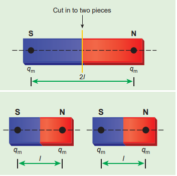

## INTRODUCTION TO MAGNETISM

**Figure 3.1:** Magnetic levitation

Magnets! No doubt, their behaviour will attract everyone. The world enjoys their benefits, to lead a modern luxurious life. The study of magnets fascinated scientists around our globe for many centuries and even now, door for research on magnets is still open (Figure 3.1).

Many birds and animals have magnetic sense in their eyes using Earth’s

magnetic field for navigation.

Magnetic sensing in eyes - for Zebra finch bird, due to protein cryptochromes Cry4 present in retina; the bird uses Earth's magnetic field for navigation  

Magnetism exists everywhere from tiny particles like electrons to the entire universe. Historically the word ‘magnetism’ was derived from iron ore magnetite (Fe3O4). In olden days, magnets were used as magnetic compass for navigation, magnetic therapy for treatment and also used in magic shows.

In modern days, many things we use in our daily life contain magnets (Figure 3.2). Motors, cycle dynamo, loudspeakers, magnetic tapes used in audio and video recording, mobile phones, head phones, CD, pen-drive, hard disc of laptop, refrigerator door, generator are a few examples.

Earlier, both electricity and magnetism were thought to be two independent branches in physics. In 1820, H.C. Oersted observed the deflection of magnetic compass needle kept near a current carrying wire. This unified the two different branches, electricity and magnetism as a single subject ‘electromagnetism’ in physics.

In this unit, basics of magnets and their properties are given. Later, how a current carrying conductor (here only steady current, not time-varying current is considered) behaves like a magnet is presented.

**Figure 3.2 Uses of magnets in modern 
world – (a) speakers (b) head phones 
(c) MRI scan (d) Hard disc of laptop**

  

### Earth’s magnetic field and magnetic elements

**Figure 3.3 Earth’s magnetic field**

Geographic South Pole

Geographic North Pole

Magnetic South Pole

Magnetic North Pole

From the activities performed in lower classes, you might have noticed that the needle in a magnetic compass or freely suspended magnet comes to rest in a position which is approximately along the geographical north- south direction of the Earth.

William Gilbert in 1600 proposed that Earth itself behaves like a gigantic

powerful bar magnet. But this theory is not successful because the temperature inside the Earth is very high and so it will not be possible for a magnet to retain its magnetism.

Gover suggested that the Earth’s magnetic field is due to hot rays coming out from the Sun. These rays will heat up the air near equatorial region. Once air becomes hotter, it rises above and will move towards northern and southern hemispheres and get electrified. This may be responsible to magnetize the ferromagnetic materials near the Earth’s surface. Till date, so many theories have been proposed. But none of the theorium completely explains the cause for the Earth’s magnetism.  

The north pole of magnetic compass needle is attracted towards the magnetic south pole of the Earth which is near the geographic north pole (Figure 3.3). Similarly, the south pole of magnetic compass needle is attracted towards the magnetic north-pole of the Earth which is near the geographic south pole. **The branch of physics which deals with the Earth’s magnetic field is called Geomagnetism or Terrestrial magnetism.**

There are three quantities required to specify the magnetic field of the Earth on its surface, which are often called as the elements of the Earth’s magnetic field. They are

(a) magnetic declination (_D_) (b) magnetic dip or inclination (_I_) (c) the horizontal component of the

Earth’s magnetic field (_BH_)

Geographic meridian

Magnetic meridian

**D = Angle of declination**

**D**

Magnetic meridian

Magnetic meridian

Geographic meridian

Geographic meridian

Geographic Equator

Magnetic Equator

Angle of declination

Earth magnetic south pole

N

S

Magnetic field lines

“True” North pole - the Earth rotates around this axis

Earth

Axis around which the Earth rotates once a day

Earth magnetic north pole

“True” South poleBar magnet

**Figure 3.4 Declination angle**

Day and night occur because Earth spins about an axis called geographic axis. A vertical plane passing through the geographic axis is called geographic meridian and a great circle perpendicular to Earth’s geographic axis is called geographic equator.

The straight line which connects magnetic poles of Earth is known as magnetic axis.

| North Pole |
|------|------|------|

| Geographi |c |

| “True” North pole - thEarth rotates aroundthis axis |
|------|------|------|------|------|------|------|------|------|

| N |

| S |Axis around which the Earth rotatesonce a dayEarth magnetic north pole |

  

A vertical plane passing through magnetic axis is called magnetic meridian and a great circle perpendicular to Earth’s magnetic axis is called magnetic equator.

When a magnetic needle is freely suspended, the alignment of the magnet does not exactly lie along the geographic meridian as shown in Figure 3.4. **The angle between magnetic meridian at a point and geographical meridian is called the _declination or magnetic declination_** (_D_). At higher latitudes, the declination is greater whereas near the equator, the declination is smaller. In India, declination angle is very small and for Chennai, magnetic declination angle is –1o 16ʹ (which is negative (west)).

**The angle subtended by the Earth’s total magnetic field**



_B_ **with the horizontal direction in the magnetic meridian is called dip or magnetic inclination** (_I_) **at that point** (Figure 3.5). For Chennai, inclination angle is 14o 28ʹ. **The component of Earth’s magnetic field along the horizontal direction in the magnetic meridian is called horizontal component of Earth’s magnetic field, denoted by _BH_.**

Let _BE_ be the net Earth’s magnetic field at any point on the surface of the Earth. _BE_ can be resolved into two perpendicular components.

Horizontal component _BH_ = _BE_ cos _I_ (3.1)

Vertical component _BV_ = _BE_ sin _I_ (3.2)

Dividing equation (3.2) and (3.1), we get

**Figure 3.5 Inclination angle**
Horizontal

_I_

_B_

_BH_  

tan _I B B_

_V_

_H_

\= (3.3)

**1. At magnetic equator** The Earth’s magnetic field is parallel to the

surface of the Earth (i.e., horizontal) which implies that the needle of magnetic compass rests horizontally at an angle of dip, _I_ = 0o.

_BH_ = _BE_

_BV_ = 0

This implies that the horizontal component is maximum and vertical component is zero at the equator.

**2. At magnetic poles** The Earth’s magnetic field is

perpendicular to the surface of the Earth (i.e., vertical) which implies that the needle of magnetic compass rests vertically at an angle of dip, _I_ = 90o. Hence,

_BH_ = 0 _BV_ = _BE_

This implies that the vertical component is maximum at poles and horizontal component is zero at poles.

**EXAMPLE 3.1**

The horizontal component and vertical component of Earth’s magnetic field at a place are 0.15 G and 0.26 G respectively. Calculate the angle of dip and resultant magnetic field. (G-gauss, cgs unit for magnetic field 1G = 10–4 T) **_Solution:_**

_BH_ = 0.15 G and _BV_ = 0.26 G

tan . .

tan ( . )_I I_\= ⇒ = =−0 26 0 15

1 732 601 

The resultant magnetic field of the Earth is

_B B BH V_\= + =2 2 0 3. G

| The h orizontal co mponent a nd v erticalcomponent of Earth’s magnetic field at a placeare 0.15 G and 0.26 G respectively. Calculatethe angle of dip and resultant magnetic field.(G-gauss, cgs uni t f or m agnetic f ield 1G = 10  T)Solution:B  = 0.15 G and B  = 0.26 G–402. 6tan II=⇒ ==tan( 1.)73201. 5ThH e resultant magn Vetic field of th−1B = 03.G22HV |
|------|------|------|------|
| 60 |
| e Earth is |

| BB=+ |
  

**Aurora Bore** People living at high latitude experience dazzling coloured na display on the sky is known as

australis (southern lights). These lights are often the magnetic poles of the northern and south borealis” in the north and “Aurora australis” in t between the gaseous particles in the Earth’s atmo from the Sun’s atmosphere through solar wind. These particles emit light due to collision and variations in colour are due to the type of the gas particles that take part in the collisions. A pale yellowish – green colour is produced when the ionized oxygen takes part in the collision and a blue or purplish – red aurora is produced due to ionized nitrogen molecules.  

**alis and Aurora Australis** regions (near Arctic or Antarctic) might

tural lights across the night sky. This ethereal aurora borealis (northern lights) or aurora called as polar lights. The lights are seen above ern hemispheres. They are called as “Aurora he south. This occurs as a result of interaction sphere with highly charged particles released

  

### Basic properties of magnets

Some basic terminologies and properties used in describing bar magnet.

**(a) Magnetic dipole moment**

Consider a bar magnet as shown in Figure 3.6. Let _qm_ be the pole strength of the magnetic pole and let _l_ be the distance between the geometrical centre of bar magnet O and one end of the pole. **The magnetic dipole moment is defined as the product of its pole strength and magnetic length**. It is a vector quantity, denoted by _pm_.

**S**

_q_m _l l_

_d_

_2l_

_q_m

**O N**

**Figure 3.6 A bar magnet**





_p q dm m_\= (3.4)

where 

_d_ is the vector drawn from south pole to north pole and its magnitude



_d l_\= 2 .

The magnitude of magnetic dipole moment is _p q lm m_\= 2

The SI unit of magnetic moment is A m2. The direction of magnetic moment is from south pole to north pole.

**(b) Magnetic field**

Magnetic field is the region or space around every magnet within which its influence will be felt by keeping another magnet in that region. **The magnetic field**



**_B_ at a point is defined as a force experienced by the bar magnet of unit pole strength**.  

_B q_

_F m_

  =

1 (3.5)

Its unit is N A–1 m–1. **(c) Types of magnets**

Magnets are classified into natural magnets and artificial magnets. For example, iron, cobalt, nickel, etc. are natural magnets. Strengths of natural magnets are very weak and the shapes of the magnet are irregular. Artificial magnets are made in order to have desired shape and strength. If the magnet is in the form of rectangular shape or cylindrical shape, then it is known as bar magnet. **Properties of magnet**

The following are the properties of bar magnet (Figure 3.7), 1. A freely suspended bar magnet will always

point along the north-south direction. 2. A magnet attracts or repels another

magnet or magnetic substances towards itself. The attractive or repulsive force is maximum near the end of the bar magnet. When a bar magnet is dipped into iron filling, they cling to the ends of the magnet.

3\. When a magnet is broken into pieces, each piece behaves like a magnet with poles at its ends.

4\. Two poles of a magnet have pole strength equal to one another.

5\. The length of the bar magnet is called geometrical length and the length between two magnetic poles in a bar magnet is called magnetic length. Magnetic length is always slightly smaller than geometrical length. The ratio of magnetic length and geometrical length is 5

6 .

_Magnetic length_

_Geometrical length_ \= =

5 6

0 833.

  

**EXAMPLE 3.2**

Let the magnetic moment of a bar magnet be _pm_ whose magnetic length is _d_ = 2_l_ and pole strength is _qm_. Compute the magnetic moment of the bar magnet when it is cut into two pieces (a) along its length (b) perpendicular to its length. **_Solution_**

(a) a bar magnet cut into two pieces along its length:

**S**

_q_m

2_l_

_Cut into two pieces along the axis_

_q_m

**N**

NORTHERLY DIRECTION

NS

N S

N S

NS Magnetic field lines

**S**

_q_m 2_l_

Cut into two pieces

_q_m

**N**

**\=**

**Figure 3.7 Properties of bar magnet**
**S**

_q_m

2_l_

_Cut into two pieces along the axis_

_q_m

**N**

2_l_

**S** _q_m 2

**S** _q_m 2

2_l_

**S** _q_m

**N**

2 _q_m 2

**S** _q_m

**N**

2 _q_m 2

**S**

_q_m _l_

_q_m

**N S**

_q_m _l_

_q_m

**N**

**S**

_q_m

2_l_

L

_q_m

**N**

Geometrical length of a bar magnet

Magnetic length of a bar magnet

|------|------|------|
| 2l |
  

When the bar magnet is cut along the axis into two pieces, new magnetic pole strength

is ′ =_q q_

_m m_

2 but magnetic length does not

change. So, the magnetic moment is

′ = ′_p q lm m_2

   _p q_

_l q l pm m_

_m m_2 2 1

2 2 1

2 ( )

In vector notation,  

 _p pm m_ 1 2

(b) a bar magnet cut into two pieces perpendicular to the axis:

**S**

_q_m 2_l_

Cut in to two pieces

_q_m

**N**

s

_q_m

**N S**

_q_m _l_

_q_m

**N S**

_q_m _l_

_q_m

**N**

When the bar magnet is cut perpendicular to the axis into two pieces, magnetic pole strength will not change but magnetic length will be halved. So the magnetic moment is

       _p q l q l pm m m m_ 1 2

2 1 2

2 1 2

( )

In vector notation,  

 _p pm m_ 1 2

**EXAMPLE 3.3**

Compute the magnetic length of a uniform bar magnet if the geometrical length of the magnet is 12 cm. Mark the positions of magnetic pole points.

Magnetic length = 5 6  

**S**

_q_m _l_

_q_m

**N S**

_q_m _l_

_q_m

**N**

**S**

12 cm

**N**

**_Solution_** Geometrical length of the bar magnet is 12 cm

Magnetic length geometrical length cm= × ( ) = × =5 6

5 6

12 10

geometrical length cm× ( ) = × =5 6

12 10

In this figure, the dot implies the pole points.

**S**

12 cm

10 cm1 cm 1 cm

**N**

(i) Pole strength is a scalar quantity with dimension \[MoLToA\]. Its SI unit is N T–1

(newton per tesla) or A m (ampere-metre). (ii) Like positive and negative charges in electrostatics, north pole of a magnet experiences a force in the direction of magnetic field while south pole of a magnet experiences force opposite to the magnetic field. (iii) Pole strength depends on the nature of materials of the magnet, area of cross- section and the state of magnetization. (iv) If a magnet is cut into two equal halves along the length then pole strength is reduced to half. (v) If a magnet is cut into two equal halves perpendicular to the length, then pole strength remains same. (vi) If a magnet is cut into two pieces, we will not get separate north and south poles. Instead, we get two magnets. In other words, isolated monopole does not exist in nature.

**Note**

| 12 cmSolution S NGeometrical length of the bar magnet is 12 cm()5Magnetic length =× geometricall engthc =×65=× 12 = 10 m6In t his f igure, t he do t im plies t he p ole points. 12 cmS NN S Nq q10 cml 1 cmm m m |
|------|------|

| ql 1 cm |

| When the bar magnet is cut along the axisinto two pieces, new magnetic pole strengthis q ′ = q  b ut m agnetic length do es n ot2change. So, the magnetic moment ispq′ = ′ 2l mmq 1 1p  2lq () 2lp 2 2 2 Immn vector notation,   1pp m 2m mm(b) a b ar m agnet c ut in to t wo p ieces perpendicular to the axis:mmCut in to two piecesS Nq q2lm mS N S Nq q q qWhen the bar magnet is cut perpendicularl lm m m mto t he axis into t wo p ieces, magnetic p olestrength will not change but magnetic lengthwill be halved. So the magnetic moment is1 1 1pq  2lq  () 2lp 2 2 2In vector notation,   1pp 2mm mmmm |
|------|

  

**Magnetic field lines**

1\. Magnetic field lines are continuous closed curves. The direction of magnetic field lines is from North pole to South pole outside the magnet and from South pole to North pole inside the magnet.

2\. The direction of magnetic field at any point on the curve is known by drawing tangent to the magnetic field lines at that point.

3\. Magnetic field lines never intersect each other. Otherwise, the magnetic compass needle would point towards two different directions, which is not possible.

4\. The degree of closeness of the field lines determines the relative strength of the magnetic field. The magnetic field is strong where magnetic field lines crowd and weak where magnetic field lines are well separated.

**(d) Magnetic flux The number of magnetic field lines**

**crossing any area normally is defined as magnetic flux** _ΦB_ **through the area.** Mathematically, the magnetic flux through a surface of area



_A_ in a uniform magnetic field



_B_ is defined as

_B B A BA B A_   

 

. cos (3.6)

where _θ_ is the angle between 

_B_ and 

_A_ as shown in Figure 3.8.

_θ_

_θ_ = 0 º _θ A_

_B B_

_A_

_B_

_BA_

_A_

**Figure 3.8 Magnetic flux**  

**Special cases**

(a) When 

_B_ is normal to the surface i.e., _θ_ \= 0o, the magnetic flux is _ΦB_ = _BA_ (maximum).

(b) When 

_B_ is parallel to the surface i.e., _θ_ = 90o, the magnetic flux is _ΦB_ = 0.

Suppose the magnetic field is not uniform over the surface, the equation (3.6) can be written as

Φ_B B A_\= ∫  

.d

Magnetic flux is a scalar quantity. The SI unit for magnetic flux is weber, which is denoted by symbol Wb. Dimensional formula for magnetic flux is ML T A2 2 1− −  . The CGS unit of magnetic flux is maxwell.

1 weber = 108 maxwell

**The magnetic flux density is defined as the number of magnetic field lines crossing per unit area kept normal to the direction of lines of force.** Its unit is Wb m–2 or tesla (T).

**(e) Uniform magnetic field and Non- uniform magnetic field**

**Uniform magnetic field** Magnetic field is said to be uniform if it

has same magnitude and direction at all the

**Figure 3.9 Uniform magnetic field**

| A |
|------|------|

  

points in a given region. Example, locally Earth’s magnetic field is uniform.

The magnetic field of Earth has same value over the entire area of your school!

**Non-uniform magnetic field** Magnetic field is said to be non-uniform

if the magnitude or direction or both vary at different points in a region. Example: magnetic field of a bar magnet

**Figure 3.10 Non-uniform magnetic field** (a) direction is constant (b) direction is not a constant (c) both magnitude and direction are not constant (d) magnetic field of a bar magnet

(a) (b) (c)

NS

N S

N S

NS

Magnetic field lines

(d)

**EXAMPLE 3.4**

Calculate the magnetic flux coming out from closed surface containing magnetic dipole (say, a bar magnet) as shown in figure.

**S N**  

**_Solution_**

The total flux emanating from the closed surface S enclosing the dipole is zero. So,

Φ_B B A_\= =∫    .d 0

Here the integral is taken over closed surface. Since no isolated magnetic pole (called magnetic monopole) exists, this integral is always zero,

  _B A_.d =∫ 0

This is similar to Gauss’s law in electrostatics.
