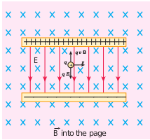

[comment]: <> (katex Header)


### Motion of a charged particle under crossed electric and magnetic field (velocity selector)

**Figure 3.48 Velocity selector**

$$ \vec{E} $$

$$ \vec{B} $$

$$ \vec{v} $$

$$ \vec{F} = q \vec{E} + q \vec{B} \times \vec{v} $$

For a positive charge, the electric force on the charge acts in the downward direction, whereas the Lorentz force acts upwards. When these two forces balance each other, then

$$ qE = qBv $$

$$ v = \frac{E}{B} $$

(3.62)

This principle is used in the Bainbridge mass spectrograph to separate isotopes. This concept is explained in Example (3.21).

**Schematic diagram of Bainbridge mass spectrometer**

$$ m_2 > m_1 $$

$$ 2r $$

$$ m_2 $$

$$ B $$

$$ S2 $$

$$ S1 $$

$$ m_1 $$

**Magnetic field perpendicular to the diagram and into the plane**

**Beam of positive ions**

**Vacuum chamber**

**Note:**
$$ \Delta d = d_2 - d_1 $$
$$ t_{235} = \frac{97.6 \times 10^{-2}}{5.76 \times 10^{5}} $$
$$ t_{238} = \frac{98.8 \times 10^{-2}}{5.88 \times 10^{5}} $$

This means, for a given magnitude of $$\vec{E}$$-field and $$\vec{B}$$-field, the forces act only on the particle moving with a particular speed $$v_{\text{0}} = \frac{E}{B}$$. This speed is independent of mass and charge.

By proper choice of electric and magnetic fields, the particle with a particular speed can be selected. Such an arrangement of fields is called a **velocity selector**.

**EXAMPLE 3.22**

Let $$ E $$ be the electric field of magnitude $$ 6.0 \times 10^6 \, \text{N C}^{-1} $$ and $$ B $$ be the magnetic field magnitude $$ 0.83 \, \text{T} $$. Suppose an electron is accelerated with a potential of $$ 200 \, \text{V} $$, will it show zero deflection? If not, at what potential will it show zero deflection.

**Solution:**

Electric field, $$ E = 6.0 \times 10^6 \, \text{N C}^{-1} $$ and magnetic field, $$ B = 0.83 \, \text{T} $$.

$$ v_0 = \frac{E}{B} = \frac{6.0 \times 10^6}{0.83} \, \text{m/s} $$

When an electron goes with this velocity, it shows null deflection. Since the accelerating potential is $$ 200 \, \text{V} $$, the electron acquires kinetic energy because of this accelerating potential. Hence,

$$ \frac{1}{2} m_e v_{200}^2 = eV $$

Since the mass of the electron, $$ m_e = 9.1 \times 10^{-31} \, \text{kg} $$ and charge of an electron, $$ e = -1.6 \times 10^{-19} \, \text{C} $$, the velocity acquired by the electron due to the accelerating potential of $$ 200 \, \text{V} $$ is

$$ v_{200} = \sqrt{\frac{2 \cdot 1.6 \times 10^{-19} \cdot 200}{9.1 \times 10^{-31}}} \, \text{m/s} $$

Since the speed $$ v_{200} > v_0 $$, the electron is deflected towards the direction of the Lorentz force. So, in order to have null deflection, the potential we have to supply is

$$ V = \frac{1}{2} m_e v_{200}^2 = \frac{1}{2} \cdot 9.1 \times 10^{-31} \cdot (148 \times 10^3)^2 $$
$$ V = 65 \, \text{V} $$
