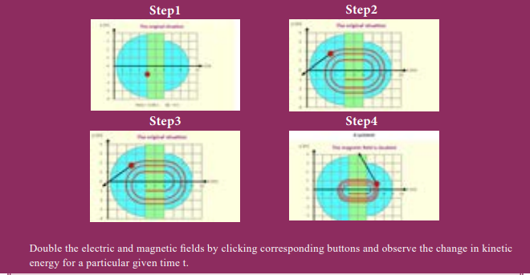

**BOOKS FOR REFERENCE**

**1\.** H. C. Verma, _Concepts of Physics – Volume_

**2\.** Halliday, Resnick and Walker, _Fundamenta_

**3\.** Serway and Jewett, _Physics for scientist and_ publishers, Eighth edition.

4\. David J. Griffiths, Introduction to electrodyn

**5\.** Rita John, _Solid State Physics (Magnetism c_ Ltd.

**6\.** Paul Tipler and Gene Mosca, _Physics for_ Sixth edition, W.H. Freeman and Company

(b) total force on the coil (c) average force on each electron in the

coil due to the magnetic field. (The free electron density for the material of the wire is 1028 m–3).

Answer (a) zero (b) zero (c) 0.6 x 10**–23** N **4\.** A bar magnet is placed in a uniform

magnetic field whose strength is 0.8 T. If the bar magnet is oriented at an angle 30o with the external field experiences a torque of 0.2 Nm. Calculate:

(i) the magnetic moment of the magnet (ii) the work done by the magnetic field

in moving it from most stable configuration to the most unstable configuration and also compute the work done by the applied magnetic field in this case.

Answer (i) 0.5 A m2 (ii) _W_ = 0.8 J and _W_mag \= -0.8 J

**5\.** A non - conducting sphere has a mass of 100 g and radius 20 cm. A flat compact coil of wire with turns 5 is  

_2_, Bharati Bhawan Publisher.

_ls of Physics_, Wiley Publishers, 10th edition.

_engineers with modern physics_, Brook/Coole

_amics_, Pearson publishers.

_hapter)_, McGraw Hill Education (India) Pvt.

_scientist and engineers with modern physics_, .

wrapped tightly around it with each turns concentric with the sphere. This sphere is placed on an inclined plane such that plane of coil is parallel to the inclined plane. A uniform magnetic field of 0.5 T exists in the region in vertically upward direction. Compute the current _I_ required to rest the sphere in equilibrium. Answer 2

π _A_

6\. Calculate the magnetic field at the centre of a square loop which carries a current of 1.5 A, length of each side being 50 cm. Answer 3.4 x 10–6 T

  
**ICT CORNER**
**Magnetism**

In this activity you will be able to visualize and understand the working of cyclotron.

**STEPS:**
- Open the browser and type ‘physics.bu.edu/~duffy/HTML5/cyclotron.html’ in the address bar. 
- Click ‘play’ to release the positively charged particle between the D-shaped sections. 
- Observe trajectory of positively charged particle under the magnetic field between D-shaped 
sections. 
- Note the kinetic energy of the particle after some time (say t = 20 s)

**URL:** http://physics.bu.edu/~duffy/HTML5/cyclotron.html

\* Pictures are indicative only. \* If browser requires, allow **Flash Player** or **Java Sc**

