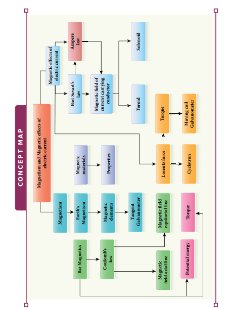

**SUMMARY**

1. The axis aligned with the geographic meridian is called the geographic meridian, while the one aligned with the magnetic field is called the magnetic meridian.

2. The angle between the magnetic field and the horizontal plane is called magnetic dip or magnetic inclination. It is denoted by \( \theta \).

3. The magnetic induction (\( \mathbf{B} \)) is a vector quantity denoted by \( \mathbf{B} \). Its unit is Tesla (T).

4. Magnetic dipole moment (\( \mathbf{pm} \)) is the product of the pole strength and magnetic length. It is denoted by \( \mathbf{pm} \).

5. A magnetic pole of strength unity experiences a force of 1 Tesla.

6. Magnetic flux (\( \Phi_B \)) is the product of the magnetic induction and the area perpendicular to the field. Its unit is Weber (Wb).

7. Coulomb's inverse law states that the force of attraction or repulsion between two magnetic poles is inversely proportional to the square of the distance between them.

8. Torque is experienced by a magnetic field, and a moving coil galvanometer is used to measure small currents.

9. The process to magnetize a sample is called magnetization, and it is denoted by \( \mathbf{H} \) with a unit of A/m.

10. Three categories of magnetism are diamagnetic, paramagnetic, and ferromagnetic.

11. Hysteresis refers to the cyclic variation in the magnetizing field.

12. Ampère’s circuital law is \( \oint \mathbf{B} \cdot d\mathbf{l} = \mu \mathbf{I}_{\text{enclosed}} \).

13. Magnetic field inside the solenoid is \( B = \frac{\mu \mathbf{N}}{\mathbf{I}} \) per unit length.

14. Magnetic field interior to the toroid is \( B = \frac{\mu \mathbf{N}}{2\pi \mathbf{r}} \) per unit length.

15. Lorentz force is \( \mathbf{F} = q(\mathbf{E} + \mathbf{v} \times \mathbf{B}) \).

16. Charged particle moving in a uniform magnetic field undergoes circular motion.

17. Fleming’s Left Hand Rule: Stretch forefinger, middle finger, and thumb of the left hand such that they are in mutually perpendicular directions. If the forefinger points in the direction of the magnetic field, the middle finger in the direction of electric current, then the thumb points in the direction of the force experienced by the conductors.

18. One ampere is defined as that constant current which, when passed through two infinitely long parallel straight conductors in a vacuum, causes each conductor to experience a force of \(2 \times 10^{-7}\) newton per meter length of the conductor.

19. When a current-carrying coil is placed in a uniform magnetic field, the net force is always zero, but net torque is not zero unless \( \theta = 0 \).

20. Moving coil galvanometer is an instrument used for the detection and measurement of small currents.

21. In a moving coil galvanometer, current passing through is directly proportional to the deflection. Mathematically, \( I = G\theta \), where \( G = \frac{\mathbf{NAB}}{K} \) is called the galvanometer constant or current reduction factor.

22. Current sensitivity is defined as the deflection produced per unit current flowing through it, \( S_I = \frac{\theta}{I} = \frac{\mathbf{NAB}}{Ks} \).

23. Voltage sensitivity is defined as the deflection produced per unit voltage applied across it, \( S_V = \frac{\theta}{V} = \frac{\mathbf{NAB}}{KR_s} \), where \( R_s \) is the resistance of the galvanometer.

24. Tangent law: \( \tan \theta = \frac{Bh}{I} \), where \( \theta \) is the angle of dip, \( B \) is the horizontal component of the Earth's magnetic field, \( h \) is the magnetic intensity of the Earth, and \( I \) is the magnetic inclination.

25. Galvanometer can be converted into an ammeter of given range by connecting a suitable low resistance (shunt) in parallel to the given galvanometer.

26. An ideal ammeter has zero resistance.

27. Voltmeter is an instrument used to measure potential difference across any element in an electrical circuit.

28. Galvanometer can be converted into a suitable voltmeter of given range by connecting a suitable high resistance (\( R_h \)) in series with the galvanometer.

29. An ideal voltmeter has infinite resistance.

