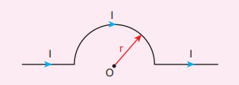
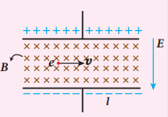
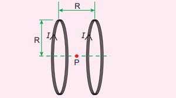
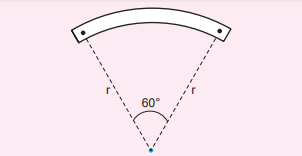
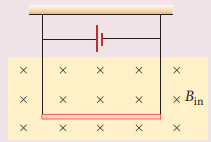
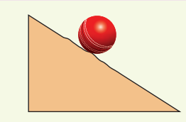

**I Multiple Choice Questions**

1. The magnetic field at the center O of the following current loop is

   (a) \( \mu_0 \frac{I r}{4} \)
   (b) \( \mu_0 \frac{I}{4r} \)
   (c) \( \mu_0 \frac{I r}{2} \)
   (d) \( \mu_0 \frac{I}{2r} \)

**Answer: (a)**

2. An electron moves in a straight line inside a charged parallel plate capacitor of uniform charge density \( \sigma \). 

The time taken by the electron to cross the parallel plate capacitor undeflected when the plates of the capacitor are kept under a constant magnetic field of induction \( B \) is
   (a) \( \frac{\varepsilon \sigma \ell}{eBl} \)
   (b) \( \frac{\varepsilon \sigma}{\ell Be} \)
   (c) \( \frac{\varepsilon \sigma \ell}{Be} \)
   (d) \( \frac{\varepsilon \sigma}{\ell Be} \)

**Answer: (c)**

3. A particle having mass \( m \) and charge \( q \) accelerated through a potential difference \( V \). Find the force experienced when it is kept under a perpendicular magnetic field \( \mathbf{B} \).
   (a) \( \frac{2}{3} \frac{qBV}{m} \)
   (b) \( \frac{qBV}{3m} \)
   (c) \( \frac{2}{3} \frac{qBV}{2m} \)
   (d) \( \frac{2}{3} \frac{qBV}{3m} \)

**Answer: (c)**

4. A circular coil of radius 5 cm and 50 turns carries a current of 3 amperes. The magnetic dipole moment of the coil is nearly
   (a) 1.0 A m²
   (b) 1.2 A m²
   (c) 0.5 A m²
   (d) 0.8 A m²

**Answer: (b)**

5. A thin insulated wire forms a plane spiral of \( N = 100 \) tight turns carrying a current \( I = 8 \) mA. The radii of inside and outside turns are \( a = 50 \) mm and \( b = 100 \) mm respectively. The magnetic induction at the center of the spiral is
   (a) 5 µT
   (b) 7 µT
   (c) 8 µT
   (d) 10 µT

**Answer: (b)**

6. Three wires of equal lengths are bent in the form of loops. One of the loops is a circle, another is a semi-circle, and the third one is a square. They are placed in a uniform magnetic field and the same electric current is passed through them. Which of the following loop configurations will experience greater torque?
   (a) Circle
   (b) Semi-circle
   (c) Square
   (d) All of them

**Answer: (a)**

7. Two identical coils, each with \( N \) turns and radius \( R \), are placed coaxially at a distance \( R \) as shown in the figure. If \( I \) is the current passing through the loops in the same direction, then the magnetic field at a point P at a distance of \( R/2 \) from the center of each coil is

   (a) \( \frac{8}{5} \frac{NIR}{\mu_0} \)
   (b) \( \frac{5}{3} \frac{2NI}{R\mu_0} \)
   (c) \( \frac{8}{5} \frac{NIR}{\mu_0} \)
   (d) \( \frac{4}{5} \frac{NI}{R\mu_0} \)

**Answer: (b)**

8. A wire of length \( l \) carrying a current \( I \) along the \( Y \) direction is kept in a magnetic field given by \( \mathbf{B} = \beta \mathbf{i} + \beta \mathbf{j} + \beta \mathbf{k} \) T. The magnitude of the Lorentz force acting on the wire is
   (a) \( \frac{2}{3} \beta Il \)
   (b) \( \frac{1}{3} \beta Il \)
   (c) \( 2 \beta Il \)
   (d) \( \frac{1}{2} \beta Il \)

**Answer: (a)**

9. A bar magnet of length \( l \) and magnetic moment \( m \) is bent in the form of an arc as shown in the figure. The new magnetic dipole moment will be

   (a) \( m \)
   (b) \( \frac{3\pi m}{2} \)
   (c) \( \frac{2\pi m}{3} \)
   (d) \( \frac{m}{2} \)

**Answer: (b)**

10. A non-conducting charged ring carrying a charge of \( q \), mass \( m \), and radius \( r \) is rotated about its axis with constant angular speed \( \omega \). Find the ratio of its magnetic moment with angular momentum is
   (a) \( \frac{q}{m} \)
   (b) \( \frac{2q}{m} \)
   (c) \( \frac{q}{2m} \)
   (d) \( \frac{q}{4m} \)

**Answer: (c)**

11. The BH curve for a ferromagnetic material is shown in the figure. The material is placed inside a long solenoid which contains 1000 turns/cm. The current that should be passed in the solenoid to demagnetize the ferromagnet completely is

   (a) 1.00 mA
   (b) 1.25 mA
   (c) 1.50 mA
   (d) 1.75 mA

**Answer: (c)**

12. Two short bar magnets have magnetic moments 1.20 Am² and 1.00 Am² respectively. They are kept on a horizontal table parallel to each other with their north poles pointing towards south. They have a common magnetic equator and are separated by a distance of 20.0 cm. The value of the resultant horizontal magnetic induction at the mid-point O of the line joining their centers is (Horizontal components of Earth’s magnetic induction is \(3.6 \times 10^{-5}\) Wb m⁻²)

   (a) \(3.60 \times 10^{-5}\) Wb m⁻²
   (b) \(3.5 \times 10^{-5}\) Wb m⁻²
   (c) \(2.56 \times 10^{-4}\) Wb m⁻²
   (d) \(2.2 \times 10^{-4}\) Wb m⁻²

**Answer: (c)**

13. The vertical component of Earth’s magnetic field at a place is equal to the horizontal component. What is the value of the angle of dip at this place?
   (a) 30°
   (b) 45°
   (c) 60°
   (d) 90°

**Answer: (b)**

14. A flat dielectric disc of radius \( R \) carries an excess charge on its surface. The surface charge density is \( \sigma \). The disc rotates about an axis perpendicular to its plane passing through the center with angular velocity \( \omega \). Find the magnitude of the torque on the disc if it is placed in a uniform magnetic field whose strength is \( B \) which is directed perpendicular to the axis of rotation
   (a) \( \frac{1}{4} \sigma \omega \pi BR \)
   (b) \( \frac{1}{2} \sigma \omega \pi BR \)
   (c) \( \frac{1}{4} \sigma \omega \pi BR \)
   (d) \( \frac{1}{4} \sigma \omega \pi BR \)

**Answer: (d)**

15. The potential energy of magnetic dipole whose dipole moment is \( \vec{p} = -0.5 \vec{i} + 0.4 \vec{j} + 0.2 \vec{k} \) Am kept in uniform magnetic field \( \vec{B} = 0.2 \vec{i} \) T.
   (a) –0.1 J
   (b) –0.8 J
   (c) 0.1 J
   (d) 0.8 J

**Answer: (c)**

**II Short Answer Questions:**

1. What is meant by magnetic induction?
2. Define magnetic flux.
3. Define magnetic dipole moment.
4. State Coulomb’s inverse law.
5. What is magnetic susceptibility?
6. State Biot-Savart’s law.
7. What is magnetic permeability?
8. State Ampere’s circuital law.
9. Compare dia, para and ferro-magnetism.
10. What is meant by hysteresis?
11. Define magnetic declination and inclination.
12. What is resonance condition in cyclotron?
13. Define ampere.
14. State Fleming's left hand rule.
15. Is an ammeter connected in series or parallel in a circuit? Why?
16. Explain the concept of velocity selector.
17. Why is the path of a charged particle not a circle when its velocity is not perpendicular to the magnetic field?
18. Give the properties of dia / para / ferromagnetic materials.
19. What happens to the domains in a ferromagnetic material in the presence of an external magnetic field?
20. How is a galvanometer converted into (i) an ammeter and (ii) a voltmeter?

**III Long Answer Questions**

1. Discuss Earth’s magnetic field in detail.
2. Deduce the relation for the magnetic field at a point due to an infinitely long straight conductor carrying current.
3. Obtain a relation for the magnetic field at a point along the axis of a circular coil carrying current.
4. Compute the torque experienced by a magnetic needle in a uniform magnetic field.
5. Calculate the magnetic field at a point on the axial line of a bar magnet.
6. Obtain the magnetic field at a point on the equatorial line of a bar magnet.
7. Find the magnetic field due to a long straight conductor using Ampere’s circuital law.
8. Discuss the working of cyclotron in detail.
9. What is tangent law? Discuss in detail.
10. Derive the expression for the torque on a current-carrying coil in a magnetic field.
11. Discuss the conversion of galvanometer into an ammeter and also a voltmeter.
12. Calculate the magnetic field inside and outside of the long solenoid using Ampere’s circuital law.
13. Derive the expression for the force between two parallel, current-carrying conductors.
14. Give an account of magnetic Lorentz force.
15. Compare the properties of soft and hard ferromagnetic materials.
16. Derive the expression for the force on a current-carrying conductor in a magnetic field.

**IV. Numerical Problems**

1. A bar magnet having a magnetic moment \( \vec{m} \) is cut into four pieces, i.e., first cut into two pieces along the axis of the magnet and each piece is further cut along the axis into two pieces. Compute the magnetic moment of each piece.

   Answer: \( \vec{m}_{\text{new}} = \frac{1}{4} \vec{m} \)

2. A conductor of linear mass density 0.2 g m⁻1 suspended by two flexible wires as shown in the figure. Suppose the tension in the supporting wires is zero when it is kept inside the magnetic field of 1 T whose direction is into the page. Compute the current inside the conductor and also the direction of the current. Assume \( g = 10 \) m s⁻2.
   Answer: 2 mA

3. A circular coil with cross-sectional area 0.1 cm² is kept in a uniform magnetic field of strength 0.2 T. If the current passing in the coil is 3 A and the plane of the loop is perpendicular to the direction of the magnetic field. Calculate (a) the total torque on the coil.
(a) total torque on the coil
(b) total force on the coil
(c) average force on each electron in the 
coil due to the magnetic field. (The free 
electron density for the material of the wire 
is 1028 m–3).
Answer (a) zero (b) zero (c) 0.6 x 10–23 N
4. A bar magnet is placed in a uniform 
magnetic field whose strength is 0.8 T.
If the bar magnet is oriented at an angle 
30o with the external field experiences a 
torque of 0.2 Nm. Calculate:
 (i) the magnetic moment of the magnet
(ii) the work done by the applied force 
in moving it from most stable configuration 
to the most unstable configuration and 
also compute the work done by the applied 
magnetic field in this case. 
Answer (i) 0.5 A m2 (ii) W = 0.8 J and 
W
mag = -0.8 J
5. A non - conducting sphere has a 
mass of 100 g and radius 20 cm. A flat 
compact coil of wire with turns 5 is
wrapped tightly around it with each 
turns concentric with the sphere. This 
sphere is placed on an inclined plane 
such that plane of coil is parallel to the 
inclined plane. A uniform magnetic 
field of 0.5 T exists in the region in 
vertically upward direction. Compute 
the current I required to rest the sphere 
in equilibrium. Answer
2
π
A

6. Calculate the magnetic field at the 
centre of a square loop which carries 
a current of 1.5 A, length of each side 
being 50 cm. Answer 3.4 x 10–6 