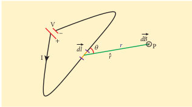
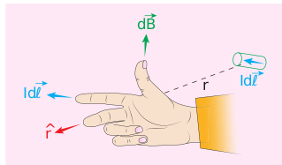
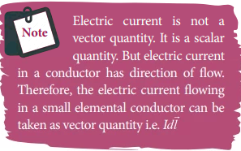
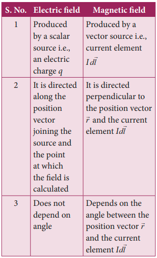
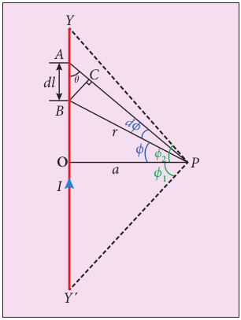
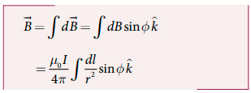
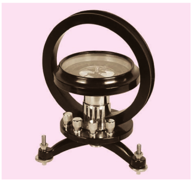
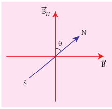

# BIOT - SAVART LAW

Soon after Oersted’s discovery, both Jean-Baptiste Biot and Felix Savart in 1819 did quantitative experiments on the force experienced by a magnet kept near current carrying wire and arrived at a mathematical expression that gives the magnetic field at some point in space in terms of the current that produces the magnetic field. This is true for any shape of the conductor.

## Definition and explanation of Biot- Savart law

Biot and Savart experimentally observed that the magnitude of magnetic field \overrightarrow{dB} at a point P (Figure 3.30) at a distance _r_ from the small elemental length taken on a conductor carrying current varies

(i) directly as the strength of the current _I_

(ii) directly as the magnitude of the length element \overrightarrow{dl}

(iii) directly as the sine of the angle _θ_ between \overrightarrow{dl} and \hat{r}

(iv) inversely as the square of the distance _r_ between the point P and length element \overrightarrow{dl}

This is expressed as

 dB \propto \frac{I \, dl}{r^2} \sin\theta 

or

 dB = k \frac{I \, dl}{r^2} \sin\theta 

where k = \frac{\mu \pi}{4}

In vector notation,

 \overrightarrow{dB} = \frac{\mu}{4\pi} \frac{I \, \overrightarrow{dl} \, \hat{r}}{r^2} 

Here vector \overrightarrow{dl} is perpendicular to both _I_ \overrightarrow{dl} (pointing the direction of current flow) and the unit vector \hat{r} directed from \overrightarrow{dl} toward point P (Figure 3.31).

The equation (3.34) is used to compute the magnetic field only due to a small elemental length _dl_ of the conductor. The net magnetic field at P due to the conductor is obtained from principle of superposition by considering the contribution from all current elements _I_ \overrightarrow{dl}. Hence integrating equation (3.34), we get

where the integral is taken over the entire current distribution.

Cases

1. If the point P lies on the conductor, then θ = 0&deg;. Therefore, \overrightarrow{|dB|} is zero.
2. If the point lies perpendicular to the conductor, then θ = 90&deg;. Therefore, \overrightarrow{dB} is
   maximum and is given by  \overrightarrow{dB} = \frac{\mu}{4\pi} \frac{I \, dl}{r^2} \hat{n} where n is the unit vector perpendicular to both I \overrightarrow{dl} and \hat{r}

**Similarities between electric field (from Coulomb’s law) and magnetic field (from Biot-Savart’s law)**

Electric and magnetic fields

• obey inverse square law, so they are long range fields.

• obey the principle of superposition and are linear with respect to source.

In magnitude,

 E \propto q 

 B \propto Idl 

**Differences between electric field (from Coulomb’s law) and magnetic field (from Biot-Savart’s law)**

## Magnetic field due to long straight conductor carrying current

Let YY' be an infinitely long straight conductor and _I_ be the steady current through the conductor as shown in Figure 3.32. In order to calculate magnetic field at a point P which is at a distance _a_ from the wire, let us consider a small line element _dl_ (segment AB).

The magnetic field at a point P due to current element _Idl_ can be calculated from Biot-Savart’s law, which is

 dB = \frac{\mu}{4\pi} \frac{I \, dl \sin\theta}{r^2} \hat{n} 

where \hat{n} is the unit vector which points into the page at P, θ is the angle between current element _Idl_ and line joining dl and the point P. Let r be the distance between line element
at A to the point P.

To apply trigonometry, draw aperpendicular line from A to BP as shown in Figure 3.32.

In triangle ∆ABC, \sinθ = \frac{AC}{AB}

⇒ AC = ABsinθ

But AB = dl ⇒ = AC dlsinq

Let d&phi; be the angle subtended between AP and BP.

i.e., ∠ = APB ∠APC d&phi;

In a triangle ∆ = APC,sin(d&phi;) = \frac{AC}{AP}
Since d&phi; is very small, sin(d&phi;) &asymp; d&phi;

But AP = r ⇒ = AC rd&phi;

∴ AC =  dlsinθ = rdφ

\therefore \overrightarrow{dB} = \frac{\mu}{4\pi} \frac{I}{r^2} (r \, d\phi) \hat{n} = \frac{\mu}{4\pi} \frac{I \, d\phi}{r} \hat{n}

Let &phi; be the angle between AP and OP. In a ∆OPA, cos &phi; =  \frac{OP}{AP} = \frac{a}{r}

The total magnetic field at P due to the
conductor YY' is

 \overrightarrow{B} = \frac{\mu I}{4\pi a} (\sin\phi_1 + \sin\phi_2) \hat{n}

For infinitely long conductor,
&phi;1=&phi;2=90°

 \therefore \overrightarrow{B} = \frac{\mu I}{4\pi a} \cdot 2 \hat{n} \Rightarrow \overrightarrow{B} = \frac{\mu I}{2\pi a} \hat{n}  &emsp; (3.36)

## Magnetic field produced along the axis of the current-carrying circular coil

Consider a current carrying circular loop of radius _R_ and let _I_ be the current flowing through the wire in the direction as shown in Figure 3.33.

The magnetic field at a point P on the axis of the circular coil at a distance z from the centre of the coil O is computed by taking two diametrically opposite line elements of the coil each of length \overrightarrow{dl} at C and D. Let \overrightarrow{r} be the vector joining the current element I \overrightarrow{dl} at C and the point P.

According to Biot-Savart’s law, the magnetic field at P due to the current element at C is

 d \vec{B}=\frac{\mu_{\circ}}{4 \pi} \frac{I d \vec{l} \times \hat{r}}{r^{2}} 

The magnitude of \overrightarrow{dB} is

 d B=\frac{\mu_{\circ}}{4 \pi} \frac{I d l \sin \theta}{r^{2}}=\frac{\mu_{\circ}}{4 \pi} \frac{I d l}{r^{2}} 

where θ is the angle between I \overrightarrow{dl} and \overrightarrow{r}. Here θ = 90°.

The direction of \overrightarrow{dB} is perpendicular to the current element I \overrightarrow{dl} and CP. It is therefore along PR perpendicular to CP.

The magnitude of magnetic field at P due to current element at D is same as that for the element at C because of equal distances from the coil. But its direction is along PS.

The magnetic field \overrightarrow{dB} due to each current element is resolved into two components; dBcosϕ along y-direction and dBsinϕ along z-direction. The horizontal components cancel out while the vertical components (dBsinϕk) alone contribute to the net
magnetic field \overrightarrow{B} at the point P.

From ∆OCP,

  \sin \phi=\frac{R}{\left(R^{2}+z^{2}\right)^{1 / 2}} \text { and } r^{2}=R^{2}+z^{2} \text {. } 

Substituting these in the above equation, we get

 \vec{B}=\frac{\mu_{0} I}{4 \pi} \frac{R}{\left(R^{2}+z^{2}\right)^{3 / 2}} \hat{k}\left(\int d l\right) 

If we integrate the line element from 0 to 2πR, we get the net magnetic field \overrightarrow{B} at point
P due to the current-carrying circular loop.

 \vec{B}=\frac{\mu_{0} I}{2} \frac{R^{2}}{\left(R^{2}+z^{2}\right)^{3 / 2}} \hat{k} 

If the circular coil contains N turns, then the magnetic field is

 \vec{B}=\frac{\mu_{0} N I}{2} \frac{R^{2}}{\left(R^{2}+z^{2}\right)^{3 / 2}} \hat{k}  &emsp; (3.37)

The magnetic field at the centre of the coil is

 \vec{B}=\frac{\mu_{0} N I}{2 R} \widehat{k} \quad \text { since } z=0  &emsp; (3.38)

**EXAMPLE 3.13**

What is the magnetic field at the centre of the loop shown in figure?

**_Solution_**

The magnetic field due to current in the upper semicircle and lower semicircle of the circular coil are equal in magnitude but opposite in direction. Hence, the net magnetic field at the centre of the loop (at point O) \overrightarrow{B} = \overrightarrow{0}

## Tangent law and Tangent Galvanometer

Tangent galvanometer is a device used to detect very small currents. It is a moving magnet type galvanometer. Its working is based on tangent law (Figure 3.34).

**Tangent law**

**When a magnetic needle or magnet is freely suspended in two mutually perpendicular uniform magnetic fields, it will come to rest in the direction of the resultant of the two fields.**

Let _B_ be the magnetic field produced by passing current through the coil of the tangent galvanometer and _BH_ be the horizontal component of Earth’s magnetic field. Under the action of two magnetic fields, the needle comes to rest making angle _θ_ with _BH_, such that

 B=B_{H} \tan \theta  &emsp; (3.39)

**Construction**

Tangent Galvanometer (TG) consists of copper coil of several turns wound on a non-magnetic circular frame. The frame is made up of brass or wood which is mounted vertically on a horizontal base table (turn table) with three levelling screws. The TG is provided with two or more coils of different number of turns. Most of the equipments we use in laboratory, contains coils of 2 turns, 5 turns and 50 turns which are of different thickness and are used for measuring currents of different strengths.

At the centre of turn table, there is a small upright projection on which a compass box is placed. Compass box consists of a small magnetic needle which is pivoted at its centre, such that the centres of both magnetic needle and circular coil exactly coincide. A thin aluminium pointer attached perpendicular to the magnetic needle moves over a graduated circular scale. The circular scale is divided into four quadrants and they are graduated in degrees, each quadrant being numbered from 0° to 90° In order to avoid parallax error in measurement, a mirror is placed below the aluminium pointer.

**Precautions**

1\. All the nearby magnets and magnetic materials are kept away from the instrument.

2\. Using spirit level, the levelling screws at the base are adjusted so that the small magnetic needle is exactly horizontal and also coil (mounted on the frame) is exactly vertical.

3\. The plane of the coil is kept parallel to the small magnetic needle by rotating the coil about its vertical axis. So that, the coil remains in magnetic meridian.

4\. The compass box alone is rotated such that the aluminium pointer reads 0o – 0o.

**Theory**

In the tangent galvanometer experiment, when no current is passed through the coil, the small magnetic needle lies along horizontal component of Earth’s magnetic field. When the circuit is closed, the electric current will pass through the circular coil and produce magnetic field at the centre of the coil. Now there are two fields which are acting mutually perpendicular to each other. They are:

(1) the magnetic field (_B_) due to the electric current in the coil acting normal to the plane of the coil.

(2) the horizontal component of Earth’s magnetic field (_BH_)

Because of these crossed fields, the pivoted magnetic needle deflects through an angle θ. From tangent law (equation 3.39),

 B=B_{H} \tan \theta 

When an electric current is passed through a circular coil of radius _R_ having _N_ turns, the magnitude of magnetic field at the centre is (from equation (3.38))

 B=\mu_{\circ} \frac{N I}{2 R} 

From equation (3.39) and equation (3.40), we get

 \mu_{\circ} \frac{N I}{2 R}=B_{H} \tan \theta 

The horizontal component of Earth’s magnetic field is given by

 B_{H}=\frac{\mu_{\mathrm{o}} N}{2 R} \frac{I}{\tan \theta} 

**EXAMPLE 3.14**

A coil of a tangent galvanometer of diameter 0.24 m has 100 turns. If the horizontal component of Earth’s magnetic field is 25 × 10–6 T then, calculate the current which gives a deflection of 60&deg;.

**_Solution_** The diameter of the coil is 0.24 m. Therefore, radius of the coil is 0.12 m.

Number of turns is 100 turns.

Earth’s magnetic field is 25 × \10^–6 T

Deflection is


\begin{aligned}
\theta & =60^{\circ} \Rightarrow \tan 60^{\circ}=\sqrt{3}=1.732 \\
I & =\frac{2 R B_{H}}{\mu_{\circ} N} \tan \theta \\
& =\frac{2 \times 0.12 \times 25 \times 10^{-6}}{4 \times 10^{-7} \times 3.14 \times 100} \times 1.732=0.82 \times 10^{-1} \mathrm{~A} . \\
I & =0.082 \mathrm{~A}
\end{aligned}


## Current loop as a magnetic dipole

The magnetic field at a point on the axis of the current-carrying circular loop of radius _R_ at a distance _z_ from its centre is given by


\vec{B}=\frac{\mu_{o}}{2} \frac{R^{2}}{\left(R^{2}+z^{2}\right)^{\frac{3}{2}}} \hat{k} \quad \text { (From eqn. 3.37) }


At larger distance z >> R, therefore
 R^2 + z^2 \approx z^2  we have


\overrightarrow{\mathrm{B}}=\frac{\mu_{\circ} I}{2} \frac{R^{2}}{z^{3}} \hat{k} \text { or } \overrightarrow{\mathrm{B}}=\frac{\mu_{\circ} I}{2 \pi} \frac{\pi R^{2}}{z^{3}} \hat{k}


Let A be the area of the circular loop A = π R2. So rewriting the equation (3.42) in terms of area of the loop, we have


\vec{B}=\frac{\mu_{0} I}{2 \pi} \frac{A}{z^{3}} \hat{k}


(or)


\vec{B}=\frac{\mu_{\circ}}{4 \pi} \frac{2 I A}{z^{3}} \hat{k}


Comparing equation (3.43) with equation (3.14)dimensionally, we get _Pm_ = _I A_ where pm is called magnetic dipole moment.
In vector notation,


\vec{p}_{m}=I \vec{A}


This implies that a current carrying circular loop behaves as a magnetic dipole of magnetic moment \overrightarrow{pm} . So, **the magnetic dipole moment of any current loop is equal to the product of the current and area of the loop.**

**Right hand thumb rule** In order to determine the direction of

magnetic moment, we use right hand thumb rule which states that

**If we curl the fingers of right hand in the direction of current in the loop, then the stretched thumb gives the direction of the magnetic moment associated with the loop.**

**Table 3.3 End rule – polarity with direction of current in circular loop**

| Current in circular loop | Polarity   | Picture                                                      |
| ------------------------ | ---------- | ------------------------------------------------------------ |
| Anti-clockwise current   | North Pole | Anti-clockwise current Polarity:North Pole |
| Clockwise current        | South Pole | Clockwise current Polarity:South Pole      |

## Magnetic dipole moment of revolving electron

Suppose an electron undergoes circular motion around the nucleus as shown in Figure 3.36. The circulating electron in a loop is like current in a circular loop (since flow of charge constitutes current). The magnetic dipole moment due to current carrying circular loop is


\vec{\mu}_{L}=I \vec{A}


In magnitude,


\mu_{L}=I A


If T is the time period of revolution of an electron, the current due to circular motion of the electron is


I=\frac{-e}{T}


where −e is the charge of an electron. If R is the radius of the circular orbit and v is the velocity of the electron in the circular orbit, then


T=\frac{2 \pi R}{v}


Using equation (3.46) and equation (3.47) in equation (3.45), we get


\mu_{L}=-\frac{e}{\frac{2 \pi R}{v}} \pi R^{2}=-\frac{e v R}{2}


where A = πR2 is the area of the circular loop. By definition, angular momentum of the electron about O is


\vec{L}=\vec{R} \times \vec{p}


In magnitude,


L=R p=m v R


Using equation (3.48) and equation (3.49), we get


\frac{\mu_{L}}{L}=-\frac{e v R / 2}{m v R}=-\frac{e}{2 m} \Rightarrow \vec{\mu}_{L}=-\frac{e}{2 m_{3}} \vec{L}


The negative sign indicates that the magnetic moment and angular momentum are in opposite direction.
In magnitude,


\begin{aligned}
\frac{\mu_{L}}{L} & =\frac{e}{2 m}=\frac{1.60 \times 10^{-19}}{2 \times 9.11 \times 10^{-31}}=0.0878 \times 10^{12} \mathrm{Ckg}^{-} \\
\frac{\mu_{L}}{L} & =8.78 \times 10^{10} \mathrm{C} \mathrm{kg}^{-1}=\text { constant }
\end{aligned}


The ratio µL/L is a constant known as gyro-magnetic ratio \frac{e}{2m}. It must be noted that the gyro-magnetic ratio is a constant of proportionality which connects angular momentum of the electron and the magnetic moment of the electron.

According to Neil’s Bohr quantization rule, the angular momentum of an electron moving in a stationary orbit is quantized
which means


L=n \hbar=n \frac{h}{2 \pi}


where h is the Planck’s constant(h = 6.63 x 10^{-34} J s ) and number n is theorbit number, i.e., n = 1,2,3,..... Hence,


\begin{aligned}
\mu_{L} & =\frac{e}{2 m} L=n \frac{e h}{4 \pi m} \\
\mu_{L} & =n \times \frac{\left(1.60 \times 10^{-19}\right) h}{4 \pi m} \mathrm{Am}^{2} \\
& =n \times \frac{\left(1.60 \times 10^{-19}\right)\left(6.63 \times 10^{-34}\right)}{4 \times 3.14 \times\left(9.11 \times 10^{-31}\right)} \\
\mu_{L} & =n \times 9.27 \times 10^{-24} \mathrm{Am}^{2}
\end{aligned}


The minimum value of magnetic moment can be obtained by substituting n = 1,


\begin{aligned}
\mu_{L} & =9.27 \times 10^{-24} \mathrm{Am}^{2}=9.27 \times 10^{-24} \mathrm{JT}^{-1} \\
& =\left(\mu_{L}\right)_{\min }=\mu_{B}
\end{aligned}


where \mu_{B}=\frac{e h}{4 \pi m}=9.27 \times 10^{-24} \mathrm{Am}^{2} is called Bohr magneton which is used to measure atomic magnetic moments.
