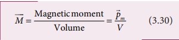
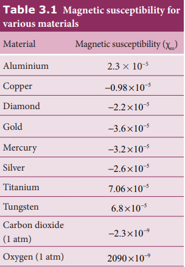
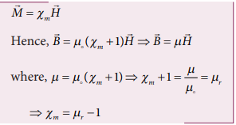

---
title: 'Magnetic Properties'
weight: 4
extensions:

- katex
---   

## Magnetic Properties

All materials are not magnetic in nature. Further, all the magnetic materials will not behave identically. So, in order to differentiate one magnetic material from another, some basic parameters are used. 
They are:

**(a) Magnetising field**

**The magnetic field which is used to magnetize a sample or specimen is called the magnetising field**.Magnetising field is a vector quantity and is denoted by H and its unit is A m–1.

**(b) Magnetic permeability**

**The magnetic permeability is the measure of ability of the material to allow the passage of magnetic field lines through it or measure of the capacity of the substance to take magnetisation or the degree of penetration of magnetic field through the substance.**

In free space, the permeability (or absolute permeability) is denoted by µ0and for any other medium it is denoted by µ.**The relative permeability µr is defined as the ratio between absolute permeability of the medium to the permeability of free space.**

Relative permeability is a dimensionless number and has no units. For free space (air or vacuum), the relative permeability is unity i.e., µr = 1. 

(c) Intensity of magnetisation Any bulk material (any object of finite size) contains a large number of atoms Each atom consists of electrons which undergo orbital motion. Due to orbital motion, electron has magnetic moment which is a vector quantity. In general, these magnetic moments orient randomly, therefore, the net 
magnetic moment is zero per unit volume of 
the material.

When such a material is kept in an external magnetic field, atomic dipoles are induced and hence, they will try to align partially or fully along the direction of 
external field. The net magnetic moment per unit volume of the material is known as intensity of magnetisation. It is a vector quantity. Mathematically, 

The SI unit of intensity of magnetisation is ampere metre–1. For a bar magnet of pole strength qm</sum>,  

length 2l and area of cross-section A, the magnetic moment of the bar magnet is pm = qm<sum> 

x 2l and volume of the bar magnet is V = A |2l| = 2lA . The intensity of magnetisation for a bar magnet is

In magnitude, equation (3.31) is

This means, for a bar magnet the intensity of magnetisation can be defined as the pole strength per unit area (face area).

**(d) Magnetic induction or total magnetic field**

When a substance like soft iron bar is placed in a uniform magnetising field H, the substance gets magnetised. **The magnetic induction (total magnetic 
field) inside the specimen B is equal to the sum of the magnetic field Bo produced in vacuum due to the magnetising field and the magnetic field Bm due to the induced magnetism of the substance.**

**(e) Magnetic susceptibility**

When a substance is kept in a magnetising field H, magnetic susceptibility gives information about how a material responds to the external (applied) magnetic field. In other words, the magnetic susceptibility measures how easily and how strongly a material can be magnetised. It is defined as the ratio of the intensity of magnetisation (M) induced in the material to the 
magnetising field (H)

It is a dimensionless quantity. Magnetic susceptibility for some of the isotropic substances is given in Table 3 1.

**EXAMPLE 3.8**

Compute the intensity of magnetisation of the bar magnet whose mass, magnetic moment and density are 200 g, 2 A m2 and 8 g cm–3, respectively.

**Solution**

Density of the magnet is

Density = Mass/Volume

Volume = Mass/Density

Magnitude of magnetic moment pm = 2 A M2 

Intensity of magnetization,

**EXAMPLE 3.9**

Using the relation B&oline; = μ0(H&oline;
+M&oline;), show that  xm=μr-1.

**Solution**

But from equation (3.33), in vector form, 

**EXAMPLE 3.10**

Two materials X and Y are magnetised whose values of intensity of magnetisation are 500 A m–1 and 2000 A m–1 respectively. If the magnetising field is 1000 A m–1, then which one among these materials can be easily magnetized?.

**Solution**

The susceptibility of material X is 

The susceptibility of material Y is

Since, susceptibility of material Y is greater than that of material X, which implies that material Y can be easily magnetized. 

