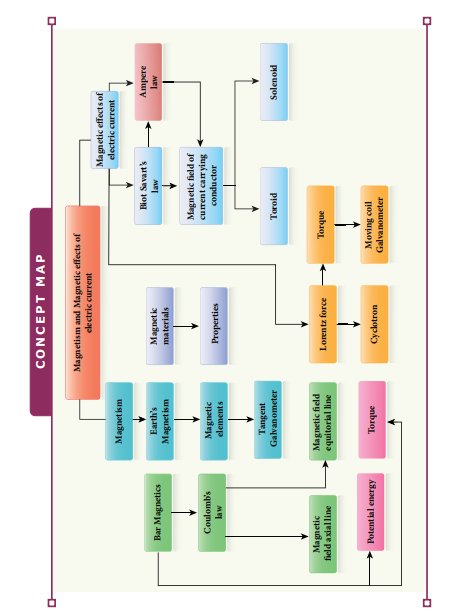
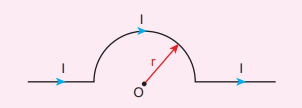
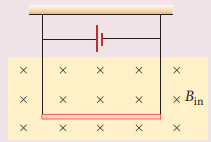

[comment]: <> (katex Header)
 

**SUMMARY**

1. The axis aligned with the geographic meridian is called the geographic meridian, while the one aligned with the magnetic field is called the magnetic meridian.

2. The angle between the magnetic field and the horizontal plane is called magnetic dip or magnetic inclination. It is denoted by   \theta  .

3. The magnetic induction (  \mathbf{B}  ) is a vector quantity denoted by   \mathbf{B}  . Its unit is Tesla (T).

4. Magnetic dipole moment (  \mathbf{pm}  ) is the product of the pole strength and magnetic length. It is denoted by   \mathbf{pm}  .

5. A magnetic pole of strength unity experiences a force of 1 Tesla.

6. Magnetic flux (  \Phi_B  ) is the product of the magnetic induction and the area perpendicular to the field. Its unit is Weber (Wb).

7. Coulomb's inverse law states that the force of attraction or repulsion between two magnetic poles is inversely proportional to the square of the distance between them.

8. Torque is experienced by a magnetic field, and a moving coil galvanometer is used to measure small currents.

9. The process to magnetize a sample is called magnetization, and it is denoted by   \mathbf{H}   with a unit of A/m.

10. Three categories of magnetism are diamagnetic, paramagnetic, and ferromagnetic.

11. Hysteresis refers to the cyclic variation in the magnetizing field.

12. Ampère’s circuital law is   \oint \mathbf{B} \cdot d\mathbf{l} = \mu \mathbf{I}_{\text{enclosed}}  .

13. Magnetic field inside the solenoid is   B = \frac{\mu \mathbf{N}}{\mathbf{I}}   per unit length.

14. Magnetic field interior to the toroid is   B = \frac{\mu \mathbf{N}}{2\pi \mathbf{r}}   per unit length.

15. Lorentz force is   \mathbf{F} = q(\mathbf{E} + \mathbf{v} \times \mathbf{B})  .

16. Charged particle moving in a uniform magnetic field undergoes circular motion.

17. Fleming’s Left Hand Rule: Stretch forefinger, middle finger, and thumb of the left hand such that they are in mutually perpendicular directions. If the forefinger points in the direction of the magnetic field, the middle finger in the direction of electric current, then the thumb points in the direction of the force experienced by the conductors.

18. One ampere is defined as that constant current which, when passed through two infinitely long parallel straight conductors in a vacuum, causes each conductor to experience a force of  2 \times 10^{-7}  newton per meter length of the conductor.

19. When a current-carrying coil is placed in a uniform magnetic field, the net force is always zero, but net torque is not zero unless   \theta = 0  .

20. Moving coil galvanometer is an instrument used for the detection and measurement of small currents.

21. In a moving coil galvanometer, current passing through is directly proportional to the deflection. Mathematically,   I = G\theta  , where   G = \frac{\mathbf{NAB}}{K}   is called the galvanometer constant or current reduction factor.

22. Current sensitivity is defined as the deflection produced per unit current flowing through it,   S_I = \frac{\theta}{I} = \frac{\mathbf{NAB}}{Ks}  .

23. Voltage sensitivity is defined as the deflection produced per unit voltage applied across it,   S_V = \frac{\theta}{V} = \frac{\mathbf{NAB}}{KR_s}  , where   R_s   is the resistance of the galvanometer.

24. Tangent law:   \tan \theta = \frac{Bh}{I}  , where   \theta   is the angle of dip,   B   is the horizontal component of the Earth's magnetic field,   h   is the magnetic intensity of the Earth, and   I   is the magnetic inclination.

25. Galvanometer can be converted into an ammeter of given range by connecting a suitable low resistance (shunt) in parallel to the given galvanometer.

26. An ideal ammeter has zero resistance.

27. Voltmeter is an instrument used to measure potential difference across any element in an electrical circuit.

28. Galvanometer can be converted into a suitable voltmeter of given range by connecting a suitable high resistance (  R_h  ) in series with the galvanometer.

29. An ideal voltmeter has infinite resistance.

**I Multiple Choice Questions**

1. The magnetic field at the center O of the following current loop is

   (a)   \mu_0 \frac{I r}{4}  
   (b)   \mu_0 \frac{I}{4r}  
   (c)   \mu_0 \frac{I r}{2}  
   (d)   \mu_0 \frac{I}{2r}  

**Answer: (a)**

2. An electron moves in a straight line inside a charged parallel plate capacitor of uniform charge density   \sigma  . 

   The time taken by the electron to cross the parallel plate capacitor undeflected when the plates of the capacitor are kept under a constant magnetic field of induction   B   is
   (a)   \frac{\varepsilon \sigma \ell}{eBl}  
   (b)   \frac{\varepsilon \sigma}{\ell Be}  
   (c)   \frac{\varepsilon \sigma \ell}{Be}  
   (d)   \frac{\varepsilon \sigma}{\ell Be}  

**Answer: (c)**

3. A particle having mass   m   and charge   q   accelerated through a potential difference   V  . Find the force experienced when it is kept under a perpendicular magnetic field   \mathbf{B}  .
   (a)   \frac{2}{3} \frac{qBV}{m}  
   (b)   \frac{qBV}{3m}  
   (c)   \frac{2}{3} \frac{qBV}{2m}  
   (d)   \frac{2}{3} \frac{qBV}{3m}  

**Answer: (c)**

4. A circular coil of radius 5 cm and 50 turns carries a current of 3 amperes. The magnetic dipole moment of the coil is nearly
   (a) 1.0 A m²
   (b) 1.2 A m²
   (c) 0.5 A m²
   (d) 0.8 A m²

**Answer: (b)**

5. A thin insulated wire forms a plane spiral of   N = 100   tight turns carrying a current   I = 8   mA. The radii of inside and outside turns are   a = 50   mm and   b = 100   mm respectively. The magnetic induction at the center of the spiral is
   (a) 5 µT
   (b) 7 µT
   (c) 8 µT
   (d) 10 µT

**Answer: (b)**

6. Three wires of equal lengths are bent in the form of loops. One of the loops is a circle, another is a semi-circle, and the third one is a square. They are placed in a uniform magnetic field and the same electric current is passed through them. Which of the following loop configurations will experience greater torque?
   (a) Circle
   (b) Semi-circle
   (c) Square
   (d) All of them

**Answer: (a)**

7. Two identical coils, each with   N   turns and radius   R  , are placed coaxially at a distance   R   as shown in the figure. If   I   is the current passing through the loops in the same direction, then the magnetic field at a point P at a distance of   R/2   from the center of each coil is

   (a)   \frac{8}{5} \frac{NIR}{\mu_0}  
   (b)   \frac{5}{3} \frac{2NI}{R\mu_0}  
   (c)   \frac{8}{5} \frac{NIR}{\mu_0}  
   (d)   \frac{4}{5} \frac{NI}{R\mu_0}  

**Answer: (b)**

8. A wire of length   l   carrying a current   I   along the   Y   direction is kept in a magnetic field given by   \mathbf{B} = \beta \mathbf{i} + \beta \mathbf{j} + \beta \mathbf{k}   T. The magnitude of the Lorentz force acting on the wire is
   (a)   \frac{2}{3} \beta Il  
   (b)   \frac{1}{3} \beta Il  
   (c)   2 \beta Il  
   (d)   \frac{1}{2} \beta Il  

**Answer: (a)**

9. A bar magnet of length   l   and magnetic moment   m   is bent in the form of an arc as shown in the figure. The new magnetic dipole moment will be

   (a)   m  
   (b)   \frac{3\pi m}{2}  
   (c)   \frac{2\pi m}{3}  
   (d)   \frac{m}{2}  

**Answer: (b)**

10. A non-conducting charged ring carrying a charge of   q  , mass   m  , and radius   r   is rotated about its axis with constant angular speed   \omega  . Find the ratio of its magnetic moment with angular momentum is
   (a)   \frac{q}{m}  
   (b)   \frac{2q}{m}  
   (c)   \frac{q}{2m}  
   (d)   \frac{q}{4m}  

**Answer: (c)**

11. The BH curve for a ferromagnetic material is shown in the figure. The material is placed inside a long solenoid which contains 1000 turns/cm. The current that should be passed in the solenoid to demagnetize the ferromagnet completely is

   (a) 1.00 mA
   (b) 1.25 mA
   (c) 1.50 mA
   (d) 1.75 mA

**Answer: (c)**

12. Two short bar magnets have magnetic moments 1.20 Am² and 1.00 Am² respectively. They are kept on a horizontal table parallel to each other with their north poles pointing towards south. They have a common magnetic equator and are separated by a distance of 20.0 cm. The value of the resultant horizontal magnetic induction at the mid-point O of the line joining their centers is (Horizontal components of Earth’s magnetic induction is  3.6 \times 10^{-5}  Wb m⁻²)

   (a)  3.60 \times 10^{-5}  Wb m⁻²
   (b)  3.5 \times 10^{-5}  Wb m⁻²
   (c)  2.56 \times 10^{-4}  Wb m⁻²
   (d)  2.2 \times 10^{-4}  Wb m⁻²

**Answer: (c)**

13. The vertical component of Earth’s magnetic field at a place is equal to the horizontal component. What is the value of the angle of dip at this place?
   (a) 30°
   (b) 45°
   (c) 60°
   (d) 90°

**Answer: (b)**

14. A flat dielectric disc of radius   R   carries an excess charge on its surface. The surface charge density is   \sigma  . The disc rotates about an axis perpendicular to its plane passing through the center with angular velocity   \omega  . Find the magnitude of the torque on the disc if it is placed in a uniform magnetic field whose strength is   B   which is directed perpendicular to the axis of rotation
   (a)   \frac{1}{4} \sigma \omega \pi BR  
   (b)   \frac{1}{2} \sigma \omega \pi BR  
   (c)   \frac{1}{4} \sigma \omega \pi BR  
   (d)   \frac{1}{4} \sigma \omega \pi BR  

**Answer: (d)**

15. The potential energy of magnetic dipole whose dipole moment is   \vec{p} = -0.5 \vec{i} + 0.4 \vec{j} + 0.2 \vec{k}   Am kept in uniform magnetic field   \vec{B} = 0.2 \vec{i}   T.
   (a)   –0.1   J
   (b)   –0.8   J
   (c)   0.1   J
   (d)   0.8   J

**Answer: (c)**

**II Short Answer Questions:**

1. What is meant by magnetic induction?
2. Define magnetic flux.
3. Define magnetic dipole moment.
4. State Coulomb’s inverse law.
5. What is magnetic susceptibility?
6. State Biot-Savart’s law.
7. What is magnetic permeability?
8. State Ampere’s circuital law.
9. Compare dia, para and ferro-magnetism.
10. What is meant by hysteresis?
11. Define magnetic declination and inclination.
12. What is resonance condition in cyclotron?
13. Define ampere.
14. State Fleming's left hand rule.
15. Is an ammeter connected in series or parallel in a circuit? Why?
16. Explain the concept of velocity selector.
17. Why is the path of a charged particle not a circle when its velocity is not perpendicular to the magnetic field?
18. Give the properties of dia / para / ferromagnetic materials.
19. What happens to the domains in a ferromagnetic material in the presence of an external magnetic field?
20. How is a galvanometer converted into (i) an ammeter and (ii) a voltmeter?

**III Long Answer Questions**

1. Discuss Earth’s magnetic field in detail.
2. Deduce the relation for the magnetic field at a point due to an infinitely long straight conductor carrying current.
3. Obtain a relation for the magnetic field at a point along the axis of a circular coil carrying current.
4. Compute the torque experienced by a magnetic needle in a uniform magnetic field.
5. Calculate the magnetic field at a point on the axial line of a bar magnet.
6. Obtain the magnetic field at a point on the equatorial line of a bar magnet.
7. Find the magnetic field due to a long straight conductor using Ampere’s circuital law.
8. Discuss the working of cyclotron in detail.
9. What is tangent law? Discuss in detail.
10. Derive the expression for the torque on a current-carrying coil in a magnetic field.
11. Discuss the conversion of galvanometer into an ammeter and also a voltmeter.
12. Calculate the magnetic field inside and outside of the long solenoid using Ampere’s circuital law.
13. Derive the expression for the force between two parallel, current-carrying conductors.
14. Give an account of magnetic Lorentz force.
15. Compare the properties of soft and hard ferromagnetic materials.
16. Derive the expression for the force on a current-carrying conductor in a magnetic field.

**IV. Numerical Problems**

1. A bar magnet having a magnetic moment   \vec{m}   is cut into four pieces, i.e., first cut into two pieces along the axis of the magnet and each piece is further cut along the axis into two pieces. Compute the magnetic moment of each piece.

   Answer:   \vec{m}_{\text{new}} = \frac{1}{4} \vec{m}  

2. A conductor of linear mass density 0.2 g m⁻1 suspended by two flexible wires as shown in the figure. Suppose the tension in the supporting wires is zero when it is kept inside the magnetic field of 1 T whose direction is into the page. Compute the current inside the conductor and also the direction of the current. Assume \( g = 10 \) m s⁻2.
   Answer: 2 mA

3. A circular coil with cross-sectional area 0.1 cm² is kept in a uniform magnetic field of strength 0.2 T. If the current passing in the coil is 3 A and the plane of the loop is perpendicular to the direction of the magnetic field. Calculate (a) the total torque on the coil.
(a) total torque on the coil
(b) total force on the coil
(c) average force on each electron in the 
coil due to the magnetic field. (The free 
electron density for the material of the wire 
is 1028 m–3).
Answer (a) zero (b) zero (c) 0.6 x 10–23 N
4. A bar magnet is placed in a uniform 
magnetic field whose strength is 0.8 T.
If the bar magnet is oriented at an angle 
30o with the external field experiences a 
torque of 0.2 Nm. Calculate:
 (i) the magnetic moment of the magnet
(ii) the work done by the applied force 
in moving it from most stable configuration 
to the most unstable configuration and 
also compute the work done by the applied 
magnetic field in this case. 
Answer (i) 0.5 A m2 (ii) W = 0.8 J and 
W
mag = -0.8 J
5. A non - conducting sphere has a 
mass of 100 g and radius 20 cm. A flat 
compact coil of wire with turns 5 is
wrapped tightly around it with each 
turns concentric with the sphere. This 
sphere is placed on an inclined plane 
such that plane of coil is parallel to the 
inclined plane. A uniform magnetic 
field of 0.5 T exists in the region in 
vertically upward direction. Compute 
the current I required to rest the sphere 
in equilibrium. Answer
2
π
A

6. Calculate the magnetic field at the 
centre of a square loop which carries 
a current of 1.5 A, length of each side 
being 50 cm. Answer 3.4 x 10–6 

**BOOKS FOR REFERENCE**

**1\.** H. C. Verma, _Concepts of Physics – Volume_

**2\.** Halliday, Resnick and Walker, _Fundamenta_

**3\.** Serway and Jewett, _Physics for scientist and_ publishers, Eighth edition.

4\. David J. Griffiths, Introduction to electrodyn

**5\.** Rita John, _Solid State Physics (Magnetism c_ Ltd.

**6\.** Paul Tipler and Gene Mosca, _Physics for_ Sixth edition, W.H. Freeman and Company

(b) total force on the coil (c) average force on each electron in the

coil due to the magnetic field. (The free electron density for the material of the wire is 1028 m–3).

Answer (a) zero (b) zero (c) 0.6 x 10**–23** N **4\.** A bar magnet is placed in a uniform

magnetic field whose strength is 0.8 T. If the bar magnet is oriented at an angle 30o with the external field experiences a torque of 0.2 Nm. Calculate:

(i) the magnetic moment of the magnet (ii) the work done by the magnetic field

in moving it from most stable configuration to the most unstable configuration and also compute the work done by the applied magnetic field in this case.

Answer (i) 0.5 A m2 (ii) _W_ = 0.8 J and _W_mag \= -0.8 J

**5\.** A non - conducting sphere has a mass of 100 g and radius 20 cm. A flat compact coil of wire with turns 5 is  

_2_, Bharati Bhawan Publisher.

_ls of Physics_, Wiley Publishers, 10th edition.

_engineers with modern physics_, Brook/Coole

_amics_, Pearson publishers.

_hapter)_, McGraw Hill Education (India) Pvt.

_scientist and engineers with modern physics_, .

wrapped tightly around it with each turns concentric with the sphere. This sphere is placed on an inclined plane such that plane of coil is parallel to the inclined plane. A uniform magnetic field of 0.5 T exists in the region in vertically upward direction. Compute the current _I_ required to rest the sphere in equilibrium. Answer 2

π _A_

6\. Calculate the magnetic field at the centre of a square loop which carries a current of 1.5 A, length of each side being 50 cm. Answer 3.4 x 10–6 T

  
**ICT CORNER**
**Magnetism**

In this activity you will be able to visualize and understand the working of cyclotron.

**STEPS:**
- Open the browser and type ‘physics.bu.edu/~duffy/HTML5/cyclotron.html’ in the address bar. 
- Click ‘play’ to release the positively charged particle between the D-shaped sections. 
- Observe trajectory of positively charged particle under the magnetic field between D-shaped 
sections. 
- Note the kinetic energy of the particle after some time (say t = 20 s)

**URL:** http://physics.bu.edu/~duffy/HTML5/cyclotron.html

\* Pictures are indicative only. \* If browser requires, allow **Flash Player** or **Java Sc**

