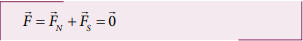
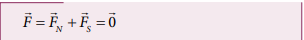
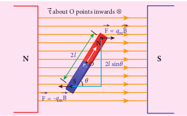
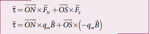
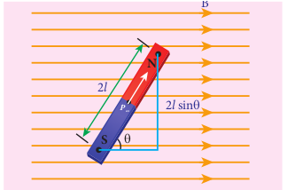
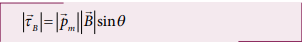
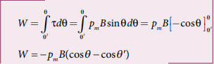
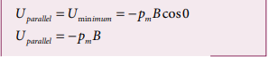
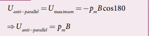

---
title: 'TORQUE ACTING ON A BAR MAGNET IN UNIFORM MAGNETIC FIELD'
weight: 3
extensions:
- katex
---   

**3.3 TORQUE ACTING ON A BAR MAGNET IN UNIFORM MAGNETIC FIELD**

Consider a magnet of length 2l and pole strength qm kept in a uniform magnetic field B/ as shown in Figure 3.16. Each pole experiences a force of magnitude qmB but acting in opposite directions. Therefore, the net force exerted on the magnet is zero and hence, there is no translatory motion. These two equal and opposite forces constitute a couple (about midpoint of bar magnet) tend 
to align the magnet in the direction of the magnetic field B.

The force experienced by north pole,

The force experienced by south pole, 

Adding equations (3.23) and (3.24), we 
get the net force acting on the dipole as

**Figure 3.16** Magnetic dipole kept in a 
uniform magnetic field

The moment of force or torque experienced by north and south pole about point O is

By using right hand cork screw rule, we conclude that the total torque is pointing into the paper. Since the magnitudes |ON| = |OS| = l and |qmB| = |qmB| , the magnitude of total torque about point O

(a) Why a freely suspended bar magnet in your 
laboratory experiences only torque (rotational motion) but not any translatory motion even though Earth 
has non-uniform magnetic field?It is because Earth’s magnetic field is locally(physics laboratory)uniform.

(b) Suppose we keep a freely suspended bar magnet in a non-uniform magnetic field. What will happen? It will undergo translatory motion (net force) and rotational motion (torque). 

## Potential energy of a bar magnet in a uniform magnetic field

**Figure 3.17**: A bar magnet (magnetic dipole) in a uniform magnetic field

When a bar magnet (magnetic dipole) of dipole moment
pm is held at an angle θ with the direction of a uniform magnetic field B, as shown in Figure 3.17 the magnitude of the torque acting on the dipole is

If the dipole is rotated through a very small angular displacement dθ against the torque τB at constant angular velocity, then the work done by external torque Text for this small angular displacement is given by

The bar magnet has to be moved at constant angular velocity, which implies that |TB| = |Text|

Total work done in rotating the dipole from θʹ to θ is

This work done is stored as potential energy in bar magnet at an angle θ (when it is rotated from θʹ to θ) and it can be written as

In fact, the equation (3.26) gives the difference in potential energy between the angular positions θʹ and θ. If we choose the reference point as θʹ = 90o, so that second term in the equation becomes zero, the equation (3.26) can be written as

The potential energy stored in a bar magnet in a uniform magnetic field is given by

**Case 1** 

1. If θ = 0o, then

2. If θ = 180o, then

**EXAMPLE 3.7**

Consider a magnetic dipole which on switching ON external magnetic field orient only in two possible ways 
i.e., one along the direction of the magnetic field (parallel to the field) and another anti-parallel to magnetic field. Compute the energy for the possible 
orientation.

**Solution**

Let pm be the dipole and before switching ON the external magnetic field, there is no orientation. Therefore, the energy U = 0. 

As soon as external magnetic field is switched ON, the magnetic dipole orient parallel (θ = 0o) to the magnetic field with energy,

since cos 0o = 1Otherwise, the magnetic dipole orients 
anti-parallel (θ = 180o) to the magnetic field with energy, 

since cos 180o = -1