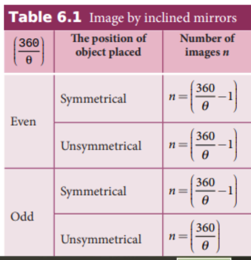

**INTRODUCTION**

Light is mystical. Yet, its behaviour is so fascinating. It is difficult to comprehend light as a single entity. The _ray optics_ deals with light that is represented as a ray travelling in straight lines. Here, the geometrical constructs get the permanence to understand some of the characteristics of light and the phenomena associated with it. There are several other phenomena which can only be explained using _wave optics_, which we study in the next Unit. There is also a quantum aspect of light which we can study as _quantum optics_ in graduate level courses.

### Ray optics

Light travels in a straight line in a medium. Light may deviate in its path only when it encounters the boundary of another medium (or) an obstacle. A ray of light gives information only about the direction of light. It does not give information about the other characteristics like intensity and colour of light. However, a ray is a sensible representation of light in ray optics. The path of the light is called a ray of light and a bundle of such rays is called a beam of light. In this chapter, we can explain the phenomena of reflection, refraction, dispersion and scattering of light, using the ray depiction of light.

### Reflection

**The bouncing back of light into the same medium when it encounters a reflecting surface is called _reflection_ of light**. Any polished surface can reflect light. Mirrors which are silver coated at their back can reflect almost 90% of the light falling on them. The angle of incidence _i_ and the angle of reflection _r_ are measured with respect to the normal drawn to the surface at the point
  

of incidence of light. **According to laws of reflection, (i) The incident ray, reflected ray and normal**

**to the reflecting surface are all coplanar (ie. lie in the same plane).**

**(ii) The angle of incidence _i_ is equal to the angle of reflection _r_.**

_i = r_ (6.1)

The law of reflection is shown in Figure 6.1.

**Figure 6.1 Reflection of light**

The laws of reflection are valid at each point for any reflecting surface whether the surface is flat (or) curved. If the reflecting surface is flat, then incident parallel rays after reflection come out as parallel rays as shown in Figure 6.2(a). If the reflecting surface is irregular, then the incident parallel rays after reflection come out as irregular rays (not parallel rays). Still the laws of reflection are valid at every point of incidence in irregular reflection as shown in Figure 6.2(b).

### Angle of deviation due to reflection

**The angle between the direction of incident ray and the reflected ray is called _angle of deviation due to reflection_.** It is calculated by a simple geometry as shown in Figure 6.3(a). The incident light is AO. The reflected light is OB. The un-deviated light is OC which is the continuation of the incident light. The angle between OB and OC is the angle of deviation _d_. From the geometry, it is written as, _d_ = 180 – (_i_+_r_). As, _i_ = _r_ in reflection, we can write angle of deviation in reflection as,

_d =_ 180 _– 2i_ (6.2)

The angle of deviation can also be measured in terms of the glancing angle _α_ which is measured between the incident ray AO and the reflecting plane surface XY as shown in Figure 6.3(b). By geometry, the angles ∠_AOX_ = _α_, ∠_BOY_ = _α_ and ∠_YOC_ = _α_ (all are same). The angle of deviation _d_ is the angle ∠_BOC_. Therefore,

_d_ = 2α (6.3)
  

**EXAMPLE 6.1** Prove that for the same incident light when a reflecting surface is tilted by an angle _θ_, the reflected light will be tilted by an angle 2_θ_.

**_Solution_** _AB_ is the reflecting surface as shown in the Figure. Both the incident ray _IO_ and the reflected ray _OR_1 subtend angle i with the normal _N_ as the angle of incidence is equal to angle of reflection. When the surface _AB_ is tilted to ¢ ¢_A B_ by an angle _θ_, the normal _N_ is also is tilted to ′_N_ by the same angle _θ_. Remember that the position of the incident ray _IO_ remains unaltered. But the reflected ray now is _OR_2\. Now, in the tilted system, the angle of incidence, ∠_N'OI_ = _i+θ_ and the angle of reflection, ∠_N'OR_2 = _i+θ_ are the same. The angle between _ON'_ and _OR_1 is, ∠_N'OR_1 = _i_ – _θ_. The angle tilted on the reflected light is the angle between _OR_1 and _OR_2 which is ∠_R_1_OR_2\. From the geometry we can write,  

∠_R_1_OR_2 = ∠_N'OR_2 – ∠_N'OR_1 = (_i_+_θ_) – (_i_–_θ_) ∠_R_1_OR_2 = 2_θ_.

### Image formation in plane mirror

Let us consider a point object _A_ placed in front of a plane mirror. The point of incidence is _O_ on the mirror as shown in the Figure. 6.4(a).

  

A light ray _AO_ from the point object is incident on the mirror and it is reflected along _OB_. The normal is _ON_.

The angle of incidence ∠_AON_ = angle of reflection ∠_BON_

Another ray _AD_ incident normally on the mirror at _D_ is reflected back along _DA_. When _BO_ and _AD_ are extended backwards, they meet at a point _A'_. Thus, the rays appear to come from a point _A'_ which is behind the plane mirror. The object and its image are at equal perpendicular distances from the plane mirror which can be shown by the following explanation.

Angle ∠_AON_ = angle ∠_DAO_ \[Since they are alternate angles\]

Angle ∠_BON_ = angle ∠_O_ ¢_A D_ \[Since they are corresponding angles\]

Hence, it follows that angle, ∠_DAO_ = ∠_O_ ¢_A D_

The triangles ∆_ODA_ and ∆_OD_ ¢_A_ are congruent

∴ _AD_ = ¢_A D_ This shows that the image distance _di_

inside the plane mirror is equal to the object distance _do_ in front of the plane mirror.

The image formed by the plane mirror for extended object is shown in Figure 6.4(b).

### Characteristics of the image formed by plane mirror

(i) The image formed by a plane mirror is virtual, erect and laterally inverted sidewise (left / right).

(ii) The size of the image is equal to the size of the object.

(iii) The image distance behind the mirror is equal to the object distance in front of the mirror.

(iv) If an object is placed between two plane mirrors inclined at an angle _θ_, then the number of images _n_ formed is given in Table 6.1 the images formed are shown in Figure 6.5.  

**Table 6.1 Image by inclined mirrors**

**EXAMPLE 6.2**

What is the height of the mirror needed for a person to see his/her image fully on the mirror?

**_Solution_** Let us assume a person of height _h_ is standing in front of a vertical plane mirror. The person could see his/her head when light from the head falls on the mirror and gets reflected to the eyes. Same way, light from the feet falls on the mirror and gets reflected to the eyes.

If the distance between his head _H_ and eye _E_ is _h1_ and distance between his feet _F_ and eye _E_ is _h2_. The person’s total height is, _h._ Here it is, _h_ = _h1_ + _h2_

By the law of reflection, the angle of incidence and angle of reflection are the same for the two extreme reflections. The normals are now the bisectors of the angles between the incident and the reflected rays at the two points. By geometry, the height of the mirror needed is only half of the

height of the person. $\frac{h_1+h_2}{2} = \frac{h}{2}$

Does the height depend on the distance between the person and the mirror?