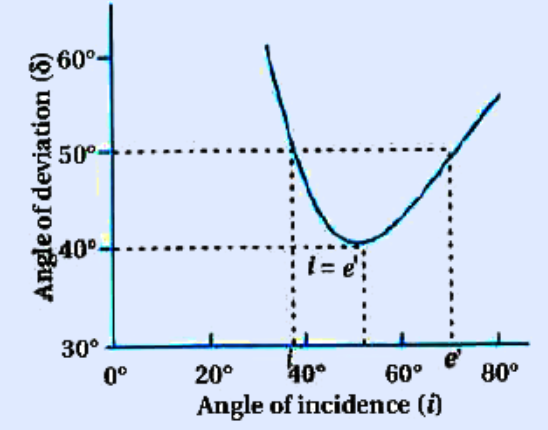
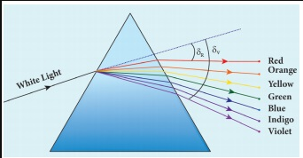

## PRISM

A prism is a triangular block of transparent glass. It is bounded by the three plane faces. Its one face is rough which is called base of the prism. The other two faces are polished which are called refracting faces of the prism. The angle between the two refracting faces is called angle of the prism (or) refracting angle (or) apex angle. It is represented as _A_ in Figure 6.39.

A

### Angle of deviation produced by prism

Consider a prism _ABC._ The faces _AB_ and _AC_ are polished and the face _BC_ is rough. Let light ray _PQ_ is incident on one of the refracting faces of the prism as shown in Figure 6.40. The angles of incidence and refraction at the first face _AB_ are _i_1 and _r_1\. The path of the light inside the prism is _QR_. The angles of incidence and refraction at the

**6.7**

_a_  

second face _AC_ is _r_2 and _i_2 respectively. RS is the ray emerging from the second face. Angle _i_2 is also called as angle of emergence. **The angle between the direction of incident ray and the emergent ray is called the _angle of deviation d_ in a prism**. The two normals drawn at the point of incidence _Q_ and at the point of emergence _R_ meet at point _N_. The extended incident ray and the emergent ray meet at point _M_.

R **i**1 **i**2r1

d1 d2

r2

M

N

d

A A

P

B C

Q S

The angle of deviation _d_1 at surface _AB_ is,

_ngle RQM d i r_∠ = = −1 1 1 (6.81)

The angle of deviation _d_2 at surface _AC_ is,

_angle QRM d i r_∠ = = −2 2 2 (6.82)

Total angle of deviation _d_ produced is,

_d d d_\= +1 2 (6.83)

Substituting _d_1 and _d_2, in equation (6.83)

_d_ = (_i_1 – _r_1) + (_i_2 – _r_2)

After rearranging,

_d i i r r_\= + − +( ) ( )1 2 1 2 (6.84)

In the quadrilateral _AQNR_, two of the angles (at the vertices _Q_ and _R_) are right angles. Therefore, the sum of the other angles of the quadrilateral should be 180o.
| AA |
|------|------|------|------|------|------|------|

| Qi1 |Md1 |dd2 |i2 |S |
| r1 |Rr2 |

| P |

| N |
  

∠_A_ + ∠_QNR_ = 180º (6.85)

In the triangle ∆_QNR_,

_r_1+ _r_2+ ∠_QNR_ = 180o (6.86)

Comparing the two equations (6.85) and (6.86) we get,

_r r A_1 2+ = (6.87)

Substituting this in equation (6.84) for angle of deviation,

_d i i A_\= + −1 2 (6.88)

Thus, the angle of deviation depends on the angle of incidence _i_1, angle of emergence _i_2 and the angle for the prism _A_. But, for a given angle of incidence, the angle of emergence is decided by the refractive index of the material of the prism. Hence, the angle of deviation for a monochromatic light depends on these following factors. (i) the angle of incidence (ii) the angle of the prism (iii) the refractive index of the material of

the prism (which decides the angle of emergency).

**EXAMPLE 6.19**

A monochromatic light is incident on an equilateral prism at an angle 30o and is emergent at an angle of 75o. What is the angle of deviation produced by the prism?

**_Solution_** Since, the prism is equilateral, _A_\= °60 ;

Given, _i_1 30= °; _i_2 75= °

Equation for angle of deviation, _d_ \= _i1 + i2 – A_ Substituting the values, _d_ = 30°+75°–60°=45° The angle of deviation produced, _d_\= °45  

**EXAMPLE 6.20**

Light ray falls at normal incidence on the first face and emerges gracing the second face for an equilateral prism.

(a) What is the angle of deviation produced?

(b) What is the refractive index of the material of the prism?

**_Solution_**

**60°**

**30°**

**ic d**

The given situation is shown in the figure.

Given, _A_\= °60 ; _i_1 0= °; _i_2 90= °

(a) Equation for angle of deviation,

_d i i A_\= + −1 2

Substituting the values,

_d_\= °+ °− °= °0 90 60 30

The angle of deviation produced is, _d_\= °30

(b) The light inside the prism must be falling on the second face at critical angle as it graces the boundary. _i_c = 90° – 30° = 60°

Equation for critical angle is, sin_i nc_ \= 1

_n i_

_n c_

\= = = = = 1 1

60 1

3 2 2 3

1 15 sin

; sin /

. 

The refractive index of the material of the prism is, _n_ = 1.15
| 30° |
|------|------|------|------|

| ic |d |

  

### Angle of minimum deviation

A graph plotted between the angle of incidence and angle of deviation is shown in Figure 6.41. One could observe that the angle of deviation decreases with increase in angle of incidence and reaches a minimum value _D_ and then continues to increase.

**The minimum value of angle of deviation is called angle of _minimum deviation D_. At minimum deviation**,

(i) the angle of incidence is equal to the angle of emergence, _i_1 = _i_2.

(ii) the angle of refraction at the face one and face two are equal, _r_1 = _r_2).

_i irr_

(iii) the refracted ray inside the prism is parallel to its base of the prism.

The case of angle of minimum deviation is shown in Figure 6.42.

### Refractive index of the material of the prism

At minimum deviation, _i_1 = _i_2 = _i_ and _r_1 = _r_2 = _r_

Now, the equation (6.88) becomes,

_D i i A i A i A D_

\= + − ⇒ − = +( )

1 2 2 2

(or)

The equation (6.87) becomes,

_r r A r A r A_ 1 2 2

2 + = ⇒ = =(or)

Substituting _i_ and _r_ in Snell’s law, _n i r_

\= sin sin

_n_

_A D_

_A_ \=

+  

  

     

sin

sin

2

2

(6.89)

The above equation is used to determine the refractive index of the material of the prism. The angles _A_ and _D_ can be measured experimentally.

**EXAMPLE 6.21**

The angle of minimum deviation for an equilateral prism is 37o. Find the refractive index of the material of the prism.

**_Solution_** Given, _A_ \= 60°; _D_ \= 37°

Equation for refractive index is,

_n_

_A D_

_A_ \=

+  

  

     

sin

sin

2

2

Substituting the values,
| 2 |
|------|
|  A  |

| 2 |
|------|
|  A  |
  

_n_\=

+

 



 



  

 

\= ( )sin

sin

sin .

sin

60 37 2

60 2

48 5

0 0

0

0

30 0 75 0 5

1 5 0( ) = =

. .

.

The refractive index of the material of the prism is, _n_ = 1.5

### Dispersion of white light through prism

The angle of deviation produced by a prism is so far discussed only for monochromatic light (i.e. light of single colour). When white light enter in to a prism, an effect called _dispersion_ takes place. **Dispersion is splitting of white light into its constituent colours. This band of colours of light is called its** **_spectrum_**. When a narrow beam of parallel rays of white light is incident on a prism and the refracted beam is received on a white screen. A band of colours is obtained in the order, recollected by the word: VIBGYOR i.e., Violet, Indigo, Blue, Green, Yellow, Orange and Red. The violet is the most deviated colour and red is the least deviated colour as shown in Figure 6.43.

The colours obtained in a spectrum depend on the nature of the light source. Each colour in vacuum has a definite wavelength. The red colour has the longest wavelength of 700 nm while the violet  

colour has the shortest wavelength of 400 nm in vacuum. Though all the colours have different wavelengths, they all travel with the same speed in vacuum. The speed of light is independent of wavelength in vacuum. Therefore, vacuum is a non- dispersive medium.

Sir Isaac Newton has demonstrated through a classic experiment to produce white light by recombining all the colours of VIBGYOR. He used a prism to produce dispersion and made all the colours to incident on another inverted prism to combine all the colours to get white light as shown in figure.

**Points to Ponder**

But, when the white light enters a medium the red colour travels with the highest speed and violet colour travels with least speed. Hence, the wavelengths of colours in a medium are no longer the same as they are in vacuum. Actually, the dispersion takes place in a medium because of the difference in speed for different colours in a medium. In other words, the refractive index of the material of the prism is different for different colours. For violet colour, the refractive index is the highest and for red colour the refractive index is the least. The refractive index of two different glasses for different colours is shown in Table 6.4.

**Table 6.4 Refractive indices for different wavelengths**

| **Colour** | **Wavelength in vacuum (nm)** | **Crown glass** | **Flint glass** |
|------------|-------------------------------|-----------------|-----------------|
| Violet     | 396.9                         | 1.533           | 1.663           |
| Blue       | 486.1                         | 1.523           | 1.639           |
| Yellow     | 589.3                         | 1.517           | 1.627           |
| Red        | 656.3                         | 1.515           | 1.622           |

### Dispersive Power

Consider a beam of white light passing through a prism. It gets dispersed into its constituent colours as shown in Figure 6.44.

If the angle of prism is small of the order of 10o, the prism is said to be a

Rainbow appears in sky durin where there are water droplets r when the sun is at the back of the

enters a water droplet and the white light is primary rainbow is formed when the light ent reflection inside it. Sometimes, a secondary ra rainbow as shown in the figure. The seconda raindrop undergoes two total internal reflectio is from violet to red whereas in secondary r of view in primary rainbow from violet to re secondary rainbow from red to violet is from  

small angle prism. When rays of light pass through such prisms, the angle of minimum deviation also becomes small. Let _A_ be the angle of a small angle prism and _δ_ be its angle of minimum deviation, then equation (6.89) becomes,

g mild shower (or) near the fountains/falls emain suspended in air. A rainbow is seen observer. Dispersion occurs when sunlight split into its constituent seven colours. A ering a droplet undergoes one total internal inbow is also formed enveloping the primary ry rainbow is formed when light entering a ns. The order of colour in primary rainbow ainbow it is from red to violet. The angle d is from 40o to 42o. The angle of view for

52o to 54o.

**White Light**

**White Light Primary rainbow**

**42**

**54** **52**

**40**

**Secondary rainbow White Light**

**White Light**

**Water drops**

**Water drops**

vR

| 396.9 |1.533 |
|------|------|
| 486.1 |1.523 |
| 589.3 |1.517 |
| 656.3 |1.515 |
  

_n_

_A_

_A_ \=

+  

  

     

sin

sin

δ 2

2

(6.90)

For small angles of _A_ and _δ_,

sin _A A_+

 



 ≈

+

 



 

_d d_ 2 2

sin _A A_ 2 2 

  

 ≈ 

  

 

∴ =

+  

  

     

\= + = +_n_

_A_

_A A_

_A A_

_d d d_2

2

1

On further simplifying, _d A_

_n_\= −1

_d_ \= −( )_n A_1 (6.91)

When white light enters the prism, the deviation is different for different colours. Thus, the refractive index is also different for different colours.

Let _δV_, _δR_ are the angles of minimum deviation for violet and red colour. Let _nV_ and _nR_ be the refractive indices for the violet and red colour respectively.

For Violet colour, _dV Vn A_\= −( )1 (6.92)

For Red colour, _dR Rn A_\= −( )1 (6.93)

As, angle of minimum deviation for violet colour _δV_ is greater than angle of minimum deviation for red colour _δR_, the refractive index for violet colour _nV_ is greater than the refractive index for red colour _nR_.

Subtracting _δR_ from _δV_ we get,

_δV_– _δR_ \= (_nV_–_nR_)_A_ (6.94)

**The angular separation between the two extreme colours (violet and red) in the spectrum (_δV_–_δR_) is called the _angular dispersion_**.  

If we take _δ_ as the angle of minimum deviation for any mean colour (green or yellow) and _n_ the corresponding refractive index. Then,

_δ_ \= (_n_ – 1)_A_ (6.95)

**_Dispersive power ω is defined as the ratio of the angular dispersion for the extreme colours to the deviation for any middle colour._** Dispersive power is the ability of the material of the prism to produce dispersion.

_w d d d_

\= = −angular dispersion

middledeviation _V R_ (6.96)

Substituting for _d dV R_−( ) and ( ),δ

_w_ \= −( ) −

_n n n V R_

( )1 (6.97)

The dispersive power is a dimensionless and unitless quantity. The dispersive power is always positive. The dispersive power of a prism depends only on the nature of material of the prism and it is independent of the angle of the prism.

**EXAMPLE 6.22**

Find the dispersive power of a prism if the refractive indices of flint glass for red, green and violet colours are 1.613, 1.620 and 1.632 respectively.

**_Solution_** Given, _nV_\=1.632; _nR_\=1.613; _nG_\=1.620 Equation for dispersive power is,

_w_ \= −( ) −

_n n n V R_

_G_( )1

Substituting the values,

_w_ \= − −

\= = 1 632 1 613

1 620 1 0 019 0 620

0 0306. . .

.

. .

The dispersive power of the prism is, _w_ \= 0 0306.
| 2 |
|------|
|  A  |
  

### Scattering of sunlight

When sunlight enters the atmosphere of earth, the particles present in the atmosphere change the direction of the light. This process is known as scattering of light.

**If the scattering of light is by atoms and molecules which have size _a_ very much less than that of the wave length _λ_ of light, (_a_<<_λ_), then the scattering is called _Rayleigh’s scattering_**. The intensity of light scattered in Rayleigh’s scattering is inversely proportional to fourth power of wavelength.

_I_ µ 1 4_l_ (6.98)

According to equation 6.89, during day time, violet colour which has the shortest wavelength gets more scattered then the other colours. The next scattered colour is blue. As our eyes are more sensitive to blue colour than violet colour, the sky appears blue during day time as shown in Figure 6.45(b). But, during sunrise and sunset, the light from sun travels a greater distance through the atmosphere. Hence, the blue light which has shorter wavelength is scattered away and the red light which has longer wavelength and less-scattered manages to reach our eye. This is the reason for the reddish appearance of sky during sunrise and sunset as shown in Figure 6.45(a).

If light is scattered by large particles like dust and water droplets present in the atmosphere which have size _a_ greater than the wavelength _λ_ of light, (_a_ >> _λ_), the intensity of scattering is equal for all the colours. This non-Rayleigh’s scattering is independent of wavelength. It happens in clouds which contains large amount  

of dust and water droplets. Thus, in clouds all the colours get equally scattered. This is the reason for the whitish appearance of cloud as shown in Figure 6.45(c). But, the rain clouds appear dark because of the condensation of water droplets on dust particles that makes the cloud opaque.

If earth has no atmosphere there would not have been any scattering and the sky would appear dark. That is why sky appears dark for the astronauts who could see the sky from above the atmosphere.

**Earth**

**Sun**

**(a)**

**Day**

**Earth**

**Sun**

**Sunrise**

**Earth**

**Sun**

**(b)**

**(a)**

**Day**

**Figure 6.45 Scattering of different types**
  

„ A ray of light gives the direction of light. „ Law of reflection is, i = r „ Paraxial rays are the rays travelling close to „ small angles with it. „ The relation between focal length and r

2 2

_f R R_ \= =(or) f

„ Cartesian sign conventions are to be followe

„ The mirror equation is, 1 1 1 _v u f_ \+ =

„ The magnification in spherical mirror is, m

„ Light travels with lesser velocity in opticall „ Refractive index is the ratio of speed of lig

_n c_\= _v_

„ Optical path is the equivalent path travell through a optically denser medium. ′ =_d_

„ Law of refraction also called as Snell’s law i „ In product form is, _n i n r_1 2sin sin=

„ The relative refractive index of second med

„ The apparent depth is always lesser than ac

is, ′ =_d d n_

„ The critical angle of incidence ic for a ray in angle for which the angle of refraction is 90

„ Equations for critical angle incidence is, sin

„ Snell’s window is the restricted area of circ from water due to critical angle incidence

_R d n_

_R d_

_n_ \=

−



 



 

\= −

1

1 12 2 ( )or

„ Optical fibre makes use of critical angle inc

is, _i n n_

_na_ \= −









 −sin 1 1

2 2 2

2 3

. Here, _n_1, _n_2, _n_3 are

surrounding medium respectively. „ Glass slabs produce a lateral displacement

lateral shift is, L _t i r_

_r_ \=

−( ) ( )



 





 sin

cos