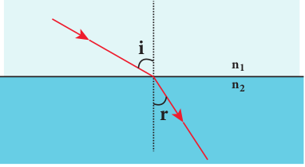
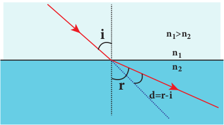
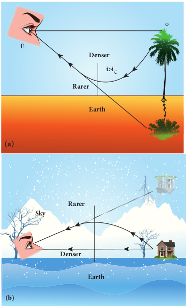
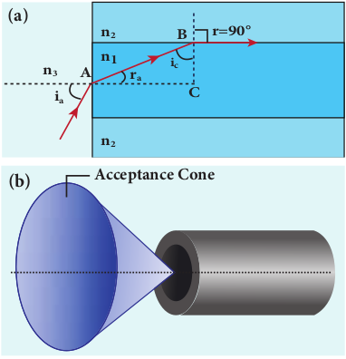

## REFRACTION

**Refraction is passing of light from one optical medium to another optical medium through a boundary**. In refraction, the angle of incidence _i_ in one medium and the angle of refraction _r_ in the other medium are measured with respect to the normal drawn to the surface at the point of incidence of light. According to laws of refraction, **(i) The incident ray, refracted ray and**

**normal to the refracting surface are all coplanar (ie. lie in the same plane).**

**(ii) The ratio of sine of angle of incident _i_ in the first medium to the sine of angle of refraction _r_ in the second medium is equal to the ratio of refractive index _n_2 of the second medium to the refractive index _n_1 of the first medium.**

sin sin

_i r_

_n n_

\= 2

1

(6.18)

The above equation is in the ratio form. It can also be written in a product form as,

_n i n r_1 2sin sin= (6.19)

**6.4**
  

The law of refraction is also known as Snell's law.

The refraction at a boundary is shown in Figure 6.15.

**n1**

**n2**

**i**

**r n2**

For normal incidence of light on a surface, the angle of incidence is zero.

**Note**

### Angle of deviation due to refraction

**The angle between the direction of incident ray and the refracted ray is called _angle of deviation due to refraction_.** When light travels from rarer to denser medium, it deviates towards normal as shown in Figure 6.16. The angle of deviation in this case is,

_d_ = _i_ – _r_ (6.20)

**i**

**r d=i-r**

**n1<n2**

**n1 n2**

On the other hand, if light travels from denser to rarer medium, it deviates away from normal as shown in Figure 6.17. The angle of deviation in this case is,

_d_ = _r_ – _i_ (6.21)

**i**

**r**

**n1>n2**

**n1 n2**

**d=r-i**

### simultaneous reflection (or) refraction

In any refracting surface there will also be some reflection taking place. Thus, the intensity of refracted light will be lesser than the incident light. **The phenomenon in which a part of light from a source undergoing reflection and the other part of light from the same source undergoing refraction at the same surface is called _simultaneous reflection (_or) _simultaneous refraction_.** This is shown in Figure 6.18. Such surfaces are available as partially silvered glasses.

**i i**

Normal

Incident ray Reected ray

Refracted ray

**n2 r**

Reecting surface

Refracted ray

**Figure 6.18 Simultaneous reflection (or)** refraction
| i |n >n1n 21 |
|------|------|------|------|
| rd=r-i |n2 |

| rnd=i-r 2 |

| Incident ray |Reected ra |y |
|------|------|------|------|------|------|
| i |i |

| Reecting surface |r |n2 |
  

### Principle of reversibility

**The _principle of reversibility_ states that light will follow exactly the same path if its direction of travel is reversed.** This is true for both reflection and refraction as shown in Figure 6.19.

**i r i r** (a)

**Plane Mirror**

**i**

**r**

**Rarer (1) Denser (2)**

**i**

**r Rarer (1) Denser (2)**

**Plane Mirror**(b)

Production of optical surfaces capable of refracting as well as reflecting is possible

by properly coating the surfaces with suitable materials. Thus, a glass can be made partially see through and partially reflecting. These glasses are commercially called as two-way mirror, half-silvered mirror, semi-silvered mirror etc. This gives a perception of regular mirror if the other side is made dark. But, still hidden cameras can be kept behind such mirrors. We need to be cautious when we stand in front of mirrors kept in unknown places. T method to test the two way mirror. Place th nail on the mirror surface. If there is a gap nail and its image, then it is a regular mirro fingernail directly touches its image, then it way mirror.  

### Relative refractive index

In equation (6.18), **the term _n n_**

**2**

**1**



 



  **is called**

**_relative refractive index_ of second medium with respect to the first medium** which is denoted as _n_21.

_n n n_21

2

1

\= (6.22)

The concept of relative refractive index gives rise to other useful relations such as, (i) Inverse rule:

_n n_

_n n n n_12

21

1

2 2 1

1 1 = = (or)

/ (6.23)

(ii) Chain rule:

_n n n n n_

_n n_

_n n_32 31 12

3

2

3

1

1

2

\= × = × or ( ) (6.24)

here is a e finger

between r. If the

is a two

**20% 80%**

**CAN SEE THROUGH**

**CAN’T SEE THROUGH**

**LIGHT RATIO**

**Reective Silver 20 Grade Flim**

**Normal mirror Two way mirror**
| i |r(a) |Plane Mirror |
|------|------|------|------|------|------|

| i |r |

| i |Rarer (1) r |
|------|------|------|------|
| r |Denser (2) |
  

**EXAMPLE 6.7**

Light travelling through transparent oil enters in to glass of refractive index 1.5. If the refractive index of glass with respect to the oil is 1.25, what is the refractive index of the oil?

**_Solution_** Given, _ngo_ \=1.25 and _ng_ =1.5

Refractive index of glass with respect to oil,

_n n ngo_

_g_

_o_

\=

Rewriting for refractive index of oil,

_n n no_

_g_

_go_

\= = = 1 5

1 25 1 2.

. .

The refractive index of oil is, _no_ = 1.2

### Apparent depth

It is a common observation that the bottom of a tank filled with water appears to be raised when seen from air medium above as shown in Figure 6.19(a). An equation could be derived for the apparent depth when viewed in the near normal direction.

Light from the object _O_ at the bottom of the tank passes from denser medium (water) to rarer medium (air) to reach our eyes for viewing the object as shown in Figure 6.20 (b). It deviates away from the normal in the rarer medium at the point of incidence _B_ as shown in Figure 6.20 (c). The refractive index of the denser medium is _n_1 and that of rarer medium is _n_2\. Here, _n_1 > _n_2\. The angle of incidence in the denser medium is _i_ and the angle of refraction in the rarer medium is _r_. The lines _NN_ ′ and _OD_ are parallel. Thus, the angle ∠_DIB_ is also _r_. The angles _i_ and _r_ are very small as the diverging light from _O_ entering the eye is very narrow. The Snell’s law in product form for this refraction from equation (6.19) is,  

**(a)**

**Air**

**Water**

**Real depth**

**I**

**A D B**

**OP Q**

**Q'P'**

**Apparent depth**

**(b)**

**Air Water**

**I**

**D B**

**O**

**d'**

**N'**

**d**

**N**

**_n_1**

**_n_2**

**r**

**r**

**i**

**i**

**C (c)**

_n i n r_1 2sin sin=

As the angles _i_ and _r_ are small, we can approximate, sin _i_ ≈ tan _i_ and sin _r_ ≈ tan _r_.

_n i n r_1 2tan tan=

In triangles ∆_DOB_ and ∆_DIB_,

tan tan_i DB DO_

_r DB DI_

\= = and

|------|------|------|------|------|------|
| B |

| ND |rAi |
|------|------|
| ri |B Wate |
| iN' |
  

_n DB DO_

_n DB DI_1 2=

_DB_ is cancelled both sides. Now, _DO_ is the actual depth _d_ and _DI_ is the apparent depth _d'_ .

_n d_

_n d_1 2

1 1 =

′ After rearranging,

′ =

_d d_

_n n_

2

1

(6.25)

Rewriting the above equation for the apparent depth _d'_ ,

′ =_d n n_

_d_2

1

(6.26)

**Atmospheric refraction:** Due layers of atmosphere which vary in continuously when it passes throu

visible a little before the actual sunrise and al refraction of light through the atmosphere. W crossing of the sun at the horizon. Figure sho sun with respect to the horizon. The figure is apparent shift in the direction of the sun is a time difference between the actual and appare flattened (oval shaped) during sun rise and su

The same is also applicable for the positio stars do not twinkle. They appear twinkling beca with varying refractive indices which is clearl

**HAtmosphere**  

As the rarer medium is air, its refractive index _n_2 can be taken as 1, (_n_2=1). And the refractive index _n_1 of denser medium could then be taken as _n_ itself, (_n_1=_n_). Now, the equation for apparent depth becomes,

′ =_d d n_

(6.27)

The bottom appears to be elevated by _d_\-_d'_,

_d d d d n_

− ′= − or

_d d d n_

− ′= − 

 



 1 1 (6.28)

to refraction of light through different refractive index, the path of light deviates

gh the atmosphere. For example, the Sun is so until a little after the actual sunset due to hat we mean by actual sunrise is the actual ws the actual and apparent positions of the highly exaggerated to show the effect. The round half a degree and the corresponding nt positions is about 2 minutes. Sun appears nset due to the same phenomenon. ns of stars as shown in Figure. Actually, the use of the movement of the atmospheric layers y seen in the night sky.

**Apparent Position of sun**

**Actual Position of sun**

**orizon**

|------|------|------|

  

**EXAMPLE 6.8**

A coin is at the bottom of a trough containing three immiscible liquids of refractive indices 1.3, 1.4 and 1.5 poured one above the other of heights 30 cm, 16 cm, and 20 cm respectively. What is the apparent depth at which the coin appears to be when seen from air medium outside? In which medium the coin will appear?

**_Solution_** When seen from (air medium) on top, the coin will still appear to be at the bottom with each medium appearing to have shrunk with respect to the air medium outside. This situation is illustrated below.

**d= 6**

**6 cm**

**d' =**

**47 .8**

**cm**

**d1=30 cm**

**d1'=23.1 cm d2'=11.4 cm d3'=13.3 cm**

**d2=16cm**

**d3=20cm**

**n2=1.4**

**n1=1.5**

**n3=1.3**

**n3=1.5 n2=1.4 n1=1.3**

**Coin**

**Coin**

The equations for apparent depth for each medium is,

′ = ′ = ′ =_d d n_

_d d n_

_d d n_1

1

1 2

2

2 3

3

3

; ;

′ = ′+ ′ + ′ = + +_d d d d d n_

_d n_

_d n_1 2 3

1

1

2

2

3

3

′ = + + = + +_d_ 30 1 3

16 1 4

20 1 5

23 1 11 4 13 3 . . .

. . .

′ =_d_ 47 8. cm

### Critical angle and total internal reflection

When a ray passes from an optically denser medium to an optically rarer medium, it bends away from the normal. Because of this, the angle of refraction _r_ in the rarer medium is greater than the corresponding angle of incidence _i_ in  

the denser medium. As angle of incidence _i_ is gradually increased, _r_ rapidly increases and at a certain stage _r_ becomes 90° and the refracted ray will be gracing the boundary. **The angle of incidence in the denser medium for which the angle of refraction is 90° (or) the refracted ray graces the boundary between the two media is called _critical angle ic_**.

If the angle of incidence in the denser medium is increased beyond the critical angle, there is no refraction possible in to the rarer medium. **For any angle of incidence greater than the critical angle, the entire light is reflected back into the denser medium itself. This phenomenon is called _total internal reflection_.** These are shown in Figure 6.21.

The two conditions for total internal reflection to take place are, (i) light must travel from denser to rarer

medium, (ii) angle of incidence in the denser medium

must be greater than critical angle (_i>ic_).

For critical angle of incidence, the Snell’s law in the product form, equation (6.19) becomes,

_n i nc_1 2 90sin sin=  (6.29)

_n i nc_1 2 90 1sin sin= =∵ 

sin_i n nc_ \=

2

1

(6.30)

Here, _n n_1 2>

If the rarer medium is air, then its refractive index _n_2 is 1, (_n_2=1) and the refractive index of the denser medium _n_1 is taken as _n_ itself_,_ (_n_1=_n_) then,

sin_i nc_ \= 1 (or) _i_

_nc_ \= 

  

 

−sin 1 1 (6.31)

The critical angle _ic_ depends on the refractive index _n_ of the medium. Table 6.3 shows the refractive index and the critical angle for different materials.
  

**Table 6.3 Refractive index and critical angle for different media**

| **Material**        | **Refractive index** | **Critical Angle** |
|---------------------|----------------------|--------------------|
| Ice                 | 1.310                | 49.8°              |
| Water               | 1.333                | 48.6°              |
| Fused Quartz        | 1.458                | 43.3°              |
| Crown Glass         | 1.541                | 40.5°              |
| Flint Glass         | 1.890                | 31.9°              |
| Calcite             | 1.658                | 37.0°              |
| Strontium Titanate  | 2.394                | 24.7°              |
| Diamond             | 2.417                | 24.4°              |
| Rutile              | 2.621                | 22.4°              |

For example the refractive index of glass is about 1.5. The critical angle for

glass-air interface is, _ic_ \= 

The refractive index of water is 1.33. The

critical angle for water-air interface is,

**Critical anRefraction**

i

### Effects due to total internal reflection

**6.4.7.1 Glittering of diamond** Diamond appears dazzling because of

the total internal reflection of light that happens inside the diamond. The refractive index of diamond is about 2.417. It is much greater than the refractive index of ordinary glass which is about only 1.5. The critical angle of diamond is about 24.4°. It is much less than that of ordinary glass. A skilled diamond cutter makes use of this larger range of angle of incidence (24.4° to 90° inside the diamond), to ensure that light entering the diamond is total internally reflected from the many cut faces before getting out as shown in Figure 6.22. This gives a sparkling effect for diamond.

**Critical angle**

**Air Diamond Total Re ection**

**Figure 6.22 Total internal reflection in** diamond

**(i>ic)**

**gle Total internal reectionr = 90**

i r = i

eflection
| on |Critical angl |r = 90e Total inreect |ternalion |
|------|------|------|------|------|------|------|------|
| r |

| i |i(i = i )c |i(i>i )c |r = i |

| Refractive index |
|------|
| 1.310 |
| 1.333 |
| 1.458 |
| 1.541 |
| 1.890 |
| 1.658 |
| 2.394 |
| 2.417 |
| 2.621 |

|------|------|------|------|------|

  

**6.4.7.2 Mirage and looming** The refractive index of air increases

with its density. In hot places, air near the ground is hotter than air at a height. Hot air is less dense. Hence, in still air the refractive index of air increases with height. Because of this, the light from tall objects like a tree, try to pass through a medium whose refractive index decreases towards the ground. Hence, the ray of light successively deviates away from the normal at different layers of air and undergoes total internal reflection when the angle of incidence near the ground exceeds the critical angle. This gives an illusion as if the light comes from somewhere below the ground. Because of the shaky nature of the layers of air, the observer feels as if

**Denser**

**Earth**

**Rarer Sky**

**(b)**

**Denser**

**i>i**c

o

E

**Earth**

**Rarer**

**(a)**  

the object is getting reflected by a pool of water (or) wet surface beneath the object as shown in Figure 6.23(a). This phenomenon is called **_mirage_**.

In the cold places the refractive index increases towards the ground because the temperature of air close to the ground is lesser than the temperature at a height above the surface of earth. Thus, the density and refractive index of air close to the ground is greater than for air at a height. In the cold regions like glaciers and frozen lakes, the reverse effect of mirage will happen. Hence, an inverted image is formed little above the surface as shown in Figure 6.23(b). This phenomenon is called **_looming_**. It is also called as superior mirage, towering and stooping.

**6.4.7.3 Prisms making using of total internal reflection**

Prisms can be designed to reflect light by 90o (or) by 180o by making use of total internal reflection as shown in Figure 6.24(a) and 6.24(b).

**A**

**B**

**(a) A'B'**

**45°90°**

**45°**

**45°**

B

A

A'

B'

**(c)**

**B**

**A**

**45°**

**45°**

**90°**

**B'**

**A'**

**(b)**

| Denseri>icRarer |
|------|------|------|------|

| Earth |

| B |45°90° |
|------|------|------|------|------|------|

| A |

| A' |
| B' |45° |

| 45° |
|------|------|------|------|------|
| 45° |
| 90°B' |45°A' |

| A' |
|------|------|------|------|------|------|------|------|

| B' |
  

In the first two cases, the critical angle _ic_ for the material of the prism must be less than 45o. Prism in Figure 6.24(b) inverts the object on the same side. Prism in Figure 6.24(c) inverts the object on the other side.

**6.4.7.4 Radius of illumination (Snell’s window)**

When a source of light like electric bulb is kept inside a water tank, the light from the source travels in all direction inside the water. The light that is incident on the water surface at an angle less than the critical angle will undergo refraction and emerge out from the water. The light incident at an angle greater than critical angle will undergo total internal reflection.The light falling particularly at critical angle graces the surface. Thus, the entire surface of water appears illuminated when seen from outside as shown in Figure 6.25.

On the other hand, when the light entering the water from outside is seen from inside the water, the view is restricted to a particular angle equal to the critical angle _ic_. The restricted illuminated circular area is called _Snell’s window_ as shown in Figure 6.26(a).The Figure 6.26(b) shows the angle of view for water animals.  

**(a)**

**icic**

**(b)**

The angle of view for water animals is restricted to twice the critical angle 2_ic_. The critical angle for water is 48.6o. Thus the angle of view is 97.2o. The radius _R_ of the circular area depends on the depth _d_ from which it is seen and also the refractive index _n_ of the medium. The radius _R_ of Snell’s window can be deduced with the illustration as shown in Figure 6.27.

d

C R r=90°

ic ic n1

n2

A

B

|------|------|------|------|

| ic |ic |

|------|------|------|

| i |Bn |
  

Light is seen from a point _A_ at a depth _d_. The Snell’s law in product form, equation (6.19), for the refraction happening at the point _B_ on the boundary between the two media is,

_n i nc_1 2 090sin sin= (6.32)

_n i nc_1 2 090 1sin sin= =

sin_i n nc_ \=

2

1

(6.33)

From the right angle triangle ∆ABC,

sin_i CB AB_

_R_

_d R c_ \= =

+2 2 (6.34)

Equating the above two equations (6.33)

and (6.34), _R_

_d R_

_n n_2 2

2

1+ =

Squaring on both sides, _R R d_

_n n_

2

2 2 2

1

2

\+ = 

 



 

Taking reciprocal, _R d R_

_n n_

2 2

2 1

2

2 +

\= 

 



 

Further simplifying,

1 1 2

2 1

2

2 2

2 1

2

2

2

2

2 1

\+ = 

 



 

\= 

 



  −

\=

_d R_

_n n_

_d R_

_n n_

_d R_

_n_

; ;

_n n n_

_n_ 2

1 2

2

2

2 2

21− = −

Again taking reciprocal and rearranging, _R d_

_n n n_

_R d n n n_

2

2 2 2

1 2

2 2

2 2 2 2

1 2

2 2=

− =

−



 



 

;

After taking the squre root, the radius of illumination is,

_R d n_

_n n_ \=

−( ) 2 2

1 2

2 2

(6.35)

If the rarer medium outside is air, then, _n_2 = 1 and we can take _n_1=_n_  

_R d n_

_R d_

_n_ \=

−



 



 

\= −

1

1 12 2 ( )or (6.36)

**EXAMPLE 6.9**

What is the radius of the illumination when seen above from inside a swimming pool from a depth of 10 m on a sunny day? What is the total angle of view? \[Given, refractive index of water is 4/3\]

**_Solution_** Given, _n_ = 4/3, _d_ = 10 m.

Radius of illumination, _R d_

_n_ \=

−2 1

_R_\= − =

×

−

10

4 3 1

10 3 16 92( / )

_R_ \= = 30

7 11 32. m

To find the critical angle,

_i nc_ \= 

  

 

−sin 1 1

_ic_ \= 

 



 =



  

 =

− −sin /

sin .1 11 4 3

3 4

48 6

The total angle of view of the cone is,

2 2 48 6 97 2_ic_ \= × =. . 

**6.4.7.5 Optical fibre** Transmitting the signals through optical

fibres is possible due to the phenomenon of total internal reflection. **Optical fibres consist of inner part called _core_ and outer part called _cladding_ (or) _sleeving_.** The refractive index of the core must be higher than that of the cladding for total internal reflection to happen. Signal in the form of light is made to incident inside the core- cladding boundary at an angle greater than
  

the critical angle. Hence, it advances with repeated total internal reflections inside the optical fibre without undergoing any refraction. The light travels inside the core with no appreciable loss in the intensity of the light as shown in Figure 6.28(a). While bending the optical fibre, it is done in such a way that the condition for total internal reflection is ensured at every reflection inside the fibre as shown in Figure 6.28(b).

**6.4.7.6 Acceptance angle in optical fibre To ensure the critical angle incidence**

**in the core-cladding boundary inside the optical fibre, the light should be incident at a certain angle called** **_acceptance angle_ at the end of the optical fibre while entering into it.** It depends on the refractive indices of the core _n_1, cladding _n_2 and the outer medium _n_3\. Assume that the light is incident at an angle called acceptance angle _ia_ at the outer medium-core boundary at _A_ as shown in Figure 6.29(a).

**(a)**

**Total internal reection**

**Cladding has lower refractive index**

**Core has higher refractive index(b)**

**Figure 6.28 Optical fibre**  

**A**

**B**

**n3**

**n2**

**n2**

**n1**

**r=90°**

**i2**

**ia C**

**1 ra**

**ic**

**(a)**

**Acceptance Cone(b)**

The Snell’s law in the product form, equation (6.19), for this refraction at the point _A_ is,

_n i n ra a_3 1sin sin= (6.37)

To have the total internal reflection inside the optical fibre, the angle of incidence at the core-cladding interface at _B_ should be atleast critical angle _ic_. Snell’s law in the product form, equation (6.19), for the refraction at point _B_ is,

_n i nc_1 2 90sin sin= o (6.38)

_n i nc_1 2sin = sin90 1°=

∴ =sin_i n nc_

2

1

(6.39)

From the right angle triangle ∆_ABC_,

_i rc a_\= °−90

Now, equation (6.39) becomes,
| n B r=90°2 |
|------|------|------|------|------|------|

| A |nnr11a |i2ic |
| C |

|------|------|

  

sin 90 2

1

−( )=_r n na_ (or) cos_r_

_n na_ \=

2

1

(6.40)

sin cos_r ra a_\= −1 2

Substituting for cos _ra_

sin_r n n_

_n n na_ \= −



 



  =

− 1 2

1

2

1 2

2 2

1 2

(6.41)

Substituting this in equation (6.37).

n sin3 1 1 2

2 2

1 2 1

2 2 2_i n n n_

_n n na_ \=

− = − (6.42)

On further simplification,

sin ( ) sin_i n n_

_n i_

_n n na a_\=

− =

−1 2

2 2

1 2

2 2

2 3 3

or (6.43)

_i n n na_ \= −









 −sin 1 1

2 2 2

2 3

(6.44)

If outer medium is air, then _n_3 = 1. The acceptance angle _ia_ becomes,

_i n na_ \= −( )−sin 1 1 2

2 2 (6.45)

Light can have any angle of incidence from 0 to _ia_ with the normal at the end of the optical fibre forming a conical shape called **_acceptance cone_** as shown in Figure 6.29(b). In the equation (6.42), **the term (_n_3 sin _ia_) is called _numerical aperture_ _NA_** of the optical fibre.

_NA n i n na_\= = −3 1 2

2 2sin (6.46)

If outer medium is air, then _n_3 = 1. The numerical aperture _NA_ becomes,  

_NA i n na_\= = −sin 1 2

2 2 (6.47)

**EXAMPLE 6.10**

A optical fibre is made up of a core material with refractive index 1.68 and a cladding material of refractive index 1.44. What is the acceptance angle of the fibre if it is kept in air medium without any cladding?

**_Solution_** Given, _n_1 = 1.68, _n_2 = 1.44, _n_3 = 1

Acceptance angle, _i n na_ \= −( )−sin 1 1 2

2 2

_ia_ \= −( )=− −sin ( . ) ( . ) sin ( . )1 2 2 11 68 1 44 0 865

_ia_ ≈ 60°

If there is no cladding then, _n_2 = 1

Acceptance angle, _i na_ \= −( )−sin 1 1 2 1

_ia_ \= −( )=− −sin ( . ) sin ( . )1 2 11 68 1 1 35

sin− ( )1 1more than is not possible. But, this includes the range 0o to 90o. Hence, all the rays entering the core from flat surface will undergo total internal reflection.

**Note**: If there is no cladding then there is a condition on the refractive index (_n_1) of the core.

_i na_ \= −( )−sin 1 1 2 1

Here, as per mathematical rule, _n or n_1

2 1 21 1 2−( )≤ ( )≤

or _n_1 2£

Hence, in air (no cladding) the refractive index _n_1 of the core should be, _n_1 1 414£ .
  

An endoscope which has a bundle of optical fibres is an instrument used by doctors to see

inside of a patient’s body. Endoscopes work on the phenomenon of total internal reflection. The optical fibres are inserted into the body through mouth, nose (or) a special hole made in the body. Even operations could be carried out with the endoscope cables which have the necessary instruments attached at their ends.

Endoscope

### Refraction in glass slab

When a ray of light enters a slab it travels from rarer medium (air) to denser medium (glass). This results in deviation of the ray towards the normal. When the light ray leaves the slab it travels from denser medium (glass) to rarer medium (air) resulting in deviation of the ray away from the normal. After the two refractions,  

the light ray emerges in the same direction as that of the incident ray on the glass slab with a lateral displacement (or) shift _L_. i.e. There is no change in the direction of the ray but, the path of the incident ray and refracted ray are parallel to each other with a shift L, as shown in Figure 6.30.

**N1**

**N2**

**air**

**glass**

**E**

**L F**

**B**

**t**

**C**

**i-r**

**i**

**i**

**D**

**r**

**r**

**A**

Consider a glass slab of thickness _t_ and refractive index _n_ kept in air medium. If the path of the light is _ABCD,_ the refractions occur at two points _B_ and _C_ in the glass slab. The angles of incidence _i_ and refraction _r_ are measured with respect to the normal _N_1 and _N_2 at the two points _B_ and _C_ respectively. The lateral displacement _L_ is the perpendicular distance _CE_ drawn between the paths of the deviated light and the undeviated light at point _C_.

In the right angle triangle ∆_BCE_,

sin ; sin

_i r L BC_

_BC L i r_

−( )= = −( ) (6.48)

In the right angle triangle ∆_BCF_,

cos ; cos

_r t BC_

_BC t r_

( )= = ( ) (6.49)
| A |N1 |air |
|------|------|------|------|------|------|------|------|
| i |B |
| t |r |i-r |glassE |
| r |

| F |C |i |

| L |

  

Equating equations (6.48) and (6.49), _L i r_

_t r_sin cos−( )

\= ( )

After rearranging,

_L t i r_

_r_ \=

−( ) ( )



 





 sin

cos (6.50)

The lateral displacement depends upon (i) the thickness of the slab, (ii) the angle of incidence and (iii) the refractive index of the slab which decides the angel of refraction. Thicker the slab, larger will be the lateral displacement. Greater the angle of incidence, larger will be the lateral displacement. Higher the refractive index, larger will be the lateral displacement.

**EXAMPLE 6.11**

The thickness of a glass slab is 0.25 m. It has a refractive index of 1.5. A ray of light is incident on the surface of the slab at an angle of 60o. Find the lateral displacement of the light when it emerges from the other side of the glass slab.

**_Solution_** Given, thickness of the slab, _t_ = 0.25 m, refractive index, _n_ = 1.5, angle of incidence, _i_ = 60o.

Using Snell’s law, 1 sin _i_ = _n_ sin _r_

sin sini sin

. ._r_

_n_ \= =

° =

60 1 5

0 58

_r ’ ’’_\= = = °−sin ( . ) .1 0 58 35 25 35 15 0

Lateral displacement is, _L t i r_

_r_ \=

−( ) ( )



 





 sin

cos

_L_\= × −( ) ( )



 





 =( . )

sin . cos .

.0 25 60 35 25

35 25 0 1281 m

The lateral displacement is, _L_ \=12 81. cm  