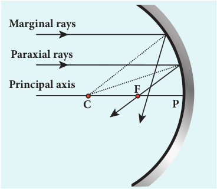
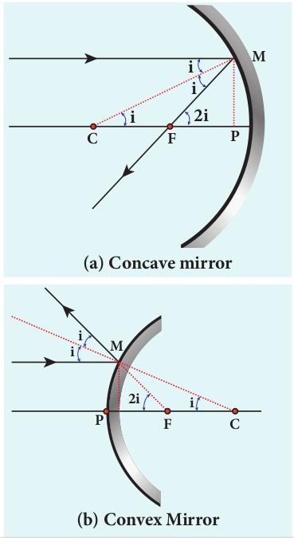

## 6.2 SPHERICAL MIRRORS

We shall now study about the reflections that take place in spherical surfaces.

A spherical surface is a part cut from a hollow sphere. Spherical mirrors are generally constructed using glass. One surface of the glass is silvered. The reflection takes place at the other surface which is polished. **If the polished surface of the mirror is convex it is called as _convex mirror._** These are shown in Figure 6.6.

We shall get familiarised with some of the terminologies pertaining to spherical mirrors.

**_Centre of curvature_**_:_ The centre of the sphere of which the mirror is a part is called the _centre of curvature C_ of the mirror.

**_Radius of curvature_**_:_ The radius of the sphere of which the spherical mirror is a part is called the _radius of curvature R_ of the mirror.

**_Pole_:** The middle point on the spherical surface of the mirror (or) the geometrical centre of the mirror is called _pole P_ of the mirror (or) optic centre.

**_Principal axis_**_:_ The line joining the pole _P_ and the centre of curvature _C_ is called the _principal axis_ of the mirror. The light ray travelling along the principal axis towards the mirror after reflection travels back along the same principal axis. It is also called optical axis

**_Focus (or) Focal point_**_:_ Light rays travelling parallel and close to the principal axis when incident on a spherical mirror, converge at a point for concave mirror (or) appear to diverge from a point for convex mirror on the principal axis. This point is called the _focus (_or) _focal point F_ of the mirror.

**_Focal length_**: The distance between the pole _P_ and the focus _F_ is called the _focal length f_ of the mirror.

**_Focal plane_**: The plane through the focus and perpendicular to the principal axis is called the _focal plane_ of the mirror.

All the above mentioned terms are shown in Figure 6.7 for both concave and convex mirrors.

### 6.2.1 Paraxial Rays and Marginal Rays

**The _paraxial rays_ are the rays which travel very close to the principal axis and make small angles with it**. They fall on the mirror very close to the pole. On the other hand, **the _marginal rays_ are the rays which travel far away from the principal axis and make large angles with it**. They fall on the mirror far away from the pole. These two rays behave differently (get focused at different points) as shown in Figure 6.8. In this chapter, we shall restrict our studies only to paraxial rays. As the angles made by the paraxial rays are very small, we can make good approximations.

### Relation between _f_ and _R_

Let _C_ be the centre of curvature of the mirror. Consider a ray of light parallel to the principal axis is incident on the mirror at _M._ It passes through the principal focus _F_ after reflection. The geometry related to this is shown in Figure 6.9(a). The line _CM_ is the normal to the mirror at _M_. Let _i_ be the angle of incidence and the same will be the angle of reflection.

If _MP_ is the perpendicular from _M_ to the principal axis, then

The angles ∠_MCP_ = _i_ and ∠_MFP_ = 2_i_ From right angle triangles ∆_MCP_ and

∆_MFP,_ we can write,

tan_i PM PC_

\= and tan2_i PM PF_

\=

As the angles are small, tan _i i_≈ and tan 2_i_ tan _i_≈ 2_i_,

_i PM PC_

\= and 2_i PM PF_

\=

Simplifying further,

**(b) Convex Mirror**

_PF_ is focal length _f_ and _PC_ is the radius of curvature _R_.

2 2

_f R R_ \= =(or) f (6.4)

Equation (6.4) is the relation between _f_ and _R_. The construction is shown for convex mirror in figure 6.9(b)

### 6.2.3 Image formation in spherical mirrors

The image formed by spherical mirror can be found by ray construction called image tracing. To locate an image point, a minimum of two rays must meet at that point. We can use at least any two of the following four rays as shown in Figure 6.10.

(i) A ray parallel to the principal axis after reflection will pass (or appear to pass) through the principal focus. (Figure 6.10(a))

(ii) A ray passing (or appear passing) through the principal focus, after reflection will travel parallel to the principal axis. (Figure 6.10(b))

(iii) A ray passing through the centre of curvature retraces its path after reflection as it is a normal incidence. (Figure 6.10(c))

  

(iv) A ray falling on the pole will get reflected as per law of reflection keeping principal axis as the normal. (Figure 6.10(d))

### 6.2.4 Cartesian sign convention

While tracing the image, we would normally come across the object distance _u_, the image distance _v_, the object height _h_, the image height ′_h_ , the focal length _f_ and the radius of curvature _R_. A system of signs for these quantities must be followed so that the relations connecting them are consistent in all types of physical situations. We shall follow the Cartesian sign convention which is now widely used. It is given below and also shown in Figure 6.11.

(i) The Incident light is taken as if it is travelling from left to right (i.e. object on the left of mirror).

(ii) All the distances are measured from the pole of the mirror (pole is taken as origin).

(iii) The distances measured to the right of pole along the principal axis are taken as positive.

(iv) The distances measured to the left of pole along the principal axis are taken as negative.

(v) Heights measured upwards perpendicular to the principal axis are taken as positive.

(vi) Heights measured downwards perpendicular to the principal axis, are taken as negative.

### 6.2.5 Mirror equation

The mirror equation establishes a relation among object distance _u_, image distance _v_ and focal length _f_ for a spherical mirror.

An object _AB_ is considered on the principal axis of a concave mirror beyond the centre of curvature _C_. The image formation is shown in the Figure 6.12. Let us consider three paraxial rays from point _B_ on the object. The first paraxial ray _BD_ travells parallel to the principal axis. It is incident on the concave mirror at _D_, close to the pole _P_. It is reflected back through the focus _F_. The second paraxial ray _BP_ is incident at the pole _P._ It is reflected along _PB_´. The third paraxial ray _BC_ passing through centre of curvature _C_, falls normally on the mirror at _E._ It is reflected back along the same path. The three reflected rays intersect at the point ′ ′_A B_ . A perpendicular drawn as ′ ′_A B_ to the principal axis gives the real, inverted image.

As per law of reflection, the angle of incidence ∠_BPA_ is equal to the angle of reflection ∠ _BPA_ .

The triangles ∆ _BPA_ and ∆ _BPA_ are similar. Thus, from the rule of similar triangles,

$$
\frac{A' \cdot B'}{AB} = \frac{PA'}{PA}
$$

The other set of similar triangles are, ∆_DPF_ and ∆ _BAF_ . (_PD_ is almost a straight vertical line)

$$
\frac{A' \cdot B'}{AB} = \frac{A'F}{PF}
$$

From equations (6.5) and (6.6) we can write,

$$
\frac{P \cdot A'}{PA} = \frac{A'F}{PF}
$$

As, ′ ′_A F= PA - PF_ , the above equation becomes,
$$
\frac{PA'}{PA} = \frac{PA'-PF}{PF}
$$

We can apply the sign conventions for the various distances in the above equation.

_PA_=_u_,_PA'_=_-v_,_PF_=-f_
 All the three distances are negative as per sign convention, because they are measured to the left of the pole. Now, the equation (6.7) becomes.

_v u_

_v f f_ ( )

On further simplification, _v u_

_v f f_

_v u_

_v f_

\= −

\= −; 1

Dividing both sides with v,

1 1 1 _u f v_ \= −

After rearranging,

1 1 1 _v u f_ \+ = (6.8)

The equation (6.8) is called **_mirror equation_**. Although this equation is derived for a special situation shown in Figure (6.12), it is also valid for all other situations with any spherical mirror. This is because proper sign convention is followed for _u_, _v_ and _f_ in equation (6.7).  

### Lateral magnification in spherical mirrors

**The _lateral_ (or) _transverse_ magnification _m_ is defined as the ratio of the height of the image to the height of the object**.The height of the object and image are measured perpendicular to the principal axis.

magnification height of theimage height of theobject

( ) ( ) ( )

_m h h_

\= ′

_m h h_

\= ′ (6.9)

Applying proper sign conventions for equation (6.5),

′ ′ =

′_A B AB_

_PA PA_

′ ′ =− ′ = ′ =− =−_A B h PA v PA u_,AB h, , − ′ = − −

_h h_

_v u_

On simplifying we get,

_m h h_

_v u_

\= ′ =− (6.10)

Using mirror equation, we can further write the magnification as,

_m h h_

_f v f_

_f f u_

\= ′ = − = −

(6.11)

The students are advised to refresh themselves with the image tracing

for the concave and convex mirrors for various predetermined positions of the object; the position of image, nature of image etc., from 9th Standard, Science Book .

**Note**

**EXAMPLE 6.3**

An object is placed at a distance of 20.0 cm from a concave mirror of focal length 15.0 cm.
  

(a) What distance from the mirror a screen should be placed to get a sharp image? (b) What is the nature of the image?

**_Solution_** Given, _f_ = –15 cm, _u_ = –20 cm

(a) Mirror equation, 1 1 1 _v u f_ \+ =

Rewriting to find v, 1 1 1 _v f u_ \= −

Substituting for f and u, 1 1 15

The screen is to be placed at distance 60.0 cm to the left of the concave mirror.

(b) Magnification, _m h h_

As the sign of magnification is negative, the image is inverted. As the magnitude of magnification is 3, the image is enlarged three times. As the image is formed to the left of the concave mirror, the image is real.

**EXAMPLE 6.4**

A thin rod of length _f_ /3 is placed along the optical axis of a concave mirror of focal length _f_ such that one end of image which is real and elongated just touches the respective end of the rod. Calculate the longitudinal magnification.

**_Solution_**

longitudinal magnication

_ml_ length of image length of object

( ) = (ĺ ) (_l_)  

Given: length of object, _l_ = _f_ 3

For the given condition, the image formation is shown in the figure.

Let, _l'_ be the length of the image, then

Image of one end coincides with the respective end of object. Thus, the coinciding end must be at centre of curvature.
