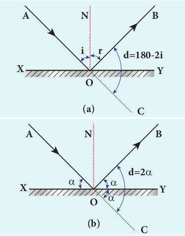
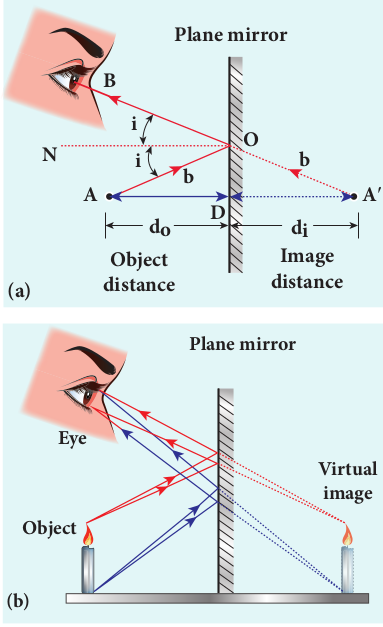
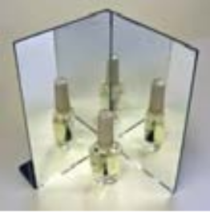
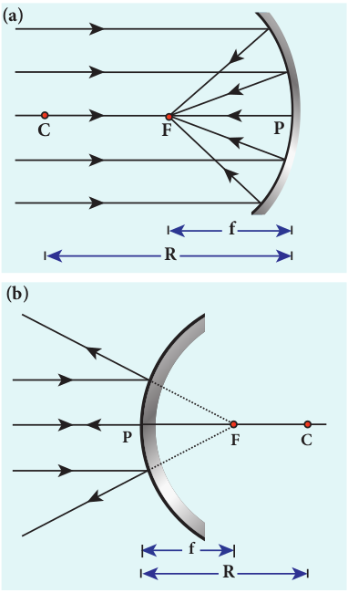
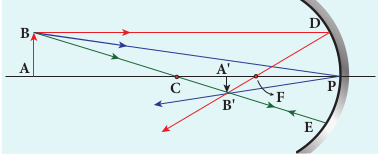
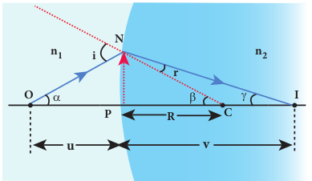
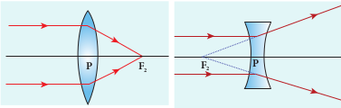
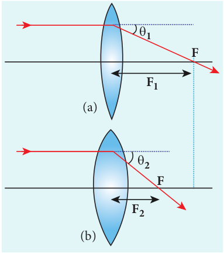
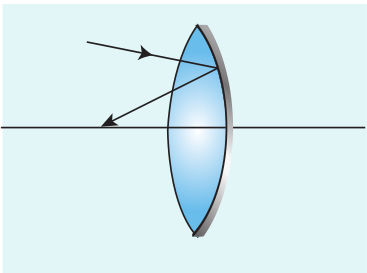
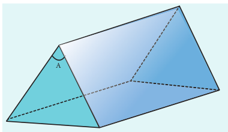

  
**In this unit, the students are exposed to,** • The ray aspect of light. • The phenomenon of reflection and refraction o • The determination of speed of light. • The concepts related to mirrors, lenses, prisms • The different phenomena like dispersion and s

_There are two ways of spreading ligh_g

**Learning Objectives**

## INTRODUCTION**

Light is mystical. Yet, its behaviour is so fascinating. It is difficult to comprehend light as a single entity. The _ray optics_ deals with light that is represented as a ray travelling in straight lines. Here, the geometrical constructs get the permanence to understand some of the characteristics of light and the phenomena associated with it. There are several other phenomena which can only be explained using _wave optics_, which we study in the next Unit. There is also a quantum aspect of light which we can study as _quantum optics_ in graduate level courses.

### Ray optics

Light travels in a straight line in a medium. Light may deviate in its path only when it encounters the boundary of another

f light.

etc. cattering of light.

_t: to be the candle or the mirror that reflects it._ — Edith Wharton

medium (or) an obstacle. A ray of light gives information only about the direction of light. It does not give information about the other characteristics like intensity and colour of light. However, a ray is a sensible representation of light in ray optics. The path of the light is called a ray of light and a bundle of such rays is called a beam of light. In this chapter, we can explain the phenomena of reflection, refraction, dispersion and scattering of light, using the ray depiction of light.

### Reflection

**The bouncing back of light into the same medium when it encounters a reflecting surface is called _reflection_ of light**. Any polished surface can reflect light. Mirrors which are silver coated at their back can reflect almost 90% of the light falling on them. The angle of incidence _i_ and the angle of reflection _r_ are measured with respect to the normal drawn to the surface at the point
  

of incidence of light. **According to laws of reflection, (i) The incident ray, reflected ray and normal**

**to the reflecting surface are all coplanar (ie. lie in the same plane).**

**(ii) The angle of incidence _i_ is equal to the angle of reflection _r_.**

_i = r_ (6.1)

The law of reflection is shown in Figure 6.1.

**Figure 6.1 Reflection of light**

**A N B**

**i r**

**X Y SilveredO**

The laws of reflection are valid at each point for any reflecting surface whether the surface is flat (or) curved. If the reflecting surface is flat, then incident parallel rays after reflection come out as parallel rays as shown in Figure 6.2(a). If the reflecting surface is irregular, then the incident parallel rays after reflection come out as irregular rays (not parallel rays). Still the laws of reflection are valid at every point of incidence in irregular reflection as shown in Figure 6.2(b).

**(a)**  

**(b)**

### Angle of deviation due to reflection

**The angle between the direction of incident ray and the reflected ray is called _angle of deviation due to reflection_.** It is calculated by a simple geometry as shown in Figure 6.3(a). The incident light is AO. The reflected light is OB. The un-deviated light is OC which is the continuation of the incident light. The angle between OB and OC is the angle of deviation _d_. From the geometry, it is written as, _d_ = 180 – (_i_+_r_). As, _i_ = _r_ in reflection, we can write angle of deviation in reflection as,

_d =_ 180 _– 2i_ (6.2)

The angle of deviation can also be measured in terms of the glancing angle _α_ which is measured between the incident ray AO and the reflecting plane surface XY as shown in Figure 6.3(b). By geometry, the angles ∠_AOX_ = _α_, ∠_BOY_ = _α_ and ∠_YOC_ = _α_ (all are same). The angle of deviation _d_ is the angle ∠_BOC_. Therefore,

_d_ = 2_α_ (6.3)
  

**i r**

**O**

**C**

**A N B**

**X Y**

**(a)**

**d=180-2i**

**O**

**C**

**A N B**

**X Y**

**(b)**

**d=2**  



**EXAMPLE 6.1** Prove that for the same incident light when a reflecting surface is tilted by an angle _θ_, the reflected light will be tilted by an angle 2_θ_.

**_Solution_** _AB_ is the reflecting surface as shown in the Figure. Both the incident ray _IO_ and the reflected ray _OR_1 subtend angle i with the normal _N_ as the angle of incidence is equal to angle of reflection. When the surface _AB_ is tilted to ¢ ¢_A B_ by an angle _θ_, the normal _N_ is also is tilted to ′_N_ by the same angle _θ_. Remember that the position of the incident ray _IO_ remains unaltered. But the reflected ray now is _OR_2\. Now, in the tilted system, the angle of incidence, ∠_N'OI_ = _i+θ_ and the angle of reflection, ∠_N'OR_2 = _i+θ_ are the same. The angle between _ON'_ and _OR_1 is, ∠_N'OR_1 = _i_ – _θ_. The angle tilted on the reflected light is the angle between _OR_1 and _OR_2 which is ∠_R_1_OR_2\. From the geometry we can write,  

∠_R_1_OR_2 = ∠_N'OR_2 – ∠_N'OR_1 = (_i_+_θ_) – (_i_–_θ_) ∠_R_1_OR_2 = 2_θ_.

### Image formation in plane mirror

Let us consider a point object _A_ placed in front of a plane mirror. The point of incidence is _O_ on the mirror as shown in the Figure. 6.4(a).

  

A light ray _AO_ from the point object is incident on the mirror and it is reflected along _OB_. The normal is _ON_.

The angle of incidence ∠_AON_ = angle of reflection ∠_BON_

Another ray _AD_ incident normally on the mirror at _D_ is reflected back along _DA_. When _BO_ and _AD_ are extended backwards, they meet at a point _A'_. Thus, the rays appear to come from a point _A'_ which is behind the plane mirror. The object and its image are at equal perpendicular distances from the plane mirror which can be shown by the following explanation.

Angle ∠_AON_ = angle ∠_DAO_ \[Since they are alternate angles\]

Angle ∠_BON_ = angle ∠_O_ ¢_A D_ \[Since they are corresponding angles\]

Hence, it follows that angle, ∠_DAO_ = ∠_O_ ¢_A D_

The triangles ∆_ODA_ and ∆_OD_ ¢_A_ are congruent

∴ _AD_ = ¢_A D_ This shows that the image distance _di_

inside the plane mirror is equal to the object distance _do_ in front of the plane mirror.

The image formed by the plane mirror for extended object is shown in Figure 6.4(b).

### Characteristics of the image formed by plane mirror

(i) The image formed by a plane mirror is virtual, erect and laterally inverted sidewise (left / right).

(ii) The size of the image is equal to the size of the object.

(iii) The image distance behind the mirror is equal to the object distance in front of the mirror.

(iv) If an object is placed between two plane mirrors inclined at an angle _θ_, then the number of images _n_ formed is given in Table 6.1 the images formed are shown in Figure 6.5.  

**Table 6.1 Image by inclined mirrors**

| \\( \frac{360}{\theta} \\) | The position of object placed | Number of images n                                              |
|---------------------------------------------------------|-------------------------------|-----------------------------------------------------------------|
| Even                                                    | Symmetrical                   | n = \\( \frac{360}{\theta} - 1 \\) |
|                                                         | Unsymmetrical                 | n = \\( \frac{360}{\theta} - 1 \\) |
| Odd                                                     | Symmetrical                   | n = \\( \frac{360}{\theta} - 1 \\) |
|                                                         | Unsymmetrical                 | n = \\( \frac{360}{\theta}\\)      |

**EXAMPLE 6.2**

What is the height of the mirror needed for a person to see his/her image fully on the mirror?

**_Solution_** Let us assume a person of height _h_ is standing in front of a vertical plane mirror. The person could see his/her head when light from the head falls on the mirror and gets reflected to the eyes. Same way, light from the feet falls on the mirror and gets reflected to the eyes.

  

**O bj**

**ec t Im**

**age**

**Mirror**

**H H'**

**F'**

**(h1+h2)/2**

**i1**

**i2**

**i2**

**i1 h1**

**h1/2**

**h1/2**

**h2/2**

**h2/2**

**E**

**h2**

**F**

If the distance between his head _H_ and eye _E_ is _h_1 and distance between his feet _F_ and eye _E_ is _h_2\. The person’s total height is, _h._ Here it is, _h_ = _h_1 + _h_2

By the law of reflection, the angle of incidence and angle of reflection are the same for the two extreme reflections. The normals are now the bisectors of the angles between the incident and the reflected rays at the two points. By geometry, the height of the mirror needed is only half of the

height of the person. _h h h_1 2

2 2 +

\=

Does the height depend on the distance between the person and the mirror?

## SPHERICAL MIRRORS

We shall now study about the reflections that take place in spherical surfaces.

A spherical surface is a part cut from a hollow sphere. Spherical mirrors are generally constructed using glass. One surface of the glass is silvered. The reflection takes place at the other surface which is polished. **If the polished surface of the mirror is convex it is called as _convex mirror._** These are shown in Figure 6.6.

We shall get familiarised with some of the terminologies pertaining to spherical mirrors.

**6.2**  

**_Centre of curvature_**_:_ The centre of the sphere of which the mirror is a part is called the _centre of curvature C_ of the mirror.

**_Radius of curvature_**_:_ The radius of the sphere of which the spherical mirror is a part is called the _radius of curvature R_ of the mirror.

**_Pole_:** The middle point on the spherical surface of the mirror (or) the geometrical centre of the mirror is called _pole P_ of the mirror (or) optic centre.

**_Principal axis_**_:_ The line joining the pole _P_ and the centre of curvature _C_ is called the _principal axis_ of the mirror. The light ray travelling along the principal axis towards the mirror after reflection travels back along the same principal axis. It is also called optical axis

**C P P**

**A**

**B B**

**A**

**Hollow sphere**

**Reecting surface**

**Spherical mirrors**

**Inner reective**

**A concave mirrors**

**Outer reective**

**A convex mirrors**

**ll s ere**

**e ecti g s rface**

**erical irr rs**

**I er re ective**

**c cave irr rs**

**ter re ective**

**c vex irr rs**
  

**_Focus (or) Focal point_**_:_ Light rays travelling parallel and close to the principal axis when incident on a spherical mirror, converge at a point for concave mirror (or) appear to diverge from a point for convex mirror on the principal axis. This point is called the _focus (_or) _focal point F_ of the mirror.

**_Focal length_**: The distance between the pole _P_ and the focus _F_ is called the _focal length f_ of the mirror.

**_Focal plane_**: The plane through the focus and perpendicular to the principal axis is called the _focal plane_ of the mirror.

All the above mentioned terms are shown in Figure 6.7 for both concave and convex mirrors.

### Paraxial Rays and Marginal Rays

**The _paraxial rays_ are the rays which travel very close to the principal axis and make small angles with it**. They fall on the mirror very close to the pole. On the other hand, **the _marginal rays_ are the rays which travel far away from the principal axis and make large angles with it**. They fall on the mirror far away from the pole. These two rays behave differently (get focused at different points) as shown in Figure 6.8. In this chapter, we shall restrict our studies only to paraxial rays. As the angles made by the paraxial rays are very small, we can make good approximations.

**C F**

**Marginal rays**

**Paraxial rays**

**Principal axis P**

### Relation between _f_ and _R_

Let _C_ be the centre of curvature of the mirror. Consider a ray of light parallel to the principal axis is incident on the mirror at _M._ It passes through the principal focus _F_ after reflection. The geometry related to this is shown in Figure 6.9(a). The line _CM_ is the normal to the mirror at _M_. Let _i_ be the angle of incidence and the same will be the angle of reflection.

If _MP_ is the perpendicular from _M_ to the principal axis, then

The angles ∠_MCP_ = _i_ and ∠_MFP_ = 2_i_ From right angle triangles ∆_MCP_ and

∆_MFP,_ we can write,

tan_i PM PC_

\= and tan2_i PM PF_

\=

As the angles are small, tan _i i_≈ and tan 2_i_ tan _i_≈ 2_i_,

_i PM PC_

\= and 2_i PM PF_

\=

Simplifying further,

**(b) Convex Mirror**

_PF_ is focal length _f_ and _PC_ is the radius of curvature _R_.

2 2

_f R R_ \= =(or) f (6.4)

Equation (6.4) is the relation between _f_ and _R_. The construction is shown for convex mirror in figure 6.9(b)

### Image formation in spherical mirrors

The image formed by spherical mirror can be found by ray construction called image tracing. To locate an image point, a minimum of two rays must meet at that point. We can use at least any two of the following four rays as shown in Figure 6.10.

(i) A ray parallel to the principal axis after reflection will pass (or appear to pass) through the principal focus. (Figure 6.10(a))

(ii) A ray passing (or appear passing) through the principal focus, after reflection will travel parallel to the principal axis. (Figure 6.10(b))

(iii) A ray passing through the centre of curvature retraces its path after reflection as it is a normal incidence. (Figure 6.10(c))

  

(iv) A ray falling on the pole will get reflected as per law of reflection keeping principal axis as the normal. (Figure 6.10(d))

### Cartesian sign convention

While tracing the image, we would normally come across the object distance _u_, the image distance _v_, the object height _h_, the image height ′_h_ , the focal length _f_ and the radius of curvature _R_. A system of signs for these quantities must be followed so that the relations connecting them are consistent in all types of physical situations. We shall follow the Cartesian sign convention which is now widely used. It is given below and also shown in Figure 6.11.

(i) The Incident light is taken as if it is travelling from left to right (i.e. object on the left of mirror).

(ii) All the distances are measured from the pole of the mirror (pole is taken as origin).

(iii) The distances measured to the right of pole along the principal axis are taken as positive.

(iv) The distances measured to the left of pole along the principal axis are taken as negative.

(v) Heights measured upwards perpendicular to the principal axis are taken as positive.

(vi) Heights measured downwards perpendicular to the principal axis, are taken as negative.

**Height upwards (Positive)**

**Height downwards (Negative)**

**Incident light**

**Distance to the le (Negative)**

**Distance to the right (Positive)**

### Mirror equation

The mirror equation establishes a relation among object distance _u_, image distance _v_ and focal length _f_ for a spherical mirror.

An object _AB_ is considered on the principal axis of a concave mirror beyond the centre of curvature _C_. The image formation is shown in the Figure 6.12. Let us consider three paraxial rays from point _B_ on the object. The first paraxial ray _BD_ travells parallel to the principal axis. It is incident on the concave mirror at _D_, close to the pole _P_. It is reflected back through the focus _F_. The second paraxial ray _BP_ is incident at the pole _P._ It is reflected along _PB_´. The third paraxial ray _BC_ passing through centre of curvature _C_, falls normally on the mirror at _E._ It is reflected back along the same path. The three reflected rays intersect at the point ′ ′_A B_ . A perpendicular drawn as ′ ′_A B_ to the principal axis gives the real, inverted image.

As per law of reflection, the angle of incidence ∠_BPA_ is equal to the angle of reflection ∠ ′ ′_B PA_ .

The triangles ∆_BPA_ and ∆ ′ ′_B PA_ are similar. Thus, from the rule of similar triangles,

′ ′ =

′_A B AB_

_PA PA_

(6.5)

The other set of similar triangles are, ∆_DPF_ and ∆ ′ ′_B A F_ . (_PD_ is almost a straight vertical line)

  

′ ′ = ′_A B_

_PD A F PF_

As, _PD_ = _AB_ the above equation becomes,

′ ′ = ′_A B_

_AB A F PF_

(6.6)

From equations (6.5) and (6.6) we can write,

_PA PA_

_A F PF_

′ = ′

As, ′ ′_A F= PA - PF_ , the above equation becomes,

_PA PA_

_PA PF PF_

′ =

′− (6.7)

We can apply the sign conventions for the various distances in the above equation.

_PA u PA v PF f_\=− ′=− =−, , All the three distances are negative as per

sign convention, because they are measured to the left of the pole. Now, the equation (6.7) becomes, − − = − − − −

_v u_

_v f f_ ( )

On further simplification, _v u_

_v f f_

_v u_

_v f_

\= −

\= −; 1

Dividing both sides with v,

1 1 1 _u f v_ \= −

After rearranging,

1 1 1 _v u f_ \+ = (6.8)

The equation (6.8) is called **_mirror equation_**. Although this equation is derived for a special situation shown in Figure (6.12), it is also valid for all other situations with any spherical mirror. This is because proper sign convention is followed for _u_, _v_ and _f_ in equation (6.7).  

### Lateral magnification in spherical mirrors

**The _lateral_ (or) _transverse_ magnification _m_ is defined as the ratio of the height of the image to the height of the object**.The height of the object and image are measured perpendicular to the principal axis.

magnification height of theimage height of theobject

( ) ( ) ( )

_m h h_

\= ′

_m h h_

\= ′ (6.9)

Applying proper sign conventions for equation (6.5),

′ ′ =

′_A B AB_

_PA PA_

′ ′ =− ′ = ′ =− =−_A B h PA v PA u_,AB h, , − ′ = − −

_h h_

_v u_

On simplifying we get,

_m h h_

_v u_

\= ′ =− (6.10)

Using mirror equation, we can further write the magnification as,

_m h h_

_f v f_

_f f u_

\= ′ = − = −

(6.11)

The students are advised to refresh themselves with the image tracing

for the concave and convex mirrors for various predetermined positions of the object; the position of image, nature of image etc., from 9th Standard, Science Book .

**Note**

**EXAMPLE 6.3**

An object is placed at a distance of 20.0 cm from a concave mirror of focal length 15.0 cm.
  

(a) What distance from the mirror a screen should be placed to get a sharp image? (b) What is the nature of the image?

**_Solution_** Given, _f_ = –15 cm, _u_ = –20 cm

(a) Mirror equation, 1 1 1 _v u f_ \+ =

Rewriting to find v, 1 1 1 _v f u_ \= −

Substituting for f and u, 1 1 15

The screen is to be placed at distance 60.0 cm to the left of the concave mirror.

(b) Magnification, _m h h_

As the sign of magnification is negative, the image is inverted. As the magnitude of magnification is 3, the image is enlarged three times. As the image is formed to the left of the concave mirror, the image is real.

**EXAMPLE 6.4**

A thin rod of length _f_ /3 is placed along the optical axis of a concave mirror of focal length _f_ such that one end of image which is real and elongated just touches the respective end of the rod. Calculate the longitudinal magnification.

**_Solution_**

longitudinal magnication

_ml_ length of image length of object

( ) = (ĺ ) (_l_)  

Given: length of object, _l_ = _f_ 3

For the given condition, the image formation is shown in the figure.

Let, _l'_ be the length of the image, then

Image of one end coincides with the respective end of object. Thus, the coinciding end must be at centre of curvature.

## SPEED OF LIGHT

Light travels with the highest speed in vacuum. The speed of light in vacuum is denoted as _c_ and its value is, _c_ = 3 × 108 m s-1. The earliest attempt to determine the speed of light was made by a French scientist Hippolyte Fizeau (1819–1896). That paved way for the other scientists too to determine the speed of light.

### Fizeau’s method to determine speed of light

_Apparatus_: The apparatus used by Fizeau for determining speed of light in air medium is shown in Figure 6.13. The light from the source _S_ was first allowed to fall on a partially silvered glass plate _G_ kept at an angle of 45o to the incident light. The light then was allowed to pass through a rotating toothed-wheel with _N_ teeth and _N_ cuts of equal widths whose speed of rotation could be varied through an external mechanism (not shown in the Figure). The light passing through one cut

 **Observer**

**G**

**Partially silvered**

**glass plate Toothed**

**wheel**

**S Light source**

**45o**

in the wheel will get reflected by a mirror _M_ kept at a long distance _d_, about 8 _km_ from the toothed-wheel. If the toothed- wheel was not rotating, the light reflected back from the mirror would again pass through the same cut and reach the eyes of the observer who looks through the partially silvered glass plate.

_Working_: The angular speed of rotation of the toothed-wheel was increased from zero to a value _ω_ until the light passing through one cut would completely be blocked by the adjacent tooth. This is ensured by the disappearance of the light while looking through the partially silvered glass plate.

_Expression for speed of light_: The speed _v_ of light in air is equal to the ratio of the distance 2_d_ (the distance light travelled from the toothed-wheel to the mirror and back), to the time taken _t_.

_v_ \= 2_d t_

(6.12)

The distance _d_ is a known value from the arrangement. The time _t_ taken for the

  

light to travel the distance 2_d_ is calculated from the angular speed _ω_ of the toothed- wheel.

The angular speed _ω_ (with unit rad s–1) of the toothed-wheel when the light disappeared for the first time is,

_w q_ \=

_t_ (6.13)

Here, _θ_ is the angle between one tooth and the next slot which is turned within that time _t_.

_q_ \= total angle of the circle in radian number of teeth+number of cuts

_q p p_\= 2 2_N N_

\=

Substituting _θ_ in equation (6.13),

_w p p_\= / _N t Nt_

\=

Rewriting the above equation for t,

_t N_

\= _p w_

(6.14)

Substituting this in equation (6.12),

_v_ \= 2_d Np w_/

After rearranging,

_v_ \= 2_dNw p_

(6.15)

Fizeau had some difficulty to visually estimate the minimum intensity of the light when it is blocked by the adjacent tooth. The value of speed of light determined by him was very close to the actual value. Later on, with the same idea of Fizeau and with much sophisticated instruments, the speed of light in air was determined as, _v_ = 2.99792 × 108 m s–1.  

After the disappearance of light for the first time while increasing the speed

of rotation of the toothed-wheel from zero to ω, on further increasing the speed of rotation to 2_ω_, the light would appear again due to the passing of reflected light through the next slot. So, for every odd value of ω, light would disappear (stopped by tooth) and for every even value of ω light would appear (allowed by slot).

**Note**

### Speed of light through vacuum and different media

Scientists like Foucault (1819–1868) and Michelson (1852–1931) introduced different transparent media like glass, water etc., in the path of light to find the speed of light in different media. Even evacuated glass tubes were also introduced in the path of light to find the speed of light in vacuum. It was found that light travels with lesser speed in any medium than its speed in vacuum. The speed of light in vacuum was determined as, _c_ = 3 × 108 m s-1. We could notice that the speed of light in vacuum and speed of light in air are almost same.

### Refractive index

**_Refractive index_ of a transparent medium is defined as the ratio of speed of light in vacuum _c_ to the speed of light in that medium** _v_**.**

refractive index _n_ of a

medium =

speedof light in vacuum speedof light inmedium

( ) ( ) _c v_
  

_n c_\= _v_

(6.16)

Refractive index of a transparent medium gives an idea about the speed of light in that medium.

**EXAMPLE 6.5**

Pure water has refractive index 1.33. What is the speed of light through it?

**_Solution_**

_n c c n_

\= = _v_

_v_;

_v_ \= × = ×

3 10 1 33

2 26 10 8

8

. . ms -1

Light travels with a speed of 2.26 × 108 m s-1 through pure water.

Refractive index does not have a unit. The smallest value of refractive index is for vacuum, which is 1. For any other medium refractive index is greater than 1. Refractive index is also called as optical density of the medium. Higher the refractive index of a medium, lesser is the speed of light through it and vice-versa. \[Note: optical density should not be confused with mass density of the material of the medium. They two are different entities\]. The Table 6.2 shows the refractive indices of different transparent media.

**Table 6.2 Refractive index of media**

| **Media**          | **Refractive index** |
|--------------------|----------------------|
| Vacuum             |                      |
| Air                | 1.0003               |
| Carbon dioxide gas | 1.0005               |
| Ice                | 1.31                 |
| Pure water         | 1.33                 |
| Ethyl alcohol      | 1.36                 |
| Quartz             | 1.46                 |
| Vegetable oil      | 1.47                 |
| Olive oil          | 1.48                 |
| Acrylic            | 1.49                 |
| Table salt         | 1.51                 |
| Glass              | 1.52                 |
| Sapphire           | 1.77                 |
| Zircon             | 1.92                 |
| Qubic zirconia     | 2.16                 |
| Diamond            | 2.42                 |
| Gallium phosphide  | 3.50                 |

### Optical path

**_Optical path_ of a medium is defined as the distance _d'_ light travels in vacuum in the same time it travels a distance _d_ in the medium.**

Let us consider a medium of refractive index _n_ and thickness _d_. Light travels with a speed _v_ through the medium in a time _t_. The speed of light through the medium is written as,

_v v_

\= = _d t_

_t t d_; ,rewrittenfor as

In the same time _t_, light can cover a longer distance _d'_ in vacuum as it travels with greater speed _c_ in vacuum. It is shown in Figure 6.14. Now, we can wrtite,

**d**

**Medium of refractive index n**

**Vacuum of refractive index 1**

**d' = n d**

  

_c d t_

_rewritten for t as t d c_

\= ′

\= ′

; ( ) , rewritten for _t_ as, _c d t_

_re r s t d c_

\= ′

\= ′

; ( ) ,

As the time taken in both the cases is the same, we can equate the time _t_,

′ =

′ ′ =

_d c_

_d_

_d c d_

_v_

_v_ rewrittenfor theoptical path as(d ) ,Rewritten for the optical path _d'_ as,

′ =

′ ′ =

_d c_

_d_

_d c d_

_v_

_v_ rewri tenf optical path (d ) ,

As, _c n d is v_ \= ′;The optical path , t e tical path _d'_ is,

′ =_d nd_ (6.17)

The value of _n_ is always greater than 1, for a medium. Thus, the optical path _d'_ of a medium is always greater than _d_.

**EXAMPLE 6.6**

Light travels from air into a glass slab of thickness 50 cm and refractive index 1.5.

(a) What is the speed of light in the glass slab?

(b) What is the time taken by the light to travel through the glass slab?

(c) What is the optical path of the glass slab?

**_Solution_**

Given, thickness of glass slab, _d_ = 50 cm = 0.5 m, refractive index, _n_ = 1.5

refractive index, _n c_ \=

_v_

(a) speed of light in the glass slab is,

_v_ \= = ×

\= × −_c n_

3 10 1 5

2 10 8

8 1

. ms

(b) time taken by light to travel through the glass slab is,

_t d_ \= =

× = × −

_v_ 0 5

2 10 2 5 108

9\. . s  

(c) optical path,

′ = = × = =_d nd_ 1 5 0 5 0 75 75. . . m cm

Light would have travelled an additional 25 cm (75 cm – 50 cm) in vacuum at the same time had there been no glass slab in its path.

## REFRACTION

**Refraction is passing of light from one optical medium to another optical medium through a boundary**. In refraction, the angle of incidence _i_ in one medium and the angle of refraction _r_ in the other medium are measured with respect to the normal drawn to the surface at the point of incidence of light. According to laws of refraction, **(i) The incident ray, refracted ray and**

**normal to the refracting surface are all coplanar (ie. lie in the same plane).**

**(ii) The ratio of sine of angle of incident _i_ in the first medium to the sine of angle of refraction _r_ in the second medium is equal to the ratio of refractive index _n_2 of the second medium to the refractive index _n_1 of the first medium.**

sin sin

_i r_

_n n_

\= 2

1

(6.18)

The above equation is in the ratio form. It can also be written in a product form as,

_n i n r_1 2sin sin= (6.19)

**6.4**
  

The law of refraction is also known as Snell's law.

The refraction at a boundary is shown in Figure 6.15.

**n1**

**n2**

**i**

**r n2**

For normal incidence of light on a surface, the angle of incidence is zero.

**Note**

### Angle of deviation due to refraction

**The angle between the direction of incident ray and the refracted ray is called _angle of deviation due to refraction_.** When light travels from rarer to denser medium, it deviates towards normal as shown in Figure 6.16. The angle of deviation in this case is,

_d_ = _i_ – _r_ (6.20)

**i**

**r d=i-r**

**n1<n2**

**n1 n2**

On the other hand, if light travels from denser to rarer medium, it deviates away from normal as shown in Figure 6.17. The angle of deviation in this case is,

_d_ = _r_ – _i_ (6.21)

**i**

**r**

**n1>n2**

**n1 n2**

**d=r-i**

### simultaneous reflection (or) refraction

In any refracting surface there will also be some reflection taking place. Thus, the intensity of refracted light will be lesser than the incident light. **The phenomenon in which a part of light from a source undergoing reflection and the other part of light from the same source undergoing refraction at the same surface is called _simultaneous reflection (_or) _simultaneous refraction_.** This is shown in Figure 6.18. Such surfaces are available as partially silvered glasses.

**i i**

Normal

Incident ray Reected ray

Refracted ray

**n2 r**

Reecting surface

Refracted ray

**Figure 6.18 Simultaneous reflection (or)** refraction
| i |n >n1n 21 |
|------|------|------|------|
| rd=r-i |n2 |

| rnd=i-r 2 |

| Incident ray |Reected ra |y |
|------|------|------|------|------|------|
| i |i |

| Reecting surface |r |n2 |
  

### Principle of reversibility

**The _principle of reversibility_ states that light will follow exactly the same path if its direction of travel is reversed.** This is true for both reflection and refraction as shown in Figure 6.19.

**i r i r** (a)

**Plane Mirror**

**i**

**r**

**Rarer (1) Denser (2)**

**i**

**r Rarer (1) Denser (2)**

**Plane Mirror**(b)

Production of optical surfaces capable of refracting as well as reflecting is possible

by properly coating the surfaces with suitable materials. Thus, a glass can be made partially see through and partially reflecting. These glasses are commercially called as two-way mirror, half-silvered mirror, semi-silvered mirror etc. This gives a perception of regular mirror if the other side is made dark. But, still hidden cameras can be kept behind such mirrors. We need to be cautious when we stand in front of mirrors kept in unknown places. T method to test the two way mirror. Place th nail on the mirror surface. If there is a gap nail and its image, then it is a regular mirro fingernail directly touches its image, then it way mirror.  

### Relative refractive index

In equation (6.18), **the term _n n_**

**2**

**1**



 



  **is called**

**_relative refractive index_ of second medium with respect to the first medium** which is denoted as _n_21.

_n n n_21

2

1

\= (6.22)

The concept of relative refractive index gives rise to other useful relations such as, (i) Inverse rule:

_n n_

_n n n n_12

21

1

2 2 1

1 1 = = (or)

/ (6.23)

(ii) Chain rule:

_n n n n n_

_n n_

_n n_32 31 12

3

2

3

1

1

2

\= × = × or ( ) (6.24)

here is a e finger

between r. If the

is a two

**20% 80%**

**CAN SEE THROUGH**

**CAN’T SEE THROUGH**

**LIGHT RATIO**

**Reective Silver 20 Grade Flim**

**Normal mirror Two way mirror**
| i |r(a) |Plane Mirror |
|------|------|------|------|------|------|

| i |r |

| i |Rarer (1) r |
|------|------|------|------|
| r |Denser (2) |
  

**EXAMPLE 6.7**

Light travelling through transparent oil enters in to glass of refractive index 1.5. If the refractive index of glass with respect to the oil is 1.25, what is the refractive index of the oil?

**_Solution_** Given, _ngo_ \=1.25 and _ng_ =1.5

Refractive index of glass with respect to oil,

_n n ngo_

_g_

_o_

\=

Rewriting for refractive index of oil,

_n n no_

_g_

_go_

\= = = 1 5

1 25 1 2.

. .

The refractive index of oil is, _no_ = 1.2

### Apparent depth

It is a common observation that the bottom of a tank filled with water appears to be raised when seen from air medium above as shown in Figure 6.19(a). An equation could be derived for the apparent depth when viewed in the near normal direction.

Light from the object _O_ at the bottom of the tank passes from denser medium (water) to rarer medium (air) to reach our eyes for viewing the object as shown in Figure 6.20 (b). It deviates away from the normal in the rarer medium at the point of incidence _B_ as shown in Figure 6.20 (c). The refractive index of the denser medium is _n_1 and that of rarer medium is _n_2\. Here, _n_1 > _n_2\. The angle of incidence in the denser medium is _i_ and the angle of refraction in the rarer medium is _r_. The lines _NN_ ′ and _OD_ are parallel. Thus, the angle ∠_DIB_ is also _r_. The angles _i_ and _r_ are very small as the diverging light from _O_ entering the eye is very narrow. The Snell’s law in product form for this refraction from equation (6.19) is,  

**(a)**

**Air**

**Water**

**Real depth**

**I**

**A D B**

**OP Q**

**Q'P'**

**Apparent depth**

**(b)**

**Air Water**

**I**

**D B**

**O**

**d'**

**N'**

**d**

**N**

**_n_1**

**_n_2**

**r**

**r**

**i**

**i**

**C (c)**

_n i n r_1 2sin sin=

As the angles _i_ and _r_ are small, we can approximate, sin _i_ ≈ tan _i_ and sin _r_ ≈ tan _r_.

_n i n r_1 2tan tan=

In triangles ∆_DOB_ and ∆_DIB_,

tan tan_i DB DO_

_r DB DI_

\= = and

|------|------|------|------|------|------|
| B |

| ND |rAi |
|------|------|
| ri |B Wate |
| iN' |
  

_n DB DO_

_n DB DI_1 2=

_DB_ is cancelled both sides. Now, _DO_ is the actual depth _d_ and _DI_ is the apparent depth _d'_ .

_n d_

_n d_1 2

1 1 =

′ After rearranging,

′ =

_d d_

_n n_

2

1

(6.25)

Rewriting the above equation for the apparent depth _d'_ ,

′ =_d n n_

_d_2

1

(6.26)

**Atmospheric refraction:** Due layers of atmosphere which vary in continuously when it passes throu

visible a little before the actual sunrise and al refraction of light through the atmosphere. W crossing of the sun at the horizon. Figure sho sun with respect to the horizon. The figure is apparent shift in the direction of the sun is a time difference between the actual and appare flattened (oval shaped) during sun rise and su

The same is also applicable for the positio stars do not twinkle. They appear twinkling beca with varying refractive indices which is clearl

**HAtmosphere**  

As the rarer medium is air, its refractive index _n_2 can be taken as 1, (_n_2=1). And the refractive index _n_1 of denser medium could then be taken as _n_ itself, (_n_1=_n_). Now, the equation for apparent depth becomes,

′ =_d d n_

(6.27)

The bottom appears to be elevated by _d_\-_d'_,

_d d d d n_

− ′= − or

_d d d n_

− ′= − 

 



 1 1 (6.28)

to refraction of light through different refractive index, the path of light deviates

gh the atmosphere. For example, the Sun is so until a little after the actual sunset due to hat we mean by actual sunrise is the actual ws the actual and apparent positions of the highly exaggerated to show the effect. The round half a degree and the corresponding nt positions is about 2 minutes. Sun appears nset due to the same phenomenon. ns of stars as shown in Figure. Actually, the use of the movement of the atmospheric layers y seen in the night sky.

**Apparent Position of sun**

**Actual Position of sun**

**orizon**

|------|------|------|

  

**EXAMPLE 6.8**

A coin is at the bottom of a trough containing three immiscible liquids of refractive indices 1.3, 1.4 and 1.5 poured one above the other of heights 30 cm, 16 cm, and 20 cm respectively. What is the apparent depth at which the coin appears to be when seen from air medium outside? In which medium the coin will appear?

**_Solution_** When seen from (air medium) on top, the coin will still appear to be at the bottom with each medium appearing to have shrunk with respect to the air medium outside. This situation is illustrated below.

**d= 6**

**6 cm**

**d' =**

**47 .8**

**cm**

**d1=30 cm**

**d1'=23.1 cm d2'=11.4 cm d3'=13.3 cm**

**d2=16cm**

**d3=20cm**

**n2=1.4**

**n1=1.5**

**n3=1.3**

**n3=1.5 n2=1.4 n1=1.3**

**Coin**

**Coin**

The equations for apparent depth for each medium is,

′ = ′ = ′ =_d d n_

_d d n_

_d d n_1

1

1 2

2

2 3

3

3

; ;

′ = ′+ ′ + ′ = + +_d d d d d n_

_d n_

_d n_1 2 3

1

1

2

2

3

3

′ = + + = + +_d_ 30 1 3

16 1 4

20 1 5

23 1 11 4 13 3 . . .

. . .

′ =_d_ 47 8. cm

### Critical angle and total internal reflection

When a ray passes from an optically denser medium to an optically rarer medium, it bends away from the normal. Because of this, the angle of refraction _r_ in the rarer medium is greater than the corresponding angle of incidence _i_ in  

the denser medium. As angle of incidence _i_ is gradually increased, _r_ rapidly increases and at a certain stage _r_ becomes 90° and the refracted ray will be gracing the boundary. **The angle of incidence in the denser medium for which the angle of refraction is 90° (or) the refracted ray graces the boundary between the two media is called _critical angle ic_**.

If the angle of incidence in the denser medium is increased beyond the critical angle, there is no refraction possible in to the rarer medium. **For any angle of incidence greater than the critical angle, the entire light is reflected back into the denser medium itself. This phenomenon is called _total internal reflection_.** These are shown in Figure 6.21.

The two conditions for total internal reflection to take place are, (i) light must travel from denser to rarer

medium, (ii) angle of incidence in the denser medium

must be greater than critical angle (_i>ic_).

For critical angle of incidence, the Snell’s law in the product form, equation (6.19) becomes,

_n i nc_1 2 90sin sin=  (6.29)

_n i nc_1 2 90 1sin sin= =∵ 

sin_i n nc_ \=

2

1

(6.30)

Here, _n n_1 2>

If the rarer medium is air, then its refractive index _n_2 is 1, (_n_2=1) and the refractive index of the denser medium _n_1 is taken as _n_ itself_,_ (_n_1=_n_) then,

sin_i nc_ \= 1 (or) _i_

_nc_ \= 

  

 

−sin 1 1 (6.31)

The critical angle _ic_ depends on the refractive index _n_ of the medium. Table 6.3 shows the refractive index and the critical angle for different materials.
  

**Table 6.3 Refractive index and critical angle for different media**

| **Material**        | **Refractive index** | **Critical Angle** |
|---------------------|----------------------|--------------------|
| Ice                 | 1.310                | 49.8°              |
| Water               | 1.333                | 48.6°              |
| Fused Quartz        | 1.458                | 43.3°              |
| Crown Glass         | 1.541                | 40.5°              |
| Flint Glass         | 1.890                | 31.9°              |
| Calcite             | 1.658                | 37.0°              |
| Strontium Titanate  | 2.394                | 24.7°              |
| Diamond             | 2.417                | 24.4°              |
| Rutile              | 2.621                | 22.4°              |

For example the refractive index of glass is about 1.5. The critical angle for

glass-air interface is, _ic_ \= 

The refractive index of water is 1.33. The

critical angle for water-air interface is,

**Critical anRefraction**

i

### Effects due to total internal reflection

**6.4.7.1 Glittering of diamond** Diamond appears dazzling because of

the total internal reflection of light that happens inside the diamond. The refractive index of diamond is about 2.417. It is much greater than the refractive index of ordinary glass which is about only 1.5. The critical angle of diamond is about 24.4°. It is much less than that of ordinary glass. A skilled diamond cutter makes use of this larger range of angle of incidence (24.4° to 90° inside the diamond), to ensure that light entering the diamond is total internally reflected from the many cut faces before getting out as shown in Figure 6.22. This gives a sparkling effect for diamond.

**Critical angle**

**Air Diamond Total Re ection**

**Figure 6.22 Total internal reflection in** diamond

**(i>ic)**

**gle Total internal reectionr = 90**

i r = i

eflection
| on |Critical angl |r = 90e Total inreect |ternalion |
|------|------|------|------|------|------|------|------|
| r |

| i |i(i = i )c |i(i>i )c |r = i |

| Refractive index |
|------|
| 1.310 |
| 1.333 |
| 1.458 |
| 1.541 |
| 1.890 |
| 1.658 |
| 2.394 |
| 2.417 |
| 2.621 |

|------|------|------|------|------|

  

**6.4.7.2 Mirage and looming** The refractive index of air increases

with its density. In hot places, air near the ground is hotter than air at a height. Hot air is less dense. Hence, in still air the refractive index of air increases with height. Because of this, the light from tall objects like a tree, try to pass through a medium whose refractive index decreases towards the ground. Hence, the ray of light successively deviates away from the normal at different layers of air and undergoes total internal reflection when the angle of incidence near the ground exceeds the critical angle. This gives an illusion as if the light comes from somewhere below the ground. Because of the shaky nature of the layers of air, the observer feels as if

**Denser**

**Earth**

**Rarer Sky**

**(b)**

**Denser**

**i>i**c

o

E

**Earth**

**Rarer**

**(a)**  

the object is getting reflected by a pool of water (or) wet surface beneath the object as shown in Figure 6.23(a). This phenomenon is called **_mirage_**.

In the cold places the refractive index increases towards the ground because the temperature of air close to the ground is lesser than the temperature at a height above the surface of earth. Thus, the density and refractive index of air close to the ground is greater than for air at a height. In the cold regions like glaciers and frozen lakes, the reverse effect of mirage will happen. Hence, an inverted image is formed little above the surface as shown in Figure 6.23(b). This phenomenon is called **_looming_**. It is also called as superior mirage, towering and stooping.

**6.4.7.3 Prisms making using of total internal reflection**

Prisms can be designed to reflect light by 90o (or) by 180o by making use of total internal reflection as shown in Figure 6.24(a) and 6.24(b).

**A**

**B**

**(a) A'B'**

**45°90°**

**45°**

**45°**

B

A

A'

B'

**(c)**

**B**

**A**

**45°**

**45°**

**90°**

**B'**

**A'**

**(b)**

| Denseri>icRarer |
|------|------|------|------|

| Earth |

| B |45°90° |
|------|------|------|------|------|------|

| A |

| A' |
| B' |45° |

| 45° |
|------|------|------|------|------|
| 45° |
| 90°B' |45°A' |

| A' |
|------|------|------|------|------|------|------|------|

| B' |
  

In the first two cases, the critical angle _ic_ for the material of the prism must be less than 45o. Prism in Figure 6.24(b) inverts the object on the same side. Prism in Figure 6.24(c) inverts the object on the other side.

**6.4.7.4 Radius of illumination (Snell’s window)**

When a source of light like electric bulb is kept inside a water tank, the light from the source travels in all direction inside the water. The light that is incident on the water surface at an angle less than the critical angle will undergo refraction and emerge out from the water. The light incident at an angle greater than critical angle will undergo total internal reflection.The light falling particularly at critical angle graces the surface. Thus, the entire surface of water appears illuminated when seen from outside as shown in Figure 6.25.

On the other hand, when the light entering the water from outside is seen from inside the water, the view is restricted to a particular angle equal to the critical angle _ic_. The restricted illuminated circular area is called _Snell’s window_ as shown in Figure 6.26(a).The Figure 6.26(b) shows the angle of view for water animals.  

**(a)**

**icic**

**(b)**

The angle of view for water animals is restricted to twice the critical angle 2_ic_. The critical angle for water is 48.6o. Thus the angle of view is 97.2o. The radius _R_ of the circular area depends on the depth _d_ from which it is seen and also the refractive index _n_ of the medium. The radius _R_ of Snell’s window can be deduced with the illustration as shown in Figure 6.27.

d

C R r=90°

ic ic n1

n2

A

B

|------|------|------|------|

| ic |ic |

|------|------|------|

| i |Bn |
  

Light is seen from a point _A_ at a depth _d_. The Snell’s law in product form, equation (6.19), for the refraction happening at the point _B_ on the boundary between the two media is,

_n i nc_1 2 090sin sin= (6.32)

_n i nc_1 2 090 1sin sin= =

sin_i n nc_ \=

2

1

(6.33)

From the right angle triangle ∆ABC,

sin_i CB AB_

_R_

_d R c_ \= =

+2 2 (6.34)

Equating the above two equations (6.33)

and (6.34), _R_

_d R_

_n n_2 2

2

1+ =

Squaring on both sides, _R R d_

_n n_

2

2 2 2

1

2

\+ = 

 



 

Taking reciprocal, _R d R_

_n n_

2 2

2 1

2

2 +

\= 

 



 

Further simplifying,

1 1 2

2 1

2

2 2

2 1

2

2

2

2

2 1

\+ = 

 



 

\= 

 



  −

\=

_d R_

_n n_

_d R_

_n n_

_d R_

_n_

; ;

_n n n_

_n_ 2

1 2

2

2

2 2

21− = −

Again taking reciprocal and rearranging, _R d_

_n n n_

_R d n n n_

2

2 2 2

1 2

2 2

2 2 2 2

1 2

2 2=

− =

−



 



 

;

After taking the squre root, the radius of illumination is,

_R d n_

_n n_ \=

−( ) 2 2

1 2

2 2

(6.35)

If the rarer medium outside is air, then, _n_2 = 1 and we can take _n_1=_n_  

_R d n_

_R d_

_n_ \=

−



 



 

\= −

1

1 12 2 ( )or (6.36)

**EXAMPLE 6.9**

What is the radius of the illumination when seen above from inside a swimming pool from a depth of 10 m on a sunny day? What is the total angle of view? \[Given, refractive index of water is 4/3\]

**_Solution_** Given, _n_ = 4/3, _d_ = 10 m.

Radius of illumination, _R d_

_n_ \=

−2 1

_R_\= − =

×

−

10

4 3 1

10 3 16 92( / )

_R_ \= = 30

7 11 32. m

To find the critical angle,

_i nc_ \= 

  

 

−sin 1 1

_ic_ \= 

 



 =



  

 =

− −sin /

sin .1 11 4 3

3 4

48 6

The total angle of view of the cone is,

2 2 48 6 97 2_ic_ \= × =. . 

**6.4.7.5 Optical fibre** Transmitting the signals through optical

fibres is possible due to the phenomenon of total internal reflection. **Optical fibres consist of inner part called _core_ and outer part called _cladding_ (or) _sleeving_.** The refractive index of the core must be higher than that of the cladding for total internal reflection to happen. Signal in the form of light is made to incident inside the core- cladding boundary at an angle greater than
  

the critical angle. Hence, it advances with repeated total internal reflections inside the optical fibre without undergoing any refraction. The light travels inside the core with no appreciable loss in the intensity of the light as shown in Figure 6.28(a). While bending the optical fibre, it is done in such a way that the condition for total internal reflection is ensured at every reflection inside the fibre as shown in Figure 6.28(b).

**6.4.7.6 Acceptance angle in optical fibre To ensure the critical angle incidence**

**in the core-cladding boundary inside the optical fibre, the light should be incident at a certain angle called** **_acceptance angle_ at the end of the optical fibre while entering into it.** It depends on the refractive indices of the core _n_1, cladding _n_2 and the outer medium _n_3\. Assume that the light is incident at an angle called acceptance angle _ia_ at the outer medium-core boundary at _A_ as shown in Figure 6.29(a).

**(a)**

**Total internal reection**

**Cladding has lower refractive index**

**Core has higher refractive index(b)**

**Figure 6.28 Optical fibre**  

**A**

**B**

**n3**

**n2**

**n2**

**n1**

**r=90°**

**i2**

**ia C**

**1 ra**

**ic**

**(a)**

**Acceptance Cone(b)**

The Snell’s law in the product form, equation (6.19), for this refraction at the point _A_ is,

_n i n ra a_3 1sin sin= (6.37)

To have the total internal reflection inside the optical fibre, the angle of incidence at the core-cladding interface at _B_ should be atleast critical angle _ic_. Snell’s law in the product form, equation (6.19), for the refraction at point _B_ is,

_n i nc_1 2 90sin sin= o (6.38)

_n i nc_1 2sin = sin90 1°=

∴ =sin_i n nc_

2

1

(6.39)

From the right angle triangle ∆_ABC_,

_i rc a_\= °−90

Now, equation (6.39) becomes,
| n B r=90°2 |
|------|------|------|------|------|------|

| A |nnr11a |i2ic |
| C |

|------|------|

  

sin 90 2

1

−( )=_r n na_ (or) cos_r_

_n na_ \=

2

1

(6.40)

sin cos_r ra a_\= −1 2

Substituting for cos _ra_

sin_r n n_

_n n na_ \= −



 



  =

− 1 2

1

2

1 2

2 2

1 2

(6.41)

Substituting this in equation (6.37).

n sin3 1 1 2

2 2

1 2 1

2 2 2_i n n n_

_n n na_ \=

− = − (6.42)

On further simplification,

sin ( ) sin_i n n_

_n i_

_n n na a_\=

− =

−1 2

2 2

1 2

2 2

2 3 3

or (6.43)

_i n n na_ \= −









 −sin 1 1

2 2 2

2 3

(6.44)

If outer medium is air, then _n_3 = 1. The acceptance angle _ia_ becomes,

_i n na_ \= −( )−sin 1 1 2

2 2 (6.45)

Light can have any angle of incidence from 0 to _ia_ with the normal at the end of the optical fibre forming a conical shape called **_acceptance cone_** as shown in Figure 6.29(b). In the equation (6.42), **the term (_n_3 sin _ia_) is called _numerical aperture_ _NA_** of the optical fibre.

_NA n i n na_\= = −3 1 2

2 2sin (6.46)

If outer medium is air, then _n_3 = 1. The numerical aperture _NA_ becomes,  

_NA i n na_\= = −sin 1 2

2 2 (6.47)

**EXAMPLE 6.10**

A optical fibre is made up of a core material with refractive index 1.68 and a cladding material of refractive index 1.44. What is the acceptance angle of the fibre if it is kept in air medium without any cladding?

**_Solution_** Given, _n_1 = 1.68, _n_2 = 1.44, _n_3 = 1

Acceptance angle, _i n na_ \= −( )−sin 1 1 2

2 2

_ia_ \= −( )=− −sin ( . ) ( . ) sin ( . )1 2 2 11 68 1 44 0 865

_ia_ ≈ 60°

If there is no cladding then, _n_2 = 1

Acceptance angle, _i na_ \= −( )−sin 1 1 2 1

_ia_ \= −( )=− −sin ( . ) sin ( . )1 2 11 68 1 1 35

sin− ( )1 1more than is not possible. But, this includes the range 0o to 90o. Hence, all the rays entering the core from flat surface will undergo total internal reflection.

**Note**: If there is no cladding then there is a condition on the refractive index (_n_1) of the core.

_i na_ \= −( )−sin 1 1 2 1

Here, as per mathematical rule, _n or n_1

2 1 21 1 2−( )≤ ( )≤

or _n_1 2£

Hence, in air (no cladding) the refractive index _n_1 of the core should be, _n_1 1 414£ .
  

An endoscope which has a bundle of optical fibres is an instrument used by doctors to see

inside of a patient’s body. Endoscopes work on the phenomenon of total internal reflection. The optical fibres are inserted into the body through mouth, nose (or) a special hole made in the body. Even operations could be carried out with the endoscope cables which have the necessary instruments attached at their ends.

Endoscope

### Refraction in glass slab

When a ray of light enters a slab it travels from rarer medium (air) to denser medium (glass). This results in deviation of the ray towards the normal. When the light ray leaves the slab it travels from denser medium (glass) to rarer medium (air) resulting in deviation of the ray away from the normal. After the two refractions,  

the light ray emerges in the same direction as that of the incident ray on the glass slab with a lateral displacement (or) shift _L_. i.e. There is no change in the direction of the ray but, the path of the incident ray and refracted ray are parallel to each other with a shift L, as shown in Figure 6.30.

**N1**

**N2**

**air**

**glass**

**E**

**L F**

**B**

**t**

**C**

**i-r**

**i**

**i**

**D**

**r**

**r**

**A**

Consider a glass slab of thickness _t_ and refractive index _n_ kept in air medium. If the path of the light is _ABCD,_ the refractions occur at two points _B_ and _C_ in the glass slab. The angles of incidence _i_ and refraction _r_ are measured with respect to the normal _N_1 and _N_2 at the two points _B_ and _C_ respectively. The lateral displacement _L_ is the perpendicular distance _CE_ drawn between the paths of the deviated light and the undeviated light at point _C_.

In the right angle triangle ∆_BCE_,

sin ; sin

_i r L BC_

_BC L i r_

−( )= = −( ) (6.48)

In the right angle triangle ∆_BCF_,

cos ; cos

_r t BC_

_BC t r_

( )= = ( ) (6.49)
| A |N1 |air |
|------|------|------|------|------|------|------|------|
| i |B |
| t |r |i-r |glassE |
| r |

| F |C |i |

| L |

  

Equating equations (6.48) and (6.49), _L i r_

_t r_sin cos−( )

\= ( )

After rearranging,

_L t i r_

_r_ \=

−( ) ( )



 





 sin

cos (6.50)

The lateral displacement depends upon (i) the thickness of the slab, (ii) the angle of incidence and (iii) the refractive index of the slab which decides the angel of refraction. Thicker the slab, larger will be the lateral displacement. Greater the angle of incidence, larger will be the lateral displacement. Higher the refractive index, larger will be the lateral displacement.

**EXAMPLE 6.11**

The thickness of a glass slab is 0.25 m. It has a refractive index of 1.5. A ray of light is incident on the surface of the slab at an angle of 60o. Find the lateral displacement of the light when it emerges from the other side of the glass slab.

**_Solution_** Given, thickness of the slab, _t_ = 0.25 m, refractive index, _n_ = 1.5, angle of incidence, _i_ = 60o.

Using Snell’s law, 1 sin _i_ = _n_ sin _r_

sin sini sin

. ._r_

_n_ \= =

° =

60 1 5

0 58

_r ’ ’’_\= = = °−sin ( . ) .1 0 58 35 25 35 15 0

Lateral displacement is, _L t i r_

_r_ \=

−( ) ( )



 





 sin

cos

_L_\= × −( ) ( )



 





 =( . )

sin . cos .

.0 25 60 35 25

35 25 0 1281 m

The lateral displacement is, _L_ \=12 81. cm  

## REFRACTION AT SINGLE SPHERICAL SURFACE

We have so far studied only the refraction at plane surface. The refraction can also take place at spherical surface between two transparent media. The laws of refraction hold good at every point on the spherical surface. The normal at the point of incidence is perpendicular drawn to the tangent plane of the spherical surface at that point. Therefore, the normal always passes through its center of curvature. The study of refraction at single spherical surface paves way to the understanding of thin lenses which consist of two refracting surfaces.

The following assumptions are made while considering refraction at spherical surfaces. (i) The incident light is assumed to be

monochromatic (single colour) (ii) The incident light is very close to the

principal axis (paraxial rays). The sign conventions are similar to that

of the spherical mirrors.

### Equation for refraction at single spherical surface

Let us consider two transparent media with refractive indices _n_1 and _n_2 which are separated by a spherical surface as shown in Figure 6.31. Let _C_ be the centre of curvature of the spherical surface. Let a point object _O_ be in the medium _n_1\. The line _OC_ is the principal axis that cuts the spherical surface at the pole P. As the rays considered are paraxial rays, the perpendicular dropped from the point of incidence to the principal axis is very close to the pole (or) passes through the pole itself.

**6.5**
  

**n1**

**O**

**RP**

**u**

**i N**

 

**r**

**I**

**v**

**n2**

**C**

Light from _O_ falls on the refracting surface at _N_. The normal drawn to the refracting surface at the point of incidence passes through the centre of curvature _C_. As _n_2>_n_1, light in the denser medium deviates towards the normal and meets the principal axis at _I_ where the image is formed.

Snell’s law in product form for the refraction at the point _N_ can be written from equation (6.19),

_n i n r_1 2sin sin=

As the angles are small, sine of the angle could be approximated to the angle itself.

_n i n r_1 2= (6.51)

Let the angles be, ∠_NOP_ = _α_, ∠_NCP_ = _β_, ∠_NIP_ = _γ_ From the right angle triangles ∆_NOP_,

∆_NCP_ and ∆_NIP_,

tan ; tan ; tan_a b g_\= = = _PN PO_

_PN PC_

_PN PI_

As these angles are small, tan of the angle could be approximated to the angle itself.

_a b g_\= = = _PN PO_

_PN PC_

_PN PI_

; ; (6.52)

For the triangle, ∆_ONC_,

_i_ = _α + β_ (6.53)  

For the triangle, ∆_INC_,

_β = r + γ_ (or) _r = β – γ_ (6.54)

Substituting for _i_ and _r_ from equations (6.53) and (6.54) in the equation (6.51).

_n n_1 2_a b b g_+( )= −( )

After rearranging,

_n n n n_1 2 2 1_a g b_\+ = −( )

Substituting for _α_, _β_ and _γ_ from equation (6.52),

_n PN PO_

_n PN PI_

_n n PN PC_1 2 2 1



  

 +



  

 = −( )



  

 

Further simplifying by cancelling PN,

_n PO_

_n PI_

_n n PC_

1 2 2 1+ = − (6.55)

Following sign conventions, _PO_ \= –_u_, _PI_ \= +_v_ and _PC_ \= +_R_ in equation (6.58),

_n u_

_n v_

_n n R_

1 2 2 1

− + =

−( )

After rearranging, finally we get,

_n v_

_n u_

_n n R_

2 1 2 1− = −( ) (6.56)

Equation (6.56) gives the relation among the object distance _u_, image distance _v_, refractive indices of the two media (_n_1 and _n_2

) and the radius of curvature _R_ of the spherical surface. It holds good for any spherical surface as sign conventions are applied.

If the first medium is air, then _n_1 = 1 and for the second medium _n_2 = _n_, then the equation is reduced to,

_n v u_

_n R_

− = −( )1 1

(6.57)

**EXAMPLE 6.12**

Locate the image of the point object _O_ in the situation shown. The point _C_ denotes
| Nn1 |n2 |
|------|------|------|------|------|
| ir |
|  | | |
  

the centre of curvature of the separating surface.

15 cm 30 cm

c

**n1 = 1 n2 = 1.5**

o P

**_Solution_** Given, _u_ = –15 cm, _R_ = 30 cm, _n_1 = 1 and _n_2 = 1.5

Equation for single spherical surface is, _n v_

_n u_

_n n R_

2 1 2 1− = −( )

Substituting the values,

1 5 1 15

1 5 1 30

1 5 1 15

0 5 30

. . ; . .

_v v_ − − =

−( ) + =

( )

1 5 1 15

1 60

1 5 1 60

1 15

1 5. ; . ; . _v v v_ \+ = = −

1 60

1 15

1 5 1 4 60

3 60

1 20

; . ; _v_

\= − = − = − =− ; _v_ = –30 cm

The image is a virtual image formed 30 cm to the left of the spherical surface.

## THIN LENS

A lens is formed by a transparent material bounded between two spherical surfaces (or) one plane and another spherical surface. In a thin lens, the distance between the surfaces is very small. For two spherical surfaces, there will be two centres of curvature _C_1 and _C_2 and correspondingly two radii of curvature _R_1 and _R_2\. For a plane surface, the centre of curvature _C_ is at infinity and

**6.6**  

its radius of curvature _R_ is infinity (_R_ = ∞). The terminologies of spherical mirrors hold good very much for thin lenses except for the focal length.

### Primary and secondary focus

As the thin lens is formed by two surfaces, the lens may separate two different media. i.e. the media to the left and right of the lens may be different. Hence, we have two focal lengths.

**The _primary focus F_1 is defined as a point where a point source kept produces a parallel emergent rays to the principal axis after passing through lens** as shown in Figure 6.32. For a converging lens, such an object is a real object and for a diverging lens, it is a virtual object. The distance _PF_1 is the _primary focal length f_1_._

**F1 P P F1**

**The _secondary focus_ _F_2 is defined as a point where all the parallel rays travelling close to the principal axis converge to form an image on the principal axis** **after passing through lens** as shown in Figure 6.33. For a converging lens, such an image is a real image and for a diverging lens, it is a virtual image. The distance _PF_2 is the secondary focal length _f_2.

**F2P PF2**

1 4 60

3 60

1 20

;= − = − =−
| P |
|------|------|------|------|------|

| = |−3 1; =− |
| 60 20P |
| F |
| 1 |

|------|------|------|------|

| P F |

|------|------|------|------|

| P2 |

  

If the media on the two sides of a thin lens have same refractive index, then the two focal lengths are equal. We will mostly be using the secondary focus _F_2 in our further discussions.

### Sign conventions on focal length for lens

The sign conventions for thin lenses differ only in the signs followed for focal lengths.

(i) The sign of focal length is _not decided_ on the direction of measurement of the focal length from the pole of the lens as they have two focal lengths, one to the left and another to the right.

(ii) The focal length of the thin lens is taken as positive for a converging lens and negative for a diverging lens.

The other sign conventions for object distance, image distance, radius of curvature, object height and image height (except for the focal lengths as mentioned above) remain the same for thin lenses as that of spherical mirrors.

### Lens maker’s formula and lens equation

Let us consider a thin lens made up of a medium of refractive index _n_2 placed in a medium of refractive index _n_1\. Let _R_1 and _R_2 be the radii of curvature of two spherical surfaces  and  respectively and _P_ be the pole as shown in Figure 6.34. Consider a point object _O_ on the principal axis. A paraxial ray from _O_ which falls very close to _P_, after refraction at the surface  forms image at _I'_. Before it does so, it is again refracted by the surface . Therefore, the final image is formed at _I_.  

The general equation for the refraction at a single spherical surface is given by the equation (6.56) is,

_n v_

_n u_

_n n R_

2 1 2 1− = −( )

For the refracting surface , the light goes from _n_1 to _n_2.

_n v_

_n u_

_n n R_

2 1 2 1

1′ − =

−( ) (6.58)

For the refracting surface , the light goes from medium _n_2 to _n_1.

_n v_

_n v_

_n n R_

1 2 1 2

2

− ′ =

−( ) (6.59)

For surface , _I'_ acts as virtual object. Adding the above two equations (6.58)

and (6.59)

_n v_

_n u_

_n n R R_

1 1 2 1

1 2

1 1 − = −( ) −



 



 

On further simplifying and rearranging,

1 1 1 12 1

1 1 2_v u n n_

_n R R_ − =

−

 



  −



 



 

1 1 1 1 12

1 1 2_v u n n R R_

− = − 

 



  −



 



  (6.60)

O P **I I'**

**n1 n1n2**

**u v**

**v**

**21**

|------|------|------|------|
| 2 |

  

If the object is at infinity, the image is formed at the focus of the lens. Thus, for _u_ = ∞, _v_ = _f_. Then the equation becomes.

1 1 1 1 12

1 1 2_f n n R R_

− ∞ = − 

 



  −



 



 

1 1 1 12

1 1 2_f n n R R_

\= − 

 



  −



 



  (6.61)

If the lens is kept in air, then we can take _n_1 = 1 and _n_2 = _n_. So the equation (6.61) becomes,

1 1 1 1

1 2_f n_

_R R_ \= −( ) −



 



  (6.62)

The above formula is called as the **_lens maker’s formula_**, because it tells the lens manufactures what curvature is needed for a material of particular refractive index to make a lens of desired focal length. This formula holds good also for any type of lens. By comparing the equations (6.60) and (6.61) we can write,

1 1 1 _v u f_ \- = (6.63)

The above equation is known as **_lens equation_** which relates the object distance _u_ and image distance _v_ with the focal length _f_ of the lens. This equation holds good for any type of lens.

### Lateral magnification in thin lens

Let us consider an object _OO'_ of height _h_1 placed on the principal axis with its height perpendicular to the principal axis. The inverted real image _II_ ′ is formed which has a height _h_2 as shown in Figure 6.35.  

**F**

**O**

**O**

**P**

**_h_**

**_h_**

**I**

**I**

**u v Figure 6.35 Lateral magnification in thin** lens

The lateral (or) transverse magnification _m_ is defined as the ratio of the height of the image to height of the object.

_m II OO_

\= ′ ′ (6.64)

From the two similar triangles ∆ _POO_′ and ∆ _PII_ ′ , we can write,

_II OO_

_PI PO_

′ ′ = (6.65)

On applying sign convention, − ′ = −

_h h_

_v u_

Substituting this in the equation (6.65) for magnification,

_m h h_

_v u_

\= − ′ = −

After rearranging,

_m h h_

_v u_

\= ′ = (6.66)

The magnification is negative for real image and positive for virtual image. In the case of a concave lens, the magnification is always positive and less than one.

We can also have the other forms of equations for magnification by combining the lens equation as,

_m h h_

_f f u_

\= ′ = +

(or) _m h h_

_f v f_

\= ′ = − (6.67)

|------|------|------|
| h |IF |
| P |
  

**EXAMPLE 6.13**

A biconvex lens has radii of curvature 20 cm and 15 cm for the two curved sufaces. The refractive index of the material of the lens is 1.5.

(a) What is its focal length?

(b) Will the focal length change if the lens is flipped by the side?

**_Solution_**

For a biconvex lens, radius of curvature of the first surface is positive and that of the second surface is negative as shown in figure.

R2 = cm

**1 2**

C2 C1R1 = 20cm

Given, _n_ = 1.5, _R_1=20 cm and _R_2= –15 cm

(a) Lens maker’s formula, 1 1 1 1

1 2_f n_

_R R_ \= − −



 



 

( )

Substituting the values,

1 1 5 1 1 20

1 15

1 5 1 1 20

1 15_f_

\= − − −



 



 = − +



 



 ( . ) ( . )

1 0 5 1 20

1 15

0 5 3 4 60

1 2

7 60_f_

\= + 

 



 =

+

 



 = × 

 ( . ) ( . )



 =

7 120

_f_ \= = 120

7 17 14. cm

As the focal length is positive the lens is a converging lens.  

(b) When the lens is flipped by the side,

**1 2**

C2 C1

R2 = cm

R1 = 15cm

Now, _n_ = 1.5, _R_1= 15 cm and _R_2= –20 cm

Substituting the values in the lens maker's formula, 1 1 5 1 1

15 1 20_f_

\= − − −



 



 ( . )

1 1 5 1 1 15

1 20_f_

\= − + 

 



 ( . )

This will also result in, _f =_ 17.14 _cm_ Thus, it is concluded that the focal length of the lens will not change if it is flipped by the side. This is true for any lens. Students can verify this for any kind of lens.

**EXAMPLE 6.14** Determine the focal length of the lens made up of a material of refractive index 1.52 as shown in the diagram. (Points _C_1 and _C_2 are the centers of curvature of the first and second surfaces respectively.)

**10 cm**

**20 cm**

**C1 C2**
| 2 |
|------|------|

| R |= cm2 |
|------|------|------|

  

**_Solution_** This lens is called convexo-concave lens

Given, _n_ = 1.52, _R_1= 10 cm and _R_2= 20 cm

Both _R_1 and _R_2 are positive

Lens makers formula, 1 1 1 1

1 2_f n_

_R R_ \= − −



 



 

( )

Substituting the values,

1 1 52 1 1 10

1 20_f_

\= − − 

 



 ( . )

1 0 52 2 1 20

0 52 1 20

0 52 20_f_

\= −

 



 =



  

 =( . ) ( . ) .

_f_ \= = 20

0 52 38 46

. . cm

As the focal length is positive, the lens is a converging lens.

### Power of a lens

The power of a lens is a measure of its deviating ability on an incident light. When a ray is incident on a lens then the degree with which the lens deviates the ray is determined

**F**

**F**

**1**

**F2**

**F1**

**2**

(a)

(b)  

by the power of the lens. Power of the lens is inversely proportional to the focal length i.e. greater the power of lens, smaller will be the focal length. In Figure 6.36, the lens (b) has greater deviating ability than lens (a). As (b) has greater deviating ability, its focal length is less and vice versa.

In other words, **the _power_ of a lens is a measure of the degree of convergence (or) divergence the lens produces on the light falling on it**. The power of a lens _P_ is the reciprocal of its focal length in meter.

_P f_

\= 1 (6.68)

The unit of power is dioptre (D). 1 D = 1 m–1. Power is positive for converging lens and negative for diverging lens.

From the lens maker's formula, equation (6.62), the equation (6.68) can be written for power as ,

_P f_

_n R R_

\= = − − 

 



 

1 1 1 1

1 2

( ) (6.69)

The outcome of this equation for power is that for a given geomentry of the lens, larger the value of refractive index, greater is the power of lens and vice versa. Also for lenses with small radii of curvature (bulky) the power is large and for lenses with large radii of curvature (skinny), the power is small.

**EXAMPLE 6.15**

If the focal length is 150 cm for a lens, what is the power of the lens?

**_Solution_** Given, focal length, _f_ = 150 cm = 1.5 m

Equation for power of lens is, _P f_

\= 1

Substituting the values,
| F1 |
|------|------|------|------|------|------|

| F(a)1 |
| F2 |

| F2 |
  

_P_ \= = 1

1 5 0 67

. .

m D

As the power is positive, it is a converging lens.

### Focal length of lenses in contact

Let us consider two lenses  and  of focal lengths _f_1 and _f_2 placed coaxially in contact with each other so that they have a common principal axis. For a point object placed at O beyond the focus of the lens  on the principal axis, an image is formed by it at _I'_. This image _I'_ acts as an object for the lens  and the final image is formed at _I_ as shown in Figure. 6.37. As these two lenses are thin, the measurements are done with respect to the common optic centre _P_ between the two lenses.

O P I

u v

I

v

**1 2**

**Figure. 6.37** Lenses in contact

For the lens _,_ the object distance _PO_ is _u_ and the image distance _PI'_ is _v_′. For the lens , the object distance _PI'_ is _v_′ and the image distance _PI_ is _v_.

Writing the lens equation (6.63) for lens ,

1 1 1

1′ − =

_v u f_ (6.70)

Writing the lens equation (6.63) for lens ,  

1 1 1

2_v v f_ − ′ = (6.71)

Adding the above two equations (6.70) and (6.71) gives,

1 1 1 1

1 2_v u f f_ − = + (6.72)

The combination acts as a single lens of focal length _f_ so that for an object at the position _O,_ it forms the image at _I._ Then,

1 1 1 _v u f_ − = (6.73)

Comparing the equations (6.72) and (6.73) we can write,

1 1 1

1 2_f f f_ \= + (6.74)

The above equation can be extended for any number of lenses in contact as,

1 1 1 1 1

1 2 3 4_f f f f f_ \= + + + + ......... (6.75)

The above equation can be written in terms of power of the lenses as,

_P P P P P_\= + + + +1 2 3 4 ......... (6.76)

Where, _P_ is the net power of the lenses in contact. One should note that the sum in equation (6.76) is an algebraic sum. The powers of individual lenses may be positive (for convex lenses) and negative (for concave lenses). Combination of lenses helps to obtain converging (or) diverging lenses of desired magnification. Also, combination of lenses enhances the sharpness of the image. As the image formed by the first lens becomes the object for the second and so on, the total magnification _m_ of the combination is the a product of magnification of individual lenses. We can now write,

_m_ = _m_1 × _m_2 × _m_3 . . . . . (6.77)

|------|------|------|------|------|------|

  

Where _m_1, _m_2, _m_3 . . . . . are magnification of individual lenses.

**EXAMPLE 6.16**

What is the focal length of the combination if the lenses of focal lengths –70 cm and 150 cm are in contact? What is the power of the combination?

**_Solution_** Given, focal length of first lens, _f_1 = –70 cm, focal length of second lens, _f_2 = 150 cm. Equation for focal length of lenses in

contact, 1 1 1

1 2_f f f_ \= +

Substituting the values, 1 1

70 1

150 1

70 1

150_f_ \= − + =− +

1 150 70 70 150

80 70 150

80 10500_f_

\= − + ×

\= − ×

\=−

_f_ \=− =− 1050 8

131 25. cm

As the final focal length is negative, the combination of two lenses is a diverging system of lenses.

The power of the combination is,

_P f_

\= = −

\=− 1 1

1 3125 0 76

. .

m D

**Points to Ponder**  

**EXAMPLE 6.17**

**15 cm**

**5 mm**

**40 cm**

**1 2**

An object of 5 mm height is placed at a distance of 15 cm from a convex lens of focal length 10 cm. A second lens of focal length 5 cm is placed 40 cm from the first lens and 55 cm from the object. Find (a) the position of the final image, (b) its nature and (c) its size.

**_Solution_** Given, _h_ = 5 mm = 0.5 cm, _u_1 = –15 cm, _f_1 = 10 cm, _f_2 = 5 cm, _d_ = 40 cm

For the first lens, the lens equation is, 1 1 1

1 1 1_v u f_ − =

Substituting the values,

System of combination of lenses is commonly used in designing lenses for cameras, microscopes, telescopes and other optical instruments. They produce better magnification and sharpness of the image.
  

1 1 15

1 10

1 1 15

1 101 1_v v_

− − = + =;

1 1 10

1 15

15 10 150

5 150

1 301_v_

\= − = −

\= =

_v_1= 30 cm

First lens forms image 30 cm to the right of the first lens. Let us find the height of this image.

Equation for magnification is, _m h h_

_v u_

\= ′ = 1

1

Substituting the values, ′ = −

_h_ 0 5

30 15.

′ = × − =−_h_ 0 5 30

15 1. cm

As the height of the image is negative, the image is inverted and real.

This image acts as object for second lens. The object distance for second lenses, (40–30=10 cm). Hence, _u_2 = –10 cm

For the second lens, the lens equation is, 1 1 1

2 2 2_v u f_ − =

Substituting the values, 1 1

10 1 5

1 1 10

1 52 2_v v_

− − = + =;

1 1 5

1 10

10 5 50

5 50

1 102_v_

\= − = − = =

_v_2 10= cm

The final image is formed 10 cm to the right of the second lens.

Let us find the height of the final image. Assume, the final height of the image formed by the second lens is _h''_ and the height of the object for the second lens is _h'_.

Equation for magnification is _m'_ for the

second lens is, ′ = ′′ ′ =_m h_

_h v u_

2

2  

Substituting the values, ′′ − = −

_h_ 1

10 10

′′ = − × −



 



 = =_h_ ( )1 10

10 1 10cm mm

As the height of the image is positive, the image is erect and real.

### Silvered lenses

If one of the surfaces of a lens is silvered from outside, then such a lens is said to be a silvered lens. A silvered lens is a combination of a lens and a mirror. Light can enter through the transparent front surface of the lens and get reflected by the silver coated rear surface. Hence, light travels two times through the lens as shown in Figure 6.38.

The power _P_ of the silvered lens is,

_P = Pl + Pm + Pl_

_P =_ 2_Pl + Pm_ (6.78)

Here, _Pl_ is the power of the lens and _Pm_ is the power of the mirror. We know that the power of a lens is the reciprocal of its focal length. But, the power of a mirror is negative of the reciprocal of its focal length. This is because, a concave mirror which has negative focal length is

|------|------|------|------|------|

  

a converging mirror with positive power. Also, a silvered lens is basically a modified mirror. Thus,

_P f_

_P f_

_P fl_

_l m_

_m_

\= −

\= = −

1 1 1; ; (6.79)

Now equation (6.78) becomes,

1 2 1 −



 



  = 

 



  + −



 



 _f f fl m_

(6.80)

Proper sign conventions are to be followed for equation (6.80).

Suppose the object distance _u_ and image distance _v_ are to be found, we can very well use the mirror equation (6.8), since the silvered lens is a modified mirror.

1 1 1 _v u f_ \+ =

**EXAMPLE 6.18**

A thin biconvex lens is made up of a glass of refractive index 1.5. The two surfaces have equal radii of curvature of 30 cm each. One of its surfaces is made reflecting by silvering it from outside. (a) What is the focal length and power of this silvered lens? (b) Where should an object be placed in front of this lens so that the image is formed on the object itself?

**_Solution_** The given situation is shown in figure.

O I

A B

OO

C2 C1 P

R2 R1

Given, _n_ = 1.5; _R_1 = 30 cm; _R_2 = –30 cm;  

(a) Let us find _f_l and _f_m separately.

Using lens maker’s formula we can find _f_l.

1 1 1 1

1 2_f n_

_R Rl_

\= − − 

 



 

( )

Substituting the values, 1 1 5 1 1 30

1 30_fl_

\= − − −



 



 ( . )

1 0 5 1

30 1 30

1 2

2 30

1 30_fl_

\= + −



 



 = 

  

  

  

 =( . )

cm

_f_l = 30 cm = 0.3 m Focal length of mirror is, _f_

_R m_ \= 2

2

Substituting the values, _fm_ \= − =−

30 2

15cm

_f_m = 15 cm = –0.15 m

Now the focal length of the slivered lens is, 1 2 1 − = +

−_f f fl m_

1 2 30

1 15

2 15

1 7 5−

\= + = = _f_ .

_f_ \= – 7.5 cm = –0.075 m The silvered mirror behaves as a concave mirror with its focal length on left side. To find the power of the silvered lens, _P_ = 2_Pl_ + _Pm_

_P f f_

_D_

_l m_

\= + − −

\= + −

\= + = =

2 1 2 0 3

1 0 15

2 0 3

1 0 15

4 0 3

13 33

. ( . )

. . . .

As the power is positive it is a converging system. \[Note: Here, we come across a silvered lens which has negative focal length and positive power. Which implies that the focal length is to the left and the system is a converging one. Such situations are possible in silvered lenses because a silvered lens is basically a modified mirror.\] (b) Writing the mirror formula, 1 1 1 _f v u_ \= +

Here, both _u_ and _v_ are same (_v = u_) as the image coincides with the object.
| AB |
|------|------|------|------|

  

1 7 5

1 1 2 −

\= + = . cm _u u u_ ; u = –2 × 7.5 cm

_u_ = –15 cm = –0.15 m The object is to be placed 15 cm to the left of the silvered lens.

## PRISM

A prism is a triangular block of transparent glass. It is bounded by the three plane faces. Its one face is rough which is called base of the prism. The other two faces are polished which are called refracting faces of the prism. The angle between the two refracting faces is called angle of the prism (or) refracting angle (or) apex angle. It is represented as _A_ in Figure 6.39.

A

### Angle of deviation produced by prism

Consider a prism _ABC._ The faces _AB_ and _AC_ are polished and the face _BC_ is rough. Let light ray _PQ_ is incident on one of the refracting faces of the prism as shown in Figure 6.40. The angles of incidence and refraction at the first face _AB_ are _i_1 and _r_1\. The path of the light inside the prism is _QR_. The angles of incidence and refraction at the

**6.7**

_a_  

second face _AC_ is _r_2 and _i_2 respectively. RS is the ray emerging from the second face. Angle _i_2 is also called as angle of emergence. **The angle between the direction of incident ray and the emergent ray is called the _angle of deviation d_ in a prism**. The two normals drawn at the point of incidence _Q_ and at the point of emergence _R_ meet at point _N_. The extended incident ray and the emergent ray meet at point _M_.

R **i**1 **i**2r1

d1 d2

r2

M

N

d

A A

P

B C

Q S

The angle of deviation _d_1 at surface _AB_ is,

_ngle RQM d i r_∠ = = −1 1 1 (6.81)

The angle of deviation _d_2 at surface _AC_ is,

_angle QRM d i r_∠ = = −2 2 2 (6.82)

Total angle of deviation _d_ produced is,

_d d d_\= +1 2 (6.83)

Substituting _d_1 and _d_2, in equation (6.83)

_d_ = (_i_1 – _r_1) + (_i_2 – _r_2)

After rearranging,

_d i i r r_\= + − +( ) ( )1 2 1 2 (6.84)

In the quadrilateral _AQNR_, two of the angles (at the vertices _Q_ and _R_) are right angles. Therefore, the sum of the other angles of the quadrilateral should be 180o.
| AA |
|------|------|------|------|------|------|------|

| Qi1 |Md1 |dd2 |i2 |S |
| r1 |Rr2 |

| P |

| N |
  

∠_A_ + ∠_QNR_ = 180º (6.85)

In the triangle ∆_QNR_,

_r_1+ _r_2+ ∠_QNR_ = 180o (6.86)

Comparing the two equations (6.85) and (6.86) we get,

_r r A_1 2+ = (6.87)

Substituting this in equation (6.84) for angle of deviation,

_d i i A_\= + −1 2 (6.88)

Thus, the angle of deviation depends on the angle of incidence _i_1, angle of emergence _i_2 and the angle for the prism _A_. But, for a given angle of incidence, the angle of emergence is decided by the refractive index of the material of the prism. Hence, the angle of deviation for a monochromatic light depends on these following factors. (i) the angle of incidence (ii) the angle of the prism (iii) the refractive index of the material of

the prism (which decides the angle of emergency).

**EXAMPLE 6.19**

A monochromatic light is incident on an equilateral prism at an angle 30o and is emergent at an angle of 75o. What is the angle of deviation produced by the prism?

**_Solution_** Since, the prism is equilateral, _A_\= °60 ;

Given, _i_1 30= °; _i_2 75= °

Equation for angle of deviation, _d_ \= _i1 + i2 – A_ Substituting the values, _d_ = 30°+75°–60°=45° The angle of deviation produced, _d_\= °45  

**EXAMPLE 6.20**

Light ray falls at normal incidence on the first face and emerges gracing the second face for an equilateral prism.

(a) What is the angle of deviation produced?

(b) What is the refractive index of the material of the prism?

**_Solution_**

**60°**

**30°**

**ic d**

The given situation is shown in the figure.

Given, _A_\= °60 ; _i_1 0= °; _i_2 90= °

(a) Equation for angle of deviation,

_d i i A_\= + −1 2

Substituting the values,

_d_\= °+ °− °= °0 90 60 30

The angle of deviation produced is, _d_\= °30

(b) The light inside the prism must be falling on the second face at critical angle as it graces the boundary. _i_c = 90° – 30° = 60°

Equation for critical angle is, sin_i nc_ \= 1

_n i_

_n c_

\= = = = = 1 1

60 1

3 2 2 3

1 15 sin

; sin /

. 

The refractive index of the material of the prism is, _n_ = 1.15
| 30° |
|------|------|------|------|

| ic |d |

  

### Angle of minimum deviation

A graph plotted between the angle of incidence and angle of deviation is shown in Figure 6.41. One could observe that the angle of deviation decreases with increase in angle of incidence and reaches a minimum value _D_ and then continues to increase.

**The minimum value of angle of deviation is called angle of _minimum deviation D_. At minimum deviation**,

(i) the angle of incidence is equal to the angle of emergence, _i_1 = _i_2.

(ii) the angle of refraction at the face one and face two are equal, _r_1 = _r_2).

_i irr_

(iii) the refracted ray inside the prism is parallel to its base of the prism.

The case of angle of minimum deviation is shown in Figure 6.42.

### Refractive index of the material of the prism

At minimum deviation, _i_1 = _i_2 = _i_ and _r_1 = _r_2 = _r_

Now, the equation (6.88) becomes,

_D i i A i A i A D_

\= + − ⇒ − = +( )

1 2 2 2

(or)

The equation (6.87) becomes,

_r r A r A r A_ 1 2 2

2 + = ⇒ = =(or)

Substituting _i_ and _r_ in Snell’s law, _n i r_

\= sin sin

_n_

_A D_

_A_ \=

+  

  

     

sin

sin

2

2

(6.89)

The above equation is used to determine the refractive index of the material of the prism. The angles _A_ and _D_ can be measured experimentally.

**EXAMPLE 6.21**

The angle of minimum deviation for an equilateral prism is 37o. Find the refractive index of the material of the prism.

**_Solution_** Given, _A_ \= 60°; _D_ \= 37°

Equation for refractive index is,

_n_

_A D_

_A_ \=

+  

  

     

sin

sin

2

2

Substituting the values,
| 2 |
|------|
|  A  |

| 2 |
|------|
|  A  |
  

_n_\=

+

 



 



  

 

\= ( )sin

sin

sin .

sin

60 37 2

60 2

48 5

0 0

0

0

30 0 75 0 5

1 5 0( ) = =

. .

.

The refractive index of the material of the prism is, _n_ = 1.5

### Dispersion of white light through prism

The angle of deviation produced by a prism is so far discussed only for monochromatic light (i.e. light of single colour). When white light enter in to a prism, an effect called _dispersion_ takes place. **Dispersion is splitting of white light into its constituent colours. This band of colours of light is called its** **_spectrum_**. When a narrow beam of parallel rays of white light is incident on a prism and the refracted beam is received on a white screen. A band of colours is obtained in the order, recollected by the word: VIBGYOR i.e., Violet, Indigo, Blue, Green, Yellow, Orange and Red. The violet is the most deviated colour and red is the least deviated colour as shown in Figure 6.43.

The colours obtained in a spectrum depend on the nature of the light source. Each colour in vacuum has a definite wavelength. The red colour has the longest wavelength of 700 nm while the violet  

colour has the shortest wavelength of 400 nm in vacuum. Though all the colours have different wavelengths, they all travel with the same speed in vacuum. The speed of light is independent of wavelength in vacuum. Therefore, vacuum is a non- dispersive medium.

Sir Isaac Newton has demonstrated through a classic experiment to produce white light by recombining all the colours of VIBGYOR. He used a prism to produce dispersion and made all the colours to incident on another inverted prism to combine all the colours to get white light as shown in figure.

**Points to Ponder**

But, when the white light enters a medium the red colour travels with the highest speed and violet colour travels with least speed. Hence, the wavelengths of colours in a medium are no longer the same as they are in vacuum. Actually, the dispersion takes place in a medium because of the difference in speed for different colours in a medium. In other words, the refractive index of the material of the prism is different for different colours. For violet colour, the refractive index is the highest and for red colour the refractive index is the least. The refractive index of two different glasses for different colours is shown in Table 6.4.

**Table 6.4 Refractive indices for different wavelengths**

| **Colour** | **Wavelength in vacuum (nm)** | **Crown glass** | **Flint glass** |
|------------|-------------------------------|-----------------|-----------------|
| Violet     | 396.9                         | 1.533           | 1.663           |
| Blue       | 486.1                         | 1.523           | 1.639           |
| Yellow     | 589.3                         | 1.517           | 1.627           |
| Red        | 656.3                         | 1.515           | 1.622           |

### Dispersive Power

Consider a beam of white light passing through a prism. It gets dispersed into its constituent colours as shown in Figure 6.44.

If the angle of prism is small of the order of 10o, the prism is said to be a

Rainbow appears in sky durin where there are water droplets r when the sun is at the back of the

enters a water droplet and the white light is primary rainbow is formed when the light ent reflection inside it. Sometimes, a secondary ra rainbow as shown in the figure. The seconda raindrop undergoes two total internal reflectio is from violet to red whereas in secondary r of view in primary rainbow from violet to re secondary rainbow from red to violet is from  

small angle prism. When rays of light pass through such prisms, the angle of minimum deviation also becomes small. Let _A_ be the angle of a small angle prism and _δ_ be its angle of minimum deviation, then equation (6.89) becomes,

g mild shower (or) near the fountains/falls emain suspended in air. A rainbow is seen observer. Dispersion occurs when sunlight split into its constituent seven colours. A ering a droplet undergoes one total internal inbow is also formed enveloping the primary ry rainbow is formed when light entering a ns. The order of colour in primary rainbow ainbow it is from red to violet. The angle d is from 40o to 42o. The angle of view for

52o to 54o.

**White Light**

**White Light Primary rainbow**

**42**

**54** **52**

**40**

**Secondary rainbow White Light**

**White Light**

**Water drops**

**Water drops**

vR

| 396.9 |1.533 |
|------|------|
| 486.1 |1.523 |
| 589.3 |1.517 |
| 656.3 |1.515 |
  

_n_

_A_

_A_ \=

+  

  

     

sin

sin

δ 2

2

(6.90)

For small angles of _A_ and _δ_,

sin _A A_+

 



 ≈

+

 



 

_d d_ 2 2

sin _A A_ 2 2 

  

 ≈ 

  

 

∴ =

+  

  

     

\= + = +_n_

_A_

_A A_

_A A_

_d d d_2

2

1

On further simplifying, _d A_

_n_\= −1

_d_ \= −( )_n A_1 (6.91)

When white light enters the prism, the deviation is different for different colours. Thus, the refractive index is also different for different colours.

Let _δV_, _δR_ are the angles of minimum deviation for violet and red colour. Let _nV_ and _nR_ be the refractive indices for the violet and red colour respectively.

For Violet colour, _dV Vn A_\= −( )1 (6.92)

For Red colour, _dR Rn A_\= −( )1 (6.93)

As, angle of minimum deviation for violet colour _δV_ is greater than angle of minimum deviation for red colour _δR_, the refractive index for violet colour _nV_ is greater than the refractive index for red colour _nR_.

Subtracting _δR_ from _δV_ we get,

_δV_– _δR_ \= (_nV_–_nR_)_A_ (6.94)

**The angular separation between the two extreme colours (violet and red) in the spectrum (_δV_–_δR_) is called the _angular dispersion_**.  

If we take _δ_ as the angle of minimum deviation for any mean colour (green or yellow) and _n_ the corresponding refractive index. Then,

_δ_ \= (_n_ – 1)_A_ (6.95)

**_Dispersive power ω is defined as the ratio of the angular dispersion for the extreme colours to the deviation for any middle colour._** Dispersive power is the ability of the material of the prism to produce dispersion.

_w d d d_

\= = −angular dispersion

middledeviation _V R_ (6.96)

Substituting for _d dV R_−( ) and ( ),δ

_w_ \= −( ) −

_n n n V R_

( )1 (6.97)

The dispersive power is a dimensionless and unitless quantity. The dispersive power is always positive. The dispersive power of a prism depends only on the nature of material of the prism and it is independent of the angle of the prism.

**EXAMPLE 6.22**

Find the dispersive power of a prism if the refractive indices of flint glass for red, green and violet colours are 1.613, 1.620 and 1.632 respectively.

**_Solution_** Given, _nV_\=1.632; _nR_\=1.613; _nG_\=1.620 Equation for dispersive power is,

_w_ \= −( ) −

_n n n V R_

_G_( )1

Substituting the values,

_w_ \= − −

\= = 1 632 1 613

1 620 1 0 019 0 620

0 0306. . .

.

. .

The dispersive power of the prism is, _w_ \= 0 0306.
| 2 |
|------|
|  A  |
  

### Scattering of sunlight

When sunlight enters the atmosphere of earth, the particles present in the atmosphere change the direction of the light. This process is known as scattering of light.

**If the scattering of light is by atoms and molecules which have size _a_ very much less than that of the wave length _λ_ of light, (_a_<<_λ_), then the scattering is called _Rayleigh’s scattering_**. The intensity of light scattered in Rayleigh’s scattering is inversely proportional to fourth power of wavelength.

_I_ µ 1 4_l_ (6.98)

According to equation 6.89, during day time, violet colour which has the shortest wavelength gets more scattered then the other colours. The next scattered colour is blue. As our eyes are more sensitive to blue colour than violet colour, the sky appears blue during day time as shown in Figure 6.45(b). But, during sunrise and sunset, the light from sun travels a greater distance through the atmosphere. Hence, the blue light which has shorter wavelength is scattered away and the red light which has longer wavelength and less-scattered manages to reach our eye. This is the reason for the reddish appearance of sky during sunrise and sunset as shown in Figure 6.45(a).

If light is scattered by large particles like dust and water droplets present in the atmosphere which have size _a_ greater than the wavelength _λ_ of light, (_a_ >> _λ_), the intensity of scattering is equal for all the colours. This non-Rayleigh’s scattering is independent of wavelength. It happens in clouds which contains large amount  

of dust and water droplets. Thus, in clouds all the colours get equally scattered. This is the reason for the whitish appearance of cloud as shown in Figure 6.45(c). But, the rain clouds appear dark because of the condensation of water droplets on dust particles that makes the cloud opaque.

If earth has no atmosphere there would not have been any scattering and the sky would appear dark. That is why sky appears dark for the astronauts who could see the sky from above the atmosphere.

**Earth**

**Sun**

**(a)**

**Day**

**Earth**

**Sun**

**Sunrise**

**Earth**

**Sun**

**(b)**

**(a)**

**Day**

**Figure 6.45 Scattering of different types**
  

„ A ray of light gives the direction of light. „ Law of reflection is, i = r „ Paraxial rays are the rays travelling close to „ small angles with it. „ The relation between focal length and r

2 2

_f R R_ \= =(or) f

„ Cartesian sign conventions are to be followe

„ The mirror equation is, 1 1 1 _v u f_ \+ =

„ The magnification in spherical mirror is, m

„ Light travels with lesser velocity in opticall „ Refractive index is the ratio of speed of lig

_n c_\= _v_

„ Optical path is the equivalent path travell through a optically denser medium. ′ =_d_

„ Law of refraction also called as Snell’s law i „ In product form is, _n i n r_1 2sin sin=

„ The relative refractive index of second med

„ The apparent depth is always lesser than ac

is, ′ =_d d n_

„ The critical angle of incidence ic for a ray in angle for which the angle of refraction is 90

„ Equations for critical angle incidence is, sin

„ Snell’s window is the restricted area of circ from water due to critical angle incidence

_R d n_

_R d_

_n_ \=

−



 



 

\= −

1

1 12 2 ( )or

„ Optical fibre makes use of critical angle inc

is, _i n n_

_na_ \= −









 −sin 1 1

2 2 2

2 3

. Here, _n_1, _n_2, _n_3 are

surrounding medium respectively. „ Glass slabs produce a lateral displacement

lateral shift is, L _t i r_

_r_ \=

−( ) ( )



 





 sin

cos

**SUMMARY**  

the principal axis of the mirror and make

adius of curvature in spherical mirror is,

d to trace image formed by spherical mirrors.

_h h_

_v u_

\= ′ =− , _m h_

_h f v_

_f f_

_f u_ \= ′ = − = −

y denser medium. ht in vacuum to speed of light in medium,

ed in vacuum in the same time light travels _nd_

n ratio form is, sin sin

_i r_

_n n_

\= 2

1

.

ium with respect to first medium is, n _n n_21

2

1

\=

tual depth. The equation for apparent depth

cident from a denser to rarer medium, is that °. For i > ic, total internal reflection occurs. _i_

_nc_ \= 1 (or) _i_

_nc_ \= 

  

 

−sin 1 1

ular illumination which appears when seen . The radius of the circular illumination is,

idence. The acceptance angle in optical fibre

the refractive indices of core, cladding and

on the light falling on it. The equation for
  

„ The equation for single spherical surface is,

„ The focal length of the thin lens is positi diverging lens. It is not based on the positio

„ The lens makers formula is, 1 1 1

1_f n_

_R_ \= −( ) −



 

„ The lens equation is, 1 1 1 _v u f_ \- =

„ The magnification produced by the lens is, m

„ The power of a lens is a measure of the de falling on it. Power and focal length are inve

_P f_

\= 1

„ The unit of power is diopter (D) when the f

„ The effective focal length of lenses in contac

„ A prism produces deviation on the incident „ Angle of deviation depends on angle of pris

material of prism given by the equation, _d_ „ At minimum deviation, _i_1 = _i_2, _r_1 = _r_2, and t

of the prism. „ The refractive index of prism depends on an

given by the equation, _n_

_A D_

_A_ \=

+  

  

     

sin

sin

2

2 „ When white light travels through a medium

leading to dispersion of light. Red colour tra vacuum all the colours travel with the same

„ The angle of deviation produced by the sma „ The angular separation between the two ext

is called angular dispersion. _δV– δR = (nV–nR)A_ „ Dispersive power is the measure of ability o

_w_ \= −( ) −

_n n n V R_

( )1

„ Rainbow is formed by dispersion of light by „ The scattering of light by particles of size le

scattering. The intensity of light produced b

„ Non-Rayleigh scattering is by suspended d wavelength of light. This scattering is indep  

_n v u_

_n R_

− = −( )1 1

ve for a converging lens and negative for a n of the focal point.

1

2_R_



 

_h h_

_v u_

\= ′ = , _m h_

_h f_

_f u_ \= ′ = +

(or) _m h h_

_f v f_

\= ′ = −

gree of convergence (or) divergence of light rse to each other.

ocal length is taken in meter.

t is, 1 1 1

1 2_f f f_ \= +

ray. m, angle of incidence and refractive index of

_i i A_\= + −1 2

he ray inside the prism is parallel to the base

gle of prism and angle of minimum deviation

, different colours travel with different speeds vels faster than violet colour in a medium. In speed. ll angled prism is, _d_ \= −( )_n A_1 reme colours (violet and red) in the spectrum

f the medium to disperse white light.

droplets of water. ss than wavelength of light is called Rayleigh

y Rayleigh scattering is, _I_ µ 1 4_l_

ust particles whose size is greater than the endent of wavelength of light.
| 2 |
|------|
|  A  |
  

**Ray O**

**Reection**

**Plane mirrors**

**Spherical mirrors**

**Refrac**

**Speed o**

**Refractiv**

**Total internal reection**

**Spherical surface Len**

**CONCEP**  

**ptics**

**tion**

**f light**

**e index**

**Combination of Lenses**

**Slivered lens**

**Scattering**

**Deviation in prism**

**Dispersion**

**s**

**T MAP**
| Refraction Speed of lightRefractive index |Deviation in prism DispersionScattering |
  

**Multiple choice questions**

1\. The speed of light in an isotropic medium depends on, (a) its intensity (b)its wavelength (c) the nature of propagation (d) the motion of the source

w.r.t medium **2\.** A rod of length 10 cm lies along the

principal axis of a concave mirror of focal length 10 cm in such a way that its end closer to the pole is 20 cm away from the mirror. The length of the image is, (AIPMT Main 2012) (a) 2.5 cm (b) 5cm (c) 10 cm (d) 15cm

**3\.** An object is placed in front of a convex mirror of focal length of _f_ and the maximum and minimum distance of an object from the mirror such that the image formed is real and magnified. (JEE Main 2009)\] (a) 2_f_ and _c_ (b) _c_ and ∞ (c) _f_ and _O_ (d) None of these

**4\.** For light incident from air on a slab of refractive index 2, the maximum possible angle of refraction is, (a) 30o (b) 45o

(c) 60o (d) 90o

**5\.** If the velocity and wavelength of light in air is _Va_ and _λa_ and that in water is _Vw_ and _λw_, then the refractive index of water is,

(a) _V V_

_w_

_a_

(b) _V V_

_a_

_w_

(c) _l l_

_w_

_a_

(d) _V V_

_a a_

_w w_

_l l_  

**6\.** Stars twinkle due to, (a) reflection (b) total internal reflection (c) refraction (d) polarisation

**7\.** When a biconvex lens of glass having refractive index 1.47 is dipped in a liquid, it acts as a plane sheet of glass.

This implies that the liquid must have refractive index, (a) less than one (b) less than that of glass (c) greater than that of glass (d) equal to that of glass

8\. The radius of curvature of curved surface at a thin planoconvex lens is 10 cm and the refractive index is 1.5. If the plane surface is silvered, then the focal length will be, (a) 5 cm (b) 10 cm (c) 15 cm (d) 20 cm

**9\.** An air bubble in glass slab of refractive index 1.5 (near normal incidence) is 5 cm deep when viewed from one surface and 3 cm deep when viewed from the opposite face. The thickness of the slab is, (a) 8 cm (b) 10 cm (c) 12 cm (d) 16 cm

**10\.** A ray of light travelling in a transparent medium of refractive index n falls, on a surface separating the medium from air at an angle of incidents of 45o. The ray can undergo total internal reflection for the following _n_, (a) _n_ = 1.25 (b) _n_ = 1.33 (c) _n_ = 1.4 (d) _n_ = 1.5

**EVALUATION**
  

**Answers**

**1)** b **2)** b **3)** d **4)** a **5)** b **6)** c **7)** d **8)** b **9)** c **10)** d

**Short Answer Questions**

**1\.** What is angle of deviation due to reflection?

**2\.** Derive the relation between f and R for a spherical mirror.

**3\.** What are the Cartesian sign conventions for spherical mirrors?

**4\.** What is optical path? Obtain the equation for optical path.

**5\.** State Snell’s law/law of refraction. **6\.** What is angle of deviation due to

refraction? **7\.** What is principle of reversibility? **8\.** What is relative refractive index? **9\.** Obtain the equation for apparent

depth. **10\.** Why do stars twinkle? **11\.** What are critical angle and total

internal reflection? **12\.** Obtain the equation for critical angle. **13\.** Explain the reason for the glittering of

diamond. **14\.** What are mirage and looming? **15\.** Write a short note on the prisms

making use of total internal reflections. **16\.** What is Snell’s window? **17\.** How does an endoscope work? **18\.** What are primary focus and secondary

focus of a lens? **19\.** What are the sign conventions followed

for lenses? **20\.** Arrive at lens equation from lens

maker’s formula.  

**21\.** Obtain the equation for lateral magnification of thin lens.

**22\.** What is power of a lens? **23\. Derive the equation for effective focal**

length for lenses in contact. **24\.** What is angle of minimum deviation? **25\.** What is dispersion? **26\.** How are rainbows formed? **27\.** What is Rayleigh’s scattering? **28\.** Why does sky appear blue? **29\.** What is the reason for reddish

appearance of sky during sunset and sunrise?

**30\.** Why do clouds appear white?

**Long Answer Questions**

**1\.** Derive the mirror equation and the equation for lateral magnification.

**2\.** Describe the Fizeau’s method to determine the speed of light.

**3\.** Obtain the equation for radius of illumination (or) Snell’s window.

**4\.** Derive the equation for acceptance angle and numerical aperture of optical fibre.

**5\.** Obtain the equation for lateral displacement of light passing through a glass slab.

**6\.** Derive the equation for refraction at single spherical surface.

**7\.** Obtain lens maker’s formula and mention its significance.

**8\.** Derive the equations for thin lens and for magnification.

**9\.** Derive the equation for angle of deviation produced by a prism and thus obtain the equation for refractive index of material of the prism.
  

**10\.** What is dispersion? Obtain the equation for dispersive power of a medium.

**Conceptual Questions**

**1\.** Why are dish antennas curved? **2\.** What type of lens is formed by a bubble

inside water? **3\.** Is it possible for two lenses to produce

zero power? **4\.** A biconvex lens has focal length f and

intensity of light I passing through it. What will be the focal length and intensity for portions of lenses obtained by cutting it vertically and horizontally as shown in figure?

**5\.** Why is yellow light preferred to during fog?

**Numerical Problems**

**1.** An object of 4 cm height is placed at 6 cm in front of a concave mirror of radius of curvature 24 cm. Find the position, height, magnification and nature of the image.

\[Ans: _v_ = 12 cm, _h'_ \= 8 cm, _m_ \= 2, image is erect, virtual, twice the height of

object formed on right side of mirror.\]  

**2.** An object is placed in front of a concave mirror of focal length 20 cm. The image formed is three times the size of the object. Calculate two possible distances of the object from the mirror.

\[Ans: with +_m_, _u_ = –40/3 cm and with –_m_, _u_ \= –80/3 cm\]

**3.** A beam of light consisting of red, green and blue is incident on a right-angled prism as shown in figure. The refractive index of the material of the prism for the above red, green and blue colours are 1.39, 1.44 and 1.47 respectively. What are the colours suffer total internal reflection?

**45°90°**

**45°**

\[Ans: green and blue suffer total internal reflection\]

**4.** An object is placed at a certain distance from a convex lens of focal length 20 cm. Find the object distance if the image obtained is magnified 4 times.

\[Ans: _u_ = –15 cm.\] **5.** Obtain the lens maker’s formula for

a lens of refractive index _n_2 which is separating two media of refractive indices n1 and n3 on the left and right respectively.

: _n v_

_n u_

_n n R_

_n n R_

2 1 2 1

1

2 1

2

− = −

\+ −

  



  

( ) ( ) : _n v_

_n u_

_n n R_

_n n R_

2 1 2 1

1

2 1

2

− = −

\+ −

  



  

( ) ( )1 _f_

1 _n_3

_(n_3 _n_2) _R_2

\=

: _n v_

_n u_

_n n R_

_n n R_

2 1 2 1

1

2 1

2

− = −

\+ −

  



  

( ) ( ) : _n v_

_n u_

_n n R_

_n n R_

2 1 2 1

1

2 1

2

− = −

\+ −

  



  

( ) ( )3 _(_ 3 2Ans
  

**6.** A thin converging lens of refractive index 1.5 has a power of + 5.0 _D_. When this lens is immersed in a liquid of refractive index n, it acts as a divergent lens of focal length 100 cm. What must be the value of _n_?

\[Ans: _n_ \= 5/3\] **7.** If the distance _D_ between an object and

screen is greater than 4 times the focal length _f_ of a convex lens, then there are two positions for which the lens forms an enlarged image and a diminished image respectively. This method is called conjugate foci method. If _d_ is the distance between the two positions of the lens, obtain the equation for focal length of the convex lens.

Ans: _f D d_

_D_ \=

−

  



  

2 2

4

**BOOKS FOR REFERENCE**

**1\.** Frances A. Jenkins and Harvey E. W McGraw Hill Book Company, (2011).

**2\.** David Halliday, Robert Resnick and Jearl John Wiley & Sons Inc., (2004).

**3\.** H.C. Verma,Concepts of Physics \[Part-1 Distributers Pvt. Ltd., (2008).

**4\.** Roger A. Freedman, Hugh D. Young, 12th Edition, Pearson, (2011).  

**8.** Prove that a concave lens can only form a virtual, erect and diminished image.

**9.** A point object is placed at 20 cm from a thin plano-convex lens of focal length 15 cm whose plane surface is silvered. Locate the position and nature of the final image.

\[Ans: _v_ = –12 cm\] **10.** Find the ratio of the intensities of lights

with wavelengths 500 nm and 300 nm which undergo Rayleigh scattering.

\[Ans: 81:625\]

hite, Fundamentals of Optics, 4th Edition,

Walker, Fundamentals of Physics, 6th Edition,

\], 1st Edition, Bharathi Bhawan Publishers &

Sears and Zemansky’s University Physics,
  

**Ray o**

In this activity you will be able to find out the radius of curvature needed to make a

lens of desired focal length

**STEPS:** • In the browser go to the page “https://www.g

• Here _n_1 = refractive index of air (_n_1 = 1). _n_2 is the radius of curvature of the lens.

• Take _n_2 = 1.5 , _R_1 = 3 cm and _R_2 = –3 cm. Ca

formula 1 1 1 1

2 1 2_f_

_n R R_

\= − − 

 



 

( ) . Verify your

by adjusting _n_2, _R_1 and _R_2 .

• Find out the curvatures _R_1 and _R_2 to make a

• When _R_1 = –1cm and _R_2 = 1cm, you will get construct concave and convex lenses by adjus

• Adjust the refractive index _n_2, and analyse refractive index.

• Adjust the refractive index _n_1, and analyse refractive index of the medium surrounded b

**Note:** Use flash enabled browser or install flash player in

**URL:** https://www.geogebra.org/m/wv7ecvc

\* Pictures are indicative only. \* If browser requires, allow **Flash Player** or **Java Scr**

**ICT CORNER**

**Step1**  

**ptics**

eogebra.org/m/wv7eccvc”.

the refractive index of the lens. _R_1 and _R_2 are

lculate the focal length of the lens using the

answer with the value obtained on the screen

lens of desired focal length 7 cm.

a concave lens of focal length –1 cm. Try to ting _R_1 and _R_2.

how focal length changes with respect to

how focal length changes with respect to y the lens

your system.

**ipt** to load the page.

**Step2**

**Topic: Lens maker’s formula.**
