> ### 11.1 Introduction

Physics is the basic building block for science, engineering and technology as depicted in Figure 11.1 (Refer XI Physics, 1.3). The fast developing fields like Nanoscience and Nanotechnology, Robotics and Medical diagnosis and therapy are briefly brought out for the students to appreciate the application of physics in these areas. This unit exposes the salient physics principles covered in the higher secondary physics as the foundation for technology break through. In addition, with the adequat exposure to basic physics at the school level, students are motivated to pursue higher education confidently in all fields related to science engineering, technology and medicine.
  
>Figure 11.1 Physics is the building block for science, engineering, technology and medicine
(Not for examination)

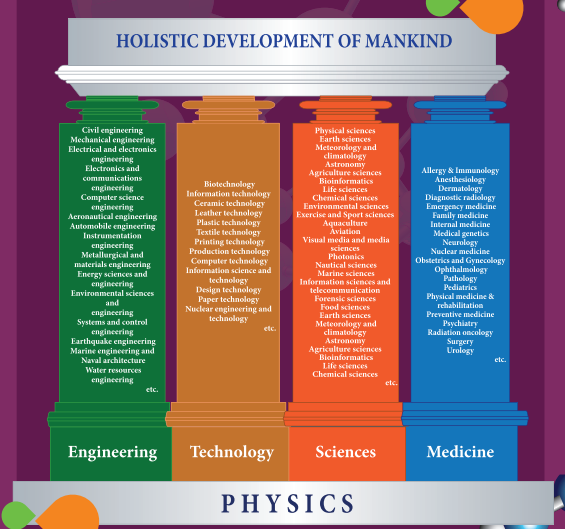

> ### 11.2 Nanoscience and Nanotechnology

> #### 11.2.1 Nanoscience

**Nanoscience**

Nanoscience is the study of structures and materials on the scale of nanometers. Nano means one-billionth of a meter that is 109 m.

If matter is divided into such small objects the mechanical, electrical, optical, magnetic and other properties change.

**Nanotechnology**

Nanotechnology is a technology involving the design, production, characterization, and applications of nano structured materials.

**Nanoparticles**

The solids are made up of particles. Each of the particle has a definite number of atoms, which might differ from material to material. If the particle of a solid is of size less than 100 nm, it is said to be a 'nano solid. When the particle size exceeds 100 nm, it is a 'bulk solid'. It is to be noted that nano and bulk solids may be of the same chemical composition. For example, ZnO can be both in bulk and nano form. Though chemical composition is the same, nano form of the material shows strikingly different properties when compared to its bulk counterpart.

In the nano scale dimensions (reduced dimensions), two important phenomena govern nano properties. They are quantum confinement effects and surface effects. Students can explore these effects in higher education and the explanation is avoided at school level.

> #### 11.2.2 Interdisciplinary nature of Nanotechonology

Nanoscience and technology is the interdisciplinary area covering its applications in various fields

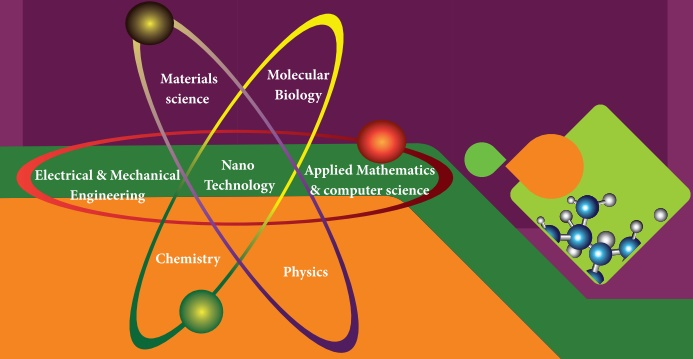

> #### 11.2.3 Nano in Nature

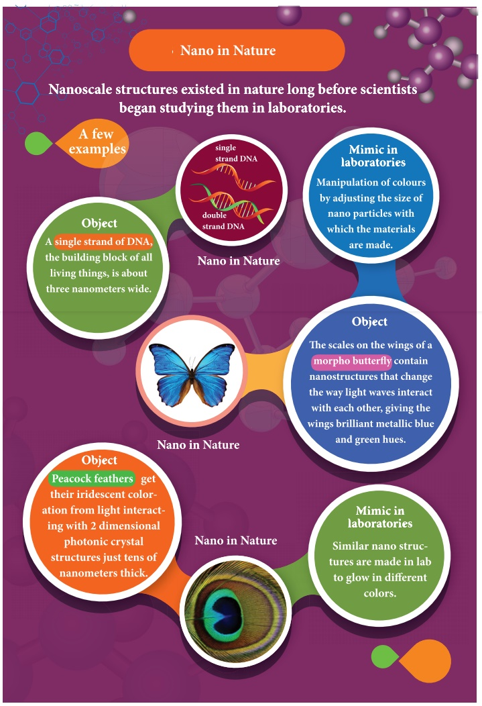
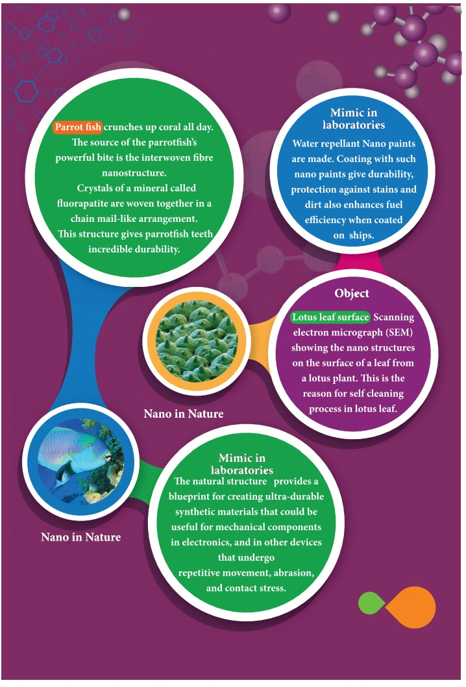

> #### 11.2.4 Early beginning and development (Not for examination)

 

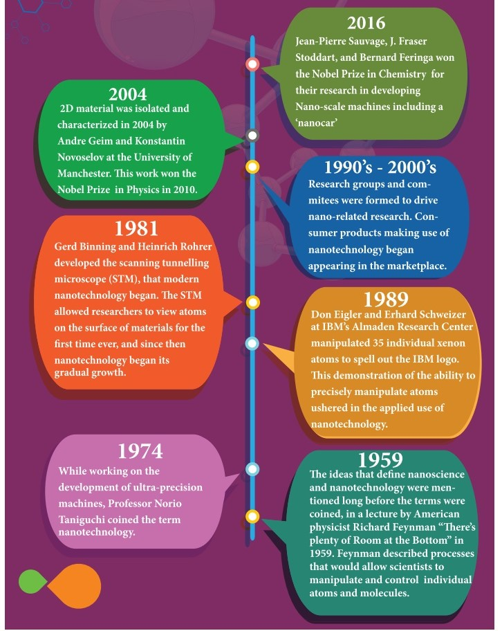

> #### 11.2.5 Nano in laboratories

The nanostructures made in the laboratory mimic some of nature's amazing nanostructures. As the nanostructures are so small, specialized methods are needed to manufacture objects in this size range. There are two ways of preparing the nanomaterials, top down and bottom up approaches.

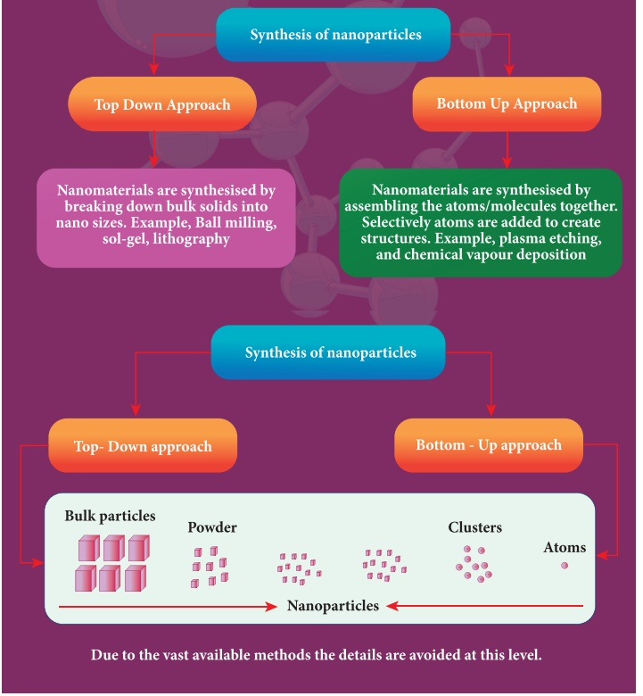

> #### 11.2.6 Applications of Nano technology

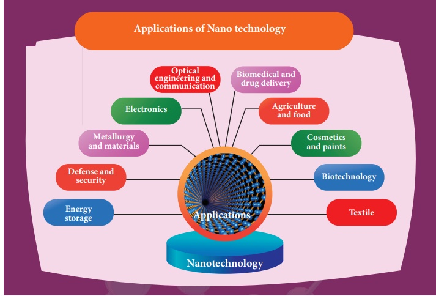
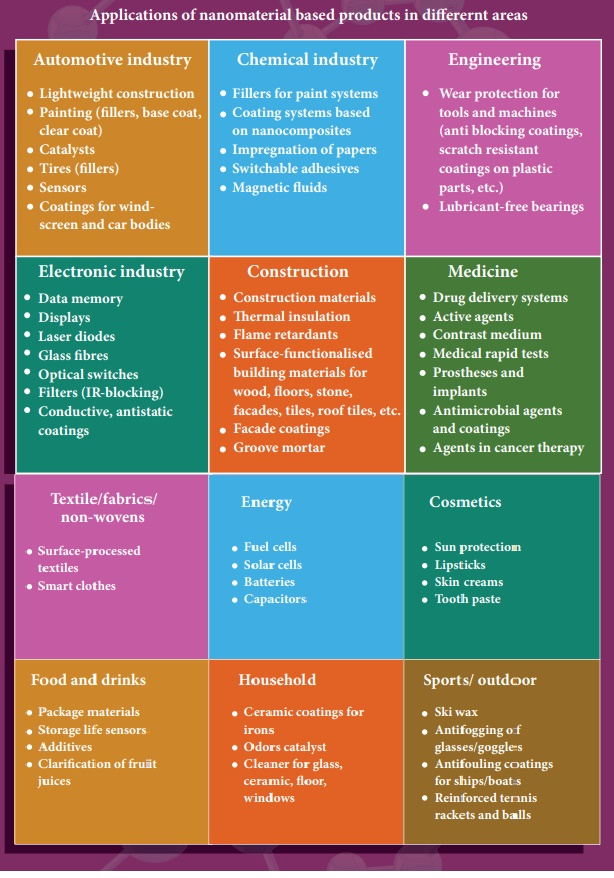

> #### 11.2.7 Possible harmful effects of nanoparticles

The research on the harmful impact of application of nanotechnology is also equally important and fast developing. The major concern here is that the nanoparticles have the dimensions same as that of the biological molecules such as proteins. They may easily get absorbed onto the surface of living organisms and they might enter the tissues and fluids of the body.

The adsorbing nature depends on the surface of the nanoparticle. Indeed, it is possi- ble to deliver a drug directly to a specific cell in the body by designing the surface of a nanoparticle so that it adsorbs specifically onto the surface of the target cell.

The interaction with living systems is also affected by the dimensions of the nanopar- ticles. For instance, nanoparticles of a few nanometers size may reach well inside biomolecules, which is not possible for larger nanoparticles. Nanoparticles can also cross cell membranes. It is also possible for the inhaled nanoparticles to reach the blood, to reach other sites such as the liver, heart or blood cells.

Researchers are trying to understand the response of living organisms to the pres- ence of nanoparticles of varying size, shape, chemical composition and surface characteristics.

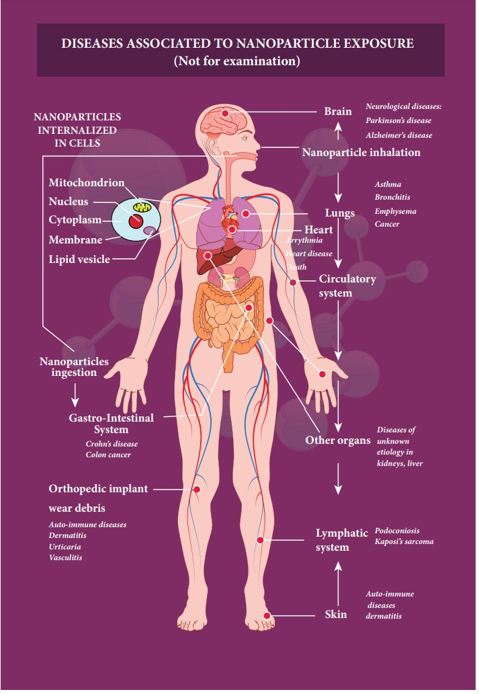

> ### 11.3 Robotics

> #### 11.3.1 What is robotics?

Robotics is an integrated study of mechanical engineering, electronic engineering, computer engineering, and science. Robot is a mechanical device designed with electronic circuitry and programmed to perform a specific task. These automated machines are highly significant in this robotic era. They can take up the role of humans in certain dangerous environments that are hazardous to people like defusing bombs, finding survivors in unstable ruins, and exploring mines and shipwrecks.

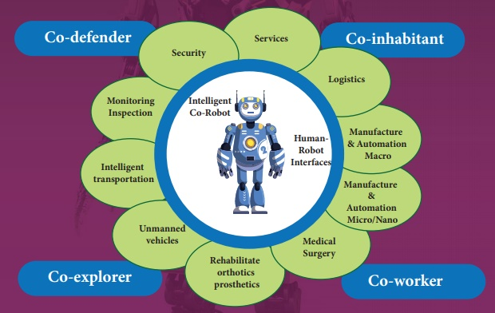

In 1954, George Devol invented the first digitally operated programmable robot called Unimate. George Devol and Joseph Engelberger, the father of the modern robotics industry formed the world’s first robot company in 1956. In 1961, Unimate, was operated in a General Motors automobile factory for moving car parts around in New Jersey.

> #### 11.3.2 COMPONENTS OF ROBOTICS

The robotic system mainly consists of sensors, power supplies, control systems, manipula- tors and necessary software.

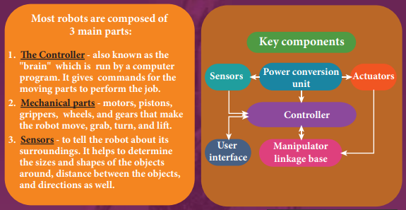

> #### 11.3.3 TYPES OF ROBOTS

**HUMAN ROBOT**

Certain robots are made to resemble humans in appearance and replicate the human activities like walking, lifting, and sensing, etc.

**1\. Power conversion unit:** Robots are powered by batteries, solar power, and hydraulics.

**2\. Actuators:** Converts energy into movement. The majority of the actuators produce rotational or linear motion.

**3\. Electric motors:** They are used to actuate the parts of the robots like wheels, arms, fingers, legs, sensors, camera, weapon systems etc. Different types of electric motors are used. The most often used ones are AC motor, Brushed DC motor, Brushless DC motor, Geared DC motor, etc.

**4\. Pneumatic Air Muscles:** They are devices that can contract and expand when air is pumped inside. It can replicate the function of a human muscle. They contract almost 40% when the air is sucked inside them.

**5\. Muscle wires:** They are thin strands of wire made of shape memory alloys. They can contract by 5% when electric current is passed through them.

**6\. Piezo Motors and Ultrasonic Motors:** Basically, we use it for industrial robots.

**7\. Sensors:** Generally used in task environments as it provides information of real-time knowledge.

**8\. Robot locomotion:** Provides the types of movements to a robot. The different types are

(a) Legged (b) Wheeled (c) Combination of Legged and Wheeled Locomotion  (d) Tracked slip/skid 

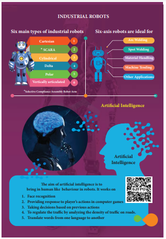

> #### 11.3.4 Applications

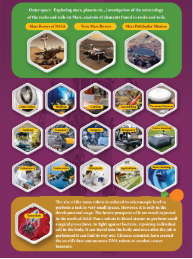

**Materials used to make robots**

For robots, aluminum and steel are the most common metals. Aluminum is a softer metal and is therefore easier to work with, but steel is several times stronger. In any case, because of the inherent strength of metal, robot bodies are made using sheet, bar, rod, channel, and other shapes.

> #### 11.3.5 Advantages of Robotics

1\. The robots are much cheaper than humans.

2\. Robots never get tired like humans. It can work for 24 x 7. Hence absenteeism in work place can be reduced.

3\. Robots are more precise and error free in performing the task.

4\. Stronger and faster than humans.

5\. Robots can work in extreme environmental conditions: extreme hot or cold, space or underwater. In dangerous situations like bomb detection and bomb deactivation.

6\. In warfare, robots can save human lives.

7\. Robots are significantly used in handling materials in chemical industries especially in nuclear plants which can lead to health hazards in humans.

> #### 11.3.6 Disadvantages of Robotics

1\. Robots have no sense of emotions or conscience.

2\. They lack empathy and hence create an emotionless workplace.

3\. If ultimately robots would do all the work, and the humans will just sit and monitor them, health hazards will increase rapidly.

4\. Unemployment problem will increase.

5\. Robots can perform defined tasks and cannot handle unexpected situations

6\. The robots are well programmed to do a job and if a small thing goes wrong it ends up in a big loss to the company.

7\. If a robot malfunctions, it takes time to identify the problem, rectify it, and even reprogram if necessary. This process requires significant time.

8\. Humans cannot be replaced by robots in decision making.

9\. Till the robot reaches the level of human intelligence, the humans in work place will exit.

> ### 11.4 Physics in medical diagnosis and therapy

Medical science very much revolves around physics principles. Medical instrumentation has widened the life span due to the technology integrated diagnosis and treatment of most of the diseases. This modernisation in all fields is possible due to efficient application of fundamental physics. 

**11.4.1 The development in medical field has been proportional to the evolution of physics as indicated below (Not for examination)**

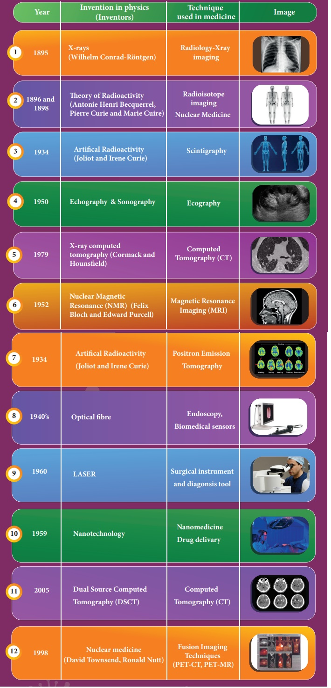

 

**11.4.2 The recent advancement in medical technology includes**

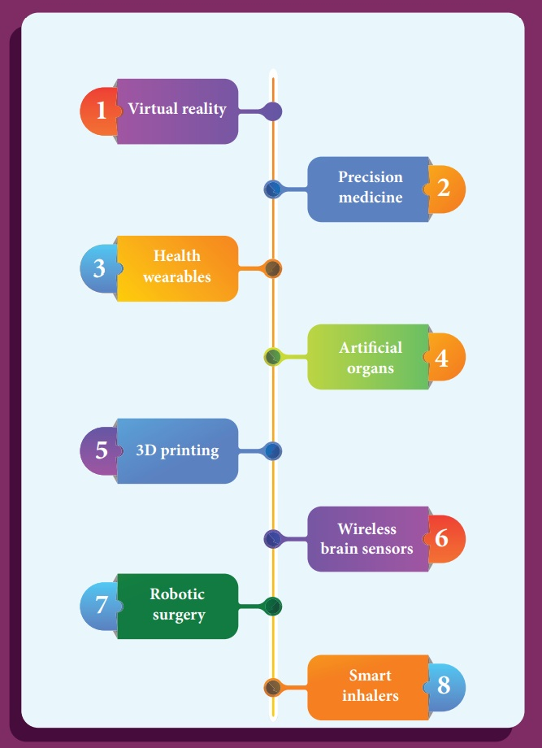

The innovation in medical diagnosis has taken leaps and bounds due to the integration of technology and basic physics. A few of such advancements are discussed.

**1\. Virtual reality**

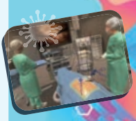

The innovation in medical diagnosis has taken leaps and bounds due to the integration of technology and basic physics. A few of such advancements are discussed.

**2\. Precision medicine**

Precision medicine is an emerging approach for disease treatment and prevention that takes into account individual variability in genes, environment, and lifestyle for each person. In this medical model it is possible to customise healthcare, with medical decisions, treatments, practices, or products which are tailored to the individual patient.

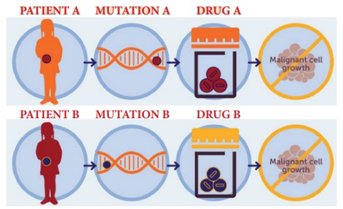

**3\. Health wearables**

A health wearable is a device used for tracking a wearer's vital signs or health and fitness related data, location, etc. Medical wearables with artificial intelligence and big data provide an added value to healthcare with a focus on diagnosis, treatment, patient monitoring and prevention.

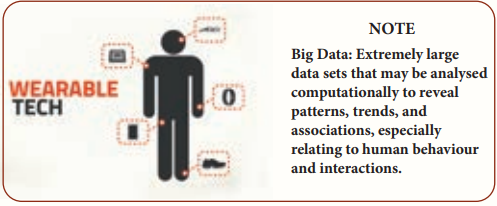

**4\. Artificial organs**

An artificial organ is an engineered device or tissue that is implanted or integrated into a human. It is possible to interface it with living tissue or to replace a natural organ. It duplicates or augments a specific function or functions of human organs so that the patient may return to a normal life as soon as possible.

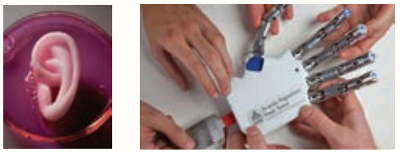

**5\. 3D printing**

Advanced 3D printer systems and materials assist physicians in a range of operations in the medical field from audiology, dentistry, orthopedics and other applications.

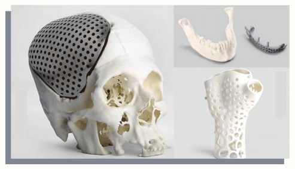

**6\. Wireless brain sensors**

Wireless brain sensors monitor intracranial pressure and tempera- ture and then are absorbed by the body. Hence there is no need for surgery to remove these devices.

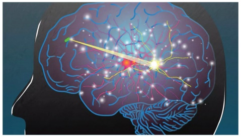

**7\. Robotic surgery**

Robotic surgery is a type of surgical procedure that is done using robotic systems. Robotically-assisted surgery helps to overcome the limitations of pre-existing minimally-invasive surgical procedures and to enhance the capabilities of surgeons performing open surgery.

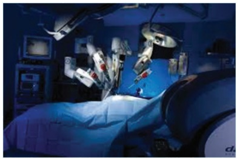

**8\. Smart inhalers**

Inhalers are the main treatment option for asthma. Smart inhal- ers are designed with health systems and patients in mind so that they can offer maximum benefit. Smart inhalers use bluetooth technology to detect inhaler use, remind patients when to take their medication and gather data to help guide care.

> ### Other recent developments in physics

**Particle Physics**

Particle physics deals with the theory of fundamental particles of nature and it is one of the active research areas in physics. Initially it was thought that atom is the fundamental entity of matter. In 1930s, it was established that atoms are made up of electrons, protons and neutrons.

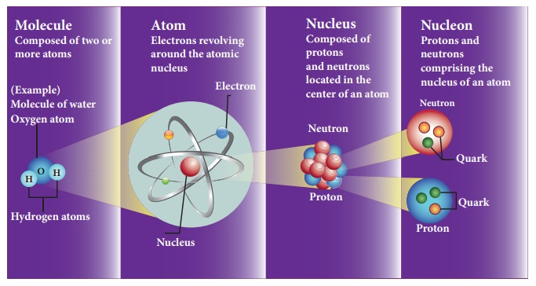

In the 1960s, quarks were discovered and it was understood that proton and neutron are made up of quarks. In the meantime, the particle physics research gained momentum and has grown exponentially both in theoretical and experimental perspective. Later it was found that the quarks interact through gluons. It is the field which received more number of noble prizes. Recently in the year 2013, famous ‘Higgs particles’ also known as “God” particles were discovered and for this, Peter Higgs and Englert received noble prize in physics. It is the ‘Higgs particle’ which gives mass to many particles like protons, neutrons etc.

**Cosmology**

Cosmology is the branch that involves the origin and evolution of the universe. It deals with formation of stars, galaxy etc. In the year 2015, the existence of “gravitational waves” was discovered and noble prize was awarded for this discovery in the year 2017.

Gravitational waves are the disturbances in the curvature of space-time and it travels with speed of light. Any accelerated charge emits electromagnetic wave. Similarly any accelerated mass emits gravitational waves but these waves are very weak even for masses like earth. The strongest source of gravitational waves are black holes. The discovery of gravitational waves made it possible to study the structure of black holes since it is the strongest source of gravitational waves. In fact, the recent discoveries of gravitational waves are emitted by two black holes when they merge to a single black hole. In fact, Albert Einstein theoretically proposed the existence of ‘gravitational waves’ in the year 1915. After 100 years, it is experimentally proved that his predictions are correct.

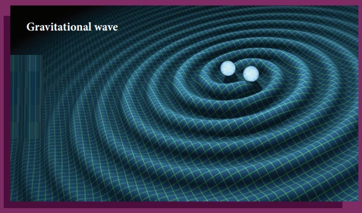

Black holes are end stage of stars which are highly dense massive object. Its mass ranges from 20 times mass of the sun to 1 million times mass of the sun. It has very strong gravitational force such that no particle or even light can escape from it. The existence of black holes is studied when the stars orbiting the black hole behave differently from the other stars. Every galaxy has black hole at its center. Sagittarius A* is the black hole at the center of the Milky Way galaxy.

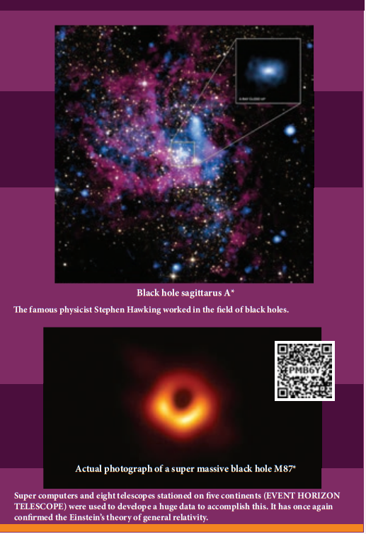

 

**Quantum information theory (Not for examination)**

It is another fast developing research area which deals with improving the information storage using quantum computers. The present computers store information in the form of ‘bits’ but quantum computers store information in the form of ‘qubits’. ‘qubit’ refers to quantum bit and it is the basic unit of quantum information. Classical bit implies either 0 or 1. But qubit not only includes 0 or 1 and also linear superposition of 0 and 1. This technology reduces the calculating time exponentially. This research field has very promising application in future.

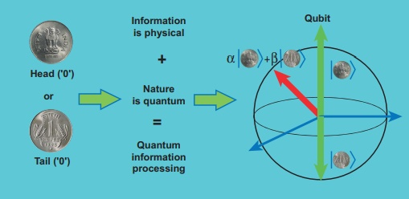

Many striking innovations and discoveries originate from scientific fictions. Robots are also no exception to this. The word robotics was derived from the word robot. It was introduced in the play ‘Rossum Universal Robots’ by the Zech writer Karel Capek in 1920. The word robot comes from the Slavic word rabota, which means labour or work. The play begins in a factory that makes artificial people called robots. They looked like creatures that can be mistaken for humans (picture shown). These characters were very similar to the modern ideas of androids.

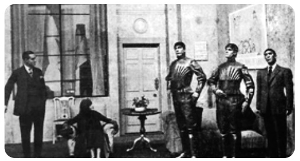

**A scene from the play Rossum Universal Robots, showing three robots**

 

**SUMMARY**

* Salient physics principles (covered in the higher secondary physics) are the foundation for technology break through.

* Physics is the basic building block for Science, Engineering, Technology and Medicine. Nano science is the science of objects with typical sizes of 1–100 nm.

* Nano means one-billionth of a metre that is 10–9 m.

* Nanotechnology is a technology involving the design, production, characterization, and applications of nano structural materials.

* If the particle of a solid is of size less than 100 nm, it is said to be a ‘nano solid’.

* When the particle size exceeds 100 nm, it forms a ‘bulk solid’.

* Nano form of the material shows strikingly different properties when compared to its bulk counterpart.

* Quantum confinement effects and surface effects are the two important phenomena that govern nano properties.

* Nanoscience and technology is the interdisciplinary area covering its applications in various fields.

* Nano scale structures existed in nature long before scientists began studying them in laboratories.

* There are two ways of preparing the nanomaterials, top down and bottom up approaches.

* Nanotechnology applications cover various fields.

* The major concern with nano application is that the nanoparticles have the dimensions same as that of the biological molecules such as proteins.

* Nano particles can easily get absorbed onto the surface of living organisms and they might enter the tissues and fluids of the body.

* The adsorbing nature depends on the surface of the nanoparticle.

* It is possible to deliver a drug directly to a specific cell in the body by designing the surface of a nanoparticle.

* Nanoparticles of a few nanometers size may reach well inside biomolecules, which is not possible for larger nanoparticles.

* Nanoparticles can also cross cell membranes.

* The inhaled nanoparticles reach the blood and that may also reach other sites such as the liver, heart or blood cells.

* Robotics is an integrated study of mechanical engineering, electronic engineering, computer engineering, and science.

* Robot is a mechanical device designed with electronic circuitry and programmed to perform a specific task.

* The robotic system mainly consists of sensors, power supplies, control systems, manipulators and necessary software.

* The key components of a robot are Power conversion unit, Actuators, Electric motors, Pneumatic Air Muscles, Muscle wires, Piezo Motors and Ultrasonic Motors, Sensors, and Robot locomotion.

* Six main types of industrial robots are Cartesian, SCARA, Cylindrical, Delta, Polar and Vertically articulated robot.

* Six-axis robots are ideal for Arc Welding, Spot Welding, Material Handling, Machine Tending.

* Five major fields of robotics: Human-robot interface, Mobility, Manipulation, Programming and Sensors.

* The aim of artificial intelligence is to bring in human like behavior in robots.

* Artificial intelligence works on face recognition, providing response to players’ actions in computer games, taking decisions based on previous actions, regulating the traffic by analyzing the density of traffic on roads and translate words from one language to another.

* Materials used to make robots: aluminum and steel are the most common metals.

* Aluminum is a softer metal and is therefore easier to work with.

* Steel is several times stronger.

* Due to the inherent strength of metal, robot bodies can be made using sheet, bar, rod, channel, and other shapes.

* Robots have many advantages in various applications but also have several disadvantages.

* In outer space robots are used for exploring stars, planets etc., investigation of the mineralogy of the rocks and soils on Mars, analysis of elements found in rocks and soils.

* Household robots are used as vacuum cleaners, floor cleaners, gutter cleaners, lawn mowing, pool cleaning, and to open and close doors.

* Industrial Robots are used for welding, cutting, robotic water jet cutting, robotic laser cutting, lifting, sorting, bending, manufacturing, assembling, packing, transport, handling hazardous materials like nuclear waste, weaponry, laboratory research, mass production of consumer and industrial goods.

* Nano-robots are being developed to be in the blood stream to perform small surgical procedures, to fight against bacteria, repairing individual cell in the body.

* The development in medical field has been proportional to the evolution of physics.

* Therecent medical technology includes virtual reality, precision medicine, healthwearables, artificial organs, 3D printing, wireless brain sensors, robotic surgery, smart inhalers.

* Particle physics deals with fundamental particles of nature. Protons and neutrons are made of quarks.

* Cosmology is the branch that involves the origin and evolution of the universe.

* Accelerated mass emits gravitational waves which are very weak.

* Black holes are the strongest source of gravitational waves.

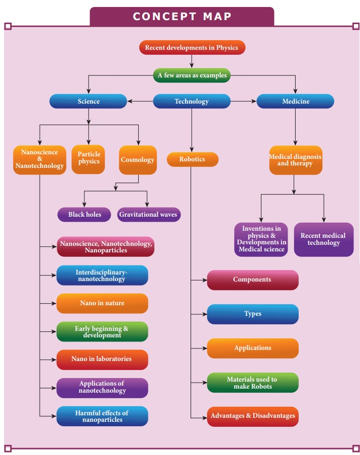

 

**EVALUATION**

**I Multiple Choice Questions**

**1\.** The particle size of ZnO material is 30 nm. Based on the dimension it is classified as 
a) Bulk material b) Nanomaterial c) Soft material d) Magnetic material

**2\.** Which one of the following is the natural nanomaterial. 
a) Peacock feather b) Peacock beak c) Grain of sand d) Skin of the Whale

**3\.** The blue print for making ultra durable synthetic material is mimicked from 
a) Lotus leaf b) Morpho butterfly c) Parrot fish d) Peacock feather

**4\.** The method of making nanomaterial by assembling the atoms is called
a) Top down approach b) Bottom up approach c) Cross down approach d) Diagonal approach

**5\.** “Ski wax” is an application of nano product in the field of 
a) Medicine b) Textile c) Sports d) Automotive industry  

**6\.** The materials used in Robotics are 
a) Aluminium and silver b) Silver and gold c) Copper and gold d) Steel and aluminum

**7\.** The alloys used for muscle wires in Robots are
 a) Shape memory alloys b) Gold copper alloys c) Gold silver alloys d) Two dimensional alloys

**8\.** The technology used for stopping the brain from processing pain is
a) Precision medicine b) Wireless brain sensor c) Virtual reality d) Radiology

**9\.** The particle which gives mass to protons and neutrons are
 a) Higgs particle b) Einstein particle c) Nanoparticle d) Bulk particle

**10\.** The gravitational waves were theoretically proposed by  
a) Conrad Rontgen b) Marie Curie c) Albert Einstein d) Edward Purcell

**Answers**

1\) b 2) a 3) c 4) b 5) c 6) d 7) a 8) c 9) a 10) c

---

**II Short answers**

**1\.** Distinguish between Nanoscience and Nanotechnology.

**2\.** What is the difference between Nano materials and Bulk materials?

**3\.** Give any two examples for “Nano” in nature.

**4\.** Mention any two advantages and disadvantages of Robotics.

**5\.** Why steel is preferred in making Robots?

**6\.** What are black holes?

 **7\.** What are sub atomic particles?

 ---

**III Long Answers**

**1\.** Discuss the applications of     Nanomaterials in various fields.

**2\.** What are the possible harmful effects of usage of Nanoparticles? Why?

**3\.** Discuss the functions of key components in Robots?

**4\.** Elaborate any two types of Robots with relevant examples.

**5\.** Comment on the recent advancement in medical diagnosis and therapy.

**BOOKS FOR REFERENCE**

**1\.** Pradeep, T. Nano Essential Understanding Nano Science and Nanotechnology, McGraw Hill Education, India 2007.

**2\.** Rita John, Solid State Physics, McGraw Hill Education, India 2016

**3\.** Asim K Das, Mahua Das, An Introduction to Nano Science and Nano technology, CBS Publishers and Distributors Pvt Ltd, India 2017.

**4\.** Jerrold T. Bushberg, J.Anthony Seibert, The Essential Physics of Medical Imaging, Wolters Kluwer, Lippin Cott Willams & Wilkins 2012

**5\.** Brian R Martin, Particle Physics, Kindle edition, 2011

**6\.** B S Murty, P Shankar, Baldev Raj, B B Rath, James Murday, Textbook of Nanoscience and Nanotechnology, Springer, Universities Press, 2013

 

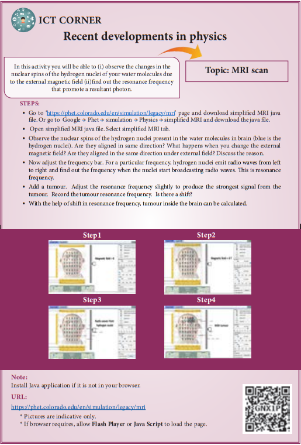