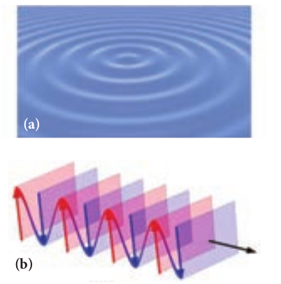

```
**Learning Objectives**

**In this unit, the students are exposed to,** 
- The wave aspect of light. 
- The proof for law of reflection and refraction. 
- The phenomena like interference, diffraction and polarisation.
- The terms like magnification and resolving power etc ... 
- The different optical instruments like microscope, telescope etc.
```


## THEORIES ON LIGHT

Light is a form of energy that is transferred from one place to another. A glance at the evolution of various theories of light put forth by scientists will give not only an over view of the nature of light but also its propagation and some phenomenon demonstrated by it.

### Corpuscular theory

Sir Isaac Newton (1672) gave the corpuscular theory of light which was also suggested earlier by Descartes (1637) to explain the laws of reflection and refraction. According this theory, light is emitted as tiny, massless (negligibly small mass) and perfectly elastic particles called corpuscles. As the corpuscles are very small, the source of light does not suffer appreciable loss of mass even if it emits light for a long time. On account of high speed, they are unaffected by the force of gravity and their path is a straight line in a medium of uniform refractive index. The energy of light is the kinetic energy of these corpuscles. When these corpuscles impinge on the retina of the eye, the vision is produced. The different sizes of the corpuscles give different colours to light. When the corpuscles approach a surface between two media, they are either repelled (or) attracted. The reflection of light is due to the repulsion of the corpuscles by the medium and refraction of light is due to the attraction of the corpuscles by the medium.

This theory could not explain the reason why the speed of light is lesser in denser medium than in rarer medium and also the phenomena like interference, diffraction and polarisation.
  

### Wave theory

Christian Huygens (1678) proposed the wave theory to explain the propagation of light through a medium. According to him, light is a disturbance from a source travels that as longitudinal mechanical waves through the ether medium (that was presumed to pervade all space) as mechanical wave requires a medium for its propagation. The wave theory could successfully explain phenomena of reflection, refraction, interference and diffraction of light.

Later, the existence of ether in all space was proved to be wrong. Hence, this theory could not explain the propagation of light through vacuum. The phenomenon of polarisation could not be explained by this theory as it is the property of only transverse waves.

### Electromagnetic wave theory

Maxwell (1864) proved that light is an electromagnetic wave which is transverse in nature carrying electromagnetic energy. He could also show that no medium is necessary for the propagation of electromagnetic waves. All the phenomenon of light could be successfully explained by this theory.

Nevertheless, the interaction phenomenon of light with matter like photoelectric effect and Compton effect could not be explained by this theory.

### Quantum theory

Albert Einstein (1905), endorsing the views of Max Plank (1900), was able to explain photoelectric effect (discussed in Unit 8) in which light interacts with matter as _photons_ to eject the electrons. A photon is a discrete packet of energy. Each photon has energy _E_ of, 

_E_ = _hv_ (7.1)

Where, _h_ is Plank’s constant (_h_ = 6.625 × 10–34 Js) and _v_ is frequency of electromagnetic wave.

As light has both wave as well as particle nature it is said to have dual nature. It is concluded that light propagates as a wave and interacts with matter as a particle.

## WAVE NATURE OF LIGHT

Light is a transverse, electromagnetic wave. The wave nature of light was first demonstrated through experiments like interference and diffraction. The transverse nature of light is demonstrated in polarization. Like all electromagnetic waves, light can travel through vacuum.

### Wave optics

Wave optics deals with the wave characteristics of light. Even the law of reflection and refraction are proved only with the help of wave optics. Though light propagates as a wave, its direction of propagation is still represented as a ray.

A good example for wave propagation is the spreading of circular ripples on the surface of still water from a point where a stone is dropped. The molecules (or) particles of water at a point are moving only up and down (oscillate) when a ripple passes through that point. All these particles on the circular ripple are in the same phase of vibration as they are all at the same distance from the center. The ripple represents a wavefront as shown in Figure 7.1(a). **A _wavefront_ is the locus of points which are in the same state (or) phase of vibration.**

When a wave propagates it is treated as the propagation of wavefront. The wavefront is always perpendicular to the direction of the propagation of the wave. As the direction of ray is in the direction of propagation of the wave, the wavefront is always perpendicular to the ray as shown in Figure 7.1(b).



The shape of a wavefront observed at a point depends on the shape of the source and also the distance at which the source is located. A point source located at a finite distance gives spherical wavefronts. An extended (or) line source at finite distance gives cylindrical wavefronts. Any source that is located at infinity gives plane wavefront as shown in Figure 7.2.


### Huygens’ Principle

Huygens principle is basically a geometrical construction which gives the shape of the wavefront at any time if we know its shape at _t_ = 0. **According to Huygens principle, each point on the wavefront behaves as the source of secondary wavelets spreading out in all directions with the speed of the wave. These are called as secondary wavelets**. **The envelope to all these wavelets gives the position and shape of the new wavefront at a later time**. Thus, Huygens’ principle explains the propagation of a wavefront.

The propagation of a spherical and plane wavefront can be explained using Huygens’ principle. Let, _AB_ be the wavefront at a time, _t_ = 0. According to Huygens’ principle, every point on _AB_ acts as a source of secondary wavelet which travels with the speed of the wave (speed of light _c_). To find the position of the wavefront after a time _t_, circles of radius equal to _ct_ are drawn with points _P_, _Q, R_ ... etc., as centers on _AB_. The forward envelope (or) the tangent ′ ′_A B_ of the small circles is the new wavefront at that instant _t_. The wavefront ′ ′_A B_ will be a spherical wavefront from a point object which is at a finite distance as shown in Figure 7.3(a) and it is a plane wavefront if the source of light is at a large distance (infinity) as shown in Figure 7.3(b).


There is one shortcoming in the above Huygens’ construction for propagation of a wavefront. It could not explain the absence of backward wave which also arises in the above construction. According to electromagnetic wave theory, the backward wave is ruled out inherently. However, Huygens’ principle is a good diagrammatic construction which explains the propagation of the wavefront.

### Proof for laws of reflection using Huygens’ Principle

Let us consider a parallel beam of light is incident on a reflecting plane surface such as a plane mirror _XY_ as shown in Figure 7.4. The incident wavefront is _AB_ and the reflected wavefront is ′ ′_A B_ . These wavefronts are perpendicular to the incident rays _L_, _M_ and reflected rays ′_L_ , ′_M_ respectively. By the time point _A_ of the incident wavefront touches the reflecting surface, the point _B_ is yet to travel a distance _BB_′ to touch the reflecting surface at ′_B_ . When the point _B_ touches the reflecting surface at ′_B_ , the point _A_ would have reached ′_A_ . This is applicable to all the points on the wavefront. Thus, the reflected wavefront ′ ′_A B_ emanates as a plane wavefront. The two normals _N_ and ′_N_ are considered at the points where the rays _L_ and _M_ fall on the reflecting surface. As reflection happens in the same medium, the speed of light is same before and after


**Figure 7.4 Laws of reflection**  

the reflection. The time taken for the light to travel from _B_ to ′_B_ and _A_ to ′_A_ are the same. Thus, the distance _BB_′ is equal to the distance _AA_′ ; _(AA = BB )_′ ′ .
(i) The incident rays, the reflected rays and the normal are in the same plane.
(ii) Angle of incidence,
∠_i_ = ∠_NAL_ = 90o – ∠_NAB_ = ∠_BAB_′ Angle of reflection,

∠_r_ = ∠ ′ ′ ′_N B M_ \= 90 o–∠ ′ ′ ′_N B A_ \= ∠ ′ ′_A B A_

For the two right angle triangles, ∆ _ABB_′ and ∆ ′ ′_B A A_ , the two right angles, ∠_B_ and ∠ ′_A_ are equal, (∠_B_ and ∠ ′_A_ \= 90o); the two sides, _AA_′ and _BB_′ are equal, _AA = BB_′ ′( ) ; the side _AB_′ is common. Thus, the two triangles are congruent. As per the property of congruency, the two angles, ∠_BAB_′ and ∠ ′ ′_A B A_ must also be equal.

_i_ = _r_ (7.2)

Hence, the laws of reflection are proved.

### Proof for laws of refraction using Huygens’ Principle

Let us consider a parallel beam of light is incident on a refracting plane surface _XY_ such as a glass as shown in Figure 7.5. The incident wavefront _AB_ is in rarer medium (1) and the refracted wavefront ′ ′_A B_ is in denser medium (2). These wavefronts are perpendicular to the incident rays _L_, _M_ and refracted rays ′ ′_L ,M_ respectively. By the time the point _A_ of the incident wavefront touches the refracting surface, the point _B_ is yet to travel a distance _BB_′ to touch the refracting surface at ′_B_ . When the point _B_ touches the refracting surface at ′_B_ , the point _A_ would have reached ′_A_ in the other medium. This is applicable

to all the points on the wavefront. Thus, the refracted wavefront ′ ′_A B_ emanates as a plane wavefront. The two normals _N_ and ′_N_ are considered at the points where the rays _L_ and _M_ fall on the refracting surface. As refraction happens from rarer medium (1) to denser medium (2), the speed of light is _v_1 and _v_2 before and after refraction and _v_1 is greater than _v_2, (_v_1>_v_2). But, the time taken _t_ for the ray to travel from _B_ to ′_B_ is the same as the time taken for the ray to travel from _A_ to ′_A_ .

(i) The incident rays, the refracted rays and the normal are in the same plane.

(ii) Angle of incidence,

_i_ = ∠_NAL_ = 90o – ∠_NAB_ = ∠_BAB_′

Angle of refraction,

r = ∠ ′ ′ ′_N B M_ \= 90 o – ∠ ′ ′ ′_N B A_ \= ∠ ′ ′_A B A_

For the two right angle triangles ∆ _ABB_′ and ∆_AA'B'_, sin sin

Here, _c_ is speed of light in vacuum. The ratio _c_/_v_ is a constant, called refractive index of the medium. The refractive index


of medium (1) is, _c_/_v_1 = _n_1 and that of medium (2) is, _c_/_v_2 = _n_2.

In ratio form,

Formulas 

In product form,

Formulas 

Hence, the laws of refraction are proved. In the same way the laws of refraction can be proved for wavefront travelling from denser to rarer medium also.

The speed of light is inversely proportional to the refrative index of the medium ( )_v n_µ1 and also directly proportional to wavelength of light ( )_v_ ∝λ . Hence,
Formulas 

--- 
**Note**
If light of a particular frequency travels through different media, then, its frequency remains unchanged in all the media. Only the wavelength changes according to speed of light in that medium.

---
**EXAMPLE 7.1**

The wavelength of light from sodium source in vacuum is 5893Å.What are its (a) wavelength, (b) speed and (c) frequency when this light travels in water which has a refractive index of 1.33.

**_Solution_** 

The refractive index of vacuum, _n_1 = 1

The wavelength in vacuum, _λ_1 = 5893 Å.

The speed in vacuum, _c_ = _v_1 = 3 × 108 m s–1

The refractive index of water, _n_2 = 1.33

The wavelength of light in water, _λ_2

The speed of light in water, _v_2

(a) The equation relating the wavelength and refractive index is,

(b) The equation relating the speed and refractive index is,

(c) Frequency of light in vacuum is,

The results show that the frequency remains same in all media.  

## INTERFERENCE

**The phenomenon of superposition of two light waves which produces increase in intensity at some points and decrease in intensity at some other points is called _interference_ of light.**

Superposition of waves refers to addition of waves. The concept of superposition of mechanical waves is studied in (XI Physics 11.7). When two waves simultaneously pass through a particle in a medium, the resultant displacement of that particle is the vector addition of the displacements due to the individual waves. The resultant displacement will be maximum or minimum depending upon the phase difference between the two superimposing waves. These concepts hold good for light as well.

Let us consider two light waves from the two sources _S_1 and _S_2 meeting at a point _P_ as shown in Figure 7.6.


The wave from _S_1 at an instant _t_ at _P_ is,

FOrmulas 

The wave form _S_2 at an instant _t_ at _P_ is,

Formulas 

The two waves have different amplitudes _a_1 and _a_2, same angular frequency _ω_, and a phase difference of _ϕ_ between them. The resultant displacement will be given by,

FOrmulas 

The simplification of the above equation by using trigonometric identities as done in (XI Physics 11.7) gives,

Formulas 

The resultant amplitude is maximum,

Formulas

The resultant amplitude is minimum,

Formulas

The intensity of light is proportional to square of amplitude,

Formulas

Now, squaring equation (7.10) on both sides,

Formulas

In equation (7.15) if the phase difference, _ϕ_ = 0, ±2_π_, ±4_π_. . . , it corresponds to the condition for maximum intensity of light called **_constructive interference_**.

The resultant maximum intensity is,

Formulas  

In equation (7.15) if the phase difference, _ϕ_ = ±_π_, ±3_π_, ±5_π_. . . , it corresponds to the condition for minimum intensity of light called **_destructive interference_**.

The resultant minimum intensity is,

Formulas 

As a special case, if _a_1 = _a_2 = _a_, then equation (7.10). becomes,

Formulas 

We conclude that the phase difference _ϕ_, between the two waves decides the intensity of light at that point where the two waves meet.

**EXAMPLE 7.2**

Two light sources with amplitudes 5 units and 3 units respectively interfere with each other. Calculate the ratio of maximum and minimum intensities.

**_Solution_** 

Amplitudes, a1 = 5, a2 = 3

Resultant amplitude,

Resultant amplitude is maximum when,

Formulas 

Resultant amplitude is minimum when,

Formulas 

**EXAMPLE 7.3**

Two light sources of equal amplitudes interfere with each other. Calculate the ratio of maximum and minimum intensities.

**_Solution_** 

Let the amplitude be _a_.

The intensity is, _I a_µ 4 22 2cos ( / )_f_ or _I I_\= 4 20 2cos ( / )_f_

Resultant intensity is maximum when,

_f_ \= = ∝0 0 1 4 2, cos , Imax _a_

Resultant amplitude is minimum when,

_f p p_\= ( )= =, cos / , Imin2 0 0

I : :max min_I a_\= 4 02  

**EXAMPLE 7.4**

Two light sources have intensity of light as _I_0\. What is the resultant intensity at a point where the two light waves have a phase difference of _π_/3?

**_Solution_** 

Let the intensities be _I_0.

The resultant intensity is, _I_ =4 _I_0cos2(_ϕ_/2)

Resultant intensity when, Formulas 

### Phase difference and path difference

Phase is the angular position of vibration when a wave is progresses, there is a relation between the phase of the vibration and the path travelled by the wave. We can express the phase in terms of path and vice versa. In the path of the wave, one wavelength _λ_ corresponds to a phase of 2_π_ as shown in Figure 7.7. A path difference _δ_ corresponds to a phase difference _ϕ_ as given by the equation,

**Figure 7.7 Path difference and phase** difference the path difference must be, _δ_ = 0, _λ_, 2_λ_ . . . In general, the integral multiples of _λ_.

_δ_ = _nλ_ where, _n_ = 0, 1, 2, 3 . . . (7.24)

For destructive interference, the phase difference should be, _ϕ_ \= _π_, 3_π_, 5_π_ . . . Hence, the path difference must be, _d l l_ \=

In general, the half integral multiples of _λ_.

Formulas 

**EXAMPLE 7.5**

The wavelength of a light is 450 nm. How much phase it will differ for a path of 3 mm?

**_Solution_**

Wavelength, _l_ \= = × −450 450 10 9nm m

Path difference, _d_ \= = × −3 3 10 3mm m

Relation between phase difference and

path difference, _f p l_

_d_\= × 2

Substituting,


### Coherent sources

**Two light sources are said to be coherent if they produce waves which have same phase or constant phase difference, same frequency or wavelength (monochromatic), same waveform and preferably same amplitude.** Coherence is a property of waves that enables to obtain stationary interference patterns.

Two independent monochromatic sources can never be coherent, because they may emit waves of same frequency and same amplitude, but not with same phase. This is because, atoms while emitting light, produce change in phase due to thermal vibrations. Hence, these sources are said to be incoherent sources.

To obtain coherent light waves, we have the following three techniques.

(i) Wavefront division

(ii) Intensity (or) Amplitude division

(iii) Source and Images.

**(i) Wavefront division**: This is the most commonly used method for producing coherent sources. We know a point source produces spherical wavefronts. All the points on the wavefront are at the same phase. If two points are chosen on the wavefront by using a double slit, the two points will act as coherent sources as shown in Figure 7.8.


**(ii) Intensity (or) Amplitude division**: If we allow light to pass through a partially silvered mirror (beam splitter), both reflection and refraction take place simultaneously. As the two light beams are obtained from the same light source, the two divided light beams will be coherent beams. They will be either in-phase or at constant phase difference as shown in Figure 7.9. Instruments like Michelson’s interferometer, Fabray-Perrot etalon work on this principle.


**(iii) Source and Images**: In this method a source and its images will act as a set of coherent sources, because the source and its image will have waves in-phase (or) constant phase difference as shown in Figure 7.10. The Instrument, Fresnel’s biprism uses two virtual images of the source as two coherent sources and the instrument, Lloyd’s mirror uses a source and its one virtual image as two coherent sources.  


### Double slit as coherent sources

Double slit uses the principle of wavefront division. Two slits _S_1 and _S_2 illuminated by a single monochromatic source _S_ act as two coherent sources. The waves from them travel in the same medium and superpose. The constructive and destructive interference formed by them are shown in Figure 7.11(a). The crests of the waves are shown by thick continuous lines and troughs are shown by broken lines in Figure 7.11(b).

At points where the crest of one wave meets the crest of the other wave (or) the trough of one wave meets the trough of the other wave, the waves are in-phase. Hence, the displacement is maximum and these points appear bright as a result of this **_constructive interference_**.

At points where the crest of one wave meets the trough of the other wave and vice-versa, the waves are out-of-phase. Hence, the displacement is minimum and these points appear dark as a result of this **_destructive interference_**.

On a screen the intensity of light will be alternative maximum and minimum strips i.e. bright and dark bands which are referred as interference fringes.

### Young’s double slit experiment

_Experimental setup_ Thomas Young, a British Physicist in 1801 used an opaque screen with two small openings called double slit _S_1 and

_S_2 kept equidistance from a source _S_ as shown in Figure 7.12. The width of each slit is about 0.03 mm and they are separated by a distance of about 0.3 mm. As _S_1 and _S_2 are equidistant from _S_ the same wavefront is cut by _S1_ and _S2_. The light waves at _S_1 and _S_2 are in-phase. So, _S_1 and _S_2 act as coherent sources which is the requirement for obtaining interference pattern.

Wavefronts from _S_1 and _S_2 spread out and overlap on the other side of the double slit. When a screen is placed at a distance of about 1 m from the slits, alternate bright and dark fringes which are equally spaced appear on the screen. These are called interference fringes (or) bands. Using an eyepiece, the fringes can be seen directly. At the center point _O_ on the screen, the waves from _S_1 and _S_2 travel equal distances and arrive in-phase as shown in Figure 7.12. These two waves constructively interfere and a bright fringe is observed at _O_. This is called central bright fringe. When one of the slits is closed, the fringes disappear and there is uniform illumination on the screen. This shows clearly that the bands are due to interference.

_Equation for path difference_ 

The schematic diagram of the experimental setup is shown in Figure 7.13. Let d be the distance between the double slits _S_1 and _S_2 which act as coherent sources of wavelength _λ_. A screen is placed parallel to the double slit at a distance _D_ from it. The mid-point of _S_1 and _S_2 is _C_ and the mid-point of the screen _O_ is equidistant from _S_1 and _S_2\. _P_ is any point at a distance _y_ from _O_. The waves from _S_1 and _S_2 meet at _P_ either in-phase or out-of-phase depending upon the path difference between the two waves.

**FIgure 7.13 Young’s double slit arrangement to find path difference**
The path difference _δ_ between the light waves from _S_1 and _S_2 to the point _P_ is, _δ_ = _S_2_P_ – _S_1_P_
A perpendicular is dropped from the point _S_1 to the line _S_2_P_ at _M_ to find the path difference more precisely.

_δ_ = _S_2_P_ – _MP_ = _S_2_M_ (7.26)

The angular position of the point _P_ from _C_ is _θ_. ∠_OCP_ = _θ_.
From the geometry, the angles ∠_OCP_ and ∠_S_2_S_1_M_ are equal.

∠_OCP_ = ∠_S_2_S_1_M_ = _θ_. 

In right angle triangle ∆_S_1_S_2_M_, the path difference, _S_2_M_ = _d_ sin _θ_

_δ_ = _d_ sin _θ_ (7.27)  

If the angle _θ_ is small, sin _θ_ ≈ tan _θ_ ≈ _θ_
From the right angle triangle ∆_OCP_,
tan_q_ \= _y D_

The path difference, _d_ \= _d y D_

(7.28)

Based on the condition of the path difference, the point _P_ may have a bright (or) dark fringe.

_Condition for bright fringe (or) maxima_ The condition for the point _P_ to have a

constructive interference (or) be a bright fringe is, Path difference, _δ_ = _nλ_ where, _n_ = 0, 1, 2, . . . 
This is the condition for the point _P_ to have a bright fringe. The distance _yn_ is the distance of the _n_th bright fringe from the point _O_.

_Condition for dark fringe (or) minima_ The condition for the point _P_ to have a destructive interference (or) be a dark fringe is, Path difference, _d l_ \= −( )2 1

This is the condition for the point P to have a dark fringe. The distance _yn_ is the distance of the _n_th dark fringe from the point _O_. The formation of bright and dark fringes is shown in Figure 7.14.


**Figure 7.14.png Formation of bright and dark fringes**

This shows that on the screen, alternate bright and dark fringes are seen on either side of the central bright fringe. The central bright is referred as 0th bright followed by 1st dark and 1st bright and then 2nd dark and 2nd bright and so on, on either side of _O_ successively as shown in Figure 7.15.

**Figure 7.15. Interference fringe pattern**

_Equation for bandwidth_ 

**The _bandwidth_ _β_ is defined as the**

**distance between any two consecutive bright (or) dark fringes.**
The distance between (_n_+1)th and _n_th consecutive bright fringes from _O_ is given by,
Formulas 
Similarly, the distance between (_n_+1)th and _n_th consecutive dark fringes from _O_ is given by,
Formulas 

From Equations (7.31) and (7.32) we understand that the bright and dark fringes are of same width equally spaced on either side of the central bright fringe.

_Conditions for obtaining clear and broad interference fringes:_ 

(i) The distance _D_ between the screen and double slit should be as large as possible. 
(ii) The wavelength _λ_ of light used must be as long as possible. 
(iii) The distance _d_ between the two slits must be as small as possible.

**EXAMPLE 7.6**

In Young’s double slit experiment, the two slits are 0.15 mm apart. The light source has a wavelength of 450 nm. The screen is 2 m away from the slits.

(a) Find the distance of the second bright fringe and also third dark fringe from the central maximum.

(b) Find the fringe width.

(c) How will the fringe pattern change if the screen is moved away from the slits?

(d) What will happen to the fringe width if the whole setup is immersed in water of refractive index 4/3.
**_Solution_** 
_d_ = 0.15 mm = 0.15× 10-3 m; _D_ = 2 m; _λ_ = 450 nm = 450 × 10-9 m; _RI_ = 4/3

(a) Equation for _n_th bright fringe,
Formulas 
Distance of 2nd bright fringe,
FOrmuals 
32 450 10 2 0 15 10

Equation for _n_th dark fringe,
FOrmulas 
Distance of 3rd dark fringe,
FOrmulas 
(b) Equation for fringe width, _b l_ \=
Formulas 
(c) The fringe width will increase as D is
Formulas 
(d) The fringe width will decrease as the setup is immersed in water of refractive index 4/3
Formuals 
### Interference in white light (polychromatic light)

When a white light (polychromatic light) is used in interference experiment, coloured fringes of varied thickness will be formed on the screen. This is because, different colours have different wavelengths. However, the central fringe (or) 0th fringe will always be bright and white in colour, because all the colours falling at the point _O_ will have no path difference with each other. Hence, only constructive interference is possible at _O_ for all the colours.

**EXAMPLE 7.7**

Lights of two wavelengths 560 nm and 420 nm are used in Young’s double slit experiment. Find the least distance from the central fringe where the bright fringes of the two wavelengths coincide. Given _D_ = 1 m and _d_ = 3 mm.

**_Solution_** 
Formulas 

Thus, the 3rd bright fringe of _λ_1 and 4th bright fringe of _λ_2 coincide at the least distance y.

The least distance from the central fringe where the bright fringes of the two wavelengths coincides is, _y n D_
Formulas 

---
**Do You Know ?**
Dazzling colours are exhibited water and also by soap bubbles as to interference of white light unde the bottom surfaces of thin films. Tfilm, refractive index of the film and also the enters into the film, again gets divided at the lower surface into two parts; one is transmitted out of the film and the other is reflected back into the film. The reflected as well as refracted parts are further formed as multiple reflections take place inside the film. The interference occurs in both the reflected and transmitted light.

---

### Interference in thin films

Let us consider a thin film of transparent material of refractive index _µ_ (here refractive index is not represented as _n,_ not to confuse with order of fringe _n_) and thickness _d._ A parallel beam of light is incident on the film at an angle _i_ as shown in Figure 7.16. The wave is divided into two parts at the point of incidence, as reflected and refracted lights. The refracted part, which

_For transmitted light_ 

The light transmitted may interfere to produce a resultant intensity. Let us consider the path difference between the two light waves transmitted from _B_ and _D_. The two waves moved together and remained in phase by thin films of oil spread on the surface of shown in the figure. These colours are due rgoing multiple reflections from the top and he colour depends upon the thickness of the angle of incidence of the light.

up to _B_ where the splitting occurred. The extra path travelled by the wave transmitted from _D_ is the path inside the film, _BC_ + _CD_. If we approximate the incidence to be nearly normal (_i_ = 0) and the flim of small thickness, then the points _B_ and _D_ are very close to each other. The extra distance travelled by the wave is approximately twice thickness of the film, _BC_ + _CD_ = 2_d_. As this extra path is traversed inside the medium of refractive index _µ_, the optical path difference is, _δ_ = 2_µd_.

The condition for constructive interference in transmitted ray is,

2_µd_ = _nλ_ (7.33)

Similarly, the condition for destructive interference in transmitted ray is,

_For reflected light_ 

It is experimentally and theoretically proved that a wave while travelling in a rarer medium and getting reflected by a denser medium, undergoes a phase change of _π_. Hence, an additional path difference of _λ_/2 should be considered for reflected light.

Let us consider the path difference between the light reflected by the upper surface at _A_ and the other coming out at _C_ after passing through the film. The additional path travelled by the light coming out from _C_ is the path inside the film, _AB_ + _BC_. For near normal incidence and film of small thickness, this distance could be approximated as, _AB_ + _BC_ = 2_d_. As this extra path is travelled in the medium of refractive index _µ_, the optical path difference is, _δ_ = 2_µd_.

The condition for constructive interference for reflected ray is,
The additional path difference _λ_/2 is due to the phase change of _π_ in rarer to denser reflection taking place at _A_.

The condition for destructive interference for reflected ray is,
Formulas 

---
**Note**
If the incidence is not nearly normal but at an angle of incidence _i_ which has an angle of refraction _r_, then the expression 2_µd_ is to be replaced with 2_µd_ cos _r_.

---

**EXAMPLE 7.8**

Find the minimum thickness of a film of refractive index 1.25, which will strongly reflect the light of wavelength 589 nm. Also find the minimum thickness of the film to be anti-reflecting.

**_Solution_**

_λ_ \= 589 nm = 589 10 9× − m

For the film to have strong reflection, the reflected waves should interfere constructively. The least optical path difference introduced by the film should be _λ_/2. The optical path difference between the waves reflected from the two surfaces of the film is 2_µd_. Thus, for strong reflection, 2_µd_ = _λ_/2 \[As given in equation (7.35). with _n_ = 1\]

Rewriting, _d_ \= _l m_4

Substituting, _d_\= × ×

Formulas 

For the film to be anti-reflecting, the reflected rays should interfere destructively. The least optical path difference introduced by the film should be _λ_. The optical path difference between the waves reflected from the two surfaces of the film is 2_µd_. For strong reflection, 2_µd_ = _λ_ \[As given in equation (7.36). with _n_ = 1\].

Rewriting, _d_ \= _l m_2

Substituting, FOrmulas 

## 7.4 DIFFRACTION

Diffraction is a characteristic of all waves, including sound waves. **_Diffraction_ is bending of waves around sharp edges into the geometrically shadowed region.**

**Table 7.1 Difference between Fresnel and Fraunhofer diffractions**

|**S.No.**| **Fresnel diffraction**| **Fraunhofer diffraction**|
|-------|-------------|-------------|
|1 | Spherical (or) cylindrical wavefront undergoes diffraction | Plane wavefront undergoes diffraction|
|2 | Light wave is from a source at finite distance  | Light wave is from a source at infinity  |
|3| Convex lenses need not be used for laboratory conditions| Convex lenses are to be used in laboratory conditions |
|4| Difficult to observe and analyse| Easy to observe and analyse |
|5| | |

This is a violation to the rectilinear propagation of light we have studied in ray optics. But, the diffraction is prominent only when the size of the obstacle is comparable to the wavelength of light. This is the reason why sound waves get diffracted prominently by obstacles like doors, windows, buildings etc. The wavelength of sound wave is large and comparable to the geometry of these obstacles. But the diffraction in light is more pronounced when the obstacle size is of the order of wavelength of light.

### Fresnel and Fraunhofer diffractions

Based on the type of wavefront which undergoes diffraction, it could be classified as Fresnel and Fraunhofer diffractions. The differences between Fresnel and Fraunhofer diffractions are shown in Table 7.1.
As Fraunhofer diffraction is easy to observe and analyse, let us take it up for further discussions.

### Diffraction in single slit

Let a parallel beam of light (plane wavefront) fall normally on a single slit AB of width _a_ as shown in Figure 7.17. The diffracted beam falls on a screen kept at a distance _D_ from the slit. The center of the slit is _C_. A straight line through _C_ perpendicular to the plane of slit meets the center of the screen at _O_. Consider any point _P_ on the screen. All the light reaching the point _P_ from different points on the slit make an angle _θ_ with the normal _CO_.

All the light waves coming from different points on the slit interfere at point _P_ (and other points) on the screen to give the resultant intensities. The point _P_ is in the geometrically shadowed region, up to which the central maximum is spread due to diffraction as shown Figure 7.17. We need to give the condition for the point _P_ to be of various minima.

**Figure 7.17 Diffraction at single slit**

**_a_**  

The basic idea is to divide the slit into even number of smaller parts. Then, add their contributions at _P_ with the proper path difference to show that destructive interference takes place at that point to make it minimum. To explain maximum, the slit is divided into odd number of parts.

_Condition for P to be first minimum_ Let us divide the slit _AB_ into two halves _AC_ and _CB_. Now the width of each part is _a_/2. We have different points on the slit which are separated by the same width _a_/2 called as _corresponding points._ This is shown in Figure 7.18.


**Figure 7.18Corresponding points**

The light waves from different corresponding points meet at point P and interfere destructively to make it a minimum. The path difference _δ_ between the waves from these corresponding points is, _d q_\=
_Condition for P to be second minimum_ Let us divide the slit _AB_ into four equal parts. Now, the width of each part is _a_/4. We have several corresponding points on the slit which are separated by the same width _a_/4. The path difference _δ_ between the waves from these corresponding points is, _d q_\=
The condition for _P_ to be second
Formulas 
_Condition for P to be third minimum_ The same way the slit is divided in to six equal parts to explain the third minimum. The condition for _P_ to be third minimum is, _a_ 6 2
Formulas 
_Condition for P to be nth minimum_ Dividing the slit into 2_n_ number of (even number of) equal parts makes the light produced by one of the corresponding points to be cancelled by its counterpart. Thus, the condition for _n_th minimum is, 
Formulas 
_Condition for maxima_ For points of maxima, the slit is to be divided in to odd number of equal parts so that one part remains un-cancelled making the point _P_ appear bright.

The condition for first maximum is,
Formulas 
In the same way, condition for _nth_ maximum is,
Formulas 
The central maximum is called 0th order maximum. The points of the maximum intensity lie nearly midway between the successive minima.

---
**Note**
Here, sin _θ_ gives the angular spread of the diffraction from the central reference line. We can replace sin _θ_ in the above equations with . It is possible because _θ_ is small. Now, we can approximate, Where, _y_ is the position of minimum (or) maximum on the screen from its center and _D_ is the distance between the slit and the screen.

---
**EXAMPLE 7.9**

Light of wavelength 500 nm passes through a slit of 0.2 mm wide. The diffraction pattern is formed on a screen 60 cm away. Determine the, (a) angular spread of central maximum (b) the distance between the central maximum and the second minimum.

**_Solution_** 

_λ_ = 500 nm = 500×10-9 m _a_ = 0.2 mm = 0.2×10-3 m _D_ = 60 cm = 60×10-2 m

(a) Equation for diffraction minimum is, _a_ sin _θ_ = _n_λ 

The central maximum is spread up to the first minimum. Hence, _n_ = 1 Rewriting, sin ( ) sin_q l q l_ \= =
Substituting,
Formulas 
(b) To find the value of _y_1 from the central maximum, which is spread up to first minimum with (_n_ = 1), _a_ sin _θ_ = _λ_
Formulas 
To find the value of _y_2 for second minimum with (_n_ = 2), _a_ sin _θ_ = 2_λ_
Formulas 
The distance between the central maximum and second minimum is, 

_Note_: The above calculation shows that the diffraction pattern produced by a single slit, has equal widths of maxima. Only the width of central maximum is double as it is spread on both the sides. But, the intensity falls rapidly for higher order diffraction fringes.

**EXAMPLE 7.10**
A monochromatic light of wavelength 5000 Å passes through a single slit producing diffraction pattern for the central maximum as shown in the figure. Determine the width of the slit.
**_Solution_** 
_λ_ = 5000 Å = 5000×10-10 m; sin 30o = 0.5; _n_ = 1; _a_ =?

Equation for diffraction minimum is, asin _θ_ = _nλ_
The central maximum is spread up to the first minimum. Hence, _n_ = 1
Rewriting, _a_ \= _l q_sin
Substituting, _a_\= × −5000 10 0 5 10
_a_\= × = × =− −1 10 0 001 10 0 0016 3m m. . mm

### Discussion on first minimum

The equation for first minimum in single slit diffraction is, a sin _θ_ = _λ_. The angular spread for its  first minimum in the diffraction pattern is, Formulas The central maximum is found in between these first minima that occur on both the sides. We can discuss the following cases on the central maximum. 
(i) If _a_ < _λ_, then sin _θ_ > 1 which is not possible.Hence, diffraction does not take place. 
(ii) If _a_ = _λ_, then sin _θ_ = 1 i.e. _θ_ = 90o. The first minimum is at 90o. Hence, the central maximum spreads fully into the geometrically shadowed region leading to the bending of the diffracted light by 90o.
(iii) If _a_ > _λ_ and also comparable to _λ_, say _a_ = 2_λ_, then sin ;_q l l l_
Formulas 
The diffraction is observed with a measurable spread. Hence, it is concluded that for observing the diffraction pattern, essentially the width of the slit _a_ must be just few times greater than the wavelength of light _λ_.  
(iv) If _a_ >> _λ_, then sin _θ_ << 1 i.e. The first minimum falls within the width space of the slit itself. Hence, the phenomenon of diffraction is not observed at all.

### Fresnel’s distance

The rectilinear propagation of light is violated as there is bending of light in diffraction. But, this bending is not seen till the diffracted ray crosses the central maximum at a distance _z_ from the slit as shown in Figure 7.19. Hence, **Fresnel’s distance is the distance upto which the ray optics is obeyed and beyond which the ray optics is not obeyed; but, the wave optics becomes significant.**


The diffraction equation for first minimum is, sin_q l_ \=
Formulas 
After rearranging, we get Fresnel’s distance _z_ as,
Formulas 

**EXAMPLE 7.11**

Calculate the distance upto which ray optics is a good approximation for light of wavelength 500 nm falls on an aperture of width 0.5 mm.

**_Solution_** _a_ = 0.5 mm = 0.5 × 10-3 m = 5 × 10–4 m

5 10 500 500 103 9× = = × =− −m nm m; ; ?_l z_

Equation for Fresnel’s distance is,

Formulas 

### Difference between interference and diffraction

It is difficult to find the difference between interference and diffraction as they both exhibit the wave nature of light. In both the phenomena, interference of light only produces maxima and minima on the screen and the diffraction of light only spreads light in the geometrically shadowed region. Nevertheless, in interference, the superposition is given importance and in diffraction, the bending of light is given importance. The difference between interference and

**Table 7.2 Difference between interference and diffraction**

| **S.No.** | **Interference**                       | **Diffraction**                                    |
|-----------|----------------------------------------|----------------------------------------------------|
| 1         | Equally spaced bright and dark fringes | Central bright is double the size of other fringes |
| 2         | Equal intensity for all bright fringes | Intensity falls rapidly for higher order fringes   |
| 3         | Large number of fringes are obtained   | Less number of fringes are obtained                |

diffraction based on the appearance of their patterns are given in Table 7.2.

### Diffraction in grating

A grating has multiple slits with equal widths of comparable size to the wavelength of diffracting light. A grating is a plane sheet of transparent material on which opaque rulings are made. A modern commercial grating contains about 6000 lines per centimetre. The transparent space between the rulings act as slit of width _a_ and the rulings act as obstacles having a definite width _b_. **The combined width of a slit and a ruling is called _grating element_** _**e**,_ **(_e_ = _a_ + _b_)**. **The points on the slit separated by a distance equal to the grating element are called _corresponding points_.**

**Figure 7.20 Diffraction grating** experiment

A plane transmission grating is represented as _AB_ in Figure 7.20. Let, a plane and diffraction Diffraction Central bright is double the size of other fringes Intensity falls rapidly for higher order fringes Less number of fringes are obtained wavefront of monochromatic light with wavelength _λ_ be incident on the grating. As the width of the slit is comparable to that of wavelength, the incident light undergoes diffraction.

A diffraction pattern is obtained on the screen when the diffracted waves are focused on a screen using a convex lens. Let us consider a point _P_ at an angle _θ_ with the perpendicular drawn from the center of the grating to the screen. The path difference _δ_ between the diffracted waves from one pair of adjacent corresponding points is,

_δ_ \= (_a_ \+ _b_) sin_θ_ (7.46)

This path difference is the same for any pair of adjacent corresponding points. The point _P_ on the screen will be maximum when,

_δ_ = _m_ _λ_ where _m_ = 0, 1, 2, 3 (7.47)

Combining the above two equations, we get,

(_a_ \+ _b_) sin_θ_ = _m λ_ (7.48)

Here, m is called order of diffraction maximum. _Condition for P to be zeroth maximum, m = 0_

Now, (_a_+_b_) sin_θ_ = 0 thus, sin_θ_ = 0, its position, _θ_ = 0. This is called zeroth diffraction (or) central maximum. It is formed at an angle 0.

_Condition for P to be first maximum, m = 1_ Now, (_a+b_) sin_θ_1 = _λ_. The first maximum is obtained at an angle _θ_1.

_Condition for P to be second maximum, m = 2_ Now, (_a+b_) sin_θ_2 = 2_λ_. The second maximum is obtained at an angle _θ_2.

_Condition for P to be mth maximum_ On either side of central maximum, different higher order diffraction maxima are formed at different angular positions.   If we take,
Formulas 
Then, _N_ gives the number of grating elements or rulings drawn per unit width of the grating. Normally, this number _N_ is specified on the grating itself. Now, the equation becomes,
Fomrulas 

---
**Note**
The students should remember that in a single slit experiment, the formula, _a_ sin_θ_ = n_λ_ is condition for minimum with n as order of minimum. But in the grating experiment, the formula, sin_θ_ = _Nmλ_ is condition for maximum with _m_ as the order of diffraction.

---
**EXAMPLE 7.12**

A diffraction grating consists of 4000 slits per centimeter. It is illuminated by a monochromatic light. The second order diffraction maximum is produced at an angle of 30°. What is the wavelength of the light used?

**_Solution_** 

Number of lines = 4000 cm–1; _m_ = 2;
_θ_ = 30°; _λ_ = ?
Number of lines per unit length,
Equation for diffraction maximum for grating is, sin_θ_ = _Nmλ_
After rewriting, _l q_ \=
sin _Nm_
Substituting,
Formulas 
**EXAMPLE 7.13**

A monochromatic light of wavelength of 500 nm strikes a grating and produces fourth order maximum at an angle of 30°. Find the number of slits per centimeter.

**_Solution_** _λ_ = 500 nm = 500×10-9 m; _m_ = 4;

_θ_ = 30°; number of lines per cm = ?

Equation for diffraction maximum for grating is, sin _θ_ = _Nm λ_

Rewriting, 
Formulas
A compact disc (CD) always side which looks shining, there ar comparable to the wavelength of vi after the reflection of incident wh

tracks act as reflecting grating.  

### Experiment to determine the wavelength of monochromatic light

The wavelength of a spectral line can be very accurately determined with the help of a plane transmission grating. For that we need to use an instrument called spectrometer (Refer 7.6.6). After preliminary adjustments, the slit of collimator is illuminated by a monochromatic light, whose wavelength is to be determined. The telescope is brought in line with collimator to view the image of the slit. The given grating is then mounted on the prism table with its plane perpendicular to the incident beam of light coming from the collimator. The telescope is turned to one side until the first order diffraction image of the slit is seen. The reading of the position of the telescope is noted.

Similarly, the first order diffraction image on the other side is captured and the reading is noted. The difference between two readings gives 2_θ_. Half of its value gives _θ_. The angle for first order maximum is shown in Figure 7.21. The wavelength of light is calculated from the equation,

appears colourful. On the read/writable e many narrow circular tracks with widths sible light. Hence, the diffraction takes place ite light to give colourful appearance. The
Formulas 
Here, _N_ is the number of rulings per metre in the grating and _m_ is the order of the diffraction image.

**Figure 7.21 Determination of wavelength using grating**
### Determination of wavelength of different colours

The diffraction pattern for white light consists of a white central maximum and continuous coloured diffraction pattern on its both sides. The central maximum is white as all the colours constructively meet at centre with no path difference. As _θ_ increases, the path difference fullfills the condition for maxima of different orders for all colours from violet to red. It produces a spectrum of diffraction pattern from violet to red on either side of central maximum as shown in Figure 7.22. By measuring the angle at which these colours appear for various orders of diffraction, the wavelength of different colours could be calculated using the formula given by equation (7.51),

Here, _N_ is the number of rulings per metre in the grating and _m_ is the order of the diffraction image.
**Figure 7.22 Diffraction with white light**

### Resolution

The effect of diffraction has an adverse effect in the sharpness of the image formed. There is always a spread of central maximum in the image for every point of the object, for every point of the object acts as a point source. The condition for central maximum (or first minimum) produced by rectangular slit is given by the equation (7.37).
But, a circular slit (aperture) produces diffraction pattern of concentric circles as shown in Figure 7.23. These are known as Airy’s discs. Most of the optical instruments form images of objects only through the circular slits. The condition for central maximum (or) first minimum for circular slit is,

_a_ sin_θ_ = 1.22 _λ_ (7.52)

Here, the numerical value 1.22 appears in the expression for central maximum (or) first minimum formed by circular slits. This involves higher level mathematics that is not shown here.

For small angles, sin _θ_ ≈ _θ,_ the above equation becomes,
Rewriting further,
From the geometry, _q_ \= _r f_ 0 Substituting for _θ_ in equation (7.53) and rearranging gives

For example, let two point-sources of light close to each other form image on a screen. The diffraction pattern of one point-source may overlap with another and produce a blurred image (or) un- resolved image as shown in Figure 7.24(a). To obtain a quality image (or) well resolved image, the two point-sources must be kept apart in such a way that their diffraction patterns do not overlap as shown in Figure 7.24(c).
**According to _Rayleigh’s criterion_, the two points on an image are said to be just resolved when the central maximum of one diffraction pattern coincides with the first minimum of the other and vice-versa** as shown in Figure 7.24(b). In other words, the distance between the two central maxima must be at least _ro_. Hence, _ro_ is called **_spatial resolution_** given by the equation (7.54) and the corresponding _θ_ is said to be **_angular resolution_** given by the equation (7.53) respectively. It shows that for better resolution, the wavelength of light used must be as small as possible and the size of the aperture of the instrument must be as large as possible.

The ability of an optical instrument to distinguish the two closely adjacent objects (or) two points on the same object is said to be the resolving power of the instrument. In general, the term resolution is pertaining to the quality of the image and the term resolving power is associated with the ability of the optical instrument. Resolution and resolving power are reciprocal of each other.

**EXAMPLE 7.14**

The optical telescope in the Vainu Bappu observatory at Kavalur has an objective lens of diameter 2.3 m. What is its angular resolution if the wavelength of light used is 589 nm?

**_Solution_** 

_a_ = 2.3 m; _λ_ = 589 nm = 589×10-9 m; _θ_ = ?

The equation for angular resolution is,
Substituting,
Formulas 

_Note_: The angular resolution of human eye is approximately, 3 10 4× − rad ≈ 1.03'.

## POLARISATIO

Both, longitudinal and transverse waves exhibit the phenomena of interference and diffraction. In fact, even sound waves demeonstrate the above two phenomenon. Since light is an electromagnetic wave, it is transverse in nature. The transverse nature of light wave is proved in the phenomenon called polarisation. **The phenomenon of restricting the vibrations of light (electric or magnetic field vectors) to any one direction perpendicular to the direction of propagation of wave is called _polarisation_ of light**. In this lesson the electric field is only considered for discussion.

### Plane polarised light

**An _unpolarised light_ is a transverse wave which has vibrations in all directions in a plane perpendicular to the direction of propagation of wave** as shown in Figure 7.25(a). All these vibrations could be resolved into two normal components as shown in Figure 7.25(b), which still represents unpolarised light. **If the vibrations of a wave are present in only one direction in a plane perpendicular to the direction of propagation, then the light is said to be _polarised_ (or) _plane polarised light_** as shown in Figure 7.25(c) and 7.25(d).


**Figure 7.25 Unpolarised light Unpolarised light Polarised light**

The plane containing the vibrations of the electric field vector is known as the **_plane of vibration_** _ABCD_ as shown in Figure 7.26. The plane perpendicular to the plane of vibration is known as the **_plane of polarisation_** _EFGH_. Both the plane of vibration and the plane of polarisation contain the direction of propagation of light.
The Table 7.3 consolidates few characteristics of polarised and unpolarised light.

### Polarisation Techniques

The polarised light can be obtained from unpolarised light by several techniques. Here, we are discussing the four methods. They are,

(i) polarisation by selective absorption
(ii) polarisation by reflection
(iii) polarisation by double refraction 
(iv) polarisation by scattering.

**Table 7.3 Characteristics of polarised light and unpolarised light**

| **S.No.** | **Polarised light** | **Unpolarised light**|
|---|---|---|
|1| Consists of waves having their electric and magnetic field vibrations in a single plane normal to the direction of ray. | Consists of waves having their electric and magnetic field  vibrations in all directions normal to the direction of ray. |
|2| Asymmetrical about the ray direction. | Symmetrical about the ray direction. |
|3| It is obtained by converting unpolarised light using polaroids.| Produced by conventional light sources.|

### Polarisation by selective absorption

_Selective absorption_ is the property of a material which transmits waves whose electric field vibrations are in a plane parallel to a certain direction of orientation and absorbs all other other vibrations. The _polaroids (_or) _polarisers_ are thin commercial sheets which make use of the property of selective absorption to produce plane polarised light. Selective absorption is also called as _dichroism_.

In 1932, an American scientist Edwin Land developed polarisers in the form of sheets. Tourmaline is a natural polarising material. Polaroids are also made artificially. It was discovered that small needle shaped crystals of quinine iodosulphate have the property of polarising light. A number of these crystals with their axes parallel to one another packed in between two transparent plastic sheets serve as a good polaroid. Recently, new types of polaroids are prepared in which thin film of polyvinyl alcohol is used. These are colourless crystals which transmit more light, and give better polarisation.

**7.5.3.1 Polariser and analyser** 

Let us consider an unpolarised beam of light. The vibrations can be in all possible directions perpendicular to the direction of propagation as shown in Figure 7.27. When this light passes through a polaroid _P_1 the vibrations are restricted to only one plane. The emergent beam can be further passed through another polaroid _P_2\. If the polaroid _P_2 is rotated by keeping the ray of light as axis, for a particular position of _P_2 the intensity is maximum. When the polaroid _P_2 is rotated further, the intensity starts decreasing. There is complete extinction of the light when _P_2 is rotated through 90o. On further rotating _P_2, the light reappears and the intensity increases and becomes maximum at 90o. The light coming out from polaroid _P_1 is said to be plane polarised. **The Polaroid (here _P_1) which polarises the light passing through it is called a _polariser_. The polaroid (here _P_2) which is used to examine whether a light is polarised or not is called an _analyser_**.

If the intensity of the unpolarised light is _I_ then the intensity of polarised light will be _I_ 2  The other half of intensity is restricted by the polariser.


**Figure 7.27 Polariser and analyser**
**7.5.3.2 Plane and partially polarised light**

**A light is said to be _plane polarised_ if the intensity varies from maximum to zero for every 90o rotation of the analyser** as shown in the graph in Figure 7.28(a). This is because the vibrations are allowed in one direction and completely restricted in the perpendicular direction. On the other hand, **if the intensity of light varies between maximum and minimum (not zero) for every 90o rotation of the analyser, the light is said to be _partially polarised_ light** as shown in the graph in Figure 7.28(b). This is because the light is not fully restricted in that particular direction which remains as a minimum intensity.
**7.5.3.3 Malus’ law** 

In 1809, French Physicist E.N Malus discovered that when a beam of plane polarised light of intensity _I0_ is incident 

on an analyser, the intensity of light _I_ transmitted from the analyser varies directly as the square of the cosine of the angle _θ_ between the transmission axes of polariser and analyser as shown in Figure 7.29. This is known as Malus’ law.
Formulas 
The proof of Malus’ law is as follows. Let us consider that the transmission axes of the polariser and the analyser are inclined by an angle _θ_ is as shown in Figure 7.30. Let _I_0 be the intensity and _a_ be the amplitude of the electric vector transmitted by the polariser. The amplitude _a_ of the incident light has two rectangular components, _a_cos_θ_ and _a_sin_θ_ which are the parallel and perpendicular components to the axis of transmission of the analyser.

Only the component _a_cos_θ_ will be transmitted by the analyser. The intensity of light transmitted from the analyser is proportional to the square of the component of the amplitude transmitted by the analyser.
Formulas 


The following are few special cases. _Case (i)_ When _θ_ = 0o, cos 0o= 1, _I I_\= 0 When the transmission axis of polariser is parallel to that of the analyser, the intensity of light transmitted from the analyser is equal to the incident light that falls on it from the polariser.

_Case (ii)_ When _θ_ = 90o, cos 90o = 0, _I_ = 0 

When the transmission axes of polariser and analyser are perpendicular to each other, the intensity of light transmitted from the analyser is zero.
**EXAMPLE 7.15**
Two polaroids are kept with their transmission axes inclined at 30o. Unpolarised light of intensity _I_ falls on the first polaroid. Find out the intensity of light emerging from the second polaroid.
**_Solution_** 
As the intensity of the unpolarised light falling on the first polaroid is _I_, the intensity of polarized light emerging from it will be, _I_0 = _I_ 2 
Let ′_I_ be the intensity of light emerging from the second polaroid. Malus’ law, ′ =_I I_0 2cos _q_ Substituting,
**EXAMPLE 7.16**

Two polaroids are kept crossed (transmission axes at 90o) to each other.
(a) What will be the intensity of the light coming out from the second polaroid when an unpolarised light of intensity _I_ falls on the first polaroid?
(b) What will be the intensity of light coming out from the second polaroid if a third polaroid is kept in between at 45o inclination to both of them.

**_Solution_** 

(a) As the intensity of the unpolarised light falling on the first polaroid is _I_, the intensity of polarized light emerging from it will be _I_0 = _I_ 2 
Let ′_I_ be the intensity of light emerging from the second polaroid. Malus’ law, ′ =_I I_0 2cos θ
Here _θ_ is 90o as the transmission axes are perpendicular to each other.
Substituting,
Formulas 
No light comes out from the second polaroid.
Formulas 
(b) Let the first polaroid be _P_1 and the second polaroid be _P_2\. They are oriented at 90o. The third polaroid _P_3 is introduced between them at 45o. Let ′_I_ be the intensity of light emerging from _P_3.

Angle between _P_1 and _P_3 is 45o. The intensity of light coming out from P3 is, ′ =_I I_0
2cos _q_
Substituting,
Formulas 
Finally, the light has to pass through _P_2\. Angle between _P_3 and _P_2 is 45o. Let _I_″ is the intensity of light coming out from _P_2 ′′ = ′_I I_ cos2 _q_

EXAMPLE 7.15 Two polaroids are kept with their transmission axes in clined at 30 . Unpolarised light of intensity  Ifalls on the first polaroid. Find out the intensity of light emerging from the second polaroid. oSolutionAs t he in tensity of the unpolarised light falling on the first polaroid is I, the intensity of polarized light emerging from it will be, 
_Solutions_
Here, _I'_ is the intensity of polarized light
existing between _P_3 and _P_2\. _I'_ = _I_ 4
. Substituting,
Formulas 
**7.5.3.4. Uses of polaroids** 
1. Polaroids are used in goggles and cameras to avoid glare of light. 
2. Polaroids are used to take 3D pictures i.e., holography. 
3. Polaroids are used to improve contrast in old oil paintings. 
4. Polaroids are used in optical stress analysis. 
5. Polaroids are used as window glasses to control the intensity of incoming light. 
6. Polarised laser beam acts as needle to read/write in compact discs (CDs). 
7. Polarised light is used in liquid crystal display (LCD).

### Polarisation by reflection

The simplest method of producing plane polarised light is by reflection. Consider a beam of unpolarised light incident on a polished glass surface _XY_. This light undergoes reflection as well as refraction. As it is unpolarized, it consists of vibrations which are parallel to the reflecting surface (shown as dots) and also not parallel to it (shown as arrows). It is shown in Figure 7.31. For a particular angle of incidence, the reflected light is found to be plane polarised and the refracted light is found to be partially polarised. It is because, the parallel vibrations to the surface are reflected and the other vibrations are refracted. Few parallel vibrations may also get refracted resulting in partially polarised refracted light. **The angle of incidence for which the reflected light is found to be plane polarised is called _polarising angle_** **_ip._**

**Figure 7.31 Polarisation by reflection**

**7.5.4.1 Brewster’s Law** The British Physicist, Sir. David

Brewster found that at the polarising angle, the reflected and the refracted rays are perpendicular to each other. Suppose _ip_ is the polarising angle and _rp_ is the angle of refraction, from the geometry as shown in Figure 7.31, we can write,

_r ip p_\= −900 (7.56)

From Snell’s law, the refractive index _n_ of the medium with respect to air is, sin sinr
Formulas 
Substituting equation (7.56) in (7.57), we get,
Formulas 
This equation is known as _Brewster’s law_. Brewster’s law states that the tangent of the polarising angle for a transparent medium is equal to its refractive index. The polarising angle is known as Brewster’s angle which dependes on the nature of the refracting medium.

**EXAMPLE 7.17**

Find the polarizing angles for (i) glass of refractive index 1.5 and (ii) water of refractive index 1.33.

**_Solution_** 
Formulas 
**7.5.4.2 Pile of plates**

Pile of plates makes use of Brewster’s law to convert the partially polarised refracted light into plane polarised light. It consists of several glass plates kept one behind the other at an angle 90° – _ip_ with the horizontal surface as shown in Figure 7.32. This arrangement ensures that the parallel light falls on these plates at _ip_. When this unpolarised light passes successively through these plates, the few parallel vibrations to the surface which may be present in the refracted light, get a chance for further reflections at the succeeding plates. Thus, both the reflected and the refracted lights are found to be plane polarised

**EXAMPLE 7.18**

What is the angle at which a glass plate of refractive index 1.65 is to be kept with respect to the horizontal surface so that an unpolarised light travelling horizontal after reflection from the glass plate is found to be plane polarised?

**_Solution_** 
Formulas 

### Polarisation by double refraction

Erasmus Bartholinus, a Danish Physicist discovered that **when a ray of unpolarised light is incident on a calcite crystal, two refracted rays are produced. Hence, two images of an object are formed. This phenomenon is called _double refraction_ (or) _birefringence_** as shown in Figure 7.33**.**
Formulas 
This phenomenon is also exhibited by crystals like quartz, mica etc.

When a dot of ink on a sheet of paper is viewed through a calcite crystal, two images will be seen. On rotating the crystal, one image remains stationary and the other rotates around it. The stationary image _O_ is produced by ordinary rays which obey the laws of refraction. The rotating image _E_ is produced by extraordinary rays which do not obey the laws of refraction. The extraordinary ray is found to be plane polarised. Inside a double refracting crystal the ordinary ray travels with same velocity in all directions and the extra ordinary ray travels with different velocities in all directions. A point source inside the crystal produces spherical wavefront for ordinary ray and elliptical wavefront for extraordinary ray. Inside the crystal, there is a particular direction in which both the rays travel with same velocity. This direction is called as _optic axis_. Along the optic axis, the refractive index is same for both the rays and there is no double refraction along this axis.

**Figure 7.33 Double refraction**
### Types of optically active crystals

Crystals like calcite, quartz, tourmaline and ice which have only one optic axis are called uniaxial crystals.
Crystals like mica, topaz, selenite and aragonite which have two optic axes are called biaxial crystals.

### Nicol prism

Nicol prism is an optical device which forms a part of many optical instruments both for producing plane polarised light and also analysing. The construction of a Nicol prism is based on the phenomenon of double refraction. It was designed by William Nicol in 1828.

Nicol prism is a calcite crystal which has a length three times its breadth and angles 72o and 108o. It is cut into two halves along the diagonal as shown in Figure 7.34. The two halves are pasted together with a layer of _canada balsam_, a transparent cement.

**Figure 7.34 Nicol Prism**
Let us consider a ray of unpolarised light from a monochromatic source is incident on the Nicol prism. The double refraction takes place and the ray is split into ordinary and extraordinary rays. They travel in different directions with different velocities. For monochromatic sodium light the refractive index of theccrystal for the ordinary ray is 1.658 and for extraordinary ray is 1.486. The refractive index of canada balsam is 1.523.

The ordinary ray is total internally reflected at the layer of canada balsam and is prevented from emerging along with extraordinary ray. Where as, the extraordinary ray is transmitted through the crystal which is plane polarised.

_Drawbacks of Nicol prism_

(i) Its cost is very high due to scarcity of large and flawless calcite crystals.
(ii) Due to extraordinary ray passing obliquely through it, the emergent ray is always displaced a little to one side.
(iii) The effective field of view is quite limited.
(iv) The light emerging out of it is not uniformly plane polarised.

### Polarisation by scattering

When sun light gets scattered by the atmospheric molecules, the electrons of these molecules are influenced by the vibrating components of the electric field present in the sun light. As the sunlight is unpolarised, it produces these vibrations in all directions. These vibrating electrons radiate energy only in the direction perpendicular to their vibrations. When an observer views a beam of sunlight perpendicular to its direction of travel, the radiations produced by the electrons vibrating in the direction perpendicular to the direction of view will only reach the observer. Hence, the light reaching the observer is plane polarised. It is shown in Figure 7.35.  

**Figure 7.35 Polarisation by scattering**

## OPTICAL INSTRUMENTS

There are many optical instruments we used in our daily life. We shall discuss here about microscope, telescope, spectrometer and of course the human eye.

### Simple microscope

A simple microscope is a single magnifying (convex) lens of small focal length which must produce an erect, magnified and virtual image of the object. Hence, the object must be placed within the focal length _f_ (between the points _F_ and _P_) on one side of the lens and viewed through the other side of it. The nearest point where an eye can clearly see is called the near point and the farthest point up to which an eye can clearly see is called the far point. For a healthy eye, the distance of the near point is 25 cm, which is denoted as _D_ and the far point should be at infinity.

**7.6.1.1 Near point focusing** 

The eye is least strained when image is formed at near point, i.e. 25 cm. The near point is also called as _least distance of_ _distinct vision_. This is shown in Figure 7.36. The object distance _u_ should be less than _f_. The image distance is the near point _D_. The magnification _m_ of this lens is given by the

equation (6.67),
Formulas 
We can also write the equation for magnification _m_ in terms of focal length _f_
by using lens equation (6.63), 1 1 1 _v u f_ − = in equation (6.67) _m v u_


**7.6.1.2 Normal focusing** 

The eye is most relaxed when the image is formed at infinity. The focusing is called normal focusing when the image is formed at infinity. This is shown in Figure 7.37(b). To find the magnification _m,_ if we take the   ratio of the height of image to the height of object _m h h_, we will not get a meaningful equation, as the image is of infinite size and it is also formed at infinity. Hence, we can practically use the angular magnification. **The _angular magnification_ is defined as the ratio of angle _θ_i subtended by the image with aided eye to the angle _θ_0 subtended by the object with unaided eye**.


For unaided eye shown in Figure 7.37(a),

tan_q q_0 0≈ = _h D_

(7.62)

For aided eye shown in Figure 7.37(b),
  
This is the magnification for normal focusing.

The magnification for normal focusing is one less than that of near point focusing. But, the viewing is more comfortable in normal focusing than near point focusing. For large values of _D_/_f_, the difference between the two magnifications is negligibly small.

**EXAMPLE 7.19**

A man with a near point of 25 cm reads a book which has small print using a magnifying lens of focal length 5 cm. (a) What are the closest and the farthest distances at which he should keep the lens from the book? (b) What are the maximum and the minimum magnification possible?

**_Solution_** 

_D_ = 25 cm
The magnifying lens must be a convex lens of positive focal length _f_ = 5 cm
For closest object distance _u_, the image distance _v_ is, –25 cm. (near point, _v_ = –_D_)
For farthest object distance ′_u_ , the corresponding image distance, ′_v_ is infinity. (a) To find closest distance between lens and book, we can use lens equation, 1 1 1 _v u f_ − =
Rewriting for closest object distance, 1 1 1 _u v f_ \= −
Substituting,
The closest distance between the lens and the book is, _u_ = –4.167 cm
To find farthest object distance, lens
equation is, 1 1 1 ′ − ′ = ′_v u f_
Rewriting for farthest object distance, 1 1 1 ′ = ′ − ′_u v f_
Substituting, The farthest distance at which the person can keep the book is, ′ =−_u cm_5 cm
(b) To find magnification in near point focusing, _m D f_
To find magnification in normal focusing,

**7.6.1.3. Resolving power of microscope** 
A microscope is used to see the details of the object under observation. Good microscope should not only magnify the object but also resolve the two points on an object which are separated by the smallest distance _dmin_. Actually, _dmin_ is the resolution and its reciprocal is the resolving power.

The spatial resolution (radius of central maximum) is already derived in equation

  
In microscope, the object distance is just more than the focal length _f_ and the image is formed at distance _v_ as shown in the Figure 7.38. Hence, _f_ in equation (7.54) is replaced by _v_.
Formulas 
If the distance between the two points on the object to be resolved is _dmin_, then the magnification _m_ is,
Formulas 
To further reduce the value of _dmin_ the optical path of the light is increased by immersing the objective of the microscope into a bath containing oil of refractive index n.
Formulas 
Such an objective is called oil immersed objective. **The term _n sin β_ is called _numerical aperture_ _NA_.**
Formulas 
The resolving power _R_M of microscope is,
Formulas 

**7.6.1.4. Resolving power of telescope** 

The resolving power of telescope is the reciprocal of the spatial resolution already derived in equation (7.54).
Formulas 

### Compound microscope

The diagram of a compound microscope is shown in Figure 7.39. The lens near the object is called as **_objective_**. It forms a real, inverted and magnified image of the object. This serves as the object for the lens close to the eye called as **_eyepiece_**. The eyepiece serves as a simple microscope that produces finally an enlarged and virtual image. The first inverted image formed by the objective is to be adjusted within the focus of the eyepiece so that the final image is formed nearly at infinity (or) at the near point. The final image is inverted with respect to the object. 


**7.6.2.1. Magnification in compound microscope**

The lateral magnification produced by the objective is given by the equation (6.66),
Formulas 
Here, the distance _L_ is measured between the focal point of the eyepiece to the focal point of the objective. This is called the tube length of the microscope as _fo_ and _fe_ are comparatively smaller than _L_.

If the final image is formed at the near point, the magnification _me_ of the eyepiece is,
FOrmulas 
**EXAMPLE 7.20**

A microscope has an objective and eyepiece of focal lengths 5 cm and 50 cm respectively with tube length 30 cm. Find the magnification of the microscope in the (a) near point and (b) normal focusing.  

**_Solution_** 
Substituting,
focusing is, _m m m L f_
Substituting,
30 10 5 10
25 10 50 10

### Astronomical telescope

An astronomical telescope is used to get the magnification of distant astronomical objects like stars, planets, moon etc. The image formed by astronomical telescope will be inverted. It has an objective of long focal length and a much larger aperture than the eyepiece as shown in Figure 7.40. Light from a distant object enters the objective and a real image is formed in the tube at its focal point. The eyepiece magnifies this image producing a final inverted image.

**7.6.3.1 Magnification in astronomical telescope**
The magnification _m_ is the ratio of the angle _β_ subtended by the image to the angle _α_ subtended by the object with the principal axis.
Formulas 
The length of the telescope is approximately,
Formulas 

**EXAMPLE 7.21**

A small telescope has an objective lens of focal length 125 cm and an eyepiece of focal length 2 cm. (a) What is the magnification of the telescope? (b) What is the separation between the objective and the eyepiece? (c) What is the angular separation between two stars when viewed through this telescope if they subtend 1 _'_ for bare eye?

**_Solution_**

_fo_ = 125 cm; _fe_ = 2 cm; _m_ = ?; _L_ = ?; _θi_ = ?

(a) Equation for magnification of telescope,
FOrmulas 
(b) Equation for approximate length of telescope, _L = fo+ fe_
Formulaas 
(c) Equation for angular magnification,

Rewriting, _q qi m_\= × 0

Substituting,

### Terrestrial telescope

A terrestrial telescope is used to see objects at a long distance on the surface of earth. Hence, image should be erect. Hence, it has an additional erecting lens to make the final image erect as shown in Figure 7.41.

**Figure 7.41 Terrestrial telescope**
### Reflecting telescope

**Figure 7.42 Reflecting telescope**

Modern telescopes use concave mirrors instead of lenses for the objectives. It is rather difficult and expensive to make lenses of large size which form images that are free from any optical defect. **A telescopes which has a concave mirror objective is called _reflecting_ telescope.** It has several advantages. Only one surface is to be polished and maintained for a mirror where as it to be done for two surfaces for a lens. Support can be given from the entire back of the mirror whereas it is given only at the rim for lens. A mirror weighs much less compared to a lens. But, the one obvious problem with a reflecting telescope is that the objective mirror would focus the light inside the telescope tube. One must have an eye piece inside the tube obstructing some light. This problem could also be overcome by introducing a secondary mirror which would take the light outside the tube for view as shown in the Figure 7.42.

### Spectrometer The spectrometer is an optical instrument

used to analise the spectra of different sources of light, to measure the wavelength of different colours and to measure the refractive indices of materials of prisms. It is shown in Figure 7.43. It basically consists of three parts namely (i) collimator, (ii) prism table and (iii) telescope.


**(i) Collimator** 
The collimator is used for producing parallel beam of light. It has a convex lens and a vertical slit of adjustable width which faces the source. The position of slit can be adjusted so that it is kept at the focus of the lens. The collimator is rigidly fixed to the base.

**(ii) Prism table** 
The prism table is used for mounting the prism, grating etc. It consists of two circular discs provided with three levelling screws. It can be rotated and its position can be read from two verniers _V_1 and _V_2 . The prism table can be fixed at any desired height.

**(iii) Telescope** 
The telescope is an astronomical type. It consists of an eyepiece provided with cross wires at one end and an objective at its other end. The distance between the objective and the eyepiece can be adjusted so that the telescope forms a clear image at the cross wires.

The telescope is attached to a circular scale and both can be rotated together. The telescope and prism table are provided with radial screws for fixing them at a desired position and tangential screws for fine adjustments.

**Preliminary adjustments of the spectrometer**

The following adjustments must be done in a spectrometer before doing the experiment. 

**(a) Adjustment of the eyepiece:** The telescope is turned towards an illuminated surface and the eyepiece is moved to and fro until the cross wires are clearly seen.
**(b) Adjustment of the telescope:** The telescope is adjusted to receive parallel rays by focusing it to a distant object to get a clear image on the cross wire.
**(c) Adjustment of the collimator:** The telescope is brought in line with the collimator. The distance between the illuminated slit and the lens of the collimator is adjusted until a clear image of the slit is seen at the cross wire.
**(d) Levelling of the prism table:** The prism table is brought to the horizontal level by adjusting the levelling screws and it is ensured by using sprit level.
  
**7.6.6.1 Determination of refractive index of material of the prism**

The preliminary adjustments of the spectrometer are done. The refractive index of the prism can be determined by measuring the angle of the prism _A_ and the angle of minimum deviation _D_.

**(i) Angle of the prism A**

**Figure 7.44 Angle of prism**

The prism is placed on the prism table with its refracting angle _A_ facing the collimator as shown in Figure 7.44. The slit is illuminated by sodium light (monochromotic light). The parallel rays coming from the collimator fall on the two faces _AB_ and _AC_ and get reflected. The telescope is rotated to the position _T_1 and _T_2 to capture the reflected rays and the two reading are noted.
The difference between these two readings gives the angle rotated by the telescope, which is twice the angle of the prism. Half of this value gives the angle of the prism _A_.

**(ii) Angle of minimum deviation D** 
The prism is placed on the prism table so that the light from the collimator falls on a refracting face and the refracted image is observed through the telescope as shown in Figure 7.45. The prism table alone is now rotated so that the angle of deviation decreases. A stage comes when the image stops and returns on further rotation of the prism table. This is ensured by looking through the telescope simultaneously. The reading in this position gives the minimum deviation position.

**Figure 7.45 Angle of minimum deviation**
Now, the prism is removed and the telescope is turned to receive the direct ray and the reading is noted. The difference between the two readings gives the angle of minimum deviation _D_. The refractive index of the material of the prism _n_ is calculated using the using the equation (6.89),
Formulas 
The refractive index of a liquid may be determined in the same way by using a hollow glass prism filled with the liquid.
Formulas 
### The eye

Eye is a natural optical instrument human beings have. As the eye lens is flexible, its focal length can be changed to some extent. When the eye is fully relaxed, its focal length is maximum and when it is strained its focal length is minimum. The image must be formed on the retina for clear vision. The diameter of eye ball for a normal adult is about 2.5 cm. Hence, the distance between eye lens and retina (image distance) is fixed always at 2.5 cm. We can just discuss the optical functioning of eye without giving importance to the refractive indices of the two liquids, aqueous humor and virtuous humor present in the eye. A person with normal vision can see objects kept at infinity in the relaxed condition with a maximum focal length _fmax_ of the eye lens as shown in Figure 7.46(a) and in the strained condition, with a minimum focal length _fmin_ for an object kept at near point _D_ (25 cm) as shown in Figure 7.46(b).

**Figure 7.46 Focusing of normal eye**
Let us find _fmax_ and _fmin_ of human eye from the lens equation (6.63).  
When the object is at infinity, _u_ = –∞, and _v_ = 2.5 cm (distance between eye lens and retina), the eye can see the object in relaxed condition with _fmax_. Substituting these values in the lens equation gives,
FormulA 
When the object is at near point, _u_ = –25 cm and _v_ = 2.5 cm, the eye can see the object in strained condition with _fmin_. Substituting these values in the lens equation gives,
Formulas 
This implies that by varying the focal length of the eye lens by a small value of _fmax_ – _fmin_ = 0.23 cm, a person can see the objects from infinity to the near point. Now, we can discuss some common defects of vision in the eye.

**7.6.7.1 Nearsightedness (_myopia_)** A person suffering from _nearsightedness_

(or) _myopia_ cannot see distant objects clearly. This may be due to the short focal length of the eye lens (or) larger diameter of the eyeball than usual. These people have difficulty in relaxing their eye to the extent of what is needed. Thus, they need correcting lens.

For them, parallel rays coming from the distant object get focused before reaching the retina as shown in Figure 7.47(a). But, these persons can see objects which are nearer. Let _x_ be the maximum distance up to which a person with nearsightedness

can see as shown in Figure 7.47(b). To overcome this difficulty, the virtual image of the object at infinity should be formed at a distance _x_ from the eye using a correcting lens as shown in Figure 7.47(c).

The focal length of the correcting lens for a myopic eye can be calculated using the lens equation (6.63).
Formulas 
Here, _u_ = –∞, _v_ = –_x_. Substituting these values in the lens equation gives,
Focal length _f_ of the correcting lens is, The negative sign in the above result suggests that the correcting lens should be a concave lens. Basically, the concave lens slightly diverges the parallel rays from infinity and makes them fall at the retina.

**Figure 7.47 Myopic eye and correction**
**7.6.7.2 Farsightedness (_hypermetropia_)** 

A person suffering from _farsightedness_ (or) _hypermetropia_ (or) _hyperopia_ cannot see closer object clearly. It occurs when the eye lens has long focal length (or) shortening of the eyeball than usual. The closest distance for clear vision for these people is appreciably more than 25 cm. Thus, reading books (or) viewing smaller things held in the hands is difficult for them. This kind of farsightedness arising mainly due to aging is called _presbyopia._ The aged people cannot strain their eye more to reduce the focal length of the eye lens.

The rays coming from the object at near point get focused beyond the retina as shown in Figure 7.48(a). But, these persons can see objects which are at a distance only beyond 25 cm from the eye. Let _y_ be the minimum distance from the eye beyond which a person with farsightedness can see as shown in Figure 7.48(b). To make this person see on object at 25 cm (near point) a virtual image of the object at 25 cm should be formed at _y_ using a correcting lens as shown in Figure 7.48(c).

The focal length of the correcting lens for a hypermetropic eye can be calculated using the lens equation (6.63).
Here, _u_ = –25 cm, _v_ = –_y_. Substituting these values in the lens equation gives,
Simplifying the above equation for _f_ gives,
The focal length calculated using above formula will be positive as _y_ is always greater than 25 cm. The positive sign of the focal length suggests that the correcting lens should be a convex lens. In principle, the convex lens slightly converges the rays coming from an object beyond _y_ and makes them fall at the retina.

**7.6.6.3 Astigmatism** 

Astigmatism is the defect arising due to different curvatures along different planes in the eye lens. Astigmatic person cannot see in all the directions equally well. The defect due to astigmatism is more serious than myopia and hypermetropia. The astigmatism can be corrected using a lens which has different curvatures in different planes. In general, these specially made glasses with different curvature for different planes are called as cylindrical lenses.

Due to aging people may develop combination of more than one defect. If it is the combination of nearsightedness and farsightedness then, such persons may need a converging glass for reading purpose and a diverging glass for seeing at a distance. Bifocal lenses and progressive lenses provide solution for these kinds of problems.

**EXAMPLE 7.22**

Calculate the power of the lens of the spectacles needed to rectify the defect of nearsightedness for a person who could see clearly up to a distance of 1.8 m**.**


**_Solution_** 

The maximum distance the person could see is, _x_ = 1.8 m. The lens should have a focal length of, _f_ = –_x_ m = –1.8 m. It is a concave (or) diverging lens.

The power of the lens is,
Formulas 

**EXAMPLE 7.23**

A person has farsightedness with the far distance he could see clearly is 75 cm. Calculate the power of the lens of the spectacles needed to rectify the defect.

**_Solution_** 

The minimum distance the person could see clearly is, _y_ = 75 cm.
The lens should have a focal length of,
Formulas 
It is a convex (or) converging lens. The power of the lens is,

**Summary**
- Light has wave as well as particle nature.
- A wavefront is the locus of points which are in the same state or phase of vibration. Huygen’s principle states the method of propagation of wavefront.
- Light propagating as a wavefront. Point source produces spherical wavefront and source at infinity produces plane wavefront.
- Laws of reflection and refraction are proved by Huygens’ principle.
- The phenomenon of addition or superposition of two light waves which produces increase in intensity at some points and decrease in intensity at some other points is called interference of light.
- If interfering lights have equal intensities of I 0 with phase difference ϕ, then
FOrmulas 
- Two light sources are said to be coherent if they produce waves which have same phase or constant phase difference, same frequency or wavelength monochromatic), same waveform and preferably same amplitude.
- Coherent sources are obtained by wavefront division, intensity division and real and virtual images of light source.
- Young’s double slit uses wavefront division to obtain coherent sources.
- In Young’s double slit experiment, the position of y n = th dark fringe
- In Young’s double slit experiment, the position of y n = th Bright fringe
- In Young’s double slit experiment, the position of y n = th bandwidth fringe
- Interference with polychromatic (white) light produces coloured interference fringes.
- Thin films appear coloured due to interference of white light.
- In thins films the equations for constructive and destructive interference for reflected rays are, 2 m d = ( 2 n − 1 ) ; 2µd = nλ respectively.
- Transmitted light are, 2µd = nλ; 2 m d = ( 2 n − 1 )respectively.
- Diffraction is bending of waves around sharp edges into the geometrically shadowed region.
- A spherical wave front undergoes diffraction in Fresnel diffraction.
- A plane wavefront undergoes diffraction in Fraunhofer diffraction.
- The equation for n th minimum in single slit diffraction is, a sin θ = nλ (n th minimum)
- Diffraction can also happen in grating which has multiple slits of thickness comparable to wavelength of light used. 
- Wavelength of monochromatic light and also different colours of polychromatic light can be determined. Using diffraction grating and spectrometer.
- According to Rayleigh’s criterion, for two point objects to be just resolved, the minimum distance between their diffraction images must be in such a way that the central maximum of one coincides with the first minimum of the other and vice versa
- Angular resolution,Formulas 
- Special resolution,Formulas 
- Resolution is measured by the smallest distance which could be seen clearly without
- the blur due to diffraction.
- The phenomenon of restricting the vibrations of light (electric or magnetic field vector) to a particular direction perpendicular to the direction of propagation of wave is called polarization of light.
- If the vibrations of a wave are present in only one direction in a plane perpendicular to the direction of propagation of wave is said to be polarised or plane polarised light.
- The plane containing the vibrations of the electric field vector is known as the plane of vibration.
- The plane perpendicular to the plane of vibration and containing the ray of light is known as the plane of polarisation.
- In plane polarised light the intensity varies from maximum to zero for every rotation of 90° of the analyser.
- In partially polarised light the intensity varies from maximum to minimum for every rotation of 90° of the analyser.
- The intensity of transmitted light through two cross polaroids is given by Malus’ Law. I = I 0 cos 2 θ
- Nicol prism separates ordinary and extraordinary rays by double refraction.
- Light scattered by molecules at perpendicular direction to the incident light is found to be plane polarised.
- A single convex lens can act as a simple microscope when object is within the focal length.
- In near point focusing, the image is formed at D = 25 cm.
-„ The magnification in near point focusing is, m = 1 +
-„ In normal focusing, the image is formed at infinity, the magnification in normal focusing is, 
-„ The resolving power of microscope is, R
- Magnification in normal focusing in compound microscope is, formula
-„ Magnification in astronomical telescope is, m =f o and the tube length is, L = f o + f e
- The correction lens for nearsightedness/myopic eye should be a concave lens with focal length, f = –x. Where x is the maximum distance upto which an object can be seen.
- The correction lens for farsightedness/hypermetropic eye should be a Formulas 
- The correction lens for nearsightedness/myopic eye should be a concave lens with focal length, f = –x. Where x is the maximum distance upto which an object can be seen.
- The correction lens for farsightedness/hypermetropic eye should be a convex lens with focal length, f = y × 25 cm y − 25 cm . Where, the 25 cm is the near distance and y is the minimum distance upto which an object can be seen. 
- The farsightedness arising due to aging is called presbyopia.
- Astigmatism is the defect arising due to different curvatures along different planes in the eye lens.