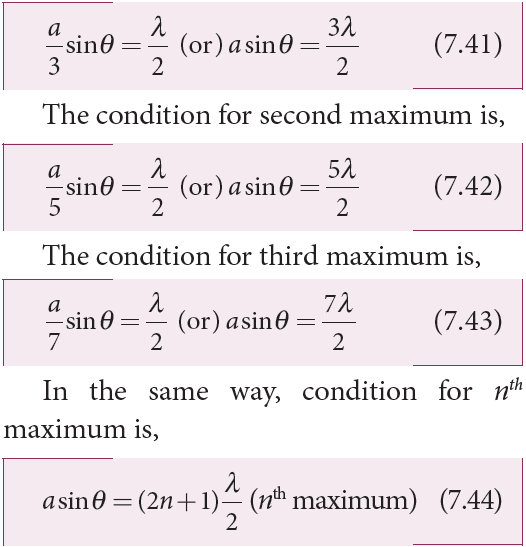
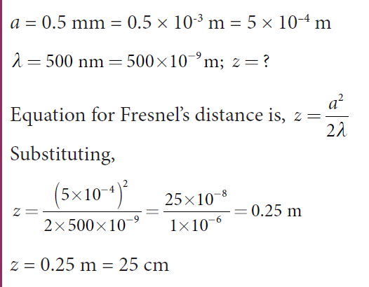

[comment]: <> (katex Header)

# DIFFRACTION

Diffraction is a characteristic of all waves, including sound waves. **_Diffraction_ is bending of waves around sharp edges into the geometrically shadowed region.**

**Table 7.1 Difference between Fresnel and Fraunhofer diffractions**

|**S.No.**| **Fresnel diffraction**| **Fraunhofer diffraction**|
|-------|-------------|-------------|
|1 | Spherical (or) cylindrical wavefront undergoes diffraction | Plane wavefront undergoes diffraction|
|2 | Light wave is from a source at finite distance  | Light wave is from a source at infinity  |
|3| Convex lenses need not be used for laboratory conditions| Convex lenses are to be used in laboratory conditions |
|4| Difficult to observe and analyse| Easy to observe and analyse |
|5| | |

This is a violation to the rectilinear propagation of light we have studied in ray optics. But, the diffraction is prominent only when the size of the obstacle is comparable to the wavelength of light. This is the reason why sound waves get diffracted prominently by obstacles like doors, windows, buildings etc. The wavelength of sound wave is large and comparable to the geometry of these obstacles. But the diffraction in light is more pronounced when the obstacle size is of the order of wavelength of light.

## Fresnel and Fraunhofer diffractions

Based on the type of wavefront which undergoes diffraction, it could be classified as Fresnel and Fraunhofer diffractions. The differences between Fresnel and Fraunhofer diffractions are shown in Table 7.1.
As Fraunhofer diffraction is easy to observe and analyse, let us take it up for further discussions.

## Diffraction in single slit

Let a parallel beam of light (plane wavefront) fall normally on a single slit AB of width _a_ as shown in Figure 7.17. The diffracted beam falls on a screen kept at a distance _D_ from the slit. The center of the slit is _C_. A straight line through _C_ perpendicular to the plane of slit meets the center of the screen at _O_. Consider any point _P_ on the screen. All the light reaching the point _P_ from different points on the slit make an angle _θ_ with the normal _CO_.

All the light waves coming from different points on the slit interfere at point _P_ (and other points) on the screen to give the resultant intensities. The point _P_ is in the geometrically shadowed region, up to which the central maximum is spread due to diffraction as shown Figure 7.17. We need to give the condition for the point _P_ to be of various minima.

**Figure 7.17 Diffraction at single slit**
 

The basic idea is to divide the slit into even number of smaller parts. Then, add their contributions at _P_ with the proper path difference to show that destructive interference takes place at that point to make it minimum. To explain maximum, the slit is divided into odd number of parts.

_Condition for P to be first minimum_ Let us divide the slit _AB_ into two halves _AC_ and _CB_. Now the width of each part is _a_/2. We have different points on the slit which are separated by the same width _a_/2 called as _corresponding points._ This is shown in Figure 7.18.

**Figure 7.18Corresponding points**

The light waves from different corresponding points meet at point P and interfere destructively to make it a minimum. The path difference _δ_ between the waves from these corresponding points is, _d q_\=
_Condition for P to be second minimum_ Let us divide the slit _AB_ into four equal parts. Now, the width of each part is _a_/4. We have several corresponding points on the slit which are separated by the same width _a_/4. The path difference _δ_ between the waves from these corresponding points is, _d q_\=
The condition for P to be second
Formulas 
_Condition for P to be third minimum_ The same way the slit is divided in to six equal parts to explain the third minimum. The condition for _P_ to be third minimum is, _a_ 6 2
Formulas 
_Condition for P to be nth minimum_ Dividing the slit into 2_n_ number of (even number of) equal parts makes the light produced by one of the corresponding points to be cancelled by its counterpart. Thus, the condition for _n_th minimum is, 
Formulas 

_Condition for maxima_ For points of maxima, the slit is to be divided in to odd number of equal parts so that one part remains un-cancelled making the point P appear bright.

The condition for first maximum is,

 
The central maximum is called 0th order maximum. The points of the maximum intensity lie nearly midway between the successive minima.

---
**Note**
Here, sin _θ_ gives the angular spread of the diffraction from the central reference line. We can replace sin _θ_ in the above equations with . It is possible because _θ_ is small. Now, we can approximate, Where, _y_ is the position of minimum (or) maximum on the screen from its center and _D_ is the distance between the slit and the screen.

---
**EXAMPLE 7.9**

Light of wavelength 500 nm passes through a slit of 0.2 mm wide. The diffraction pattern is formed on a screen 60 cm away. Determine the, (a) angular spread of central maximum (b) the distance between the central maximum and the second minimum.

**_Solution_** 

$$\lambda = 500 \, \text{nm} = 500 \times 10^{-9} \, \text{m}
$$
$$a = 0.2 \, \text{mm} = 0.2 \times 10^{-3} \, \text{m}$$
$$D = 60 \, \text{cm} = 60 \times 10^{-2} \, \text{m}$$

(a) Equation for diffraction minimum is, $$a \sin \theta = n \lambda$$

(b) To find the value of _y_1 from the central maximum, which is spread up to first minimum with (_n_ = 1), _a_ sin _θ_ = _λ_
Formulas 
To find the value of _y_2 for second minimum with (_n_ = 2), asinθ = 2λ
Formulas 
The distance between the central maximum and second minimum is, 

_Note_: The above calculation shows that the diffraction pattern produced by a single slit, has equal widths of maxima. Only the width of central maximum is double as it is spread on both the sides. But, the intensity falls rapidly for higher order diffraction fringes.

**EXAMPLE 7.10**
A monochromatic light of wavelength 5000 Å passes through a single slit producing diffraction pattern for the central maximum as shown in the figure. Determine the width of the slit.
**_Solution_** 
_λ_ = 5000 Å = 5000×10-10 m; $$\sin 30^\circ
 = 0.5;$$ _n_ = 1; _a_ =?

Equation for diffraction minimum is, asin _θ_ = _nλ_
The central maximum is spread up to the first minimum. Hence, _n_ = 1

## Discussion on first minimum

The equation for first minimum in single slit diffraction is, a sin _θ_ = _λ_. The angular spread for its  first minimum in the diffraction pattern is, Formulas The central maximum is found in between these first minima that occur on both the sides. We can discuss the following cases on the central maximum. 
(i) If _a_ < _λ_, then sin _θ_ > 1 which is not possible.Hence, diffraction does not take place. 
(ii) If _a_ = _λ_, then sin _θ_ = 1 i.e. _θ_ = 90o. The first minimum is at 90o. Hence, the central maximum spreads fully into the geometrically shadowed region leading to the bending of the diffracted light by 90o.
(iii) If _a_ > _λ_ and also comparable to _λ_, say _a_ = 2λ, then sin ;_q l l l_
Formulas 
The diffraction is observed with a measurable spread. Hence, it is concluded that for observing the diffraction pattern, essentially the width of the slit _a_ must be just few times greater than the wavelength of light _λ_.  
(iv) If _a_ >> _λ_, then sin _θ_ << 1 i.e. The first minimum falls within the width space of the slit itself. Hence, the phenomenon of diffraction is not observed at all.

## Fresnel’s distance

The rectilinear propagation of light is violated as there is bending of light in diffraction. But, this bending is not seen till the diffracted ray crosses the central maximum at a distance _z_ from the slit as shown in Figure 7.19. Hence, **Fresnel’s distance is the distance upto which the ray optics is obeyed and beyond which the ray optics is not obeyed; but, the wave optics becomes significant.**

After rearranging, we get Fresnel’s distance _z_ as,

**EXAMPLE 7.11**

Calculate the distance upto which ray optics is a good approximation for light of wavelength 500 nm falls on an aperture of width 0.5 mm.

**_Solution_** 

Equation for Fresnel’s distance is,

Formulas 

## Difference between interference and diffraction

It is difficult to find the difference between interference and diffraction as they both exhibit the wave nature of light. In both the phenomena, interference of light only produces maxima and minima on the screen and the diffraction of light only spreads light in the geometrically shadowed region. Nevertheless, in interference, the superposition is given importance and in diffraction, the bending of light is given importance. The difference between interference and

**Table 7.2 Difference between interference and diffraction**

| **S.No.** | **Interference**                       | **Diffraction**                                    |
|-----------|----------------------------------------|----------------------------------------------------|
| 1         | Equally spaced bright and dark fringes | Central bright is double the size of other fringes |
| 2         | Equal intensity for all bright fringes | Intensity falls rapidly for higher order fringes   |
| 3         | Large number of fringes are obtained   | Less number of fringes are obtained                |

diffraction based on the appearance of their patterns are given in Table 7.2.

## Diffraction in grating

A grating has multiple slits with equal widths of comparable size to the wavelength of diffracting light. A grating is a plane sheet of transparent material on which opaque rulings are made. A modern commercial grating contains about 6000 lines per centimetre. The transparent space between the rulings act as slit of width _a_ and the rulings act as obstacles having a definite width _b_. **The combined width of a slit and a ruling is called _grating element_** _**e**,_ **(_e_ = _a_ + _b_)**. **The points on the slit separated by a distance equal to the grating element are called _corresponding points_.**

**Figure 7.20 Diffraction grating** experiment

A plane transmission grating is represented as _AB_ in Figure 7.20. Let, a plane and diffraction Diffraction Central bright is double the size of other fringes Intensity falls rapidly for higher order fringes Less number of fringes are obtained wavefront of monochromatic light with wavelength _λ_ be incident on the grating. As the width of the slit is comparable to that of wavelength, the incident light undergoes diffraction.

A diffraction pattern is obtained on the screen when the diffracted waves are focused on a screen using a convex lens. Let us consider a point _P_ at an angle _θ_ with the perpendicular drawn from the center of the grating to the screen. The path difference _δ_ between the diffracted waves from one pair of adjacent corresponding points is,

_δ_ \= (_a_ \+ _b_) sin_θ_ (7.46)

This path difference is the same for any pair of adjacent corresponding points. The point _P_ on the screen will be maximum when,

_δ_ = _m_ _λ_ where _m_ = 0, 1, 2, 3 (7.47)

Combining the above two equations, we get,

 (_a_ \+ _b_) sin_θ_ = _m λ_ 

Here, m is called order of diffraction maximum. _Condition for P to be zeroth maximum, m = 0_

Now, (_a_+_b_) sin_θ_ = 0 thus, sin_θ_ = 0, its position, _θ_ = 0. This is called zeroth diffraction (or) central maximum. It is formed at an angle 0.

_Condition for P to be first maximum, m = 1_ Now, (_a+b_) sin_θ_1 = _λ_. The first maximum is obtained at an angle _θ_1.

_Condition for P to be second maximum, m = 2_ Now, (_a+b_) sin_θ_2 = 2_λ_. The second maximum is obtained at an angle _θ_2.

_Condition for P to be mth maximum_ On either side of central maximum, different higher order diffraction maxima are formed at different angular positions.   If we take,
Formulas 
Then, _N_ gives the number of grating elements or rulings drawn per unit width of the grating. Normally, this number _N_ is specified on the grating itself. Now, the equation becomes,
Fomrulas 

---
**Note**
The students should remember that in a single slit experiment, the formula, _a_ sin_θ_ = n_λ_ is condition for minimum with n as order of minimum. But in the grating experiment, the formula, sin_θ_ = _Nmλ_ is condition for maximum with _m_ as the order of diffraction.

---
**EXAMPLE 7.12**

A diffraction grating consists of 4000 slits per centimeter. It is illuminated by a monochromatic light. The second order diffraction maximum is produced at an angle of 30°. What is the wavelength of the light used?

**_Solution_** 

Number of lines = 4000 cm–1; _m_ = 2;
_θ_ = 30°; _λ_ = ?
Number of lines per unit length,
Equation for diffraction maximum for grating is, sin_θ_ = _Nmλ_
After rewriting, _l q_ \=
sin _Nm_
Substituting,
Formulas 
**EXAMPLE 7.13**

A monochromatic light of wavelength of 500 nm strikes a grating and produces fourth order maximum at an angle of 30°. Find the number of slits per centimeter.

**_Solution_** _λ_ = 500 nm = 500×10-9 m; _m_ = 4;

_θ_ = 30°; number of lines per cm = ?

Equation for diffraction maximum for grating is, sin _θ_ = _Nm λ_

Rewriting, 

A compact disc (CD) always side which looks shining, there ar comparable to the wavelength of vi after the reflection of incident wh

tracks act as reflecting grating.  

## Experiment to determine the wavelength of monochromatic light

The wavelength of a spectral line can be very accurately determined with the help of a plane transmission grating. For that we need to use an instrument called spectrometer (Refer 7.6.6). After preliminary adjustments, the slit of collimator is illuminated by a monochromatic light, whose wavelength is to be determined. The telescope is brought in line with collimator to view the image of the slit. The given grating is then mounted on the prism table with its plane perpendicular to the incident beam of light coming from the collimator. The telescope is turned to one side until the first order diffraction image of the slit is seen. The reading of the position of the telescope is noted.

Similarly, the first order diffraction image on the other side is captured and the reading is noted. The difference between two readings gives 2_θ_. Half of its value gives _θ_. The angle for first order maximum is shown in Figure 7.21. The wavelength of light is calculated from the equation,

appears colourful. On the read/writable e many narrow circular tracks with widths sible light. Hence, the diffraction takes place ite light to give colourful appearance. The
Formulas 
Here, _N_ is the number of rulings per metre in the grating and _m_ is the order of the diffraction image.

**Figure 7.21 Determination of wavelength using grating**

## Determination of wavelength of different colours

The diffraction pattern for white light consists of a white central maximum and continuous coloured diffraction pattern on its both sides. The central maximum is white as all the colours constructively meet at centre with no path difference. As _θ_ increases, the path difference fullfills the condition for maxima of different orders for all colours from violet to red. It produces a spectrum of diffraction pattern from violet to red on either side of central maximum as shown in Figure 7.22. By measuring the angle at which these colours appear for various orders of diffraction, the wavelength of different colours could be calculated using the formula given by equation (7.51),

Here, _N_ is the number of rulings per metre in the grating and _m_ is the order of the diffraction image.
**Figure 7.22 Diffraction with white light**

## Resolution

The effect of diffraction has an adverse effect in the sharpness of the image formed. There is always a spread of central maximum in the image for every point of the object, for every point of the object acts as a point source. The condition for central maximum (or first minimum) produced by rectangular slit is given by the equation (7.37).
But, a circular slit (aperture) produces diffraction pattern of concentric circles as shown in Figure 7.23. These are known as Airy’s discs. Most of the optical instruments form images of objects only through the circular slits. The condition for central maximum (or) first minimum for circular slit is,

_a_ sin_θ_ = 1.22 _λ_ (7.52)

Here, the numerical value 1.22 appears in the expression for central maximum (or) first minimum formed by circular slits. This involves higher level mathematics that is not shown here.

For small angles, sin _θ_ ≈ _θ,_ the above equation becomes,
Rewriting further,
From the geometry, _q_ \= _r f_ 0 Substituting for _θ_ in equation (7.53) and rearranging gives

For example, let two point-sources of light close to each other form image on a screen. The diffraction pattern of one point-source may overlap with another and produce a blurred image (or) un- resolved image as shown in Figure 7.24(a). To obtain a quality image (or) well resolved image, the two point-sources must be kept apart in such a way that their diffraction patterns do not overlap as shown in Figure 7.24(c).
**According to _Rayleigh’s criterion_, the two points on an image are said to be just resolved when the central maximum of one diffraction pattern coincides with the first minimum of the other and vice-versa** as shown in Figure 7.24(b). In other words, the distance between the two central maxima must be at least _ro_. Hence, _ro_ is called **_spatial resolution_** given by the equation (7.54) and the corresponding _θ_ is said to be **_angular resolution_** given by the equation (7.53) respectively. It shows that for better resolution, the wavelength of light used must be as small as possible and the size of the aperture of the instrument must be as large as possible.

The ability of an optical instrument to distinguish the two closely adjacent objects (or) two points on the same object is said to be the resolving power of the instrument. In general, the term resolution is pertaining to the quality of the image and the term resolving power is associated with the ability of the optical instrument. Resolution and resolving power are reciprocal of each other.

**EXAMPLE 7.14**

The optical telescope in the Vainu Bappu observatory at Kavalur has an objective lens of diameter 2.3 m. What is its angular resolution if the wavelength of light used is 589 nm?

**_Solution_** 

_a_ = 2.3 m; _λ_ = 589 nm = 589×10-9 m; _θ_ = ?

The equation for angular resolution is,
Substituting,
Formulas 

_Note_: The angular resolution of human eye is approximately, 3 10 4× − rad ≈ 1.03'.

