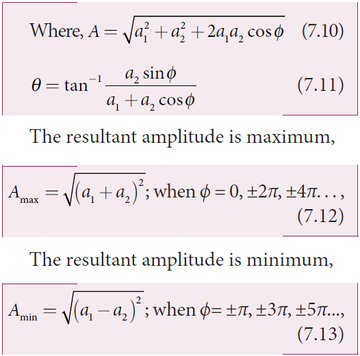
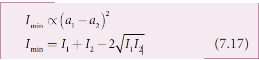
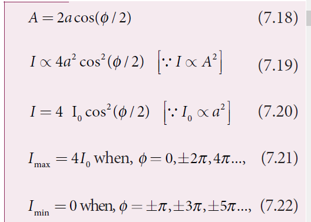
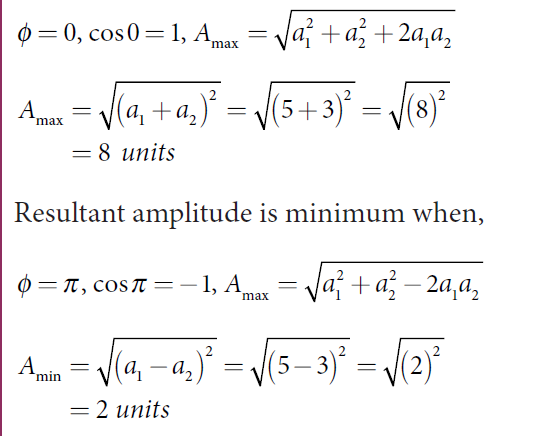

[comment]: <> (katex Header)

# INTERFERENCE

**The phenomenon of superposition of two light waves which produces increase in intensity at some points and decrease in intensity at some other points is called _interference_ of light.**

Superposition of waves refers to addition of waves. The concept of superposition of mechanical waves is studied in (XI Physics 11.7). When two waves simultaneously pass through a particle in a medium, the resultant displacement of that particle is the vector addition of the displacements due to the individual waves. The resultant displacement will be maximum or minimum depending upon the phase difference between the two superimposing waves. These concepts hold good for light as well.

Let us consider two light waves from the two sources S1 and S2 meeting at a point P as shown in Figure 7.6.

The wave from S1 at an instant t at P is,
 y_1 = a_1 \sin(\omega t)     (7.6)    

 y_2 = a_2 \sin(\omega t + \phi)   (7.7)

The two waves have different amplitudes
a1 and a2, same angular frequency ω, and a
phase difference of ϕ between them. The
resultant displacement will be given by,

 y=y_1+y_2 = a_1 \sin(\omega t) + a_2 \sin(\omega t + \phi) 

The simplification of the above equation by using trigonometric identities as done in (XI Physics 11.7) gives,


y = A \sin(\omega t + \theta) 

 
The intensity of light is proportional to square of amplitude,

Now, squaring equation (7.10) on both sides,

I \propto A^2

In equation (7.15) if the phase difference, _ϕ_ = 0, ±2_π_, ±4_π_. . . , it corresponds to the condition for maximum intensity of light called **_constructive interference_**.

The resultant maximum intensity is,

  

In equation (7.15) if the phase difference, _ϕ_ = ±_π_, ±3_π_, ±5_π_. . . , it corresponds to the condition for minimum intensity of light called **_destructive interference_**.

The resultant minimum intensity is,
   

As a special case, if a1 = a2 = a, then equation (7.10). becomes,

 
{A} = \sqrt{2a^2 + 2a^2 \cos \phi} = \sqrt{2a^2(1 + \cos \phi)} = \sqrt{2a^2 \cos^2\left(\frac{\phi}{2}\right)}
 

  

We conclude that the phase difference _ϕ_, between the two waves decides the intensity of light at that point where the two waves meet.

**EXAMPLE 7.2**

Two light sources with amplitudes 5 units and 3 units respectively interfere with each other. Calculate the ratio of maximum and minimum intensities.

**_Solution_** 

Amplitudes, a1 = 5, a2 = 3

Resultant amplitude,
 
A = \sqrt{a_1^2 + a_2^2 + 2a_1a_2\cos \phi}
 

Resultant amplitude is maximum when,
 

 
I \propto A^2
 
 
\frac{I_{\text{max}}}{I_{\text{min}}} = \left(\frac{A_{\text{max}}}{A_{\text{min}}}\right)^2 
Substituting,
 
\frac{I_{\text{max}}}{I_{\text{min}}} = \left(\frac{8}{2}\right)^2 = \frac{64}{4} = 16 (or)


{I_{\text{max}}}:{I_{\text{min}}} = 16:1


## Phase difference and path difference

Phase is the angular position of vibration when a wave is progresses, there is a relation between the phase of the vibration and the path travelled by the wave. We can express the phase in terms of path and vice versa. In the path of the wave, one wavelength _λ_ corresponds to a phase of 2_π_ as shown in Figure 7.7. A path difference _δ_ corresponds to a phase difference _ϕ_ as given by the equation,

**Figure 7.7** Path difference and phase difference 
formula ,
For constructive interference,  the phase
difference should be, ϕ = 0, 2π, 4π . . .Hence,
the path difference must be, _δ_ = 0, _λ_, 2_λ_ . . . In general, the integral multiples of _λ_.

_δ_ = _nλ_ where, _n_ = 0, 1, 2, 3 . . . (7.24)

For destructive interference, the phase difference should be, _ϕ_ \= _π_, 3_π_, 5_π_ . . . Hence, the path difference must be, _d l l_ \=

In general, the half integral multiples of _λ_.

Formulas 
**EXAMPLE 7.5**

The wavelength of a light is 450 nm. How much phase it will differ for a path of 3 mm?

**_Solution_**

Wavelength, _l_ \= = × −450 450 10 9nm m

Path difference, _d_ \= = × −3 3 10 3mm m

Relation between phase difference and

path difference, _f p l_

_d_\= × 2

Substituting,
formulas,
## Coherent sources

**Two light sources are said to be coherent if they produce waves which have same phase or constant phase difference, same frequency or wavelength (monochromatic), same waveform and preferably same amplitude.** Coherence is a property of waves that enables to obtain stationary interference patterns.
Two independent monochromatic sources can never be coherent, because they may emit waves of same frequency and same amplitude, but not with same phase. This is because, atoms while emitting light, produce change in phase due to thermal vibrations. Hence, these sources are said to be incoherent sources.

To obtain coherent light waves, we have the following three techniques.

(i) Wavefront division

(ii) Intensity (or) Amplitude division

(iii) Source and Images.

**(i) Wavefront division**: This is the most commonly used method for producing coherent sources. We know a point source produces spherical wavefronts. All the points on the wavefront are at the same phase. If two points are chosen on the wavefront by using a double slit, the two points will act as coherent sources as shown in Figure 7.8.

**Figure 7.8**  Wavefront division

**(ii) Intensity (or) Amplitude division**: If we allow light to pass through a partially silvered mirror (beam splitter), both reflection and refraction take place simultaneously. As the two light beams are obtained from the same light source, the two divided light beams will be coherent beams. They will be either in-phase or at constant phase difference as shown in Figure 7.9. Instruments like Michelson’s interferometer, Fabray-Perrot etalon work on this principle.

**(iii) Source and Images**: In this method a source and its images will act as a set of coherent sources, because the source and its image will have waves in-phase (or) constant phase difference as shown in Figure 7.10. The Instrument, Fresnel’s biprism uses two virtual images of the source as two coherent sources and the instrument, Lloyd’s mirror uses a source and its one virtual image as two coherent sources.  

## Double slit as coherent sources

Double slit uses the principle of wavefront division. Two slits _S_1 and _S_2 illuminated by a single monochromatic source _S_ act as two coherent sources. The waves from them travel in the same medium and superpose. The constructive and destructive interference formed by them are shown in Figure 7.11(a). The crests of the waves are shown by thick continuous lines and troughs are shown by broken lines in Figure 7.11(b).

At points where the crest of one wave meets the crest of the other wave (or) the trough of one wave meets the trough of the other wave, the waves are in-phase. Hence, the displacement is maximum and these points appear bright as a result of this **_constructive interference_**.

At points where the crest of one wave meets the trough of the other wave and vice-versa, the waves are out-of-phase. Hence, the displacement is minimum and these points appear dark as a result of this **_destructive interference_**.

On a screen the intensity of light will be alternative maximum and minimum strips i.e. bright and dark bands which are referred as interference fringes.

##  Young’s double slit experiment

_Experimental setup_ Thomas Young, a British Physicist in 1801 used an opaque screen with two small openings called double slit S1 and

S2 kept equidistance from a source _S_ as shown in Figure 7.12. The width of each slit is about 0.03 mm and they are separated by a distance of about 0.3 mm. As S1 and S2 are equidistant from S the same wavefront is cut by S1 and S2. The light waves at _S_1 and _S_2 are in-phase. So, S1 and S2 act as coherent sources which is the requirement for obtaining interference pattern.

Wavefronts from _S_1 and _S_2 spread out and overlap on the other side of the double slit. When a screen is placed at a distance of about 1 m from the slits, alternate bright and dark fringes which are equally spaced appear on the screen. These are called interference fringes (or) bands. Using an eyepiece, the fringes can be seen directly. At the center point _O_ on the screen, the waves from _S_1 and _S_2 travel equal distances and arrive in-phase as shown in Figure 7.12. These two waves constructively interfere and a bright fringe is observed at _O_. This is called central bright fringe. When one of the slits is closed, the fringes disappear and there is uniform illumination on the screen. This shows clearly that the bands are due to interference.

_Equation for path difference_ 

The schematic diagram of the experimental setup is shown in Figure 7.13. Let d be the distance between the double slits _S_1 and _S_2 which act as coherent sources of wavelength _λ_. A screen is placed parallel to the double slit at a distance _D_ from it. The mid-point of _S_1 and _S_2 is _C_ and the mid-point of the screen _O_ is equidistant from _S_1 and _S_2\. _P_ is any point at a distance _y_ from _O_. The waves from _S_1 and _S_2 meet at _P_ either in-phase or out-of-phase depending upon the path difference between the two waves.

**FIgure 7.13 Young’s double slit arrangement to find path difference**
The path difference _δ_ between the light waves from _S_1 and _S_2 to the point _P_ is, _δ_ = _S_2_P_ – _S_1_P_
A perpendicular is dropped from the point _S_1 to the line _S_2_P_ at _M_ to find the path difference more precisely.

_δ_ = _S_2_P_ – _MP_ = _S_2_M_ (7.26)

The angular position of the point _P_ from _C_ is _θ_. ∠_OCP_ = _θ_.
From the geometry, the angles ∠_OCP_ and ∠_S_2_S_1_M_ are equal.

∠_OCP_ = ∠_S_2_S_1_M_ = _θ_. 

In right angle triangle ∆_S_1_S_2_M_, the path difference, _S_2_M_ = _d_ sin _θ_

_δ_ = _d_ sin _θ_ (7.27)  

If the angle _θ_ is small, sin _θ_ ≈ tan _θ_ ≈ _θ_
From the right angle triangle ∆_OCP_,
tan_q_ \= _y D_

The path difference, _d_ \= _d y D_

(7.28)

Based on the condition of the path difference, the point _P_ may have a bright (or) dark fringe.

_Condition for bright fringe (or) maxima_ The condition for the point _P_ to have a

constructive interference (or) be a bright fringe is, Path difference, _δ_ = _nλ_ where, _n_ = 0, 1, 2, . . . 
This is the condition for the point _P_ to have a bright fringe. The distance _yn_ is the distance of the _n_th bright fringe from the point _O_.

_Condition for dark fringe (or) minima_ The condition for the point _P_ to have a destructive interference (or) be a dark fringe is, Path difference, _d l_ \= −( )2 1

This is the condition for the point P to have a dark fringe. The distance _yn_ is the distance of the _n_th dark fringe from the point _O_. The formation of bright and dark fringes is shown in Figure 7.14.

  
 **Figure7.14 Formation of bright and dark fringes**

This shows that on the screen, alternate bright and dark fringes are seen on either side of the central bright fringe. The central bright is referred as 0th bright followed by 1st dark and 1st bright and then 2nd dark and 2nd bright and so on, on either side of _O_ successively as shown in Figure 7.15.

**Figure 7.15. Interference fringe pattern**

_Equation for bandwidth_ 

**The _bandwidth_ _β_ is defined as the**

**distance between any two consecutive bright (or) dark fringes.**
The distance between (_n_+1)th and _n_th consecutive bright fringes from _O_ is given by,
Formulas 
Similarly, the distance between (_n_+1)th and _n_th consecutive dark fringes from _O_ is given by,
Formulas 

From Equations (7.31) and (7.32) we understand that the bright and dark fringes are of same width equally spaced on either side of the central bright fringe.

_Conditions for obtaining clear and broad interference fringes:_ 

(i) The distance _D_ between the screen and double slit should be as large as possible. 
(ii) The wavelength _λ_ of light used must be as long as possible. 
(iii) The distance _d_ between the two slits must be as small as possible.

**EXAMPLE 7.6**

In Young’s double slit experiment, the two slits are 0.15 mm apart. The light source has a wavelength of 450 nm. The screen is 2 m away from the slits.

(a) Find the distance of the second bright fringe and also third dark fringe from the central maximum.

(b) Find the fringe width.

(c) How will the fringe pattern change if the screen is moved away from the slits?

(d) What will happen to the fringe width if the whole setup is immersed in water of refractive index 4/3.
**_Solution_** 
_d_ = 0.15 mm = 0.15× 10-3 m; _D_ = 2 m; _λ_ = 450 nm = 450 × 10-9 m; _RI_ = 4/3

(a) Equation for _n_th bright fringe,
Formulas 
Distance of 2nd bright fringe,
FOrmuals 
32 450 10 2 0 15 10

Equation for _n_th dark fringe,
FOrmulas 
Distance of 3rd dark fringe,
FOrmulas 
(b) Equation for fringe width, _b l_ \=
Formulas 
(c) The fringe width will increase as D is
Formulas 
(d) The fringe width will decrease as the setup is immersed in water of refractive index 4/3
Formulas 

## Interference in white light (polychromatic light)

When a white light (polychromatic light) is used in interference experiment, coloured fringes of varied thickness will be formed on the screen. This is because, different colours have different wavelengths. However, the central fringe (or) 0th fringe will always be bright and white in colour, because all the colours falling at the point _O_ will have no path difference with each other. Hence, only constructive interference is possible at _O_ for all the colours.

**EXAMPLE 7.7**

Lights of two wavelengths 560 nm and 420 nm are used in Young’s double slit experiment. Find the least distance from the central fringe where the bright fringes of the two wavelengths coincide. Given _D_ = 1 m and _d_ = 3 mm.

**_Solution_** 
Formulas 

Thus, the 3rd bright fringe of _λ_1 and 4th bright fringe of _λ_2 coincide at the least distance y.

The least distance from the central fringe where the bright fringes of the two wavelengths coincides is, _y n D_
Formulas 

---
**Do You Know ?**
Dazzling colours are exhibited water and also by soap bubbles as to interference of white light unde the bottom surfaces of thin films. Tfilm, refractive index of the film and also the enters into the film, again gets divided at the lower surface into two parts; one is transmitted out of the film and the other is reflected back into the film. The reflected as well as refracted parts are further formed as multiple reflections take place inside the film. The interference occurs in both the reflected and transmitted light.

---

## Interference in thin films

Let us consider a thin film of transparent material of refractive index _µ_ (here refractive index is not represented as _n,_ not to confuse with order of fringe _n_) and thickness _d._ A parallel beam of light is incident on the film at an angle _i_ as shown in Figure 7.16. The wave is divided into two parts at the point of incidence, as reflected and refracted lights. The refracted part, which

_For transmitted light_ 

The light transmitted may interfere to produce a resultant intensity. Let us consider the path difference between the two light waves transmitted from _B_ and _D_. The two waves moved together and remained in phase by thin films of oil spread on the surface of shown in the figure. These colours are due rgoing multiple reflections from the top and he colour depends upon the thickness of the angle of incidence of the light.

up to _B_ where the splitting occurred. The extra path travelled by the wave transmitted from _D_ is the path inside the film, _BC_ + _CD_. If we approximate the incidence to be nearly normal (_i_ = 0) and the flim of small thickness, then the points _B_ and _D_ are very close to each other. The extra distance travelled by the wave is approximately twice thickness of the film, _BC_ + _CD_ = 2_d_. As this extra path is traversed inside the medium of refractive index _µ_, the optical path difference is, _δ_ = 2_µd_.

The condition for constructive interference in transmitted ray is,

$$
2 \mu d = n \lambda $$ (7.33)

Similarly, the condition for destructive interference in transmitted ray is,

_For reflected light_ 

It is experimentally and theoretically proved that a wave while travelling in a rarer medium and getting reflected by a denser medium, undergoes a phase change of π. Hence, an additional path difference of λ/2 should be considered for reflected light.

Let us consider the path difference between the light reflected by the upper surface at Aand the other coming out at C after passing through the film. The additional path travelled by the light coming out from C is the path inside the film, AB+ BC. For near normal incidence and film of small thickness, this distance could be approximated as, AB + BC = 2d. As this extra path is travelled in the medium of refractive index µ, the optical path difference is, δ = 2_µd_.

The condition for constructive interference for reflected ray is,
The additional path difference λ/2 is due to the phase change of πin rarer to denser reflection taking place at A.

The condition for destructive interference for reflected ray is,

---
**Note**
If the incidence is not nearly normal but at an angle of incidence i which has an angle of refraction r, then the expression 2µd is to be replaced with 2µdcosr.

---
**EXAMPLE 7.8**

Find the minimum thickness of a film of refractive index 1.25, which will strongly reflect the light of wavelength 589 nm. Also find the minimum thickness of the film to be anti-reflecting.

**_Solution_**

$$
\lambda = 589 \, \text{nm} = 589 \times 10^{-9} \text{m}
$$

For the film to have strong reflection, the reflected waves should interfere constructively. The least optical path difference introduced by the film should be λ/2. The optical path difference between the waves reflected from the two surfaces of the film is 2µd. Thus, for strong reflection, 2µd= λ/2  [As given in equation (7.35). with n = 1]

For the film to be anti-reflecting,
the reflected rays should interfere
destructively. The least optical path
difference introduced by the film should
be λ. The optical path difference between
the waves reflected from the two surfaces
of the film is 2μd. For strong reflection,
2μd = λ [As given in equation (7.36). with
n = 1].
