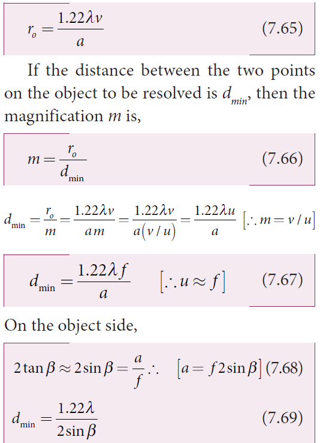
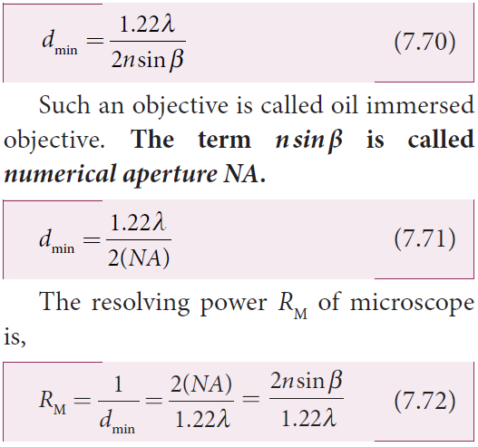
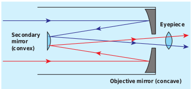

# OPTICAL INSTRUMENTS

There are many optical instruments we used in our daily life. We shall discuss here about microscope, telescope, spectrometer and of course the human eye.

## Simple microscope

A simple microscope is a single magnifying (convex) lens of small focal length which must produce an erect, magnified and virtual image of the object. Hence, the object must be placed within the focal length f (between the points F and P) on one side of the lens and viewed through the other side of it. The nearest point where an eye can clearly see is called the near point and the farthest point up to which an eye can clearly see is called the far point. For a healthy eye, the distance of the near point is 25 cm, which is denoted as D and the far point should be at infinity.

**Near point focusing** 

The eye is least strained when image is formed at near point, i.e. 25 cm. The near point is also called as least distance of distinct vision. This is shown in Figure 7.36. The object distance u should be less than f. The image distance is the near point D. The magnification m of this lens is given by the

We can also write the equation for magnification m in terms of focal length f

**Normal focusing** 

The eye is most relaxed when the image is formed at infinity. The focusing is called normal focusing when the image is formed at infinity. This is shown in Figure 7.37(b). To find the magnification m, if we take the   ratio of the height of image to the height of object mhh, we will not get a meaningful equation, as the image is of infinite size and it is also formed at infinity. Hence, we can practically use the angular magnification. **The angular magnification is defined as the ratio of angle θi subtended by the image with aided eye to the angle θo subtended by the object with unaided eye**.

For unaided eye shown in Figure 7.37(a),

  \tan(\theta) \approx (\theta) =\frac{h}{D} 

(7.62)

For aided eye shown in Figure 7.37(b),
  
This is the magnification for normal focusing.

The magnification for normal focusing is one less than that of near point focusing. But, the viewing is more comfortable in normal focusing than near point focusing. For large values of D/f, the difference between the two magnifications is negligibly small.

**EXAMPLE 7.19**

A man with a near point of 25 cm reads a book which has small print using a magnifying lens of focal length 5 cm. (a) What are the closest and the farthest distances at which he should keep the lens from the book? (b) What are the maximum and the minimum magnification possible?

**Solution** 

D = 25 cm
The magnifying lens must be a convex lens of positive focal length f = 5 cm
For closest object distance u, the image distance v is, –25 cm. (near point, v = –D)
For farthest object distance ′u , the corresponding image distance, ′v is infinity. (a) To find closest distance between lens and book,
The closest distance between the lens and the book is, u = –4.167 cm
**Resolving power of microscope** 
A microscope is used to see the details of the object under observation. Good microscope should not only magnify the object but also resolve the two points on an object which are separated by the smallest distance dmin. Actually, dmin is the resolution and its reciprocal is the resolving power.

The spatial resolution (radius of central maximum) is already derived in equation

  
In microscope, the object distance is just more than the focal length f and the image is formed at distance v as shown in the Figure 7.38. Hence, f in equation (7.54) is replaced by v.

If the distance between the two points on the object to be resolved is dmin, then the magnification m is,
 
To further reduce the value of dmin the optical path of the light is increased by immersing the objective of the microscope into a bath containing oil of refractive index n.

 

## Compound microscope

The diagram of a compound microscope is shown in Figure 7.39. The lens near the object is called as **objective**. It forms a real, inverted and magnified image of the object. This serves as the object for the lens close to the eye called as **eyepiece**. The eyepiece serves as a simple microscope that produces finally an enlarged and virtual image. The first inverted image formed by the objective is to be adjusted within the focus of the eyepiece so that the final image is formed nearly at infinity (or) at the near point. The final image is inverted with respect to the object. 

**Magnification in compound microscope**

The lateral magnification produced by the objective is given by the equation (6.66), 
Here, the distance L is measured between the focal point of the eyepiece to the focal point of the objective. This is called the tube length of the microscope as fo and fe are comparatively smaller than L.

If the final image is formed at the near point, the magnification me of the eyepiece is,
FOrmulas 
**EXAMPLE 7.20**

A microscope has an objective and eyepiece of focal lengths 5 cm and 50 cm respectively with tube length 30 cm. Find the magnification of the microscope in the (a) near point and (b) normal focusing.  

## Astronomical telescope

An astronomical telescope is used to get the magnification of distant astronomical objects like stars, planets, moon etc. The image formed by astronomical telescope will be inverted. It has an objective of long focal length and a much larger aperture than the eyepiece as shown in Figure 7.40. Light from a distant object enters the objective and a real image is formed in the tube at its focal point. The eyepiece magnifies this image producing a final inverted image.

**7.6.3.1 Magnification in astronomical telescope**
The magnification _m_ is the ratio of the angle _β_ subtended by the image to the angle _α_ subtended by the object with the principal axis.
Formulas 
The length of the telescope is approximately,
Formulas 

**EXAMPLE 7.21**

A small telescope has an objective lens of focal length 125 cm and an eyepiece of focal length 2 cm. (a) What is the magnification of the telescope? (b) What is the separation between the objective and the eyepiece? (c) What is the angular separation between two stars when viewed through this telescope if they subtend 1 _'_ for bare eye?

##  Terrestrial telescope

A terrestrial telescope is used to see objects at a long distance on the surface of earth. Hence, image should be erect. Hence, it has an additional erecting lens to make the final image erect as shown in Figure 7.41.

**Figure 7.41 Terrestrial telescope**
##  Reflecting telescope

**Figure 7.42 Reflecting telescope**

Modern telescopes use concave mirrors instead of lenses for the objectives. It is rather difficult and expensive to make lenses of large size which form images that are free from any optical defect. **A telescopes which has a concave mirror objective is called reflecting telescope.** It has several advantages. Only one surface is to be polished and maintained for a mirror where as it to be done for two surfaces for a lens. Support can be given from the entire back of the mirror whereas it is given only at the rim for lens. A mirror weighs much less compared to a lens. But, the one obvious problem with a reflecting telescope is that the objective mirror would focus the light inside the telescope tube. One must have an eye piece inside the tube obstructing some light. This problem could also be overcome by introducing a secondary mirror which would take the light outside the tube for view as shown in the Figure 7.42.

## Spectrometer The spectrometer is an optical instrument

used to analise the spectra of different sources of light, to measure the wavelength of different colours and to measure the refractive indices of materials of prisms. It is shown in Figure 7.43. It basically consists of three parts namely (i) collimator, (ii) prism table and (iii) telescope.

**(i) Collimator** 
The collimator is used for producing parallel beam of light. It has a convex lens and a vertical slit of adjustable width which faces the source. The position of slit can be adjusted so that it is kept at the focus of the lens. The collimator is rigidly fixed to the base.

**(ii) Prism table** 
The prism table is used for mounting the prism, grating etc. It consists of two circular discs provided with three levelling screws. It can be rotated and its position can be read from two verniers V1 and V2 . The prism table can be fixed at any desired height.

**(iii) Telescope** 
The telescope is an astronomical type. It consists of an eyepiece provided with cross wires at one end and an objective at its other end. The distance between the objective and the eyepiece can be adjusted so that the telescope forms a clear image at the cross wires.

The telescope is attached to a circular scale and both can be rotated together. The telescope and prism table are provided with radial screws for fixing them at a desired position and tangential screws for fine adjustments.

**Preliminary adjustments of the spectrometer**

The following adjustments must be done in a spectrometer before doing the experiment. 

**(a) Adjustment of the eyepiece:** The telescope is turned towards an illuminated surface and the eyepiece is moved to and fro until the cross wires are clearly seen.
**(b) Adjustment of the telescope:** The telescope is adjusted to receive parallel rays by focusing it to a distant object to get a clear image on the cross wire.
**(c) Adjustment of the collimator:** The telescope is brought in line with the collimator. The distance between the illuminated slit and the lens of the collimator is adjusted until a clear image of the slit is seen at the cross wire.
**(d) Levelling of the prism table:** The prism table is brought to the horizontal level by adjusting the levelling screws and it is ensured by using sprit level.
  
**7.6.6.1 Determination of refractive index of material of the prism**

The preliminary adjustments of the spectrometer are done. The refractive index of the prism can be determined by measuring the angle of the prism A and the angle of minimum deviation D.

**(i) Angle of the prism A**

**Figure 7.44 Angle of prism**

The prism is placed on the prism table with its refracting angle A facing the collimator as shown in Figure 7.44. The slit is illuminated by sodium light (monochromotic light). The parallel rays coming from the collimator fall on the two faces AB and AC and get reflected. The telescope is rotated to the position T1 and T2 to capture the reflected rays and the two reading are noted.
The difference between these two readings gives the angle rotated by the telescope, which is twice the angle of the prism. Half of this value gives the angle of the prism A.

**(ii) Angle of minimum deviation D** 
The prism is placed on the prism table so that the light from the collimator falls on a refracting face and the refracted image is observed through the telescope as shown in Figure 7.45. The prism table alone is now rotated so that the angle of deviation decreases. A stage comes when the image stops and returns on further rotation of the prism table. This is ensured by looking through the telescope simultaneously. The reading in this position gives the minimum deviation position.

**Figure 7.45 Angle of minimum deviation**
Now, the prism is removed and the telescope is turned to receive the direct ray and the reading is noted. The difference between the two readings gives the angle of minimum deviation D. The refractive index of the material of the prism n is calculated using the using the equation (6.89),
Formulas 
The refractive index of a liquid may be determined in the same way by using a hollow glass prism filled with the liquid.
Formulas 
## The eye

Eye is a natural optical instrument human beings have. As the eye lens is flexible, its focal length can be changed to some extent. When the eye is fully relaxed, its focal length is maximum and when it is strained its focal length is minimum. The image must be formed on the retina for clear vision. The diameter of eye ball for a normal adult is about 2.5 cm. Hence, the distance between eye lens and retina (image distance) is fixed always at 2.5 cm. We can just discuss the optical functioning of eye without giving importance to the refractive indices of the two liquids, aqueous humor and virtuous humor present in the eye. A person with normal vision can see objects kept at infinity in the relaxed condition with a maximum focal length fmax of the eye lens as shown in Figure 7.46(a) and in the strained condition, with a minimum focal length fmin for an object kept at near point D (25 cm) as shown in Figure 7.46(b).

**Figure 7.46 Focusing of normal eye**
Let us find _fmax_ and _fmin_ of human eye from the lens equation (6.63).  
When the object is at infinity, _u_ = –∞, and _v_ = 2.5 cm (distance between eye lens and retina), the eye can see the object in relaxed condition with _fmax_. Substituting these values in the lens equation gives,
FormulA 
When the object is at near point, _u_ = –25 cm and _v_ = 2.5 cm, the eye can see the object in strained condition with _fmin_. Substituting these values in the lens equation gives,
Formulas 
This implies that by varying the focal length of the eye lens by a small value of _fmax_ – _fmin_ = 0.23 cm, a person can see the objects from infinity to the near point. Now, we can discuss some common defects of vision in the eye.

**7.6.7.1 Nearsightedness (_myopia_)** A person suffering from _nearsightedness_

(or) _myopia_ cannot see distant objects clearly. This may be due to the short focal length of the eye lens (or) larger diameter of the eyeball than usual. These people have difficulty in relaxing their eye to the extent of what is needed. Thus, they need correcting lens.

For them, parallel rays coming from the distant object get focused before reaching the retina as shown in Figure 7.47(a). But, these persons can see objects which are nearer. Let _x_ be the maximum distance up to which a person with nearsightedness

can see as shown in Figure 7.47(b). To overcome this difficulty, the virtual image of the object at infinity should be formed at a distance _x_ from the eye using a correcting lens as shown in Figure 7.47(c).

The focal length of the correcting lens for a myopic eye can be calculated using the lens equation (6.63).
Formulas 
Here, _u_ = –∞, _v_ = –_x_. Substituting these values in the lens equation gives,
Focal length _f_ of the correcting lens is, The negative sign in the above result suggests that the correcting lens should be a concave lens. Basically, the concave lens slightly diverges the parallel rays from infinity and makes them fall at the retina.

**Figure 7.47 Myopic eye and correction**
**7.6.7.2 Farsightedness (_hypermetropia_)** 

A person suffering from _farsightedness_ (or) _hypermetropia_ (or) _hyperopia_ cannot see closer object clearly. It occurs when the eye lens has long focal length (or) shortening of the eyeball than usual. The closest distance for clear vision for these people is appreciably more than 25 cm. Thus, reading books (or) viewing smaller things held in the hands is difficult for them. This kind of farsightedness arising mainly due to aging is called _presbyopia._ The aged people cannot strain their eye more to reduce the focal length of the eye lens.

The rays coming from the object at near point get focused beyond the retina as shown in Figure 7.48(a). But, these persons can see objects which are at a distance only beyond 25 cm from the eye. Let _y_ be the minimum distance from the eye beyond which a person with farsightedness can see as shown in Figure 7.48(b). To make this person see on object at 25 cm (near point) a virtual image of the object at 25 cm should be formed at _y_ using a correcting lens as shown in Figure 7.48(c).

The focal length of the correcting lens for a hypermetropic eye can be calculated using the lens equation (6.63).
Here, _u_ = –25 cm, _v_ = –_y_. Substituting these values in the lens equation gives,
Simplifying the above equation for _f_ gives,
The focal length calculated using above formula will be positive as _y_ is always greater than 25 cm. The positive sign of the focal length suggests that the correcting lens should be a convex lens. In principle, the convex lens slightly converges the rays coming from an object beyond _y_ and makes them fall at the retina.

**7.6.6.3 Astigmatism** 

Astigmatism is the defect arising due to different curvatures along different planes in the eye lens. Astigmatic person cannot see in all the directions equally well. The defect due to astigmatism is more serious than myopia and hypermetropia. The astigmatism can be corrected using a lens which has different curvatures in different planes. In general, these specially made glasses with different curvature for different planes are called as cylindrical lenses.

Due to aging people may develop combination of more than one defect. If it is the combination of nearsightedness and farsightedness then, such persons may need a converging glass for reading purpose and a diverging glass for seeing at a distance. Bifocal lenses and progressive lenses provide solution for these kinds of problems.

**EXAMPLE7.22**

Calculate the power of the lens of the spectacles needed to rectify the defect of nearsightedness for a person who could see clearly up to a distance of 1.8 m.

**_Solution_** 

The maximum distance the person could see is, _x_ = 1.8 m. The lens should have a focal length of, _f_ = –_x_ m = –1.8 m. It is a concave (or) diverging lens.

The power of the lens is,
Formulas 

**EXAMPLE 7.23**

A person has farsightedness with the far distance he could see clearly is 75 cm. Calculate the power of the lens of the spectacles needed to rectify the defect.

**_Solution_** 

The minimum distance the person could see clearly is, y = 75 cm.
The lens should have a focal length of,
Formulas 
It is a convex (or) converging lens. The power of the lens is,

**Summary**
- Light has wave as well as particle nature.
- A wavefront is the locus of points which are in the same state or phase of vibration. Huygen’s principle states the method of propagation of wavefront.
- Light propagating as a wavefront. Point source produces spherical wavefront and source at infinity produces plane wavefront.
- Laws of reflection and refraction are proved by Huygens’ principle.
- The phenomenon of addition or superposition of two light waves which produces increase in intensity at some points and decrease in intensity at some other points is called interference of light.
- If interfering lights have equal intensities of I 0 with phase difference ϕ, then
FOrmulas 
- Two light sources are said to be coherent if they produce waves which have same phase or constant phase difference, same frequency or wavelength monochromatic), same waveform and preferably same amplitude.
- Coherent sources are obtained by wavefront division, intensity division and real and virtual images of light source.
- Young’s double slit uses wavefront division to obtain coherent sources.
- In Young’s double slit experiment, the position of y n = th dark fringe
- In Young’s double slit experiment, the position of y n = th Bright fringe
- In Young’s double slit experiment, the position of y n = th bandwidth fringe
- Interference with polychromatic (white) light produces coloured interference fringes.
- Thin films appear coloured due to interference of white light.
- In thins films the equations for constructive and destructive interference for reflected rays are, 2 m d = ( 2 n − 1 ) ; 2µd = nλ respectively.
- Transmitted light are, 2µd = nλ; 2 m d = ( 2 n − 1 )respectively.
- Diffraction is bending of waves around sharp edges into the geometrically shadowed region.
- A spherical wave front undergoes diffraction in Fresnel diffraction.
- A plane wavefront undergoes diffraction in Fraunhofer diffraction.
- The equation for n th minimum in single slit diffraction is, a sin θ = nλ (n th minimum)
- Diffraction can also happen in grating which has multiple slits of thickness comparable to wavelength of light used. 
- Wavelength of monochromatic light and also different colours of polychromatic light can be determined. Using diffraction grating and spectrometer.
- According to Rayleigh’s criterion, for two point objects to be just resolved, the minimum distance between their diffraction images must be in such a way that the central maximum of one coincides with the first minimum of the other and vice versa
- Angular resolution,Formulas 
- Special resolution,Formulas 
- Resolution is measured by the smallest distance which could be seen clearly without
- the blur due to diffraction.
- The phenomenon of restricting the vibrations of light (electric or magnetic field vector) to a particular direction perpendicular to the direction of propagation of wave is called polarization of light.
- If the vibrations of a wave are present in only one direction in a plane perpendicular to the direction of propagation of wave is said to be polarised or plane polarised light.
- The plane containing the vibrations of the electric field vector is known as the plane of vibration.
- The plane perpendicular to the plane of vibration and containing the ray of light is known as the plane of polarisation.
- In plane polarised light the intensity varies from maximum to zero for every rotation of 90° of the analyser.
- In partially polarised light the intensity varies from maximum to minimum for every rotation of 90° of the analyser.
- Nicol prism separates ordinary and extraordinary rays by double refraction.
- Light scattered by molecules at perpendicular direction to the incident light is found to be plane polarised.
- A single convex lens can act as a simple microscope when object is within the focal length.
- In near point focusing, the image is formed at D = 25 cm.
-„ The magnification in near point focusing is, m = 1 +
-„ In normal focusing, the image is formed at infinity, the magnification in normal focusing is, 
-„ The resolving power of microscope is, R
- Magnification in normal focusing in compound microscope is, formula

- The correction lens for nearsightedness/myopic eye should be a concave lens with focal length, f = –x. Where x is the maximum distance upto which an object can be seen.
- The correction lens for farsightedness/hypermetropic eye should be a Formulas 
- The correction lens for nearsightedness/myopic eye should be a concave lens with focal length, f = –x. Where x is the maximum distance upto which an object can be seen.
- The correction lens for farsightedness/hypermetropic eye should be a convex lens with focal length, f = y × 25 cm y − 25 cm . Where, the 25 cm is the near distance and y is the minimum distance upto which an object can be seen. 
- The farsightedness arising due to aging is called presbyopia.
- Astigmatism is the defect arising due to different curvatures along different planes in the eye lens.