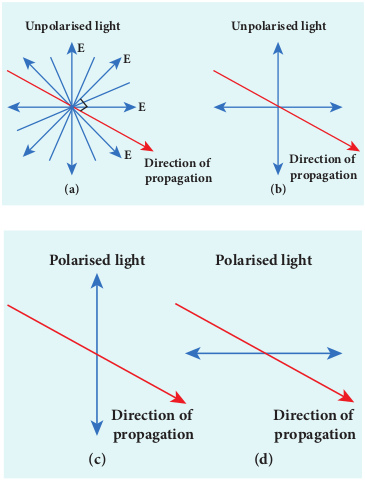
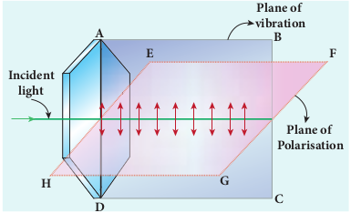
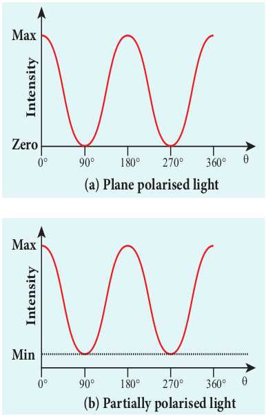
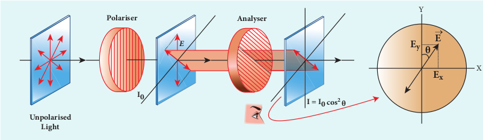
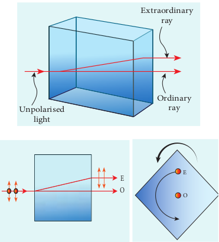
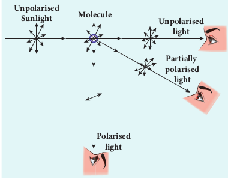

[comment]: <> (katex Header)


# POLARISATION
Both, longitudinal and transverse waves exhibit the phenomena of interference and diffraction. In fact, even sound waves demeonstrate the above two phenomenon. Since light is an electromagnetic wave, it is transverse in nature. The transverse nature of light wave is proved in the phenomenon called polarisation. **The phenomenon of restricting the vibrations of light (electric or magnetic field vectors) to any one direction perpendicular to the direction of propagation of wave is called _polarisation_ of light**. In this lesson the electric field is only considered for discussion.

## Plane polarised light

**An _unpolarised light_ is a transverse wave which has vibrations in all directions in a plane perpendicular to the direction of propagation of wave** as shown in Figure 7.25(a). All these vibrations could be resolved into two normal components as shown in Figure 7.25(b), which still represents unpolarised light. **If the vibrations of a wave are present in only one direction in a plane perpendicular to the direction of propagation, then the light is said to be _polarised_ (or) _plane polarised light_** as shown in Figure 7.25(c) and 7.25(d).

**Figure 7.25 Unpolarised light Unpolarised light Polarised light**

The plane containing the vibrations of the electric field vector is known as the **_plane of vibration_** _ABCD_ as shown in Figure 7.26. The plane perpendicular to the plane of vibration is known as the **_plane of polarisation_** _EFGH_. Both the plane of vibration and the plane of polarisation contain the direction of propagation of light.
The Table 7.3 consolidates few characteristics of polarised and unpolarised light.

## Polarisation Techniques

The polarised light can be obtained from unpolarised light by several techniques. Here, we are discussing the four methods. They are,

(i) polarisation by selective absorption
(ii) polarisation by reflection
(iii) polarisation by double refraction 
(iv) polarisation by scattering.

**Table 7.3 Characteristics of polarised light and unpolarised light**

| **S.No.** | **Polarised light** | **Unpolarised light**|
|---|---|---|
|1| Consists of waves having their electric and magnetic field vibrations in a single plane normal to the direction of ray. | Consists of waves having their electric and magnetic field  vibrations in all directions normal to the direction of ray. |
|2| Asymmetrical about the ray direction. | Symmetrical about the ray direction. |
|3| It is obtained by converting unpolarised light using polaroids.| Produced by conventional light sources.|

## Polarisation by selective absorption

_Selective absorption_ is the property of a material which transmits waves whose electric field vibrations are in a plane parallel to a certain direction of orientation and absorbs all other other vibrations. The polaroids (or) polarisers are thin commercial sheets which make use of the property of selective absorption to produce plane polarised light. Selective absorption is also called as dichroism.

In 1932, an American scientist Edwin Land developed polarisers in the form of sheets. Tourmaline is a natural polarising material. Polaroids are also made artificially. It was discovered that small needle shaped crystals of quinine iodosulphate have the property of polarising light. A number of these crystals with their axes parallel to one another packed in between two transparent plastic sheets serve as a good polaroid. Recently, new types of polaroids are prepared in which thin film of polyvinyl alcohol is used. These are colourless crystals which transmit more light, and give better polarisation.

**7.5.3.1 Polariser and analyser** 

Let us consider an unpolarised beam of light. The vibrations can be in all possible directions perpendicular to the direction of propagation as shown in Figure 7.27. When this light passes through a polaroid P1 the vibrations are restricted to only one plane. The emergent beam can be further passed through another polaroid P2. If the polaroid P2 is rotated by keeping the ray of light as axis, for a particular position of P2 the intensity is maximum. When the polaroid P2 is rotated further, the intensity starts decreasing. There is complete extinction of the light when P2 is rotated through 90o. On further rotating P2, the light reappears and the intensity increases and becomes maximum . The light coming out from polaroid P1 is said to be plane polarised. **The Polaroid (here P1) which polarises the light passing through it is called a polariser. The polaroid (here P2) which is used to examine whether a light is polarised or not is called an analyser**.

If the intensity of the unpolarised light is _I_ then the intensity of polarised light will be _I_ 2  The other half of intensity is restricted by the polariser.

**Figure 7.27** Polariser and analyser

**7.5.3.2 Plane and partially polarised light**

**A light is said to be _plane polarised_ if the intensity varies from maximum to zero for every  rotation of the analyser** as shown in the graph in Figure 7.28(a). This is because the vibrations are allowed in one direction and completely restricted in the perpendicular direction. On the other hand, **if the intensity of light varies between maximum and minimum (not zero) for every
 rotation of the analyser, the light is said to be _partially polarised_ light** as shown in the graph in Figure 7.28(b). This is because the light is not fully restricted in that particular direction which remains as a minimum intensity.

**7.5.3.3 Malus’ law** 

In 1809, French Physicist E.N Malus discovered that when a beam of plane polarised light of intensity $$I_0 $$is incident 

on an analyser, the intensity of light I transmitted from the analyser varies directly as the square of the cosine of the angle _θ_ between the transmission axes of polariser and analyser as shown in Figure 7.29. This is known as Malus’ law.

I = I_0 \cos^2 \theta


The proof of Malus’ law is as follows. Let us consider that the transmission axes of the polariser and the analyser are inclined by an angle _θ_ is as shown in Figure 7.30. Let I be the intensity and _a_ be the amplitude of the electric vector transmitted by the polariser. The amplitude _a_ of the incident light has two rectangular components, acosθ and asinθ which are the parallel and perpendicular components to the axis of transmission of the analyser.

Only the component _a_cos_θ_ will be transmitted by the analyser. The intensity of light transmitted from the analyser is proportional to the square of the component of the amplitude transmitted by the analyser.

The following are few special cases. Case (i) When θ = 0o, cos 0o= 1, I I= 0 When the transmission axis of polariser is parallel to that of the analyser, the intensity of light transmitted from the analyser is equal to the incident light that falls on it from the polariser.

Figure 7.30 Malus’ law

When the transmission axes of polariser and analyser are perpendicular to each other, the intensity of light transmitted from the analyser is zero.

**EXAMPLE 7.15**

Two polaroids are kept with their transmission axes in clined at 30 . Unpolarised light of intensity  Ifalls on the first polaroid. Find out the intensity of light emerging from the second polaroid. oSolutionAs t he in tensity of the unpolarised light falling on the first polaroid is I, the intensity of polarized light emerging from it will be, 
_Solutions_
As the intensity of the unpolarised light falling on the first polaroid is I, the intensity of polarized light emerging from it will be, $$I_{0} = (I/2) $$.Let I' be the intensity of light emerging from the second polaroid.
Malus'law, 
$$I' = I \cos^2(\theta)$$
Substituting,

$$I' = (\frac{I}{2}) \cos^2(30^\circ) =(\frac{I}{2})\left(\frac{\sqrt{3}}{{2}}\right)^2 =I\frac{3}{8}$$

$$I' = (\frac{3}{8})I$$

**EXAMPLE 7.16**

Two polaroids are kept crossed (transmission axes at 90o) to each other.
(a) What will be the intensity of the light coming out from the second polaroid when an unpolarised light of intensity _I_ falls on the first polaroid?
(b) What will be the intensity of light coming out from the second polaroid if a third polaroid is kept in between at 45o inclination to both of them.

**_Solution_** 

a) As the intensity of the unpolarised light falling on the first polaroid is I, the intensity of polarized light emerging from it will be I = (I/2). Let I' be the intensity of light emerging from the second polaroid.

Malus'law, 
$$I' = I \cos^2(\theta)$$
Here is 0is 90° as the transmission axes are perpendicular to each other.

Substituting,

$$I' = (\frac{I}{2}) \cos^2(90^\circ)=0$$[$$\cos^2(90^\circ)=0$$]
No light comes out from the second polaroid.

**7.5.3.4. Uses of polaroids** 

1. Polaroids are used in goggles and cameras to avoid glare of light. 
2. Polaroids are used to take 3D pictures i.e., holography. 
3. Polaroids are used to improve contrast in old oil paintings. 
4. Polaroids are used in optical stress analysis. 
5. Polaroids are used as window glasses to control the intensity of incoming light. 
6. Polarised laser beam acts as needle to read/write in compact discs (CDs). 
7. Polarised light is used in liquid crystal display (LCD).

## Polarisation by reflection

The simplest method of producing plane polarised light is by reflection. Consider a beam of unpolarised light incident on a polished glass surface XY. This light undergoes reflection as well as refraction. As it is unpolarized, it consists of vibrations which are parallel to the reflecting surface (shown as dots) and also not parallel to it (shown as arrows). It is shown in Figure 7.31. For a particular angle of incidence, the reflected light is found to be plane polarised and the refracted light is found to be partially polarised. It is because, the parallel vibrations to the surface are reflected and the other vibrations are refracted. Few parallel vibrations may also get refracted resulting in partially polarised refracted light. **The angle of incidence for which the reflected light is found to be plane polarised is called _polarising angle_** **_ip._**

**Figure 7.31 Polarisation by reflection**

**7.5.4.1 Brewster’s Law** The British Physicist, Sir. David

Brewster found that at the polarising angle, the reflected and the refracted rays are perpendicular to each other. Suppose _ip_ is the polarising angle and rp is the angle of refraction, from the geometry as shown in Figure 7.31, we can write,
 
 $$r_p = 90^\circ - i_p$$  (7.56)
 From Snell's law, the refractive index n of the medium with respect to air is,
 $$\frac{sini_{p}}{sinr_{p}}=n$$(7.57)

Substituting equation (7.56) in (7.57),we get,
$$ \frac{sini_{p}}{sin(90^{\circ}-i_{p})}=\frac{sini_{p}}{cosi_{p}}=n $$$$tan{i_{p}}=n$$(7.58)

This equation is known as _Brewster’s law_. Brewster’s law states that the tangent of the polarising angle for a transparent medium is equal to its refractive index. The polarising angle is known as Brewster’s angle which dependes on the nature of the refracting medium.

**EXAMPLE 7.17**

Find the polarizing angles for (i) glass of refractive index 1.5 and (ii) water of refractive index 1.33.

**_Solution_** 
Brewster's law, $$tani_p =n$$
Forglass,$$tani_p =1.5;i_p=   \tan^{-1}(1.5);i_p = 56.3^\circ
$$Forwater,$$tani_p =1.33;i_p=   \tan^{-1}(1.33);i_p = 53.1^\circ$$

**7.5.4.2 Pile of plates**

Pile of plates makes use of Brewster’s law to convert the partially polarised refracted light into plane polarised light. It consists of several glass plates kept one behind the other at an angle 90° – ip with the horizontal surface as shown in Figure 7.32. This arrangement ensures that the parallel light falls on these plates at ip. When this unpolarised light passes successively through these plates, the few parallel vibrations to the surface which may be present in the refracted light, get a chance for further reflections at the succeeding plates. Thus, both the reflected and the refracted lights are found to be plane polarised

**EXAMPLE 7.18**

What is the angle at which a glass plate of refractive index 1.65 is to be kept with respect to the horizontal surface so that an unpolarised light travelling horizontal after reflection from the glass plate is found to be plane polarised?

**_Solution_** 

n=1.65
Brewster's law, $$tani_p =n$$
$$tani_p =1.65;i_p=   \tan^{-1}(1.65);i_p = 58.8^\circ
$$
The inclination with the horizontal surface is,
$$(90^\circ - 58.8^\circ) = 31.2^\circ$$

## Polarisation by double refraction

Erasmus Bartholinus, a Danish Physicist discovered that **when a ray of unpolarised light is incident on a calcite crystal, two refracted rays are produced. Hence, two images of an object are formed. This phenomenon is called double refraction (or) birefringence as shown in Figure 7.33**. 
This phenomenon is also exhibited by crystals like quartz, mica etc.

When a dot of ink on a sheet of paper is viewed through a calcite crystal, two images will be seen. On rotating the crystal, one image remains stationary and the other rotates around it. The stationary image _O_ is produced by ordinary rays which obey the laws of refraction. The rotating image _E_ is produced by extraordinary rays which do not obey the laws of refraction. The extraordinary ray is found to be plane polarised. Inside a double refracting crystal the ordinary ray travels with same velocity in all directions and the extra ordinary ray travels with different velocities in all directions. A point source inside the crystal produces spherical wavefront for ordinary ray and elliptical wavefront for extraordinary ray. Inside the crystal, there is a particular direction in which both the rays travel with same velocity. This direction is called as _optic axis_. Along the optic axis, the refractive index is same for both the rays and there is no double refraction along this axis.

**Figure 7.33 Double refraction**
### Types of optically active crystals

Crystals like calcite, quartz, tourmaline and ice which have only one optic axis are called uniaxial crystals.
Crystals like mica, topaz, selenite and aragonite which have two optic axes are called biaxial crystals.

### Nicol prism

Nicol prism is an optical device which forms a part of many optical instruments both for producing plane polarised light and also analysing. The construction of a Nicol prism is based on the phenomenon of double refraction. It was designed by William Nicol in 1828.

Nicol prism is a calcite crystal which has a length three times its breadth and angles 72o and 108o. It is cut into two halves along the diagonal as shown in Figure 7.34. The two halves are pasted together with a layer of _canada balsam_, a transparent cement.

**Figure 7.34 Nicol Prism**
Let us consider a ray of unpolarised light from a monochromatic source is incident on the Nicol prism. The double refraction takes place and the ray is split into ordinary and extraordinary rays. They travel in different directions with different velocities. For monochromatic sodium light the refractive index of theccrystal for the ordinary ray is 1.658 and for extraordinary ray is 1.486. The refractive index of canada balsam is 1.523.

The ordinary ray is total internally reflected at the layer of canada balsam and is prevented from emerging along with extraordinary ray. Where as, the extraordinary ray is transmitted through the crystal which is plane polarised.

_Drawbacks of Nicol prism_

(i) Its cost is very high due to scarcity of large and flawless calcite crystals.
(ii) Due to extraordinary ray passing obliquely through it, the emergent ray is always displaced a little to one side.
(iii) The effective field of view is quite limited.
(iv) The light emerging out of it is not uniformly plane polarised.

## Polarisation by scattering

When sun light gets scattered by the atmospheric molecules, the electrons of these molecules are influenced by the vibrating components of the electric field present in the sun light. As the sunlight is unpolarised, it produces these vibrations in all directions. These vibrating electrons radiate energy only in the direction perpendicular to their vibrations. When an observer views a beam of sunlight perpendicular to its direction of travel, the radiations produced by the electrons vibrating in the direction perpendicular to the direction of view will only reach the observer. Hence, the light reaching the observer is plane polarised. It is shown in Figure 7.35.  

**Figure 7.35 Polarisation by scattering**

