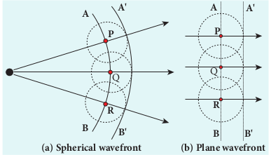
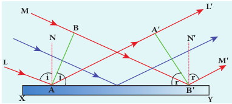

---
title: 'WAVE NATURE OF LIGHT'
weight: 2
---
[comment]: <> (katex Header)


# WAVE NATURE OF LIGHT

Light is a transverse, electromagnetic wave. The wave nature of light was first demonstrated through experiments like interference and diffraction. The transverse nature of light is demonstrated in polarization. Like all electromagnetic waves, light can travel through vacuum.

##  Wave optics

Wave optics deals with the wave characteristics  of light. Even the law of reflection and refraction are proved only with the help of wave optics. Though light propagates as a wave, its direction of propagation is still represented as a ray.

A good example for wave propagation is the spreading of circular ripples on the surface of still water from a point where a stone is dropped. The molecules (or) particles of water at a point are moving only up and down (oscillate) when a ripple passes through that point. All these particles on the circular ripple are in the same phase of vibration as they are all at the same distance from the center. The ripple represents a wavefront as shown in Figure 7.1(a). **A _wavefront_ is the locus of points which are in the same state (or) phase of vibration.**

When a wave propagates it is treated as the propagation of wavefront. The wavefront is always perpendicular to the direction of the propagation of the wave. As the direction of ray is in the direction of propagation of the wave, the wavefront is always perpendicular to the ray as shown in Figure 7.1(b).

![(a) Ripples on water surface (b) Wavefront and ray]!
 
Figure 7.1  
(a) Ripples on water surface(b) Wavefront and ray

  The shape of a wavefront observed at a point depends on the shape of the source and also the distance at which the source is located. A point source located at a finite distance gives spherical wavefronts. An extended (or) line source at finite distance gives cylindrical wavefronts. Any source that is located at infinity gives plane wavefront as shown in Figure 7.2.

## Huygens’ Principle

Huygens principle is basically a geometrical construction which gives the shape of the wavefront at any time if we know its shape at _t_ = 0. **According to Huygens principle, each point on the wavefront behaves as the source of secondary wavelets spreading out in all directions with the speed of the wave. These are called as secondary wavelets**. **The envelope to all these wavelets gives the position and shape of the new wavefront at a later time**. Thus, Huygens’ principle explains the propagation of a wavefront.

The propagation of a spherical and plane wavefront can be explained using Huygens’ principle. Let, _AB_ be the wavefront at a time, _t_ = 0. According to Huygens’ principle, every point on _AB_ acts as a source of secondary wavelet which travels with the speed of the wave (speed of light _c_). To find the position of the wavefront after a time _t_, circles of radius equal to _ct_ are drawn with points _P_, _Q, R_ ... etc., as centers on _AB_. The forward envelope (or) the tangent _A'B_' of the small circles is the new wavefront at that instant _t_. The wavefront _A'B_' will be a spherical wavefront from a point object which is at a finite distance as shown in Figure 7.3(a) and it is a plane wavefront if the source of light is at a large distance (infinity) as shown in Figure 7.3(b).

Figure 7.3 Huygens’ Principle

There is one shortcoming in the above Huygens’ construction for propagation of a wavefront. It could not explain the absence of backward wave which also arises in the above construction. According to electromagnetic wave theory, the backward wave is ruled out inherently. However, Huygens’ principle is a good diagrammatic construction which explains the propagation of the wavefront.
## Proof for laws of reflection using Huygens’ Principle

Let us consider a parallel beam of light is incident on a reflecting plane surface such as a plane mirror _XY_ as shown in Figure 7.4. The incident wavefront is _AB_ and the reflected wavefront is _A'B_' . These wavefronts are perpendicular to the incident rays _L_, _M_ and reflected rays _L'_ , _M_' respectively. By the time point _A_ of the incident wavefront touches the reflecting surface, the point _B_ is yet to travel a distance _BB_′ to touch the reflecting surface at ′_B_ . When the point _B_ touches the reflecting surface at ′_B_ , the point _A_ would have reached _A_' . This is applicable to all the points on the wavefront. Thus, the reflected wavefront _A' B_' emanates as a plane wavefront. The two normals _N_ and ′_N_ are considered at the points where the rays _L_ and _M_ fall on the reflecting surface. As reflection happens in the same medium, the speed of light is same before and after

  

Figure 7.4 Laws of reflection
the reflection. The time taken for the light to travel from _B_ to _B_' and _A_ to _A_' are the same. Thus, the distance _BB_′ is equal to the distance _AA_′ ; _(AA' = BB ')_ .
(i) The incident rays, the reflected rays and the normal are in the same plane.
(ii) Angle of incidence,

i = \angle NAL = 90^\circ - \angle NAB = \angle BAB'


 Angle of reflection,

\angle r = \angle N'B'M' = 90^\circ - \angle N'B'A' = \angle A'B'A

For the two right angle triangles, ∆ _ABB_′ and ∆B'A'A, the two right angles, ∠_B_ and ∠ ′_A_ are equal, $$(\angle{B} \quad \text{and} \quad \angle{A}' = 90^o )$$
 the two sides, _AA_′ and _BB_′ are equal,( _AA' = BB_ ′) ; the side _AB_′ is common. Thus, the two triangles are congruent. As per the property of congruency, the two angles, ∠_BAB_′ and ∠ _A'B'A_ must also be equal.

i=r(7.2)

Hence, the laws of reflection are proved

##  Proof for laws of refraction using Huygens’ Principle

Let us consider a parallel beam of light is incident on a refracting plane surface _XY_ such as a glass as shown in Figure 7.5. The incident wavefront _AB_ is in rarer medium (1) and the refracted wavefront _A'B_' is in denser medium (2). These wavefronts are perpendicular to the incident rays _L_, _M_ and refracted rays _L' ,M_' respectively. By the time the point _A_ of the incident wavefront touches the refracting surface, the point _B_ is yet to travel a distance _BB_′ to touch the refracting surface at _B_' . When the point _B_ touches the refracting surface at _B'_ , the point _A_ would have reached _A_' in the other medium. This is applicable
 
 

to all the points on the wavefront. Thus, the refracted wavefront _A'B_' emanates as a plane wavefront. The two normals _N_ and _N_' are considered at the points where the rays _L_ and _M_ fall on the refracting surface. As refraction happens from rarer medium (1) to denser medium (2), the speed of light is _v_1 and _v_2 before and after refraction and _v_1 is greater than _v_2, (_v_1>_v_2). But, the time taken _t_ for the ray to travel from _B_ to _B_' is the same as the time taken for the ray to travel from _A_ to _A_' .
 t = \frac{{BB'}}{{v_{1}}} = \frac{{A A'}}{{v_{2}}} (or) \frac{{BB'}}{{AA'}} = \frac{{v_{1}}}{{v_{2}}} 

(i) The incident rays, the refracted rays and the normal are in the same plane.

(ii) Angle of incidence,


i = \angle NAL = 90^\circ - \angle NAB = \angle BAB'


Angle of refraction,


\angle r = \angle N'B'M' = 90^\circ - \angle N'B'A' = \angle A'B'A


For the two right angle triangles ∆ _ABB_′ and ∆_AA'B'_, sin 

Here, c is speed of light in vacuum. The ratio _c_/_v_ is a constant, called refractive index of the medium. The refractive index
of medium (1) is, _c_/_v_1 = _n_1 and that of medium (2) is, c/v2 = n2.

In ratio form,

$$\frac{\sin i}{\sin r} = \frac{n_2}{n_1} $$

In the Product form              


n_1 \sin i = n_2 \sin r


Hence, the laws of refraction are proved. In the same way the laws of refraction can be proved for wavefront travelling from denser to rarer medium also.

The speed of light is inversely proportional to the refrative index of the medium ( _v_ ∝ 1/n) and also directly proportional to wavelength of light ( _v_ ∝λ ). Hence,

\frac{\lambda_1}{\lambda_2} = \frac{n_2}{n_1}


**Note**
If light of a particular frequency travels through different media, then, its frequency remains unchanged in all the media. Only the wavelength changes according to speed of light in that medium.
**EXAMPLE 7.1**

The wavelength of light from sodium source in vacuum is 5893Å.What are its (a) wavelength, (b) speed and (c) frequency when this light travels in water which has a refractive index of 1.33.

**_Solution_** 

The refractive index of vacuum, $$n1 = 1$$

The wavelength in vacuum, $$λ1 = 5893 Å$$.

The speed in vacuum, $$c = v_1 = 3 \times 10^8 \, \text{m/s}$$
The refractive index of water,$$n2 = 1.33$$
The wavelength of light in water, $$λ2$$

The speed of light in water,$$v_2$$

(a) The equation relating the wavelength and refractive index is,
\frac{\lambda_1}{\lambda_2} = \frac{n_2}{n_1}

Substituting the  values,
$$\lambda_{2} = \frac{1}{1.33} \times 5893\text{Å} = 4431\text{Å} $$
$$\lambda_{2} = 4431\text{Å}$$
(b) The equation relating the speed and refractive index is,
$$\frac{\nu_{1}}{\nu_{2}} = \frac{n_{2}}{n_{1}} $$
Rewriting, $$ v_{2} = \frac{n_{1}}{n_{2}} \times v_{1} $$
Substituting the values,
$$v_{2} = \frac{1}{1.33} \times 3 \times 10^{8} = 2.256 \times 10^{8} \text{m/s}$$

(c) Frequency of light in vacuum is,
$$ v_{1} = \frac{c}{\lambda_{1}} $$
Substituting the values,
 $$v_{1} = \frac{3 \times 10^8}{5893 \times 10^{-10}} = 5.091 \times 10^{14} \, \text{Hz} $$
 Frequency of light in water is,$$ v_{2} = \frac{v}{\lambda_{2}} $$
Substituting the values,
$$ v_{2} = \frac{2.256 \times 10^8 \, \text{m/s}}{4431 \times 10^{-10}} = 5.091 \times 10^{14} \, \text{Hz}$$
The results show that the frequency remains same in all media.  

