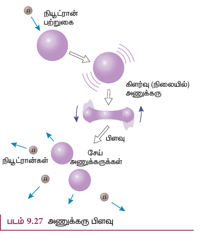
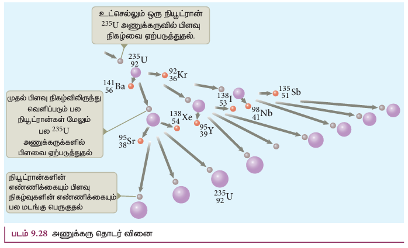
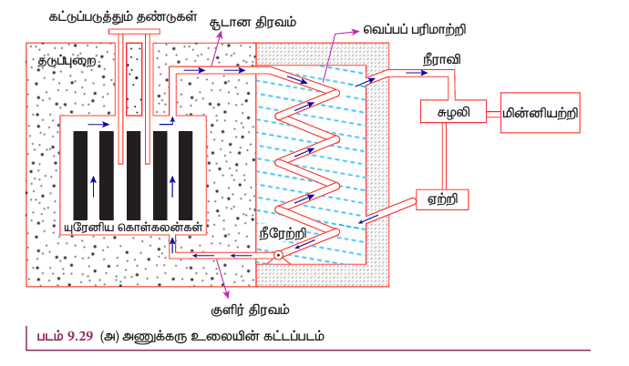
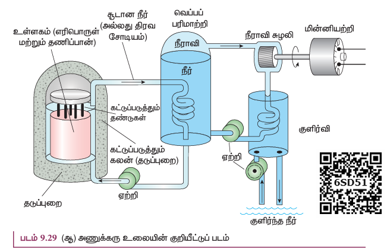

யுரேனியம் அணுக்கருவை நியூட்ரானால் மோதச் செய்யும்போது, அது கிட்டத்தட்ட சமமான நிறைகளையுடைய இரு சிறிய அணுக்கருக்களாகவும், அவற்றுடன் ஆற்றலும் வெளிப்படும் வண்ணம் பிளவுறுகிறது என்பதை ஜெர்மானிய அறிவியல் அறிஞர்களான ஆட்டோ ஹான் (Otto Hahn) மற்றும் ஸ்டிராஸ்மன் (Strassmann) ஆகியோரால் 1939ம் ஆண்டு கண்டுபிடிக்கப்பட்டது.

கனமான அணுவின் அணுக்கரு ஒன்று இரு சிறிய அணுக்கருக்களுடன் அதிக அளவிலான ஆற்றலும் வெளிப்படும் வண்ணம் பிளவுறும் நிகழ்வு அணுக்கரு பிளவு எனப்படும். பிளவு நிகழும் போது நியூட்ரான்களும் சேர்ந்தே வெளிப்படுகின்றன. அணுக்கரு பிளவில் வெளிப்படும் ஆற்றலின் அளவு வேதிவினைகளில் அதிகம் கண்டறியப்பட்ட ஆற்றலைக் காட்டிலும் பல மடங்கு அதிகமாக உள்ளது.

90 வெவ்வேறு வழிகளில் யுரேனியத்தின் பிளவு வினை நடைபெறுகின்றது. அவற்றுள் பெரும்பாலும் நிகழும் பிளவு வினைகள் கீழே கொடுக்கப்பட்டுள்ளன.

$$^{235}_{92}U + ^{1}_{0}n \rightarrow ^{236}_{92}U^* \rightarrow ^{141}_{56}Ba + ^{92}_{36}Kr + 3 ^{1}_{0}n + Q \quad (9.45)$$
$$^{235}_{92}U + ^{1}_{0}n \rightarrow ^{236}_{92}U^* \rightarrow ^{140}_{54}Xe + ^{94}_{38}Sr + 2 ^{1}_{0}n + Q \quad (9.46)$$

இங்கு $Q$ என்பது ஒவ்வொரு யுரேனிய அணுக்கருவும் பிளவுறும் போது வெளிப்படும் ஆற்றலைக் குறிக்கும். குறைவேக நியூட்ரான் ஒன்றினை யுரேனியம் அணுக்கரு உட்கவரும் போது, அதன் நிறை எண் ஒன்று அதிகரித்து $^{236}_{92}U^*$ என்ற கிளர்வு நிலைக்குச் செல்கிறது. ஆனால் இந்நிலை $10^{-12}$ s நேரத்திற்கு மேலாக நிலைக்க இயலாததால் அது 2 அல்லது 3 நியூட்ரான்களுடன் கூடிய இரு சேய் அணுக்கருக்களாகச் சிதைவுறுகிறது. ஒவ்வொரு வினையிலிருந்தும் சராசரியாக 2.5 நியூட்ரான்கள் வெளிப்படுகின்றன. இது படம் 9.27 ல் காட்டப்பட்டுள்ளது.

**பிளவில் வெளிப்படும் ஆற்றல்**

அதிகளவில் நிகழும் அணுக்கரு பிளவு வினையானது, சமன்பாடு (9.45) கொடுக்கப்பட்டுள்ளது.

$$_{92}^{235}\text{U} + _0^1 n \rightarrow _{92}^{236}\text{U}^* \rightarrow _{56}^{141}\text{Ba} + _{36}^{92}\text{Kr} + 3 _0^1 n + Q$$

$_{92}^{235}\text{U}$ ன் நிறை = 235.045733 u

$_0^1 n$ ன் நிறை = 1.008665 u

வினைப்படு பொருள்களின் மொத்த நிறை = 236.054398 u

$_{56}^{141}\text{Ba}$ ன் நிறை = 140.9177 u

$_{36}^{92}\text{Kr}$ ன் நிறை = 91.8854 u

3 நியூட்ரான்களின் நிறை = 3.025995 u

வினைவிளை பொருள்களின் மொத்த நிறை = 235.829095 u

நிறை இழப்பு $\Delta m = 236.054398 \text{ u} - 235.829095 \text{ u} = 0.225303 \text{ u}$

எனவே ஒவ்வொரு பிளவிலும் வெளிப்படும் ஆற்றல் $= 0.225303 \times 931 \approx 200 \text{ MeV}$

இந்த ஆற்றல் முதலில் சேய் அணுக்கருக்கள் மற்றும் நியூட்ரான்களின் இயக்க ஆற்றலாக வெளிப்பட்டு பின்னர் இந்த இயக்க ஆற்றல் சுற்றியுள்ள பொருள்களில் வெப்ப ஆற்றலாக மாற்றப்படுகின்றது.

**தொடர் வினை**

ஒரு $ \frac{235}{92}U $ அணுக்குரு பிளவுக்கு உட்படும்போது  உருவாகும் ஆற்றல் சிறியதாக இருப்பினும், ஒவ்வொரு பிளவு விணையிலும் மூன்று நியூட்ரான்கள் உருவாகின்றன. அவை மூன்றும், மேலும் மூன்று $ \frac{235}{92}U $ அணுக்குருக்களைப் பிளந்து மொத்தம் 9 நியூட்ரான்களை உருவாக்குகின்றன. இந்த 9 நியூட்ரான்கள் ஒன்பது $ \frac{235}{92}U $ அணுக்குருக்களைப் பிளந்து மேலும் 27 நியூட்ரான்களை உருவாக்கி இந்த விணையை தொடர செய்கிறது. இதுவே தொடர்வினை எனப்படுகிறது. இதில் நியூட்ரான்களின் எண்ணிக்கை பெருக்கத் தொடர்ச்சியில் (geometric progression) பெருக்கி கொண்ட போகிறது (படம் 9.28).

இரண்டு விதமான தொடர் வினைகள் உள்ளன.
(i) கட்டுப்பாட்டிலுள்ள தொடர்வினை
(ii) கட்டுப்பாடற்ற தொடர்வினை: கட்டுப்பாடற்ற தொடர் வினையில் நியூட்ரான் எண்ணிக்கை முடிவில்லாமல் பெருகுவதால் மிகக்குறைந்த நேரத்திலேயே மொத்த ஆற்றலும் வெளிப்படுகிறது. கட்டுப்பாடற்ற தொடர் வினையாக அணுக்கரு பிளவு நிகழ்வதற்கு ஒரு எடுத்துக்காட்டே அணுகுண்டு. இரண்டாம் உலகப்போரின் போது 1945 ஆம் ஆண்டு ஆகஸ்ட் 6 மற்றும் ஆகஸ்ட் 9 ஆகிய தினங்களில் ஜப்பானிலுள்ள ஹிரோஷிமா மற்றும் நாகசாகி ஆகிய இரு இடங்களில் அமெரிக்கா அணுகுண்டை வீசியது. இதன் விளைவாக லட்சக்கணக்கில் மக்கள் உயிரிழந்து அவ்விரு நகரங்களும் முழுமையாக அழிந்தது. அணுகுண்டுகளின் வெடிப்பினால் ஏற்படும் பக்க விளைவுகளால் அப்பகுதிகளில் வாழும் மக்கள் இன்றளவும் பாதிப்புக்கு உள்ளாகின்றனர்.

ஒரு தொடர் வினையில் வெளியிடப்படும் ஆற்றலைக் கணக்கிட இயலும், முதல் படியில் ஒரு அணுக்கருவில் பிளவை ஒரு நியூட்ரான் துவங்குவதால் மூன்று நியூட்ரான்களும், 200 MeV ஆற்றலும் உருவாகின்றன. இரண்டாவது படியில் மூன்று அணுக்கருக்களும் மூன்றாவது படியில் ஒன்பது அணுக்கருக்களும் நான்காவது படியில் 27 அணுக்கருக்களும் இவ்வாறு தொடர்ச்சியாக உருவாகின்றன. நூறாவது படியில் பிளவுக்கு உட்படும் அணுக்கருக்களின் எண்ணிக்கை $2.5 \times 10^{40}$ ஐத் தொடும். இவ்வாறு 100 வது படியில் தோற்றுவிக்கப்படும் ஆற்றலின் மதிப்பு $2.5 \times 10^{40} \times 200 \text{ MeV} = 8 \times 10^{29} \text{ J}$. இது உண்மையிலேயே மிகப்பெரிய ஆற்றலாகும், இது தமிழ்நாட்டின் பல ஆண்டுகளுக்கான மின்னாற்றல் தேவைக்கு சமமானதாகும்.

இத்தொடர் வினையைக் கட்டுக்குள் வைக்க முடிந்தால், மாபெரும் ஆற்றலை நம் தேவைகளுக்காக நாம் பயன்படுத்த இயலும். இது கட்டுப்பாட்டிலுள்ள தொடர் வினையில் இது சாத்தியமாகும். கட்டுப்பாட்டிலுள்ள தொடர்வினையில் ஒவ்வொரு நிலையிலும் வெளியேற்றப்படும் நியூட்ரான்களின் சராசரி எண்ணிக்கை ஒன்று என்றாவில் கட்டுப்படுத்தப்படுவதால், இதில் வெளிப்படும் ஆற்றலை சேமிக்க இயலும். அணுக்கரு உலைகளில் தொடர்வினை கட்டுக்குள் இடுத்தப்படுவதால் உருவாக்கப்படும் ஆற்றலானது மின்திறன் உற்பத்திற்கும் ஆராய்ச்சி நோக்கத்திற்கும் பயன்படுத்தப்படுகிறது.

## எடுத்துக்காட்டு 9.15

1 kg நிறையுள்ள $^{235}_{92}U$ பிளவும்போது வெளிப்படும் ஆற்றலைக் கணக்கிடுக.

**தீர்வு:**

235 g $^{235}_{92}U$ இல் $6.02 \times 10^{23}$ அணுக்கள் உள்ளன.
1 g $^{235}_{92}U$ இல் உள்ள அணுக்களின் எண்ணிக்கை $= \frac{6.02 \times 10^{23}}{235} = 2.56 \times 10^{21}$
1 kg ல் உள்ள அணுக்களின் எண்ணிக்கை $^{235}_{92}U = 2.56 \times 10^{21} \times 1000 = 2.56 \times 10^{24}$
ஒவ்வொரு $^{235}_{92}U$ பிளவிலிருந்து 200 MeV ஆற்றல் வெளிப்படும்.
எனவே, 1kg $^{235}_{92}U$ லிருந்து வெளிப்படும் மொத்த ஆற்றல்,
$$Q = 2.56 \times 10^{24} \times 200 \text{ MeV} = 5.12 \times 10^{26} \text{ MeV}$$
இதை ஜூல் அலகிற்கு மாற்றும் போது,
$$Q = 5.12 \times 10^{26} \times 1.6 \times 10^{-13} \text{ J} = 8.192 \times 10^{13} \text{ J}$$
இதை கிலோவாட் மணி அலகிற்கு மாற்றும் போது,
$$Q = \frac{8.192 \times 10^{13}}{3.6 \times 10^{6}} = 2.27 \times 10^{7} \text{ kWh}$$
100 W ஒளி விளக்கு ஒன்றை 30,000 ஆண்டுகள் இயக்குவதற்குத் தேவையான அளவிற்கு இது மிகபெரிய அளவிலான ஆற்றலாகும். வேதிவினைகளின் மூலம் இவ்வாற்றலைப் பெற வேண்டுமானால் 20,000 டன் TNT (டிரை நைட்ரோ டொலுவீன்) -ஐ வெடிக்கச் செய்ய வேண்டும்.

### அணுக்கரு உலை

அணுக்கரு உலை என்பது தற்சார்புடைய மற்றும் கட்டுக்குள் இருக்கும் வகையில் அணுக்கரு பிளவு நடைபெறும் அமைப்பாகும். இதில் உருவாகும் ஆற்றல் ஆராய்ச்சித் தேவைகளுக்கோ அல்லது மின்திறன் உருவாக்கத்திற்கோ பயன்படுத்தப்படுகிறது. முதல் அணுக்கரு உலை என்ரிகோ பெர்மி (Enrico Fermi) என்ற இயற்பியல் அறிஞரால் 1942ஆம் ஆண்டு அமெரிக்க நாட்டின் சிகாகோ நகரில் கட்டப்பட்டது.

**அணுக்கரு உலையின் முக்கிய பாகங்கள்:** எரிபொருள் (அணுக்கருப் பிளவுக்கு உட்படும் பொருள்), தணிப்பான், மற்றும் கட்டுப்படுத்தும் தண்டுகள். இவை தவிர, மின்சார உற்பத்தி அமைப்புடன் இணைக்கப்பட்டிருக்கும் குளிர்விக்கும் அமைப்பும் உள்ளது.

**எரிபொருள்:** எரிபொருள் என்பது அணுக்கரு பிளவுக்கு உட்படும் பொருள் (பொதுவாக, யுரேனியம் அல்லது புளூட்டோனியம்). இயற்கையில் கிடைக்கும் யுரேனியத்தில் 0.7% அளவே $^{235}U$ உள்ளது, 99.3% அளவு $^{238}U$ உள்ளது. எனவே, $^{238}U$ செறிவூட்டப்பட்டு, அதில் 2-4% அளவு $^{235}U$ இருக்குமாறு செய்யப்படுகிறது. இதைத் தவிர, தொடர் வினையைத் துவக்குவதற்கு நியூட்ரான் மூலம் தேவைப்படுகிறது. புளூட்டோனியம் அல்லது பொலோனியத்துடன் பெரிலியம் கலந்த கலவை நியூட்ரான் மூலமாகப் பயன்படுகிறது. $^{235}U$ இன் அணுக்கரு பிளவின் போது வெளிப்படும் வேக நியூட்ரான்களால் மற்றொரு அணுக்கருவைப் பிளவடையச் செய்வதற்கு மிகக் குறைந்த வாய்ப்பே உள்ளது. எனவே அணுக்கரு வினைகள் தொடர்ந்து நடைபெறுவதற்கு குறைவேக நியூட்ரான்கள் பயன்படுத்தப்படுகின்றன.

**தணிப்பான்கள்:** வேக நியூட்ரான்களை குறைவேக நியூட்ரான்களாக மாற்றுவதற்கு உதவும் பொருள் தணிப்பான் எனப்படும். பொதுவாக, நியூட்ரான்களின் நிறைக்குச் சமமான நிறையுடைய இலேசான அணுக்கருக்களே தணிப்பான்களாகப் பயன்படுத்தப்படுகின்றன. இந்த இலேசான அணுக்கருக்களுடன் வேக நியூட்ரான்கள் மோதலை நிகழ்த்தும் போது நியூட்ரான்களின் வேகம் குறைக்கப்படுகிறது. (பில்லியட் பந்து ஒன்று நிலையாகவுள்ள, சமநிறை கொண்ட மற்றொரு பில்லியட் பந்துடன் மோதும் போது ஓய்வு நிலைக்கு வருவதையும், அதே பந்து மிக அதிக நிறை கொண்ட வேறொரு பொருளுடன் மோதும் போது, அதே வேகத்துடன் திருப்பி அனுப்பப்படுவதையும் பார்த்திருக்கலாம். இக்காரணத்தினாலேயே தணிப்பான்களில் இலேசான அணுக்கருக்கள் பயன்படுத்தப்படுகின்றன). பெரும்பாலான உலைகளில் கனநீர் ($D_2O$) மற்றும் கிராஃபைட் ஆகிய பொருள்களை தணிப்பான்களாகப் பயன்படுத்தப்படுகின்றன. யுரேனிய அடுக்குகளின் தொகுதியுடன் இடையில் கிராஃபைட் தண்டுகள் (தணிப்பான்கள்) இணைக்கப்பட்ட ஒரு பெரிய அடுக்காக உள்ளதைப் படம் 9.29(அ) மற்றும் (ஆ)ல் காணலாம்.

**கட்டுப்படுத்தும் தண்டுகள்:** அணுக்கரு பிளவு வினை நடைபெறும் வீதத்தை சரிசெய்வதற்கு அல்லது கட்டுக்குள் வைப்பதற்கு கட்டுப்படுத்தும் தண்டுகள் பயன்படுகின்றன. ஒவ்வொரு அணுக்கரு பிளவின் போதும் சராசரியாக 2.5 நியூட்ரான்கள் வெளியேறுகின்றன. எனவே, தொடர் வினையைக் கட்டுக்குள் வைப்பதற்கு ஒரேயொரு நியூட்ரான் மட்டுமே அடுத்த பிளவை ஏற்படுத்துமாறு செய்யப்பட்டு, மற்ற நியூட்ரான்கள் கட்டுப்படுத்தும் தண்டுகளால் உட்கவரப்படுகின்றன.

பொதுவாக, காட்மியம் அல்லது போரான் ஆகியவை கட்டுப்படுத்தும் தண்டுப் பொருளாக செயல்படுகிறது. மேலும், படம் 9.29(அ) மற்றும் (ஆ) இல் காட்டியுள்ளபடி யுரேனிய அடுக்குகளில் இத்தண்டுகள் செருகி வைக்கப்படுகின்றன. யுரேனியத்தில் கட்டுப்படுத்தும் தண்டுகள் செருகப்படும் ஆழத்தைப் பொருத்து ஒரு பிளவில் உருவாகும் சராசரி நியூட்ரான்களின் எண்ணிக்கை ஒன்று அல்லது அதற்கு மேலாக வைக்க இயலும். ஒரு பிளவில் உருவாகும் சராசரி நியூட்ரான்களின் எண்ணிக்கை ஒன்று எனில், அணுக்கரு உலை செயல்பாட்டு நிலையில் (critical state) உள்ளது எனலாம். உள்ளபடி, கட்டுப்படுத்தும் தண்டுகளைத் தகுந்த முறையில் சரி செய்து அமைப்பதன் மூலம் அனைத்து அணுக்கரு உலைகளும் செயல்பாட்டு நிலையிலேயே வைக்கப்படுகின்றன. எண்ணிக்கை ஒன்றை விட அதிகமாக இருப்பின் அவ்வுலை மீச்செயல்பாட்டு நிலையை (super- critical) எட்டுகிறது; விரைவில் அது வெடித்து மிகப்பெரிய அழிவை ஏற்படுத்தக் கூடும்.

**தடுப்பு அமைப்பு (Shielding):** தீமை பயக்கும் கதிர்வீச்சுகளிலிருந்து நம்மை பாதுகாத்துக் கொள்ள 2-2.5 m தடிமனுள்ள கற்காரையினால் (concrete) ஆன சுவரானது அணுக்கரு உலையைச் சுற்றி அமைக்கப்படுகிறது.

**குளிர்விக்கும் அமைப்பு:** அணுக்கரு உலையின் உள்ளகத்தில் உருவாகும் வெப்பத்தை நீக்க குளிர்விக்கும் அமைப்பு உதவுகிறது. மிக அதிக தன் வெப்ப ஏற்புத்திறனும், அதிக அழுத்தத்தில் அதிக கொதிநிலையையும் கொண்டுள்ள நீர், கனநீர் மற்றும் திரவ சோடியம் ஆகியவை குளிர்விப்பான்களாகப் பயன்படுத்தப்படுகின்றன. படம் 9.29(அ) மற்றும் (ஆ)-வில் காட்டப்பட்டுள்ளபடி, குளிர்விப்பான் அமைப்பானது, எரிபொருள் அடுக்கின் வழியே சென்று உட்கவர்ந்த வெப்பத்தை நீராவி இயற்றிக்குக் கடத்துகின்றது. நீராவியினால் சுழலிகள் (turbines) இயக்கப்பட்டு மின்சார உற்பத்தி நிலையங்களில் மின்னாற்றல் உற்பத்தி செய்யப்படுகிறது.

**குறிப்பு:** இந்தியாவில் தற்போது 22 அணுக்கரு உலைகள் செயல்பாட்டில் உள்ளன. தமிழ்நாட்டில் கல்பாக்கம், கூடங்குளம் ஆகிய இரு இடங்களில் அணுக்கரு உலைகள் கட்டப்பட்டுள்ளன. நம் ஆற்றல் தேவையை நிறைவேற்றுவதில் அணுக்கரு உலைகளின் பங்கு மிகக் குறைவு. இருப்பினும் இந்தியாவின் ஆற்றல் தேவையில் வெறும் 2% அளவு மட்டுமே அவற்றால் வழங்க முடிகிறது.
