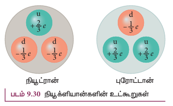

இரண்டு அல்லது அதற்கு மேற்பட்ட குறைந்த நிறை கொண்ட ($A<20$) அணுக்கருக்கள் இணைந்து அதிக நிறை கொண்ட அணுக்கருவை உருவாக்கும் நிகழ்வு அணுக்கரு இணைவு எனப்படும். அணுக்கரு இணைவில் உருவாகும் அணுக்கருவின் நிறையானது தொடக்கத்தில் உள்ள அணுக்கருக்களின் நிறைகளின் கூடுதலை விடக் குறைவாக இருக்கும். அணுக்கரு பிளவைப் போல அறை வெப்ப நிலையில் அணுக்கரு இணைவு நிகழாது. ஏனெனில், குறைந்த நிறையுடைய இரு அணுக்கருக்கள் ஒன்றைப்போன்று நெருங்கும் போது கூலூம் விலக்கு விசையினால் அவை கூறமாக விலக்கப்படுகின்றன.

இவ்விலக்கு விசையை ஈடு செய்து, அவற்றை மிகவும் அருகாமையில் நெருங்கச் செய்ய அதிக அளவிலான இயக்க ஆற்றல் தேவைப்படுகிறது. அருகாமையில் வந்த பிறகு வலிமைமிகு அணுக்கரு விசை செயல்படத் துவங்கி அவற்றை இணைக்கும். வெப்பநிலை மிக அதிகமாக, ஏறக்குறைய $10^7 \text{ K}$, இருந்தால் மட்டுமே இது சாத்தியமாகும். சூழலின் வெப்பநிலை $10^7 \text{ K}$ ஐ நெருங்கும் போது குறைந்த நிறையுடைய அணுக்கருக்கள் இணைந்து அதிக நிறையுடைய அணுக்கருவை உருவாக்குவதால் இந்நிகழ்வு வெப்ப அணுக்கரு இணைவு வினை என்றழைக்கப்படுகிறது.

**விண்மீன்களில் ஆற்றல் உருவாதல்:**

விண்மீன்களின் வெப்பநிலை கிட்டத்தட்ட $10^7 \text{ K}$ அளவில் இருப்பதால் இயற்கையிலேயே அணுக்கரு இணைவு நடைபெறுகிறது. ஒவ்வொரு விண்மீனிலும் ஆற்றல் உருவாகும் நிகழ்வு ஒரு வெப்ப அணுக்கரு இணைவு வினையே. நம் சூரியன் உட்பட பெரும்பாலான விண்மீன்களில் ஹைட்ரஜன் இணைந்து ஹீலியமும், சில விண்மீன்களில் ஹீலியம் இணைந்து மேலும் அதிக நிறையுடைய தனிமங்களும் உருவாகின்றன.

விண்மீனின் தொடக்க கட்டத்தில் வாயு மேகமும் தூசுகளும் மட்டுமே காணப்படுகின்றன. தன் ஈர்ப்பு விசையினால் அம்மேகங்கள் உள்நோக்கி வீழ்கின்றன. இதனால் ஈர்ப்பழுத்த ஆற்றல் இயக்க ஆற்றலாகவும் இறுதியில் வெப்ப ஆற்றலாகவும் மாறுகிறது. வெப்ப அணுக்கரு வினையைத் துவக்கத் தேவையான வெப்பநிலையை அடைந்தபின் ஏராளமான ஆற்றல் வெளிப்படுவதனால் உள்நோக்கிய வீழ்வு தடுக்கப்பட்டு விண்மீன் சமநிலையை எட்டுகிறது.

சூரியனின் உட்புறத்தி வெப்ப நிலை ஏறக்குறைய $1.5 \times 10^7 \text{ K}$. ஒவ்வொரு வினாடியும் அது $6 \times 10^{11} \text{ kg}$ ஹைட்ரஜனை ஹீலியமாக மாற்றுகிறது. இந்த இணைவு வினை மேலும் 5 பில்லியன் ஆண்டுகளுக்கு நீடித்திருப்பதற்குத் தேவையான ஹைட்ரஜன் சூரியனில் உள்ளது. அனைத்து ஹைட்ரஜனும் எரிந்த பிறகு, சிவப்புப் பெருமீன் (red giant) என்ற புதிய கட்டத்தை சூரியன் அடையும். இதில் ஹீலியம் இணைந்து கார்பனாக மாறுகின்ற அணுக்கரு இணைவு வினை நடக்க ஆரம்பிக்கும். இக்கட்டத்தில், சூரியன் அனைத்து கோள்களையும் விழுங்கும் அளவிற்கு மிகப்பெரியதாக விரிவடையும்.

ஹான்ஸ் பெத்தே (Hans Bethe) என்பாரின் கருத்தப்படி சூரியனின் ஆற்றல் புரோட்டான்- புரோட்டான் சுழற்சி எனப்படும் இணைவு வினையினால் உருவாகிறது. இச்சுழற்சி மூன்று படிநிலைகளைக் கொண்டது, அதில் முதலிரண்டு படிநிலைகள் பின்வருமாறு:
$$^{1}_{1}H + ^{1}_{1}H \rightarrow ^{2}_{1}H + e^{+} + \nu \quad (9.44)$$
$$^{1}_{1}H + ^{2}_{1}H \rightarrow ^{3}_{2}He + \gamma \quad (9.45)$$
மூன்றாவது படிநிலையில் பல விதமான வினைகள் நிகழலாம். அதில் மேலோங்கிய ஒன்று,
$$^{3}_{2}He + ^{3}_{2}He \rightarrow ^{4}_{2}He + ^{1}_{1}H + ^{1}_{1}H \quad (9.46)$$
மேலே குறிப்பிடப்பட்ட வினைகளில் உருவாகும் மொத்த ஆற்றலின் மதிப்பு 27 MeV. சூரியனிலிருந்து நாம் பெறுகின்ற கதிர்வீச்சு ஆற்றல் இந்த இணைவு வினைகளால் உருவாவதே.

### அடிப்படைத் துகள்கள் (Elementary particles)

ஓர் அணுவில் அணுக்கருவும் அதனைச் சுற்றி எலக்ட்ரான்களும் உள்ளன; அணுக்கரு புரோட்டான்கள் மற்றும் நியூட்ரான்களைக் கொண்டது. புரோட்டான்கள், நியூட்ரான்கள், எலக்ட்ரான்கள் ஆகியவையே பரும்பொருள்களின் அடிப்படைத் துகள்கள் என 1960கள் வரை நம்பப்பட்டு வந்தது. 1964ஆம் ஆண்டில் முர்ரே கெல்-மான் (Murray Gell-Mann) மற்றும் ஜார்ஜ் ஸ்வேக் (George Zweig) ஆகிய இயற்பியல் அறிஞர்கள் புரோட்டான்களும் நியூட்ரான்களும் அடிப்படைத் துகள்கள் அல்ல; அவை குவார்க்குகள் என்ற துகள்களால் ஆனவை என்ற கருத்தியலை முன்மொழிந்தனர். தற்போது இக்குவார்க்குகளை அடிப்படைத் துகள்களாகக் கருதப்படுகின்றன. ஆனால் எலக்ட்ரான்கள் வேறு எந்த துகள்களாலும் உருவாக்கப்படாததால் அவை அடிப்படைத் துகள்களாகவே கருதப்படுகின்றன.

1968ஆம் ஆண்டு அமெரிக்காவிலுள்ள ஸ்டான்ஃபோர்டு துகள் முடுக்கி மையத்தில் (SLAC) நடந்த சோதனைகளில் குவார்க்குகள் கண்டுபிடிக்கப்பட்டன. மேல்(up) குவார்க், கீழ்(down) குவார்க், கவர்வு (charm) குவார்க், புதுமை (strange) குவார்க், உச்சி (top) குவார்க், அடி (bottom) குவார்க் என ஆறு வகை குவார்க்குகளும் அவற்றின் எதிர்த்துகள்களும் உள்ளன. குவார்க்குகள் அனைத்துமே பின்ன மதிப்புடைய மின்னூட்டங்களைப் பெற்றுள்ளன. எடுத்துக்காட்டாக, மேல் குவார்க்கின் மின்னூட்ட மதிப்பு $+\frac{2}{3} e$, மேலும் கீழ் குவார்க்கின் மின்னூட்ட மதிப்பு $-\frac{1}{3} e$. குவார்க் மாதிரியின்படி, ஒரு புரோட்டான் இரண்டு மேல் குவார்க்குகள், மற்றும் ஒரு கீழ் குவார்க்காலும் ஆக்கப்பட்டிருக்கிறது. அதே போல், ஒரு நியூட்ரான் இரண்டு கீழ் குவார்க்குகள் மற்றும் ஒரு மேல் குவார்க்காலும் ஆக்கப்பட்டிருக்கிறது. (படம் 9.30)

அடிப்படைத் துகள்களை ஆராயும் இயல் துகள் இயற்பியல் என்றழைக்கப்படுகிறது. இன்றும் இது தொடர்ந்து செயலாய்வில் இருந்து வரும் ஒரு துறையாக உள்ளது. இது வரையிலும், இருபதுக்கு மேற்பட்ட இயற்பியல் நோபல் பரிசுகள் இத்துறையின் ஆராய்ச்சிக்காக வழங்கப்பட்டுள்ளன.

**இயற்கையின் அடிப்படை விசைகள்:**

இரு நிறைகளுக்கு இடையில் ஈர்ப்பு விசை செயல்படுவதையும் அது இயல்பில் அனைத்துக்கும் பொதுவான ஒன்று என்பதையும் அறிவோம். சூரியனின் ஈர்ப்பு விசையினாலேயே அனைத்து கோள்களும் சூரியனை சுற்றி வருகின்றன. +2 இயற்பியல், தொகுதி-1ல் இரு மின்துகள்களுக்கு இடையே மின்காந்த விசை செயல்படுகிறது என்பதையும் நம்அன்றாடநிகழ்வுகள்பலவற்றில்அது முக்கிய பங்காற்றுகிறது என்பதையும் அறிந்தோம். இந்த அலகில், இரு நியூக்ளியான்களுக்கு இடையே ஒரு வலிமையான அணுக்கரு விசை செயல்படுகிறது என்பதையும் அணுக்கருவின் நிலைத்தன்மைக்கு இது காரணமாக உள்ளது என்றும் அறிந்தோம். இம்மூன்று விசைகளைத் தவிர, வலிமை குன்றிய விசை அல்லது மென்விசை (weak force) எனப்படும் மற்றொரு அடிப்படை விசையும் உள்ளது. இந்த மென் விசையானது அணுக்கரு விசையை விடக் குறைந்த தொலைவுகளில் செயல்படக் கூடியது. பீட்டா சிதைவு மற்றும் விண்மீன்களில் ஆற்றல் உருவாதல் ஆகிய நிகழ்வுகளில் இந்த விசை முக்கிய பங்காற்றுகிறது. சூரியனில் ஹைட்ரஜன் ஹீலியமாகும் நிகழ்வில் நியூட்ரினோக்களும் ஏராளமான கதிர்வீச்சுகளும் மென் விசையினாலேயே உருவாகின்றன. மென் விசையின் விரிவான செயல்படுமுறை இப்பாடத்தின் நோக்கத்திற்கு அப்பாற்பட்டது. மென் விசையைப் பற்றி மேலும் அறிந்து கொள்ள, தகுந்த குறிப்பதவி நூல்களைப் படித்தல் வேண்டும். ஈர்ப்புவிசை, மின்காந்தவிசை, அணுக்கருவிசை மற்றும் மென் விசை ஆகிய நான்கும் இயற்கையின் அடிப்படை விசைகள். நம் அன்றாட வாழ்வில் கூட இந்த அடிப்படை விசைகள் தேவைப்படுகின்றன அல்லது முக்கிய பங்காற்றுகின்றன என்பது ஒரு வியப்பான உண்மை. எளிமையாகச் சொன்னால், நாம் பூமியில் இருப்பதற்கு புவியின் ஈர்ப்பு விசை காரணமாக உள்ளது. நாம் புவியின் பரப்பில் இருத்தலுக்கு புவிப்பரப்பிலுள்ள அணுக்களுக்கும் நம் பாதத்திலுள்ள அணுக்களுக்கும் இடையேயுள்ள மின்காந்த விசை காரணமாக உள்ளது. நம் உடலிலுள்ள அணுக்கள் நிலைத்தன்மையுடன் இருப்பதற்கு வலிமையான அணுக்கரு விசை தேவைப்படுகிறது. இறுதியாக, பூமியிலுள்ள பல்வேறு உயிரினங்களின் வாழ்விற்குத் தேவையான சூரிய ஆற்றல், சூரியனிலிருந்து உருவாதலுக்குக் காரணமாகவும், சூரியனின் உள்ளகத்தில் அணுக்கரு இணைவு வினை நிகழ்வதற்கும் மென்விசை முக்கிய பங்கு வகிக்கிறது.
