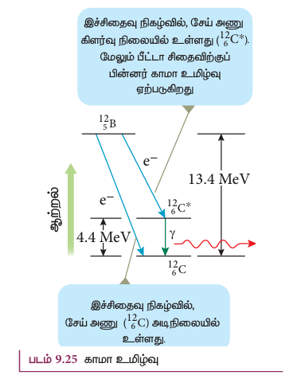
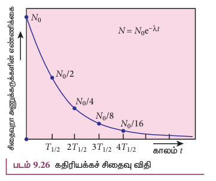
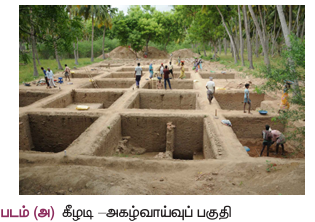
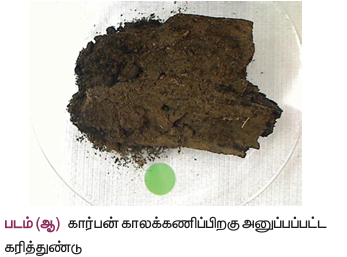

பிணைப்பாற்றல் வளைகோட்டில் $Z>82$ கொண்ட அணுக்கருக்களின் நிலைத்தன்மை குறைவதைக் காணலாம். மேலும் அவை நிலைத்தன்மை அற்ற அணுக்கருக்கள் என்றழைக்கப்படுகின்றன. அவற்றுள் சில அணுக்கருக்கள் இயற்கையாகச் சிதைந்து, சில வகைத் துகள்களை வெளிவிடுவதன் மூலம் நிலைத்தன்மை பெறுகின்றன. அணு எண் $Z > 82$ கொண்ட தனிமங்களும் இயற்கையில் காணப்படும் கதிரியக்கப் பொருள்களாகும். இந்த கதிரியக்க ஐசோடோப்புகள் $^{4}_{2}He$ அணுக்கருவையோ ($\alpha$ – சிதைவு) அல்லது எலக்ட்ரான்/ பாசிட்ரானையோ ($\beta$ – சிதைவு) அல்லது காமா கதிர்களையோ ($\gamma$ – சிதைவு) வெளிவிடுவதன் மூலம் நிலைத்தன்மை பெறுகின்றன.

ஒரு தனிமத்திலிருந்து அதிக ஊடுருவு திறன் கொண்ட கதிர்வீச்சுகளான $\alpha$, $\beta$ மற்றும் $\gamma$ கதிர்கள் தன்னிச்சையாக உமிழப்படும் நிகழ்வு கதிரியக்கம் எனப்படும்; மேலும், இத்தகைய கதிர்வீச்சுகளை உமிழும் தனிமங்கள் கதிரியக்கத் தனிமங்கள் எனப்படும். இவை கனமான தனிமங்களாகவோ ($Z > 82$), இலேசான மற்றும் கனமான தனிமங்களின் ஐசோடோப்புகளாகவோ உள்ளன. இவற்றுக்கு கதிரியக்க ஐசோடோப்புகள் என்று பெயர். எடுத்துக்காட்டாக, கார்பனின் ஐசோடோப்பான $^{14}C$ கதிரியக்கத் தன்மை கொண்டது. ஆனால் $^{12}C$ அத்தன்மை கொண்டதல்ல.

கார்பன் காலக்கணிப்பு, புற்றுநோய் சிகிச்சை உள்ளிட்ட பல்வேறு பயன்பாடுகளில் கதிரியக்க ஐசோடோப்புகள் உதவுகின்றன. ஒரு கதிரியக்க அணுக்கரு சிதைவுறும் போது அவ்வமைப்பின் நிறை குறைகிறது. அதாவது, சிதைவுக்கு முன் தொடக்க அணுக்கருவின் நிறையானது இறுதி அணுக்கருவின் நிறை மற்றும் உமிழ்ப்பும் துகளின் நிறை ஆகியவற்றின் கூட்டுத்தொகையை விட அதிகமாக இருக்கும். இந்த நிறை வேறுபாடானது, அதாவது $\Delta m$, (ஐன்ஸ்டீனின் $E = |\Delta m| c^2$ சமன்பாட்டின்படி) ஆற்றலாகத் தோன்றுகிறது.

கதிரியக்கச் செயல்பாட்டை 1896-ஆம் ஆண்டில் முதல்முதலாகக் கண்டறிந்தவர் ஹென்றி பெக்கரல் ஆவார். பின்னர் மேரி கியூரியும் அவரது கணவர் பியர் கியூரியும் மேற்கொண்ட தொடர் ஆய்வுகள் கதிரியக்க நிகழ்வினைப் புரிந்து கொள்ளப் பெரிதும் உதவின. இந்தியாவில் கொல்கத்தாவிலுள்ள 'அணுக்கரு இயற்பியலுக்கான சாஹா நிறுவனம் (SINP)' என்றழைக்கப்படும் கல்வி நிறுவனம் அணுக்கரு இயற்பியல் துறையில் உயிர்ப்பான ஆராய்ச்சிகளை மேற்கொண்டு வரும் முதல்மையான ஆராய்ச்சி நிறுவனமாகும்.

**குறிப்பு:** அணுக்கரு இயற்பியல் ஆராய்ச்சியின் தொடக்க காலங்களில் கதிர்வீச்சு என்ற சொல் கதிரியக்க அணுக்கருக்களில் இருந்து வெளிவரும் உமிழ்வுகளைக் குறிப்பிடுவதற்காகப் பயன்படுத்தப்பட்டு வந்தது. $\alpha$-கதிர்கள் உண்மையில் $^{4}_{2}He$ அணுக்கருக்கள் என்பதையும் $\beta$-கதிர்கள் எலக்ட்ரான்கள் என்பதையும் இப்போது நாம் அறிவோம். கண்டிப்பாக $\alpha$ மற்றும் $\beta$ மின்காந்தக் கதிர்வீச்சுகள் அல்ல. எனவே, $\gamma$-கதிர் மட்டுமே மின்காந்தக் கதிர்வீச்சாகும்.

### 9.6.1 ஆல்பா சிதைவு (Alpha decay):

நிலைத்தன்மையற்ற அணுக்கரு ஒன்று $\alpha$-துகளை ($_2^4\text{He}$ அணுக்கரு) வெளியிடும்போது, அது இரு புரோட்டான்களையும் இரு நியூட்ரான்களையும் இழக்கின்றது. இதன் விளைவாக, அதன் அணு எண் மதிப்பில் ($Z$) இரண்டும், நிறை எண் மதிப்பில் ($A$) நான்கும் குறையும். $\alpha$-சிதைவைப் பின்வரும் முறையில் குறிப்பிடலாம்.

$$_Z^A X \rightarrow _{Z-2}^{A-4} Y + _2^4 \text{He} \qquad (9.26)$$

இங்கு $X$ என்பது தாய் அணுக்கரு என்றும் $Y$ என்பது சேய் அணுக்கரு என்றும் அழைக்கப்படுகின்றன.

எடுத்துக்காட்டு: $_2^4He$ அணுக்கருவை உமிழ்வதன்மூலம்  
$_{92}^{238}U$  
சிதைவுறுதல்.  

$$_{92}^{238}U \rightarrow _{90}^{234}Th + _2^4He$$

ஏற்கனவே கூறப்பட்டுள்ளதைப் போன்றே, சேய் அணுக்கரு மற்றும் $_2^4He$ அணுக்கரு ஆகியவற்றின் மொத்த நிறையானது தாய் அணுக்கருவின் நிறையை விடக் குறைவாக இருக்கும். நிறையில் காணப்படும் வேறுபாடு ($\Delta m = m_X - m_Y - m_\alpha$) ஆற்றலாக வெளிப்படுகின்றது; இந்த ஆற்றலுக்குச் சிதைவு ஆற்றல் $Q$ என்று பெயர். மேலும்,

$$Q = (m_X - m_Y - m_\alpha)c^2$$

> **குறிப்பு:** ஆல்பா சிதைவின் போது, நிலைத்தன்மையற்ற அணுக்கருவானது ஏன் $^{4}_{2}He$ அணுக்கருவை வெளிவிடுகின்றது? அது ஏன் நான்கு தனித்தனி நியூக்ளியான்களை வெளிவிடுவதில்லை? ஏனெனில் $^{4}_{2}He$ -இலும் இரண்டு புரோட்டான்களும் இரண்டு நியூட்ரான்களும் அல்லவா உள்ளன. இதன் காரணத்தைப் பின்வருமாறு விளக்கலாம். எடுத்துக்காட்டாக $^{238}_{92}U$ அணுக்கருவானது நான்கு தனித்தனி நியூக்ளியான்களை (இரண்டு புரோட்டான்கள் மற்றும் இரண்டு நியூட்ரான்கள்) வெளியிடுவதன் மூலம் $^{234}_{90}Th$ அணுக்கருவாகச் சிதைவுற்றால், இந்த நிகழ்வின் சிதைவு ஆற்றல் $Q$ எதிர்க்குறி கொண்டதாக இருக்க வேண்டும். ஆல்பா சிதைவிற்குப் பிறகு உண்டாகும் விளைவுப் பொருள்களின் மொத்த நிறையானது, தாய் அணுக்கருவின் ($^{238}_{92}U$) நிறையை விட அதிகமாக இருக்கும் என்பதை இது காட்டுகிறது. ஆற்றல் மாறாநிதியை இது மீறும் என்பதால் இத்தகைய நிகழ்வு இயற்கையில் ஏற்படாது. எந்தவொரு சிதைவு நிகழ்வும் ஆற்றல் மாறாநிதி, நேர்க்கோட்டு உந்தம் மாறாநிதி மற்றும் கோண உந்த மாறாநிதி ஆகியவற்றுக்கு உட்பட்டு இருக்க வேண்டும்.

**எடுத்துக்காட்டு 9.11**

(அ) ஓய்வு நிலையிலுள்ள $^{232}_{92}U$ அணுக்கருவானது $\alpha$-துகளை வெளிவிடுவதன் மூலம் $^{228}_{90}Th$ அணுக்கருவாகச் சிதையும் நிகழ்வில் சிதைவு ஆற்றலைக் கணக்கிடுக. அணுநிறைகள் பின்வருமாறு:
$^{232}_{92}U = 232.037156 u$, $^{228}_{90}Th = 228.028741 u$, $^{4}_{2}He = 4.002603 u$.
(ஆ) $^{228}_{90}Th$ மற்றும் $\alpha$-துகள் ஆகியவற்றின் இயக்க ஆற்றல் மற்றும் அவற்றின் தகவு ஆகியவற்றைக் கணக்கிடு.

**தீர்வு**

நிறை குறைபாடு $\Delta m = m_U - m_{Th} - m_{\alpha}$
$$= (232.037156 - 228.028741 - 4.002603) \text{ u} = 0.005812 \text{ u}$$
இச்சிதைவின் போது ஏற்படும் நிறை இழப்பு = $0.005812 \text{ u}$
$1 \text{ u} = 931 \text{ MeV}$, ஆதலால், வெளிவிடப்படும் ஆற்றல்
$$Q = (0.005812 \text{ u}) \times (931 \text{ MeV/u}) = 5.41 \text{ MeV}$$
இச்சிதைவு ஆற்றல் $Q$ வானது, $\alpha$-துகள் மற்றும் சேய் அணுக்கரு ஆகியவற்றின் இயக்க ஆற்றலாகத் தோன்றுகிறது.

(ஆ) எந்தவொரு சிதைவு நிகழ்விலும் மொத்த நேர்க்கோட்டு உந்தம் மாறாமல் இருக்க வேண்டும்.
தாய் அணுக்கருவின் மொத்த நேர்க்கோட்டு உந்தம் = சேய் அணுக்கரு மற்றும் $\alpha$-துகளின் மொத்த நேர்க்கோட்டு உந்தம். இந்த நேர்வில், சிதைவுக்கு முன் யுரேனியம் அணுக்கரு ஓய்வுநிலையில் இருப்பதால், அதன் நேர்க்கோட்டு உந்தம் சுழியாகும்.
உந்தம் மாறா விதியின் படி,
$$0 = m_{Th} \vec{v}_{Th} + m_{\alpha} \vec{v}_{\alpha}$$
$$m_{Th} \vec{v}_{Th} = - m_{\alpha} \vec{v}_{\alpha}$$
$\alpha$-துகளும் சேய் அணுக்கருவும் எதிரெதிர் திசையில் செல்கின்றன என்பதை இது காட்டுகிறது.
$m_{\alpha} v_{\alpha} = m_{Th} v_{Th}$ (எண்மதிப்பில்)
$\alpha$-துகளின் வேகம் $v_{\alpha} = \frac{m_{Th}}{m_{\alpha}} v_{Th}$
இங்கு $m_{Th} > m_{\alpha}$. ஆகையால் $v_{\alpha} > v_{Th}$.

மேலும் $\alpha$-துகள் மற்றும் சேய் அணுக்கரு இவ்விரண்டின் இயக்க ஆற்றல் தகவு
$$\frac{KE_{\alpha}}{KE_{Th}} = \frac{\frac{1}{2} m_{\alpha} v_{\alpha}^2}{\frac{1}{2} m_{Th} v_{Th}^2} = \frac{m_{\alpha}}{m_{Th}} \times \left( \frac{v_{\alpha}}{v_{Th}} \right)^2$$
மேலேயுள்ள சமன்பாட்டில் $v_{\alpha}$ ஐப் பிரதியிட,
$$\frac{KE_{\alpha}}{KE_{Th}} = \frac{m_{\alpha}}{m_{Th}} \times \left( \frac{m_{Th}}{m_{\alpha}} \right)^2 = \frac{m_{Th}}{m_{\alpha}} = \frac{228.02871}{4.002603} = 57$$
$\alpha$-துகளின் இயக்க ஆற்றல் சேய் அணுக்கருவின் ($^{228}_{90}Th$) இயக்க ஆற்றலை விட 57 மடங்கு அதிகம்.
சிதைவு ஆற்றல் $Q$ = விளைவுப் பொருள்களின் மொத்த இயக்க ஆற்றல்
$$KE_{\alpha} + KE_{Th} = 5.41 \text{ MeV}$$
$$57 KE_{Th} + KE_{Th} = 5.41 \text{ MeV}$$
$$KE_{Th} = \frac{5.41}{58} \text{ MeV} = 0.093 \text{ MeV}$$
$$KE_{\alpha} = 57 KE_{Th} = 57 \times 0.093 = 5.301 \text{ MeV}$$
மொத்த இயக்க ஆற்றலில் கிட்டத்தட்ட 98% அளவு $\alpha$ துகளால் எடுத்துக்கொள்ளப்படுகிறது.

> **தீயுணர் கருவி (Smoke detector)**
>
> ஆல்பா சிதைவின் ஒரு முக்கியமான பயன்பாடு, ஆபத்து நிறைந்த தீயிலிருந்து நம்மைக் காக்கும் தீயுணர் (smoke detector) கருவியாகும்.
>
> தீயுணர் கருவியானது, கிட்டத்தட்ட 0.2 mg அளவுள்ள, அமெரிசியம் ($^{241}_{95}Am$) என்றழைக்கப்படும் மிகக் குறைந்த கதிரியக்கத் தன்மை கொண்ட ஒரு செயற்கைக் கதிரியக்க ஐசோடோப்பு பயன்படுத்தப்படுகிறது. எதிரெதிர் மின்னேற்றம் செய்யப்பட்ட இரு உலோகத்தட்டுகளுக்கு இடையில் இந்த கதிரியக்க மூலம் வைக்கப்படுகின்றது. தட்டுகளுக்கிடையே காற்றிலுள்ள நைட்ரஜன் மற்றும் ஆக்ஸிஜன் மூலக்கூறுகள் $^{241}_{95}Am$ இலிருந்து வெளிவிடப்படும் $\alpha$-கதிர் வீச்சினால் தொடர்ந்து அயனியாக்கம் செய்யப்படுகின்றன. இதன் விளைவாக, சிறிய அளவு நிலையான மின்னோட்டம் தொடர்ந்து மின்சுற்றில் செல்கின்றது. இந்நிலையில், புகை உட்சென்றால் காற்று மூலக்கூறுகளுக்குப் பதிலாக புகைத் துகள்களால் கதிர்வீச்சு உட்கவரப்படும். இதன் விளைவாக, குறைவான அளவே அயனியாக்கம் நடைபெறுவதால் உருவாகும் மின்னோட்டமும் குறையும். மின்னோட்டத்தின் இந்த சரிவு மின்சுற்றால் உணரப்பட்டு எச்சரிக்கை மணியும் ஒலிக்கப்படுகின்றது. அமெரிசியத்தால் வெளிவிடப்படும் கதிர்வீச்சு அளவு பாதுகாப்பான அளவை விடவும் மிக குறைவானதாகவே இருப்பதால் அது நமது உடலுக்கு தீங்கற்றது.

### 9.6.2 பீட்டா சிதைவு (Beta decay)

பீட்டா சிதைவின் போது, கதிரியக்க அணுக்கரு எலக்ட்ரான் அல்லது பாசிட்ரானை வெளிவிடுகிறது. எலக்ட்ரான் ($e^-$) வெளியிடப்பட்டால் $\beta^-$ சிதைவு என்றும், பாசிட்ரான் ($e^+$) வெளியிடப்பட்டால் $\beta^+$ சிதைவு என்றும் அழைக்கப்படும். பாசிட்ரான் என்பது எலக்ட்ரான் நிறையும் மற்றும் $+e$ மின்னூட்டமும் கொண்ட எலக்ட்ரானின் எதிர்த்துகள் ஆகும். பாசிட்ரான் மற்றும் எலக்ட்ரான் இவ்விரண்டுமே பீட்டா துகள்கள் எனக் குறிப்பிடப்படுகின்றன.

**$\beta^-$ சிதைவு**

$\beta^-$ சிதைவில் அணுக்கருவின் நிறை எண் மதிப்பு மாறாத நிலையில் அதன் அணு எண் மதிப்பு ஒன்று அதிகரிக்கும். இச்சிதைவினை பின்வருமாறு குறிப்பிடலாம்:
$$^{A}_{Z}X \rightarrow ^{A}_{Z+1}Y + e^- + \bar{\nu} \qquad (9.28)$$
அணுக்கரு $X$ ஒரு எலக்ட்ரானையும் ஒரு எதிர் நியூட்ரினோவையும் (anti-neutrino) வெளிவிடுவதனால் $Y$ ஆக மாறுகின்றது. அதாவது, ஒவ்வொரு $\beta^-$ சிதைவிலும் அணுக்கரு $X$ -இல் உள்ள நியூட்ரான் ஒன்று ஒரு எலக்ட்ரான் மற்றும் ஒரு எதிர் நியூட்ரினோவை வெளிவிடுவதால் புரோட்டானாக மாறுகின்றது. இது பின்வருமாறு குறிப்பிடப்படுகிறது.
$$n \rightarrow p + e^- + \bar{\nu}$$
இங்கு $p$ -புரோட்டான், $\bar{\nu}$ -எதிர்நியூட்ரினோ.
எடுத்துக்காட்டு: $\beta^-$ சிதைவின் மூலம் கார்பன் $^{14}_{6}C$ நைட்ரஜனாக $^{14}_{7}N$ மாறுகின்றது.
$$^{14}_{6}C \rightarrow ^{14}_{7}N + e^- + \bar{\nu}$$

**$\beta^+$ சிதைவு**

$\beta^+$ சிதைவில் அணு எண் மதிப்பு ஒன்று குறையும், ஆனால் நிறை எண் மாறாமல் இருக்கும். இச்சிதைவினைப் பின்வருமாறு குறிப்பிடலாம்:
$$^{A}_{Z}X \rightarrow ^{A}_{Z-1}Y + e^+ + \nu \qquad (9.29)$$
அணுக்கரு $X$ ஒரு பாசிட்ரானையும் ஒரு நியூட்ரினோவையும் வெளிவிடுவதால் $Y$ ஆக மாறுகின்றது. அதாவது, ஒவ்வொரு $\beta^+$ சிதைவிலும் அணுக்கரு $X$ -ல் உள்ள புரோட்டான் ஒன்று ஒரு பாசிட்ரான் ($e^+$) மற்றும் ஒரு நியூட்ரினோவை வெளிவிடுவதனால் நியூட்ரானாக மாறுகின்றது. இதை நாம் பின்வருமாறு குறிக்கிறோம்.
$$p \rightarrow n + e^+ + \nu$$
ஆனால் தனித்த ஒரு புரோட்டான் (எந்தவொரு அணுக்கருவிற்கும் உள்ளே இல்லையெனில்) $\beta^+$ சிதைவுக்கு உட்படாது. ஏனென்றால் நியூட்ரானின் நிறையானது, புரோட்டானின் நிறையை விட அதிகமாக உள்ளதால், ஆற்றல் மாறா விதியின்படி, இந்த நிகழ்வு சாத்தியப்படாது. ஆனால் தனித்த ஒரு நியூட்ரான் (எந்தவொரு அணுக்கருவிற்கும் உள்ளே இல்லையென்றாலும்) $\beta^-$ சிதைவுக்கு உட்படுகிறது.

எடுத்துக்காட்டு: 
$$_{11}^{22}\text{Na} \rightarrow _{10}^{22}\text{Ne} + e^+ + \nu$$

பீட்டா சிதைவின் போது அணுக்கருவிலிருந்து வெளியேறும் எலக்ட்ரானோ, பாசிட்ரானோ அணுக்கருவினுள் எப்போதுமே இருந்ததில்லை என்பதைப் புரிந்து கொள்வது அவசியம். மாறாக, நியூட்ரான் புரோட்டானாகவோ அல்லது புரோட்டான் நியூட்ரானாகவோ அணுக்கருவினுள்ளேயே மாறும் போது அவை உருவாகி, வெளியேறுகின்றன.

**நியூட்ரினோ ($\nu$)**

பீட்டா சிதைவின் போது தாய் அணுக்கருவிலுள்ள நியூட்ரான் ஒன்று எலக்ட்ரானை வெளிவிட்டு சேய் அணுக்கருவாக மாறுகின்றது என்றே முதலில் கருதப்பட்டது.
$$^{A}_{Z}X \rightarrow ^{A}_{Z+1}Y + e^- \qquad (9.30)$$
ஆனால் அணுக்கருவிலிருந்து வெளியேறும் எலக்ட்ரானின் இயக்க ஆற்றல் மதிப்பு ஆய்வுகளின் முடிவுகளுடன் பொருந்தவில்லை. ஆல்பா சிதைவில், ஆல்பா துகள்கள் குறிப்பிட்ட சில அனுமதிக்கப்பட்ட, தனித்தனியான (discrete) குறிப்பிட்ட ஆற்றல் மதிப்புகளை மட்டுமே பெற்றுள்ளன. ஆனால் பீட்டா சிதைவில், பீட்டா துகள்கள் (எலக்ட்ரான்கள்) தொடர்ச்சியான ஆற்றல் மதிப்புகளைப் பெற்று விளங்குகின்றன. ஆற்றல் மாறா விதி மற்றும் உந்தம் மாறா விதியின் அடிப்படையில் எலக்ட்ரான் ஆற்றல் மற்றும் சேய் அணுக்கரு $Y$ ஆகியவை குறிப்பிட்ட தனித்த மதிப்புகளைப் பெற்றிருக்க வேண்டும். ஆற்றல் மாறா விதியும், உந்தம் மாறா விதியும் இங்கு மீறப்பட்டுள்ளன போல் தெரிகின்றது. மேலும், பீட்டா துகளின் ஆற்றல் ஏன் தொடர்ச்சியான மதிப்புகளைப் பெற்றுள்ளது என்பதையும் விளக்க இயலவில்லை. எனவே பீட்டா சிதைவானது, பல வருடங்களுக்கு ஒரு புதிராகவே இருந்து வந்தது.

வெளிப்படும் ஆற்றல் மற்றும் உந்தம் ஆகியவற்றை விளக்குவதற்கு, பீட்டா சிதைவில் மூன்றாவதாக இன்னுமொரு துகள் இருக்க வேண்டும் என்று கொள்கை மற்றும் சோதனைகளின் அடிப்படையில் பவுலி (W. Pauli) என்பார் 1931ஆம் ஆண்டு எடுத்துரைத்தார். மின்னூட்டமற்ற, மிகச்சிறிய நிறை கொண்ட இத்துகளுக்கு நியூட்ரினோ (சிறிய நடுநிலையான ஒன்று) என்ற பெயரை பெர்மி என்பவர் சூட்டினார். பல ஆண்டுகளுக்கு நியூட்ரினோ ($\nu$ என்பது கிரேக்கக் குறியீடு. இதை நியூ என்று உச்சரிக்க வேண்டும்) கொள்கையானது ஆற்றல் மற்றும் உந்தம் ஆகியவற்றை விளக்குவதற்கு உதவியது. ஆனால் சோதனைகளால் நிரூபிக்கப்பட முடியாமலும் இருந்து வந்தது. இறுதியில் 1956ஆம் ஆண்டு பிரடெரிக் ரெயின்ஸ் மற்றும் கிளைடு கோவான் ஆகியோர் சோதனைகளின் மூலம் நியூட்ரினோவைக் கண்டுபிடித்தனர். இந்தக் கண்டுபிடிப்புக்காக 1995ஆம் ஆண்டு ரெயின்ஸ் நோபல் பரிசினைப் பெற்றார்.

**நியூட்ரினோ பின்வரும் பண்புகளைப் பெற்றுள்ளது:**
*   அதன் மின்னூட்டம் சுழி ஆகும்
*   அது எதிர் நியூட்ரினோ என்ற எதிர்த்துகளைப் பெற்றுள்ளது.
*   அண்மைக்கால ஆய்வுகளின் அடிப்படையில் மிகச்சிறிய நிறையை நியூட்ரினோ பெற்றுள்ளது என்பது கண்டறியப்பட்டுள்ளது.
*   பருப்பொருளுடன் நியூட்ரினோ மிகமிகக் குறைந்த அளவே இடைவினை புரிகிறது. எனவே அதைக் கண்டுபிடிப்பது மிகவும் கடினம். உண்மையில், ஒவ்வொரு வினாடியும் சூரியனிலிருந்து வரும் டிரில்லியன் கணக்கிலான நியூட்ரினோக்கள் நம் உடலினூடே புகுந்து செல்கின்றன. எந்த இடைவினையும் இல்லாததால் நம்மால் அவற்றை அறிய இயலவில்லை.

### 9.6.3 காமா உமிழ்வு

$\alpha$ மற்றும் $\beta$ சிதைவுகளில் சேய் அணுக்கரு பெரும்பாலும் கிளர்வுற்ற நிலையிலேயே காணப்படும். கிளர்வு நிலையின் ஆயுட்காலம் கிட்டத்தட்ட $10^{-11}$ s ஆக இருக்கும். ஆகவே இக்கிளர்வு நிலை அணுக்கரு, $\gamma$ கதிர்கள் எனப்படும் உயர் ஆற்றல் ஃபோட்டான்களை வெளிவிடுவதன் மூலம் குறைந்த ஆற்றல் நிலைக்குத் திரும்புகின்றது. கிளர்வு நிலையிலிருந்து அடி நிலைக்குத் திரும்பும் அணுக்களிலிருந்து வெளிவிடப்படும் ஃபோட்டான்களின் ஆற்றல் வெறும் சில eV மதிப்புகளையே பெற்றுள்ளது. ஆனால், கிளர்வு நிலையிலுள்ள அணுக்கரு ஒன்று அடி நிலைக்குத் திரும்பும்போது MeV மதிப்புகளையுடைய உயர் ஆற்றல் ஃபோட்டான்களை அது வெளிவிடுகின்றது. காமா உமிழ்வைப் பின்வரும் முறையில் எழுதலாம்:
$$^{A}_{Z}X^* \rightarrow ^{A}_{Z}X + \gamma \qquad (9.31)$$
இங்கு மேல் இடப்பட்டுள்ள உடுகுறி (*) கிளர்வு நிலையிலுள்ள அணுக்கருவைக் குறிக்கின்றது. காமா உமிழ்வில் நிறை எண் மற்றும் அணு எண்ணில் எவ்வித மாற்றமும் இருப்பதில்லை.

படம் 9.25ல் காட்டியுள்ளவாறு, போரான் ($_5^{12}$B) பீட்டா சிதைவு ஆனது இரு வழிகளில் நடைபெறுகிறது 
(1) 13.4 MeV பெரும ஆற்றல் கொண்ட எலக்ட்ரானை வெளிவிடுவதன் மூலம் போரான் நேரடியாக பீட்டா சிதைவை அடைந்து அடி நிலையிலுள்ள கார்பனாக ($_6^{12}$C) மாறுகிறது, 
(2) 9.0 MeV பெரும ஆற்றல் கொண்ட எலக்ட்ரானை வெளிவிடுவதன் மூலம் அது கிளர்வு நிலையிலுள்ள கார்பனாக ($_6^{12}$C*) மாறுகிறது. அதன் பின்பு 4.4 MeV ஆற்றல் கொண்ட ஃபோட்டானை வெளிவிடுவதன் மூலம் அடி நிலைக்கு வருகிறது. இதைப் பின்வரும் சமன்பாட்டினால் குறிப்பிடலாம்:

$$^{12}_{5}B \rightarrow ^{12}_{6}C + e^- + \bar{\nu}$$
$$^{12}_{6}C^* \rightarrow ^{12}_{6}C + \gamma$$

### 9.6.4 கதிரியக்க சிதைவு விதி

முந்தைய பகுதியில் ஒரு தனித்த கதிரியக்க அணுக்கருவின் சிதைவுப் பாங்கினைப் பற்றி அறிந்தோம். நடைமுறையில் கதிரியக்க தனிமங்கள், மிக அதிக அளவிலான கதிரியக்க அணுக்கருக்களைக் கொண்டுள்ளது. மேலும் அதிலுள்ள அனைத்து அணுக்கருக்களும் ஒரே சமயத்தில் சிதைவு அடைவதில்லை என்பதை அறிவோம். ஒரு குறிப்பிட்ட அளவிலான துகள்களாகவும் ஆய்வினால் நிரூபிக்கப்பட முடியாமலும் இருந்து வந்தது. இறுதியில் 1956ஆம் ஆண்டு பிரடெரிக் ரெயின்ஸ் மற்றும் கிளைடு கோவான் ஆகியோர் சோதனைகளின் மூலம் நியூட்ரினோவைக் கண்டுபிடித்தனர். இந்தக் கண்டுபிடிப்புக்காக 1995ஆம் ஆண்டு ரெயின்ஸ் நோபல் பரிசினைப் பெற்றார்.

கால நெடுக்கத்தில் இச்சிதைவு நிகழ்கின்றது. மேலும் இச்சிதைவு ஒரு ஒழுங்கற்ற நிகழ்வாகும் (random process). எந்த நொடியில், எந்த அணுக்கரு சிதைவடையும் என்பதை நம்மால் முன்கூட்டியே கணிக்க இயலாது. மாறாக (ஒரு நாணயத்தை சுண்டுவது போல்) நிகழ்தகவு அடிப்படையில்தான் நம்மால் கணக்கிட முடியும். கதிரியக்கத் தனிமம் ஒன்றில் ஒரு குறிப்பிட்ட கால இடைவெளியில் எத்தனை அணுக்கருக்கள் சிதைவடைந்துள்ளன என்பதைத் தோராயமாகக் கணக்கிடலாம்.

ஒரு குறிப்பிட்ட கணத்தில், ஓரலகு நேரத்தில் நடைபெறும் சிதைவுகளின் எண்ணிக்கை (சிதைவு வீதம் $\frac{dN}{dt}$) ஆனது, அக்கணத்தில் உள்ள அணுக்கருக்களின் எண்ணிக்கைக்கு ($N$) நேர்த்தகவில் இருக்கும். அதாவது, 

$-\frac{dN}{dt} \propto N$

இச்சமன்பாட்டில் வரும் எதிர்க்குறியானது நேரம் செல்லச்செல்ல அணுக்கருக்களின் எண்ணிக்கை $N$ இன் மதிப்பு குறையும் என்பதைக் காட்டுகிறது.

தகவு மாறிலியை அறிமுகப்படுத்தினால், இச்சமன்பாட்டினைப் பின்வருமாறு எழுதலாம்,
$$\frac{dN}{dt} = -\lambda N \quad (9.32)$$
இங்கு பயன்படுத்தப்படும் தகவு மாறிலி $\lambda$ என்பது சிதைவு மாறிலி என்றழைக்கப்படும்; வெவ்வேறு கதிரியக்கப் பொருள்களுக்கு $\lambda$ இன் மதிப்பு வெவ்வேறாக இருக்கும்.
சமன்பாடு (9.32)ஐ வேறு விதமாக எழுதினால்,
$$\frac{dN}{N} = -\lambda dt \quad (9.33)$$
இங்கு $dN$ என்பது $dt$ நேர இடைவெளியில் சிதைவடையும் அணுக்கருக்களின் எண்ணிக்கையைக் குறிக்கும். $t = 0$ நேரத்தில் (அதாவது ஆரம்ப நேரத்தில்) உள்ள அணுக்கருக்களின் எண்ணிக்கை $N_0$ என்க. சமன்பாடு (9.33)ஐத் தொகையீடு செய்யும்போது, எந்தவொரு $t$ கணத்திலும் உள்ள அணுக்கருக்களின் எண்ணிக்கையைக் கணக்கிடலாம்.
சமன்பாடு (9.33)இலிருந்து,
$$\int_{N_0}^{N} \frac{dN}{N} = -\lambda \int_{0}^{t} dt$$
$$\left[ \ln N \right]_{N_0}^{N} = -\lambda t$$
$$\ln \left( \frac{N}{N_0} \right) = -\lambda t$$
இருபுறமும் அடுக்குக்குறி மதிப்பைப் பெற, நமக்குக் கிடைப்பது
$$N = N_0 e^{-\lambda t} \quad (9.35)$$
[குறிப்பு: $e^{\ln x} = x$ என்பதால், $\frac{N}{N_0} = e^{-\lambda t} \Rightarrow N = N_0 e^{-\lambda t}$]
சமன்பாடு (9.35) கதிரியக்கச் சிதைவு விதி எனப்படும். இங்கு $N$ என்பது $t$ நேரத்திற்கு பிறகு, சிதைவடையாமல் இருக்கும் அணுக்கருக்களின் எண்ணிக்கை மற்றும் $N_0$ என்பது $t=0$ நேரத்தில் உள்ள அணுக்கருக்களின் எண்ணிக்கை ஆகும். நேரம் ஆக ஆக அணுக்களின் எண்ணிக்கை அடுக்குக்குறி முறைப்படி குறையும் என்பதை இச்சமன்பாட்டிலிருந்து நாம் அறிந்து கொள்ளலாம். அனைத்து கதிரியக்க அணுக்கருக்களும் சிதைவடைய முடிவிலா காலம் (infinite) ஆகும் என்பதை இதன் மூலமாக நாம் அறியலாம். சமன்பாடு (9.35)ஆனது படம் 9.26ல் வரைபடமாகக் காட்டப்பட்டுள்ளது.

(கதிரியக்கச்) செயல்பாடு (Activity) அல்லது சிதைவு வீதம் என்ற மற்றுமொரு பயனுள்ள அளவீட்டை நாம் வரையறுக்கலாம். அதாவது, (கதிரியக்கச்) செயல்பாடு அல்லது சிதைவு வீதம் ($R$) என்பது ஒரு வினாடியில் சிதைவடையும் அணுக்கருக்களின் எண்ணிக்கை ஆகும். இது $R = -\frac{dN}{dt}$ என குறிக்கப்படுகிறது. $R$ என்பது ஒரு நேர்க்குறி மதிப்புடைய அளவீடு ஆகும்.
சமன்பாடு (9.35)இலிருந்து,
$$R = -\frac{dN}{dt} = \lambda N_0 e^{-\lambda t} = R_0 e^{-\lambda t} \quad (9.37)$$
இங்கு $R_0 = \lambda N_0$
சமன்பாடு (9.37)-உம் கதிரியக்கச் சிதைவு விதிக்கு இணையானதே. இங்கு $R_0$ என்பது $t = 0$ நேரத்தில் கதிரியக்கப் பொருளின் செயல்பாடு மற்றும் $R$ என்பது $t$ நேரத்தில் அதன் செயல்பாடு ஆகும். சமன்பாடு (9.37)விருந்து கதிரியக்கச் செயல்பாடும் அடுக்குக்குறியீட்டு அடிப்படையில் சிதைவடையும் தன்மை கொண்டது என்பது தெரிகிறது. எந்தவொரு கணம் $t$-இலும் அக்கணத்தில் சிதைவடையாமல் இருக்கும் அணுக்களின் எண்ணிக்கையை வைத்து கதிரியக்கச் செயல்பாட்டை ($R$) எழுதலாம்.
$N = N_0 e^{-\lambda t}$, ஆகையால், சமன்பாடு (9.37) விருந்து,
$$R = \lambda N \quad (9.38)$$
சமன்பாடு (9.38)-இன்படி, எந்தவொரு கணம் $t$-யிலும் கதிரியக்கச் செயல்பாடானது அக்கணத்தில் உள்ள சிதைவடையா அணுக்கருக்களின் எண்ணிக்கை $N$ மற்றும் சிதைவு மாறிலி $\lambda$ ஆகியவற்றின் பெருக்கற்பலனுக்கு சமமாகும். நேரத்தைப் பொருத்து $N$ குறைந்து கொண்டே இருப்பதால், $R$-ம் குறைந்து கொண்டே இருக்கும்.

 கதிரியக்கச் செயல்பாட்டின் SI அலகு பெக்கரல் (Bq). மேலும் ஒரு பெக்கரல் என்பது ஒரு வினாடிக்கு ஒரு சிதைவைத் தரும் தனிமத்தின் செயல்பாட்டைக் குறிக்கும். கதிரியக்கச் செயல்பாட்டிற்கு மற்றொரு கியூரி (Ci) என்ற அலகும் உள்ளது.
$1 \text{ கியூரி} = 1 \text{ Ci} = 3.7 \times 10^{10}$ சிதைவுகள் / வினாடி
$1 \text{ Ci} = 3.7 \times 10^{10} \text{ Bq}$

**குறிப்பு:** ஒரு கியூரி என்பது 1 g ரேடியம் 1 வினாடியில் உமிழும் சிதைவுகளின் எண்ணிக்கைக்குச் சமமாகும்; அதாவது ஒரு வினாடிக்கு $3.7 \times 10^{10}$ சிதைவுகள்.

### 9.6.5 அரை ஆயுட்காலம்

$N$ அணுக்கள் கொண்ட ஒரு கதிரியக்கத் தனிமம் ஒன்று முழுவதுமாக சிதைவடைய எடுத்துக்கொள்ளும் காலத்தைக் கணக்கிடுவது கடினம். ஆனால், தொடக்கத்தில் இருந்த அளவில் ஒரு குறிப்பிட்ட பின்னமாகக் குறைவதற்கு ஆகும் காலத்தைக் கணக்கிடலாம்.

தொடக்கத்தில் உள்ள அணுக்களில் பாதியளவு அணுக்கள் சிதைவடைய ஒரு தனிமம் எடுத்துக்கொள்ளும் காலம் அரை ஆயுட்காலம் $T_{1/2}$ எனப்படும். ஒவ்வொரு கதிரியக்கத் தனிமத்தின் முக்கியப் பண்புகளுள் ஒன்றாக அரை ஆயுட்காலம் உள்ளது. சில கதிரியக்க அணுக்கருக்கள் $10^{14}$ ஆண்டுகள் அளவிற்கு மிக அதிக அரை ஆயுட்காலம் கொண்டுள்ளன. மற்றும் சில அணுக்கருக்களோ $10^{-14}$ s என்ற அளவிற்கு மிகக் குறைந்த அரை ஆயுட்காலம் கொண்டுள்ளன.

சிதைவு மாறிலியின் அடிப்படையில் நாம் அரை ஆயுட்காலத்தைக் குறிப்பிடலாம். $t = T_{1/2}$ காலத்தில் சிதைவடையாமல் இருக்கும் அணுக்கருக்களின் எண்ணிக்கை $N = \frac{N_0}{2}$ ஆகும்.
சமன்பாடு (9.35)ல் இம்மதிப்பைப் பிரதியிட,
$$\frac{N_0}{2} = N_0 e^{-\lambda T_{1/2}}$$
$$\frac{1}{2} = e^{-\lambda T_{1/2}} \text{ அல்லது } e^{\lambda T_{1/2}} = 2$$
இருபுறமும் மடக்கை மதிப்புகளை எழுதி மாற்றி எழுதினால்,
$$T_{1/2} = \frac{\ln 2}{\lambda} = \frac{0.6931}{\lambda} \quad (9.39)$$

**குறிப்பு:** குறைந்த அரை ஆயுட்காலம் கொண்ட பொருள் அதிக அரை ஆயுட்காலம் கொண்ட பொருளை விடக் குறைவான காலமே செயல்பாட்டில் இருக்கும் என்பதால் அது பாதுகாப்பானது என்று கூற முடியாது. ஏனெனில், குறைந்த அரை ஆயுட்காலம் கொண்ட பொருள் அதிக கதிரியக்கச்செயல்பாட்டினைக் கொண்டிருக்கும். எனவே அது அதிக கதிரியக்கத் தன்மையுடன் இருப்பதால் அதிக ஆபத்து கொண்டது.

$t=0$ நேரத்தில் உள்ள அணுக்களின் எண்ணிக்கை $N_0$ எனில், முதல் அரை ஆயுட்காலத்திற்குப் பிறகு சிதைவடையாமல் இருக்கும் அணுக்களின் எண்ணிக்கை $\frac{N_0}{2}$ மற்றும் இரண்டாவது அரை ஆயுட்காலத்திற்குப் பிறகு சிதைவடையாமல் இருக்கும் அணுக்களின் எண்ணிக்கை $\frac{N_0}{4}$ என்று தொடரும். பொதுவாக, $n$ அரை ஆயுட்காலங்களுக்குப் பிறகு சிதைவடையாமல் இருக்கும் அணுக்களின் எண்ணிக்கை
$$N = \left(\frac{1}{2}\right)^n N_0 \qquad (9.40)$$
இங்கு $n$ என்பது முழு எண்ணாகவோ அல்லது பின்ன எண்ணாகவோ இருக்கலாம். ஒரு கதிரியக்கத் தனிமத்தின் கதிரியக்கச் செயல்பாட்டிற்கான சமன்பாடும் அடுக்குக்குறி சிதைவின் அடிப்படையில் இருப்பதால் சமன்பாடு (9.40)ஐப் போலவே ஒரு சமன்பாட்டினை செயல்பாட்டிற்கும் எழுதலாம்.
$n$ அரை ஆயுட்காலங்களுக்குப் பிறகு ஒரு கதிரியக்கத் தனிமத்தின் செயல்பாட்டிற்கான சமன்பாடு
$$R = \left(\frac{1}{2}\right)^n R_0 \qquad (9.41)$$

**சராசரி ஆயுட்காலம் ($\tau$):**

ஒரு கதிரியக்கத் தனிமம் சிதைவடையும் போது முதன்முதலாக சிதைவடையும் அணுக்கருவின் ஆயுட்காலம் சுழியாகும். இறுதியாகச் சிதைவடையும் அணுக்கருவின் ஆயுள் முடிவிலியாக இருக்கும். ஒவ்வொரு அணுக்கருவிற்கும் ஆயுட்காலம் சுழியிலிருந்து முடிவிலி வரை இருக்கலாம். எனவே, அழிவதற்கு முன்பு சராசரியாக எவ்வளவு காலம், (அதாவது சராசரி ஆயுட்காலம் $\tau$) அத்தனிமம் சிதைவடையாமல் இருக்கின்றது என்பதை அறிவதே நடைமுறையில் பொருள்படக் கூடியது.

ஒரு அணுக்கருவின் சராசரி ஆயுட்காலம் என்பது அனைத்து அணுக்கருக்களின் ஆயுட்காலங்களின் கூடுதல் அல்லது தொகையீட்டிற்கும், தொடக்கத்தில் இருந்த மொத்த அணுக்கருக்களின் மொத்த எண்ணிக்கைக்கும் உள்ள தகவு ஆகும்.

$t$ முதல் $t + \Delta t$ வரையுள்ள கால இடைவெளியில் சிதைவடையும் மொத்த அணுக்களின் எண்ணிக்கை $R \Delta t = \lambda N_0 e^{-\lambda t} \Delta t$ ஆகும். $t$ காலம் ஆகும் வரை இந்த அணுக்கருக்கள் சிதைவடையாமல் இருந்துள்ளதை இது காட்டுகிறது. எனவே அணுக்கருக்களின் ஆயுட்காலம் $t R \Delta t$ க்கு சமமாக இருக்க வேண்டும். எனவே, $\Delta t \to 0$ என்ற எல்லையில், அனைத்து அணுக்கருக்களின் மொத்த ஆயுட்காலமானது $t = 0$ விருந்து $t = \infty$ வரை $t R dt$ ன் தொகையீட்டிற்கு சமமாகும்.

சராசரி ஆயுட்காலம் =
$$\tau = \frac{\int_{0}^{\infty} t [R dt]}{\int_{0}^{\infty} N_0} = \frac{\int_{0}^{\infty} [\lambda N_0 e^{-\lambda t} t dt]}{N_0} \quad (9.42)$$

தொகையீடு செய்த பிறகு (பெட்டியில் உள்ளதைக் காணவும்) சராசரி ஆயுட்காலத்திற்கான சமன்பாட்டினை பின்வருமாறு எழுதலாம்.
$$\tau = \frac{1}{\lambda} \qquad (9.43)$$
சராசரி ஆயுளும் சிதைவு மாறிலியும் எதிர்த்தகவில் உள்ளதைக் கவனிக்கவும்.
சராசரி ஆயுட்காலத்தைப் பயன்படுத்தி அரை ஆயுட்காலத்தைப் பின்வரும் முறையில் எழுதலாம்:
$$T_{1/2} = \tau \ln 2 = 0.6931 \tau \qquad (9.44)$$

**சராசரி ஆயுட்காலம் : (தேர்வுக்கு அல்ல)**

 சமன்பாடு (9.42)ல் உள்ள தொகையீட்டினை பகுத்துத் தொகையிடல் முறையினைப் பயன்படுத்தி செய்திடலாம் :
 $$\tau = \frac{\int_{0}^{\infty} \lambda N_0 t e^{-\lambda t} dt}{N_0} = \lambda \int_{0}^{\infty} t e^{-\lambda t} dt$$
 $u = t$, $dv = e^{-\lambda t} dt$ என்க.
 $$\tau = \lambda \left[ \frac{t e^{-\lambda t}}{-\lambda} \right]_{0}^{\infty} - \lambda \int_{0}^{\infty} \left[ \frac{e^{-\lambda t}}{-\lambda} \right] dt$$
 எல்லைகளைப் பிரதியிட, மேலேயுள்ள சமன்பாட்டின் முதல் உறுப்பு சுழி மதிப்பை அடைகிறது.
 $$\tau = \int_{0}^{\infty} e^{-\lambda t} dt = -\frac{1}{\lambda} \left[ e^{-\lambda t} \right]_{0}^{\infty} = \frac{1}{\lambda}$$

## எடுத்துக்காட்டு 9.12

தொடக்கத்திலுள்ள கதிரியக்கக் கார்பன்-14 அணுக்களின் எண்ணிக்கை 10,000 எனில், 22,920 ஆண்டுகளுக்குப் பிறகு சிதைவடையாமல் இருக்கும் அணுக்களின் எண்ணிக்கையைக் கணக்கிடுக. கார்பன்-14ன் அரை ஆயுட்காலம் 5730 ஆண்டுகள்.

**தீர்வு**

அரை ஆயுட்காலங்களின் அடிப்படையில் கால இடைவெளியைக் கணக்கிட,
$$n = \frac{t}{T_{1/2}} = \frac{22,920 \text{ yr}}{5730 \text{ yr}} = 4$$
22,920 ஆண்டுகளுக்குப் பிறகு சிதைவடையாமல் இருக்கும் அணுக்களின் எண்ணிக்கை,
$$N = \left(\frac{1}{2}\right)^n N_0 = \left(\frac{1}{2}\right)^4 \times 10,000 = \frac{10,000}{16} = 625$$

## எடுத்துக்காட்டு 9.13

அரை ஆயுட்காலம் 10 நிமிடம் கொண்ட ஒரு கதிரியக்கப் பொருளின் சிறு அளவில், 2.6µg கலப்பில்லா $^{13}N$ உள்ளது. (அ) தொடக்கத்தில் உள்ள அணுக்களின் எண்ணிக்கை எவ்வளவு? (ஆ) தொடக்கத்தில் கதிரியக்கச் செயல்பாடு எவ்வளவு? (இ) 2 மணி நேரத்திற்குப் பிறகு செயல்பாடு எவ்வளவு? (ஈ) இப்பொருளின் சராசரி ஆயுள் எவ்வளவு?

**தீர்வு**

(அ) $N_0$ன் மதிப்பைக் கணக்கிட முதலில் 2.6µg ல் உள்ள $^{13}N$ அணுக்களின் எண்ணிக்கையைக் கணக்கிட வேண்டும். நைட்ரஜனின் அணு நிறை 13 ஆதலால், 13 g அளவிலான $^{13}N$ ல் அவகேட்ரோ எண்ணிற்குச் சமமான அணுக்கள் இருக்கும்.
1 g உள்ள அணுக்களின் $^{13}N$ எண்ணிக்கை $\frac{6.02 \times 10^{23}}{13}$
எனில், 2.6µg ல் உள்ள தொடக்க $^{13}N$ அணுக்களின் எண்ணிக்கை
$$N_0 = \frac{6.02 \times 10^{23}}{13} \times 2.6 \times 10^{-6} = 1.204 \times 10^{17} \text{ அணுக்கள்}$$

(ஆ) தொடக்கச் செயல்பாட்டினை ($R_0$) கண்டறிய சிதைவு மாறிலி $\lambda$ ஐக் கணக்கிட வேண்டும்.
$$\lambda = \frac{0.6931}{T_{1/2}} = \frac{0.6931}{10 \times 60 \text{ s}} = 1.155 \times 10^{-3} \text{ s}^{-1}$$
எனவே,
$$R_0 = \lambda N_0 = 1.155 \times 10^{-3} \times 1.204 \times 10^{17} = 1.39 \times 10^{14} \text{ சிதைவுகள்/s} = 1.39 \times 10^{14} \text{ Bq}$$
கியூரி அலகின் அடிப்படையில்,
$$R_0 = \frac{1.39 \times 10^{14}}{3.7 \times 10^{10}} = 3.75 \times 10^{3} \text{ Ci}$$
(ஏனெனில், $1 \text{ Ci} = 3.7 \times 10^{10} \text{ Bq}$)

(இ) 2 மணி நேரத்திற்குப் பிறகான செயல்பாட்டை இரு வழிகளில் கணக்கிடலாம்:

**வழி 1:** $R = R_0 e^{-\lambda t}$
$t = 2 \text{ மணி நேரம்} = 7200 \text{ s}$
$$R = 3.75 \times 10^3 \times e^{-7200 \times 1.155 \times 10^{-3}} = 3.75 \times 10^3 \times e^{-8.316}$$
$e^{-8.316} = 2.4 \times 10^{-4}$ எனில்,
$$R = 3.75 \times 10^3 \times 2.4 \times 10^{-4} = 0.9 \text{ Ci}$$
**வழி 2:** $R = \left(\frac{1}{2}\right)^n R_0$
இங்கு $n = \frac{120 \text{ min}}{10 \text{ min}} = 12$
$$R = \left(\frac{1}{2}\right)^{12} \times 3.75 \times 10^3 = \frac{3.75 \times 10^3}{4096} \approx 0.9 \text{ Ci}$$

(ஈ) சராசரி ஆயுள் $\tau = \frac{T_{1/2}}{0.6931} = \frac{10 \times 60}{0.6931} = 865.67 \text{ s}$

### 9.6.6 கார்பன் காலக்கணிப்பு

பீட்டா சிதைவின் ஒரு முக்கியமான பயன்பாடு கதிரியக்கக் காலக்கணிப்பு அல்லது கார்பன் காலக்கணிப்பு ஆகும். இந்த வழிமுறையைப் பயன்படுத்தி பழங்காலப் பொருள்களின் வயதைக் கண்டறியலாம். வாழும் அனைத்து உயிரினங்களும் காற்றிலிருந்து கார்பன் டையாக்சைடை ($CO_2$) உட்கவர்ந்து கரிம மூலக்கூறுகளை உருவாக்குகின்றன. இவ்வாறு உட்கவரப்பட்ட $CO_2$ வில் பெரும் பகுதி $^{12}C$ ஆகவும், மிகவும் சிறிய பகுதி ($1.3 \times 10^{-12}$) கதிரியக்க $^{14}C$ ஆகவும் உள்ளது (இதன் அரை ஆயுட்காலம் 5730 ஆண்டுகள்).

வளிமண்டலத்திலுள்ள கார்பன்-14 தொடர்ந்து சிதைவடைகிறது. அதே நேரத்தில், புற விண்வெளியிலிருந்து வரும் காஸ்மிக் கதிர்களால் வளிமண்டலத்திலுள்ள அணுக்கள் தொடர்ந்து மோதுவதால் $^{14}C$ ஆனது தொடர்ந்து உருவாகிக் கொண்டேயிருக்கும். இத்தொடர் உருவாதல் மற்றும் சிதைவு நிகழ்வுகளினால் $^{14}C$ மற்றும் $^{12}C$ க்கு இடையேயான விகிதம் மாறாமல் இருக்கும். மனிதர்கள், மரங்கள் அல்லது எந்தவொரு உயிரினமும் வளிமண்டலத்திலிருந்து தொடர்ந்து $CO_2$ஐ உட்கவர்கின்றன. எனவே வாழும் உயிர் ஒன்றில் காணப்படும் $^{14}C$ மற்றும் $^{12}C$ விகிதம் ஏறக்குறைய மாறிலியாக இருக்கும். ஆனால் அவ்வுயிரினம் இறந்தவுடன் $CO_2$ உட்கவர்வது நின்று விடுகிறது. எனவே $^{14}C$ சிதைவு காரணமாக, இறந்த உயிரினத்தின் உடலில் உள்ள $^{14}C : ^{12}C$ விகிதம் நாளடைவில் குறையத் தொடங்குகிறது. மண்ணுக்குள் புதைந்த ஒரு பழங்கால மரத்தின் மாதிரிப் பொருள் ஒன்று தோண்டி எடுக்கப்பட்டு, அதன் $^{14}C : ^{12}C$ விகிதம் அறியப்பட்டால் அம்மரத்தின் வயதைக் கணக்கிட முடியும்.

## எடுத்துக்காட்டு 9.14

கீழடி என்ற சிறிய கிராமம் தமிழ்நாட்டிலுள்ள மிகவும் முக்கியமான அகழ்வாராய்ச்சி நடைபெறும் பகுதிகளில் (படம்) ஒன்றாகும். இது சிவகங்கை மாவட்டத்தில் அமைந்துள்ளது. (தங்க நாணயங்கள், மண்கலன்கள், மணிகள் , இரும்புக் கருவிகள், அணிகலன்கள் மற்றும் மரக்கரித்துண்டு உள்ளிட்ட) பல தொல் கைவினைப் பொருள்கள் கீழடியில் கண்டெடுக்கப்பட்டுள்ளன. இதன் மூலம் வைகை ஆற்றங்கரைகளில் பண்டைய நாகரிகம் செழித்திருந்தது என்பதற்கான தகுந்த ஆதாரம் கிடைத்துள்ளது. இப்பொருள்களின் காலத்தைக் கணிப்பதற்கு, (படத்தில் கொடுக்கப்பட்டுள்ள) 200 g கரியானது கார்பன் காலக்கணிப்பு சோதனைக்கு உட்படுத்தப்படுகிறது. அதில் $^{14}C$ இன் செயல்பாடு 37 சிதைவுகள்/s எனில், அக்கரியின் வயதைக் கணக்கிடுக.

**தீர்வு**

கரியின் வயதைக் கணக்கிட, அது மரமாக உயிரோடு இருந்த போது, அதன் தொடக்க கதிரியக்கச் செயல்பாடு ($R_0$) தெரிய வேண்டும்.
மாதிரிப் பொருளின் கதிரியக்கச் செயல்பாடு
$$R = R_0 e^{-\lambda t} \quad (1)$$
அதன் காலம் $t$ ஐக் கண்டறிய, சமன்பாடு (1)ஐப் பின்வருமாறு எழுதலாம்,
$$e^{\lambda t} = \frac{R_0}{R}$$
இரு புறமும் மடக்கை எடுக்க, நமக்கு கிடைப்பது
$$t = \frac{1}{\lambda} \ln \left( \frac{R_0}{R} \right) \quad (2)$$
இங்கு $R = 37 \text{ decays/s} = 37 \text{ Bq}$.
சிதைவு மாறிலியைக் கணக்கிட பின்வரும் சமன்பாட்டைப் பயன்படுத்தலாம்:
$$\lambda = \frac{0.6931}{T_{1/2}} = \frac{0.6931}{5730 \text{ yr}} = \frac{0.6931}{5730 \times 3.156 \times 10^7 \text{ s}} = 3.83 \times 10^{-12} \text{ s}^{-1}$$
[$ \because 1 \text{ yr} = 365.25 \times 24 \times 60 \times 60 \text{ s} = 3.156 \times 10^7 \text{ s}$]

தொடக்க கதிரியக்கச் செயல்பாடு $R_0$ ஐக் கண்டுபிடிக்க, $R_0 = \lambda N_0$ என்ற சமன்பாட்டைப் பயன்படுத்துவோம். இங்கு $N_0$ என்பது மாதிரிப் பொருள் பயன்பாட்டில் இருந்தபோது அதிலிருந்த கார்பன்-14 அணுக்களின் எண்ணிக்கையாகும்.
கரியின் நிறை 200 g. 12 g கார்பனில் $6.02 \times 10^{23}$ கார்பன் அணுக்கள் இருக்கும். எனவே, 200 g- ல்
$$\text{கார்பன் அணுக்களின் மொத்த எண்ணிக்கை} = \frac{6.02 \times 10^{23} \text{ atoms}}{12 \text{ g}} \times 200 \text{ g} \approx 1 \times 10^{25} \text{ atoms}$$
(மாதிரிப் பொருளான) அதாவது மரம் உயிருடன் இருந்தபோது, $^{14}C : ^{12}C$ –இன் விகிதம் $1.3 \times 10^{-12}$.
எனவே கார்பன்-14 அணுக்களின் மொத்த எண்ணிக்கை,
$$N_0 = 1 \times 10^{25} \times 1.3 \times 10^{-12} = 1.3 \times 10^{13} \text{ atoms}$$
தொடக்க செயல்பாடு,
$$R_0 = \lambda N_0 = (3.83 \times 10^{-12} \text{ s}^{-1}) \times (1.3 \times 10^{13}) \approx 50 \text{ decays/s} = 50 \text{ Bq}$$
$R_0$ மற்றும் $\lambda$ மதிப்புகளை சமன்பாடு (2)ல் பிரதியிட,
$$t = \frac{1}{3.83 \times 10^{-12}} \ln \left( \frac{50}{37} \right) = \frac{1}{3.83 \times 10^{-12}} \times \ln(1.351)$$
$$t = \frac{1}{3.83 \times 10^{-12}} \times 0.301 = 7.86 \times 10^{10} \text{ s}$$
ஆண்டுகளில்,
$$t = \frac{7.86 \times 10^{10} \text{ s}}{3.156 \times 10^7 \text{ s/yr}} \approx 2500 \text{ years}$$

இந்த அகழ்வாய்வில் கண்டெடுக்கப்பட்ட பொருள்கள் தமிழ்நாடு அரசின் தொல்லியல் துறையினரால் அமெரிக்காவிற்கு அனுப்பப்பட்டு கார்பன் காலக்கணிப்பு செய்ததில், கீழடியில் கண்டெடுக்கப்பட்ட கைவினைப் பொருள்களின் வயது 2200 ஆண்டுகளிலிருந்து 2500 ஆண்டுகள் இருக்கும் (சங்க காலம்- கி.மு. (பொ.ஆ.மு) 400 முதல் கி.மு. (பொ.ஆ.மு) 200) என்பது அறிக்கை மூலமாக உறுதிப்படுத்தப்பட்டுள்ளது. 2000 ஆண்டுகளுக்கு முன்னரேயே தமிழகத்தில் நகர்ப்புற நாகரிகம் இருந்துள்ளதை கீழடி அகழ்வாராய்ச்சி அறிவியல் பரிசோதனை வாயிலாக நிறுவியுள்ளது.

### 9.6.7 நியூட்ரான் கண்டுபிடிப்பு

பெரிலியத்தை $\alpha$ துகள்களால் மோதச் செய்யும்போது அதிக ஊடுருவு திறன் கொண்ட கதிர்வீச்சு வெளிப்படுகின்றது என்பதை போத்தே மற்றும் பெக்கர் ஆகிய ஜெர்மானிய இயற்பியல் அறிஞர்கள் 1930ல் கண்டறிந்தனர். தடிமனான காரீயப் பாளத்தைக் கூட ஊடுருவக்கூடிய இந்தக் கதிர்வீச்சு, மின் மற்றும் காந்தப் புலங்களால் விலக்கமடைவதில்லை. முதலில் இது $\gamma$ கதிர்வீச்சு என்றே கருதப்பட்டது. ஆனால் இக்கதிர்வீச்சுகள் மின்காந்த அலைகள் அல்ல என்பதையும் அவை புரோட்டானை விட சற்று அதிக நிறை கொண்ட மின்னூட்டமற்ற துகள்களே என்பதையும் 1932 ம் ஆண்டு ஜேம்ஸ் சாட்விக் என்பார் கண்டுபிடித்தார். அவற்றை நியூட்ரான்கள் என்று அவர் அழைத்தார். மேற்கூறிய வினையைப் பின்வருமாறு எழுதலாம்:
$$^{9}_{4}Be + ^{4}_{2}He \rightarrow ^{12}_{6}C + ^{1}_{0}n$$
இங்கு $^{1}_{0}n$ என்பது நியூட்ரானைக் குறிக்கும்.

அணுக்கருவினுள் நியூட்ரான்கள் நிலைத்தன்மையுடன் இருக்கின்றன. ஆனால் அணுக்கருவுக்கு வெளியே அவை நிலைத்தன்மையற்று உள்ளன. அணுக்கருவை விட்டு வெளியேறும் நியூட்ரான் (தனித்த நியூட்ரான்) மிக விரைவிலேயே (அரை ஆயுட்காலம்-13 நிமிடங்கள்) புரோட்டான், எலக்ட்ரான் மற்றும் எதிர்நியூட்ரினோ ஆகியவையாக சிதைவுறுகிறது.

நியூட்ரான்களை, அவற்றின் இயக்க ஆற்றலின் அடிப்படையில் பின்வருமாறு வகைப்படுத்தலாம்
(i) குறைவேக நியூட்ரான்கள் (0 to 1000 eV) (ii) வேக நியூட்ரான்கள் (0.5 MeV to 10 MeV). கிட்டத்தட்ட 0.025 eV அளவிலான சராசரி ஆற்றல் கொண்ட, வெப்பச் சமநிலையில் உள்ள நியூட்ரான்கள் வெப்ப நியூட்ரான்கள் எனப்படும். ஏனெனில், 298 K வெப்பநிலையில் அவற்றின் வெப்ப ஆற்றல் $kT \simeq 0.025 \text{ eV}$.
குறைவேக மற்றும் வேக நியூட்ரான்கள் அணுக்கரு உலைகளில் முக்கிய பங்கு வகிக்கின்றன.
