# அலகு 2: மின்னோட்டவியல்

நாம் மின்னராக்கை மிக மிக விலை குறைந்ததாக ஆக்குவோம்; அதனால் இனிமேல், பலனக்காரர்கள்தான் மழுகுவர்த்திகளை ஏற்றுவார்கள் – தாமல் ஆல்வா எடிசன்

## கற்றலின் நேரக்கங்கள்:

## இந்த அலகில் மாணவர்கள் அறிந்து கொள்வது

• உலோகக் கடத்தியில் மின்துகள்களின் ஓட்டம்

• ஓம் விதி, மின்தடை, \( V - I \) பண்புகள்

• கார்பன் மின்தடையாக்கிகள் மற்றும் மின்தடையாக்கிகளின் தொகுப்பு.

• கிர்க்காஃப் விதிகள் – வீட்ஸ்டோன் சமனச்சுற்று மற்றும் அதன் பயன்பாடுகள்

• மின்திறன் மற்றும் மின் ஆற்றல்

• வெப்பவிளைவு – ஜூல் விதி மற்றும் அதன் பயன்பாடுகள்

• வெப்பமின் விளைவுகள் – சீபக் விளைவு – பெல்படியர் விளைவு – தாம்சன் விளைவு

## அறிமுகம்

ஒய்வில்லாமல் எப்போதும் இயங்கி கொண்டே இருக்கும். எடுத்துக்காட்டாக தாமிரக் கம்பியில் உள்ள எலக்ட்ரான்கள் ஒய்வில்லாமல் தொடர்ந்து வெவ்வேறு திசைகளில் சீரற்ற முறையில் இயங்கி கொண்டே இருக்கும். எனவே இயக்கத்திலுள்ள மின்துகள்களின் பண்புகளை பகுத்தாராய்வது இன்றியமையாதது ஆகும். இந்த மின்துகள்களின் இயக்கமே மின்னோட்டம் எனப்படுகிறது. மின்னோட்டவியல் என்பது மின்துகள்களின் இயக்கத்தைப்பற்றிய பிரிவு ஆகும். இப்பிரிவானது அசைன்றோ ரோ வோல்டோ (1745-1827) வின் கண்டுபிடிப்பான மின்கலங்களில் தொடங்கியது. இந்த மின்கலங்களே, நிலையான மின்னோட்டத்தை முதன் முதலில் வழங்கின. நவீன உலகம் மின்னோட்டத்தின் பயன்பாட்டை பெருமளவு சார்ந்துள்ளது. மின்னோட்டமானது இயந்திரங்களை இயக்குதல், தகவல் தொடர்பு அமைப்புகள், மின்னணுவியல் கருவிகள் மற்றும் வீட்டு உபயோக சாதனங்கள் போன்றவற்றில் பயன்படுகின்றது. இந்த அலகில், நாம் மின்னோட்டம், மின்தடை மற்றும் பொருட்களில் இவை சார்ந்த நிகழ்வுகளைப்பற்றி பயில உள்ளோம்.

அலகு 1 இல் நாம் மின்துகள்கள் ஓய்வில் உள்ளபோது அவற்றின் பண்புகளைப் பற்றி அறிந்தோம். ஆனால் நடைமுறையில் பொருட்களில் உள்ள மின்துகள்கள் ஒய்வில்லாமல் எப்போதும் இயங்கி கொண்டே இருக்கும்.

## 2.1 மின்னோட்டம்

பருப்பொருள் என்பது அணுக்களால் ஆனது. ஒவ்வொரு அணுவிலும் நேர்மின்னூட்டம் (Positive charge) பெற்ற உட்கருவும் (Nucleus) அதனை சுற்றி எதிர்மின்னூட்டம் பெற்ற எலக்ட்ரான்களும் உள்ளன. மேலும் உலோகங்களில் உள்ள அணுக்களில் ஒன்று அல்லது அதற்கு மேற்பட்ட கூற்றா எலக்ட்ரான்கள் (free electrons – உட்கருவுடன் தளர்வாக பிணைக்கப்பட்ட எலக்ட்ரான்கள்) உள்ளன. இந்த கூற்றா எலக்ட்ரான்களை அணுவிலிருந்து எளிதில் பிரித்தெடுக்கலாம் (நீக்கலாம்). கூற்றா எலக்ட்ரான்களை அதிகம் கொண்டுள்ள பொருட்களை கடத்திகள் (conductors) என்கிறோம். சாதாரண வெப்பநிலைகளில் கூற்றா எலக்ட்ரான்கள் கடத்தி முழுவதும் எல்லா திசைகளிலும் சீரற்ற முறையில் இயங்குகின்றன. இந்த சீரற்ற இயக்கத்தின் காரணமாக, கடத்தியின் ஒருமுனையிலிருந்து மற்றொரு முனைக்கு எவ்விதமான நிகர மின்துகள்கள் பரிமாற்றமும் இருக்காது; எனவே மின்னோட்டமும் இருக்காது. கடத்தியின் முனைகளுக்கிடையே மின்கலத்தின் உதவியுடன் மின்னழுத்த வேறுபாட்டை ஏற்படுத்தினால், கட்டுறா எலக்ட்ரான்கள் மின்கலத்தின் நேர்மின்வாயை நோக்கி இழுத்துச் செல்லப்படுகின்றன. இதன் மூலம் நிகர மின்னோட்டம் உருவாகிறது. இதனை பின்வரும் படம் 2.1 மூலம் எளிதில் புரிந்து கொள்ளலாம்.
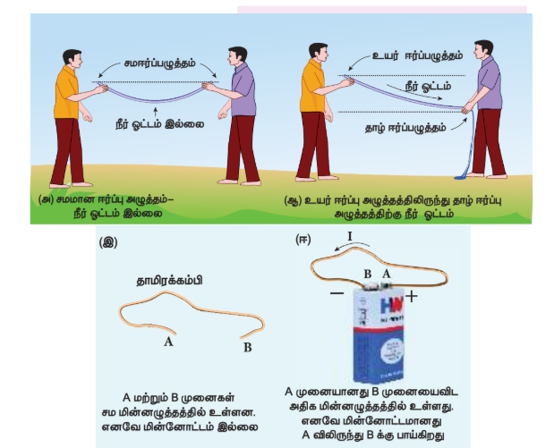

படம் 2.1 நீரோட்டம் மற்றும் மின்னோட்டம்

ஒரு கடத்தியில் மின்னேற்றம் எவ்வாறு கொண்டு செல்லப்படுகிறது என்பதைக் படம் A விளக்குகிறது. இது படம் 2.2 இல் காட்டப்பட்டுள்ளது.

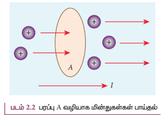
 
t என்ற நேரத்தில் ஒரு கடத்தியின் ஏதேனும் ஒரு குறுக்குவெட்டுப்பரப்பு வழியாக பாயும் மின்னூட்டத்தின் நிறை மின்னூட்டம் Q எனில், அக்கடத்தியில் பாயும் மின்னோட்டம் என்பது I=Q/t ​ஆகும். ஏனெனில் ஒரு கடத்தில் மின்னூட்டங்களின் ஓட்டம் எப்போதும் மாறிலியாக இருப்பதில்லை. எனவே எவ்வேளையிலும் மின்னோட்டத்தைப் பின்வரும் வரையறை செய்கிறோம்.
 
I_avg​=ΔQ/​Δt
 ​ 
இங்கு ΔQ என்பது Δt எனும் நேர இடைவெளியில் கடத்தியின் குறுக்குவெட்டு பரப்பின் வழியாகச் சென்ற மின்னூட்டத்தின் அளவு ஆகும். நேரத்தைப் பொறுத்து மின்னோட்டத்தின் அளவு மாறினால், நேரத்திற்கு நேரம் மாறுபடும். எனவே மின்னோட்டம் என்பது சாராசரி மின்னோட்டத்தின் எல்லை மதிப்பு ஆகும்.
$$
I=\lim_{\Delta t \to 0}\frac{\Delta Q}{\Delta t}=\frac{dQ}{dt}
$$
மின்னோட்டத்தின் SI அலகு ஆம்பியர் (A) ஆகும்.
1A=1C/1s​
 
ஒரு கூலூம் மின்னூட்டம் கொண்ட மின்துகள்கள் ஒரு வினாடி நேரத்தில் செங்குத்தான குறுக்குவெட்டுப் பரப்பைக் கடந்தால் ஏற்படும் மின்னோட்டமே ஒரு ஆம்பியர் மின்னோட்டம் ஆகும். மின்னோட்டம் என்பது ஸ்கேலர் அளவு ஆகும்.
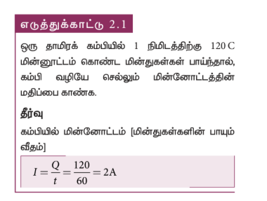
 

### 2.1.1 மரபுமின்னோட்டம்
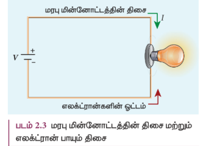
 
ஒரு மின்சுற்றில் மின்னோட்டம் பாயும் போது சுற்றுக்குள் அமைந்துள்ள பயனாக்கிகளிலிருந்து மாறுபட்டு, மின்சுற்றில் மின்னோட்டம் நேர்முனை வாயிலிருந்து எதிர்முனைக்கு பாய்கிறது. மின்னோட்டம் என்பது மறு மின்னோட்டம் அல்லது மின்னோட்டம் .எனப்படும். இம்மரபு மின்னோட்டத்தின் திசையே சோதனை நேர்மின்துகள் (Positive test charge) செல்லும் திசையாகும். ஆனால் மின்சுற்றுகளில் உண்மையில் எலக்ட்ரான்கள் எதிர்மின் வாயிலிருந்து நேர்மின் வாய்க்கு பாய்கின்றன. எனவே எலக்ட்ரான்கள் செல்லும் திசையும், மரபு மின்னோட்டத்தின் திசையும் எதிர்திசையில் பம் 2.3 இல் உள்ளாறு அமைந்தன. 
கணித ரீதியாக பார்த்தால் நேர்மின்துகள்கள் ஒரு திசையில் செல்வது அந்தச் சமமான மின்னூட்டம் கொண்ட எதிர்மின்துகள்கள் எதிர்த்திசையில் செல்வதற்குச் சமமாகும்.
 
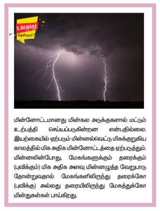

### 2.1.2 இழப்புத்திசைவேகம்

கடத்திகளில் இருக்கும் கட்டுறா எலக்ட்ரான்களை மின்னூட்டத்தை எடுத்துச்செல்லும் ஊர்திகளாகும். இந்த எலக்ட்ரான்கள் கடத்தி முழுவதும் எளிதில் இயங்கி தொடர்ந்து நேர்மின் அயனிகள் மீது மோதும். வெளிப்புற மின்புலம் (External Electric field) இல்லாத நிலையில், எலக்ட்ரான்கள் வெவ்வேறு திசைகளில் செல்கின்றன. எனவே அவற்றின் திசைவேகங்களும் வெவ்வேறானவை. வெளிப்புற மின்புலம் இல்லாத நிலையில் சராசரியாக ஏதேனும் ஒரு திசையில் பயணிக்கும் எலக்ட்ரான்களின் எண்ணிக்கையானது அதற்கு எதிர்த்திசையில் பயணிக்கும் எலக்ட்ரான்களின் எண்ணிக்கைக்கு சமமாக அமையும். எனவே எந்த திசையிலும் எலக்ட்ரான்களின் நிகர இயக்கம் இருப்பதில்லை. எனவே ஒரு கடத்தியில் வெளிப்புற மின்புலம் இல்லாத நிலையில் நிகர மின்னோட்டமும் இருக்காது.

கடத்தியின் முனைகளுக்கிடையே மின்கல அடுக்கை இணைத்து மின்னழுத்த வேறுபாட்டை உருவாக்கினால் கடத்தியினுள் மின்புலம் \( \vec{E} \) உருவாக்கப்படும். இந்த மின்புலம் எலக்ட்ரான்களின் மீது விசையை ஏற்படுத்தி, மின்னோட்டத்தை உருவாக்கும். இங்கு மின்புலம் எலக்ட்ரான்களை முடுக்கும் ஆனால் அயனிகள் எலக்ட்ரான்களை சிதறடித்து எலக்ட்ரான்களின் இயக்க திசையை மாற்றும். எனவே எலக்ட்ரான்களின் பாதை குறுக்கு நெடுக்காக அமையும். இந்த மோதலின் காரணமாக ஏற்படும் குறுக்கு நெடுக்கு இயக்கத்துடன் கூடுதலாக எலக்ட்ரான்கள் கடத்தி வழியே \( \vec{E} \) இன் திசைக்கு எதிர்த்திசையில் ஒரு குறிப்பிட்ட திசைவேகத்தில் மெதுவாகச் செல்லும்.

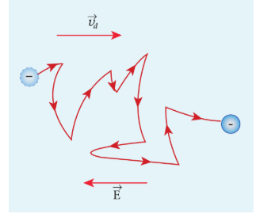

படம் 2.4 எலக்ட்ரானின் சீரற்ற இயக்கமும், இழப்புத் திசைவேகமும்

 
இந்தத் திசைவேகம் இழப்புத் திசைவேகம் \( \vec{v}_d \) எனப்படும். இதனை படம் 2.4 இல் காணலாம். எனவே இழப்புத்திசைவேகம் என்பது கடத்தியில் உள்ள எலக்ட்ரான்களை மின்புலத்திற்கு உட்படுத்தும்போது அவை பெறும் சராசரித் திசைவேகம் ஆகும். அதேபோல் இரு அடுத்தடுத்த மோதல்களுக்கிடைப்பட்ட சராசரி நேரம் என்பது சராசரி தளர்வு நேரம் \( \tau \) எனப்படும். மின்புலத்தினால் எலக்ட்ரான் பெறும் முடுக்கம் \( \vec{a} \) எனில்

$$
\vec{a} = \frac{-e\vec{E}}{m} \quad (\text{ஏனெனில் } \vec{F} = -e\vec{E}) \quad (2.3)
$$

இழப்புத் திசைவேகம் \( \vec{v}_d \)

$$
\begin{aligned} \vec{v}_d &= \vec{a} \tau \\ \vec{v}_d &= -\frac{e\tau}{m} \vec{E} \end{aligned} \quad (2.4)
$$

$$
\vec{v}_d = -\mu \vec{E} \quad (2.5)
$$

இங்கு \( \mu = \frac{e\tau}{m} \) என்பது எலக்ட்ரான்களின் இயக்க எண் ஆகும். இயக்க எண் என்பது ஓரலகு மின்புலத்தினால் ஏற்படும் இழப்புத்திசைவேகத்தின் எண்மதிப்பு ஆகும்.

$$
\mu = \frac{|\vec{v}_d|}{|\vec{E}|} \quad (2.6)
$$

இயக்க எண்ணின் SI அலகு \( \mathrm{m}^2\mathrm{V}^{-1}\mathrm{s}^{-1} \).

மிகச்சிறிய திசைவேகத்தில் எலக்ட்ரான்கள் சென்றால், மிக சற்று உள்ள மின் விளக்கை அடைய பல மணி நேரம் ஆகும். பிறகு எப்படி மின்கலத்தின் ஸ்விட்சை அழுத்தியவுடன் மின் விளக்கு ஒளிர்கிறது? மின் கலத்தின் ஸ்விட்ச் இயக்கப்பட்டவுடன் எலக்ட்ரான்கள் மின்கலத்தின் எதிர் மின் முனையிலிருந்து விலகி நகர்ந்து அருகிலுள்ள எலக்ட்ரான்கள் மீது விசையை ஏற்படுத்தும். இந்நிகழ்வு கடத்தி வழியே ஒளியின் திசைவேகத்தில் செல்லும் மின்புலத்தை உருவாக்கும். அதாவது மின்கலத்திலிருந்து ஆற்றலானது மின்விளக்கிற்கு ஒளியின் திசைவேகத்தில் மின்புலத்தின் மூலம் பரவுகிறது. இதன் காரணமாக ஸ்விட்சை இயக்கியவுடன் மின் விளக்கு ஒளிர்கிறது.

### எடுத்துக்காட்டு 2.2

ஒரு தாமிரக்கம்பிக்கு அளிக்கப்படும் மின்புலத்தின் எண்மதிப்பு \( 570 \ \mathrm{N}\mathrm{C}^{-1} \) எனில் எலக்ட்ரான் பெறும் முடுக்கத்தை கண்டுபிடி.

#### தீர்வு:

\( E = 570 \ \mathrm{N}\mathrm{C}^{-1} \), \( e = 1.6 \times 10^{-19} \ \mathrm{C} \), \( m = 9.11 \times 10^{-31} \ \mathrm{kg} \) மற்றும் \( a = ? \)

\( F = ma = eE \)

$$
a = \frac{eE}{m} = \frac{570 \times 1.6 \times 10^{-19}}{9.11 \times 10^{-31}} = \frac{912 \times 10^{-19} \times 10^{31}}{9.11} = 1.001 \times 10^{14} \ \mathrm{m}\ \mathrm{s}^{-2}
$$

### மின்னோட்டம் பற்றிய தவறான கருத்துக்கள்

(i) மின்கலம் எலக்ட்ரான்களை மின்சுற்றுக்கு அளிக்கிறது என்ற ஒரு கருத்து நிலவுகிறது. இது முற்றிலும் தவறானது. ஒரு மின்கலத்தை கம்பியின் இரு முனைகளுக்கிடையே இணைக்கும் போது, கம்பியில் உள்ள எலக்ட்ரான்களை மின்னோட்டத்தை உருவாக்கும். மின்கலமானது கடத்தும் கம்பியில் மின்னழுத்த வேறுபாட்டை நிறுவி அதன் மூலம் இந்த எலக்ட்ரான்களை குறிப்பிட்ட திசையில் பாயச் செய்கிறது. இந்த மின்னழுத்த வேறுபாட்டின் மூலம் தோன்றும் மின் ஆற்றலானது மின்விளக்கு, மின்விசிரி முதலியவற்றில் பயன்படுகிறது. இதேபோல் நமது வீடுகளில் உள்ள மின்சாதனங்களுக்கு தேவையான மின்னாற்றலையே மின்சார வாரியம் வழங்குகிறது. (ii) அலைபேசியை பயன்படுத்தும்போது பின்வரும் வாக்கியங்களை நாம் அன்றாடம் பயன்படுத்துவோம். அவை “என்னுடைய அலைபேசி மின்கலத்தை மின்னேற்றம் செய்கிறேன்” (charging the battery in my mobile) மற்றும் “என்னுடைய அலைபேசி மின்கலத்தில் மின்துகள்கள் இல்லை” (my mobile phone battery has no charge). இதுபோன்ற வாக்கியங்கள் தவறானவை.

### 2.1.3 மின்னோட்டத்தின் நுண் மாதிரி (Microscopic model of current)

குறுக்கு பரப்பு \( A \) கொண்ட கடத்தியில் மின்புலம் \( \vec{E} \) ஆனது வலப்புறத்திலிருந்து இடதுபுறமாக செயல்படுகிறது என்க. மேலும் ஓரலகு பருமனில் உள்ள எலக்ட்ரான்களின் எண்ணிக்கை \( n \) ஆகும். மேலும் அவை அனைத்தும் சமமான இழுப்புத் திசைவேகம் \( \vec{v}_d \) கொண்டு இயங்குகின்றன. இதனை படம் 2.5 இல் காணலாம்.
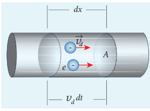

படம் 2.5 மின்னோட்டத்தின் நுண் மாதிரி

 
எலக்ட்ரான்களின் இழுப்புத்திசைவேகம் = \( v_d \)

\( dt \) எனும் சிறிய நேர இடைவெளியில் எலக்ட்ரான்கள் \( dx \) தொலைவுக்கு நகர்கிறது எனில்

$$
v_d = \frac{dx}{dt} \quad ; \quad dx = v_d dt \quad (2.7)
$$

கடத்தியின் குறுக்குவெட்டுபரப்பு \( A \) எனில், இப்பருமனில் \( dx \) நீளத்தில் உள்ள எலக்ட்ரான்களின் எண்ணிக்கை

= பருமன் × ஓரலகு பருமனில் உள்ள எலக்ட்ரான்களின் எண்ணிக்கை

= \( A \ dx \ n \) (2.8)

சமன்பாடு (2.7) இல் உள்ள \( dx \) மதிப்பை சமன்பாடு (2.8) இல் பிரதியிட = \( (A v_d dt) n \)

ஒரு மிகச்சிறிய பருமனில் (Volume element) உள்ள மின்துகள்களின் மொத்த மின்னூட்டம்

\( dQ = \) (மின்னூட்டம்) × (பருமக் கூறில் உள்ள எலக்ட்ரான்களின் எண்ணிக்கை)

\( dQ = (e)(A v_d dt)n \)

எனவே மின்னோட்டம் \( I \)

$$
I = \frac{dQ}{dt}
$$

$$
I = n e A v_d \quad (2.9)
$$

### மின்னோட்ட அடர்த்தி (J)

மின்னோட்ட அடர்த்தி என்பது கடத்தியின் ஓரலகு குறுக்குவெட்டுப் பரப்பு வழியாக பாயும் மின்னோட்டத்தின் அளவாகும்.

$$
J = \frac{I}{A}
$$

மின்னோட்ட அடர்த்தியின் SI அலகு \( \mathrm{A}/\mathrm{m}^2 \). அதாவது \( \mathrm{A}\ \mathrm{m}^{-2} \).

$$
J = \frac{neA v_d}{A} \quad \text{(சமன்பாடு 2.9 லிருந்து)}
$$

$$
J = n e v_d \quad (2.10)
$$

மேற்கண்ட சமன்பாடு என்பது மின்னோட்டத்தின் திசையானது பரப்பு \( A \) விற்கு செங்குத்தாக இருந்தால் மட்டுமே சரியாக அமையும். பொதுவாக, மின்னோட்ட அடர்த்தி ஒரு வெக்டர் அளவாகும். இதனை பின்வருமாறு குறிப்பிடலாம்.

$$
\vec{J} = n e \vec{v}_d
$$

சமன்பாடு (2.4) லிருந்து \( \vec{v}_d \) ன் மதிப்பை பிரதியிடலாம்.

$$
\vec{J} = -\frac{n e^2 \tau}{m} \vec{E} \quad (2.11)
$$

$$
\vec{J} = -\sigma \vec{E}
$$

இதுவரை நாம் எலக்ட்ரான்கள் செல்லும் திசையைக் கணக்கில் எடுத்துக்கொண்டோம். அதனால்தான் மேலே உள்ள சமன்பாட்டில் \( \vec{J} \) ஆனது \( \vec{E} \) க்கு எதிர்த்திசையில் அமைகிறது. ஆனால் மரபுப்படி, மின்னோட்ட அடர்த்தியின் திசையானது நேர்மின்துகள் செல்லும் திசையிலேயே (மின்புலத்தின் திசை) அமையும். எனவே மேற்கண்ட சமன்பாடு பின்வருமாறு எழுதப்படுகிறது.

$$
\vec{J} = \sigma \vec{E} \quad (2.12)
$$

இங்கு \( \sigma = \frac{n e^2 \tau}{m} \) என்பது மின்கடத்து எண் எனப்படும். சமன்பாடு (2.12) ஆனது ஓம் விதியின் நுண் வடிவம் ஆகும்.

மின்கடத்து எண்ணின் தலைகீழ் மதிப்பு மின்தடை எண் (\( \rho \)) ஆகும். [இதனை 2.2.1 பகுதியில் பார்க்கலாம்].

$$
\rho = \frac{1}{\sigma} = \frac{m}{n e^2 \tau} \qquad (2.13)
$$

### எடுத்துக்காட்டு 2.3

\( 0.5 \ \mathrm{mm}^2 \) குறுக்குவெட்டுப்பரப்பு கொண்ட தாமிரக்கம்பியில், \( 0.2 \ \mathrm{A} \) அளவுள்ள மின்னோட்டம் பாய்கிறது. அத்தாமிரக்கம்பியில் உள்ள கட்டுறா எலக்ட்ரான்களின் அடர்த்தி \( 8.4 \times 10^{28} \ \mathrm{m}^{-3} \) எனில் இக்கட்டுறா எலக்ட்ரான்களின் இழுப்புத்திசை வேகத்தை கணக்கிடுக.

#### தீர்வு

கம்பியின் குறுக்கு பரப்பு \( A \) வில் உள்ள மின்னோட்டம் மற்றும் எலக்ட்ரான்களின் இழுப்புத்திசை வேகம் ஆகியவற்றிற்கு இடையே உள்ள தொடர்பு

$$
\begin{aligned} v_d &= \frac{I}{n e A} = \frac{0.2}{8.4 \times 10^{28} \times 1.6 \times 10^{-19} \times 0.5 \times 10^{-6}} \\ v_d &= 0.03 \times 10^{-3} \ \mathrm{m}\ \mathrm{s}^{-1} \end{aligned}
$$
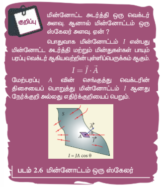
 
### எடுத்துக்காட்டு 2.4

ஒரு கடத்தி வழியே \( 32 \ \mathrm{A} \) மின்னோட்டம் பாயும்போது, ஓரலகு நேரத்தில் கடத்தியில் பாயும் எலக்ட்ரான்களின் எண்ணிக்கையை காண்க.

#### தீர்வு

\( I = 32 \ \mathrm{A} \), \( t = 1 \ \mathrm{s} \)

ஒரு எலக்ட்ரானின் மின்னூட்டம், \( e = 1.6 \times 10^{-19} \ \mathrm{C} \)

ஒரலகு நேரத்தில் பாயும் எலக்ட்ரான்களின் எண்ணிக்கை, \( n = ? \)

$$
I = \frac{q}{t} = \frac{n e}{t}
$$

$$
n = \frac{I t}{e}
$$

$$
n = \frac{32 \times 1}{1.6 \times 10^{-19}}
$$

$$
n = 20 \times 10^{19} = 2 \times 10^{20} \text{ எலக்ட்ரான்கள்}
$$

## 2.2 ஓம் விதி

ஓம் விதியானது \( \vec{J} = \sigma \vec{E} \) என்ற சமன்பாட்டிலிருந்து பெறப்படுகிறது. \( l \) நீளமும் \( A \) குறுக்கு வெட்டு பரப்பும் கொண்ட கம்பியின் ஒரு பகுதியை கருதுவோம்.
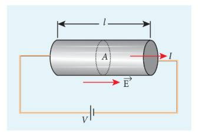

படம் 2.7 கடத்தியின் வழியே மின்னோட்டம்

 
கம்பியின் முனைகளுக்கிடையே \( V \) எனும் மின்னழுத்த வேறுபாட்டை அளிக்கும்போது, கம்பியில் நிகர மின்புலம் தோன்றி மின்னோட்டத்தை உருவாக்கும். கம்பியின் நீளம் முழுவதும் மின்புலமானது சீரானதாக உள்ளதாகக் கருதினால், மின்னழுத்த வேறுபாடு (வோல்டேஜ்) \( V \) யை பின்வருமாறு எழுதலாம்.

$$
V = E l
$$

மின்னோட்ட அடர்த்தியின் எண்மதிப்பு

$$
J = \sigma E = \sigma \frac{V}{l}
$$

அதேபோல் \( J = \frac{I}{A} \). எனவே சமன்பாடு (2.14) ஐ பின்வருமாறு எழுதலாம்

$$
\frac{I}{A} = \sigma \frac{V}{l}
$$

மேற்கண்ட சமன்பாட்டை மாற்றி அமைக்கும்போது, நமக்கு கிடைப்பது

$$
V = I \left(\frac{l}{\sigma A}\right)
$$

இச்சமன்பாட்டில் \( \frac{l}{\sigma A} \) என்பது கடத்தியின் மின்தடை \( R \) ஆகும். இதிலிருந்து நாம் அறிவது, ஒரு கடத்தியின் மின்தடையானது கடத்தியின் நீளத்திற்கு நேர்த்தகவிலும், அக்கடத்தியின் குறுக்குவெட்டுப் பரப்பிற்கு எதிர்த்தகவிலும் அமைகிறது என்பதே. “வெப்பநிலை மாறாமல் உள்ள போது கடத்திக்குக் குறுக்கேயுள்ள மின்னழுத்த வேறுபாடானது அதில் பாயும் மின்னோட்டத்திற்கு நேர்த்தகவில் இருக்கும்”. இதுவே ஓம் விதியாகும்.

ஓம் விதியின் பயனாட்டு வடிவத்தை பின்வருமாறு எழுதலாம்.

$$
V = I R
$$

மேற்கண்ட சமன்பாட்டின்படி, கடத்தியின் மின்தடை என்பது கடத்தியின் முனைகளுக்கிடையே உள்ள மின்னழுத்த வேறுபாட்டிற்கும் கடத்தியின் வழியேயான மின்னோட்டத்திற்கும் உள்ள விகிதமாகும்.

$$
R = \frac{V}{I}
$$

மின்தடையின் SI அலகு ஓம் (\( \Omega \)). சமன்பாடு (2.16) இன் மூலம் நாம் அறிவது, மின்னோட்டம் மற்றும் மின்னழுத்த வேறுபாட்டிற்கும் (வோல்டேஜ்) இடைப்பட்ட வரைபடம் ஒரு நேர்க்கோடாகும். இந்த நேர்க்கோட்டின் சாய்வு மின்தடை \( R \) ன் தலைகீழ் மதிப்புக்குச் சமமாகும். இதனை படம் 2.8 (அ) ன் மூலம் உணரலாம்.
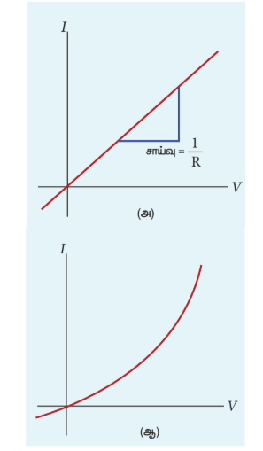
 

படம் 2.8 மின்னோட்டம் மற்றும் மின்னழுத்த வேறுபாடு வரைபடம். (அ) ஓம் விதிக்கு உட்படும் கடத்தி (ஆ) ஓம் விதிக்கு உட்படாத கருவி (டையோடு). [டையோடு பற்றி பன்னிரண்டாம் வகுப்பு பாடம் 10 இல் விரிக்கப்பட்டுள்ளது].

ஒரு பொருளின் மீது செல்லும் மின்னோட்டம் மற்றும் அப்பொருளின் குறுக்கே உள்ள மின்னழுத்த வேறுபாடு ஆகிய இரண்டிற்குமான வரைபடம் நேர்க்கோடாக அமைந்தால், அப்பொருட்கள் ஓம் விதிக்கு உட்படும் பொருட்கள் ஆகும் (படம் 2.8 (அ)).
 
படம் 2.8 (ஆ) வில் உள்ளவாறு மின்னோட்டம் மற்றும் மின்னழுத்த வேறுபாட்டிற்கான வரைபடம் நேர்க்கோடாக அமையாமல் சிக்கலான வடிவில் இருந்தால் இவ்வகை பொருட்கள் அல்லது கருவிகள் ஓம் விதிக்கு உட்படுவதில்லை. மேலும் இவ்வகை பொருட்களுக்கு மின்தடை மாறிலியாகவும் அமையாது.

### எடுத்துக்காட்டு 2.5

\( 24 \ \Omega \) மின்தடையின் குறுக்கே மின்னழுத்த வேறுபாடு \( 12 \ \mathrm{V} \) எனில், மின்தடை வழியே செல்லும் மின்னோட்டத்தின் மதிப்பு என்ன?
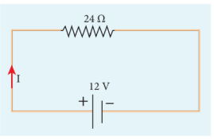
 
\( V = 12 \ \mathrm{V} \) மேலும் \( R = 24 \ \Omega \)

மின்னோட்டம், \( I = ? \)

ஓம் விதியிலிருந்து, \( I = \frac{V}{R} = \frac{12}{24} = 0.5 \ \mathrm{A} \)

### 2.2.1 மின்தடை எண்

ஒரு கடத்தியின் மின்தடை

$$
R = \frac{l}{\sigma A} \quad (2.18)
$$

என முன்பகுதியில் கண்டோம். இங்கு \( \sigma \) என்பது அக்கடத்தியின் மின்கடத்து எண் ஆகும். இது கடத்தி செய்யப் பயன்படும் பொருளின் தன்மையை மட்டுமே சார்ந்தது. ஆனால் கடத்தியின் அளவையோ, வடிவத்தையோ பொறுத்தது அல்ல.

மேலே கண்ட சமன்பாட்டில் உள்ள மாறிலி \( \rho \) ஆனது பொருளின் மின்தடை எண் எனப்படும். ஒரு பொருளின் மின்தடை எண் என்பது அதன் மின்கடத்து எண்ணின் தலைகீழ் மதிப்புக்குச் சமமாகும்.

$$
\rho = \frac{1}{\sigma} \qquad (2.19)
$$

\( l = 1 \ \mathrm{m} \) மற்றும் \( A = 1 \ \mathrm{m}^2 \) எனில், மின்தடை \( R = \rho \) ஆகும். இதனை வேறுவிதமாக கூறினால் பொருளின் மின்தடை எண் என்பது ஓரலகு நீளமும் ஓரலகு குறுக்கு வெட்டு பரப்பும் கொண்ட கடத்தியானது மின்னோட்டத்திற்கு அளிக்கும் மின்தடை ஆகும். இதன் SI அலகு ஓம்-மீட்டர் (\( \Omega \ \mathrm{m} \)).

சமன்பாடு (2.19) ஐப் பயன்படுத்தி சமன்பாடு (2.18) ஐ மாற்றி அமைக்க

$$
R = \rho \frac{l}{A} \qquad (2.20)
$$

எனவே ஒரு பொருளின் மின்தடையானது அதன் நீளத்திற்கு நேர்த்தகவிலும், அப்பொருளின் குறுக்கு வெட்டு பரப்பிற்கு எதிர்த்தகவிலும் அமையும்.

மின்தடை எண்ணைப் பொருத்து பொருட்களை கடத்திகள், குறைக்கடத்திகள், மின் கடத்தாப் பொருட்கள் (Insulators) என வகைப்படுத்தலாம். கடத்திகள் மிகக் குறைந்த மின் தடை எண்ணையும், மின்கடத்தாப் பொருட்கள் மிக அதிக மின்தடை எண்ணையும் மற்றும் குறைகடத்திகளின் மின்தடை எண் கடத்திகளை விட அதிகமாகவும் ஆனால் மின்கடத்தாப் பொருட்களை விட குறைவாகவும் அமையும். 

அட்டவணை (2.1) இல் சில கடத்திகள், மின்கடத்தாப் பொருட்கள் மற்றும் குறை கடத்திகளின் மின்தடை எண்கள் தரப்பட்டுள்ளன.

**அட்டவணை 2.1 பல்வேறு பொருட்களின் மின்தடை எண் \( 20^\circ \mathrm{C} \) இல்**

| பொருட்கள் | மின்தடை எண் \( \rho \) (\( \Omega \ \mathrm{m} \)) |
|---|---|
| **மின்கடத்தாப் பொருட்கள் (Insulators)** | |
| தாய நீர் | \( 2.5 \times 10^5 \) |
| கண்ணாடி | \( 10^{10} - 10^{14} \) |
| கடின இரப்பர் | \( 10^{13} - 10^{16} \) |
| சோடியம் குளோரைடு | \( 10^{14} \) |
| உருகிய குவார்ட்ஸ் | \( 10^{16} \) |
| **குறை கடத்திகள் (semi-conductors)** | |
| ஜெர்மானியம் | \( 0.46 \) |
| சிலிக்கான் | \( 640 \) |
| **கடத்திகள் (conductors)** | |
| வெள்ளி | \( 1.6 \times 10^{-8} \) |
| தாமிரம் | \( 1.7 \times 10^{-8} \) |
| அலுமினியம் | \( 2.7 \times 10^{-8} \) |
| டங்க்ஸ்டன் | \( 5.6 \times 10^{-8} \) |
| இரும்பு | \( 10 \times 10^{-8} \) |

### எடுத்துக்காட்டு 2.6

ஒரு கம்பியின் மின்தடை \( 20 \ \Omega \). இக்கம்பி தனது ஆரம்ப நீளத்திலிருந்து எட்டு மடங்கு நீளம் அதிகரிக்குமாறு சீராக நீட்டப்பட்டால், கம்பியின் புதிய மின்தடை என்ன?

#### தீர்வு

\( R_1 = 20 \ \Omega \), \( R_2 = ? \)

ஆரம்ப நீளம் \( l_1 \) என்பதை \( l \) எனக் கொள்வோம்.

புதிய நீளம், \( l_2 = 8 l_1 \) அதாவது \( l_2 = 8l \)

ஆரம்ப மின்தடை, \( R_1 = \rho \frac{l_1}{A_1} \)

புதிய மின்தடை \( R_2 = \rho \frac{l_2}{A_2} = \rho \frac{(8l)}{A_2} \)

கம்பி நீட்டப்பட்டாலும், அதன் பருமன் மாறாது.

ஆரம்ப பருமன் = இறுதி பருமன்

\( A_1 l_1 = A_2 l_2 \), \( A_1 l = A_2 (8l) \)

\( \frac{A_1}{A_2} = \frac{8l}{l} = 8 \)

\( R_2 \) வின் சமன்பாட்டை \( R_1 \) இன் சமன்பாட்டினால் வகுக்க

$$
\frac{R_2}{R_1} = \frac{\rho(8l)}{\rho l} \times \frac{A_1}{A_2}
$$

$$
\frac{R_2}{R_1} = \frac{A_1}{A_2} \times 8
$$

\( \frac{A_1}{A_2} \) வின் மதிப்பை பிரதியிட

$$
\frac{R_2}{R_1} = 8 \times 8 = 64
$$

$$
R_2 = 64 \times 20 = 1280 \ \Omega
$$

எனவே, கம்பியை நீட்டும்போது அதன் மின்தடையும் அதிகரிக்கிறது.

### எடுத்துக்காட்டு 2.7

படத்தில் காட்டப்பட்டுள்ளவாறு \( A \) உயரம், \( B \) அகலம் மற்றும் \( C \) நீளம் கொண்ட ஒரு செவ்வக வடிவ உலோக பெட்டியைக் கருதுவோம்.
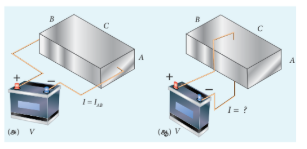
பெட்டியின் \( A \) மற்றும் \( B \) முகங்களுக்கிடையே \( V \) என்ற மின்னழுத்த வேறுபாடு அளிக்கப்படுகிறது எனில் (படம்(அ)) \( I_{AB} \) என்ற மின்னோட்டம் பாய்கிறது. பெட்டியின் \( B \) மற்றும் \( C \) முகங்களுக்கிடையே \( V \) என்ற அதே மின்னழுத்த வேறுபாட்டை அளித்தால் (படம் (ஆ)) உருவாகும் மின்னோட்டத்தை கண்டுபிடி. உனது விடையை மின்னோட்டம் \( I_{AB} \) மதிப்பின் மடங்காக எழுதுக.

#### தீர்வு

முதல் நேர்வில், பெட்டியின் மின்தடை

$$
R_{AB} = \rho \frac{\text{நீளம்}}{\text{பரப்பு}} = \rho \frac{C}{AB}
$$

மின்னோட்டம் \( I_{AB} = \frac{V}{R_{AB}} = \frac{V}{\rho} \cdot \frac{AB}{C} \) \qquad (1)

இரண்டாம் நேர்வில், பெட்டியின் மின்தடை

$$
R_{BC} = \rho \frac{A}{BC}
$$

மின்னோட்டம் \( I_{BC} = \frac{V}{R_{BC}} = \frac{V}{\rho} \cdot \frac{BC}{A} \) \qquad (2)

\( I_{AB} \) ன் வாயிலாக \( I_{BC} \) ஐ பெற சமன்பாடு (2) ஐ \( \frac{A}{A} \) ஆல் பெருக்கி வகுக்க நமக்கு கிடைப்பது

$$
I_{BC} = \frac{V}{\rho} \cdot \frac{BC}{A} \cdot \frac{A}{A} = \left( \frac{V}{\rho} \cdot \frac{AB}{C} \right) \cdot \frac{C^2}{A^2} = I_{AB} \cdot \frac{C^2}{A^2}
$$

\( C > A \) என்பதால் \( I_{BC} > I_{AB} \)

### மனித உடலின் மின்தடை

மனித உடலில் அதிக அளவு நீர் உள்ளதால் மின்தடை குறைவாக கிட்டத்தட்ட \( 200 \ \Omega \) அளவே இருக்கும். மேலும் உலர்ந்த தோலின் மின்தடை மிக அதிகமாக கிட்டத்தட்ட \( 500 \ \mathrm{k}\Omega \) அளவு இருக்கும். ஆனால் தோலானது ஈரமானதாக இருந்தால் மின்தடையின் மதிப்பு குறைந்து கிட்டத்தட்ட \( 1000 \ \Omega \) அளவே இருக்கும். எனவே மின் இணைப்புகளை ஈரமான கைகளுடன் தொடுவது மிகவும் ஆபத்தானதாகும்.

### 2.2.2 மின்தடையாக்கிகள் தொடரிணைப்பு மற்றும் பக்க இணைப்பு

ஒரு மின் சுற்றில் மிக அதிக எண்ணிக்கையில் மின்தடையாக்கிகள் பல்வேறு வழிகளில் இணைக்கப்பட்டிருக்கும். ஒவ்வொரு வகை மின்சுற்றிலும் மின்தடையாக்கிகளின் இணைப்பிற்கேற்ப தொகுப்பன் மின்தடையை நாம் கணக்கிடலாம்.

#### தொடரிணைப்பு

இரண்டு அல்லது அதற்கு மேற்பட்ட மின்தடையாக்கிகள் ஒன்றைப்பின் ஒன்றாக இணைப்பது தொடரிணைப்பு ஆகும். இவை எளிய மின்தடையாக்கிகளாகவே (light bulb) அல்லது வெப்பமேற்றும் சாதனங்களாகவே அல்லது வேறு மின்சாதனங்களாகவே அமையலாம். படம் 2.9 (அ) வில் \( R_1 \), \( R_2 \) மற்றும் \( R_3 \) ஆகிய மின்தடையாக்கிகள் தொடரிணைப்பில் உள்ளன. மின்துகள்கள் மின்சுற்றில் எங்கும் சேகரமாகாது என்பதால் \( R_1 \) இல் பாயும் அதே அளவு மின்துகள்கள் \( R_2 \) மற்றும் \( R_3 \) வழியாகவும் பாயும். எனவே, எல்லா மின்தடையாக்கிகளிலும் ஒரு அளவான மின்னோட்டமே (\( I \)) பாயும். ஓம் விதிப்படி ஒரு அளவுள்ள மின்னோட்டம் தொடரிணைப்பில் உள்ள வெவ்வேறு மதிப்புடைய மின்தடையாக்கிகள் வழியே பாயும்போது, மின்தடையாக்கிகளின் குறுக்கே உருவாகும் மின்னழுத்த வேறுபாடுகள் மாறுபடும்.
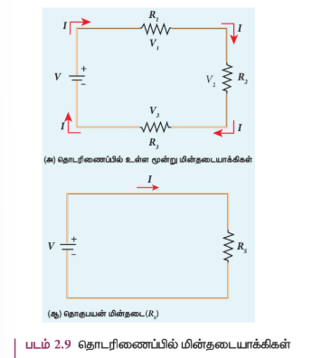

\( V_1 \), \( V_2 \) மற்றும் \( V_3 \) என்பன முறையே \( R_1 \), \( R_2 \) மற்றும் \( R_3 \) மின்தடையாக்கிகளின் குறுக்கே உள்ள மின்னழுத்த வேறுபாடுகள் (வோல்டேஜ்) எனில், \( V_1 = I R_1 \), \( V_2 = I R_2 \), \( V_3 = I R_3 \) ஆகும். ஆனால் மொத்த மின்னழுத்த வேறுபாடு \( V \) ஆனது மின்தடையாக்கிகளின் குறுக்கே உள்ள தனித்தனி மின்னழுத்த வேறுபாடுகளின் கூடுதலுக்குச் சமமாகும்.

$$
\begin{align*} V &= V_1 + V_2 + V_3 = I R_1 + I R_2 + I R_3 \quad (2.21) \\ V &= I (R_1 + R_2 + R_3) \\ V &= I R_S \quad (2.22) \end{align*}
$$

இங்கு \( R_S \) என்பது தொகுப்பன் மின்தடையைக் குறிக்கிறது.

$$
R_S = R_1 + R_2 + R_3 \qquad (2.23)
$$

எனவே பல மின் தடையாக்கிகள் தொடரிணைப்பில் உள்ளபோது, மொத்த அல்லது தொகுப்பன் மின்தடையானது தனித்தனி மின்தடைகளின் கூடுதலுக்குச் சமமாகும். இது படம் 2.9(ஆ) வில் காட்டப்பட்டுள்ளது.

**குறிப்பு:** தொடரிணைப்பில் உள்ள மின்தடையாக்கிகளின் தொகுப்பன் மின்தடையானது தனித்தனி மின்தடைகளின் மதிப்புகளை விட அதிகமாக அமையும்.

### எடுத்துக்காட்டு 2.8

\( 24 \ \mathrm{V} \) மின்கலத்துடன் இணைக்கப்பட்டுள்ள \( 4 \ \Omega \) மற்றும் \( 6 \ \Omega \) மின்தடையாக்கிகளுக்கு குறுக்கே உள்ள மின்னழுத்த வேறுபாடுகளை காண்க. மேலும் இந்த மின்சுற்றில் உள்ள தொகுப்பன் மின்தடையைக் காண்க.
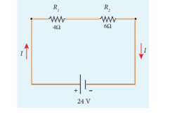
#### தீர்வு

தொடரிணைப்பில் உள்ள மின்தடையாக்கிகளின் தொகுப்பன் மின்தடை \( = 4 \ \Omega + 6 \ \Omega = 10 \ \Omega \)

மின்சுற்றில் பாயும் மின்னோட்டம் \( = \frac{24 \ \mathrm{V}}{10 \ \Omega} = 2.4 \ \mathrm{A} \)

\( 4 \ \Omega \) மின்தடையாக்கியின் குறுக்கே உள்ள மின்னழுத்த வேறுபாடு

$$
V_1 = I R_1 = 2.4 \ \mathrm{A} \times 4 \ \Omega = 9.6 \ \mathrm{V}
$$

\( 6 \ \Omega \) மின்தடையாக்கியின் குறுக்கே உள்ள மின்னழுத்த வேறுபாடு

$$
V_2 = I R_2 = 2.4 \ \mathrm{A} \times 6 \ \Omega = 14.4 \ \mathrm{V}
$$

#### பக்க இணைப்பில் மின்தடையாக்கிகள்

ஒரு மின்னழுத்த வேறுபாட்டின் குறுக்கே பல மின்தடையாக்கிகளை இணைத்தால் அவை பக்க இணைப்பில் உள்ளன எனலாம். இது படம் 2.10(அ) வில் காட்டப்பட்டுள்ளது.

இவ்வகை சுற்றுகளில், மின்கலத்திலிருந்து வெளியேறும் மொத்த மின்னோட்டம் \( I \) ஆனது மூன்று பாதைகளில் பிரிகிறது. \( R_1 \), \( R_2 \) மற்றும் \( R_3 \) வழியே பாயும் மின்னோட்டங்கள் முறையே \( I_1 \), \( I_2 \) மற்றும் \( I_3 \) என்க. மின்னூட்டங்களின் மாறா விதிப்படி மொத்த மின்னோட்டம் \( I \) ஆனது இம்மின்தடையாக்கிகள் வழியே பாயும் மின்னோட்டங்களின் கூடுதலுக்குச் சமமாகும்.

$$
I = I_1 + I_2 + I_3 \qquad (2.24)
$$

மேலும் ஒவ்வொரு மின்தடையாக்கிக்கும் குறுக்கேயும் உள்ள மின்னழுத்த வேறுபாடும் சமம் என்பதால், ஒவ்வொரு மின்தடையாக்கிக்கும் நாம் ஓம் விதியை பயன்படுத்தலாம்.

$$
I_1 = \frac{V}{R_1}, \quad I_2 = \frac{V}{R_2}, \quad I_3 = \frac{V}{R_3} \qquad (2.25)
$$

இம்மதிப்புகளை சமன்பாடு (2.24) இல் பிரதியிட

$$
I = \frac{V}{R_1} + \frac{V}{R_2} + \frac{V}{R_3} = V \left[ \frac{1}{R_1} + \frac{1}{R_2} + \frac{1}{R_3} \right]
$$

$$
I = \frac{V}{R_p}
$$
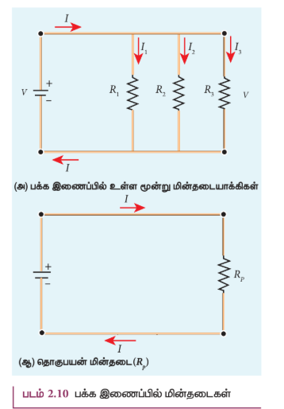
$$
\frac{1}{R_p} = \frac{1}{R_1} + \frac{1}{R_2} + \frac{1}{R_3} \qquad (2.26)
$$

இங்கு \( R_p \) என்பது பக்க இணைப்பில் உள்ள மின்தடையாக்கிகளின் தொகுப்பன் மின்தடை ஆகும். எனவே பல மின்தடையாக்கிகள் பக்க இணைப்பில் இணைக்கப்படும்போது தனித்தனி மின்தடைகளின் தலைகீழ் மதிப்புகளின் கூடுதல், தொகுப்பன் மின்தடையின் தலைகீழ் மதிப்புக்குச் சமம். இதனை படம் 2.10 (ஆ) இல் காணலாம்.

**குறிப்பு:** பக்க இணைப்பில் மின்தடையாக்கிகள் இணைக்கப்படும்போது தொகுப்பன் மின்தடை தனித்தனி மின்தடைகளின் மதிப்பை விட குறைவானதாக இருக்கும்.

வீட்டு உபயோக சாதனங்கள் எப்போதும் பக்க இணைப்பில் இணைக்கப்பட்டிருக்கும். அப்போதுதான் ஏதாவது ஒரு சாதனம் பழுதடைந்தால் அதைத்தவிர்த்து மற்ற சாதனங்கள் வேலை செய்யும்.

### எடுத்துக்காட்டு 2.9

பின்வரும் மின்சுற்றில் தொகுப்பன் மின்தடையைக் காண்க. மேலும் \( I \), \( I_1 \) மற்றும் \( I_2 \) ஆகிய மின்னோட்டங்களையும் கண்டுபிடி.
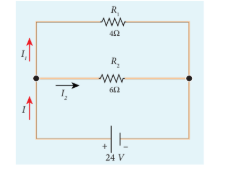
#### தீர்வு

மின்தடையாக்கிகள் பக்க இணைப்பில் இணைக்கப்பட்டுள்ளதால், தொகுப்பன் மின்தடை

$$
\frac{1}{R_p} = \frac{1}{R_1} + \frac{1}{R_2} = \frac{1}{4} + \frac{1}{6}
$$

$$
\frac{1}{R_p} = \frac{5}{12} \quad \text{அல்லது} \quad R_p = \frac{12}{5} = 2.4 \ \Omega
$$

மின்தடையாக்கிகள் பக்க இணைப்பில் உள்ளதால், எல்லா மின்தடையாக்கிகளின் குறுக்கேயும் மின்னழுத்த வேறுபாடு சமமாக இருக்கும்.

$$
\begin{aligned} I_1 &= \frac{V}{R_1} = \frac{24 \ \mathrm{V}}{4 \ \Omega} = 6 \ \mathrm{A} \\ I_2 &= \frac{V}{R_2} = \frac{24}{6} = 4 \ \mathrm{A} \end{aligned}
$$

மின்சுற்றில் பாயும் மொத்த மின்னோட்டம்

$$
I = I_1 + I_2 = 6 \ \mathrm{A} + 4 \ \mathrm{A} = 10 \ \mathrm{A}
$$

### எடுத்துக்காட்டு 2.10

இரண்டு மின்தடையாக்கிகள் தொடரிணைப்பு மற்றும் பக்க இணைப்புகளில் இணைக்கப்படும் போது தொகுப்பன் மின்தடைகள் முறையே \( 15 \ \Omega \) மற்றும் \( \frac{56}{15} \ \Omega \) எனில் தனித்தனி மின்தடைகளின் மதிப்புகளை காண்க.

#### தீர்வு

\( R_s = R_1 + R_2 = 15 \ \Omega \) (1)

\( R_p = \frac{R_1 R_2}{R_1 + R_2} = \frac{56}{15} \ \Omega \)  (2)

சமன்பாடு (1) விருந்து \( R_1 + R_2 \) மதிப்பை சமன்பாடு (2) இல் பிரதியிட

$$
\frac{R_1 R_2}{15} = \frac{56}{15}
$$

$$
\therefore R_1 R_2 = 56
$$

\( R_2 = \frac{56}{R_1} \ \Omega \)  (3)

சமன்பாடு (3) விருந்து \( R_2 \) ன் மதிப்பை சமன்பாடு (1) இல் பிரதியிட

$$
R_1 + \frac{56}{R_1} = 15
$$

எனவே \( \frac{R_1^2 + 56}{R_1} = 15 \)

\( R_1^2 + 56 = 15 R_1 \)

\( R_1^2 - 15 R_1 + 56 = 0 \)

இச்சமன்பாட்டை காரணிப்படுத்துதல் மூலமாகத் தீர்க்கலாம்.

\( R_1 = 8 \ \Omega \) எனில்

சமன்பாடு (1) இல் பிரதியிட

\( 8 + R_2 = 15 \)

\( R_2 = 15 - 8 = 7 \ \Omega \), i.e., (அதாவது \( R_1 = 8 \ \Omega \); \( R_2 = 7 \ \Omega \))

\( R_1 = 7 \ \Omega \) எனில்

சமன்பாடு (1) இல் பிரதியிட

\( 7 + R_2 = 15 \)

\( R_2 = 8 \ \Omega \), i.e., (அதாவது \( R_1 = 7 \ \Omega \); \( R_2 = 8 \ \Omega \))

### எடுத்துக்காட்டு 2.11

கொடுக்கப்பட்டுள்ள படத்தில் உள்ள \( A \) மற்றும் \( B \) புள்ளிகளுக்கிடையே உள்ள தொகுப்பன் மின்தடையைக் காண்க.
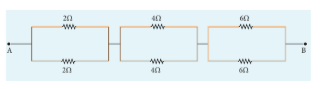
#### தீர்வு

மின்தடையாக்கிகள் பக்க இணைப்பில் இணைக்கப்பட்டுள்ளதால், தொகுப்பன் மின்தடை

$$
\frac{1}{R_p} = \frac{1}{R_1} + \frac{1}{R_2} + \frac{1}{R_3} = \frac{1}{2} + \frac{1}{3} + \frac{1}{6}
$$

$$
\frac{1}{R_p} = \frac{3+2+1}{6} = \frac{6}{6} = 1
$$

\( R_p = 1 \ \Omega \)

எனவே \( A \) மற்றும் \( B \) புள்ளிகளுக்கிடையே தொகுப்பன் மின்தடை \( 1 \ \Omega \) ஆகும்.

### 2.2.3 கார்பன் மின்தடையாக்கிகள்

படம் 2.11 நமது ஆய்வகங்களில் பயன்படுத்தப்படும் மின்தடைகள்

கார்பன் மின்தடையாக்கிகளில் பீங்கான் உள்ளகத்தின் மீது மெல்லிய கார்பன் படிகம் வார்க்கப்பட்டிருக்கும் (படம் 2.11). இந்த மின்தடையாக்கிகள் செலவு குறைவானதாகவும் சிறிய அளவிலும், நீண்ட நாள் உழைக்கக்கூடியனவாகவும் அமைகின்றன. மின்தடையாக்கிகளின் மதிப்பைக் குறிக்க அதன் மீது வரையப்பட்ட நிற வளையங்கள் பயன்படுகின்றன. இதனை அட்டவணை 2.2 இல் காணலாம்.

முதல் இரண்டு வளையங்கள் மின்தடையின் முக்கிய எண்ணுருக்களாகவும், மூன்றாவது வளையத்திற்குரிய எண் குறியீடு பத்தின் அடுக்கு பெருக்கலாகவும் அமையும். நான்காவது வளையம் மின்தடை மாறுபடும் அளவை (Tolerance) குறிக்கும்.

**அட்டவணை 2.2 மின்தடைகளில் நிற வளையங்கள்**

| நிறம் | எண் | பெருக்க அளவு | மாறுபடும் அளவு (tolerance) |
|---|---|---|---|
| கருப்பு | 0 | \( 10^0 \) | |
| பழுப்பு | 1 | \( 10^1 \) | |
| சிவப்பு | 2 | \( 10^2 \) | |
| ஆரஞ்சு | 3 | \( 10^3 \) | |
| மஞ்சள் | 4 | \( 10^4 \) | |
| பச்சை | 5 | \( 10^5 \) | |
| நீலம் | 6 | \( 10^6 \) | |
| ஊதா | 7 | \( 10^7 \) | |
| சாம்பல் | 8 | \( 10^8 \) | |
| வெள்ளை | 9 | \( 10^9 \) | |
| தங்கம் | | \( 10^{-1} \) | \( 5\% \) |
| வெள்ளி | | \( 10^{-2} \) | \( 10\% \) |
| நிறமற்றது | | | \( 20\% \) |

நான்காவது வளையம் இடம் பெறவில்லையெனில் மாறுபடும் அளவு \( 20\% \) ஆகும்.

படம் 2.12 இல் காட்டப்படுள்ள மின்தடையாக்கியில், முதல் இலக்கம் = 5 (பச்சை), இரண்டாவது இலக்கம் = 6 (நீலம்), பத்தின் மடங்கு பெருக்கம் = \( 10^3 \) (ஆரஞ்சு) மற்றும் மாறுபடும் அளவு = \( 5\% \) (தங்கம்). மின்தடையாக்கியின் மதிப்பு = \( 56 \times 10^3 \ \Omega \) அல்லது \( 56 \ \mathrm{k}\Omega \) மற்றும் மாறுபடும் அளவு \( 5\% \).

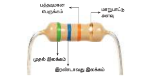

படம் 2.12 மின்தடைகளில் நிறக்குறியீடு

 

### 2.2.4 வெப்பநிலையைச் சார்ந்த மின்தடை எண்

பொருட்களின் மின்தடை எண் வெப்பநிலையைச் சார்ந்து அமையும். பரந்த வெப்பநிலை நெடுக்கங்களுக்கு, கடத்திகளில் வெப்பநிலை உயரும்போது மின்தடை எண் அதிகரிக்கும் என ஆய்வுகள் மூலம் நிரூபிக்கப்பட்டுள்ளது. இதனை பின்வரும் சமன்பாடு மூலம் அறியலாம்.

$$
\rho_T = \rho_0 \left[ 1 + \alpha (T - T_0) \right] \qquad (2.27)
$$

இங்கு \( \rho_T \) என்பது \( T \ ^\circ \mathrm{C} \) வெப்பநிலையில் மின்தடை எண், \( \rho_0 \) என்பது \( T_0 \) வெப்பநிலையில் அதன் (உ.ம் \( 20^\circ \mathrm{C} \)) மின்தடை எண் மற்றும் \( \alpha \) என்பது மின்தடை வெப்பநிலை எண் (Temperature coefficient of resistivity) ஆகும்.

மின்தடை வெப்பநிலை எண் என்பது ஒரு டிகிரி வெப்பநிலை உயர்வில் ஏற்படும் மின்தடை எண் அதிகரிப்பிற்கும் \( T_0 \) வெப்பநிலையில் உள்ள மின்தடை எண்ணுக்கும் இடையே உள்ள விகிதம் ஆகும்.

சமன்பாடு (2.27) லிருந்து \( \rho_T - \rho_0 = \alpha \rho_0 (T - T_0) \) என எழுதலாம்.

$$
\therefore \alpha = \frac{\rho_T - \rho_0}{\rho_0 (T - T_0)} = \frac{\Delta \rho}{\rho_0 \Delta T}
$$

இங்கு \( \Delta \rho = \rho_T - \rho_0 \) என்பது \( \Delta T = T - T_0 \) எனும் வெப்பநிலை மாறுபாட்டால் ஏற்படும் மின்தடை எண் மாறுபாடு ஆகும். இதன் அலகு \( /^\circ \mathrm{C} \) ஆகும்.

கடத்திகளுக்கான மின்தடை வெப்பநிலை எண் \( \alpha \) கடத்திகளுக்கு \( \alpha \) நேர்க்குறியுடையது. கடத்திகளின் வெப்பநிலை அதிகரிக்கும்போது, கடத்தியில் உள்ள எலக்ட்ரான்களின் சராசரி இயக்க ஆற்றல் அதிகரிக்கும். இதன் விளைவாக மோதல்களின் எண்ணிக்கை அதிகரித்து மின்தடை எண்ணும் அதிகரிக்கும். சமன்பாடு (2.27) க்கான வரைபடம் படம் 2.13 இல் காட்டப்பட்டுள்ளது.
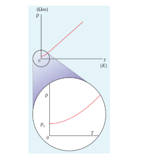

படம் 2.13 (அ) வெப்பநிலைச் சார்ந்த கடத்தியின் மின்தடை எண் (ஆ) தாழ் வெப்பநிலையில் நேர்விகிதமற்ற பகுதி (Non linear region)

 
கடத்திகளிலும் உலோகங்களைப் போல் பரந்த வெப்பநிலை அளவுகளுக்கு மின்தடை எண் நேர்விகிதத் தன்மையுடன் (linear) இருப்பினும், மிகக்குறைந்த வெப்பநிலைகளில் நேர்விகிதமற்றத் தன்மையும் காணப்படும்.

வெப்பநிலை மதிப்பு தனிச்சுழி வெப்பநிலையை (absolute temperature) நெருங்கும்போது மின்தடை எண் ஒரு குறிப்பிட்ட வரையறுக்கப்பட்ட மதிப்பைப் பெறும்.
 
\( \rho = \frac{R A}{l} \) என்ற கோவையை சமன்பாடு (2.27) இல் பிரதியிட்டு, ஒரு குறிப்பிட்ட வெப்பநிலையில் கடத்தியின் மின்தடையை பின்வரும் சமன்பாட்டின் மூலம் குறிப்பிடலாம்.

$$
R_T = R_0 \left[ 1 + \alpha (T - T_0) \right] \qquad (2.28)
$$

சமன்பாடு (2.28) லிருந்தும் மின்தடை வெப்பநிலை எண்ணைப் பெறலாம்.

\( R_T - R_0 = \alpha R_0 (T - T_0) \)

$$
\therefore \alpha = \frac{R_T - R_0}{R_0 (T - T_0)} = \frac{1}{R_0} \frac{\Delta R}{\Delta T} \qquad (2.29)
$$

இங்கு \( \Delta R = R_T - R_0 \) என்பது \( \Delta T = T - T_0 \) எனும் வெப்பநிலை மாற்றத்தில் ஏற்படும் மின்தடை மாறுபாடு ஆகும்.

**குறைகடத்திகளின் \( \alpha \) மதிப்பு**

குறைகடத்திகளில், வெப்பநிலை அதிகரித்தால் மின்தடை எண் குறையும். வெப்பநிலை உயரும்போது [பாடம் 9 இல் குறைகடத்திகளில் மின்னோட்டம் பற்றி விவரிக்கப்பட்டுள்ளது] குறைகடத்தியின் அணுக்களில் இருந்து அதிக எண்ணிக்கையில் எலக்ட்ரான்கள் விடுபடும். இதனால் மின்னோட்டமும் அதிகரிக்கும். அதனால் மின்தடை எண் படம் 2.14 இல் காட்டியுள்ளவாறு குறையும். எதிர்க்குறி வெப்பநிலை மின்தடை எண் உடைய குறைக்கடத்தியானது வெப்ப தடையகம் (Thermistor) எனப்படும்.
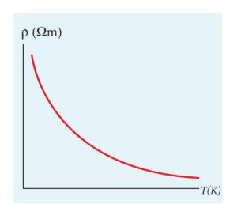

படம் 2.14 குறைகடத்திகளில் வெப்பநிலைச் சார்ந்த மின்தடை எண்

**அட்டவணை 2.3 பல்வேறு பொருட்களின் மின்தடை வெப்பநிலை எண்களின் மதிப்புகள்**

| பொருட்கள் | மின்தடை வெப்பநிலை எண் \( \alpha \) (\( (^\circ \mathrm{C})^{-1} \)) |
|---|---|
| வெள்ளி | \( 3.8 \times 10^{-3} \) |
| தாமிரம் | \( 3.9 \times 10^{-3} \) |
| தங்கம் | \( 3.4 \times 10^{-3} \) |
| அலுமினியம் | \( 3.9 \times 10^{-3} \) |
| டங்க்ஸ்டன் | \( 4.5 \times 10^{-3} \) |
| இரும்பு | \( 5.0 \times 10^{-3} \) |
| பிளாட்டினம் | \( 3.92 \times 10^{-3} \) |
| காரீயம் | \( 3.9 \times 10^{-3} \) |
| நிக்ரோம் | \( 0.4 \times 10^{-3} \) |
| கார்பன் | \( -0.5 \times 10^{-3} \) |
| ஜெர்மானியம் | \( -48 \times 10^{-3} \) |
| சிலிக்கான் | \( -75 \times 10^{-3} \) |

பின்வரும் கருத்தின் மூலம் மின்தடை எண் வெப்பநிலையைச் சார்ந்து இருப்பதை புரிந்து கொள்ளலாம். பகுதி 2.1.3 யில், மின் கடத்து எண் \( \sigma = \frac{n e^2 \tau}{m} \) எனக் கண்டோம். மின்தடை எண் ஆனது \( \sigma \) வின் தலைகீழ் மதிப்பாகும். இதனை கீழ்க்கண்டவாறு எழுதலாம்.

$$
\rho = \frac{m}{n e^2 \tau} \qquad (2.30)
$$

பொருட்களின் மின்தடை எண் ஆனது

i) எலக்ட்ரான்களின் எண் அடர்த்தி (\( n \)) க்கு எதிர்த்தகவில் அமையும்.
ii) மோதலுக்கு இடைப்பட்ட சராசரி காலத்திற்கு (\( \tau \)) எதிர்த்தகவில் அமையும்

கடத்தியில் வெப்பநிலை அதிகரிக்கும்போது \( \tau \) குறைகிறது, \( n \) மாறிலியாக இருக்கிறது. ஆனால் குறைக்கடத்தியில் வெப்பநிலை அதிகரிக்கும்போது \( n \) அதிகரிக்கிறது, \( \tau \) குறைகிறது. இங்கு \( \tau \) குறைவைவிட \( n \) இன் அதிகரிப்பு ஆதிக்கம் உள்ளது என்பதால் ஒட்டுமொத்தமாக மின்தடை எண் குறையும்.

ஒரு சில பொருட்களின் வெப்பநிலையானது ஒரு குறிப்பிட்ட வெப்பநிலைக்கு கீழே குறையும்போது அதன் மின்தடை எண் சுழியாகும். இந்த வெப்பநிலையானது மாறுநிலை வெப்பநிலை அல்லது பெயர்வு வெப்பநிலை எனப்படும். இந்த நிகழ்வினை வெளிப்படுத்தும் பொருட்கள் மீக்கடத்திகள் (Superconductors) எனப்படும். முதன் முதலில் 1911 இல் காமர்லிங் ஒன்ஸ் என்பவர் பாதரசமானது \( 4.2 \ \mathrm{K} \) வெப்பநிலையில் மீக்கடத்தும் தன்மையை வெளிப்படுத்துவதைக் கண்டறிந்தார். இந்த மீக்கடத்திகளில் மின்தடை \( R = 0 \) என்பதால் இதில் ஒருமுறை செலுத்தப்படும் மின்னோட்டம் எவ்வித மின்னழுத்த வேறுபாடும் இன்றி தங்கியிருக்கும்.

### எடுத்துக்காட்டு 2.13

\( 20^\circ \mathrm{C} \) வெப்பநிலையில் ஒரு கம்பிச் சுருளின் மின்தடை \( 3 \ \Omega \) மற்றும் \( \alpha = 0.004/^\circ \mathrm{C} \) எனில் \( 100^\circ \mathrm{C} \) வெப்பநிலையில் அதன் மின்தடையைக் காண்க.

#### தீர்வு

\( R_0 = 3 \ \Omega \), \( T = 100^\circ \mathrm{C} \), \( T_0 = 20^\circ \mathrm{C} \)

\( \alpha = 0.004/^\circ \mathrm{C} \), \( R_T = ? \)

$$
R_T = R_0 [1 + \alpha (T - T_0)]
$$

$$
R_{100} = 3 [1 + 0.004 \times 80]
$$

$$
R_{100} = 3 [1 + 0.32] = 3 \times 1.32 = 3.96 \ \Omega
$$

### எடுத்துக்காட்டு 2.14

\( 20^\circ \mathrm{C} \) மற்றும் \( 40^\circ \mathrm{C} \) வெப்பநிலைகளில் ஒரு பொருளின் மின்தடைகள் முறையே \( 45 \ \Omega \) மற்றும் \( 85 \ \Omega \) ஆகும் எனில் அதன் வெப்பநிலை மின்தடை எண்ணைக் கண்டுபிடி.

#### தீர்வு

\( T_0 = 20^\circ \mathrm{C} \), \( T = 40^\circ \mathrm{C} \), \( R_0 = 45 \ \Omega \), \( R = 85 \ \Omega \)

$$
\alpha = \frac{1}{R_0} \frac{\Delta R}{\Delta T}
$$

$$
\alpha = \frac{1}{45} \left( \frac{85 - 45}{40 - 20} \right) = \frac{1}{45} \left( \frac{40}{20} \right) = \frac{1}{45} (2)
$$

$$
\alpha = 0.044 \ \text{per} ^\circ \mathrm{C}
$$

### 2.3 மின்சுற்றுகளில் ஆற்றல் மற்றும் திறன்
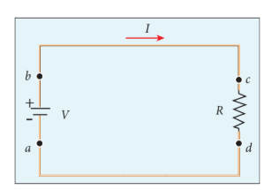

படம் 2.15 மின்கலத்தின் மூலம் ஆற்றல் அளிக்கப்படுதல்

கடத்தியின் முனைகளுக்கிடையே மின்கலத்தை இணைக்கும்போது, மின்னோட்டம் பாய்கிறது. மின்சுற்றில் இணைக்கப்பட்ட கருவிக்கு மின்கலமானது ஆற்றலை அளிக்கிறது. மின்னழுத்த வேறுபாடு \( V \) கொண்ட மின்கலமானது மின்தடையாக்கியுடன் இணைக்கப்பட்ட மின்சுற்று ஒன்றை படம் 2.15 இல் காட்டியுள்ளவாறு கருதுவோம்.

\( dQ \) மின்னூட்டம் உள்ள நேர்மின் துகள்கள் புள்ளி \( a \) விலிருந்து \( b \) க்கு மின்கலம் வழியாகவும், புள்ளி \( c \) விருந்து \( d \) க்கு மின்தடையாக்கி வழியாகவும் நகர்ந்து மீண்டும் புள்ளி \( a \) வை அடைவதாக கொள்வோம்.

\( a \) விலிருந்து \( b \) க்கு மின்துகள்கள் நகரும்போது இம் மின்துகள்கள் \( dU = V \cdot dQ \) அளவு மின்னழுத்த ஆற்றலை பெறுகிறது. இதனால் மின்கலத்தின் வேதி மின்னழுத்த ஆற்றல் இதே அளவு குறைகிறது. \( dQ \) அளவு மின்னூட்டம் உள்ள மின்துகள்கள் மின்தடையாக்கி வழியாக பாய்ந்து \( a \) வை அடையும்போது மின்தடையாக்கியில் உள்ள அணுக்களின் மீது மோதி \( dU \) அளவுள்ள மின்னழுத்த ஆற்றலை இழக்கிறது. மின்கலமானது, மின்சுற்றில் இணைக்கப்பட்டிருக்கும் வரை இந்நிகழ்வானது தொடர்ந்து நடைபெற்று கொண்டிருக்கும். மின்துகள்கள் மின்தடையாக்கியில் எவ்வளவு வேகத்தில் மின்னழுத்த ஆற்றலை இழக்கிறது என்பதை நாம் கணக்கிடலாம்.

மின்னழுத்த ஆற்றல் அளிக்கப்படும் வீதம் மின்திறன் \( P \) எனப்படும்.

$$
P = \frac{dU}{dt} = \frac{(V \cdot dQ)}{dt} = V \frac{dQ}{dt} \qquad (2.31)
$$

\( I = \frac{dQ}{dt} \) என்பதிலிருந்து சமன்பாடு (2.31) ஐ பின்வருமாறு மாற்றி எழுதலாம்.

$$
P = V I \qquad (2.32)
$$

இங்கு \( I \) என்பது மின்னோட்டம் மற்றும் \( V \) என்பது மின்சாதனத்தின் குறுக்கே உள்ள மின்னழுத்த வேறுபாடு ஆகும். மேற்கண்ட சமன்பாடு மின்சாதனத்திற்கு மின்கலத்தின் மூலம் அளிக்கப்பட்ட திறனின் மதிப்பு ஆகும்.

மின்திறனின் SI அலகு வாட் (\( 1 \ \mathrm{W} = 1 \ \mathrm{J} \ \mathrm{s}^{-1} \)). வணிக ரீதியாக, நமது இல்லங்களில் பயன்படும் மின் பல்களில் குறிப்பிடப்பட்டுள்ள திறன் மற்றும் மின்னழுத்த வேறுபாடு ஆகியவற்றின் மதிப்புகள் \( 5 \ \mathrm{W}-220 \ \mathrm{V} \), \( 30 \ \mathrm{W}-220 \ \mathrm{V} \), \( 60 \ \mathrm{W}-220 \ \mathrm{V} \) ஆகும். இவைகள் கடைகளில் கிடைக்கின்றன. (படம் 2.16).

படம் 2.16 திறன் மதிப்பு பொறிக்கப்பட்டுள்ள மின் பல்கள்

\( 1 \ \mathrm{V} \) மின்னழுத்த வேறுபாட்டில் பாயும் மின்னோட்டம் \( 1 \ \mathrm{A} \) எனில் உருவாகும் திறன் \( 1 \ \mathrm{W} \) ஆகும்.

**குறிப்பு:** இந்த பல்களில் குறிப்பிடப்படும் மின்னழுத்த வேறுபாடுகள் பொதுவாக RMS மாறுதிசை மின்னழுத்த வேறுபாட்டையே (RMS AC Voltage) குறிக்கும். குறிப்பிடப்பட்டுள்ள மின்னழுத்த வேறுபாட்டை விட பல்பின் குறுக்கே அதிக மின்னழுத்தம் கொடுக்கப்பட்டால் மின் பல்பின் இழை துண்டிக்கப்படும் (Fuse).

ஓம் விதியை பயன்படுத்தி, மின்தடை \( R \) க்கு அளிக்கப்படும் திறனுக்கான சமன்பாட்டை பின்வருமாறு எழுதலாம்.

மின்தடையில் உருவாக்கப்படும் (வெளியேறும்) மின்திறனின் அளவு \( P = I^2 R \) ஆகும். இதன் மூலம் நாம் அறிவது, மின்திறனானது மின்னோட்டத்தின் இருமடியை பொறுத்தது. எனவே மின்னோட்டத்தை இருமடங்காக்கினால் மின்திறனானது நான்கு மடங்காகும். மின்னழுத்த வேறுபாட்டிற்கும் இந்த விளக்கம் பொருந்தும்.

ஒரு மின்சாதனம் பயன்படுத்தும் மொத்த ஆற்றலைப் பெற அதன் திறன் மற்றும் அச்சாதனம் இயங்கும் நேர அளவின் பெருக்குத் தொகையை காண வேண்டும். திறன் வாட் (\( \mathrm{W} \)) என்ற அலகிலும், காலம் விநாடியிலும் அளவிடப்படுவதால் ஆற்றலானது ஜூல் என்ற அலகில் குறிப்பிடப்படும். நடைமுறையில் மின் ஆற்றலை அளவிட கிலோ வாட் மணி (\( \mathrm{kWh} \)) என்ற அலகு பயன்படுத்தப்படுகிறது. \( 1 \ \mathrm{kWh} \) என்பது மின் ஆற்றலின் 1 அலகு (one unit) ஆகும்.

\( 1 \ \mathrm{kWh} = 1000 \ \mathrm{Wh} = (1000 \ \mathrm{W}) (3600 \ \mathrm{s}) = 3.6 \times 10^6 \ \mathrm{J} \)

### எடுத்துக்காட்டு 2.15

\( V \) என்ற மின்னழுத்த வேறுபாடு கொண்ட மின்கலம் \( 30 \ \mathrm{W} \) மற்றும் \( 60 \ \mathrm{W} \) திறனுள்ள மின் பல்களுடன் படத்தில் காட்டியவாறு இணைக்கப்பட்டுள்ளது. (a) எந்த மின் பல்பு அதிக பொலிவுடன் (Brightness) ஒளிரும் ? (b) எந்த மின் பல்பு அதிக மின்தடையை கொண்டிருக்கும் ? (c) இரு மின் பல்புகளும் தொடரிணைப்பில் இணைக்கப்பட்டால் எது அதிக பொலிவுடன் ஒளிரும் ?
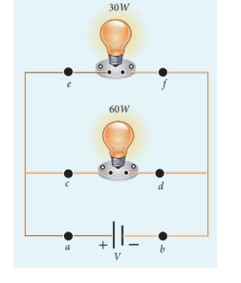
#### தீர்வு

(a) மின்கலத்தினால் அளிக்கப்படும் திறன் \( P = V I \) ஆகும். மின் பல்புகள் பக்க இணைப்பில் இணைக்கப்பட்டுள்ளதால், இவற்றின் குறுக்கே உள்ள மின்னழுத்த வேறுபாடு சமமாகும். மின்னழுத்த வேறுபாடு மாறிலியாக இருப்பதால் திறனானது மின்னோட்டத்திற்கு நேர்த்தகவில் அமையும் (\( P \propto I \)). எனவே \( 60 \ \mathrm{W} \) மின் பல்பு \( 30 \ \mathrm{W} \) மின் பல்பை விட இரு மடங்கு மின்னோட்டத்தை பெறுவதால் அது அதிக பொலிவாக இருக்கும்.

(b) \( P = \frac{V^2}{R} \) எனும் சமன்பாட்டில், மின்னழுத்த வேறுபாடு மாறிலி என்பதால், திறன் மின்தடைக்கு எதிர்த்தகவில் (\( P \propto \frac{1}{R} \)) அமைகிறது. எனவே \( 30 \ \mathrm{W} \) மின் பல்பு \( 60 \ \mathrm{W} \) மின் பல்பை விட இருமடங்கு மின்தடையை பெற்றிருக்கும்.

(c) இரு மின் பல்புகளும் தொடரிணைப்பில் இணைக்கப்பட்டால், அவற்றின் வழியே செல்லும் மின்னோட்டம் சமமாகும். இந்நிலை இரு மின்தடையாக்கிகள் தொடரிணைப்பில் உள்ளதற்கு ஒப்பாகும். அதிக மின்தடையுள்ள மின் பல்பின் குறுக்கே அதிக மின்னழுத்த வேறுபாடு இருக்கும். எனவே \( 30 \ \mathrm{W} \) மின் பல்பு அதிக பொலிவுடன் காணப்படும்.

(எனவே மின் பல்பின் குறிப்பிடப்பட்டுள்ள அதிகத் திறன் அளவு மட்டும் அதிக பொலிவுத்தன்மைக்கு காரணமாகாது. ஒரு மின் பல்பின் பொலிவுத்தன்மை, மின் பல்புகள் தொடரிணைப்பில் உள்ளனவா அல்லது பக்க இணைப்பில் உள்ளனவா என்பதை பொறுத்தது.)

### எடுத்துக்காட்டு 2.16

\( 20 \ \mathrm{W} - 220 \ \mathrm{V} \) மற்றும் \( 100 \ \mathrm{W} - 220 \ \mathrm{V} \) என குறிப்பிடப்பட்டுள்ள இரு மின் பல்புகள் தொடரிணைப்பில் \( 440 \ \mathrm{V} \) மின்னழுத்த வேறுபாடு (Power supply) மூலத்துடன் இணைக்கப்பட்டுள்ளன. எந்த மின் பல்பின் மின் இழை துண்டிக்கப்படும் (Fused)?

#### தீர்வு

எந்த மின் பல்பின் மின் இழை துண்டிக்கப்படும் என்பதைக் கண்டறிய, இரு மின் பல்புகளின் குறுக்கே உள்ள மின்னழுத்த வேறுபாட்டை கணக்கிட வேண்டும்.

மின் பல்பின் மின்தடை, \( R = \frac{V^2}{P} \) (குறிப்பிட்ட வோல்டேஜ்)

\( 20 \ \mathrm{W} - 220 \ \mathrm{V} \) மின் பல்பின் மின்தடை,

$$
R_1 = \frac{(220)^2}{20} = \frac{48400}{20} = 2420 \ \Omega
$$

\( 100 \ \mathrm{W} - 220 \ \mathrm{V} \) மின் பல்பின் மின்தடை,

$$
R_2 = \frac{(220)^2}{100} = \frac{48400}{100} = 484 \ \Omega
$$

இரு மின் பல்புகளும் தொடரிணைப்பில் இணைக்கப்பட்டுள்ளன. எனவே இவற்றில் பாயும் மின்னோட்டம் சமமாக அமையும். இம் மின்சுற்றில் பாயும் மின்னோட்டம்,

\( I = \frac{V}{R_{tot}} \)

\( R_{tot} = (R_1 + R_2) = (2420 + 484) = 2904 \ \Omega \)

\( I = \frac{440}{2904} \approx 0.1515 \ \mathrm{A} \)

\( 20 \ \mathrm{W} \) மின் பல்பின் குறுக்கே மின்னழுத்த வேறுபாடு

$$
V_1 = I R_1 = \frac{440}{2904} \times 2420 \approx 366.6 \ \mathrm{V}
$$

\( 100 \ \mathrm{W} \) மின் பல்பின் குறுக்கே மின்னழுத்த வேறுபாடு

$$
V_2 = I R_2 = \frac{440}{2904} \times 484 \approx 73.3 \ \mathrm{V}
$$

\( 20 \ \mathrm{W} \) மின் பல்பின் மின் இழை துண்டிக்கப்படும் (Fused). ஏனெனில் அதன் குறுக்கே அனுமதிக்கப்பட்ட அளவை விட அதிக மின்னழுத்த வேறுபாடு ஏற்பட்டுள்ளது.

### 2.4 மின்கலங்களும் மின்கலத் தொகுப்புகளும்
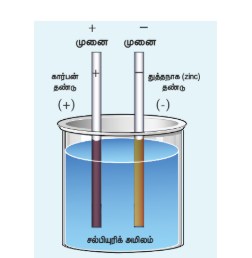

படம் 2.17 எளிய மின்கலம்

மின்கலம் என்பது வேதி ஆற்றலை மின் ஆற்றலாக மாற்றி மின்னோட்டத்தை ஏற்படுத்தும் சாதனம் ஆகும். இதில் இரு மின் தண்டுகள் மின்பகுளியில் (electrolyte) மூழ்க வைக்கப்பட்டுள்ளதை படம் 2.17 இல் காணலாம்.

மின்கலத் தொகுப்பு (Battery) என்பது பல மின்கலங்கள் (Cells) இணைக்கப்பட்ட அமைப்பு ஆகும். ஒரு மின்கலம் அல்லது மின்கலத் தொகுப்பை இணைக்கும்போது, எலக்ட்ரான்கள் எதிர்மின் முனையிலிருந்து நேர்மின் முனைக்கு மின்சுற்று வழியே பாயும். வேதி வினைகளின் மூலம், மின்கலத் தொகுப்பு அல்லது மின்கலம் மின் முனைகளுக்கிடையே மின்னழுத்த வேறுபாட்டை உருவாக்கும். இந்த மின்னழுத்த வேறுபாடு எலக்ட்ரான்களை மின் சுற்றில் நகர்த்த தேவையான ஆற்றலை அளிக்கும். படம் 2.18 இல் வணிக ரீதியாக கடைகளில் கிடைக்கும் மின்கலங்கள் மற்றும் மின்கலத் தொகுப்புகளைக் காணலாம்.

படம் 2.18 மின்கலங்களும் மின்கலத் தொகுப்புகளும்

#### 2.4.1 மின் இயக்கு விசை மற்றும் அக மின்தடை

ஒரு மின்கலம் அல்லது மின்கலத் தொகுப்பு என்பது மின்னியக்கு விசை (emf) மூலமாகும். மின்னியக்கு விசை என்பது உண்மையில் விசையல்ல. இது மின்னழுத்த வேறுபாட்டின் அலகான வோல்ட்டில் குறிக்கப்படுகிறது. ஒரு மின்கலம் அல்லது மின்கலத் தொகுப்பில் உள்ள மின்னியக்கு விசை என்பது புறச் சுற்றில் மின்னோட்டம் பாயாத போது அதன் மின் முனைகளுக்கு இடையே உள்ள மின்னழுத்த வேறுபாட்டை குறிக்கிறது. இது படம் 2.19 இல் காட்டப்பட்டுள்ளது.

படம் 2.19 மின்கலத்தின் மின்னியக்கு விசையை அளவிடுதல்

மின்னியக்கு விசை என்பது, மின்கலத் தொகுப்பானது மின்சுற்றில் ஓரலகு மின்னூட்டம் கொண்ட மின்துகள்களை நகர்த்த தேவைப்படும் வேலையின் அளவைக் குறிக்கிறது. இதன் குறியீடு \( \varepsilon \) ஆகும். ஒரு இலட்சிய மின்கலத் தொகுப்பின் அகமின்தடை சுழி (Internal resistance) ஆகும். எனவே மின்கலத் தொகுப்பின் மின் முனைகளுக்கிடையே உள்ள மின்னழுத்த வேறுபாடு என்பது அதன் மின்னியக்கு விசைக்கு சமம். ஆனால் நடைமுறையில் ஒரு மின்கலத் தொகுப்பானது மின் தண்டுகள் (electrodes) மற்றும் மின் பகுளியால் (electrolyte) ஆனது. இதனால் மின்கலத்தினுள் மின்துகள்களின் ஓட்டத்திற்கு தடை இருக்கும். இந்த மின்தடையே அகமின்தடை \( r \) எனப்படும். எனவே நடைமுறையில் உள்ள மின்கலத் தொகுப்பில் மின் முனைகளுக்கிடையே உள்ள மின்னழுத்த வேறுபாடு மின்னியக்கு விசைக்கு சமமல்ல. புதியதாக உருவாக்கப்பட்ட மின்கலத்தின் அகமின்தடை குறைவாக இருக்கும். அதன் பயன்பாடு அதிகரிக்க அதிகரிக்க (நாளாக) அகமின்தடை அதிகரிக்கும்.

#### 2.4.2 அகமின்தடையைக் கணக்கிடுதல்
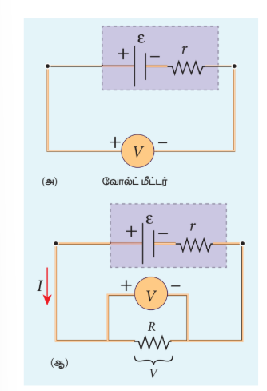

படம் 2.20 மின்கலத்தின் அகமின்தடையைக் கணக்கிடுதல்

படம் 2.20 இல் உள்ளவாறு மின்சுற்றில் இணைப்புகள் செய்யப்படுகிறது.

மின்கலத்தின் மின்னியக்கு விசை \( \varepsilon \) ஐ கண்டறிய அதன் குறுக்கே உயர் மின்தடை கொண்ட வோல்ட்மீட்டர் இணைக்கப்படுகிறது. இங்கு புறமின்தடையாக்கி \( R \) இணைக்கப்படக்கூடாது. (படம் 2.20(அ)). வோல்ட்மீட்டர் மிகக்குறைந்த அளவே மின்னோட்டத்தை எடுத்துக்கொள்வதால் இச்சுற்று திறந்த சுற்றாக கருதப்படும். எனவே வோல்ட்மீட்டர் காட்டும் அளவு என்பது மின்கலத்தின் மின்னியக்கு விசையின் அளவே. \( R \) என்ற புறமின்தடையாக்கியை மின்சுற்றில் இணைத்தால் \( I \) என்ற மின்னோட்டம் சுற்றில் உருவாக்கப்படும். மேலும் \( R \) ன் குறுக்கே உள்ள மின்னழுத்த வேறுபாடு மின்கலத்தின் மின் முனைகளின் மின்னழுத்த வேறுபாடு \( V \) ஆகும். (படம் 2.20(ஆ))

ஓம் விதியிலிருந்து, \( V = I R \)

இலட்சியமற்ற மின்கலத்தின் மின் முனைகளுக்கிடையே உள்ள மின்னழுத்த வேறுபாடு

$$
V = \varepsilon - I r
$$

மின்கலம் அளிக்கும் மின்னோட்டம்

$$
I = \frac{\varepsilon}{R + r}
$$

இதிலிருந்து,

$$
r = \left( \frac{\varepsilon - V}{V} \right) R
$$
### எடுத்துக்காட்டு 2.17
12 V மின்கலத்துவிகளைக் கொண்ட மின்கலத்தொகுப்பும் 3 Ω மின்தடையாக்கியின் இணைக்கப்பட்டுள்ளது. மின் திறன் 3.93 A எனில் (a) மின்கலத்தொகுப்பின் மின்கலங்களுக்கிடையே உள்ள மின்னழுத்த வேறுபாடு மற்றும் சமனிலை ஆற்றலைக் கணக்கிடுக. (b) மின்கலத்தொகுப்பில் அளிக்கும் திறனையும், மின்தடையாக்கி பெறும் திறனையும் கணக்கிடுக.
 
தீர்வு
 
I = 3.93 A, ε = 12 V, R = 3 Ω

(a) மின்கலத்தொகுப்பின் மின்கலங்களுக்கிடப்பட்ட வேறுபாடு எனப்படுவது மின்தடையாக்கிக்கு குறுக்கே உள்ள மின்னழுத்த வேறுபாட்டின் சமமாகும்.

V = IR = 3.93 × 3 = 11.79 V

மின்கலத் தொகுப்பின் அக மின்தடை, 
$$
r=\frac{V-\varepsilon}{V}R
=\frac{12-11.79}{11.79}\times 3
=0.05\,\Omega
$$
 
(b) மின்கலத்தொகுப்பு அளிக்கும் திறன் 
P=Iε=3.93×12=47.1 W  
மின்தடையாக்கி பெறும் திறன் P=I^2 R=46.3 W 
நுகர்படும் திறன் P=(47.1−46.3)=0.8 W இந்த திறனே அகமின்தடைக்கு அளிக்கப்படும். மேலும் இது பாய்மன வேலைகளைக் கிளப்பாது. 
இழப்பிற்கு I^2r க்கு சமமாகும்.

#### 2.4.3 மின்கலங்கள் தொடரிணைப்பு

பல மின்கலங்கள் இணைக்கப்பட்டு மின்கலத் தொகுப்பு உருவாக்கப்படும். தொடரிணைப்பில் முதல் மின்கலத்தின் எதிர் மின் முனை இரண்டாவது மின்கலத்தின் நேர்மின் முனையுடனும், இரண்டாவது மின்கலத்தின் எதிர் மின் முனை மூன்றாவது மின்கலத்தின் நேர்மின் முனையுடனும் இணைக்கப்படும். இணைக்கப்படாத முதல் மின்கலத்தின் நேர்மின் முனை மற்றும் இணைக்கப்படாத கடைசி மின்கலத்தின் எதிர் மின் முனைகளே மின்கலத் தொகுப்பின் மின் முனைகளாக அமையும்.

அகமின்தடை \( r \) மற்றும் மின்னியக்கு விசை \( \varepsilon \) கொண்ட \( n \) மின்கலங்கள் படம் 2.21 இல் உள்ளவாறு \( R \) என்ற புறமின்தடையாக்கியுடன் தொடரிணைப்பில் இணைக்கப்பட்டுள்ளன.
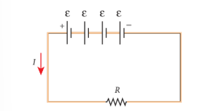

படம் 2.21 மின்கலங்கள் - தொடரிணைப்பு

மின்கலத் தொகுப்பின் மொத்த மின்னியக்கு விசை \( = n \varepsilon \)

மின்சுற்றின் மொத்த மின்தடை \( = n r + R \)

ஓம் விதியின்படி, மின்சுற்றின் மின்னோட்டம்

$$
I = \frac{n \varepsilon}{R + n r} \qquad (2.39)
$$

**நிலை (a)** \( r \ll R \), எனில்

$$
I \approx \frac{n \varepsilon}{R} = n I_1 \qquad (2.40)
$$

இங்கு \( I_1 \) என்பது ஒரு மின்கலத்தின் ஏற்படும் மின்னோட்டம்

\( I_1 = \frac{\varepsilon}{R} \)

எனவே \( R \) ஐப் பொறுத்து \( r \) மிகக்குறைவாக புறக்கணிக்கத்தக்க அளவு இருப்பின் மின்கலத் தொகுப்பு ஏற்படுத்தும் மின்னோட்டம் ஒரு மின்கலம் ஏற்படுத்தும் மின்னோட்டத்தைப் போன்று \( n \) மடங்கு அமையும்.

**நிலை (b)** \( r \gg R \), எனில்

$$
I \approx \frac{n \varepsilon}{n r} = \frac{\varepsilon}{r} \qquad (2.41)
$$

இது ஒரு மின்கலம் ஏற்படுத்தும் மின்னோட்டம் ஆகும். எனவே மின்கலத் தொகுப்பின் மின்னோட்டமும் ஒரு மின்கலத்தின் மின்னோட்டமும் சமம் ஆகும். இந்நிலை பயனற்றது.

எனவே தொடரிணைப்பில் மின்கலங்கள் இணைக்கப்படும்போது மின்கலங்களின் தொகுபயன் அகமின்தடை புறமின் தடையை விட மிகச்சிறிய மதிப்பாக உள்ளபோது மட்டுமே பயனுள்ளதாக இருக்கும்.
### எடுத்துக்காட்டு 2.18
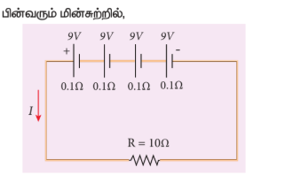
(i) இணைப்பு தொகுப்பின் தொகுபயன் மின்னியக்கு விசை
(ii) இணைப்பு தொகுப்பின் தொகுபயன் அகமின்நடை
(iii) மொத்த மின்னோட்டம்
(iv) புறமின்தடையாக்கியின் குறுக்கே மின்னழுத்த வேறுபாடு
(v) ஒவ்வொரு மின்கலத்தின் குறுக்கே உள்ள மின்னழுத்த வேறுபாடு ஆகியவற்றை கண்டுபிடி
 
தீர்வு
 
i) இணைப்பின் தொகுபயன் மின்னியக்கு விசை
$$\varepsilon_{eq} = n\varepsilon = 4 \times 9 = 36\text{ V}$$
ii) தொகுபயன் அகமின்நடை
$$r_{eq} = nr = 4 \times 0.1 = 0.4\ \Omega$$
iii) மொத்த மின்னோட்டம்
$$I = \frac{n\varepsilon}{R + nr}$$
$$= \frac{4 \times 9}{10 + (4 \times 0.1)}$$
$$= \frac{4 \times 9}{10 + 0.4} = \frac{36}{10.4}$$
$$I = 3.46\text{ A}$$
iv) புற மின்தடையாக்கி குறுக்கே மின்னழுத்த வேறுபாடு
$$V = IR = 3.46 \times 10 = 34.6\text{ V}$$
மீதமுள்ள $1.4\text{ V}$ ஆனது மின்கலங்களின் அகமின் தடைக்கு குறுக்கே உருவாக்கப்படுகிறது.
v) ஒவ்வொரு மின்கலத்தின் குறுக்கே ஏற்படும் மின்னழுத்த வேறுபாடு
$$\frac{V}{n} = \frac{34.6}{4} = 8.65\text{ V}$$
 

#### 2.4.4 மின்கலங்கள் பக்க இணைப்பு

அகமின்தடை \( r \) மற்றும் மின்னியக்கு விசை \( \varepsilon \) கொண்ட \( n \) மின்கலங்கள் படம் 2.22 இல் உள்ளவாறு \( R \) என்ற புறமின்தடையாக்கியுடன் பக்க இணைப்பில் இணைக்கப்பட்டுள்ளன.
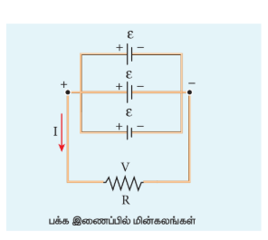

படம் 2.22 மின்கலங்கள் - பக்க இணைப்பு

மின்கலத் தொகுப்பின் மொத்த மின்னியக்கு விசை \( = \varepsilon \)

மின்கலத் தொகுப்பின் அகமின்தடை \( = \frac{r}{n} \)

மின்சுற்றின் மொத்த மின்தடை \( = \frac{r}{n} + R \)

ஓம் விதியின்படி, மின்சுற்றின் மின்னோட்டம்

$$
I = \frac{\varepsilon}{R + \frac{r}{n}} \qquad (2.42)
$$

**நிலை (a)** \( \frac{r}{n} \ll R \) (அல்லது) \( r \ll nR \), எனில்

$$
I \approx \frac{\varepsilon}{R} = I_1 \qquad (2.43)
$$

இங்கு \( I_1 \) என்பது ஒரு மின்கலம் ஏற்படுத்தும் மின்னோட்டம் (\( I_1 = \frac{\varepsilon}{R} \))

**நிலை (b)** \( \frac{r}{n} \gg R \) (அல்லது) \( r \gg nR \), எனில்

$$
I \approx \frac{\varepsilon}{r/n} = \frac{n \varepsilon}{r} \qquad (2.44)
$$

சமன்பாடு (2.44) விருந்து, நாம் அறிவது மின்கலத் தொகுப்பினால் ஏற்படும் மின்னோட்டம் ஒரே ஒரு மின்கலத்தினால் ஏற்படும் மின்னோட்டத்திற்குச் சமம். எனவே மின்கலங்களின் பக்க இணைப்பில் இணைக்கும்போது புறமின் தடையானது மின்கலங்களின் அகமின்தடையை விட குறைவாக இருந்தால் மட்டுமே பயனுள்ளதாக அமையும்.

### எடுத்துக்காட்டு 2.19
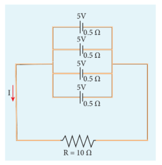
பின்வரும் மின்சுற்றில்,

(i) தொகுப்பன் மின்னியக்கு விசை
(ii) தொகுப்பன் அக மின்தடை
(iii) மொத்த மின்னோட்டம் (\( I \))
(iv) ஒவ்வொரு மின்கலத்தின் குறுக்கே உள்ள மின்னழுத்த வேறுபாடு
(v) ஒவ்வொரு மின்கலம் மூலம் ஏற்படும் மின்னோட்டம் ஆகியவற்றை கணக்கிடுக.

#### தீர்வு

(i) தொகுப்பன் மின்னியக்கு விசை \( \varepsilon_{eq} = 5 \ \mathrm{V} \)

(ii) தொகுப்பன் அகமின்தடை,

\( r_{eq} = \frac{r}{n} = \frac{0.5}{4} = 0.125 \ \Omega \)

(iii) மொத்த மின்னோட்டம், \( I = \frac{\varepsilon}{R + \frac{r}{n}} = \frac{5}{10 + 0.125} = \frac{5}{10.125} \approx 0.4938 \ \mathrm{A} \)

(iv) ஒவ்வொரு மின்கலத்தின் குறுக்கே உள்ள மின்னழுத்த வேறுபாடு

\( V = I R = 0.4938 \times 10 = 4.938 \ \mathrm{V} \)

(v) ஒவ்வொரு மின்கலத்தினால் ஏற்படும் மின்னோட்டம், \( I' = \frac{I}{n} = \frac{0.4938}{4} \approx 0.1235 \ \mathrm{A} \)

### 2.5 கிர்க்காஃப் விதிகள் (KIRCHHOFF'S RULES)

ஓம் விதி எளிய மின்சுற்றுகளுக்கு மட்டுமே பயன்படும். சிக்கலான மின் சுற்றுகளில் மின்னோட்டம் மற்றும் மின்னழுத்த வேறுபாட்டை கணக்கிட கிர்க்காஃப் விதிகள் பயன்படுத்தப்படுகின்றன. அவை

i) கிர்க்காஃப் மின்னோட்ட விதி
ii) கிர்க்காஃப் மின்னழுத்த வேறுபாடு விதி ஆகும்.

#### 2.5.1 கிர்க்காஃப் முதல் விதி (மின்னோட்ட விதி அல்லது சந்தி விதி)
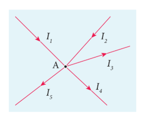

படம் 2.23 கிர்க்காஃப் மின்னோட்ட விதி

எந்த ஒரு சந்தியிலும் சந்திக்கின்ற மின்னோட்டங்களின் குறியியல் கூட்டுத்தொகை சுழியாகும். இது மின்துகள்களில் உள்ள மின்னூட்டங்களின் அழிவின்மை விதியின் அடிப்படையில் அமைகிறது. சந்திகளில் மின்துகள்கள் உருவாக்கப்படுவதோ அழிவதோ இல்லை. அதாவது சந்தியில் நுழையும் மின்துகள்கள் அனைத்தும் சந்தியை விட்டு வெளியேறும். கிர்க்காஃப் முதல் விதியைப் பயன்படுத்தும் போது சந்தியை நோக்கிச் செல்லும் மின்னோட்டம் நேர்க்குறி எனவும் சந்தியை விட்டு வெளியேறும் மின்னோட்டம் எதிர்க்குறி எனவும் எடுத்துக்கொள்ளப்படும்.
A சந்திக்கு இவ்விதிலய பயன்படுத்த ( 2.23) 
\(I_1 + I_2 - I_3 -I_4 -I_5 = 0\) (அல்லது)
\(I_1 + I_2 =I_3 + I_4 + I_5 \)
### எடுத்துக்காட்டு 2.20
பின்வரும் மின்சுற்றில் Iன் மதிப்பை கணடுபிடி.
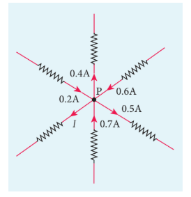
தீர்வு
 
மின்சுற்றில் P என்ற புள்ளிக்கு கிர்க்காஃப் முதல் விதியை பயன்படுத்த,
P ஐ நோக்கி செல்லும் அம்புக்குறிகளை (மின்னோட்டத்தை) நேர்க்குறியாகவும், P விட்டு விலகிச் செல்லும் அம்புக்குறிகளை (மின்னோட்டங்கள்) எதிர்க்குறியாகவும் எடுத்துக் கொள்ள வேண்டும். எனவே,
$$0.2\text{A} - 0.4\text{A} + 0.6\text{A} - 0.5\text{A} + 0.7\text{A} - I = 0$$
$$1.5\text{A} - 0.9\text{A} - I = 0$$
$$0.6\text{A} - I = 0$$
$$I = 0.6\text{A}$$

### 2.5.2 கிர்க்காஃப் இரண்டாவது விதி (மின்னழுத்த வேறுபாட்டு விதி அல்லது சுற்று விதி)
இவ்விதியின்படி எந்தவொரு மூடிய சுற்றின் ஒவ்வொரு பகுதியிலும் உள்ள மின்னோட்டம் மற்றும் மின்தடை ஆகியவற்றின் பெருக்கற்பலன்களின் குறியியல் கூட்டுத் தொகையானது, அந்த மின்சுற்றில் உள்ள மின்னியக்கு விசைகளின் குறியியல் கூட்டுத்தொகைக்குச் சமம். இந்த விதி தனித்த அமைப்பின் ஆற்றல் மாறா விதிப்படி அமைகிறது. அதாவது மின்னியக்கு விசை மூலம் அளிக்கும் ஆற்றலானது எல்லா மின்தடையாக்கிகள் பெறும் ஆற்றல்களின் கூடுதலுக்குச் சமமாகும். மூடிய சுற்றில் (Closed loop) நாம் செல்லும் திசை வழியே மின்னோட்டம் சென்றால், அம்மின்னோட்டம் மற்றும் அப்பாதையில் உள்ள மின்தடை ஆகியவற்றின் பெருக்கற்பலனின் மதிப்பு நேர்க்குறியாகவும், மூடிய சுற்றில் நாம் செல்லும் திசைக்கு எதிர்த்திசையில் மின்னோட்டம் சென்றால், அம்மின்னோட்டம் மற்றும் அப்பாதையில் உள்ள மின்தடை ஆகியவற்றின் பெருக்கற்பலன் மதிப்பு எதிர்க்குறி மதிப்பாகவும் எடுத்துக்கொள்ளப்படும். இது படம் 2.24 (அ) மற்றும் (ஆ) இல் காட்டப்பட்டுள்ளது. அதேபோல் மூடிய சுற்றில் நாம் செல்லும் திசையின் வழியே மின்கலத்தின் எதிர்மின் முனையிலிருந்து நேர்மின் முனை வழியாக நாம் செல்லும் போது மின்னியக்கு விசை நேர்க்குறியாகவும் அதேபோல்
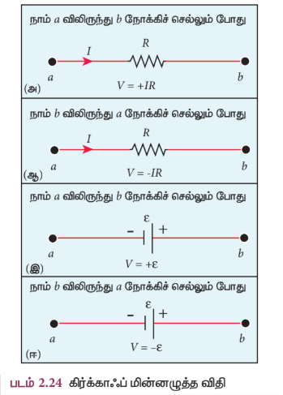
மின்கலத்தின் நேர் மின் முனையிலிருந்து எதிர்மின் முனை வழியாகச் செல்லும் போது மின்னியக்கு விசை எதிர்க்குறியாகவும் எடுத்துக் கொள்ளப்படுகிறது. இது படம் 2.24 (இ) மற்றும் (ஈ) காட்டப்படுகிறது. 
கிர்க்காஃப் மின்னழுத்த வேறுபாட்டு விதியைப் பயன்படுத்தும்போது சுற்றில் உள்ள அனைத்து மின்னோட்டங்களும் நிலையான மதிப்பை பெற வேண்டும் எனும் நிபந்தனை பின்பற்றப்பட வேண்டும்.
 

###  எடுத்துக்காட்டு 2.21
பின்வரும் படத்தில் கடத்திகள் சிக்கலான வலைப்பின்னல் வடிவத்தில் அமைக்கப்பட்டு EACE மற்றும் ABCA ஆகிய மூடிய சுற்றுகளாகப் பிரிக்கப்பட்டுள்ளது.  
 
இந்த அமைப்பிற்கு கிர்க்காஃப் மின்னழுத்த வேறுபாட்டு விதியை பயன்படுத்துக.
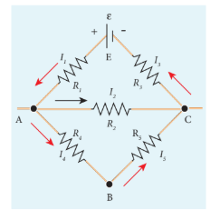
தீர்வு
EACE என்ற மூடிய சுற்றுக்கு கிர்க்காஃப் மின்னழுத்த வேறுபாட்டு விதியை பயன்படுத்தினால் 
$$I_1R_1 + I_2R_2 + I_3R_3 = \varepsilon$$
அதேபோல் ABCA எனும் மூடிய சுற்றுக்கு$$I_4R_4 + I_5R_5 - I_2R_2 = 0$$
$$I_4R_4 + I_5R_5 - I_2R_2 = 0$$

### எடுத்துக்காட்டு 2.22
பின்வரும் மின்சுற்றில் $1\ \Omega$ மின்தடையாக்கி வழியே பாயும் மின்னோட்டத்தைக் கணக்கிடுக
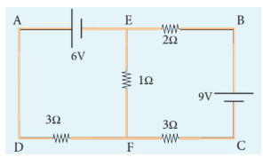
#### தீர்வு
\( 9 \ \mathrm{V} \) மின்கலத்திலிருந்து பாயும் மின்னோட்டத்தை \( I_1 \) எனக்கொள்வோம். கிர்க்காஃப் மின்னோட்ட விதிப்படி \( I_1 \) ஆனது \( I_2 \) மற்றும் \( (I_1 - I_2) \) என சந்தி \( E \) இல் பிரிகிறது. இதனை படத்தில் காணலாம்.
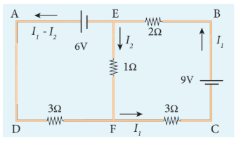
\( EFCBE \) எனும் மூடிய சுற்றில் கிர்க்காஃப் மின்னழுத்த வேறுபாடு விதியை பயன்படுத்த,

$$
1 I_2 + 3 I_1 + 2 I_1 = 9
$$

$$
5 I_1 + I_2 = 9 \qquad (1)
$$

\( EADFE \) எனும் மூடிய சுற்றில் கிர்க்காஃப் மின்னழுத்த வேறுபாடு விதியை பயன்படுத்த,

$$
3 (I_1 - I_2) - 1 I_2 = 6
$$

$$
3 I_1 - 4 I_2 = 6 \qquad (2)
$$

சமன்பாடு (1) மற்றும் (2) ஆகியவற்றை தீர்க்க, நமக்கு கிடைப்பது

\( I_1 = 1.83 \ \mathrm{A} \) மேலும் \( I_2 = -0.13 \ \mathrm{A} \)

எனவே \( 1 \ \Omega \) மின்தடையில் மின்னோட்டம் \( F \) லிருந்து \( E \) க்கு பாயும்.

### 2.5.3 வீட்ஸ்டோன் சமனச்சுற்று
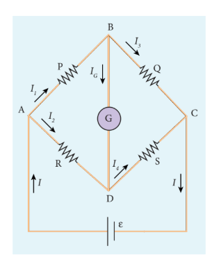

படம் 2.25 வீட்ஸ்டோன் சமனச்சுற்று

 
கிர்க்காஃப் விதிகளின் முக்கிய பயன்பாடாக வீட்ஸ்டோன் சமனச்சுற்று அமைகிறது. மின்சுற்று வலை (electrical networks) அமைப்புகளில் வீட்ஸ்டோன் சமனச்சுற்றின் மூலம் தெரியாத மின்தடையாக்கியின் மதிப்பை கண்டறியவும், மின்தடையாக்கிகளை ஒப்பிடவும் முடியும்.

இந்த வலை அமைப்பில் \( P \), \( Q \), \( R \) மற்றும் \( S \) மின்தடையாக்கிகள் படம் 2.25 இல் உள்ளவாறு இணைக்கப்பட்டுள்ளன. \( G \) என்ற கால்வனோமீட்டரானது \( B \) மற்றும் \( D \) புள்ளிகளுக்கிடையே இணைக்கப்பட்டுள்ளது. கால்வனோமீட்டர் வழியே பாயும் மின்னோட்டம் \( I_G \) எனவும் அதன் மின்தடை \( G \) எனவும் எடுத்துக் கொள்ளப்படுகிறது.

\( B \) சந்திக்கு கிர்க்காஃப் மின்னோட்ட விதியை பயன்படுத்த,

$$
I_1 - I_G - I_3 = 0 \qquad (2.45)
$$

\( D \) சந்திக்கு கிர்க்காஃப் மின்னோட்ட விதியை பயன்படுத்த,

$$
I_2 + I_G - I_4 = 0 \qquad (2.46)
$$

\( ABDA \) என்ற மூடிய சுற்றுக்கு கிர்க்காஃப் மின்னழுத்த வேறுபாடு விதியை பயன்படுத்த,

$$
I_1 P + I_G G - I_2 R = 0 \qquad (2.47)
$$

\( ABCDA \) என்ற மூடிய சுற்றுக்கு கிர்க்காஃப் மின்னழுத்த வேறுபாடு விதியை பயன்படுத்த,

$$
I_1 P + I_3 Q - I_4 S - I_2 R = 0 \qquad (2.48)
$$

\( B \) மற்றும் \( D \) புள்ளிகள் சம மின்னழுத்தத்தில் இருந்தால், வீட்ஸ்டோன் சமனச்சுற்று சமநிலையில் இருக்கும். \( B \) மற்றும் \( D \) புள்ளிகளுக்கிடையே மின்னழுத்த வேறுபாடு இல்லை என்பதால், கால்வனோமீட்டர் வழியே மின்னோட்டம் பாயாது. (\( I_G = 0 \)). எனவே \( I_G = 0 \) என சமன்பாடுகள் (2.45), (2.46) மற்றும் (2.47) இல் பிரதியிட

$$
I_1 = I_3 \qquad (2.49)
$$

$$
I_2 = I_4 \qquad (2.50)
$$

$$
I_1 P = I_2 R \qquad (2.51)
$$

சமன்பாடு (2.51) ஐ சமன்பாடு (2.48) இல் பிரதியிட

$$
I_3 Q = I_4 S \qquad (2.52)
$$

சமன்பாடு (2.52) ஐ சமன்பாடு (2.51) ஆல் வகுக்க,

$$
\frac{P}{Q} = \frac{R}{S} \qquad (2.53)
$$

இதுவே வீட்ஸ்டோன் சுற்றின் சமநிலைக்கான நிபந்தனை ஆகும். இந்த நிலையில் மட்டுமே கால்வனோமீட்டர் சுழி விலக்கத்தை காட்டும். அருகருகே உள்ள இரு மின்தடையாக்கிகளின் மதிப்பு நமக்கு தெரிவதாகக் கொண்டால், மற்ற இரு மின்தடையாக்கிகளை ஒப்பிடலாம். மேலும் நான்கு மின்தடையாக்கிகளில் மூன்றின் மதிப்பு தெரிந்தால் தெரியாத நான்காவது மின்தடையாக்கியின் மதிப்பையும் இதன் மூலம் கணக்கிட முடியும்.

**கால்வனோமீட்டர்** என்பது மின்னோட்டத்தை கண்டறியவும் அளவிடவும் உதவும் ஒரு சாதனம் ஆகும். மிகச்சிறிய அளவு மின்னோட்டங்களை அளவிட இதனை பயன்படுத்த முடியும். ஒரு மின்சுற்றின் வெவ்வேறு பகுதிகளில் உள்ள மின்னழுத்த வேறுபாட்டை ஒப்பிடவும் இது பெருமளவு பயன்படுத்தப்படுகிறது.

### எடுத்துக்காட்டு 2.23

ஒரு வீட்ஸ்டோன் சமனச்சுற்றில் \( P = 100 \ \Omega \), \( Q = 1000 \ \Omega \) மற்றும் \( R = 40 \ \Omega \). கால்வனோமீட்டரில் சுழி விலக்கம் ஏற்பட்டால், \( S \) இன் மதிப்பை கணக்கிடுக.

#### தீர்வு

\( \frac{P}{Q} = \frac{R}{S} \)

\( S = \frac{Q}{P} \times R = \frac{1000}{100} \times 40 = 10 \times 40 = 400 \ \Omega \)

### எடுத்துக்காட்டு 2.24

படத்தில் உள்ள வீட்ஸ்டோன் சமனச்சுற்று சமநிலையில் இருக்கும் நிலையில் \( x \) ன் மதிப்பு என்ன?

\( P = 500 \ \Omega \), \( Q = 800 \ \Omega \), \( R = x + 400 \), \( S = 1000 \ \Omega \)

#### தீர்வு
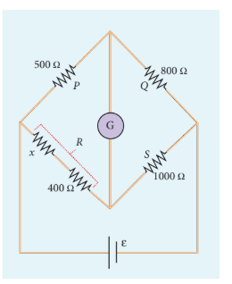
\( \frac{P}{Q} = \frac{R}{S} \)

\( \frac{500}{800} = \frac{x + 400}{1000} \)

\( x + 400 = \frac{5}{8} \times 1000 = 625 \)

\( x = 625 - 400 = 225 \ \Omega \)

### 2.5.4 மீட்டர் சமனச்சுற்று
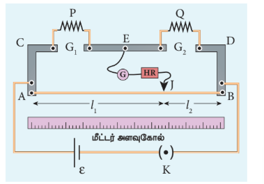

படம் 2.26 மீட்டர் சமனச்சுற்று

 
மீட்டர் சமனச்சுற்று என்பது வீட்ஸ்டோன் சமனச்சுற்றின் இன்னொரு வடிவம் ஆகும். இதில் 1 மீட்டர் நீளமுள்ள \( AB \) என்ற சீரான மாங்கனின் (Manganin) கம்பி உள்ளது. இக்கம்பி ஒரு மீட்டர் அளவு கோலுக்கு இணையாக ஒரு மரப்பலகையில் \( C \) மற்றும் \( D \) என்ற இரு தாமிர பட்டைகளுக்கு இடையே நீட்டப்பட்டுள்ளது. இரு தாமிரப் பட்டைகளுக்கு இடையில் \( E \) என்ற மற்றொரு தாமிர பட்டை \( G_1 \) மற்றும் \( G_2 \) என்ற இரு இடைவெளிகளில் படம் 2.26 இல் காட்டியவாறு பொருத்தப்பட்டுள்ளது. \( G_1 \) இடைவெளியில் மதிப்பு தெரியாத மின்தடையாக்கி \( P \) யும் \( G_2 \) இடைவெளியில் \( Q \) என்ற படித்தர (தெரிந்த) மின்தடையாக்கி \( Q \) வும் இணைக்கப்பட்டுள்ளன. ஒரு தொடு சாவியானது (மின்கடத்தி) மைய தாமிரப் பட்டையில் \( B \) என்ற முனையில் கால்வனோமீட்டர் (\( G \)) மற்றும் உயர் மின்தடையாக்கி வழியே இணைக்கப்பட்டுள்ளது. கம்பியின் மீதுள்ள தொடு சாவியின் நிலையை (Position) அளவுகோல் மூலம் அளவிடலாம். சமனச்சுற்று கம்பியின் முனைகளின் குறுக்கே ஒரு லெக்ளாஞ்சி மின்கலமும் சாவியும் (\( K \)) இணைக்கப்பட்டுள்ளன.

கம்பியின் மீது தொடு சாவியை நகர்த்தி கால்வனோமீட்டரில் சுழி விலக்கம் ஏற்படுமாறு செய்ய வேண்டும். தொடு சாவியின் நிலையை \( J \) என எடுத்துக் கொள்வோம். \( AJ \) மற்றும் \( JB \) எனும் நீளங்கள் முறையே வீட்ஸ்டோன் சமனச்சுற்றின் மின்தடையாக்கிகள் \( R \) மற்றும் \( S \) க்கு பதிலாக அமைந்துள்ளது.

$$
\frac{P}{Q} = \frac{r \cdot AJ}{r \cdot JB} = \frac{AJ}{JB} = \frac{l_1}{l_2} \qquad (2.55)
$$

இங்கு \( r \) என்பது ஓரலகு நீளத்திற்கான மின்தடை ஆகும்.

$$
P = Q \frac{l_1}{l_2} \qquad (2.56)
$$

சமனச்சுற்று கம்பியானது தாமிர பட்டைகளின் மீது பற்ற வைத்திருப்பதால் முழுமையற்ற இணைப்பின் காரணமாக, இணைப்பில் மிகச்சிறிய அளவு மின்தடை அதிகரித்திருக்கக் கூடும். இந்த மின்தடையே முனை மின்தடைகள் (End resistance) எனப்படும். இப்பிழையை நீக்க \( P \) மற்றும் \( Q \) வை இடப்பரிமாற்றம் செய்து சோதனை மீண்டும் ஒருமுறை செய்யப்பட்டு மற்றொரு அளவீடு எடுக்கப்பட்டு சராசரி மதிப்பு கண்டறியப்படுகிறது.

\( P \) எனும் கம்பிச்சுருள் செய்யப்பட்ட பொருளின் மின்தடை எண்ணை கணக்கிட அதன் ஆரம் \( a \) மற்றும் நீளம் \( l \) ஆகியவை அளவிடப்படுகின்றன. தன் மின்தடை அல்லது மின்தடை எண் \( \rho \) பின்வரும் தொடர்பினால் பெறப்படுகிறது.

மின்தடை \( = \rho \frac{l}{A} \)

மேற்கண்ட சமன்பாட்டை மாற்றி அமைக்க,

$$
\rho = \text{மின்தடை} \times \frac{A}{l} \qquad (2.57)
$$

\( P \) என்பது தெரியாத மின்தடை எனில் சமன்பாடு (2.57) பின்வருமாறு அமையும்.

$$
\rho = P \frac{\pi a^2}{l}
$$

### எடுத்துக்காட்டு 2.25

ஒரு மீட்டர் சமனச்சுற்று ஆய்வில் \( 15 \ \Omega \) என்ற படித்தர மின்தடையாக்கி ஒரு இடைவெளியில் இணைக்கப்பட்டுள்ளது. சமன்செய் நீளங்களின் விகிதம் \( 3:2 \) எனில் மற்றொரு இடைவெளியில் உள்ள மின்தடையாக்கியின் மதிப்பைக் காண்க.

#### தீர்வு

\( Q = 15 \ \Omega \), \( l_1 : l_2 = 3:2 \)

\( \frac{l_1}{l_2} = \frac{3}{2} \)

\( \frac{P}{Q} = \frac{l_1}{l_2} \)

\( P = Q \frac{l_1}{l_2} = 15 \times \frac{3}{2} = 22.5 \ \Omega \)

### எடுத்துக்காட்டு 2.26

ஒரு மீட்டர் சமனச்சுற்றில், மின்தடைப் பெட்டியில் \( 10 \ \Omega \) என்ற அளவு மின்தடை வைக்கப்பட்டுள்ளது. சமன்செய் நீளத்தின் மதிப்பு \( l_1 = 55 \ \mathrm{cm} \) எனில் தெரியாத மின்தடையின் மதிப்பை கணக்கிடுக.

#### தீர்வு

\( Q = 10 \ \Omega \)

\( \frac{P}{Q} = \frac{l_1}{100 - l_1} = \frac{l_1}{l_2} \)

\( P = Q \times \frac{l_1}{100 - l_1} = \frac{10 \times 55}{100 - 55} = \frac{550}{45} \approx 12.22 \ \Omega \)

### 2.5.5 மின்னழுத்தமானி
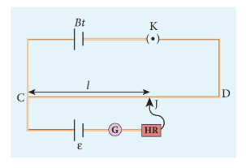

படம் 2.27 மின்னழுத்தமானி

 
மின்னழுத்தமானியானது மின்னழுத்த வேறுபாடு, மின்னோட்டம் மற்றும் மின்தடைகளை துல்லியமாக அளவிட பயன்படுகிறது. இதில் பத்து மீட்டர் நீளமுள்ள சீரான மாங்கனின் அல்லது கான்ஸ்டாண்டன் கம்பியானது 1 மீட்டர் நீளமுள்ள இணையான வரிசைகளாக நீட்டப்பட்டு மரப்பலகையில் பொருத்தப்பட்டுள்ளது. கம்பியின் இணைக்கப்படாத \( A \) மற்றும் \( B \) முனைகள் ஒரே பக்கத்திற்கு கொண்டு வரப்பட்ட இணைப்புத் திருகுகளுடன் தாமிரப் பட்டைகளில் பொருத்தப்பட்டுள்ளன. ஒரு மீட்டர் அளவு கோல் கம்பிக்கு இணையாக பொருத்தப்பட்டுள்ளது.

மின்னழுத்தமானியின் தத்துவம் படம் 2.27 இல் காட்டப்பட்டுள்ளது. கம்பி \( CD \) வழியே ஒரு நிலையான மின்னோட்டம் ஏற்படுத்தப்படுகிறது.

மின்கலத் தொகுப்பு, சாவி மற்றும் மின்னழுத்தமானி கம்பி ஆகியவை தொடரிணைப்பில் இணைக்கப்பட்டு முதன்மைச் சுற்றாக அமைகிறது. மின்னியக்கு விசை \( \varepsilon \) கொண்ட மின்கலத்தின் நேர்மின் முனை \( C \) புள்ளியுடனும், எதிர் மின் முனை கால்வனோமீட்டர் மற்றும் உயர் மின்தடை வழியாக தொடு சாவியுடனும் இணைக்கப்பட்டுள்ளன. இது துணைச் சுற்றாக அமைகிறது.

தொடு சாவி உதவியுடன் \( J \) என்ற புள்ளியில் இணைப்பு ஏற்படுத்தப்படுகிறது. \( CJ \) பகுதியின் குறுக்கே உள்ள மின்னழுத்த வேறுபாடு, மின்கலத்தின் மின்னியக்கு விசை \( \varepsilon \) க்கு சமமானால் கால்வனோமீட்டர் வழியே எவ்வித மின்னோட்டமும் பாயாமல் அது சுழி விலக்கத்தை காட்டும். எனவே \( CJ \) என்பது சமன்செய் நீளம் \( l \) என்று அழைக்கப்படும். \( CJ \) க்கு குறுக்கே உள்ள மின்னழுத்த வேறுபாடு \( I r l \). இங்கு \( r \) என்பது ஓரலகு நீளத்திற்கான மின்தடை ஆகும்.

எனவே \( \varepsilon = I r l \)     (2.58)

இங்கு \( I \) மற்றும் \( r \) மாறிலிகள் என்பதால் \( \varepsilon \propto l \). மின்கலத்தின் மின்னியக்கு விசை சமன்செய் நீளத்திற்கு நேர்த்தகவில் அமையும்.

### 2.5.6 மின்னழுத்தமானியை பயன்படுத்தி இரு மின்கலங்களின் மின்னியக்கு விசைகளை ஒப்பிடுதல்
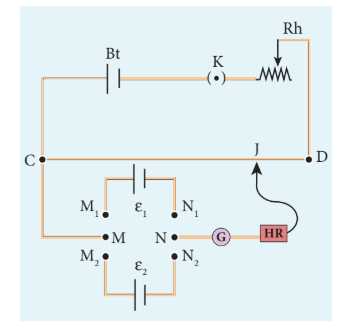

படம் 2.28 இரு மின்கலங்களின் மின்னியக்கு விசைகளை ஒப்பிடுதல்

 
இரு மின்கலங்களின் மின்னியக்கு விசைகளை ஒப்பிட, படம் 2.28 இல் உள்ளவாறு மின்சுற்று இணைப்பு ஏற்படுத்தப்படுகிறது. மின்னழுத்தமானி கம்பி \( CD \) ஆனது மின்கலத் தொகுப்பு \( Bt \) மற்றும் சாவி \( K \) உடன் தொடரிணைப்பில் இணைக்கப்பட்டுள்ளது. இது முதன்மைச் சுற்று ஆகும். கம்பியின் \( C \) முனை \( DPDT \) சாவியில் உள்ள (Double Pole Double Throw) \( M \) முனையில் இணைக்கப்பட்டுள்ளது. \( N \) முனையானது கால்வனோமீட்டர் (\( G \)), உயர் மின்தடையாக்கி (\( HR \)) வழியாக தொடு சாவியுடன் இணைக்கப்பட்டுள்ளது. மின்னியக்கு விசைகள் ஒப்பிட வேண்டிய இரு மின்கலங்கள் \( \varepsilon_1 \) மற்றும் \( \varepsilon_2 \) முறையே \( DPDT \) இல் உள்ள \( M_1, N_1 \) மற்றும் \( M_2, N_2 \) முனைகளுடன் இணைக்கப்பட்டுள்ளன. மின்கலத் தொகுப்பின் (\( Bt \)) நேர் மின் முனை மற்றும் \( \varepsilon_1 \), \( \varepsilon_2 \) ஆகிய மின்கலங்களின் நேர் மின் முனைகள் ஆகியவை மின்னழுத்தமானி கம்பியில் உள்ள \( C \) முனையிலேயே இணைக்கப்பட வேண்டும்.

\( DPDT \) சாவியை \( M_1, N_1 \) முனைகளில் அழுத்தும்போது \( \varepsilon_1 \) மின்கலம் துணைச்சுற்றில் இணைக்கப்படுகிறது. இப்போது தொடு சாவியை நகர்த்தி கால்வனோமீட்டரில் சுழி விலக்கம் பெறப்பட்டு சமன்செய் நீளம் \( l_1 \) அளவிடப்படுகிறது. பின்னர் இரண்டாவது மின்கலம் \( \varepsilon_2 \) மின்சுற்றில் இணைக்கப்பட்டு சமன்செய் நீளம் \( l_2 \) கண்டறியப்படுகிறது.

\( r \) என்பது மின்னழுத்தமானி கம்பியின் ஓரலகு நீளத்திற்கான மின்தடை எனவும் \( I \) என்பது கம்பி வழியே பாயும் மின்னோட்டமாகவும் கொண்டால்

$$\varepsilon_1 = I r l_1 \qquad (2.59)$$

$$\varepsilon_2 = I r l_2 \qquad (2.60)$$

சமன்பாடு (2.59) ஐ சமன்பாடு (2.60) ஆல் வகுக்க,

$$
\frac{\varepsilon_1}{\varepsilon_2} = \frac{l_1}{l_2} \qquad (2.61)
$$

### 2.5.7 மின்னழுத்த மானியை பயன்படுத்தி மின்கலத்தின் அகமின்தடையை அளவிடுதல்
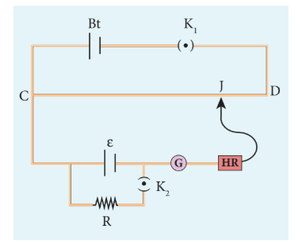

படம் 2.29 அகமின்தடையை அளவிடுதல்

 
மின்கலத்தின் அகமின்தடையை அளவிட, படம் 2.29 இல் காட்டியுள்ளவாறு இணைப்புகள் மேற்கொள்ளப்படுகின்றன. மின்கலத் தொகுப்பு \( Bt \) இன் நேர்மின் முனை மின்னழுத்தமானி கம்பியின் \( C \) முனையுடனும் எதிர்மின் முனை சாவி \( K_1 \) வழியாக \( D \) முனையுடனும் இணைக்கப்பட்டுள்ளன. இதுவே முதன்மைச் சுற்றாக அமைகிறது.

அகமின்தடை காண வேண்டிய மின்கலம் \( \varepsilon \) இன் நேர்மின் முனை மின்னழுத்தமானிக் கம்பியின் \( C \) முனையுடன் இணைக்கப்படுகிறது. மின்கலத்தின் எதிர்மின் முனையானது கால்வனோமீட்டர், உயர் மின்தடையாக்கி வழியாக தொடு சாவி \( J \) உடன் இணைக்கப்படுகிறது. மின்கலம் \( \varepsilon \) ன் குறுக்கே ஒரு மின்தடைப்பெட்டி \( R \) மற்றும் \( K_2 \) திறந்த நிலையில் சமன்செய் புள்ளி \( J \) கண்டறியப்பட்டு சமன்செய் நீளம் \( CJ = l_1 \) அளவிடப்படுகிறது.

மின்கலமானது திறந்த சுற்றில் அமைவதால் அதன் மின்னியக்கு விசை

$$\varepsilon \propto l_1 \qquad (2.62)$$

மின்தடைப்பெட்டி \( R \) இல் ஒரு தகுந்த மின்தடையாக்கி (\( 10 \ \Omega \) என இருக்கட்டும்) தேர்ந்தெடுக்கப்பட்டு \( K_2 \) சாவி மூடப்படுகிறது. \( r \) என்பது மின்கலத்தின் அக மின்தடை என்க. மின்தடை \( R \) மற்றும் மின்கலம் வழியே மின்னோட்டம் \( I \) ஆனது

$$I = \frac{\varepsilon}{R + r} \qquad (2.63)$$

\( R \) ன் குறுக்கே உள்ள மின்னழுத்த வேறுபாடு

$$V = \frac{\varepsilon R}{R + r} \qquad (2.64)$$

இந்த மின்னழுத்த வேறுபாடு மின்னழுத்தமானி கம்பிக்கு குறுக்கே உள்ள மின்னழுத்த வேறுபாட்டால் சமன்செய்யப்படுகிறது. இந்த நீளத்தை \( l_2 \) என்க. எனவே

$$\frac{\varepsilon R}{R + r} \propto l_2 \qquad (2.63)$$

சமன்பாடு (2.62) மற்றும் (2.63) லிருந்து

$$\frac{\varepsilon}{\left(\frac{\varepsilon R}{R + r}\right)} = \frac{l_1}{l_2}$$

$$\frac{R + r}{R} = \frac{l_1}{l_2} \qquad (2.64)$$

$$1 + \frac{r}{R} = \frac{l_1}{l_2}$$
$$\frac{r}{R} = \frac{l_1}{l_2} - 1 = \frac{l_1 - l_2}{l_2}$$
$$
\therefore r = R \left( \frac{l_1 - l_2}{l_2} \right) \qquad (2.65)
$$

\( R \), \( l_1 \) மற்றும் \( l_2 \) மதிப்புகளை பிரதியிட மின்கலத்தின் அகமின்தடை கண்டறியப்படுகிறது. இச்சோதனையானது \( R \) இன் வெவ்வேறு மதிப்புகளுக்கு மீண்டும் செய்யப்படுகிறது. சோதனையின் முடிவுகளின்படி மின்கலத்தின் அகமின்தடை மாறிலியாக அமையாமல் மின்கலத்தின் குறுக்கேயுள்ள புற மின்தடை மதிப்பு அதிகரிக்கும்போது அதிகரிப்பதை காணலாம்.

### 2.6 மின்னோட்டத்தின் வெப்ப விளைவு

ஒரு மின்தடையாக்கியின் வழியாக மின்னோட்டம் பாயும்போது, மின்தடையாக்கிக்கு அளிக்கப்படும் மின்னாற்றலில் சிறிதளவு வெப்ப ஆற்றலாக மாற்றப்பட்டு வீணாகிறது. மின்னோட்டத்தின் இந்த வெப்ப விளைவே ஜூல் வெப்ப விளைவு எனப்படும்.

மின்னோட்டம் எவ்வாறு வெப்ப ஆற்றலை ஏற்படுத்துகிறதோ அதேபோல் வெப்ப ஆற்றலை தகுந்த முறையில் பயன்படுத்தி மின்னியக்கு விசையை (மின் ஆற்றல்) பெற முடியும். இதுவே வெப்ப மின் விளைவு எனப்படும்.

#### 2.6.1 ஜூல் விதி

ஒரு கடத்தியின் குறுக்கே உள்ள \( V \) எனும் மின்னழுத்த வேறுபாட்டில் \( I \) என்ற மின்னோட்டம் \( t \) நேரத்திற்கு பாய்கிறது எனில், மின்கலத் தொகுப்பினால் செய்யப்பட்ட வேலை அல்லது பயன்படுத்தப்படும் மின்னழுத்த ஆற்றல்

$$
W = V I t \qquad (2.66)
$$

புற விளைவுகள் ஏதும் இல்லையெனில், இந்த ஆற்றல் கடத்தியை வெப்பப்படுத்த பயன்படும். இதன் மூலம் உருவாகும் வெப்ப ஆற்றல் (\( H \)) ஆனது

$$
H = V I t \qquad (2.67)
$$

கடத்தியில் மின்தடை \( R \) இருந்தால்,

$$
H = I^2 R t \qquad (2.68)
$$

இந்த தொடர்பு ஜூல் என்பவரால் சோதனை முறையில் சரிபார்க்கப்பட்டது. எனவே இது ஜூல் வெப்ப விதி எனப்படும். ஜூலின் விதிப்படி, ஒரு மின்சுற்றில் மின்னோட்டம் பாய்வதால் உருவாக்கப்படும் வெப்பமானது

(i) மின்னோட்டத்தின் இருமடிக்கு நேர்த்தகவிலும்
(ii) மின்சுற்றின் மின்தடைக்கு நேர்த்தகவிலும்
(iii) மின்னோட்டம் பாயும் நேரத்திற்கு நேர்த்தகவிலும் அமையும்.

### எடுத்துக்காட்டு 2.27

\( 10 \ \Omega \) மின்தடையாக்கி வழியாக \( 5 \ \mathrm{A} \) மின்னோட்டம் 5 நிமிட நேரம் பாய்வதால் தோன்றும் வெப்ப ஆற்றலின் மதிப்பை காண்க.

#### தீர்வு

\( R = 10 \ \Omega \), \( I = 5 \ \mathrm{A} \), \( t = 5 \ \text{நிமிடங்கள்} = 5 \times 60 = 300 \ \mathrm{s} \)

\( H = I^2 R t = 5^2 \times 10 \times 300 = 25 \times 10 \times 300 = 25 \times 3000 = 75000 \ \mathrm{J} \) (அல்லது) \( 75 \ \mathrm{kJ} \)

### எடுத்துக்காட்டு 2.28

\( 10 \ \Omega \) மின்தடை கொண்ட மின் குடேற்றி \( 220 \ \mathrm{V} \) மின்திறன் மூலத்துடன் இணைக்கப்பட்டு \( 1 \ \mathrm{kg} \) நிறையுள்ள நீரில் மூழ்க வைக்கப்பட்டுள்ளது. நீரின் வெப்பநிலையை \( 30^\circ \mathrm{C} \) விருந்து \( 60^\circ \mathrm{C} \) க்கு உயர்த்த மின் குடேற்றி எவ்வளவு நேரத்திற்கு இயக்கப்பட வேண்டும்? (நீரின் தன்வெப்ப ஏற்புத்திறன் \( s = 4200 \ \mathrm{J} \ \mathrm{kg}^{-1} \ \mathrm{K}^{-1} \))

#### தீர்வு

ஜூலின் வெப்ப விதிப்படி \( H = I^2 R t \)

மின் குடேற்றி வழியே பாயும் மின்னோட்டம்

\( I = \frac{V}{R} = \frac{220}{10} = 22 \ \mathrm{A} \)

மின் குடேற்றி 1 விநாடியில் உற்பத்தி செய்யும் வெப்பம்

\( H = I^2 R = (22)^2 \times 10 = 484 \times 10 = 4840 \ \mathrm{J} = 4.84 \ \mathrm{kJ} \)

உண்மையில் இந்த மின் குடேற்றியின் திறன் மதிப்பு \( 4.84 \ \mathrm{kW} \) ஆகும்.

\( 1 \ \mathrm{kg} \) நிறையுள்ள நீரின் வெப்பநிலையை \( 30^\circ \mathrm{C} \) லிருந்து \( 60^\circ \mathrm{C} \) க்கு உயர்த்த தேவைப்படும் வெப்ப ஆற்றலின் அளவு

\( Q = m s \Delta T \) (பார்க்க வகுப்பு XI தொகுதி 2, அலகு 8)

இங்கு \( m = 1 \ \mathrm{kg} \), \( s = 4200 \ \mathrm{J} \ \mathrm{kg}^{-1} \ \mathrm{K}^{-1} \), \( \Delta T = 30 \ \mathrm{K} \)

எனவே \( Q = 1 \times 4200 \times 30 = 126000 \ \mathrm{J} = 126 \ \mathrm{kJ} \)

இந்த வெப்ப ஆற்றலை தொற்றுவிக்கத் தேவைப்படும் நேரம்

\( t = \frac{Q}{I^2 R} = \frac{126 \times 10^3}{4840} \approx 26.03 \ \mathrm{s} \)

#### 2.6.2 ஜூல் வெப்ப விதியின் பயன்பாடுகள்

**1. மின் குடேற்றிகள்**

(a)

படம் 2.30 மின் இஸ்திரி பெட்டி, மின்குடேற்றி மற்றும் ஏர் கண்டிஷனர்

 
மின் இஸ்திரிபெட்டி, மின் குடேற்றி, ஏர் கண்டிஷனர் மின்கருவி முதலியன மின்னோட்டத்தின் வெப்ப விளைவை பயன்படுத்தும் வீட்டு உபயோகச் சாதனங்களாகும். இந்த சாதனங்களில் குடேற்றும் கம்பியானது நிக்கல் மற்றும் குரோமியத்தின் உலோகக் கலவையான நிக்ரோமினால் ஆனது. நிக்ரோமின் மின்தடை மிக அதிகம். மேலும் இதனை ஆக்ஸிஜனேற்றம் அடையாமலே மிக அதிக வெப்பநிலைக்கு வெப்பப்படுத்த முடியும்.

**2. மின் உருகிக் கம்பிகள்**
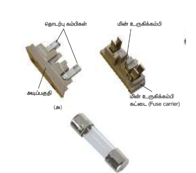

படம் 2.31 மின் உருகி

அதிகமான அளவு மின்னோட்டம் மின் சாதனங்கள் வழியாக பாயும்போது தோன்றும் வெப்பத்தினால் அவை பாதிக்கப்படாமல் இருக்க தொடரிணைப்பில் மின் உருகிகள் படம் (2.31) இல் காட்டியுள்ளவாறு இணைக்கப்படுகின்றன. மின் உருகிக் கம்பிகள் என்பது மிகக் குறைந்த நீளமுள்ள குறைவான உருகுநிலை கொண்ட பொருளானாகும். மின்னோட்டத்தின் அளவு குறிப்பிட்ட மதிப்பை விட அதிகரிக்கும்போது இவை உருகி மின் சுற்றை திறந்த சுற்றாக்கும். \( 15 \ \mathrm{A} \) க்கு குறைவாக மின்னோட்டம் செல்லும் மின்சுற்றுகளில் காரீயம் (Lead) மற்றும் வெள்ளீயத்தினால் (Tin) ஆன உலோகக்கலவை மின் உருகு இழையாக பயன்படுத்தப்படுகிறது. \( 15 \ \mathrm{A} \) க்கு அதிகமான மின்னோட்டம் செல்லும் மின்சுற்றுகளில் தாமிரக் கம்பிகள் மின் உருகு இழையாக பயன்படுத்தப்படுகிறது. இந்த மின் உருகு இழையில் உள்ள குறைபாடு என்னவென்றால் மின்னோட்டம் குறிப்பிட்ட அளவை விட அதிகரிக்கும்போது உருகி எரிந்து விடுவதால் அதனை மாற்ற வேண்டிய அவசியம் ஏற்படுகிறது.

தற்போது நமது வீடுகளில் மின் உருகிகளுக்கு பதிலாக மின்சுற்று துண்டிப்பான்கள் (Trippers) பயன்படுகின்றன. தவறான மின் இணைப்புகள் அல்லது அளவுக்கு அதிகமான மின்னோட்டம் மின்சுற்றில் பாயும்போது மின் துண்டிப்பான்களின் சாவி மின் சுற்றை திறந்துவிடும். பின்னர் மின்சுற்றின் பழுதை நீக்கியவுடன், நாம் மின் துண்டிப்பானின் சாவியை மூடி விடலாம். இதனை படம் 2.32 இல் தெரிந்து கொள்ளலாம்.

படம் 2.32 மின்சுற்று துண்டிப்பான்கள்

 
**3. மின் உலைகள்**

படம் 2.33 மின் உலைகள்

படம் 2.33 இல் காட்டியுள்ள உலைகள் எஃகு, சிலிக்கான் கார்பைடு, குவார்ட்ஸ், கேலியம் ஆர்சினைடு போன்ற தொழில் நுட்ப முக்கியத்துவம் வாய்ந்த பல பொருட்களை உருவாக்க பயன்படுத்தப்படுகின்றன. \( 1500^\circ \mathrm{C} \) வெப்பநிலை வரை உருவாக்க மாலிப்டினம்-நிக்கல் கம்பி சுற்றப்பட்ட சிலிக்கா குழாய் பயன்படுகின்றது. கார்பன் வில் உலைகள் (Carbon arc furnaces) சுமார் \( 3000^\circ \mathrm{C} \) வெப்பநிலை வரை உருவாக்க பயன்படுகின்றன.

**4. மின் விளக்குகள்**
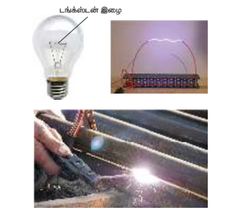

படம் 2.34 மின்விளக்கு, மின் வில், மற்றும் மின் பற்றவைத்தல்

மின் விளக்குகளில் டங்ஸ்டன் இழைகள் (உருகுநிலை \( 3380^\circ \mathrm{C} \)) கண்ணாடி குமிழ்களில் வைக்கப்பட்டு மின்னோட்டம் மூலம் மீ உயர் வெப்பநிலைக்கு குடேற்றப்படுகின்றன. மின் விளக்குகளில் (Incandescent lamp) \( 5\% \) மட்டுமே மின் ஆற்றல் ஒளியாக மாற்றப்படுகிறது, மீதமுள்ள ஆற்றல் வெப்பமாக வீணாகிறது. மின்னிறக்க விளக்குகள் (Discharge lamp), மின் பற்றவைத்தல் (வெல்டிங்), மின் வில் போன்றவை மின்னோட்டத்தின் வெப்ப விளைவைப் பயன்படுத்துகின்றன. இதனை படம் 2.34 இல் காணலாம்.

### 2.7 வெப்ப மின் விளைவு

வெப்ப மின் விளைவு என்பது வெப்பநிலை வேறுபாட்டை மின்னழுத்த வேறுபாடாக மாற்றும் நிகழ்வு ஆகும். வெப்ப மின் சாதனத்தின் இரு பக்கங்களிலும் உள்ள வெப்பநிலை வேறுபாட்டின் காரணமாக மின்னழுத்த வேறுபாடு தோன்றுகிறது. அதேபோல் மின்னழுத்த வேறுபாட்டை இப்பொருட்களில் ஏற்படுத்தினால், வெப்பநிலை வேறுபாடு தோன்றும்.

#### 2.7.1 சீபக் விளைவு
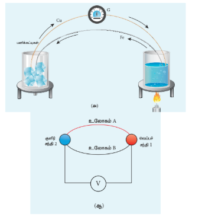

படம் 2.35 சீபக் விளைவு (வெப்ப மின்னிரட்டை)

 
ஒரு மூடிய சுற்றில் இரு வெவ்வேறு உலோகங்களின் இரு சந்திப்புகளை வெவ்வேறு வெப்பநிலைகளில் வைக்கும்போது மின்னழுத்த வேறுபாடு (மின்னியக்கு விசை) தோன்றுவதை சீபக் கண்டறிந்தார். இம்மின்னியக்கு விசையினால் ஏற்படும் மின்னோட்டத்தை வெப்ப மின்னோட்டம் என்றழைக்கலாம். இரு உலோகங்கள் இணைத்து சந்திப்புகளை ஏற்படுத்துவது வெப்ப மின்னிரட்டை (Thermocouple) எனப்படும். (படம் 2.35).

வெப்ப மற்றும் குளிர் சந்திகளை இடமாற்றம் செய்தால் மின்னோட்டத்தின் திசையும் மாறும். எனவே இந்த விளைவு ஒரு மீள் விளைவு ஆகும்.

வெப்ப மின்னிரட்டையில் தோன்றும் மின்னியக்கு விசையின் எண்மதிப்பு (i) மின்னிரட்டையில் இடம்பெறும் உலோகங்களின் தன்மை மற்றும் (ii) சந்திகளின் வெப்பநிலை வேறுபாடு ஆகியவற்றை பொறுத்தது.

**சீபக் விளைவின் பயன்பாடுகள்**

1. சீபக் விளைவானது வெப்ப மின்னியற்றிகளில் பயன்படுகிறது (சீபக் மின்னியற்றி). இந்த வெப்ப மின்னியற்றிகள், மின் உற்பத்தி நிலையங்களில் வீணாகும் வெப்ப ஆற்றலை மின்னாற்றலாக மாற்றுகின்றன.
2. தானியங்கி வாகனங்களில் எரிபொருள் பயனுறு திறனை அதிகரிக்க பயன்படும் தானியங்கி வெப்ப மின்னியற்றிகளில் பயன்படுத்தப்படுகிறது.
3. வெப்ப மின்னிரட்டை மற்றும் வெப்ப மின்னிரட்டை அடுக்குகளில் பயன்படுத்தப்படும் பொருட்களுக்கிடையே உள்ள வெப்பநிலை வேறுபாட்டை அளவிட சீபக் விளைவு பயன்படுகிறது.

#### 2.7.2 பெல்டியர் விளைவு
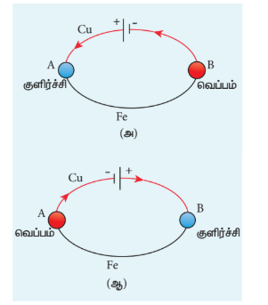

படம் 2.36 பெல்டியர் விளைவு: \( Cu - Fe \) வெப்ப மின்னிரட்டை

 
வெப்ப மின்னிரட்டையுடன் கூடிய மின் சுற்றில் மின்னோட்டத்தை செலுத்தும்போது, ஒரு சந்தியில் வெப்பம் வெளிப்படுவதும் மற்றொரு சந்தியில் வெப்பம் உட்கவர்தலும் நடைபெறும். இவ்விளைவு பெல்டியர் விளைவு எனப்படும். இதனை பெல்டியர் 1834 இல் கண்டறிந்தார்.

படம் 2.36 (அ) வில் காட்டியுள்ளவாறு \( Cu-Fe \) வெப்ப மின்னிரட்டையில் \( A \) மற்றும் \( B \) புள்ளி சம வெப்பநிலையில் உள்ளன. மின்கல அடுக்கிலிருந்து மின்னோட்டமானது வெப்ப மின்னிரட்டை வழியே பாய்கிறது. \( A \) சந்தியில் மின்னோட்டம் தாமிரத்திலிருந்து இரும்பிற்கு பாய்கிறது, அங்கு வெப்பம் உட்கவரப்பட்ட சந்தி \( A \) குளிர்வடைகிறது. சந்தி \( B \) இல் மின்னோட்டம் இரும்பிலிருந்து தாமிரத்திற்கு பாய்வதால் அங்கு வெப்பம் வெளிப்பட்டு சந்தி \( B \) வெப்பமடைகிறது. மின்னோட்டத்தின் திசையை மாற்றினால், படம் 2.36 (ஆ) வில் காட்டியவாறு \( A \) சந்தி வெப்பமடையும், \( B \) சந்தி குளிர்வடையும். எனவே பெல்டியர் விளைவு ஒரு மீள் விளைவு ஆகும்.

#### 2.7.3 தாம்சன் விளைவு
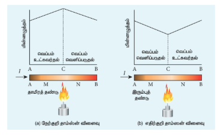

படம் 2.37 (அ) நேர்க்குறி தாம்சன் விளைவு (ஆ) எதிர்க்குறி தாம்சன் விளைவு

 
ஒரு கடத்தியின் இரு புள்ளிகள் வெவ்வேறு வெப்பநிலைகளில் உள்ளபோது, இந்த புள்ளிகளில் எலக்ட்ரான் அடர்த்தி வேறுபடுவதால் இவ்விரு புள்ளிகளுக்கிடையே மின்னழுத்த வேறுபாடு உருவாக்கப்படும் என்பதை தாம்சன் நிரூபித்தார். தாம்சன் விளைவும் மீள் விளைவு ஆகும்.

\( C \) எனும் மையப்புள்ளியில் வெப்பப்படுத்தப்படும் \( AB \) எனும் தாமிரத் தண்டு வழியே மின்னோட்டம் பாய்கிறது எனில், \( C \) என்ற புள்ளி உயர் மின்னழுத்தத்தில் அமையும். இதனால் \( AC \) பகுதியில் வெப்பம் உட்கவர்தலும் \( CB \) பகுதியில் வெப்பம் வெளிப்படுதலும் நடைபெறும். இது படம் 2.37 (அ) வில் காட்டப்பட்டுள்ளது.

எனவே மின்னோட்ட பாய்வின் காரணமாக மின்னோட்டத்தின் திசையில் வெப்பப் பரிமாற்றம் நடைபெறும். இது நேர்க்குறி தாம்சன் விளைவு எனப்படும். இது போன்ற விளைவு வெள்ளி, துத்தநாகம் மற்றும் காட்மியம் போன்ற உலோகங்களிலும் நடைபெறும்.

தாமிரத் தண்டுக்கு பதிலாக இரும்புத் தண்டினை பயன்படுத்தும்போது, \( CA \) பகுதியில் வெப்பம் வெளிப்படுத்துதலும் \( BC \) பகுதியில் வெப்பம் உட்கவர்தலும் நடைபெறும். இங்கு மின்னோட்ட பாய்வினால் மின்னோட்டத்தின் திசைக்கு எதிர் திசையில் வெப்ப பரிமாற்றம் நடைபெறும். இது எதிர்க்குறி தாம்சன் விளைவு எனப்படும். இது படம் 2.37 (ஆ) இல் காட்டப்பட்டுள்ளது. இது போன்ற விளைவு பிளாட்டினம், நிக்கல், கோபால்ட் மற்றும் பாதரசம் போன்ற உலோகங்களிலும் நடைபெறும்.

### பாடச் சுருக்கம்

■ கடத்தி வழியே பாயும் மின்னோட்டம் \( I = \frac{dQ}{dt} \). இங்கு \( dQ \) என்பது \( dt \) கால இடைவெளியில் கடத்தியின் ஒரு குறுக்கு பரப்பு வழியாக பாயும் மின்துகள்களில் உள்ள மின்னூட்டத்தின் அளவு. மின்னோட்டத்தின் SI அலகு ஆம்பியர் (A). \( 1 \ \mathrm{A} = 1 \ \mathrm{C} \ \mathrm{s}^{-1} \).

■ ஒரு கடத்தியில் மின்னோட்ட அடர்த்தி \( \vec{J} \) என்பது ஓரலகு செங்குத்து பரப்பில் பாயும் மின்னோட்ட அளவு ஆகும். \( J = \frac{I}{A} \)

■ மின்னோட்டம் ஒரு ஸ்கேலர். ஆனால் மின்னோட்ட அடர்த்தி ஒரு வெக்டர் ஆகும்.

■ ஓம் விதியின் நுண் வடிவம் \( \vec{J} = \sigma \vec{E} \).

■ ஓம் விதியின் பயனாட்டு வடிவம் \( V \propto I \), அல்லது \( V = IR \). இங்கு \( I \) என்பது மின்னோட்டம்; \( R \) என்பது மின்தடை.

■ கடத்தியின் மின்தடை \( R = \frac{V}{I} \). இதன் SI அலகு ஓம் (\( \Omega \)) மற்றும் \( 1 \ \Omega = 1 \ \mathrm{V} \ \mathrm{A}^{-1} \).

■ பொருளின் மின்தடை \( R = \rho \frac{l}{A} \). இங்கு \( l \) என்பது பொருளின் நீளம் மற்றும் \( A \) என்பது குறுக்குவெட்டுப் பரப்பு.

■ பொருளின் மின்தடை எண் என்பது மின்னோட்டத்திற்கு அது தரும் மின்தடையின் மதிப்பைப் பிரதிபலிக்கிறது.

■ பல மின்தடையாக்கிகள் (\( R_1, R_2, R_3, \dots \)) தொடரிணைப்பில் இணைக்கப்படும்போது தொகுப்பன் மின்தடை \( R_s = R_1 + R_2 + R_3 + \dots \)

■ பல மின்தடையாக்கிகள் பக்க இணைப்பில் (\( R_1, R_2, R_3, \dots \)) இணைக்கப்படும்போது தொகுப்பன் மின்தடை \( \frac{1}{R_p} = \frac{1}{R_1} + \frac{1}{R_2} + \frac{1}{R_3} + \dots \)

■ கிர்க்காஃப்பின் முதல் விதி (மின்னோட்ட விதி அல்லது சந்தி விதி): எந்த ஒரு சந்தியிலும் சந்திக்கின்ற மின்னோட்டங்களின் குறியியல் கூட்டுத்தொகை சுழி ஆகும்.

■ கிர்க்காஃப்பின் இரண்டாவது விதி (மின்னழுத்த வேறுபாடு விதி அல்லது சுற்று விதி): ஒரு மூடிய சுற்றின் எந்தவொரு பகுதியிலும் உள்ள மின்னோட்டம் மற்றும் மின்தடைகளின் பெருக்கற்பலன்களின் குறியியல் கூட்டுத்தொகையானது அந்த மூடிய மின் சுற்றிலுள்ள மின்னியக்கு விசைகளின் குறியியல் கூட்டுத்தொகைக்குச் சமமாகும்.

■ மின்திறன் என்பது மின்னாற்றல் அளிக்கப்படும் வீதம் ஆகும்.

■ \( V \) எனும் மின்னழுத்த வேறுபாட்டின் குறுக்கே பாயும் மின்னோட்டம் \( I \) எனில், மின்சுற்றுக்கு அளிக்கப்படும் திறன் \( P = IV \).

■ ஒரு மின் தடையில் (\( R \)) வெப்பமாக மாற்றப்படும் மின்திறன் \( P = I^2 R = \frac{V^2}{R} \).

■ 1 கிலோவாட் மணிக்குச் சமமான ஆற்றல் \( 1 \ \mathrm{kWh} = 3.6 \times 10^6 \ \mathrm{J} \).

■ மீட்டர் சமனச்சுற்று என்பது வீட்ஸ்டோன் சமனச்சுற்றின் இன்னொரு வடிவம் ஆகும்.

■ மின்னழுத்தமானி, மின்னழுத்த வேறுபாட்டை ஒப்பிட பயன்படுகிறது.

■ ஜூலின் வெப்ப விதி \( H = VIt \) (அல்லது) \( H = I^2 Rt \).

### கருத்து வரைபடம்

[கருத்து வரைபடம் - பக்கம் 117 இல் உள்ளது]

### I. சரியான விடையைத் தேர்ந்தெடுத்து எழுதுக.

1. பின்வரும் வரைபடத்தில் ஒரு பெயர் தெரியாத கடத்திக்கு அளிக்கப்பட்ட மின்னழுத்த வேறுபாடு மற்றும் மின்னோட்ட மதிப்புகளின் தொடர்பு காட்டப்பட்டுள்ளது. இந்த கடத்தியின் மின்தடை என்ன?
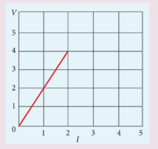
(a) \( 2 \ \Omega \)
(b) \( 4 \ \Omega \)
(c) \( 8 \ \Omega \)
(d) \( 1 \ \Omega \)

**விடை: (a)**

2. ஒரு மீட்டர் நீளத்திற்கு \( 2 \ \Omega \) மின்தடை கொண்ட கம்பியானது \( 1 \ \mathrm{m} \) ஆரமுள்ள வட்ட வடிவமாக மாற்றப்படுகிறது. வட்டத்தின் வழியே எதிரெதிராக படத்தில் உள்ள \( A \) மற்றும் \( B \) புள்ளிகளுக்கிடையே தொகுப்பன் மின்தடையின் மதிப்பு காண்க.
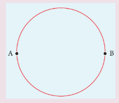
(a) \( \frac{\pi}{2} \ \Omega \)
(b) \( \pi \ \Omega \)
(c) \( 2\pi \ \Omega \)
(d) \( \frac{\pi}{4} \ \Omega \)

**விடை: (a)**

3. ஒரு ஏர் கண்டிஷனர் மின் இயந்திரம் \( 240 \ \mathrm{V} \) இல் செயல்படுகிறது, அதன் மின்தடை \( 120 \ \Omega \) எனில் அதன் திறன்

(a) \( 400 \ \mathrm{W} \)
(b) \( 2 \ \mathrm{W} \)
(c) \( 480 \ \mathrm{W} \)
(d) \( 240 \ \mathrm{W} \)

**விடை: (c)**

4. ஒரு கார்பன் மின்தடையாக்கியின் மின்தடை மதிப்பு \( (47 \pm 4.7) \ \mathrm{k}\Omega \) எனில் அதில் இடம்பெறும் நிற வளையங்களின் வரிசை

(a) மஞ்சள் – பச்சை – ஊதா – தங்கம்
(b) மஞ்சள் – ஊதா – ஆரஞ்சு – வெள்ளி
(c) ஊதா – மஞ்சள் – ஆரஞ்சு – வெள்ளி
(d) பச்சை – ஆரஞ்சு – ஊதா – தங்கம்

**விடை: (b)**

5. பின்வரும் மின்தடையின் மதிப்பு என்ன?

(a) \( 100 \ \mathrm{k}\Omega \)
(b) \( 10 \ \mathrm{k}\Omega \)
(c) \( 1 \ \mathrm{k}\Omega \)
(d) \( 1000 \ \mathrm{k}\Omega \)

**விடை: (a)**

6. ஒரே நீளமும் மற்றும் ஒரே பொருளால் செய்யப்பட்ட \( A \) மற்றும் \( B \) என்ற இரு கம்பிகள் வட்ட வடிவ குறுக்கு பரப்பையும் கொண்டுள்ளன. \( R_A = 3R_B \) எனில் \( A \) கம்பியின் ஆரத்திற்கும் \( B \) கம்பியின் ஆரத்திற்கும் இடைப்பட்ட விகிதம் என்ன?

(a) \( 3 \)
(b) \( \sqrt{3} \)
(c) \( \frac{1}{\sqrt{3}} \)
(d) \( \frac{1}{3} \)

**விடை: (c)**

7. \( 230 \ \mathrm{V} \) மின்னழுத்த மூலத்துடன் இணைக்கப்பட்ட கம்பியில் திறன் இழப்பு \( P_1 \). அக்கம்பியானது இரு சமமான பகுதிகளாக வெட்டப்பட்டு இரு துண்டுகளும் பக்க இணைப்பில் அதே மின்னழுத்த மூலத்துடன் இணைக்கப்படுகின்றன. இந்நிலையில் திறன் இழப்பு \( P_2 \) எனில் \( \frac{P_1}{P_2} \) எனும் விகிதம்

(a) \( 1 \)
(b) \( 2 \)
(c) \( 3 \)
(d) \( 4 \)

**விடை: (d)**

8. இந்தியாவில் வீடுகளின் பயன்பாட்டிற்கு \( 220 \ \mathrm{V} \) மின்னழுத்த வேறுபாட்டில் மின்சாரம் அளிக்கப்படுகிறது. இது அமெரிக்காவில் \( 110 \ \mathrm{V} \) அளவு என அளிக்கப்படுகிறது. இந்தியாவில் பயன்படுத்தப்படும் \( 60 \ \mathrm{W} \) மின்விளக்கின் மின்தடை \( R \) எனில், அமெரிக்காவில் பயன்படுத்தப்படும் \( 60 \ \mathrm{W} \) மின்விளக்கின் மின்தடை

(a) \( R \)
(b) \( 2R \)
(c) \( \frac{R}{4} \)
(d) \( \frac{R}{2} \)

**விடை: (c)**

9. ஒரு பெரிய கட்டிடத்தில், \( 40 \ \mathrm{W} \) மின்விளக்குகள் \( 15 \), \( 100 \ \mathrm{W} \) மின்விளக்குகள் \( 5 \), \( 80 \ \mathrm{W} \) மின்விசிரிகள் \( 5 \) மற்றும் \( 1 \ \mathrm{kW} \) மின் சூடேற்றி \( 1 \) ஆகியவை இணைக்கப்பட்டுள்ளன. மின் மூலத்தின் மின்னழுத்தம் \( 220 \ \mathrm{V} \) எனில் கட்டிடத்தின் மைய மின் உருகியின் அதிக பட்ச மின்னோட்டம் தாங்கும் அளவு (IIT-JEE 2014)

(a) \( 14 \ \mathrm{A} \)
(b) \( 8 \ \mathrm{A} \)
(c) \( 10 \ \mathrm{A} \)
(d) \( 12 \ \mathrm{A} \)

**விடை: (d)**

10. பின்வரும் மின்சுற்றில் உள்ள மின்னோட்டம் \( 1 \ \mathrm{A} \) எனில் மின்தடையின் மதிப்பு என்ன ?
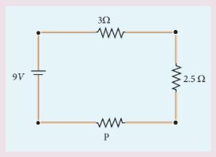
(a) \( 1.5 \ \Omega \)
(b) \( 2.5 \ \Omega \)
(c) \( 3.5 \ \Omega \)
(d) \( 4.5 \ \Omega \)

**விடை: (c)**

11. மின்கல அடுக்கிலிருந்து வெளிவரும் மின்னோட்டத்தின் மதிப்பு என்ன ?

(a) \( 1 \ \mathrm{A} \)
(b) \( 2 \ \mathrm{A} \)
(c) \( 3 \ \mathrm{A} \)
(d) \( 4 \ \mathrm{A} \)

**விடை: (a)**

12. ஒரு கம்பியின் வெப்பநிலை மின்தடை எண் \( 0.00125/^\circ \mathrm{C} \). \( 20^\circ \mathrm{C} \) வெப்பநிலையில் கம்பியின் மின்தடை \( 1 \ \Omega \) எனில் எந்த வெப்பநிலையில் அதன் மின்தடை \( 2 \ \Omega \) ஆகும் ?

(a) \( 800^\circ \mathrm{C} \)
(b) \( 700^\circ \mathrm{C} \)
(c) \( 850^\circ \mathrm{C} \)
(d) \( 820^\circ \mathrm{C} \)

**விடை: (d)**

13. \( 2.1 \ \mathrm{V} \) மின்கலமானது \( 10 \ \Omega \) மின்தடை வழியே \( 0.2 \ \mathrm{A} \) மின்னோட்டத்தை செலுத்தினால் அதன் அகமின்தடை

(a) \( 0.2 \ \Omega \)
(b) \( 0.5 \ \Omega \)
(c) \( 0.8 \ \Omega \)
(d) \( 1.0 \ \Omega \)

**விடை: (b)**

14. ஒரு தாமிரத்துண்டு மற்றும் மற்றொரு ஜெர்மானியத்துண்டு ஆகியவற்றின் வெப்பநிலையானது அறை வெப்பநிலையிலிருந்து \( 80 \ \mathrm{K} \) வெப்பநிலைக்கு குளிர்விக்கப்படுகிறது.

(a) இரண்டின் மின்தடையும் அதிகரிக்கும்.
(b) இரண்டின் மின்தடையும் குறையும்
(c) தாமிரத்தின் மின்தடை அதிகரிக்கும். ஆனால் ஜெர்மானியத்தின் மின்தடை குறையும்
(d) தாமிரத்தின் மின்தடை குறையும். ஆனால் ஜெர்மானியத்தின் மின்தடை அதிகரிக்கும்.

**விடை: (d)**

15. ஜூலின் வெப்ப விதியில், \( R \) மற்றும் \( t \) மாறிலிகளாக உள்ளது. \( H \) ஐ \( y \) அச்சிலும் \( I^2 \) ஐ \( x \) அச்சிலும் கொண்டு வரையப்பட்ட வரைபடம் ஒரு

(a) நேர்க்கோடு
(b) பரவளையம்
(c) வட்டம்
(d) நீள்வட்டம்

**விடை: (a)**

### II. சிறு விடை வினாக்கள்

1. மின்னோட்டம் என்பது ஒரு ஸ்கேலர். ஏன் ?
2. மின்னோட்ட அடர்த்தி வரையறு.
3. இழப்புத் திசைவேகம் மற்றும் இயக்க எண் ஆகியவற்றை வேறுபடுத்து.
4. ஓம் விதியின் நுண் வடிவத்தை கூறு.
5. ஓம் விதியின் பயனாட்டு வடிவத்தைக் கூறு.
6. ஓம் விதிக்கு உட்படும் மற்றும் ஓம் விதிக்கு உட்படாத சாதனங்கள் யாவை?
7. மின்தடை எண் வரையறு.
8. வெப்பநிலை மின்தடை எண் வரையறு.
9. மீக் கடத்து திறன் என்றால் என்ன?
10. மின்திறன் மற்றும் மின் ஆற்றல் என்றால் என்ன?
11. ஒரு மின்சுற்றில் திறனுக்கான சமன்பாடு \( P = VI \) என்பதை வருவி.
12. மின்சுற்றில் திறனுக்கான பல்வேறு வகையான சமன்பாடுகளை எழுதுக.
13. கிர்க்காஃப்பின் மின்னோட்ட விதியைக் கூறுக.
14. கிர்க்காஃப்பின் மின்னழுத்த வேறுபாடு விதியைக் கூறு.
15. மின்னழுத்த மானியின் தத்துவத்தை கூறு.
16. ஒரு மின் கலத்தின் அகமின்தடை என்பதன் பொருள் என்ன?
17. ஜூலின் வெப்ப விதியைக் கூறுக.
18. சீபக் விளைவு என்றால் என்ன?
19. தாம்சன் விளைவு என்றால் என்ன?
20. பெல்டியர் விளைவு என்றால் என்ன?
21. சீபக் விளைவின் பயன்பாடுகள் யாவை?

### III. விரிவான விடை வினாக்கள்

1. மின்னோட்டத்தின் நுண்மாதிரிக் கொள்கையை விவரித்து அதிலிருந்து ஓம் விதியின் நுண் வடிவத்தை பெறுக.
2. ஓம் விதியின் நுண்மாதிரி அமைப்பிலிருந்து ஓம் விதியின் பயனாட்டு வடிவத்தை பெறுக. அதன் வரம்புகளை விவாதி.
3. மின்தடையாக்கிகள் தொடர் இணைப்பிலும் பக்க இணைப்புகளிலும் இணைக்கப்படும்போது அதன் தொகுப்பன் மின்தடை மதிப்புகளை தருவி.
4. வோல்ட்மீட்டரை பயன்படுத்தி மின்கலத்தின் அக மின்தடையைக் காண்பதை விளக்குக.
5. கிர்க்காஃப் விதிகளை கூறி விளக்குக.
6. வீட்ஸ்டோன் சமனச்சுற்றில் சமன்செய் நிலைக்கான நிபந்தனையைப் பெறுக.
7. மீட்டர் சமன்சுற்றை பயன்படுத்தி தெரியாத மின்தடையைக் காண்பதை விளக்குக.
8. மின்னழுத்தமானியை பயன்படுத்தி இரு மின்கலங்களின் மின்னியக்கு விசைகள் எவ்வாறு ஒப்பிடப்படுகின்றன?

### IV. கணக்குகள்

1. பின்வரும் வரைபடங்கள் \( A \), \( B \), \( C \), \( D \), \( E \) மற்றும் \( F \) ஆகிய ஆறு கடத்திகளின் மின்னோட்டம் – மின்னழுத்தம் மற்றும் மின்னழுத்தம் – மின்னோட்டம் ஆகியவற்றின் தொடர்பினை தருகின்றன எனில், அதிக மின்தடை உள்ள கடத்தி மற்றும் குறைந்த மின்தடை உள்ள கடத்திகள் எவை?

**விடை:** குறைந்த மின்தடை: \( R = 0.4 \ \Omega \), அதிக மின்தடை \( R = 2.5 \ \Omega \) (F)

2. மின்னல் என்பது இயற்கையில் உருவாகும் மின்னோட்டத்திற்கு சிறந்த எடுத்துக்காட்டு. இந்த வகை மின்னலில் \( 5 \times 10^7 \ \mathrm{V} \) மின்னழுத்த வேறுபாட்டில் \( 0.2 \ \mathrm{s} \) நேர இடைவெளியில் \( 10^9 \ \mathrm{J} \) ஆற்றல் பரிமாற்றம் ஏற்படுகிறது. இந்த தகவலை பயன்படுத்தி கீழ்கண்ட அளவுகளை கணக்கிடுக.

(a) மேகத்திற்கும் புவிக்கும் இடையே பரிமாற்றம் செய்யப்பட்ட மின்துகள்களின் மொத்த மின்னூட்டத்தின் அளவு
(b) மின்னல் வெட்டில் ஏற்பட்ட மின்னோட்டம்
(c) \( 0.2 \ \mathrm{s} \) நேர இடைவெளியில் அளிக்கப்பட்ட மின்திறன்

**விடைகள்:** மின்னூட்டம் = \( 20 \ \mathrm{C} \), \( I = 100 \ \mathrm{A} \), \( P = 5 \ \mathrm{GW} \)

3. \( 10^{-6} \ \mathrm{m}^2 \) குறுக்குவெட்டு பரப்பு கொண்ட ஒரு தாமிரக்கம்பி வழியே \( 2 \ \mathrm{A} \) மின்னோட்டம் செல்கிறது. ஒரு கன மீட்டரில் உள்ள எலக்ட்ரான்களின் எண்ணிக்கை \( 8 \times 10^{28} \) எனில், மின்னோட்ட அடர்த்தி மற்றும் சராசரி இழுப்புத்திசை வேகத்தை கணக்கிடுக.

**விடைகள்:** \( J = 2 \times 10^6 \ \mathrm{A} \ \mathrm{m}^{-2} \); \( v_d = 15.6 \times 10^{-5} \ \mathrm{m} \ \mathrm{s}^{-1} \)

4. \( 20^\circ \mathrm{C} \) இல் ஒரு நிக்ரோம் கம்பியின் மின்தடை \( 10 \ \Omega \). அதன் வெப்பநிலை மின்தடை எண் \( 0.004/^\circ \mathrm{C} \) எனில் நீரின் கொதி நிலையில் அதன் மின்தடையைக் கணக்கிடுக. உன் முடிவை விவாதி.

**விடை:** \( R = 13.2 \ \Omega \). வெப்பநிலை அதிகரிக்க கம்பியின் மின்தடையும் அதிகரிக்கும்.

5. பின்வரும் படத்தில் உள்ள தண்டு இரண்டு வெவ்வேறு பொருட்களில் ஆனது.

இரண்டு பொருட்களும் \( 3 \ \mathrm{mm} \) பக்கமுடைய சதுர குறுக்கு வெட்டு பரப்பைக் கொண்டுள்ளன. \( 25 \ \mathrm{cm} \) நீளமுள்ள முதல் பொருளின் மின்தடை எண் \( 4 \times 10^{-3} \ \Omega \ \mathrm{m} \) மற்றும் \( 70 \ \mathrm{cm} \) நீளமுள்ள இரண்டாவது பொருளின் மின்தடை எண் \( 5 \times 10^{-3} \ \Omega \ \mathrm{m} \). இத்தண்டின் இரு முகைகளுக்கிடையே உள்ள மின்தடை மதிப்பு என்ன ?

**விடை:** \( 500 \ \Omega \)

6. \( R \) மின்தடை கொண்ட ஒரே மாதிரியான மூன்று மின்விளக்குகள் \( \varepsilon \) மின்னியக்கு விசை கொண்ட மின்கலத்துடன் படத்தில் காட்டியவாறு இணைக்கப்பட்டுள்ளன. திடீரென \( S \) என்ற சாவி மூடப்படுகிறது.

(a) \( S \) திறந்த நிலை மற்றும் மூடிய நிலையில் மின்சுற்றின் மின்னோட்டத்தை கணக்கிடுக.
(b) \( A \), \( B \) மற்றும் \( C \) மின் விளக்குகளின் பொலிவு எப்படி அமையும்?
(c) \( S \) திறந்த மற்றும் மூடிய நிலையில் மூன்று மின் விளக்குகளின் குறுக்கே உள்ள மின்னழுத்த வேறுபாடுகளை கணக்கிடுக.
(d) \( S \) திறந்த மற்றும் மூடிய நிலையில் மின் சுற்றுக்கு அளிக்கப்படும் திறன்களை கணக்கிடுக.
(e) மின்சுற்றுக்கு அளிக்கப்படும் திறன் அதிகரிக்குமா? குறையுமா? அல்லது மாறாமல் அமையுமா?

| மின் அளவுகள் | சாவி S திறந்த நிலை | சாவி S மூடிய நிலை |
|---|---|---|
| (a) மின்னோட்டம் | \( \frac{\varepsilon}{3R} \) | \( \frac{\varepsilon}{2R} \) |
| (b) மின்னழுத்த வேறுபாடு | \( V_A = \frac{\varepsilon}{3} \) \( V_B = \frac{\varepsilon}{3} \) \( V_C = \frac{\varepsilon}{3} \) | \( V_A = \frac{\varepsilon}{2} \) \( V_B = \frac{\varepsilon}{2} \) \( V_C = 0 \) |
| (c) திறன் | \( P_A = \frac{\varepsilon^2}{9R} \) \( P_B = \frac{\varepsilon^2}{9R} \) \( P_C = \frac{\varepsilon^2}{9R} \) | \( P_A = \frac{\varepsilon^2}{4R} \) \( P_B = \frac{\varepsilon^2}{4R} \) \( P_C = 0 \) |
| (d) செறிவு | அனைத்து மின்விளக்குகளும் ஒரே பொலிவுடன் ஒளிரும் | \( A \) மற்றும் \( B \) மின் விளக்குகளின் பொலிவு சமமாக அதிகரிக்கும். மின் விளக்கு \( C \) வழியே மின்னோட்டம் பாயாததால் அது ஒளிராது |
| (e) மொத்தத் திறன் | \( \frac{\varepsilon^2}{3R} \) | \( \frac{\varepsilon^2}{2R} \) |

7. மின்னணுவியலை விருப்பமாக கொண்ட மாணவி ஒரு வானொலிப் பெட்டியை உருவாக்குகிறார். அந்த மின்சுற்றுக்கு ஒரு \( 150 \ \Omega \) மின்தடை தேவைப்படுகிறது. ஆனால் அவரிடம் \( 220 \ \Omega \), \( 79 \ \Omega \) மற்றும் \( 92 \ \Omega \) மின்தடைகள் மட்டுமே உள்ளன எனில் அவர் இம்மின்தடைகளை எவ்வாறு இணைத்து தேவையான மதிப்புடைய மின்தடையை பெறுவார்?

**விடை:** \( 79 \ \Omega \) மற்றும் \( 220 \ \Omega \) பக்க இணைப்பில் வைத்து \( 92 \ \Omega \) மின்தடையை தொடர் இணைப்பில் இணைக்க வேண்டும்.

8. ஒரு மின்கலம் \( 2 \ \Omega \) மின்தடை வழியாக \( 0.9 \ \mathrm{A} \) மின்னோட்டத்தையும், \( 7 \ \Omega \) மின்தடை வழியே \( 0.3 \ \mathrm{A} \) மின்னோட்டத்தையும் ஏற்படுத்துகிறது எனில் மின்கலத்தின் அகமின்தடையைக் கணக்கிடுக.

**விடை:** \( 0.5 \ \Omega \)

9. பின்வரும் மின்சுற்றில் உள்ள மின்னோட்டங்களை கணக்கிடுக.

**விடைகள்:** \( I_1 = 0.070 \ \mathrm{A} \), \( I_2 = -0.010 \ \mathrm{A} \) மற்றும் \( I_3 = 0.080 \ \mathrm{A} \)

10. \( 4 \ \mathrm{m} \) நீளமுள்ள மின்னழுத்தமானிக் கம்பியின் மின்தடை \( 20 \ \Omega \). இது \( 2980 \ \Omega \) மின் தடை மற்றும் \( 4 \ \mathrm{V} \) மின்னியக்கு விசை கொண்ட மின்கலம் ஆகியவற்றுடன் தொடரிணைப்பில் இணைக்கப்பட்டுள்ளது, எனில் கம்பியின் வழியே மின்னழுத்த சரிவை கணக்கிடுக.

**விடை:** \( 0.65 \times 10^{-2} \ \mathrm{V} \ \mathrm{m}^{-1} \).

11. படத்தில் காட்டப்பட்டுள்ள மின்சுற்றிலுள்ள கால்வனோமீட்டர் வழியே பாயும் மின்னோட்டத்தை காண்க.

12. \( 5 \ \mathrm{V} \) மின்னியக்கு விசை கொண்ட இரு மின்கலங்கள் தொடரிணைப்பில் இணைக்கப்பட்டு \( 8 \ \Omega \) மின்தடை மற்றும் \( 4 \ \Omega \), \( 6 \ \Omega \) மற்றும் \( 12 \ \Omega \) ஆகிய மின்தடைகளின் பக்க இணைப்பு ஆகியவற்றின் குறுக்கே இணைக்கப்பட்டுள்ளன. மேற்கண்ட அமைப்பிற்கு மின்சுற்று ஒன்று வரைந்து (அ) மின் கலத்திலிருந்து பெறப்படும் மின்னோட்டம் (ஆ) ஒவ்வொரு மின்தடை வழியேச் செல்லும் மின்னோட்டம் ஆகியவற்றை கணக்கிடுக.

**விடை:** (அ) \( 8 \ \Omega \) மின்தடை வழியாக, \( I = 1 \ \mathrm{A} \)
(ஆ) \( 4 \ \Omega \) மின்தடை வழியாக, \( I = 0.5 \ \mathrm{A} \); \( 6 \ \Omega \) மின்தடை வழியாக, \( I = 0.33 \ \mathrm{A} \); \( 12 \ \Omega \) மின்தடை வழியாக, \( I = 0.17 \ \mathrm{A} \)

13. \( P \), \( Q \), \( R \), \( S \) ஆகிய நான்கு மின் விளக்குகளானது தெரியாத மின்சுற்று அமைப்பு ஒன்றில் இணைக்கப்பட்டுள்ளன. ஒவ்வொரு மின் விளக்கும் ஒன்றை பின் ஒன்றாக நீக்கப்படும்போது பின்வரும் நிகழ்வுகள் ஏற்படுகின்றன.

| | P | Q | R | S |
|---|---|---|---|---|
| P நீக்கப்படுதல் | * | ஒளிர்கிறது | ஒளிர்கிறது | ஒளிர்கிறது |
| Q நீக்கப்படுதல் | ஒளிர்கிறது | * | ஒளிர்கிறது | ஒளிர்கிறது |
| R நீக்கப்படுதல் | ஒளிரவில்லை | ஒளிரவில்லை | * | ஒளிரவில்லை |
| S நீக்கப்படுதல் | ஒளிர்கிறது | ஒளிர்கிறது | ஒளிரவில்லை | * |

இந்த மின்விளக்குகள் இணைக்கப்பட்ட மின்சுற்று வரைபடத்தை வரைக.

14. ஒரு மின்னழுத்தமானி அமைப்பில், \( 1.25 \ \mathrm{V} \) மின்னியக்கு விசை கொண்ட மின்கலம் தரும் சமன்செய் நீளம் \( 35 \ \mathrm{cm} \) நீளத்தில் ஏற்படுகிறது. இந்த மின்கலம் மாற்றப்பட்டு மற்றொரு மின்கலம் இணைக்கப்படும்போது, சமன்செய் நீளம் \( 63 \ \mathrm{cm} \) க்கு நகர்கிறது. எனில் இரண்டாவது மின்கலத்தின் மின்னியக்கு விசை என்ன?

**விடை:** இரண்டாவது மின்கலத்தின் மின்னியக்கு விசை \( 2.25 \ \mathrm{V} \)

### மேற்கோள் நூல்கள் (BOOKS FOR REFERENCE)

1. Douglas C.Giancoli, “Physics for Scientist & Engineers with Modern Physics”, Pearson Prentice Hall, Fourth edition.
2. James Walker, Physics, Pearson-Addison Wesley publishers, Fourth edition.
3. Tipler, Mosca, “Physics for scientist and Engineers with Modern Physics”, Freeman and Company, sixth edition.
4. Purcell, Morin, Electricity and magnetism, Cambridge university press, third edition.
5. Serway and Jewett, “Physics for Scientist and Engineers with Modern Physics”, Brook/Coole publishers, eighth edition.
6. Tarasov and Tarasova, “Questions and problems in School Physics”, Mir Publishers.
7. H.C.Verma, “Concepts of Physics Vol 2, Bharthi Bhawan publishers.
8. Eric Roger, Physics for the Inquiring Mind, Princeton University press.

### இணையச் செயல்பாடு

**மின்னோட்டவியல்**

**நோக்கம்:** இந்த செயல்பாட்டின் மூலம் மாணவர்கள் (அ) மின்கலத்தின் மின்னழுத்த வேறுபாட்டினை அளவிடுவர். (ஆ) கொடுக்கப்பட்ட முதல்மை மின்கலத்தின் அகமின்தடையை கண்டுபிடிப்பர்.

**தலைப்பு:** மின்னழுத்தமானி

**படிகள்**

• "olabs.edu.in" தளத்தில் 12 ஆம் வகுப்பின் கீழே கொடுக்கப்பட்டுள்ள "Potentiometer-Internal Resistance of a Cell" என்ற பக்கத்திற்கு சென்று "simulator" என்ற தாவலை கொடுக்கவும்.

• "show circuit diagram" என்ற பொத்தானை சொடுக்கும் போது கிடைக்கும் மின்சுற்றுப் படத்தில் காட்டியபடி மின்சுற்றின் பல்வேறு பாகங்களை சுட்டியை பயன்படுத்தி சுட்டி இழுத்து (dragging) இணைப்பதன் மூலம் மின்சுற்றை உருவாக்கலாம்.

• தொடு சாவியை மின்னழுத்தமானி கம்பியின் இருமுனைகளிலும் வைக்கும் போது கால்வனோமீட்டரில் இருக்கும் குறிமுள் இருபுறமும் விலகல் அடைந்தால் மின்சுற்று இணைப்பு சரியாக இருக்கிறது என தெரிந்து கொள்ளலாம்.

சமன் செய்யும் நீளத்தை காண்க. சமன் செய்யும் நீளத்தை பயன்படுத்தி கம்பியின் அகமின்தடையை காண்க. பரிசோதனையை ஐந்து முறை மீண்டும் திரும்பச் செய்து சராசரி அகமின் தடையை காண்க.

**குறிப்பு:** உங்கள் மின்னஞ்சல் கணக்கை பயன்படுத்தி ஒருமுறை பதிவு செய்ய வேண்டும். இந்த பக்கத்தில் கொடுக்கப்பட்டுள்ள Read theory, procedure and animation ஆகிய தாவல்களை சொடுக்கி மின்னழுத்தமானி பற்றி அதிகமாக தெரிந்து கொள்ளுங்கள்.

**உரவி:** http://amrita.olabs.edu.in/?sub=1&brch=6&sim=147&cnt=4

*படங்கள் அடையாளத்திற்கு மட்டும்.
* தேவையெனில் Flash Player or Java Script அனுமதிக்க.