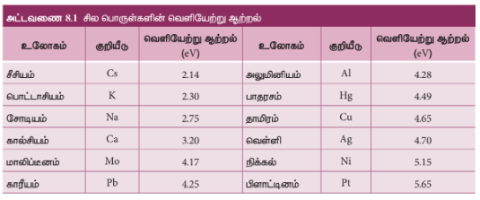
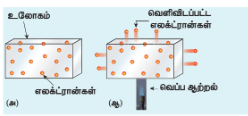
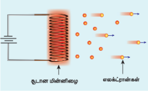
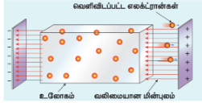
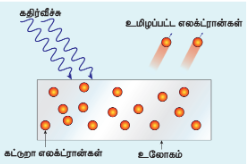
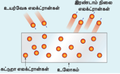

### 8.1 அறிமுகம்

துகள் மற்றும் அலை பற்றிய கருத்துகளை நமது அன்றாட அனுபவத்தில் நாம் நன்கு அறிந்திருக்கின்றோம். கோலிக்குண்டுகள், மண்துகள்கள், அணுக்கள், எலக்ட்ரான்கள் போன்றவை துகள்களுக்கு எடுத்துக்காட்டுகள் ஆகும். அதேபோல கடல் அலைகள், குளங்களில் ஏற்படும் சிற்றலைகள், ஒலி அலைகள் மற்றும் ஒளி அலைகள் ஆகியவை அலைகளுக்கு எடுத்துக்காட்டுகளாக அமைகின்றன.

துகள் என்பது மிகச்சிறிய அளவிலான குவிக்கப்பட்ட பருப்பொருள் என கருதப்படுகிறது (குறிப்பிட்ட இடம் மற்றும் கால எல்லைகள்). ஆனால் அலை என்பது அகன்ற பரவலான ஆற்றலாகும் (குறிப்பிட்ட இடம் மற்றும் கால எல்லைகள் இல்லாதது). மேலும் இவை இரண்டும் (துகள் மற்றும் அலை) ஆற்றல் மற்றும் உந்தத்தை ஓரிடத்திலிருந்து மற்றொரு இடத்திற்கு எடுத்துச் செல்லும் திறன் பெற்றவை.

பெரிய பொருள்களின் (macroscopic objects) இயக்கத்தை விளக்கும் பண்டைய இயற்பியலானது (Classical physics), துகள் மற்றும் அலைகள் ஆகியவற்றை இயல் உலகின் வெவ்வேறு கூறுகளாகக் கருதுகிறது. தனித்தனியாக சோதனைகள் மற்றும் தத்துவங்களை தம்முள் கொண்டுள்ள பொருள்களின் இயந்திரவியலும், அலைகளின் ஒளியியலும் காலந்தொட்டு தனித்தனியான பாடப்பிரிவுகளாகக் கருதப்பட்டுவந்தன.

தகுந்த சூழ்நிலைகளில் குறுக்கீட்டு விளைவு, விளிம்பு விளைவு மற்றும் தள விளைவு ஆகிய நிகழ்வுகளில் அலைப்பண்புகளை வெளிப்படுத்துவதால் மின்காந்த கதிர்கள் ஆனது அலைகளாகக் கருதப்படுகின்றன. அதே போல கரும்பொருள் கதிர்வீச்சு, ஒளிமின் விளைவு ஆகிய வேறு சில சூழ்நிலைகளில் மின்காந்த கதிர்கள் ஆனது துகள்களாகக் கருதப்படுகின்றன.

எலக்ட்ரான்கள், புரோட்டான்கள் மற்றும் ஏனைய துகள்கள் கண்டுபிடிக்கப்பட்டபோது, அவை துகள்களாக மட்டுமே கருதப்பட்டன. ஏனென்றால் அவை நிறை மற்றும் மின்னூட்டத்தைக் கொண்டுமிருந்தன. ஆனால் சில குறிப்பிட்ட சூழ்நிலைகளில், இந்தத் துகள்கள் அலை இயல்பையும் வெளிப்படுத்துகின்றன என்பதை பிற்காலத்தில் செய்யப்பட்ட பரிசோதனைகள் எடுத்துக்காட்டின.

இந்த அலகில் நாம் முதலில் அலைகளின் (கதிர்வீச்சுகளின்) துகளியல்பையும், துகள்களின் (பருப்பொருள்களின்) அலையியல்பையும் காண்போம். அதாவது கதிர்வீச்சு மற்றும் பருப்பொருள் ஆகியவற்றின் அலை - துகள் என்ற இருமைப் பண்பினை தகுந்த பரிசோதனைகள் மூலம் கற்க உள்ளோம்.

### 8.1.1 எலக்ட்ரான் உமிழ்வு (Electron emission)

உலோகங்களின் வெளிக்கூட்டில் உள்ள எலக்ட்ரான்கள் அணுக்கருக்களுடன் தளர்வாக பிணைக்கப்பட்டுள்ளன. அறை வெப்பநிலைகளில் கூட அதிக அளவிலான #### ஹெர்ட்ஸின்
 எலக்ட்ரான்கள் உலோகத்தின் உள்ளே வெவ்வேறு திசைகளில் இயங்கிக் கொண்டுள்ளன. உலோகத்தினுள் இந்த எலக்ட்ரான்கள் கட்டுப்பாடின்றி இயங்கினாலும் உலோகப்பரப்பை விட்டு வெளியேற முடிவதில்லை. இதற்கு காரணம்; எலக்ட்ரான்கள் உலோகத்தின் மேற்பரப்பை அடைந்தவுடன், உலோகத்தில் உள்ள நேர்மின்னூட்டம் கொண்ட அணுக்கருக்களினால் கவரப்படுகின்றன. அறை வெப்பநிலையின் சூழ்நிலைகளில், இந்த கவர்ச்சி விசையானது கட்டற்ற எலக்ட்ரான்களை உலோகத்தின் மேற்பரப்பிலிருந்து வெளியேற அனுமதிப்பதில்லை.

உலோகத்தின் மேற்பரப்பிலிருந்து வெளியேற வேண்டுமெனில், அணுக்கருக்களினால் உண்டாகும் மின்னழுத்த அரணை (potential barrier) கட்டற்ற எலக்ட்ரான்கள் கடக்கவேண்டும். உலோகத்தின் மேற்பரப்பிலிருந்து கட்டற்ற எலக்ட்ரான்களை வெளியேறவிடாமல் தடுக்கும் மின்னழுத்த அரண், பரப்பு அரண் (surface barrier) என அழைக்கப்படுகிறது.

 எலக்ட்ரான்கள் சிறிதளவு இயக்க ஆற்றலைக் கொண்டுள்ளன. மேலும் இந்த இயக்க ஆற்றல் வெவ்வேறு எலக்ட்ரான்களுக்கு வெவ்வேறாக அமையும். எலக்ட்ரான்களின் இந்த இயக்க ஆற்றல் பரப்பு அரணைக் கடப்பதற்கு போதுமானதாக இருக்காது. ஆனால் கட்டற்ற எலக்ட்ரான்களுக்கு கூடுதல் ஆற்றல் அளிக்கப்படும் போது, பரப்பு அரணைக் கடப்பதற்கு போதுமான ஆற்றலைப் பெற்று உலோகத்தின் மேற்பரப்பிலிருந்து வெளியேறுகின்றன. பொருளின் எந்தவொரு பரப்பிலிருந்தும் எலக்ட்ரான் வெளியேற்றப்படும் நிகழ்வு எலக்ட்ரான் உமிழ்வு எனப்படும்.உலோகத்தின் பரப்பிலிருந்து எலக்ட்ரானை வெளியேற்றத் தேவைப்படும் சிறும ஆற்றல் உலோகத்தின் வெளியேற்று ஆற்றல் (work function) எனப்படும். இது $\Phi_0$ என குறிக்கப்படுகிறது. வெளியேற்று ஆற்றலின் அலகு எலக்ட்ரான் வோல்ட் (eV) ஆகும்.

>குறிப்பு: ஆற்றலின் SI அலகு ஜூல் ஆகும். ஆனால் அணு மற்றும் அணுக்கரு இயற்பியலில் ஆற்றல் ஆனது எலக்ட்ரான் வோல்ட் எனும் அலகுகளால் குறிக்கப்படுகிறது.ஒரு எலக்ட்ரான் வோல்ட் என்பது $1 \text{ V}$ மின்னழுத்த வேறுபாட்டினால் முடுக்கப்படும் போது எலக்ட்ரான் பெறும் இயக்க ஆற்றலின் அளவாகும்.$$1 \text{ eV} = \text{எலக்ட்ரான் பெறும் இயக்க ஆற்றல்}$$$$= \text{மின்னபுலத்தினால் எலக்ட்ரான் மீது செய்யப்படும் வேலை}$$$$= q V$$$$= 1.602 \times 10^{-19} \text{ C} \times 1 \text{ V}$$$$= 1.602 \times 10^{-19} \text{ J}$$

உலோகத்தினுள் உள்ள கட்டற்ற எலக்ட்ரான்களின் பெரும இயக்க ஆற்றல் $0.5 \text{ eV}$ எனவும், உலோகத்தின் பரப்பு அரணைக் கடப்பதற்குத் தேவைப்படும் ஆற்றல் $3 \text{ eV}$ எனவும் கொள்வோம். எனவே உலோகத்தின் பரப்பிலிருந்து எலக்ட்ரானை வெளியேற்றத் தேவைப்படும் சிறும ஆற்றல் $3 - 0.5 = 2.5 \text{ eV}$ ஆகும். இங்கே $2.5 \text{ eV}$ என்பது உலோகத்தின் வெளியேற்று ஆற்றல் எனப்படும்.

வெளியேற்று ஆற்றலானது வெவ்வேறு உலோகங்களுக்கு வெவ்வேறாக அமையும். வெளியேற்று ஆற்றலானது உலோகங்கள் மற்றும் அதன் பரப்புகளின் தன்மையைப் பொறுத்து அமையும் தனிப்பண்பாகும். அட்டவணை 8.1 ஆனது வெவ்வேறு உலோகங்களின் தோராயமான வெளியேற்று ஆற்றல் மதிப்புகளைத் தருகிறது. வெளியேற்று ஆற்றல் குறைவாக உள்ள உலோகங்கள் எலக்ட்ரான் உமிழ்விற்கு சிறந்து விளங்குகின்றன. ஏனெனில் இந்த உலோகங்களில் இருந்து எலக்ட்ரானை வெளியேற்றத் தேவைப்படும் கூடுதல் ஆற்றல் குறைவாகவே அமையும்.

எனவே எலக்ட்ரான் உமிழ்விற்கு தேர்ந்தெடுக்கப்படும் உலோகம் குறைந்த வெளியேற்று ஆற்றலைக் கொண்டிருக்க வேண்டும். எலக்ட்ரான்களை வெளியேற்றுவதற்குப் பயன்படுத்தப்படும் ஆற்றல் வடிவினைப் பொறுத்து, எலக்ட்ரான் உமிழ்வு நான்கு முக்கிய வகைகளாகப் பிரிக்கப்பட்டுள்ளது. அவை கீழே விவரிக்கப்பட்டுள்ளன.

#### i) வெப்ப அயனி உமிழ்வு (Thermionic emission)

ஒரு உலோகத்தை உயர் வெப்பநிலைக்குச் சூடேற்றும்போது, உலோகத்தின் பரப்பில் உள்ள கட்டற்ற எலக்ட்ரான்கள் வெப்ப ஆற்றல் வடிவில் போதுமான ஆற்றலைப் பெற்று பரப்பிலிருந்து வெளியேறுகின்றன (படம் 8.1). இவ்வகை உமிழ்வு வெப்ப அயனி உமிழ்வு எனப்படும்.

படம் 8.1 (அ) உலோகம் (ஆ) சூடேற்றப்பட்ட உலோகம் ஆகியவற்றில் உள்ள எலக்ட்ரான்கள்
 

வெப்ப அயனி உமிழ்வின் செறிவு (உமிழப்படும் எலக்ட்ரான்களின் எண்ணிக்கை) ஆனது பயன்படுத்தப்படும் உலோகம் மற்றும் அதன் வெப்பநிலையைப் பொறுத்தது. எடுத்துக்காட்டுகள்: கேத்தோடு கதிர் குழாய்கள், எலக்ட்ரான் நுண்ணோக்கிகள், X-கதிர் குழாய்கள் போன்றவை (படம் 8.2).

படம் 8.2 கேத்தோடு கதிர் குழாய் அல்லது X-கதிர் குழாயில் உள்ள வெப்ப மின்னிழையில் வெப்ப அயனி உமிழ்வு
 

#### ii) புல உமிழ்வு (Field emission)

மிக வலிமையான மின்புலத்தை உலோகத்தின் குறுக்கே அளிக்கும்போது மின்புல உமிழ்வு ஏற்படுகிறது. இந்த வலிமையான மின்புலம் கட்டற்ற எலக்ட்ரான்களை கவர்ந்திழுத்து, அவை பரப்பு மின்னழுத்த அரணைக் கடந்து வெளியேற உதவுகின்றது (படம் 8.3). எடுத்துக்காட்டுகள்: புல உமிழ்வு வரிக்கண்ணோட்ட எலக்ட்ரான் நுண்ணோக்கிகள், புல உமிழ்வு காட்சிக் கருவி போன்றவை.

படம் 8.3 புல உமிழ்வு
 

#### iii) ஒளிமின் உமிழ்வு (Photoelectric emission)

குறிப்பிட்ட அதிர்வெண் கொண்ட மின்காந்த கதிர்வீச்சு உலோகப் பரப்பின் மீது படும்போது, ஆற்றலானது கதிர்வீச்சில் இருந்து கட்டற்ற எலக்ட்ரான்களுக்கு மாற்றப்படுகிறது. எனவே கட்டற்ற எலக்ட்ரான்கள் பரப்பு அரணைக் கடந்து வெளியேறுவதற்குப் போதுமான ஆற்றலைப் பெறுவதால் ஒளி மின் உமிழ்வு நடைபெறுகிறது (படம் 8.4). உமிழப்படும் எலக்ட்ரான்களின் எண்ணிக்கையானது படுகதிர்வீச்சின் செறிவினைப் பொறுத்து அமையும். எடுத்துக்காட்டுகள்: ஒளி டையோடுகள், ஒளி மின்கலங்கள் முதலியன.

படம் 8.4 ஒளிமின் உமிழ்வு
 

#### iv) இரண்டாம் நிலை உமிழ்வு (Secondary emission)

மிக வேகமாகச் செல்லும் எலக்ட்ரான் கற்றை உலோகத்தின் பரப்பின் மீது மோதும்போது, அதன் இயக்க ஆற்றல் உலோகப் பரப்பிலுள்ள கட்டற்ற எலக்ட்ரான்களுக்கு மாற்றப்படுகிறது. இதனால் கட்டற்ற எலக்ட்ரான்கள் போதிய அளவு இயக்க ஆற்றலைப் பெறுவதால் இரண்டாம் நிலை எலக்ட்ரான் உமிழ்வு ஏற்படுகிறது (படம் 8.5). எடுத்துக்காட்டுகள்: பிம்பச் செறிவாக்கிகள், ஒளி பெருக்கிக் குழாய்கள் முதலியன.

படம் 8.5 எலக்ட்ரான்களின் இரண்டாம் நிலை உமிழ்வு
