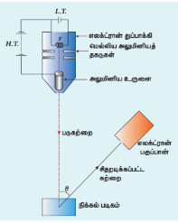
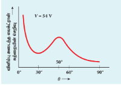
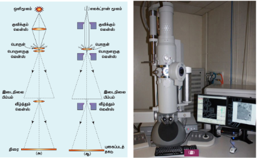

## 8.3 பருப்பொருள் அலைகள் (Matter waves)

### 8.3.1 அறிமுகம் − துகள்களின் அலை இயல்பு

இதுவரை, துகள் மற்றும் அலைகளின் சிறப்பியல்புகள் வெவ்வேறானவை என நாம் கற்றோம். ஓர் அலை என்பது அதன் அதிர்வெண், அலைநீளம், அலை திசைவேகம், வீச்சு மற்றும் செறிவு ஆகியவற்றால் குறிப்பிடப்படுகிறது. மேலும் அது பரந்து விரிந்து, வெளியின் ஓரளவு கணிசமான பகுதியை ஆக்கிரமிக்கிறது. ஒரு துகள் என்பது அதன் நிறை, திசைவேகம், உந்தம் மற்றும் ஆற்றல் ஆகியவற்றால் குறிப்பிடப்படுகிறது. மேலும் வெளியின் குறிப்பிட்ட குறைந்த அளவு பகுதியை ஆக்கிரமித்து, அளவில் சிறியதாக இருக்கும்.

பண்டைய இயற்பியலானது துகள்கள் மற்றும் அலைகளை வெவ்வேறானவை என விவரிக்கிறது. ஆனால் கதிர்வீச்சிற்கு இருமைப் பண்பு உள்ளது என குவாண்டம் கொள்கை நிரூபித்துள்ளது. அதாவது கதிர்வீச்சானது சில நேரங்களில் அலைகளாகவும், வேறு சில நேரங்களில் துகள்களாகவும் செயல்படுகிறது.

கதிர்வீச்சின் அலை - துகள் இருமைப் பண்பிலிருந்து, பருப்பொருளின் அலை இயல்பு உருவாகியுள்ளது. இதனை பின்வரும் பகுதியில் கற்போம்.

**டி ப்ராய் அலை:**

1924இல் பிரெஞ்சு நாட்டு இயற்பியல் அறிஞர் லூயிஸ் டி ப்ராய் (Louis de Broglie), கதிர்வீச்சின் அலை-துகள் இருமைப்பண்பு கருத்தினை பருப்பொருளுக்கு விரிவாக்கினார்.

இயற்கையின் சமச்சீர் பண்பின் விளைவாக, டி ப்ராய் பின்வரும் கருத்தினைப் பரிந்துரைத்தார்: ஒளி போன்ற கதிர்வீச்சு சில நேரங்களில் துகள்களாகச் செயல்படுகிறது எனில், எலக்ட்ரான் போன்ற பருப்பொருள் துகள்கள் சில நேரங்களில் அலைகள் போன்று செயல்பட வேண்டும்.

டி ப்ராயின் எடுகோளின் படி, இயக்கத்தில் உள்ள எலக்ட்ரான்கள், புரோட்டான்கள் மற்றும் நியூட்ரான்கள் போன்ற அனைத்து பருப்பொருள் துகள்களும் அலைப்பண்பைப் பெற்றுள்ளன. இந்த அலைகள் டி ப்ராய் அலைகள் அல்லது பருப்பொருள் அலைகள் எனப்படுகின்றன.

### 8.3.2 டி ப்ராய் அலைநீளம்

$\nu$ அதிர்வெண் கொண்ட ஃபோட்டானின் உந்தம் பின்வருமாறு
$$p = \frac{h \nu}{c} = \frac{h}{\lambda} \quad (\text{ஏனெனில் } \lambda = \frac{c}{\nu})$$
உந்தம் மூலமாக ஃபோட்டானின் அலைநீளம் பின்வரும் சமன்பாட்டால் பெறப்படுகிறது.
$$\lambda = \frac{h}{p} \quad (8.9)$$
டி ப்ராய் கொள்கையின்படி, மேற்கண்ட சமன்பாடானது பருப்பொருள் துகள்களுக்கும் பொருந்தக்கூடிய முழுவதும் பொதுவான சமன்பாடு ஆகும். எனவே $m$ நிறையும் $v$ வேகமும் கொண்ட துகளின் அலைநீளம் பின்வருமாறு அமையும்,
$$\lambda = \frac{h}{m v} = \frac{h}{p} \quad (8.10)$$
பருப்பொருள் அலையின் இந்த அலைநீளம், டி ப்ராய் அலைநீளம் எனப்படுகிறது. இந்த சமன்பாடானது அலைப்பண்பினையும் (அலைநீளம் $\lambda$), துகள் பண்பினையும் (உந்தம் $p$) பிளாங்க் மாறிலி மூலம் இணைக்கின்றது.

### 8.3.3 எலக்ட்ரான்களின் டி ப்ராய் அலைநீளம்

$m$ நிறை கொண்ட எலக்ட்ரான் ஆனது $V$ வோல்ட் மின்னழுத்த வேறுபாட்டினால் முடுக்கப்படுகிறது என்க. எலக்ட்ரான் பெறுகின்ற இயக்க ஆற்றல்
$$\frac{1}{2} m v^2 = e V$$
ஆகவே, எலக்ட்ரானின் திசைவேகம் $v$ ஆனது
$$v = \sqrt{\frac{2 e V}{m}} \quad (8.11)$$
எனவே, எலக்ட்ரானோடு தொடர்புடைய பருப்பொருள் அலைகளின் டி ப்ராய் அலைநீளமானது
$$\lambda = \frac{h}{m v} = \frac{h}{\sqrt{2 m e V}} \quad (8.12)$$
தெரிந்த மதிப்புகளை மேற்கண்ட சமன்பாட்டில் பிரதியிட, நமக்குக் கிடைப்பது
$$\lambda = \frac{6.626 \times 10^{-34}}{\sqrt{2 \times 9.11 \times 10^{-31} \times 1.6 \times 10^{-19} \times V}} = \frac{12.27 \times 10^{-10}}{\sqrt{V}} \text{ meter}$$
(அல்லது)
$$\lambda = \frac{12.27}{\sqrt{V}} \text{ Å} \quad (8.12)$$
எடுத்துக்காட்டாக, 100 V மின்னழுத்த வேறுபாட்டால் எலக்ட்ரானை முடுக்கும்போது, அதன் டி ப்ராய் அலைநீளம் 1.227 Å ஆகும்.
$e V = K$ என்பது எலக்ட்ரானின் இயக்க ஆற்றல் என்பதால், எலக்ட்ரானின் டி ப்ராய் அலைநீளத்தைப் பின்வருமாறும் எழுதலாம்.
$$\lambda = \frac{h}{\sqrt{2 m K}} \quad (8.13)$$

### 8.3.4 டேவிசன் – ஜெர்மர் சோதனை

1927 இல் கிளின்டன் டேவிசன் மற்றும் லெஸ்டர் ஜெர்மர் ஆகியோர் லூயிஸ் டி ப்ராயின் பருப்பொருள் அலைகள் பற்றிய எடுகோளை சோதனை வாயிலாக உறுதி செய்துள்ளனர். படிகமாக உள்ள திண்மங்களின் மீது படும் எலக்ட்ரான் கற்றைகள் விளிம்பு விளைவு அடைவதை செய்து காட்டினார்கள். பருப்பொருள் அலைகளுக்கு திண்ம படிகம் முப்பரிமாண விளிம்பு விளைவு கீற்றணியாகச் செயல்படுவதால், எலக்ட்ரான் கற்றைகள் விளிம்பு விளைவை அடைந்து குறிப்பிட்ட திசையில் செல்கின்றன. படம் 8.17இல் இச்சோதனைக்கான அமைப்பு காட்டப்பட்டுள்ளது.

படம் 8.17 டேவிசன் – ஜெர்மர் சோதனை அமைப்பு

 
குறைந்த மின்னழுத்த (L.T.) மின்கல அடுக்கு மூலம் மின்னிழை F சூடுபடுத்தப் படுகிறது. சூடான மின்னிழையிலிருந்து வெப்ப அயனி உமிழ்வு மூலம் எலக்ட்ரான்கள் உமிழப்படுகின்றன. பின்னர் உயர் மின்னழுத்த (H.T.) மின்கல அடுக்கு மூலம் மின்னிழை மற்றும் அலுமினிய உருளை ஆனோடு இடையே கொடுக்கப்படும் மின்னழுத்த வேறுபாட்டினால், எலக்ட்ரான்கள் முடுக்கப்படுகின்றன. இரு மெல்லிய அலுமினியத் தகடுகள் வழியாகச் செல்லும் போது இணைக்கற்றையாக மாறும் எலக்ட்ரான்கள், ஒற்றைப் படிக நிக்கலின் மீது படுமாறு செய்யப்படுகிறது. Ni அணுவினால் பல்வேறு திசைகளில் சிதறடிக்கப்படும் எலக்ட்ரான் கற்றையின் செறிவு எலக்ட்ரான் பகுப்பானால் அளவிடப்படுகிறது. புத்தகத்தின் தளத்தில் சுழலும் வண்ணம் பகுப்பான் உள்ளதால், படுகற்றைக்கும் சிதறடிக்கப்பட்ட கற்றைக்கும் இடையேயான கோணம் $\theta$ வின் மதிப்பை நமக்கு தேவையான அளவில் மாற்றி அமைக்கலாம். சிதறடிக்கப்பட்ட எலக்ட்ரான் கற்றையின் செறிவு ஆனது கோணம் $\theta$ இன் சார்பாக அளவிடப்படுகிறது.

படம் 8.18 கோணம் $\theta$ வைப் பொருத்து விளிம்பு விளைவு அடைந்த எலக்ட்ரான் கற்றையின் செறிவு மாறுபாடு

 
படம் 8.18 இல் 54V முடுக்கு மின்னழுத்தத்தில், கோணம் $\theta$ வைப் பொருத்து சிதறடிக்கப்பட்ட எலக்ட்ரான் கற்றையின் செறிவு மாறுபாடு காட்டப்பட்டுள்ளது. கொடுக்கப்பட்ட முடுக்கு மின்னழுத்தத்திற்கு, சிதறடிக்கப்பட்ட அலையின் செறிவு $50^\circ$ கோணத்தில் உச்சமாக அல்லது பெருமமாக அமையும். உலோகத்தில் உள்ள பல்வேறு அணு தளங்களில் இருந்து விளிம்பு விளைவு அடைந்து வரும் எலக்ட்ரான் அலைகளின் ஆக்க குறுக்கீட்டு விளைவினால் இந்த பெருமம் பெறப்படுகிறது. நிக்கலின் அணு தளங்களுக்கு இடைப்பட்ட தொலைவின் மதிப்பில் இருந்து, எலக்ட்ரான் அலையின் அலைநீளம் சோதனை வாயிலாக 1.65 Å என கணக்கிடப்பட்டுள்ளது.

V = 54 V என்ற மதிப்பிற்கு, டி ப்ராய் தொடர்பின் மூலம் சமன்பாடு (8.12) யில் இருந்தும் அலைநீளம் கணக்கிடப்படுகிறது.
$$\lambda = \frac{12.27}{\sqrt{V}} \text{ Å} = \frac{12.27}{\sqrt{54}} \text{ Å} = 1.67 \text{ Å}$$
இந்த மதிப்பு ஆனது சோதனை வாயிலாக கண்டறியப்பட்ட 1.65 Å என்ற மதிப்புடன் மிகவும் பொருந்தியுள்ளது. எனவே இச்சோதனை ஆனது டி ப்ராயின் இயங்கும் துகளிற்கான அலை இயல்பு எடுகோளை நேரடியாகச் சரிபார்த்துள்ளது.

>குறிப்பு:துகள்களின் அலை இயல்பினை உறுதி செய்யும் சோதனை எலக்ட்ரானுக்கு மட்டுமே செய்யப்படவில்லை என்பதை இங்கு கவனத்தில் கொள்ள வேண்டும். நியூட்ரான், ஆல்பா துகள்கள் போன்ற துகள்கள் இயக்கத்தில் உள்ள போது, அலைப்பண்பைப் பெற்றுள்ளன. அவை தகுந்த படிகங்களின் மீது படும்போது விளிம்பு விளைவுக்கு உட்பட்டு சிதறடிக்கப்படுகின்றன. நியூட்ரான் விளிம்பு விளைவு ஆய்வுகள் படிக அமைப்பினை ஆராய்வதற்கு பெருமளவு பயன்படுகின்றன.

> **குறிப்பு**
> விளிம்பு விளைவு என்பது அலைகளின் ஒரு பண்பு ஆகும். அலைகள் தடைகளின் மீது படும் பொழுதெல்லாம், தடைகளின் விளிம்புகளில் வளைந்து செல்லும். அலைகளின் இந்த வளைந்து செல்லும் பண்பே விளிம்பு விளைவு எனப்படும். அலைகளின் வளையும் அளவு அதன் அலைநீளத்தைப் பொருத்தது.
> ஒளி அலைகளின் அலைநீளம் மிகச்சிறியது என்பதால், ஒளியில் ஏற்படும் விளிம்பு விளைவு மிக குறைவாகும் என்பதை அலகு 7 இல் கற்றோம். எனவே ஒளியின் விளிம்பு விளைவினை ஆராய்வதற்கு விளிம்பு விளைவு கீற்றணிகள் பயன்படுகின்றன.
> X-கதிர்களின் அலைநீளம் மற்றும் எலக்ட்ரான்களின் டி ப்ராய் அலைநீளம் ($10^{-10}$m என்ற அளவில் உள்ளதால்) ஆகியவை ஒளி அலைகளின் அலைநீளத்தைவிட குறைவு என்பதால், X-கதிர் விளிம்பு விளைவிற்கு கீற்றணிகளைப் பயன்படுத்த முடியாது. படிகங்களில் அணு தளங்களுக்கு இடைப்பட்ட தொலைவு X-கதிர்களின் அலைநீளம் மற்றும் எலக்ட்ரான்களின் டி ப்ராய் அலைநீளங்களுக்கு ஒப்பிடக்கூடிய வகையில் உள்ளது. எனவே, இவைகளின் X-கதிர் விளிம்பு விளைவிற்கு படிகங்கள் முப்பரிமாணக் கீற்றணியாகப் பயன்படுத்தப்படுகின்றன.

### 8.3.5 எலக்ட்ரான் நுண்ணோக்கி

**தத்துவம்**

துகள்களது அலை இயல்பின் நேரடி பயன்பாடாக இது அமைகிறது. எலக்ட்ரானின் அலை இயல்பினைப் பயன்படுத்தி, நுண்ணோக்கி ஒன்று வடிவமைக்கப்படுகிறது. இந்த நுண்ணோக்கி எலக்ட்ரான் நுண்ணோக்கி எனப்படும்.

ஒரு நுண்ணோக்கியின் பகுதிறன் ஆனது உருப்பெருக்க வேண்டிய பொருளின் மீது படும் ஒளியின் அலைநீளத்திற்கு எதிர்த்தகவில் அமையும். எனவே குறைந்த அலைநீளம் கொண்ட அலைகளைப் பயன்படுத்தும்போது அதிக பகுதிறனும் அதிக உருப்பெருக்கமும் கிடைக்கின்றன. எலக்ட்ரானின் டி ப்ராய் அலைநீளம் ஆனது ஒளியியல் நுண்ணோக்கியில் பயன்படும் கண்ணுறு ஒளியின் அலைநீளத்தை விட மிகக் குறைவு (சில ஆயிரங்கள் குறைவு) ஆகும். இதன் விளைவாக, எலக்ட்ரான்களின் டி ப்ராய் அலைகளைப் பயன்படுத்தும் நுண்ணோக்கிகளின் பகுதிறன் ஆனது ஒளியியல் நுண்ணோக்கிகளை விட மிக அதிகமாகும். 2,00,000 மடங்கு உருப்பெருக்கத்தை அளிக்கும் எலக்ட்ரான் நுண்ணோக்கிகள், ஆராய்ச்சிக்கூடங்களில் பொதுவாகப் பயன்படுத்தப்படுகின்றன.

படம் 8.19 (அ) ஒளியியல் நுண்ணோக்கி (ஆ) எலக்ட்ரான் நுண்ணோக்கி (இ) எலக்ட்ரான் நுண்ணோக்கியின் புகைப்படம்

 

**வேலை செய்யும் விதம்**

ஒளியியல் நுண்ணோக்கி மற்றும் எலக்ட்ரான் நுண்ணோக்கி ஆகியவற்றின் அமைப்பு மற்றும் வேலை செய்யும் விதம் ஒரே மாதிரியாக அமையும். ஆனால் சிறு வேறுபாடு: எலக்ட்ரான் கற்றையைக் குவிப்பதற்கு நிலைமின்புல அல்லது காந்தப்புல லென்சுகள் பயன்படுத்தப்படுகின்றன. தகுந்த வகையில் அமைக்கப்பட்ட மின்புலம் அல்லது காந்தப்புலம் வழியாகச் செல்லும் எலக்ட்ரான் கற்றையை விரிதலுக்கோ குறுகுதலுக்கோ உட்படுத்த முடியும். இதன் மூலம், எலக்ட்ரான் கற்றையைக் குவிப்பது செய்யப்படுகிறது (படம் 8.19).

எலக்ட்ரான் மூலத்திலிருந்து உமிழ்ப்படும் எலக்ட்ரான்கள் உயர் மின்னழுத்த வேறுபாட்டினால் முடுக்கப்படுகின்றன. காந்தப்புல குவிக்கும் லென்சு (magnetic condenser lens) மூலம் எலக்ட்ரான் கற்றை இணைக் கற்றையாக மாற்றப்படுகிறது. இந்தக் கற்றை உருப்பெருக்கம் செய்ய வேண்டிய பொருள் வழியாகச் செல்லும்போது, அதன் பிம்பத்தைத் தாங்கிச் செல்கிறது. காந்தப்புல பொருளுருகு லென்சு (magnetic objective lens) மற்றும் காந்தப்புல வீழ்த்தும் லென்சு (magnetic projector lens) அமைப்புகளின் உதவியுடன் உருப்பெருக்கப்பட்ட பிம்பம் திரையில் தோற்றுவிக்கப்படுகிறது. எலக்ட்ரான் நுண்ணோக்கியானது பெரும்பாலும் அனைத்து அறிவியல் துறைகளிலும் பயன்படுகிறது.

**எடுத்துக்காட்டு 8.6**

பின்வரும் நேர்வுகளுக்கு உந்தம் மற்றும் டி ப்ராய் அலைநீளங்களைக் கணக்கிடுக.
i) 2 eV இயக்க ஆற்றல் கொண்ட எலக்ட்ரான்
ii) துப்பாக்கியிலிருந்து வெளிப்படும் 50 g நிறையும் 200 $\text{ms}^{-1}$ வேகமும் கொண்ட துப்பாக்கிக்குண்டு
iii) நெருஞ்சாலையில் 50 $\text{ms}^{-1}$ வேகத்தில் இயங்கும் 4000 kg நிறை கொண்ட கார்
இதிலிருந்து பருப்பொருளின் அலை இயல்பு ஆனது அணு நிலைகளில் பொருத்தமானது எனவும், பெரிய பொருள்களில் பொருத்தமற்றது எனவும் நிரூபி.

**தீர்வு**

i) எலக்ட்ரானின் உந்தம்,
$$p = \sqrt{2 m K} = \sqrt{2 \times 9.1 \times 10^{-31} \times 2 \times 1.6 \times 10^{-19}} = 7.63 \times 10^{-25} \text{ kg ms}^{-1}$$
எலக்ட்ரானின் டி ப்ராய் அலைநீளம்,
$$\lambda = \frac{h}{p} = \frac{6.626 \times 10^{-34}}{7.63 \times 10^{-25}} = 8.68 \times 10^{-10} \text{ m} = 8.68 \text{ Å}$$

ii) துப்பாக்கிக்குண்டின் உந்தம்,
$$p = m v = 0.050 \times 200 = 10 \text{ kg ms}^{-1}$$
துப்பாக்கிக்குண்டின் டி ப்ராய் அலைநீளம்,
$$\lambda = \frac{h}{p} = \frac{6.626 \times 10^{-34}}{10} = 6.63 \times 10^{-35} \text{ m}$$

iii) காரின் உந்தம்,
$$p = m v = 4000 \times 50 = 2 \times 10^5 \text{ kg ms}^{-1}$$
காரின் டி ப்ராய் அலைநீளம்,
$$\lambda = \frac{h}{p} = \frac{6.626 \times 10^{-34}}{2 \times 10^5} = 3.31 \times 10^{-39} \text{ m}$$

இந்தக் கணக்கீடுகளில் இருந்து எலக்ட்ரானின் டி ப்ராய் அலைநீளம் குறிப்பிடத்தக்க அளவு உள்ளது எனத் தெரிகிறது ($\approx 10^{-9}$m. இம்மதிப்பை விளிம்பு விளைவு சோதனைகள் மூலம் அளந்து உறுதி செய்யப்பட்டுள்ளது). ஆனால் இயங்குகின்ற துப்பாக்கிக் குண்டு மற்றும் கார் ஆகியவற்றின் டி ப்ராய் அலைநீளங்கள் கணக்கிடத்தக்க அளவு மிகச் சிறியதாக உள்ளன ($\approx 10^{-33}$ m மற்றும் $10^{-39}$ m). இம்மதிப்புகளை எந்தவொரு சோதனை மூலமும் அளக்க முடியாது. எனவே, பருப்பொருளின் அலை இயல்பு ஆனது அணு நிலைகளில் பொருந்தமானது எனவும், பெரிய அமைப்புகளில் பொருந்தமற்றது எனவும் நிரூபிக்கப்படுகிறது.

**எடுத்துக்காட்டு 8.7**

400 V மின்னழுத்த வேறுபாட்டினால் முடுக்கப்படும் ஆல்ஃபா துகளின் டி ப்ராய் அலைநீளத்தைக் காண்க.
(தரவு: புரோட்டானின் நிறை $= 1.67 \times 10^{-27} \text{ kg}$)

**தீர்வு**

ஒரு ஆல்ஃபா துகளில் 2 புரோட்டான்கள் மற்றும் 2 நியூட்ரான்கள் உள்ளன. எனவே ஆல்ஃபா துகளின் நிறை $M$ ஆனது புரோட்டானின் (அல்லது நியூட்ரானின்) நிறை ($m_p$) ஐ விட நான்கு மடங்கு ஆகும். அதன் மின்னூட்டம் $q$ ஆனது புரோட்டானின் மின்னூட்டத்தைப் ($+e$) போல இரு மடங்கு ஆகும்.
ஆல்பா துகளின் டி ப்ராய் அலைநீளம்,
$$\lambda = \frac{h}{\sqrt{2 M q V}} = \frac{h}{\sqrt{2 \times (4 m_p) \times (2 e) \times V}}$$
$$= \frac{6.626 \times 10^{-34}}{\sqrt{2 \times 4 \times 1.67 \times 10^{-27} \times 2 \times 1.6 \times 10^{-19} \times 400}}$$
$$= \frac{6.626 \times 10^{-34}}{4 \times 20 \times 10^{-23} \sqrt{1.67 \times 1.6}} = 0.00507 \text{ Å}$$

**எடுத்துக்காட்டு 8.8**

ஒரு புரோட்டான் மற்றும் ஒரு எலக்ட்ரான் ஆகியவை சமமான டி ப்ராய் அலைநீளத்தைக் கொண்டுள்ளன எனில், இரண்டில் எது வேகமாக இயங்குகிறது மற்றும் எது அதிக இயக்க ஆற்றலைக் கொண்டிருக்கும்?

**தீர்வு**

$\lambda = \frac{h}{\sqrt{2 m K}}$ என்பது நமக்குத் தெரியும்.
புரோட்டான் மற்றும் எலக்ட்ரான் ஆகியவை சமமான டி ப்ராய் அலைநீளத்தைக் கொண்டிருப்பதால், நமக்குக் கிடைப்பது
$$\frac{h}{\sqrt{2 m_p K_p}} = \frac{h}{\sqrt{2 m_e K_e}} \quad (\text{அல்லது}) \quad \frac{K_p}{K_e} = \frac{m_e}{m_p}$$
$m_e < m_p$ என்பதால், $K_p < K_e$ ஆகும். எனவே எலக்ட்ரான் ஆனது புரோட்டானை விட அதிக இயக்க ஆற்றலைப் பெற்றிருக்கும்.

இப்போது வேகத்தின் விகிதம்,
$$\frac{K_p}{K_e} = \frac{\frac{1}{2} m_p v_p^2}{\frac{1}{2} m_e v_e^2} = \frac{m_p v_p^2}{m_e v_e^2} = \frac{m_e}{m_p}$$
$$ \implies \frac{v_p^2}{v_e^2} = \frac{m_e^2}{m_p^2} \quad (\text{அல்லது}) \quad \frac{v_p}{v_e} = \frac{m_e}{m_p}$$
$m_e < m_p$ என்பதால், $v_p < v_e$ ஆகும். எலக்ட்ரான் ஆனது புரோட்டானை விட வேகமாகச் செல்கிறது.