## 8.2 ஒளிமின் விளைவு (Photoelectric effect)
### 8.2.1 ஹெர்ட்ஸ், ஹால்வாக்ஸ் மற்றும் லெனார்டு ஆகியோரது சோதனைகள்

#### ஹெர்ட்ஸின் சோதனை

மாக்ஸ்வெல்லின் மின்காந்தக் கொள்கையானது மின்காந்த அலைகளின் இருப்பைக் கணித்தது. மேலும் ஒளியானது மின்காந்த அலைகளே எனவும் அக்கொள்கை முடிவு செய்தது. பின்னர் பல சோதனைகளின் வாயிலாக மின்காந்த அலைகளை உருவாக்கவும், கண்டறியவும் அறிவியல் அறிஞர்கள் முயற்சி செய்தனர்.

1887இல் ஹென்றிச் ஹெர்ட்ஸ் என்பவர் முதன்முதலில் மின்காந்த அலைகளை வெற்றிகரமாக உருவாக்கியும், கண்டறியவும் செய்தார். அவர் உயர் மின்னழுத்த தூண்டு சுருள்களின் முனைகளில் இரு உலோகக் கோளங்களை இணைத்து, அவற்றின் இடையே மின்னிறக்கத் தீப்பொறியை ஏற்படுத்தினார் (இதைக் பற்றி பன்னிரெண்டாம் வகுப்பு இயற்பியலின் அலகு 5 இல் படித்துள்ளோம்). தீப்பொறி ஏற்பட்டவுடன், மின் துகள்கள் முன்னும் பின்னும் தீவிரமாக அலைவுறுவதால் மின்காந்த அலைகள் தோற்றுவிக்கப்படுகின்றன.

இவ்வாறு உருவாக்கப்பட்ட மின்காந்த அலைகளைக் கண்டறிவதற்கு வட்ட வடிவில் வளைக்கப்பட்ட தாமிரக்கம்பி பயன்பட்டது. வெற்றிகரமாக அலைகள் கண்டறியப்பட்டாலும், சிறு தீப்பொறிகளைக் காண்பது கடினமாக இருந்தது.

தீப்பொறிகளை எளிதில் காண்பதற்கு ஹெர்ட்ஸ் பல்வேறு முயற்சிகளைச் செய்தார். இறுதியில் புறஊதாக் கதிர்களைத் தீப்பொறி மீது விழச்செய்யும்போது அவை மேலும் தீவிரமடைவதைக் கண்டறிந்தார்.

தீப்பொறியின் இந்த செயல்பாட்டிற்கான காரணம் அந்தத் தருணத்தில் தெரியவில்லை. ஒளிமின் உமிழ்வே இச்செயலுக்குக் காரணம் என பின்னர் கண்டறியப்பட்டது. புறஊதாக் கதிர்கள் உலோகக் கோளத்தின் மீது படும்போது அதன் மேற்பரப்பிலிருந்து எலக்ட்ரான்கள் உமிழப்படுவதால்தான் தீப்பொறியின் தன்மை தீவிரமடைகிறது.

>உங்களுக்குத் தெரியுமா?
சுவாரசியமான ஒரு விஷயத்தை இங்கு கவனிக்க வேண்டும். ஒளியானது மின்காந்த அலைகள் என்பதை உறுதி செய்தது ஹெர்ட்ஸின் சோதனை. ஆனால் அதே சோதனைதான் ஒளியானது துகள் இயல்பும் கொண்டுள்ளது என்பதற்கான முதல் ஆதாரத்தையும் கொடுத்துள்ளது.

#### ஹால்வாக்ஸின் சோதனை 

வில்ஹெம் ஹால்வாக்ஸ் எனும் ஜெர்மானிய இயற்பியலாளர் 1888இல், தீப்பொறியின் மேற்கண்ட வித்தியாசமான இயல்பானது புறஊதாக் கதிரினால் ஏற்படுகிறது என்பதை எளிய சோதனை மூலம் நிரூபித்தார்.

மின்காப்புத் தூணின் மீது வைக்கப்பட்ட தூய்மையான வட்ட வடிவ துத்தநாகத் தட்டு ஒன்று தங்க இலை மின்னூட்டங்காட்டியுடன் ஒரு கம்பி மூலம் இணைக்கப்பட்டுள்ளது. வில் விளக்கிலிருந்து வரும் புறஊதாக் கதிர்களை மின்னூட்டமற்ற துத்தநாகத் தட்டின் மீது படுமாறு செய்தால், தட்டானது நேர்மின்னூட்டத்தைப் பெறுகிறது. ஆகவே படம் 8.6 (அ) இல் காட்டியுள்ளவாறு இலைகள் ஒன்றுக்கொன்று விலகல் அடைகின்றன.

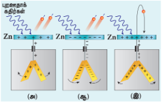
 

படம் 8.6 (அ) மின்னூட்டமற்ற துத்தநாகத் தட்டு
(ஆ) எதிர் மின்னூட்டம் பெற்ற துத்தநாகத் தட்டு
(இ) நேர் மின்னூட்டம் பெற்ற துத்தநாகத் தட்டு
ஆகியவை மீது புறஊதாக் கதிர்கள் படுதல்

மேலும் எதிர் மின்னூட்டம் பெற்ற துத்தநாகத் தட்டின் மீது புற ஊதாக் கதிர்களைப் படுமாறு செய்தால், மின் துகள்கள் வேகமாக கசிவதால் இலைகள் அருகில் வருகின்றன (படம் 8.6 (ஆ)). நேர் மின்னூட்டம் பெற்ற துத்தநாகத் தட்டின் புறஊதாக் கதிர்கள் படும்போது, அது மேலும் நேர்மின்னூட்டம் கொண்டதாக மாறுகிறது; அதனால் இலைகள் மேலும் திறந்து கொள்கின்றன (படம் 8.6 (இ)). மேற்கண்ட சோதனைகளிலிருந்து, புறஊதாக் கதிர்களின் செயல்பாட்டினால் துத்தநாகத் தட்டிலிருந்து எதிர் மின்னூட்டம் பெற்ற எலக்ட்ரான்கள் உமிழப்படுகின்றன என்று முடிவாகிறது.

#### லெனார்டு சோதனை

1902-ஆம் ஆண்டில், லெனார்டு என்பவர் எலக்ட்ரான் உமிழ்வு நிகழ்வினை விரிவாகச் சோதனை செய்தார். அவரது எளிய சோதனை அமைப்பு படம் 8.7 இல் காட்டப்பட்டுள்ளது. இந்த சோதனைக் கருவியில் A மற்றும் C என்ற இரு உலோகத் தட்டுகள் வெற்றிடமாக்கப்பட்ட குவார்ட்ஸ் குழாயினுள் வைக்கப்பட்டுள்ளன. கால்வனாமீட்டர் G மற்றும் மின்கலத் தொகுப்பு B ஆகியவை மின்சுற்றில் இணைக்கப்பட்டுள்ளன.

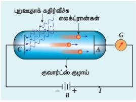
படம் 8.7 லெனார்டு சோதனை அமைப்பு
 

C எனும் எதிர்மின் தட்டின் மீது புறஊதாக் கதிர்கள் படும்போது மின்சுற்றில் மின்னோட்டம் பாய்வதை கால்வனாமீட்டரின் விலக்கம் மூலம் அறியலாம். ஆனால், புறஊதாக் கதிர்கள் நேர்மின் தட்டின் மீது படும் போது, சுற்றில் எவ்வித மின்னோட்டமும் ஏற்படுவதில்லை.

மேற்கண்ட சோதனைகளிலிருந்து, எதிர்மின் தட்டின் மீது புறஊதாக் கதிர்கள் விழும்போது எலக்ட்ரான்கள் உமிழப்படுகின்றன. அவை நேர்மின் தட்டு A வினால் கவரப்படுகின்றன என்று முடிவாகிறது. வெற்றிடக் குழாயின் வழியே எலக்ட்ரான்கள் நேர்மின் தட்டை அடைந்தவுடன் மின்சுற்று மூடப்பட்டு, மின்னோட்டம் பாய்கிறது. எனவே எதிர்மின் தட்டின் மீது படும் புறஊதாக் கதிர்கள், தட்டின் மேற்பரப்பில் இருந்து எலக்ட்ரான் உமிழ்வு நடைபெறுவதற்கு காரணமாக அமைகின்றன.

#### ஒளிமின் விளைவு வரையறை

உலோகத்தட்டு ஒன்றின் மீது ஒளி அல்லது தகுந்த அலைநீளம் (அல்லது அதிர்வெண்) கொண்ட மின்காந்த கதிர்வீச்சு படும்போது, அதிலிருந்து எலக்ட்ரான்கள் உமிழப்படுகின்றன. இதுவே ஒளிமின் விளைவு எனப்படும். உமிழப்படும் இந்த எலக்ட்ரான்களுக்குப் பிற எலக்ட்ரான்களுக்கும் வேறுபாடு இல்லை எனினும், இந்த எலக்ட்ரான்களைப் பொதுவாக ஒளிஎலக்ட்ரான்கள் எனவும், இதனால் உருவாகும் மின்னோட்டத்தை ஒளிமின்னோட்டம் எனவும் அழைக்கலாம்.

காட்மியம், துத்தநாகம், மெக்னீசியம் போன்ற உலோகங்கள் புறஊதாக் கதிர்களினால் ஒளிமின் உமிழ்வைத் தருகின்றன. ஆனால் கார உலோகங்களான லித்தியம், சோடியம், பொட்டாசியம், சீசியம் போன்றவை நீண்ட அலைநீளம் கொண்ட அலைகளான கண்ணுறு ஒளியினால் கூட ஒளிமின் உமிழ்வைத் தருகின்றன. தகுந்த அலைநீளம் கொண்ட மின்காந்த அலைகள் படுவதால் ஒளிஎலக்ட்ரான்களை உமிழும் பொருள்களை ஒளிஉணர் பொருள்கள் (photosensitive materials) எனலாம்.

### 8.2.2 ஒளிமின்னோட்டத்தின் மீதான படுகதிர் செறிவின் விளைவு

சோதனை அமைப்புஒளிமின் விளைவு நிகழ்வினை விரிவாக ஆராய்வதற்குப் பயன்படும் சோதனை கருவி அமைப்பு படம் 8.8 இல் காட்டப்பட்டுள்ளது. $S$ என்பது ஒளி மூலம் ஆகும். இதில் இருந்து $\nu$ என்கிற தெரிந்த மற்றும் மாற்றக்கூடிய அதிர்வெண்ணும், $I$ செறிவும் கொண்ட மின்காந்த அலைகள் வெளிவிடப்படுகின்றன.

ஒளிஉணர் பொருளினால் செய்யப்பட்ட கேத்தோடு $C$ (எதிர்மின் தகடு) எலக்ட்ரான்களை உமிழ்வதற்குப் பயன்படுகிறது. கேத்தோடில் இருந்து வெளிவரும் எலக்ட்ரானை ஆனோடு $A$ (நேர்மின் தகடு) ஏற்கிறது. புறஊதா மற்றும் கண்ணுறு ஒளிக்கதிர்களை அனுமதிக்கும் குவார்ட்ஸ் ஜன்னல் கொண்ட வெற்றிடக் கண்ணாடிக்குழாயில் இந்த மின்வாய்கள் பொருத்தப்பட்டுள்ளன.

மின்னழுத்தப் பகுப்பான் $PQ$ க்கு குறுக்கே சாவி $K$ வழியாக உயர் மின்னழுத்த மின்கலத் தொகுப்பு $B$ இணைக்கப்படுகிறது. இதன் மூலம் $C$ மற்றும் $A$ இடையே தேவையான மின்னழுத்த வேறுபாடு வழங்கப்படுகிறது. மின்னழுத்தப் பகுப்பானின் நடுமுனையைக் கொண்டும், நகரும் முனையைக் கொண்டும் $C$ ஐப் பொறுத்து, $A$ ஐத் தேவையான நேர் அல்லது எதிர் மின்னழுத்தத்தில் வைக்கமுடியும்.

இந்த நேர் அல்லது எதிர் மின்னழுத்தத்தை அளப்பதற்கு ஏதுவாக மையத்தில் சுழி அளவுள்ள வோல்ட்மீட்டரானது அவற்றின் குறுக்கே இணைக்கப்பட்டுள்ளது. தொடரிணைப்பில் இணைக்கப்பட்டுள்ள மைக்ரோ அம்மீட்டர் மூலம் சுற்றிலுள்ள மின்னோட்டத்தை அளவிடலாம்.

கேத்தோடு $C$ மீது எந்த ஒளியும் விழாதபோது, ஒளிஎலக்ட்ரான்கள் உமிழப்படுவதில்லை. மைக்ரோ அம்மீட்டர் சுழி அளவீட்டைக் காட்டும். புறஊதா அல்லது கண்ணுறு ஒளியானது $C$ மீது விழும்போது, ஒளிஎலக்ட்ரான்கள் உமிழப்பட்டு

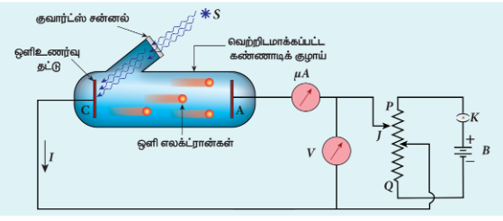

படம் 8.8 ஒளிமின் விளைவினை ஆராய்வதற்கான சோதனை அமைப்பு
 

ஆனோடால் ஏற்றுக்கொள்ளப்படுகின்றன. இதன் விளைவாக, மின்சுற்றில் ஏற்படும் ஒளிமின்னோட்டமானது மைக்ரோ அம்மீட்டரால் அளவிடப்படுகிறது.

i) படுகதிரின் செறிவு
ii) மின்வாய்களுக்கிடையே உள்ள மின்னழுத்த வேறுபாடு iii) உலோகத்தின் தன்மை
iv) படுகதிரின் அதிர்வெண் ஆகியவற்றைப்பொறுத்து ஒளிமின்னோட்டத்தில் ஏற்படும் மாறுபாட்டைக் கண்டறிய இந்த ஏற்பாடு பயன்படுகிறது.

#### ஒளிமின்னோட்டத்தின் மீதான படுகதிர் செறிவின் விளைவு

ஒளிமின்னோட்டத்தின் மீதான படுகதிர் ஒளிச்செறிவின் விளைவினை ஆராய்வதற்கு, படுகதிரின் அதிர்வெண் மற்றும் எலக்ட்ரானை ஏற்கும் ஆனோடின் முடுக்கு மின்னழுத்தம் ஆகியவை மாறிலியாக வைக்கப்படுகின்றன. $C$ ஐப் பொறுத்து $A$ ஆனது நேர் மின்னழுத்தத்தில் உள்ளதால், $C$ யிலிருந்து வெளிப்படும் எலக்ட்ரான்கள் $A$ ஐ அடைந்து, சுற்றில் மின்னோட்டம் பாய்கிறது. இப்போது படுகதிர் ஒளிச்செறிவினை மாற்றி அமைத்து, அதற்குரிய ஒளிமின்னோட்டம் அளவிடப்படுகிறது.

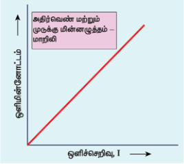
படம் 8.9 படுகதிர் செறிவைப் பொருத்து
ஒளிமின்னோட்டத்தின் மாறுபாடு
 

படுகதிர் ஒளிச்செறிவானது $x$-அச்சிலும், ஒளிமின்னோட்டமானது $y$-அச்சிலும் வைத்து வரைபடம் வரையப்படுகிறது. படம் 8.9 இல் காட்டப்பட்ட வரைபடத்திலிருந்து ஒளிமின்னோட்டமானது – அதாவது ஒரு வினாடியில் உமிழப்படும் எலக்ட்ரான்களின் எண்ணிக்கை – படுகதிரின் செறிவிற்கு நேர்த்தகவில் அமைவது புலனாகிறது.

>குறிப்பு: இங்கு, ஒளிச்செறிவு என்பது அதன் பொலிவுத்தன்மையைக் குறிக்கும். மங்கலான ஒளியை விட பொலிவான ஒளியானது அதிக செறிவினைக் கொண்டிருக்கும்.

### 8.2.3 ஒளிமின்னோட்டத்தின் மீதான மின்னழுத்த வேறுபாட்டின் விளைவு

ஒளிமின்னோட்டத்தின் மீது மின்வாய்களுக்கு இடைப்பட்ட மின்னழுத்த வேறுபாட்டின் விளைவினை அறிவதற்கு, படுகதிரின் அதிர்வெண் மற்றும் செறிவு ஆகியவை மாறிலிகளாக வைக்கப்படுகின்றன. $C$ யினைப் பொறுத்து $A$ வானது நேர் மின்னழுத்தத்தில் வைக்கப்பட்டு, கேத்தோடு மீது ஒளி விழுமாறு செய்யப்படுகிறது.

இப்போது $A$ யின் நேர் மின்னழுத்தத்தை அதிகரித்து, அதற்குரிய ஒளிமின்னோட்டம் குறிக்கப்படுகிறது. $A$ இன் நேர் மின்னழுத்தம் அதிகரிக்கும் போது, ஒளிமின்னோட்டமும் அதிகரிக்கிறது. இருப்பினும் ஒரு குறிப்பிட்ட நிலையில் ஒளிமின்னோட்டம் தெவிட்டிய மதிப்பை (தெவிட்டு மின்னோட்டம்) அடைகிறது. இந்நிலையில் $C$ யில் இருந்து வெளிவரும் அனைத்து ஒளிஎலக்ட்ரான்களும் $A$ வினால் சேகரிக்கப்படுகின்றன. இதனை, $A$ யின் நேர் மின்னழுத்தம் மற்றும் ஒளிமின்னோட்டம் இடையிலான வரைபடத்தின் தட்டைப்பகுதி குறிக்கிறது (படம் 8.10).

$C$ யினைப் பொறுத்து $A$ விற்கு எதிர் (எதிர் முடுக்கு) மின்னழுத்தம் அளிக்கும்போது, ஒளிமின்னோட்டம் உடனடியாக சுழி மதிப்பை அடைவதில்லை. ஏனெனில் உமிழப்படும் ஒளிஎலக்ட்ரான்கள் வெவ்வேறு அளவிலான இயக்க ஆற்றல்களைப் பெற்றுள்ளன. $A$ வினால் உருவாகும் எதிர் மின்புலத்தைக் கடப்பதற்கு தேவையான இயக்க ஆற்றலைப் பெற்றுள்ள ஒளிஎலக்ட்ரான்கள் $A$ வை வந்தடைகின்றன.

$A$ விற்கு அளிக்கப்படும் எதிர் (எதிர் முடுக்கு) மின்னழுத்தத்தைப் படிப்படியாக அதிகரிக்கும்போது, அதிக அளவில் ஒளிஎலக்ட்ரான்கள் விரட்டப்படுவதால், அவை $A$ ஐ அடைவதில்லை. எனவே ஒளிமின்னோட்டம் குறையத் தொடங்குகிறது. $V_0$ என்ற குறிப்பிட்ட எதிர் மின்னழுத்தத்தில் ஒளிமின்னோட்டம் சுழி மதிப்பை அடைகிறது. இம்மின்னழுத்தம் நிறுத்து அல்லது வெட்டு
மின்னழுத்தம் (stopping or cut-off potential) எனப்படும்.

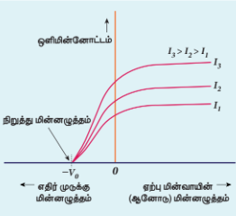
படம் 8.10 மின்னழுத்த வேறுபாட்டைப் பொருத்து
ஒளிமின்னோட்டத்தில் ஏற்படும் மாறுபாடு
 

நிறுத்து மின்னழுத்தம் என்பது பெரும இயக்க ஆற்றலைக் கொண்ட ஒளிஎலக்ட்ரான்களை நிறுத்தி, ஒளிமின்னோட்டத்தைச் சுழியாக்குவதற்கு ஆனோடுற்கு அளிக்கப்படும் எதிர் (எதிர் முடுக்கு) மின்னழுத்தத்தின் மதிப்பாகும்.

நிறுத்து மின்னழுத்தத்தில், பெரும இயக்க ஆற்றல் கொண்ட எலக்ட்ரான் கூட ஓய்விற்கு கொண்டு வரப்படுகின்றன. ஆகையால் பெரும வேகம் கொண்ட எலக்ட்ரானின் ஆரம்ப இயக்க ஆற்றலானது ($K_{\text{பெரும}}$), நிறுத்து மின்னழுத்தத்தினால் செய்யப்பட்ட வேலைக்குச் ($eV_0$) சமமாகும்.

$$\boxed{K_{\text{பெரும}} = \frac{1}{2}mv_{\text{பெரும}}^2 = eV_0 \qquad (8.1)}$$

இங்கு $v_{\text{பெரும}}$ என்பது உமிழப்படும் ஒளிஎலக்ட்ரானின் பெரும வேகம் ஆகும்.

$$\boxed{\begin{aligned}
v_{\text{பெரும}} &= \sqrt{\frac{2eV_0}{m}} \\
v_{\text{பெரும}} &= \sqrt{\frac{2 \times 1.602 \times 10^{-19}}{9.1 \times 10^{-31}} \times V_0} \\
&= 5.93 \times 10^5 \sqrt{V_0} \qquad (8.2)
\end{aligned}}$$

சமன்பாடு (8.1) லிருந்து,
$$\boxed{\begin{aligned}
K_{\text{பெரும}} &= eV_0 \text{ (ஜூல் அலகில்)} \qquad (8.3) \\
&\text{(அல்லது)} \\
K_{\text{பெரும}} &= V_0 \text{ (eV அலகில்)} \qquad (8.4)
\end{aligned}}$$

படம் 8.10லிருந்து, ஒளிச்செறிவை மட்டும் அதிகரித்தால், தெவிட்டிய மின்னோட்டம் அதிகரிக்கிறது; ஆனால் $V_0$ வின் மதிப்பு மாறிலியாக அமையும்.

எனவே கொடுக்கப்பட்ட அதிர்வெண்ணிற்கு, நிறுத்து மின்னழுத்தமானது படுகதிரின் ஒளிச்செறிவினை பொறுத்து அமையாது. மேலும் ஒளிஎலக்ட்ரான்களின் பெரும இயக்க ஆற்றலும் படுகதிர் ஒளிச்செறிவினைப் பொறுத்து அமையாது.

### 8.2.4 நிறுத்து மின்னழுத்தத்தின் மீதான படுகதிர் அதிர்வெண்ணின் விளைவு

நிறுத்து மின்னழுத்தத்தின் மீதான படுகதிரின் அதிர்வெண்ணின் விளைவினை அறிய படுகதிரின் செறிவு மாறிலியாக வைக்கப்படுகிறது. ஏற்பு மின்வாயான ஆனோடு மின்னழுத்தத்தைப் பொறுத்து ஒளிமின்னோட்டத்தில் ஏற்படும் மாறுபாடானது படுகதிரின் வெவ்வேறு அதிர்வெண்களுக்கு ஆராயப்படுகிறது. இந்த மாறுபாட்டிற்கான வரைபடம் படம் 8.11 இல் காட்டப்பட்டுள்ளது. வரைபடத்திலிருந்து நிறுத்து மின்னழுத்தமானது படுகதிரின் வெவ்வேறு அதிர்வெண்களுக்கு ஏற்ப மாறுவது தெளிவாகத் தெரிகிறது.

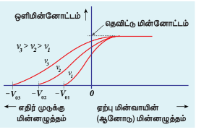
படம் 8.11 படுகதிர்வீச்சின் பல்வேறு அதிர்வெண்களுக்கு, ஆனோடு மின்னழுத்தத்தைப் பொருத்து ஒளிமின்னோட்டத்தின் மாறுபாடு
 

படுகதிரின் அதிர்வெண் அதிகரிக்கும்போது, நிறுத்துமின்னழுத்தமும் அதிகரிக்கிறது. இதிலிருந்து நாம் அறிவது: அதிர்வெண் அதிகரிக்கும்போது ஒளிஎலக்ட்ரான்களின் இயக்க ஆற்றலும் அதிகரிக்கிறது. எனவே அவற்றை நிறுத்துவதற்கு தேவைப்படும் எதிர் முடுக்கு மின்னழுத்தமும் அதிகமாகிறது.

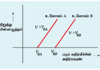
படம் 8.12 இரு உலோகங்களில் படுகதிரின் அதிர்வெண்ணைப் பொருத்து நிறுத்து மின்னழுத்தத்தின் மாறுபாடு
 

படுகதிரின் அதிர்வெண் மற்றும் நிறுத்து மின்னழுத்தம் ஆகியவை இடையிலான வரைபடம் இரு உலோகங்களுக்கு வரையப்பட்டுள்ளது (படம் 8.12). வரைபடத்திலிருந்து, நிறுத்து மின்னழுத்தமானது அதிர்வெண்ணைப் பொறுத்து நேர்விகிதத்தில் அதிகரிப்பதைக் காணலாம். ஒரு குறிப்பிட்ட அதிர்வெண்ணிற்கு கீழே எலக்ட்ரான்கள் உமிழப்படுவதில்லை. இந்த அதிர்வெண் பயன்தொடக்க அதிர்வெண் (threshold frequency) எனப்படும். இதனால் இவ்வதிர்வெண்ணில் நிறுத்து மின்னழுத்தம் சுழியாகும். ஆனால் பயன்தொடக்க மதிப்பிற்கு மேலே, நிறுத்து மின்னழுத்தம் படுகதிர் அதிர்வெண்ணைப் பொறுத்து நேர்விகிதத்தில் அதிகரிக்கும்.

### 8.2.5 ஒளிமின் விளைவு விதிகள்
மேற்கண்ட விரிவான சோதனைகளின் மூலம் ஒளிமின் விளைவு தொடர்பான பின்வரும் முடிவுகள் பெறப்பட்டுள்ளன.

i) கொடுக்கப்படும் உலோகப்பரப்பிற்கு, படுகதிரின் அதிர்வெண் ஒரு குறிப்பிட்ட சிறும அதிர்வெண்ணை விட அதிகமாக இருந்தால் மட்டுமே ஒளிஎலக்ட்ரான் உமிழ்வு ஏற்படும். இந்தச் சிறும அதிர்வெண் பயன்தொடக்க அதிர்வெண் எனப்படும்.

ii) கொடுக்கப்படும் படுகதிர் அதிர்வெண்ணுக்கு (பயன்தொடக்க மதிப்பை விட அதிகமாக உள்ளபோது), உமிழப்படும் ஒளிஎலக்ட்ரான்களின் எண்ணிக்கையானது படுகதிரின் செறிவிற்கு நேர்த்தகவில் அமையும். மேலும் தெவிட்டு மின்னோட்டமும் ஒளிச்செறிவிற்கு நேர்த்தகவில் அமையும்.

iii) ஒளிஎலக்ட்ரான்களின் பெரும இயக்க ஆற்றலானது படுகதிரின் ஒளிச்செறிவைப் பொறுத்து அமையாது.

iv) கொடுக்கப்படும் உலோகத்திற்கு ஒளிஎலக்ட்ரான்களின் பெரும இயக்க ஆற்றலானது படுகதிரின் அதிர்வெண்ணிற்கு நேர்த்தகவில் அமையும்.

v) உலோகத்தின் மீது ஒளி படுவதற்கும் ஒளிஎலக்ட்ரான்கள் உமிழப்படுவதற்கும் இடையே காலதாமதம் இருக்காது.

பல சோதனைகளின் மூலம் ஒளிமின் விளைவு ஆராயப்பட்ட பின்பு அதை ஒளியின் அலைக்கொள்கை மூலம் விளக்குவதற்கு முயற்சிகள் மேற்கொள்ளப்பட்டன.

### 8.2.6 ஆற்றல் குவாண்டமாக்கல் பற்றிய கருத்து\அலைக்கொள்கையின் தோல்வி

மாக்ஸ்வெல்லின் கொள்கையிலிருந்து, ஒளி என்பது $3 \times 10^8\text{ ms}^{-1}$ திசைவேகத்தில் செல்லக்கூடிய பிணைக்கப்பட்ட மின் மற்றும் காந்த அலைவுகளைக் கொண்டுள்ள மின்காந்த அலைகளால் ஆனது என்பதையும், இவை அலைப்பண்பைக் கொண்டிருக்கும் என்பதையும் கற்றோம் (பார்க்க: தொகுதி 1 அலகு 5). ஒளியின் அலைப்பண்பினைப் பயன்படுத்தி ஒளிமின் விளைவு சோதனை முடிவுகளை விவரிக்க நாம் முயல்வோம்.

i) உலோகப் பரப்பின் மீது ஒளி படும்போது, உலோகத்தில் உள்ள எலக்ட்ரான்களுக்கு ஆற்றல் தொடர்ச்சியாக அளிக்கப்படுகிறது. அலைக்கொள்கையின்படி, அதிக செறிவுள்ள ஒளியானது உமிழப்படும் எலக்ட்ரான்களுக்கு அதிக இயக்க ஆற்றலைத் தரவேண்டும் (இங்கு ஒளிச்செறிவு என்பது ஓரலகு நேரத்தில் ஓரலகு பரப்பில் தரப்படும் ஆற்றலாகும்).

ஆனால் இவ்விதம் நடைபெறவில்லை. உமிழப்படும் ஒளிஎலக்ட்ரான்களின் பெரும இயக்க ஆற்றலானது ஒளியின் செறிவினைப் பொறுத்தது அல்ல என சோதனையின் முடிவுகள் காட்டுகின்றன.

ii) அலைக்கொள்கையின்படி, உலோகப் பரப்பின் மீது போதுமான செறிவுள்ள ஒளிக்கற்றை படும் போது, ஒளிக்கற்றையின் அதிர்வெண் எவ்வளவு குறைவாக இருந்தாலும், உலோகப் பரப்பிலிருந்து எலக்ட்ரான்கள் உமிழப்படவேண்டும்.

ஆனால் சோதனைகளின்படி, படுகதிரின் குறிப்பிட்ட அதிர்வெண்ணிற்கு கீழே ஒளிமின் உமிழ்வு ஏற்படுவதில்லை என அறியப்பட்டுள்ளது. எனவே அலைக் கொள்கையினால் பயன்தொடக்க அதிர்வெண்ணின் இருப்பை விவரிக்க இயலவில்லை.

iii) ஒளியின் ஆற்றலானது அலைமுகப்பு முழுவதும் பரவி இருக்கும் என்பதால், இந்த ஆற்றலை மிக அதிக எண்ணிக்கையிலான எலக்ட்ரான்கள் பெறுகின்றன. ஒவ்வொரு எலக்ட்ரானும் வெளியேற்று ஆற்றலை விட அதிகமான அளவு ஆற்றலைப் பெறுவதற்கு கணிசமான (சில மணி நேரம்) அளவு நேரத்தை எடுத்துக்கொள்ளும்.

ஆனால் ஒளிமின் விளைவு என்பது உடனடி நிகழ்வு என்பதை சோதனைகள் காட்டியுள்ளன. (பரப்பு ஒளியூட்டப்படுவதற்கும் எலக்ட்ரான் வெளியேறுவதற்கும் இடையே உள்ள கால இடைவெளி $10^{-9}$ வினாடிக்கும் குறைவாக இருக்கும்). இதனை அலைக்கொள்கையால் விவரிக்க இயலவில்லை.
எனவே அலைக்கொள்கையின் அடிப்படையில் ஒளிமின் விளைவுக்கான சோதனை முடிவுகளை விவரிக்க முடியவில்லை.

#### எடுத்துக்காட்டு 8.1

சீசியத்தில் ஏற்படும் ஒளிமின் உமிழ்வில், அலைக் கொள்கையானது பின்வரும் முடிவுகளை கணிக்கிறது என்பதைக் காண்பிக்கவும்.

i) ஒளிஎலக்ட்ரான்களின் பெரும இயக்க ஆற்றலானது ($K_{\text{பெரும}}$) படுஒளியின் செறிவைச் ($I$) சார்ந்துள்ளது.

ii) பெரும இயக்க ஆற்றல் ($K_{\text{பெரும}}$) ஆனது படுஒளியின் அதிர்வெண்ணைச் சார்ந்து அமையாது மற்றும்

iii) ஒளி படுவதற்கும் ஒளிஎலக்ட்ரான்கள் உமிழப்படுவதற்கும் இடைப்பட்ட கால இடைவெளி மிக அதிகமாக அமையும்.

கொடுக்கப்பட்ட உலோகத்தின் மீது ஒளி படும்போது, எளிமைக்காக பின்வரும் யூகங்கள் மேற்கொள்ளப்படுகின்றன.

அ) ஒளியானது உலோகத்தின் மேல் அடுக்கில் உள்ள அணுக்களால் உட்கவரப்படுகிறது.

ஆ) கொடுக்கப்படும் தனிமத்தில், ஒவ்வொரு அணுவும் சம அளவு ஆற்றலை உட்கவர்கின்றன. இந்த ஆற்றலானது அவற்றின் குறுக்கு வெட்டுப்பரப்பு $A$ விற்கு நேர்த்தகவில் அமையும்.

இ) ஒவ்வொரு அணுவும் இந்த ஆற்றலை தங்கள் எலக்ட்ரான்களில் ஒரு எலக்ட்ரானுக்கு அளிக்கிறது.

(தரவுகள்: சீசியத்தின் ஒளிமின் வெளியேற்று ஆற்றல் $2.14\text{ eV}$ மற்றும் அதில் அளவிடக்கூடிய ஒளிமின்னோட்டத்தை உருவாக்குவதற்கு ஓரலகு பரப்பில் உட்கவரப்படும் திறன் மதிப்பு $1.60 \times 10^{-6}\text{ Wm}^{-2}$ ஆகும்)

##### தீர்வு
i) அலைக்கொள்கையின்படி, ஒளி ஆற்றலானது அலைமுகப்பு முழுவதிலும் சீராகவும், தொடர்ச்சியாகவும் பரவியிருக்கும்.$t$ கால அளவில் ஒவ்வொரு எலக்ட்ரானும் உட்கவரும் ஆற்றல் $E$ ஆனது

$$E = IAt$$

இந்த ஆற்றலை உட்கவர்ந்து, எலக்ட்ரான்கள் பரப்பு அரண் அல்லது வெளியேற்று ஆற்றலைக் ($\phi_0$) கடந்து வெளியேறுகின்றன. வெளிவரும் எலக்ட்ரானின் பெரும ஆற்றல் $K_{\text{பெரும}}$ பின்வரும் சமன்பாட்டால் குறிக்கப்படுகிறது.

$$K_{\text{பெரும}} = IAt - \phi_0 \qquad (1)$$

எனவே அலைக்கொள்கையின்படி ஓரலகு காலத்தில், குறைந்த ஒளிச்செறிவில் $IAt < \phi_0$ எனும்போது, எலக்ட்ரான்கள் உமிழப்படுவதில்லை. அதிக ஒளிச்செறிவில் $IAt \ge \phi_0$ எனும்போது, எலக்ட்ரான்கள் உமிழப்படுகின்றன. இதிலிருந்து ஒளிச்செறிவு அதிகரிக்கும் போது $K_{\text{பெரும}}$ அதிகரிக்கும் எனத் தெரிகிறது.

கொடுக்கப்பட்ட சூழ்நிலைகளில், $K_{\text{பெரும}}$ மதிப்பானது செறிவினை மட்டும் சார்ந்துள்ளது; ஒளிச்செறிவினை உரிய முறையில் அதிகரிக்கும் போது, ஒளியின் அதிர்வெண் பயன்தொடக்க அதிர்வெண்ணை விட குறைவாக இருக்கும் நிலைகளில்கூட ஒளிமின் விளைவை ஏற்படுத்தமுடியும். எனவே அலைக்கொள்கையில்,
பயன்தொடக்க அதிர்வெண் எனும் கருத்து இடம் பெறவில்லை.

ii) அலைக்கொள்கையின்படி, ஒளி அலையின் செறிவானது மின்புல வீச்சின் இருமடிக்கு ($E_0^2$) நேர்த்தகவில் அமையும். ஒளிச்செறிவு அதிகரிக்கும் போது மின்புலத்தின் வீச்சு அதிகரித்து, எலக்ட்ரானின் முடுக்கத்தையும் இயக்க ஆற்றலையும் அதிகரிக்கிறது.

இப்போது சமன்பாடு (1) இல் $I$ என்பதற்கு பதிலாக, ($E_0^2$) க்கு நேர்த்தகவில் உள்ள ஒரு அளவினைக் கொண்டு மாற்றுவோம். அதாவது $K_{\text{பெரும}}$ ஆனது அதிர்வெண்ணைச் சார்ந்து அமைவதில்லை என்பது அலைக்கொள்கையின் முடிவு ஆகும். இது மீண்டும் பரிசோதனை முடிவுகளுக்கு முரண்படுகிறது.

iii) ஒளிமின் வெளியேற்று ஆற்றலைக் கடப்பதற்கு தேவையான ஆற்றலை மட்டும் ஒளியிலிருந்து எலக்ட்ரான் பெறுவதாகக் கொள்வோம் எனில், அணுவிலிருந்து இந்த எலக்ட்ரான் சுழி இயக்க ஆற்றலுடன் வெளியேறுகிறது. எனவே (1) எனும் சமன்பாட்டிலிருந்து

$$\begin{aligned}
0 &= IAt - \phi_0 \\
t &= \frac{\phi_0}{IA} = \frac{\phi_0}{I(\pi r^2)}
\end{aligned}$$

அணுவின் ஆரம் $r = 1.0 \times 10^{-10}\text{ m}$, $I$ மற்றும் $\phi_0$ மதிப்புகளைப் பிரதியிட்டு, கால இடைவெளி $t$ இன் மதிப்பைக் கணக்கிடலாம்.

$$\begin{aligned}
t &= \frac{2.14 \times 1.6 \times 10^{-19}}{1.60 \times 10^{-6} \times 3.14 \times (1 \times 10^{-10})^2} \\
&= 0.68 \times 10^7\text{ s} \approx 79 \text{ நாட்கள்}
\end{aligned}$$

எனவே அலைக் கொள்கையானது ஒளி அலைகள் படுவதற்கும் ஒளி எலக்ட்ரான்கள் உமிழப்படுவதற்கும் இடையே அதிக கால இடைவெளி உள்ளது எனக் கணிக்கிறது. ஆனால் பரிசோதனை முடிவுகள் ஒளிமின் உமிழ்வு ஒரு உடனடி நிகழ்வு எனக் காட்டியுள்ளன.

#### ஆற்றல் குவாண்டமாக்கல் பற்றிய கருத்து

1900-இல் மேக்ஸ் பிளாங்க் என்பவர் கரும்பொருளிலிருந்து உமிழப்படும் வெப்பக் கதிர்வீச்சு மற்றும் அதன் கதிர்வீச்சு வரைபடங்களின் வடிவங்களை விவரிக்க குவாண்டம் கொள்கையை எடுத்துரைத்தார்.

பிளாங்க் கொள்கைப்படி, ஒரு பொருளானது அதிக எண்ணிக்கையிலான வெவ்வேறு அதிர்வெண்ணில் அதிர்வடையும் துகள்களைக் (அணுக்களைக்) கொண்டிருக்கும். தமது சிறப்பியல்பு அதிர்வெண்ணில் அதிர்வுறும் ஒவ்வொரு அணு அலையியற்றியும், அதே அதிர்வெண் கொண்ட மின்காந்தக் கதிர்வீச்சை உமிழும் அல்லது உட்கவரும். மேலும்,

i) $\nu$ எனும் அதிர்வெண்ணில் அலையியற்றி ஒன்று அதிர்வுறுகிறது எனில், அதன் ஆற்றலானது குறிப்பிட்ட தொடர்ச்சியற்ற (தனித்தனியான) மதிப்புகளை மட்டுமே பெற்றிருக்கும். அவை பின்வரும் சமன்பாட்டினால் தரப்படுகின்றன

$$\boxed{E_n = nh\nu \qquad n = 1, 2, 3, \dots \qquad (8.5)}$$
இங்கு $h$ என்பது ஒரு மாறிலி ஆகும். இது பிளாங்க் மாறிலி ஆகும்.

ii) அலையியற்றிகள் ஆற்றலை குவாண்டா எனும் ஆற்றல் சிப்பங்களாக உமிழும் அல்லது உட்கவரும். ஒவ்வொரு சிப்பத்தின் ஆற்றல் $h\nu$ ஆகும்.

இதன் மூலம் நாம் அறிவது, அலைக் கொள்கையில் விவரிக்கப்பட்டதைப் போல அலையியற்றியின் ஆற்றலானது தொடர்ச்சியாக இல்லாமல், குவாண்டமாக உள்ளது – அதாவது, தொடர்ச்சியற்ற (தனித்தனியான) சிறு சிறு சிப்பங்களாக உள்ளது. இதுவே ஆற்றல் குவாண்டமாக்கல் எனப்படும்.

### 8.2.7 ஒளியின் துகள் இயல்பு பற்றிய ஐன்ஸ்டீனின் விளக்கம்

ஒளிமின் விளைவை விளக்குவதற்கு பிளாங்க் குவாண்டம் கொள்கையை ஐன்ஸ்டீன் 1905 – இல் விரிவாக்கினார். ஐன்ஸ்டீனின் கொள்கைப்படி, ஒளி ஆற்றலானது அலைமுகப்புகளில் பரவியல்லாமல், சிறு சிப்பங்கள் அல்லது குவாண்டாக்களில் குவிக்கப்பட்டிருக்கும். எனவே ஒளி மூலத்திலிருந்து குறிப்பிட்ட அதிர்வெண்ணில் வெளிவரும் ஒளியானது (அல்லது பிற மின்காந்த அலைகள்) ஆற்றல் சிப்பங்கள் அல்லது குவாண்டா கற்றைகளாகக் கருதப்படுகிறது. ஒவ்வொரு ஒளி குவாண்டத்தின் ஆற்றல் $E = h\nu$ ஆகும்.

மேலும் அவரது கருத்துப்படி, ஒளி குவாண்டத்திற்கு நேர்கோட்டு உந்தமும் உண்டு மற்றும் அதன் எண்மதிப்பு $P = \frac{h\nu}{c}$ ஆகும். வரையறுக்கப்பட்ட ஆற்றல் மற்றும் உந்தத்தை

பெற்ற ஒவ்வொரு ஒளி குவாண்டமும் துகள் பண்பைக் கொண்டிருக்கும். துகளாகச் செயல்படும் இந்த ஒளி குவாண்டம் ஃபோட்டான் எனப்படும். ஆகவே, ஃபோட்டான் என்பது ஒளியின் துகள் வெளிப்பாடே தவிர வேறில்லை.

#### ஃபோட்டானின் சிறப்பியல்புகள்

ஒளியின் துகள் இயல்பு அடிப்படையில், ஃபோட்டான்கள் என்பது எந்தவொரு கதிர்வீச்சின் அடிப்படைக்கூறு ஆகும். ஃபோட்டான்கள் பின்வரும் பண்புகளைக் கொண்டுள்ளன.

i) $\lambda$ அலைநீளமும் $\nu$ அதிர்வெண்ணும் கொண்ட ஒளியின் ஃபோட்டான் ஆற்றல் பின்வருமாறு அமையும்

$$E = h\nu = \frac{hc}{\lambda}$$

ii) ஃபோட்டானின் ஆற்றல் கதிர்வீச்சின் அதிர்வெண்ணால் தீர்மானிக்கப்படுகிறது; அதன் செறிவினைப் பொறுத்து அமைவதில்லை. ஒளிச்செறிவிற்கும், ஒளிக்கற்றையில் உள்ள ஃபோட்டானின் ஆற்றலுக்கும் எவ்வித தொடர்பும் இல்லை.

iii) ஃபோட்டான்கள் ஒளியின் வேகத்தில் பயணம் செய்யும். மேலும் அதன் நேர்க்கோட்டு உந்தமானது

$$p = \frac{h}{\lambda} = \frac{h\nu}{c}$$

எனும் சமன்பாட்டிலிருந்து பெறப்படும்.

iv) ஃபோட்டான்கள் மின் நடுநிலைத் தன்மையுடன் இருப்பதால், மின் மற்றும் காந்த புலங்களினால் விலகலடையாது.

v) ஃபோட்டான் பருப்பொருளுடன் வினைபுரியும் போது (ஃபோட்டான் – எலக்ட்ரான் மோதலின் போது), மொத்த ஆற்றல், மொத்த நேர்க்கோட்டு உந்தம் மற்றும் கோண உந்தம் ஆகியவற்றின் மதிப்புகள் மாறுவதில்லை. இந்த வினையின் போது ஃபோட்டான் உட்கவர்தலோ அல்லது புதிய ஃபோட்டான் உருவாக்கமோ இருப்பதால், ஃபோட்டான்களின் எண்ணிக்கையில் மாற்றம் இருக்கலாம்.

>குறிப்பு: குவாண்டம் கருத்துப்படி, கொடுக்கப்பட்ட அலைநீளத்தில் ஒளிச்செறிவு என்பது ஓரலகு காலத்தில் ஓரலகு பரப்பின் மீது படும், சமமான ஆற்றலைப் கொண்டுள்ள, ஆற்றல் குவாண்டா அல்லது ஃபோட்டான்களின் எண்ணிக்கை ஆகும். இதன் அலகு $\text{Wm}^{-2}$.

#### ஒளிமின் சமன்பாட்டைப் பற்றிய ஐன்ஸ்டீனின் விளக்கம்

ஒரு உலோகப்பரப்பின் மீது $h\nu$ ஆற்றல் கொண்ட ஃபோட்டான் ஒன்று படும்போது, இந்த ஆற்றல் முழுவதுமாக எலக்ட்ரான் ஒன்றினால் உட்கவரப்பட்டு அந்த எலக்ட்ரான் உமிழப்படுகிறது. இந்த நிகழ்வில், ஃபோட்டானின் ஒரு பகுதி ஆற்றல் உலோகப்பரப்பின் மின்னழுத்த அரணைக் கடப்பதற்குப் பயன்படுகிறது (ஒளிமின் வெளியேற்று ஆற்றல் $\phi_0$). மீதமுள்ள ஆற்றல் உமிழப்பட்ட எலக்ட்ரானின் இயக்க ஆற்றலாக மாறுகிறது. எனவே ஆற்றல் அழிவின்மை விதிப்படி,

$$\boxed{h\nu = \phi_0 + \frac{1}{2}mv^2 \qquad (8.6)}$$

இங்கு $m$ என்பது எலக்ட்ரானின் நிறை மற்றும் $v$ அதன் திசைவேகம் ஆகும். இது படம் 8.13(அ)-வில் காட்டப்பட்டுள்ளது.

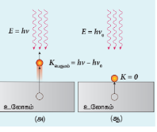
படம் 8.13 ஒளிஎலக்ட்ரான்களின் உமிழ்வு
 
படுஒளியின் அதிர்வெண்ணைக் குறைத்தால், ஒளிஎலக்ட்ரான்களின் வேகம் அல்லது இயக்க ஆற்றலும் குறைகிறது. ஒளியின் குறிப்பிட்ட அதிர்வெண்ணில் ($\nu_0$), எலக்ட்ரான்கள் இயக்க ஆற்றல் ஏதுமின்றி உமிழப்படுகின்றன (படம் 8.13 (ஆ)). எனவே சமன்பாடு (8.6) ஆனது பின்வருமாறு அமையும்.

$$h\nu_0 = \phi_0$$

இங்கு $\nu_0$ என்பது பயன்தொடக்க அதிர்வெண் ஆகும். சமன்பாடு (8.6)ஐ மாற்றி எழுதினால்,

சமன்பாடு (8.6) ஐ மாற்றி எழுதினால்,

$$\boxed{h\nu = h\nu_0 + \frac{1}{2}mv_{\text{பெரும}}^2 \qquad (8.7)}$$

சமன்பாடு (8.7) ஆனது ஐன்ஸ்டீனின் ஒளிமின் சமன்பாடு எனப்படும்.

அக மோதல்களினால் எலக்ட்ரான்களுக்கு ஆற்றல் இழப்பு ஏற்படவில்லை எனில், அவை $K_{\text{பெரும}}$ எனும் பெரும இயக்க ஆற்றலுடன் உமிழப்படுகின்றன. எனவே

$$\boxed{K_{\text{பெரும}} = \frac{1}{2}mv_{\text{பெரும}}^2}$$

இங்கு $v_{\text{பெரும}}$ என்பது உமிழப்படும் எலக்ட்ரானின் பெரும வேகமாகும். சமன்பாடு (8.6)ஐ பின்வருமாறு மாற்றியமைக்கலாம்.

$$\boxed{K_{\text{பெரும}} = h\nu - \phi_0 \qquad (8.8)}$$

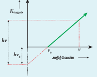
படம் 8.14 $K_{\text{பெரும}}$ மற்றும் $\nu$ இடையே உள்ள வரைபடம்
 

ஒளிஎலக்ட்ரான்களின் பெரும இயக்க ஆற்றல் $K_{\text{பெரும}}$ மற்றும் படுஒளியின் அதிர்வெண் $\nu$ இடையே உள்ள வரைபடம், ஒரு நேர்கோடு ஆகும் (படம் 8.14). இந்த நேர்க்கோட்டின் சாய்வு $h$ மற்றும் $y$-அச்சு வெட்டுப்பகுதி $-\phi_0$ ஆகும்.

ஐன்ஸ்டீனின் சமன்பாட்டினை சோதனை அடிப்படையில் R.A மில்லிகன் என்பவர் சரிபார்த்தார். அவர் பல்வேறு உலோகங்களுக்கு (சீசியம், பொட்டாசியம், சோடியம் மற்றும் கால்சியம்), $K_{\text{பெரும}}$ மற்றும் $\nu$ இடையே உள்ள வரைபடத்தை வரைந்தார் (படம் 8.15). அந்த வரைபடங்களில் இருந்து வரைகோட்டின் சாய்வானது உலோகங்களை பொறுத்தது அல்ல எனக் கண்டறிந்தார்.

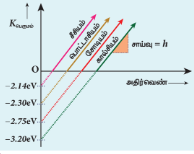
படம் 8.15 வெவ்வேறு உலோகங்களின் Kபெருமம்
மற்றும் ν க்கான வரைபடம்
 

மேலும் பிளாங்க் மாறிலி ($h = 6.626 \times 10^{-34}\text{ Js}$) மற்றும் பல்வேறு உலோகங்களின் ($\text{Cs, K, Na, Ca}$) வெளியேற்று ஆற்றலையும் மில்லிகன் கணக்கிட்டார். இந்த மதிப்புகள் அனைத்தும் கொள்கை அடிப்படையில் கணக்கிடப்பட்ட மதிப்புகளுடன் உடன்பட்டன.

#### ஒளிமின் விளைவிற்கான விளக்கம்:

ஐன்ஸ்டீனின் ஒளிமின் சமன்பாட்டின் உதவியுடன் ஒளிமின் விளைவு பற்றிய சோதனை முடிவுகளுக்கு பின்வரும் விளக்கத்தைப் பெறலாம்.

i) ஒவ்வொரு ஃபோட்டானும் ஒரு எலக்ட்ரானை உலோகப்பரப்பிலிருந்து வெளியேற்றுவதால், ஒளிச்செறிவு அதிகரிக்கும் போது (ஓரலகு காலத்தில் ஓரலகு பரப்பில் விழும் ஃபோட்டான்களின் எண்ணிக்கை) உமிழப்படும் எலக்ட்ரான்களின் எண்ணிக்கை அதிகரிக்கிறது; ஒளிமின்னோட்டமும் அதிகரிக்கிறது. இது சோதனை அடிப்படையிலும் கண்டறியப்பட்டுள்ளது. 

ii) $K_{\text{பெரும}} = h\nu - \phi_0$ என்ற சமன்பாட்டில் இருந்து, $K_{\text{பெரும}}$ ஆனது படுகதிரின் அதிர்வெண் $\nu$-விற்கு நேர்த்தகவில் அமையும். ஆனால் ஒளிச்செறிவினைப் பொறுத்து அமையாது.  

iii) சமன்பாடு (8.7) லிருந்து, உலோகப் பரப்பிலிருந்து எலக்ட்ரானை வெளியேற்றுவதற்கு ஃபோட்டானுக்கு குறிப்பிட்ட சிறும ஆற்றல் (உலோகத்தின் வெளியேற்று ஆற்றலுக்குச் சமம்) தேவைப்படுகிறது. இந்த ஆற்றலைவிட குறைந்த ஆற்றல் மதிப்புகளில் ஒளிமின் உமிழ்வு இருக்காது. அதற்கேற்ப, பயன்தொடக்க அதிர்வெண் எனப்படும் சிறும அதிர்வெண்ணிற்கு கீழே உள்ள அதிர்வெண்களில், ஒளிமின் உமிழ்வு இருக்காது.

iv) குவாண்டம் கொள்கையின்படி, $\therefore$ போட்டானில் இருந்து எலக்ட்ரானுக்கு ஆற்றல் மாற்றப்படுவது ஒரு உடனடி நிகழ்வாகும். எனவே $\therefore$ போட்டான் படுவதற்கும் எலக்ட்ரான் உமிழ்வதற்கும் இடையே காலதாமதம் இருக்காது.

இவ்வாறு குவாண்டம் கொள்கையின்படி ஒளிமின் விளைவு விளக்கப்படுகிறது.

##### ஒளியின் இயல்பு: அலை - துகள் இருமைப்பண்பு

ஒளியின் அலை இயல்பு மூலம் குறுக்கீட்டு விளைவு, விளிம்பு விளைவு மற்றும் தள விளைவு ஆகிய நிகழ்வுகளைப் பற்றிய விளக்கத்தைப் பயின்றோம். மேலும் கரும்பொருள் கதிர்வீச்சு, ஒளிமின் விளைவு ஆகிய நிகழ்வுகளை ஒளியின் துகள் இயல்பு மூலம் விளக்கினோம். எனவே, இரு கொள்கைகளுக்கும் போதுமான பரிசோதனைச் சான்றுகள் உள்ளன.

பழங்காலங்களில், புதிய சோதனை முடிவுகளுக்கு பொருந்தாத கொள்கைகள் மாற்றி அமைக்கப்பட்டன அல்லது நிராகரிக்கப்பட்டன. இங்கு 'ஒளியின் இயல்பு என்ன?' எனும் கேள்விக்கு விடையளிப்பதற்கு இரு கொள்கைகள் தேவைப்படுகின்றன.

இவற்றில் இருந்து ஒளியானது துகள் மற்றும் அலை எனும் இருமைப்பண்பைப் பெற்றுள்ளது என முடிவு செய்யப்பட்டது சில சூழ்நிலைகளில் ஒளியானது அலையாகவும் மற்றும் வேறு சில சூழ்நிலைகளில் துகளாகவும் செயல்படுகிறது.

இதனை வேறு விதமாக கூறினால், ஒளி பரவும் போது அலையாகவும், பொருள்களுடன் இடைவினை புரியும் போது துகளாகவும் செயல்படுகிறது. அனைத்து இயற்பியல் நிகழ்வுகளையும் விவரிக்க இரு கொள்கைகளும் அவசியமாகும். எனவே அலை இயல்பும் குவாண்டம் (துகள்) இயல்பும் ஒன்றையொன்று பூர்த்தி செய்யும் தன்மை கொண்டுள்ளன.

>உங்களுக்குத் தெரியுமா?ஒளியானது எவ்வாறு அலை மற்றும் துகள் கற்றையாக இருக்கும் என்பதைப் புரிந்து கொள்ள படிப்பவர் சிரமப்படலாம். ஆனால் ஆல்பர்ட் ஐன்ஸ்டீன் போன்ற மிகப்பெரிய அறிவியல் விஞ்ஞானிகளுக்கு கூட இந்த சிக்கல் இருந்தது என்பதை நினைவில் கொள்ள வேண்டும்.
ஆல்பர்ட் ஐன்ஸ்டீன் 1954இல் தம்முடைய நண்பர் மைக்கேல் பெஸ்ஸோ என்பவருக்கு எழுதிய கடிதத்தில் இது தொடர்பான மனப்போராட்டத்தை விவரித்துள்ளார்.
"கடந்த ஐம்பது ஆண்டுகளாக ஆழ்ந்த சிந்தனைகளின் அடிப்படையில், 'ஒளி குவாண்டா என்றால் என்ன?' எனும் கேள்விக்கான விடையை என்னால் நெருங்க இயலவில்லை! தற்காலத்தில், ஒவ்வொருவரும் அந்தக் கேள்விக்கான விடை தெரியும் என நினைப்பர். ஆனால் அவர் தம்மையே ஏமாற்றிக்கொள்கிறார்."

### 8.2.8 ஒளி மின்கலங்களும் அதன் பயன்பாடுகளும் ஒளி மின்கலம்

ஒளி மின்கலம் என்பது ஒளி ஆற்றலை மின் ஆற்றலாக மாற்றும் சாதனம் ஆகும். இது ஒளிமின் விளைவு எனும் தத்துவத்தின் படி செயல்படுகிறது. ஒளியானது ஒளிஉணர் பொருள்களின் மீது படும்போது, பொருளின் மின் பண்புகளில் மாற்றம் ஏற்படுகிறது அதன் அடிப்படையில் ஒளி மின்கலங்களை மூன்று வகையாகப் பிரிக்கலாம். அவையாவன:

i) ஒளி உமிழ்வு மின்கலம்: ஒளி அல்லது பிற கதிர்வீச்சுகள் உலோகக் கேத்தோடின் மீது படுவதால், எலக்ட்ரான் உமிழ்வு ஏற்படுகிறது இதன் அடிப்படையில் ஒளி உமிழ்வு மின்கலம் செயல்படுகிறது

ii) ஒளி வோல்டா மின்கலம்: குறைகடத்தியினால் செய்யப்பட்ட ஒளிஉணர்வு மிக்க பொருள் பயன்படுத்தப்படுகிறது அது ஒளி அல்லது பிற கதிர்வீச்சு படும்போது, அவற்றின் செறிவிற்கு ஏற்ப மின்னழுத்த வேறுபாட்டை உருவாக்குகிறது.

iii) ஒளி கடத்தும் மின்கலம்: இதில் குறைகடத்தியின் மின்தடையானது, அதன் மீது படும் கதிர்வீச்சு ஆற்றலுக்கு ஏற்ப மாறுகிறது.

பாடத்தின் இப்பகுதியில், ஒளி உமிழ்வு மின்கலம் மற்றும் அதன் பயன்பாடுகளைப் பற்றி நாம் விவரிப்போம்.

##### ஒளி உமிழ்வு மின்கலம்

அமைப்பு

வெற்றிடமாக்கப்பட்ட கண்ணாடி அல்லது குவார்ட்ஸ் குமிழில் இரண்டு உலோக மின்வாய்கள் உள்ளன. படம் 8.16 இல் காட்டியுள்ளவாறு கேத்தோடு மற்றும் ஆனோடு ஆகியவை பொருத்தப்பட்டுள்ளன.

கேத்தோடு $C$ ஆனது ஒளிஉணர் பொருள் பூசப்பட்டு அரை உருளை வடிவத்தில் இருக்கும். மெல்லிய தண்டு அல்லது கம்பியாலான ஆனோடு $A$ வானது, அரை உருளை வடிவ கேத்தோடின் அச்சில் வைக்கப்பட்டுள்ளது. கேத்தோடு மற்றும் ஆனோடு இடையே ஒரு மின்னழுத்த வேறுபாடானது கால்வனா மீட்டர் வழியாக அளிக்கப்படுகிறது. 

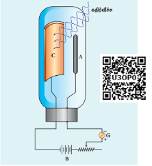
படம் 8.16 ஒளி மின்கலத்தின் அமைப்பு
 
##### வேலை செய்யும் விதம்

கேத்தோடின் மீது தகுந்த ஒளி படும்போது, அதிலிருந்து எலக்ட்ரான்கள் உமிழப்படுகின்றன. இந்த எலக்ட்ரான்கள் ஆனோடினால் கவரப்படுவதால், மின்னோட்டம் உருவாகிறது. இதனைக்காலவனாமீட்டர் மூலம் அளவிடலாம். கொடுக்கப்பட்ட கேத்தோடிற்கு, மின்னோட்டத்தின் மதிப்பு:

i) படுகதிர்வீச்சின் செறிவு மற்றும்
ii) ஆனோடு மற்றும் கேத்தோடு இடைப்பட்ட மின்னழுத்த வேறுபாடு ஆகியவற்றைப் பொறுத்து அமையும்.

##### ஒளி மின்கலத்தின் பயன்பாடுகள்

ஒளி மின்கலங்கள் பல்வேறு பயன்பாடுகளைக் கொண்டுள்ளன. குறிப்பாக, மின் இயக்கிகள் மற்றும் மின் உணர்விகளாகப் பயன்படுத்தப்படுகின்றன. இருள்நேரத்தில் தானாக ஒளிரும் மின்விளக்குகளில் ஒளி மின்கலங்கள் பயன்படுகின்றன. மேலும் தெருவிளக்குகள் இரவு அல்லது பகல் நேரங்களைப் பொறுத்து ஒளிர்வதற்கு மற்றும் அணைவதற்கு ஒளிமின்கலங்களைப் பயன்படுத்துகின்றன.

திரைப்படங்களில் ஒலியினைத் திரும்பப் பெறுவதற்கு ஒளி மின்கலங்கள் பயன்படுகின்றன. மேலும் ஓட்டப்பந்தயங்களில் தடகள வீரர்களின் வேகத்தை அளவிடும் கடிகாரங்களில் பயன்படுகின்றன. புகைப்படத்துறையில் ஒளிச் செறிவை அளவிட்டு, பின்பு புகைப்படக் கருவியில் ஒளி படுவதற்குத் தேவையான நேரத்தைக் (exposure time) கணக்கிடப் பயன்படுகின்றன.

##### எடுத்துக்காட்டு 8.2

கேள்வி:
ஒரு வெள்ளி உலோகப் பரப்பின் மீது $300\text{ nm}$ அலைநீளம் கொண்ட கதிர்வீச்சு படும்போது, ஒளி எலக்ட்ரான்கள் வெளிப்படுமா? [வெள்ளியின் வெளியேற்று ஆற்றல் = $4.7\text{ eV}$]

தீர்வு:
படும் ஃபோட்டானின் ஆற்றல்,

$$E = h\nu = \frac{hc}{\lambda} \quad (\text{ஜூல் அலகில்})$$

$$E = \frac{hc}{\lambda e} \quad (\text{eV அலகில்})$$

தெரிந்த மதிப்புகளை பிரதியிட, நமக்குக் கிடைப்பது:

$$E = \frac{6.626 \times 10^{-34} \times 3 \times 10^{8}}{300 \times 10^{-9} \times 1.6 \times 10^{-19}}$$

$$E = 4.14\text{ eV}$$

வெள்ளியின் ஒளிமின் வெளியேற்று ஆற்றல் = $4.7\text{ eV}$ ஆகும். உலோகப் பரப்பில் படும் ஒளி ஃபோட்டானின் ஆற்றல் வெள்ளி உலோகத்தின் வெளியேற்று ஆற்றலை விட குறைவாக இருப்பதால், ஒளிஎலக்ட்ரான்கள் உமிழப்படாது.

##### எடுத்துக்காட்டு 8.3

கேள்வி:
$2200\text{ \AA}$ அலைநீளம் கொண்ட ஒளியானது $\text{Cu}$ மீது படும்போது, ஒளிஎலக்ட்ரான்கள் உமிழப்படுகின்றன எனில்

i) பயன்தொடக்க அலைநீளம் மற்றும்
ii) நிறுத்து மின்னழுத்தம்

ஆகியவற்றைக் கணக்கிடவும். ($\text{Cu}$ இன் வெளியேற்று ஆற்றல் $\phi_0 = 4.65\text{ eV}$)

தீர்வு:

i) பயன்தொடக்க அலைநீளம்:

$$\lambda_0 = \frac{hc}{\phi_0} = \frac{6.626 \times 10^{-34} \times 3 \times 10^8}{4.65 \times 1.6 \times 10^{-19}}$$

$$\lambda_0 = 2672\text{ \AA}$$

ii) $2200\text{ \AA}$ அலைநீளம் கொண்ட ஃபோட்டானின் ஆற்றல்,

$$E = \frac{hc}{\lambda} = \frac{6.626 \times 10^{-34} \times 3 \times 10^8}{2200 \times 10^{-10}}$$

$$E = 9.035 \times 10^{-19}\text{ J} = 5.65\text{ eV}$$

அதிவேக ஒளிஎலக்ட்ரானின் இயக்க ஆற்றலானது பின்வருமாறு,

$$K_{\text{பெரும}} = h\nu - \phi_0 = 5.65 - 4.65$$$$K_{\text{பெரும}} = 1\text{ eV}$$

சமன்பாடு (8.3) இல் இருந்து, $K_{\text{பெரும}} = eV_0$$

$V_0 = \frac{K_{\text{பெரும}}}{e} = \frac{1 \times 1.6 \times 10^{-19}}{1.6 \times 10^{-19}}$$

எனவே, நிறுத்து மின்னழுத்தம் = $1\text{ V}$

##### எடுத்துக்காட்டு 8.4

கேள்வி:
பொட்டாசியத்தின் ஒளிமின் வெளியேற்று ஆற்றல் $2.30\text{ eV}$ ஆகும். $3000\text{ \AA}$ அலைநீளமும் $2\text{ Wm}^{-2}$ செறிவும் கொண்ட புறஊதாக் கதிர் பொட்டாசியப் பரப்பின் மீது படுகிறது எனில்:
i) ஒளி எலக்ட்ரான்களின் பெரும இயக்க ஆற்றலைக் கண்டுபிடிக்கவும்.
ii) $40\%$ ஃபோட்டான்கள் ஒளிஎலக்ட்ரான்களை வெளியேற்றினால், பொட்டாசியத்தின் $2\text{ cm}^2$ அளவிலான பரப்பிலிருந்து ஒரு வினாடிக்கு எத்தனை எலக்ட்ரான்கள் உமிழப்படும்?

தீர்வு:
i) படுகின்ற ஃபோட்டானின் ஆற்றல்,

$$E = \frac{hc}{\lambda} = \frac{6.626 \times 10^{-34} \times 3 \times 10^8}{3000 \times 10^{-10}}$$

$$E = 6.626 \times 10^{-19}\text{ J} = 4.14\text{ eV}$$

ஒளிஎலக்ட்ரான்களின் பெரும இயக்க ஆற்றல்,

$$K_{\text{பெரும}} = h\nu - \phi_0 = 4.14 - 2.30 = 1.84\text{ eV}$$

ii) ஒரு வினாடியில் பரப்பினை அடையும் ஃபோட்டான்களின் எண்ணிக்கை,
$$n_p = \frac{I}{E} \times A$$

$$n_p = \frac{2}{6.626 \times 10^{-19}} \times 2 \times 10^{-4}$$

$$n_p = 6.04 \times 10^{14}\text{ ஃபோட்டான்கள் / வினாடி}$$

ஒளிஎலக்ட்ரான்கள் உமிழப்படும் வீதம்,

$$= (0.40) n_p = 0.4 \times 6.04 \times 10^{14}$$

$$= 2.416 \times 10^{14}\text{ ஒளிஎலக்ட்ரான்கள் / வினாடி}$$

##### எடுத்துக்காட்டு 8.5

கேள்வி:

ஒரு உலோக மின்வாயின் மீது $390\text{ nm}$ அலைநீளம் கொண்ட ஒளியானது படுமாறு செய்யப்படுகிறது. உமிழப்படும் எலக்ட்ரானின் ஆற்றலைக் கண்டுபிடிப்பதற்கு இந்த மின்வாய் தகட்டிற்கும் மற்றொரு மின்வாய் தகட்டிற்கும் இடையே எதிர் மின்னழுத்தம் ஏற்படுத்தப்படுகிறது. இந்த மின்னழுத்த வேறுபாடு $1.10\text{ V}$ எனும்போது, மின்வாய்களுக்கு இடையேயான மின்னோட்டம் முற்றிலும் நிறுத்தப்படுகிறது எனில்:

(i) உலோகத்தின் ஒளிமின் வெளியேற்று ஆற்றல் மற்றும்
(ii) உலோகத்திலிருந்து எலக்ட்ரானை வெளியேற்றத் தேவைப்படும் ஒளியின் பெரும அலைநீளம் ஆகியவற்றைக் கணக்கிடுக.

தீர்வு:

i) வெளியேற்று ஆற்றல்,

$$\phi_0 = h\nu - K_{\text{பெரும}} = \frac{hc}{\lambda} - eV_0 \quad (\because K_{\text{பெரும}} = eV_0)$$

$$\phi_0 = \left[ \frac{6.626 \times 10^{-34} \times 3 \times 10^8}{390 \times 10^{-9}} \right] - [1.6 \times 10^{-19} \times 1.10]$$

$$\phi_0 = 5.10 \times 10^{-19} - 1.76 \times 10^{-19} = 3.34 \times 10^{-19}\text{ J}$$

$$\phi_0 = 2.09\text{ eV}$$

ii) பயன் தொடக்க அலைநீளம்,

$$\lambda_0 = \frac{hc}{\phi_0} = \frac{6.626 \times 10^{-34} \times 3 \times 10^8}{3.34 \times 10^{-19}}$$

$$\lambda_0 = 5.951 \times 10^{-7}\text{ m} = 5951\text{ \AA}$$
