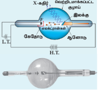
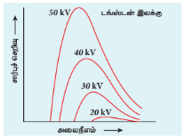
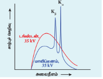
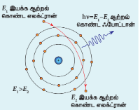
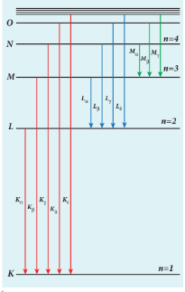

## 8.4 X-கதிர்கள்

**அறிமுகம்**

ஒளிமின் விளைவின் போது ஃபோட்டான்கள் படுவதால் எலக்ட்ரான்கள் உமிழப்படுகின்றன என்பதை குவாண்டம் கொள்கை விளக்குகிறது. இதில் ஆற்றல் ஆனது ஃபோட்டான்களில் இருந்து எலக்ட்ரான்களுக்கு மாற்றப்படுகிறது. இதனைத் தொடர்ந்து, இதற்கு மறுதலை நிகழ்வு சாத்தியமா எனும் வினா எழுகிறது.

அதாவது, எலக்ட்ரான் இயக்க ஆற்றலை ஃபோட்டான் ஆற்றலாக மாற்ற இயலுமா அல்லது இயலாதா என்பதாகும். இந்த வினாவிற்கு விடையளிக்கும் நிகழ்வு ஆனது பிளாங்கின் கதிர்வீச்சுப் பற்றிய குவாண்டம் கொள்கைக்கு முன்பாகவே கண்டறியப் பட்டுள்ளது. அந்த நிகழ்வைப் பற்றி இப்போது பார்ப்போம்.

**X-கதிர்களின் கண்டுபிடிப்பு**

வேகமாக இயங்கும் எலக்ட்ரான்கள் குறிப்பிட்ட சில பொருள்களின் மீது விழும்போது, அதிக ஊடுருவும் திறன் கொண்ட கதிர்வீச்சு வெளிப்படுவதை வில்ஹெல்ம் ராண்டெஜன் என்பவர் 1895 இல் கண்டறிந்தார். அந்த காலகட்டத்தில் அக்கதிர்களின் தோற்றம் பற்றித் தெரியவில்லை என்பதால், அவை X-கதிர்கள் எனப் பெயரிடப்பட்டன.

0.1Å முதல் 100Å வரை குறைந்த அலைநீளம் கொண்ட மின்காந்த அலைகள், X-கதிர்கள் எனப்படும். இவை ஒளியின் வேகத்தில் நேர்கோட்டில் பயணம் செய்யும். மேலும் மின் மற்றும் காந்தப்புலங்களால் விலகலடையாது. X-கதிர் ஃபோட்டான்கள் உயர் அதிர்வெண் அல்லது குறைந்த அலைநீளம் கொண்டுள்ளதால், அதிக அளவு ஆற்றல் கொண்டவை. கண்ணுறு ஒளி புகுந்து செல்ல இயலாத பொருள்களின் வழியாகக் கூட X-கதிர்கள் ஊடுருவிச் செல்லக்கூடியவை.

X-கதிர்களின் தரமானது அதன் ஊடுருவுதிறனைப் பொருத்து அளவிடப்படுகிறது. இவற்றின் ஊடுருவுதிறனானது இலக்கு பொருள்களின் மீது மோதுகின்ற எலக்ட்ரான்களின் திசைவேகம் மற்றும் இலக்கு பொருள்களின் அணு எண் ஆகியவற்றைப் பொருத்து அமையும். X-கதிர்களின் செறிவானது இலக்கின் மீது மோதும் எலக்ட்ரான்களின் எண்ணிக்கையைப் பொருத்தது.

**X-கதிர்கள் உற்பத்தி**

X-கதிர்க் குழாய் எனப்படும் மின்னிறக்கக் குழாய்கள் மூலம் X-கதிர்கள் உற்பத்தி செய்யப்படுகின்றன (படம் 8.20). மின்கலத்தொகுப்பின் (L.T.) மூலம் பங்ஸ்டன் மின்னிழை F ஆனது வெண்ணொளிர்வு நிலைக்கு (incandescence) சூடேற்றப்படுகிறது. இதன் விளைவாக, வெப்ப அயனி உமிழ்வின் மூலம் எலக்ட்ரான்கள் உமிழப்படுகின்றன.

மின்னிழை F மற்றும் ஆனோடு இடையே உள்ள உயர் மின்னழுத்த வேறுபாட்டினால் (H.T.), எலக்ட்ரான்கள் அதிக வேகத்தில் முடுக்கப்படுகின்றன. தாமிரத்தால் செய்யப்பட்ட ஆனோட்டின் முகப்பு பகுதியில் பங்ஸ்டன், மாலிப்டினம் போன்ற இலக்குப் பொருள் பொதித்து வைக்கப்பட்டுள்ளது. X-கதிர்கள் குழாயிலிருந்து வெளியேறுவதற்கு ஏதுவாக, எலக்ட்ரான் கற்றையைப் பொருத்து இலக்குப் பொருளின் முகப்பு பகுதி $45^\circ$ கோணத்தில் சாய்வாக வைக்கப்பட்டுள்ளது. இதனால் X-கதிர்கள் மின்னிறக்கக் குழாயின் ஒரு பக்கத்தில் வெளியேறுகிறது.

படம் 8.20 X-கதிர்கள் உற்பத்தி

 
இலக்கின் மீது அதிவேக எலக்ட்ரான்கள் மோதும் போது, திடீரென ஏற்படும் எதிர் முடுக்கத்தினால் தம் இயக்க ஆற்றலை இழக்கின்றன. இதன் விளைவாக, X-கதிர் ஃபோட்டான்கள் உருவாகின்றன. மோதும் எலக்ட்ரான்களின் இயக்க ஆற்றலின் பெரும்பகுதி வெப்பமாக மாறுவதால், அதிக அளவு உருகுநிலை கொண்ட இலக்கு பொருள்கள் மற்றும் குளிர்விப்பான் அமைப்பு ஆகியவை பொதுவாகப் பயன்படுத்தப்படுகின்றன.

**X-கதிர் நிறமாலை (X-ray spectrum)**

உலோக இலக்கின் மீது வேகமாகச் செல்லும் எலக்ட்ரான்கள் மோதுவதால் X-கதிர்கள் உருவாகின்றன. X-கதிர்களின் அலைநீளத்தைப் பொருத்து X-கதிர்களின் செறிவிற்கு வரையப்படும் வளைகோடு ஆனது X-கதிர் நிறமாலை எனப்படும். X-கதிர் நிறமாலை ஆனது தொடர் நிறமாலை மற்றும் அதன் மீது மேற்பொருந்தியுள்ள முகடுகள் எனும் இரு பகுதிகளைக் கொண்டது (படம் 8.21 (அ) மற்றும் (ஆ)).

**தொடர் நிறமாலை (Continuous spectrum)** என்பது குறிப்பிட்ட சிறும அலைநீளம் $\lambda_0$ முதல் தொடர்ச்சியாக அனைத்து அலைநீளங்களைக் கொண்ட கதிர்வீச்சுகளால் ஆக்கப்பட்டுள்ளது. மின்வாய்களின் மின்னழுத்த வேறுபாட்டைப் பொருத்து சிறும அலைநீளத்தின் மதிப்பு அமையும். மேற்பொருந்தும் முகடுகள் இலக்கு செய்யப்பட்ட பொருளின் சிறப்பியல்பினைப் பொருத்து அமைவதால், அது **சிறப்பு நிறமாலை (Characteristic spectrum)** எனப்படுகின்றன. படம் 8.21 (அ) வில் பல்வேறு முடுக்கு மின்னழுத்த வேறுபாடுகளில் டங்ஸ்டனின் X-கதிர் நிறமாலையும், படம் 8.21 (ஆ) வில் ஒரு குறிப்பிட்ட மின்னழுத்த வேறுபாட்டில் டங்ஸ்டன் மற்றும் மாலிப்டினம் இலக்குகளின் X-கதிர் நிறமாலையும் காட்டப்பட்டுள்ளன.

படம் 8.21 (அ) பல்வேறு முடுக்கு மின்னழுத்த வேறுபாடுகளில் டங்ஸ்டனின் X-கதிர் நிறமாலை

 

படம் 8.21 (ஆ) 35 kV மின்னழுத்த வேறுபாட்டில் டங்ஸ்டன் மற்றும் மாலிப்டினத்தின் X-கதிர் நிறமாலை

 

முடுக்கப்படும் எலக்ட்ரான்களில் இருந்து கதிர்வீச்சு உமிழ்ப்படும் என்பதை பண்டைய மின்காந்தக் கொள்கை எடுத்துரைத்தாலும், X-கதிர் நிறமாலையில் உள்ள பின்வரும் இரண்டு சிறப்பம்சங்களை விளக்க இயலவில்லை.

(i) கொடுக்கப்பட்ட முடுக்கு மின்னழுத்த வேறுபாட்டில், தொடர் X-கதிர் நிறமாலையில் அலைநீளத்தின் சிறும மதிப்பானது எல்லா இலக்கு பொருள்களுக்கும் சமமாக உள்ளது. இந்தச் சிறும அலைநீளம் ஆனது வெட்டு அலைநீளம் (cut-off wavelength) எனப்படும்.

(ii) வரையறுக்கப்பட்ட குறிப்பிட்ட சில அலைநீளங்களில் X-கதிர்களின் செறிவு கணிசமாக அதிகரிக்கிறது. இது மாலிப்டினத்தின் சிறப்பு நிறமாலையில் காட்டப்பட்டுள்ளது (படம் 8.21 (ஆ)).

ஆனால் கதிர்வீச்சின் ஃபோட்டான் கொள்கை மூலம், இந்த இரு சிறப்பம்சங்களை விளக்க முடியும்.

### தொடர் X-கதிர் நிறமாலை

அதிவேக எலக்ட்ரான் ஆனது இலக்குப் பொருளை ஊடுருவி அதன் அணுக்கருவை நெருங்கும் போது, எலக்ட்ரான் மற்றும் அணுக்கரு இடையே உள்ள இடைவிசை காரணமாக எலக்ட்ரான் முடுக்கம் அல்லது எதிர் முடுக்கம் அடைகிறது. இதன் விளைவாக எலக்ட்ரானின் பாதையில் மாற்றம் ஏற்படுகிறது. இவ்வாறான எதிர் முடுக்கம் அடைந்த எலக்ட்ரானால் தோற்றுவிக்கப்படும் கதிர்வீச்சு பிரேம்ஸ்டிராலுங் (Bremsstrahlung or braking radiation) எனப்படும் (படம் 8.22).

படம் 8.22 எதிர்முடுக்கமடைந்த எலக்ட்ரானிலிருந்து வெளிவரும் பிரேம்ஸ்டிராலுங் ஃபோட்டான்

 
உமிழ்ப்பும் ஃபோட்டானின் ஆற்றலானது எலக்ட்ரானின் இயக்க ஆற்றல் இழப்புக்குச் சமமாகும். எலக்ட்ரான் தனது ஆற்றலின் ஒரு பகுதி அல்லது மொத்த ஆற்றலையும் ஃபோட்டானுக்கு கொடுப்பதால், சாத்தியமுள்ள அனைத்து ஆற்றல்களிலும் (அல்லது அதிர்வெண்களிலும்) ஃபோட்டான்கள் வெளிப்படுகின்றன. இத்தகைய கதிர்வீச்சு மூலம் தொடர் X-கதிர் நிறமாலை உருவாகின்றது.

எலக்ட்ரான் தனது மொத்த ஆற்றலையும் அளிக்கும் போது, அதிகபட்ச அதிர்வெண் $\nu_0$ (அல்லது குறைந்தபட்ச அலைநீளம் $\lambda_0$) கொண்ட ஃபோட்டானை உமிழ்ப்புகிறது. எலக்ட்ரானின் ஆரம்ப இயக்க ஆற்றல் $e V$ ஆகும். இங்கு $V$ என்பது முடுக்கு மின்னழுத்த வேறுபாடு ஆகும். எனவே,
$$h \nu_0 = e V \quad (\text{அல்லது}) \quad \frac{h c}{\lambda_0} = e V$$
$$\lambda_0 = \frac{h c}{e V}$$
இங்கு $\lambda_0$ என்பது வெட்டு அலைநீளம் ஆகும். தெரிந்த மதிப்புகளை மேற்கண்ட சமன்பாட்டில் பிரதியிட்டால், நமக்குக் கிடைப்பது
$$\lambda_0 = \frac{12400}{V} \text{ Å} \quad (8.14)$$
சமன்பாடு (8.14)இல் காட்டப்பட்டுள்ள தொடர்பு, டூயான் - ஹண்ட் வாய்ப்பாடு எனப்படும்.

$\lambda_0$ இன் மதிப்பு முடுக்கு மின்னழுத்தத்தை மட்டும் பொருத்து அமையும். எனவே கொடுக்கப்பட்ட முடுக்கு மின்னழுத்தத்தில், எல்லா இலக்கு பொருள்களுக்கும் $\lambda_0$ இன் மதிப்பு சமம் ஆகும். இது சோதனை முடிவுகளுடன் நன்கு பொருந்தியுள்ளது. எனவே, தொடர் X-கதிர் நிறமாலை உருவாக்கம் மற்றும் வெட்டு அலைநீளத்தின் தோற்றம் ஆகியவற்றைக் கதிர்வீச்சு பற்றிய ஃபோட்டான் கொள்கையின் அடிப்படையில் விளக்க முடியும்.

### சிறப்பு X-கதிர் நிறமாலை

உயர் வேக எலக்ட்ரான்களால் இலக்குப் பொருள் தாக்கப்படும் போது, நன்கு வரையறுக்கப்பட்ட சில அலைநீளங்களில் குறுகிய முகடுகள் X-கதிர் நிறமாலையில் தோன்றுகின்றன. இந்த முகடுகளுடன் தோன்றும் வரி நிறமாலை ஆனது சிறப்பு X-கதிர் நிறமாலை எனப்படும். இந்த X-கதிர் நிறமாலை அணுவினுள் ஏற்படும் எலக்ட்ரான் நிலைமாற்றத்தினால் (electronic transition) தோன்றுகின்றது.

இலக்கு அணுவின் உள்ளே ஊடுருவும் அதிக ஆற்றல் கொண்ட எலக்ட்ரான் ஆனது சில K-கூடு எலக்ட்ரான்களை வெளியேற்ற முடியும். பிறகு சில K-கூட்டில் ஏற்பட்டுள்ள காலியிடத்தை நிரப்புவதற்கு வெளிவட்டப்பாதையில் இருந்து எலக்ட்ரான்கள் தாவுகின்றன. இந்த கீழ்நோக்கிய நிலைமாற்றத்தின் போது, ஆற்றல் மட்டங்களுக்கு இடைப்பட்ட ஆற்றல் வேறுபாடு ஆனது X-கதிர் ஃபோட்டான் வடிவில் வெளிப்படுகிறது. இந்த ஃபோட்டானின் அலைநீளம் வரையறுக்கப்பட்ட மதிப்பைக் கொண்டிருக்கும். இலக்குப் பொருளின் சிறப்புப் பண்பாக அமையும் இந்த அலைநீளங்கள், வரி நிறமாலையை உருவாக்குகின்றன.

படம் 8.23 சிறப்பு X-கதிர் நிறமாலையின் தோற்றம்

 

படம் 8.23 இல் இருந்து, L, M, N.... போன்ற ஆற்றல் மட்டத்தில் இருந்து K-ஆற்றல் மட்டத்திற்கு எலக்ட்ரான் நிலைமாற்றம் நடைபெறுவதால், K-வரிசை நிறமாலை வரிகள் தோன்றுகின்றன என்பது தெளிவாகிறது. இதே போல, L-எலக்ட்ரான்கள் அணுவில் இருந்து வெளியேற்றப்பட்டால், M, N, O.... போன்ற ஆற்றல் மட்டத்தில் இருந்து L-ஆற்றல் மட்டத்திற்கு எலக்ட்ரான் நிலைமாற்றம் நடைபெறுகிறது. இதன்மூலம் அதிக அலைநீளம் கொண்ட L- வரிசை நிறமாலை வரிகள் தோன்றுகின்றன. மற்ற வரிசைகளும் இது போலவே உருவாகின்றன.

K-வரிசையின் $K_\alpha$ மற்றும் $K_\beta$ வரிகள், படம் 8.21 (ஆ) இல் உள்ள மாலிப்டினத்தின் X-கதிர் நிறமாலையின் இரு முகடுகள் மூலம் காட்டப்பட்டுள்ளன.

**X-கதிரின் பயன்பாடுகள்**

X-கதிர்கள் பல்வேறு துறைகளில் பயன்படுகின்றன. அதில் சிலவற்றை நாம் பட்டியலிடுவோம்.

1) **மருத்துவத்துறையில் நோய் அறிதல்:** X-கதிர்கள் எலும்புகளை விட திசுக்களை எளிதாக ஊடுருவுகின்றன. இதனால் எலும்புகளின் ஆழமான நிழலும், திசுக்களின் மேலோட்டமான நிழலும் கொண்ட X-கதிர்ப்படத்தைப் பெற முடியும். X-கதிர்ப்படமானது எலும்பு முறிவு, உடலின் உள்ளே உள்ள அந்நியப் பொருள்கள், நோயினால் தாக்கப்பட்ட உடல் உறுப்புகள் ஆகியவற்றைக் கண்டறியப் பயன்படுகிறது.

2) **மருத்துவத்துறையில் சிகிச்சை:** நோயுற்ற திசுக்களை X-கதிர்கள் அழிக்கக் கூடியவை என்பதால், தோல் நோய்கள், புற்றுநோய்க் கட்டிகள் போன்றவற்றைக் குணமாக்குவதற்கு இவை பயன்படுகின்றன.

3) **தொழில் துறை:** பற்ற வைக்கப்பட்ட இணைப்புகளில் உள்ள விரிசல்கள், வாகன பயணிகள், டென்னிஸ் பந்துகள் மற்றும் மரங்கள் ஆகியவற்றைச் சோதனை செய்ய X-கதிர்கள் பயன்படுகின்றன. சுங்கச்சாவடிகளில் தடைசெய்யப்பட்ட பொருள்களைக் கண்டு பிடிப்பதற்கும் பயன்படுகின்றன.

4) **அறிவியல் ஆராய்ச்சி:** படிகப் பொருள்களின் கட்டமைப்பை – அதாவது, படிகங்களில் உள்ள அணுக்கள் மற்றும் மூலக்கூறுகளின் அமைவுகளை அறிவதற்கு X-கதிர் விளிம்பு விளைவு சிறந்த கருவியாக உள்ளது.

**எடுத்துக்காட்டு 8.9**

20,000 V முடுக்கு மின்னழுத்தம் உள்ள X-கதிர் குழாயில் இருந்து வெளிவரும் X-கதிர்களின் வெட்டு அலைநீளம் மற்றும் வெட்டு அதிர்வெண் ஆகியவற்றைக் கணக்கிடுக.

**தீர்வு**

தொடர் நிறமாலையில், X-கதிர்களின் வெட்டு அலைநீளம்,
$$\lambda_0 = \frac{12400}{V} \text{ Å} = \frac{12400}{20000} \text{ Å} = 0.62 \text{ Å}$$
இதற்குத் தொடர்புடைய வெட்டு அதிர்வெண்,
$$\nu_0 = \frac{c}{\lambda_0} = \frac{3 \times 10^8}{0.62 \times 10^{-10}} = 4.84 \times 10^{18} \text{ Hz}$$

---
## பாடச்சுருக்கம்

* துகள் என்பது மிகச்சிறிய அளவிலான குவிக்கப்பட்ட பருப்பொருள் என கருதப்படுகிறது (குறிப்பிட்ட இடம் மற்றும் கால எல்லைகள்). ஆனால் அலை என்பது அகன்ற பரவலான ஆற்றலாகும் (குறிப்பிட்ட இடம் மற்றும் கால எல்லைகள் இல்லாதது).
* பொருளின் எந்தவொரு பரப்பிலிருந்தும் எலக்ட்ரான் வெளியேற்றப்படும் நிகழ்வு **எலக்ட்ரான் உமிழ்வு** எனப்படும்.
* உலோகத்தின் பரப்பிலிருந்து எலக்ட்ரானை வெளியேற்றத் தேவைப்படும் சிறும ஆற்றல் **உலோகத்தின் வெளியேற்று ஆற்றல்** எனப்படும்.
* $1\text{ eV}$ என்பது $1.602 \times 10^{-19}\text{ J}$-க்கு சமமாகும்.
* வெப்ப ஆற்றலால் ஏற்படும் எலக்ட்ரான் உமிழ்வு **வெப்ப அயனி உமிழ்வு** எனப்படும்.
* மிக வலிமையான மின்புலத்தை உலோகத்தின் குறுக்கே அளிக்கும் போது **மின்புல உமிழ்வு** ஏற்படுகிறது.
* குறிப்பிட்ட அதிர்வெண் கொண்ட மின்காந்தக் கதிர்வீச்சு உலோக பரப்பின் மீது படும்போது, **ஒளிமின் உமிழ்வு** நடைபெறுகிறது.
* மிக வேகமாகச் செல்லும் எலக்ட்ரான் கற்றை உலோகத்தின் பரப்பின் மீது மோதும்போது **இரண்டாம் நிலை எலக்ட்ரான் உமிழ்வு** ஏற்படுகிறது.
* **ஒளிமின்னோட்டம்**தானது (ஒரு வினாடியில் உமிழப்படும் எலக்ட்ரான்களின் எண்ணிக்கை) படும் ஒளியின் செறிவிற்கு **நேர்த்தகவில்** அமையும்.
* **நிறுத்து மின்னழுத்தம்** என்பது பெரும இயக்க ஆற்றலைக் கொண்ட ஒளி எலக்ட்ரான்களை நிறுத்தி, ஒளி மின்னோட்டத்தை சுழியாக்குவதற்கு ஆனோடிற்கு அளிக்கப்படும் எதிர் (எதிர் முடுக்கு) மின்னழுத்தத்தின் மதிப்பாகும்.
* நிறுத்து மின்னழுத்தம் படுஒளியின் செறிவைப் பொறுத்தது அல்ல.
* ஒளிஎலக்ட்ரான்களின் பெரும இயக்க ஆற்றல் படுஒளியின் செறிவைப் பொறுத்தது அல்ல.
* கொடுக்கப்படும் உலோகப் பரப்பிற்கு, படுகதிரின் அதிர்வெண் ஒரு குறிப்பிட்ட சிறும அதிர்வெண்ணை விட அதிகமாக இருந்தால் மட்டுமே ஒளிஎலக்ட்ரான் உமிழ்வு ஏற்படும். இந்தச் சிறும அதிர்வெண் **பயன்தொடக்க அதிர்வெண்** எனப்படும்.
* பிளாங்க் கொள்கைப்படி, ஒரு பொருளானது அதிக எண்ணிக்கைக் கொண்ட வெவ்வேறு அதிர்வெண்ணில் அதிர்வடையும் துகள்களை (அணுக்கள்) கொண்டிருக்கும்.
* ஐன்ஸ்டீனின் கொள்கைப்படி, ஒளி ஆற்றலானது அலை முகப்புகளில் பரவியிருக்காமல், சிறு சிப்பங்கள் அல்லது குவாண்டாவில் குவிக்கப்பட்டிருக்கும்.
* வரையறுக்கப்பட்ட ஆற்றல் மற்றும் உந்தத்தைப் பெற்ற ஒவ்வொரு ஒளி குவாண்டமும் **ஃபோட்டான்** எனப்படும்.
* ஒளி பரவும் போது அலையாகவும், பொருள்களுடன் இடைவினை புரியும் போது துகளாகவும் செயல்படுகிறது.
* **ஒளி மின்கலம்** என்பவை ஒளி ஆற்றலை மின் ஆற்றலாக மாற்றும் சாதனம் ஆகும்.
* இயக்கத்தில் உள்ள எலக்ட்ரான்கள், புரோட்டான்கள் மற்றும் நியூட்ரான்கள் போன்ற அனைத்து பருப்பொருள் துகள்களும் அலைப்பண்பைப் பெற்றுள்ளன. அவற்றுடன் தொடர்புடைய இந்த அலைகள் **டி ப்ராய் அலைகள்** அல்லது **பருப்பொருள் அலைகள்** எனப்படுகின்றன.
* எலக்ட்ரானின் அலை இயல்பு **எலக்ட்ரான் நுண்ணோக்கி**யின் வடிவமைப்பில் பயன்படுத்தப்படுகிறது.
* 1927 இல் கிளின்டன் டேவிசன் மற்றும் லெஸ்டர் ஜெர்மர் ஆகியோர் டி ப்ராயின் பருப்பொருள் அலைகள் பற்றிய விடுகோளை சோதனை வாயிலாக உறுதி செய்துள்ளனர்.
இதோ நீங்கள் பதிவேற்றிய கடைசிப் பகுதியில் உள்ள "பாடச்சுருக்கம்" தொடர்ச்சியின் துல்லியமான தட்டச்சுப் பிரதி (Tamil Text) மற்றும் **LaTeX ($...$)** சமன்பாட்டு வடிவமைப்பு:

* வேகமாக இயங்கும் எலக்ட்ரான்கள் குறிப்பிட்ட சில பொருள்களின் மீது விழும்போது, அதிக ஊடுருவும் திறன் கொண்ட X-கதிர்கள் எனப்பெயரிடப்பட்ட கதிர்வீச்சு வெளிவிடப்படுகின்றது.
* தொடர் நிறமாலை என்பது குறிப்பிட்ட சிறும அலைநீளம் $\lambda_0$ முதல் தொடர்ச்சியாக அனைத்து அலைநீளங்களை கொண்ட கதிர்வீச்சுகளால் ஆக்கப்பட்டுள்ளது.
* உயர் வேக எலக்ட்ரான்களால் இலக்குப் பொருள் தாக்கப்படும் போது நன்கு வரையறுக்கப்பட்ட சில அலைநீளங்களில் குறுகிய முகடுகள் X-கதிர் நிறமாலையில் தோன்றுகின்றன. இந்த முகடுகளுடன் தோன்றும் வரி நிறமாலையானது **சிறப்பு X-கதிர் நிறமாலை** எனப்படும்.

---
