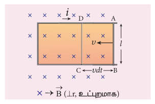
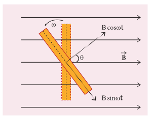
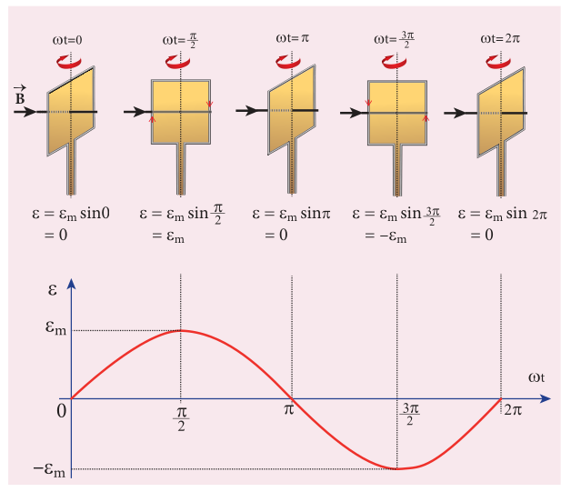

### 4.4.1 அறிமுகம்

மின்னியக்கு விசை என்பது ஒரு மின்சுற்றின் வழியாக மின்னூட்டத்தைச் செலுத்தக்கூடிய ஆற்றல் காரணத்தின் பண்பாகும். உண்மையில் இது ஒரு விசையல்ல என்பதை நாம் ஏற்கனவே அறிந்துள்ளோம். இது, முழுச்சுற்றின் வழியாக ஓரலகு மின்னூட்டத்தை நகர்த்துவதற்குச் செய்யப்பட்ட வேலையாகும். [J C⁻¹] இல் வோல்ட் என்ற அலகினால் அளக்கப்படுகிறது.

பாரடேயின் மின்காந்தத்தூண்டல் பரிசோதனையில் இருந்து ஒரு சுற்றின் வழியே செல்லும் காந்தப்புலத்தின் பாயத்தை மாற்றுவதன் மூலம் ஒரு மின்னியக்கு விசை தூண்டப்படுகிறது என கண்டறியப்பட்டது. காந்தப்பாய மாற்றமானது (i) மின் சுற்று மற்றும் காந்தத்திற்கு இடையே உள்ள சார்பு இயக்கம் (முதல் சோதனை) (ii) அருகில் உள்ள சுற்றில் பாயும் மின்னோட்டத்தை மாற்றுதல் (இரண்டாவது சோதனை) ஆகியவற்றால் மேற்கொள்ளப்படுகிறது.

மின்னியக்கு விசையை அளிக்கக்கூடிய ஆற்றல் மூலங்களின் சில எடுத்துக்காட்டுகள் வருமாறு: மின் வேதிகலன்கள், வெப்ப மின்சாதனங்கள், சூரிய ஒளிக்கலன்கள் மற்றும் மின்னியற்றிகள் ஆகும். இவற்றில் பெரிய அளவிலான மின் உற்பத்திக்கு திறன் மிகுந்த இயந்திரங்களான மின்னியற்றிகள் பயன்படுகின்றன.

பாரடேயின் மின்காந்தத்தூண்டல் விதியின்படி, ஒரு சுற்றுடன் தொடர்புடைய காந்தப்பாயத்தில் மாற்றம் ஏற்பட்டால் அச்சுற்றில் ஒரு மின்னியக்கு விசை தூண்டப்படுகிறது. இது தூண்டப்பட்ட மின்னியக்கு விசை எனப்படும்.

$$\varepsilon = \frac{d\Phi_B}{dt} \quad (\text{அல்லது}) \quad \varepsilon = \frac{d}{dt}(BA \cos \theta) \qquad (4.17)$$

மேற்கண்ட சமன்பாட்டினின்று கீழ்கண்ட ஏதேனும் ஒரு வழியில் காந்தப்பாயத்தை மாற்றி, மின்னியக்கு விசையை உருவாக்கலாம் என்பது தெளிவாகிறது.

(i) காந்தப்புலத்தை ($B$) மாற்றுவதன் மூலம்
(ii) கம்பிச்சுருளின் பரப்பை ($A$) மாற்றுவதன் மூலம் மற்றும்
(iii) காந்தப்புலத்தைச் சார்ந்த கம்பிச்சுருளின் திசையமைப்பை ($\theta$) மாற்றுவதன் மூலம்

### 4.4.2 காந்தப்புலத்தை மாற்றுவதன் மூலம் தூண்டப்பட்ட மின்னியக்குவிசையை உருவாக்குதல்

ஃபாரடேயின் மின்காந்தத் தூண்டல் பரிசோதனையில் இருந்து ஒரு சுற்றின் வழியே செல்லும் காந்தப்புலத்தின் பாயத்தை மாற்றுவதன் மூலம் ஒரு மின்னியக்கு விசை தூண்டப்படுகிறது என கண்டறியப்பட்டது. காந்தப்பாய மாற்றமானது (i) மின் சுற்று மற்றும் காந்தத்திற்கு இடையே உள்ள சார்பு இயக்கம் (முதல் சோதனை) (ii) அருகில் உள்ள சுற்றில் பாயும் மின்னோட்டத்தை மாற்றுதல் (இரண்டாவது சோதனை) ஆகியவற்றால் மேற்கொள்ளப்படுகிறது.

### 4.4.3 கம்பிச்சுருளின் பரப்பை மாற்றுவதன் மூலம் தூண்டப்பட்ட மின்னியக்கு விசையை உருவாக்குதல்

படம் 4.23 சட்டம் உள்ளடக்கிய பரப்பை மாற்றுவதன் மூலம் மின்னியக்கு விசையைத் தூண்டுதல்

படம் 4.23-இல் காட்டியுள்ளவாறு l நீளமுள்ள கடத்தும் தண்டு ஒரு பொருந்தப்பட்ட செவ்வக உலோகச் சட்டத்தில் $\nu$ திசைவேகத்தில் இடதுபுறமாக நகர்வதாகக் கொள்க. இந்த மொத்த அமைப்பும் $\vec{B}$ என்ற சீரான காந்தப்புலத்தில் வைக்கப்பட்டுள்ளது. அதன் காந்தப்புலக் கோடுகள் தாளின் தளத்திற்கு செங்குத்தாக, உள்நோக்கிய திசையில் உள்ளன.

தண்டானது AB-இல் இருந்து DC-க்கு dt நேரத்தில் நகரும் போது சட்டம் உள்ளடக்கிய பரப்பு குறைகிறது. அதனால் சட்டத்தின் வழியேயான காந்தப்பாயமும் குறைகிறது.

\(dt\) நேரத்தில் ஏற்படும் காந்தப்பாய மாற்றம்

\[
d\Phi_B = B \times \text{ பரப்பில் ஏற்படும் மாற்றம் } (dA)
\]

\[
= B \times \text{ பரப்பு } ABCD
\]

பரப்பு \(ABCD = l(vdt)\) ஆகையால்,

\[
d\Phi_B = Blv \, dt \quad (\text{அல்லது})
\]

\[
\frac{d\Phi_B}{dt} = Blv
\]

காந்தப்பாய மாற்றம் காரணமாக சட்டத்தில் மின்னியக்குவிசை தூண்டப்படுகிறது. தூண்டப்பட்ட மின்னியக்கு விசையின் எண்மதிப்பு

\[
\varepsilon = \frac{d\Phi_B}{dt}
\]

\[
\varepsilon = Blv \tag{4.18}
\]

இந்த மின்னியக்குவிசை என்பதும், இங்கு இது காந்தப்புலத்தில் தண்டு இயக்கத்தால் உருவானதாகும். பிளெமிங் வலதுகை விதியிலிருந்து தூண்டப்பட்ட மின்னோட்டத்தின் திசை வலக்குறியாக உள்ளது என அறியலாம்.

\(R\) என்பது சுற்றின் மின்தடை எனில், தூண்டப்பட்ட மின்னோட்டம்

$$i = \frac{\varepsilon}{R} = \frac{B l \nu}{R}$$

**ஆற்றல் மாற்றம்:**

செங்குத்தான காந்தப்புலத்தில் வைக்கப்பட்டுள்ள மின்னோட்டம் தாங்கிய நகரக்கூடிய தண்டு AB மீது விசை $\vec{F}_B$ செயல்படுகிறது. இவ்விசை தண்டின் இயக்கத்திற்கு எதிர்த்திசையில் வெளிப்புறமாக செயல்படுகிறது. இவ்விசையானது

$$\vec{F}_B = i \vec{l} \times \vec{B}$$
$$|\vec{F}_B| = i B l \sin \theta = i B l \quad (\text{ஏனெனில் } \theta = 90^\circ)$$

$\nu$ என்ற மாறா திசைவேகத்தில் தண்டினை நகர்த்துவதற்கு, காந்தவிசைக்கு சமமான மாறா விசை ஒன்று எதிர்த்திசையில் செலுத்தப்பட வேண்டும்.

$$|\vec{F}_{app}| = |\vec{F}_B| = i B l$$

எனவே தண்டினை நகர்த்துவதற்கு வெளிப்புற விசையினால் இயந்திர வேலை செய்யப்படுகிறது. வேலை செய்யப்படும் வீதம் அல்லது திறன்

$$P = \vec{F}_{app} \cdot \vec{\nu} = F_{app} \nu \cos \theta \quad (\text{இங்கு } \theta = 0^\circ) = i B l \nu = \left( \frac{B l \nu}{R} \right) B l \nu = \frac{B^2 l^2 \nu^2}{R}$$

தூண்டப்பட்ட மின்னோட்டம் சுற்றில் பாயும்போது ஜூல் வெப்பமாதல் நடைபெறுகிறது. சுற்றில் வெப்ப ஆற்றல் வெளிப்படும் வீதம் அல்லது வெளிப்படும் திறன்

$$P = i^2 R = \left( \frac{B l \nu}{R} \right)^2 R = \frac{B^2 l^2 \nu^2}{R}$$

இந்த சமன்பாடானது சமன்பாடு (4.20) போலவே அமைந்துள்ளது. எனவே தண்டினை நகர்த்துவதற்கு செய்யப்படும் இயந்திர ஆற்றலானது மின்னாற்றலாக மாற்றப்படுகிறது. பின்னர் சுற்றில் உருவாகும் வெப்ப ஆற்றலாக தோன்றுகிறது. ஆற்றல் மாறா விதியின்படி இந்த ஆற்றல் மாற்றம் அமைந்துள்ளது.

**எடுத்துக்காட்டு 4.14**

சீரான காந்தப்புலம் 0.4 T இல் $0.03 m^2$ பரப்பு கொண்ட வட்ட உலோகவட்டு ஒன்று சுழலுகிறது. சுழற்சி அச்சானது வட்டின் மையம் வழியாகவும் அதன் தளத்திற்கு செங்குத்தாகவும் அமைந்துள்ளது. மேலும் சுழற்சி அச்சானது காந்தப்புலத்தின் திசைக்கு இணையாக உள்ளது. வட்டு ஒரு விநாடி நேரத்தில் 20 சுழற்சிகளை நிறைவு செய்கிறது. வட்டின் மின்தடை $4 \Omega$ எனில், அதன் அச்சுக்கும் விளிம்புக்கும் இடையே தூண்டப்படும் மின்னியக்கு விசை மற்றும் வட்டில் பாயும் தூண்டப்பட்ட மின்னோட்டம் ஆகியவற்றைக் கணக்கிடுக.

**தீர்வு:**

$A = 0.03 m^2$; $B = 0.4 T$; $f = 20 rps$; $R = 4 \Omega$

ஒரு வினாடி நேரத்தில் வட்டு ஏற்படுத்திய பரப்பு = வட்டின் பரப்பு $\times$ அதிர்வெண்
$$\frac{dA}{dt} = 0.03 \times 20 = 0.6 m^2 s^{-1}$$

தூண்டப்பட்ட மின்னியக்கு விசையின் எண்மதிப்பு, $\varepsilon = \frac{d\Phi_B}{dt} = \frac{d(BA)}{dt} = B \frac{dA}{dt}$
$$\varepsilon = 0.4 \times 0.6 = 0.24 V$$

தூண்டப்பட்ட மின்னோட்டம், $i = \frac{\varepsilon}{R} = \frac{0.24}{4} = 0.06 A$

### 4.4.4 காந்தப்புலத்தைச் சார்ந்து கம்பிச்சுருளின் சார்புத் திசையமைப்பை மாற்றுவதன் மூலம் தூண்டப்பட்ட மின்னியக்கு விசையை உருவாக்குதல்

படம் 4.24 கம்பிச்சுருள் $\theta = \omega t$ என்ற கோணம் சுழற்றப்பட்டுள்ளது

படம் 4.24-இல் காட்டியுள்ளவாறு $\vec{B}$ என்ற சீரான காந்தப்புலத்தில் N சுற்றுகள் கொண்ட செவ்வக கம்பிச்சுருள் ஒன்று வைக்கப்பட்டுள்ளதாகக் கருதுக. கம்பிச்சுருளானது புலம் மற்றும் தாளின் தளத்திற்கு செங்குத்தாக உள்ள அச்சைப் பொருத்து $\omega$ என்ற கோணத்திசைவேகத்துடன் இடஞ்சுழியாகச் சுழலுகிறது.

நேரம் $t = 0$ எனும்போது, சுருளின் தளம் புலத்திற்கு செங்குத்தாக உள்ளது. சுருளுடன் தொடர்பு கொண்ட பாயம் அதன் பெரும மதிப்பு $\Phi_m = NBA$ ஐக் கொண்டிருக்கும் (இங்கு A என்பது சுருளின் பரப்பு ஆகும்).

t வினாடி நேரத்தில், கம்பிச்சுருள் இடஞ்சுழியாக $\theta (= \omega t)$ என்ற கோணம் சுழற்றப்படுகிறது. இந்த நிலையில், தொடர்பு கொண்ட பாயமானது $NBA \cos \omega t$ -ஆக இருக்கும். இது சுருளின் தளத்திற்கு செங்குத்தாக உள்ள $\vec{B}$ -இன் கூறு மூலம் ஏற்படுகிறது. தளத்திற்கு இணையான கூறு ($B \sin \omega t$) மின் காந்தத்தூண்டலில் பங்கேற்பதில்லை. எனவே, விலக்கப்பட்ட நிலையில் கம்பிச்சுருளின் பாயத்தொடர்பு

$$N\Phi_B = NBA \cos \omega t$$

பாரடேயின் விதிப்படி, அந்தக் கணத்தில் தூண்டப்பட்ட மின்னியக்கு விசை

படம் 4.25 $\omega t$ –ஐப் பொருத்து தூண்டப்பட்ட மின்னியக்கு விசை மாறுபடுதல்

$$\varepsilon = -\frac{d(N\Phi_B)}{dt} = -\frac{d}{dt}(NBA \cos \omega t) = -NBA(-\sin \omega t)\omega = NBA \omega \sin \omega t$$

கம்பிச்சுருளானது அதன் தொடக்க நிலையிலிருந்து $90^\circ$ சுழற்றப்பட்டால், $\sin \omega t = 1$. எனவே தூண்டப்பட்ட மின்னியக்கு விசையின் பெரும மதிப்பு

$$\varepsilon_m = NBA \omega$$

$$\therefore \varepsilon = \varepsilon_m \sin \omega t \qquad (4.22)$$

தூண்டப்பட்ட மின்னியக்கு விசையானது நேரக் கோணத்தின் ($\omega t$) சைன் சார்பாக மாறுவதைத் தெரிந்து கொள்ளலாம். தூண்டப்படும் மின்னியக்கு விசை மற்றும் நேரக் கோணத்திற்கு இடையேயான வரைபடம் ஒரு சைன் வளைகோடாக அமையும் (படம் 4.25). இந்த வகையில் மாறும் மின்னியக்கு விசை சைன் வடிவ மின்னியக்கு விசை அல்லது மாறுதிசை மின்னியக்கு விசை எனப்படும்.

இந்த மாறுதிசை மின்னியக்கு விசை ஒரு மூடிய சுற்றுக்கு அளிக்கப்பட்டால், சைன் வளைகோடி வடிவில் மாறுகின்ற மின்னோட்டம் அதில் பாய்கிறது. இந்த மின்னோட்டம் மாறுதிசை மின்னோட்டம் எனப்படும். அதனை பின்வருமாறு எழுதலாம்.

$$i = I_m \sin \omega t \qquad (4.23)$$

இங்கு $I_m$ என்பது தூண்டப்பட்ட மின்னோட்டத்தின் பெரும மதிப்பு ஆகும்.

**எடுத்துக்காட்டு 4.15**

600 சுற்றுகள் மற்றும் $70 cm^2$ பரப்பு கொண்ட செவ்வக கம்பிச்சுருள் ஒன்று 0.4 T என்ற காந்தப்புலத்திற்கு செங்குத்தான அச்சைப் பொருத்து சுழலுகிறது. கம்பிச்சுருள் நிமிடத்திற்கு 500 சுற்றுகள் நிறைவு செய்தால், கம்பிச்சுருளின் தளமானது (i) புலத்திற்கு குத்தாக (ii) புலத்திற்கு இணையாக மற்றும் (iii) புலத்துடன் $60^\circ$ கோணம் சாய்வாக உள்ளபோது தூண்டப்படும் மின்னியக்கு விசையைக் கணக்கிடுக.

**தீர்வு:**

$A = 70 \times 10^{-4} m^2$; $N = 600$ சுற்றுகள்; $B = 0.4 T$; $f = 500$ சுற்றுகள் / நிமிடம் $= \frac{500}{60} rps$

$\varepsilon = \varepsilon_m \sin \omega t$ மற்றும் $\varepsilon_m = NBA \omega = NBA (2\pi f)$

$$\varepsilon = NBA \times 2\pi f \times \sin \omega t = 600 \times 0.4 \times 70 \times 10^{-4} \times 2 \times \frac{22}{7} \times \frac{500}{60} \times \sin \omega t = 88 \sin \omega t \text{ V}$$

(i) $\omega t = 0^\circ$ எனில் $\varepsilon = \varepsilon_m \sin 0 = 0$

(ii) $\omega t = 90^\circ$ எனில் $\varepsilon = \varepsilon_m \sin 90^\circ = 88 \text{ V}$

(iii) $\omega t = 90^\circ - 60^\circ = 30^\circ$ எனில் $\varepsilon = \varepsilon_m \sin 30^\circ = 88 \times \frac{1}{2} = 44 \text{ V}$