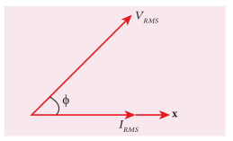
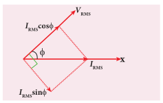

### 4.8.1 மாறுதிசை மின்னோட்டச் சுற்றுகளில் திறன் – அறிமுகம்

ஒரு சுற்றின் திறன் என்பது அச்சுற்றில் மின் ஆற்றல் நுகரப்படும் வீதம் என வரையறுக்கப்படுகிறது. அது மின்னழுத்த வேறுபாடு மற்றும் மின்னோட்டம் ஆகியவற்றின் பெருக்குத்தொகையால் குறிக்கப்படுகிறது. ஒரு மாறுதிசை மின்னோட்டச் சுற்றில் மின்னழுத்த வேறுபாடு மற்றும் மின்னோட்டம் நேரத்தைப் பொருத்து தொடர்ச்சியாக மாறுகின்றன. முதலில் ஒரு கணத்தில் உள்ள திறனை நாம் கணக்கிட்டு, பிறகு ஒரு முழுச்சுற்றுக்கு அதன் சராசரியை மதிப்பிடலாம்.

தொடர் மின்தூண்டி RLC சுற்றில், கணநேர மாறுதிசை மின்னழுத்த வேறுபாடு மற்றும் மின்னோட்டமானது

$$v = V_m \sin \omega t \quad \text{மற்றும்} \quad i = I_m \sin (\omega t + \phi)$$

இங்கு $\phi$ என்பது v மற்றும் i இடையே உள்ள கட்டக் கோணம் ஆகும். கணநேர திறனை (Instantaneous power) இவ்வாறு எழுதலாம்.

$$P = v i = V_m I_m \sin \omega t \sin (\omega t + \phi) = V_m I_m \sin \omega t [\sin \omega t \cos \phi + \cos \omega t \sin \phi]$$

$$P = V_m I_m [\cos \phi \sin^2 \omega t + \sin \omega t \cos \omega t \sin \phi] \qquad (4.54)$$

இங்கு ஒரு சுற்றுக்கான $\sin^2 \omega t$ இன் சராசரி $1/2$ ஆகும் மற்றும் $\sin \omega t \cos \omega t$ இன் சராசரி சுழியாகும். இந்த மதிப்புகளைப் பிரதியிட, ஒரு சுற்றுக்கான சராசரி திறனைப் பெறலாம்.

$$P_{av} = V_m I_m \cos \phi \times \frac{1}{2} = \frac{V_m}{\sqrt{2}} \frac{I_m}{\sqrt{2}} \cos \phi$$

$$P_{av} = V_{RMS} I_{RMS} \cos \phi \qquad (4.55)$$

இங்கு $V_{RMS} I_{RMS}$ என்பது தோற்றத் திறன் (Apparent power) எனப்படும். $\cos \phi$ என்பது திறன் காரணி (Power factor) ஆகும். ஒரு மாறுதிசை மின்னோட்டச் சுற்றின் சராசரி திறன் சுற்றின் உண்மைத் திறன் (True power) எனவும் அழைக்கப்படுகிறது.

**சிறப்பு நேர்வுகள்**

(i) மின்தடைப் பண்புள்ள சுற்றுக்கு, மின்னழுத்த வேறுபாடு மற்றும் மின்னோட்டம் இடையே உள்ள கட்டக் கோணம் சுழியாகும் மற்றும் $\cos \phi = 1$.

(ii) மின்தூண்டல் அல்லது மின்தேக்கிப் பண்புள்ள சுற்றுக்கு கட்டக் கோணமானது $\pm \pi/2$ மற்றும் $\cos (\pm \pi/2) = 0$.

(iii) தொடர் RLC சுற்றுக்கு கட்டக் கோணம் $\phi = \tan^{-1} \left( \frac{X_L - X_C}{R} \right)$

(iv) ஒத்திர்வில் உள்ள தொடர் RLC சுற்றுக்கு கட்டக் கோணம் சுழியாகும் மற்றும் $\cos 0^\circ = 1$. $\therefore P_{av} = V_{RMS} I_{RMS}$

### 4.8.2 சுழித்திறன் மின்னோட்டம் (Wattless current)

$V_{RMS}$ மற்றும் $I_{RMS}$ இடையே கட்டக் கோணம் $\phi$ கொண்ட ஒரு மாறுதிசை மின்னோட்டச் சுற்றைக் கருதுக. கட்ட விளக்கப்படத்தில் (படம் 4.50) காட்டியுள்ளவாறு மின்னழுத்த வேறுபாடானது மின்னோட்டத்தைவிட $\phi$ கோணம் முந்தி இருப்பதாகக் கொள்க.

படம் 4.50 $V_{RMS}$ ஆனது $I_{RMS}$ ஐ $\phi$ கட்டம் முந்திச் செல்கிறது

படம் 4.51 $I_{RMS}$ இன் கூறுகள்

தற்போது படம் 4.51 இல் காட்டியுள்ளவாறு $I_{RMS}$ ஆனது $V_{RMS}$ வழியே $I_{RMS} \cos \phi$ எனவும், $V_{RMS}$ க்கு குத்தாக $I_{RMS} \sin \phi$ எனவும் இரு செங்குத்துக் கூறுகளாக பகுக்கப்படுகிறது.

(i) மின்னழுத்த வேறுபாடுடன் ஒரே கட்டத்தில் உள்ள மின்னோட்டத்தின் கூறு ($I_{RMS} \cos \phi$) செயற்படு கூறு எனப்படுகிறது. இக்கூறினால் நுகரப்பட்ட திறன் = $V_{RMS} I_{RMS} \cos \phi$. எனவே இதை முழுத்திறன் கொண்ட மின்னோட்டம் (Wattful current) என அழைக்கப்படுகிறது.

(ii) மின்னழுத்த வேறுபாடுடன் கட்டக் கோணம் $90^\circ$ கொண்டுள்ள மற்றொரு கூறு ($I_{RMS} \sin \phi$) ஆனது மின்மறுப்புக்கூறு எனப்படுகிறது. இக்கூறினால் நுகரப்பட்ட திறன் சுழியாகும். எனவே இது ‘சுழித்திறன்’ மின்னோட்டம் (Wattless current) எனவும் அழைக்கப்படுகிறது.

ஒரு மாறுதிசை மின்னோட்டச் சுற்றில் நுகரப்பட்ட திறன் சுழியெனில், அந்தச் சுற்றில் பாயும் மின்னோட்டம் சுழித்திறன் மின்னோட்டம் என அழைக்கப்படுகிறது. இந்த சுழித்திறன் மின்னோட்டம் மின்தூண்டல் அல்லது மின்தேக்கி பண்புள்ள சுற்றில் நிகழ்கிறது.

### 4.8.3 திறன் காரணி (Power factor)

ஒரு சுற்றின் திறன் காரணி கீழ்க்கண்ட வழிகளில் வரையறுக்கப்படுகிறது.

(i) திறன் காரணி $= \cos \phi$ = முந்தி அல்லது பின்தங்கி உள்ள கட்டக் கோணத்தின் கொசைன் மதிப்பு

(ii) திறன் காரணி $= \frac{R}{Z}$ (மின்தடை / மின்னெதிர்ப்பு)

(iii) திறன் காரணி $= \frac{\text{உண்மைத் திறன்}}{\text{தோற்றத் திறன்}} = \frac{P_{av}}{V_{RMS} I_{RMS}}$

திறன் காரணிகளுக்கான சில எடுத்துக்காட்டுகள்:

(i) மின்தடைப் பண்புள்ள ஒரு சுற்றுக்கு திறன் காரணி $= \cos 0^\circ = 1$. ஏனெனில் மின்னழுத்த வேறுபாடு மற்றும் மின்னோட்டம் இடையே உள்ள கட்ட கோணம் சுழியாகும்.

(ii) மின்தூண்டல் அல்லது மின்தேக்கிப் பண்புள்ள ஒரு சுற்றுக்கு திறன் காரணி $= \cos (\pm \pi/2) = 0$. ஏனெனில் மின்னழுத்த வேறுபாடு மற்றும் மின்னோட்டம் இடையே உள்ள கட்ட கோணம் $\pm \pi/2$.

(iii) R, L மற்றும் C ஐ மாறுபட்ட விகிதங்களில் கொண்டுள்ள ஒரு சுற்றுக்கு திறன் காரணி 0 முதல் 1 வரை இருக்கும்.

### 4.8.4 நேர்த்திசை மின்னோட்டத்தை விட மாறுதிசை மின்னோட்டத்தின் நன்மைகள் மற்றும் குறைபாடுகள்

நேர்த்திசை மின்னோட்ட அமைப்பை விட மாறுதிசை மின்னோட்ட அமைப்பில் பல நன்மைகள் மற்றும் சில குறைபாடுகள் உள்ளன.

**நன்மைகள்:**

(i) நேர்த்திசை மின்னோட்டத்தை விட மாறுதிசை மின்னோட்ட உற்பத்திச் செலவு குறைவாகும்.
(ii) மாறுதிசை மின்னோட்டம் உயர் மின்னழுத்த வேறுபாட்டில் விநியோகிக்கப்பட்டால் அனுப்புகை இழப்புகள் நேர்த்திசை அனுப்புகையை ஒப்பிட குறைவானதாகும்.
(iii) திருத்திகளின் உதவியால் மாறுதிசை மின்னோட்டத்தை எளிதாக நேர்த்திசை மின்னோட்டமாக மாற்றலாம்.

**குறைபாடுகள்:**

(i) மாறுதிசை மின்னழுத்த வேறுபாடுகளை சில பயன்பாடுகளில் பயன்படுத்த இயலாது. உதாரணமாக மின்கலன்களை மின்னேற்றம் செய்தல், மின்முலாம் பூசுதல், மின் இழுவை போன்றவை.
(ii) உயர் மின்னழுத்த வேறுபாடுகளில் நேர்த்திசை மின்னோட்டத்தைக் காட்டிலும் மாறுதிசை மின்னோட்டத்துடன் வேலை செய்வது அதிக ஆபத்தானது.

**எடுத்துக்காட்டு 4.26**

400 kHz இல் ஒத்திரும் தொடர் RLC சுற்றானது $80 \mu H$ மின்தூண்டி, $2000 pF$ மின்தேக்கி மற்றும் $50 \Omega$ மின்தடை ஆகியவற்றைக் கொண்டுள்ளது.
(i) சுற்றின் Q – காரணி
(ii) மின்தூண்டல் எண் மதிப்பு இரு மடங்கானால், மின்தேக்குத்திறனின் புதிய மதிப்பு மற்றும்
(iii) Q – காரணியின் புதிய மதிப்பு ஆகியவற்றைக் கணக்கிடுக.

**தீர்வு:**

$L = 80 \times 10^{-6} H$; $C = 2000 \times 10^{-12} F$; $R = 50 \Omega$; $f_r = 400 \times 10^3 Hz$

(i) Q-காரணி, $Q = \frac{1}{R} \sqrt{\frac{L}{C}} = \frac{1}{50} \sqrt{\frac{80 \times 10^{-6}}{2000 \times 10^{-12}}} = \frac{1}{50} \sqrt{\frac{80}{2000} \times 10^{6}} = \frac{1}{50} \sqrt{4 \times 10^{4}} = \frac{1}{50} \times 200 = 4$

(ii) $L_2 = 2L = 2 \times 80 \times 10^{-6} H = 160 \times 10^{-6} H$,
$$C_2 = \frac{1}{4\pi^2 f_r^2 L_2} = \frac{1}{4 \times 3.14^2 \times (400 \times 10^3)^2 \times 160 \times 10^{-6}} = \frac{1}{4 \times 9.86 \times 16 \times 10^{10} \times 160 \times 10^{-6}} = \frac{1}{1009.66 \times 10^{4}} = 0.99 \times 10^{-4} \times 10^{-6}? \text{ Check calculation} $$

$$C_2 = \frac{1}{4 \times 3.14^2 \times (400 \times 10^3)^2 \times 160 \times 10^{-6}} = \frac{1}{4 \times 9.86 \times 16 \times 10^{10} \times 160 \times 10^{-6}} = \frac{1}{4 \times 9.86 \times 2560 \times 10^{4}} = \frac{1}{4 \times 9.86 \times 2560 \times 10^{4}} = \frac{1}{101,  ... } \text{ Let's do step by step: } $$
$$4\pi^2 = 4 \times (3.14)^2 = 4 \times 9.8596 = 39.4384$$
$$f_r^2 = (400 \times 10^3)^2 = 16 \times 10^{10}$$
$$L_2 = 160 \times 10^{-6}$$
$$4\pi^2 f_r^2 L_2 = 39.4384 \times 16 \times 10^{10} \times 160 \times 10^{-6} = 39.4384 \times 2560 \times 10^{4} = 100962.3 \times 10^{4} = 1.009623 \times 10^{9}$$
$$C_2 = \frac{1}{1.009623 \times 10^{9}} = 0.99 \times 10^{-9} F = 990 \times 10^{-12} F = 990 pF$$

(iii) $Q_2 = \frac{1}{R} \sqrt{\frac{L_2}{C_2}} = \frac{1}{50} \sqrt{\frac{160 \times 10^{-6}}{990 \times 10^{-12}}} = \frac{1}{50} \sqrt{\frac{160}{990} \times 10^{6}} = \frac{1}{50} \sqrt{0.1616 \times 10^{6}} = \frac{1}{50} \times 402 = 8.04$

**எடுத்துக்காட்டு 4.27**

$\frac{10^{-4}}{\pi} F$ மின்தேக்குத்திறன் கொண்ட மின்தேக்கி, $\frac{2}{\pi} H$ மின்தூண்டல் எண் கொண்ட மின்தூண்டி மற்றும் $100 \Omega$ மின்தடை கொண்ட மின்தடையாக்கி ஆகியவை இணைக்கப்பட்டு, ஒரு தொடர் RLC சுற்று உருவாக்கப்பட்டுள்ளது. $220 V$, $50 Hz$ உள்ள ஒரு மாறுதிசை மின்னோட்டம் சுற்றுக்கு அளிக்கப்பட்டால் (i) சுற்றின் மின்னெதிர்ப்பு (ii) சுற்றில் பாயும் மின்னோட்டத்தின் பெரும மதிப்பு (iii) சுற்றின் திறன் காரணி மற்றும் (iv) ஒத்திர்வில் சுற்றின் திறன் காரணி ஆகியவற்றைக் கணக்கிடுக.

**தீர்வு:**

$L = \frac{2}{\pi} H$; $C = \frac{10^{-4}}{\pi} F$; $R = 100 \Omega$; $V_{RMS} = 220 V$; $f = 50 Hz$

$X_L = 2\pi f L = 2\pi \times 50 \times \frac{2}{\pi} = 200 \Omega$
$X_C = \frac{1}{2\pi f C} = \frac{1}{2\pi \times 50 \times \frac{10^{-4}}{\pi}} = \frac{1}{2 \times 50 \times 10^{-4}} = \frac{1}{10^{-2}} = 100 \Omega$

(i) மின்னெதிர்ப்பு, $Z = \sqrt{R^2 + (X_L - X_C)^2} = \sqrt{100^2 + (200 - 100)^2} = \sqrt{10000 + 10000} = \sqrt{20000} = 141.4 \Omega$

(ii) மின்னோட்டத்தின் பெரும மதிப்பு,
$$I_m = \frac{V_m}{Z} = \frac{\sqrt{2} V_{RMS}}{Z} = \frac{\sqrt{2} \times 220}{141.4} = \frac{311.1}{141.4} = 2.2 A$$

(iii) சுற்றின் திறன் காரணி, $\cos \phi = \frac{R}{Z} = \frac{100}{141.4} = 0.707$

(iv) ஒத்திர்வில் திறன் காரணி, $\cos \phi = \frac{R}{Z} = \frac{R}{R} = 1$