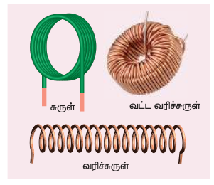
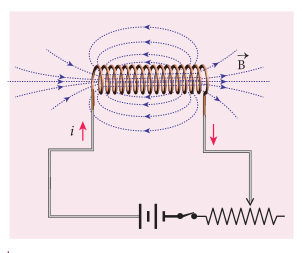
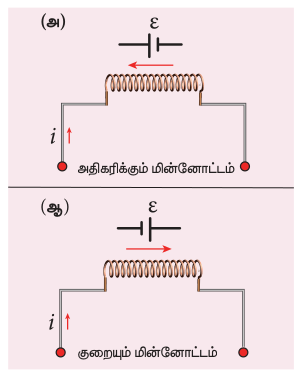
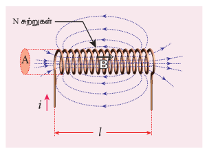
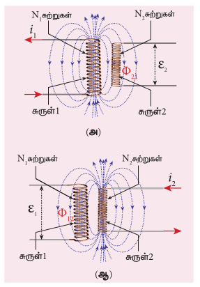
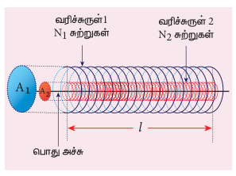
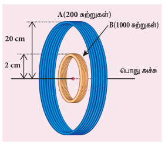

 ### 4.3.1 அறிமுகம்

படம் 4.17 மின்தூண்டிக்கான எடுத்துக்காட்டுகள்

மின்தூண்டி என்பது அதன் வழியாக மின்னோட்டம் பாயும்போது காந்தப்புலத்தில் ஆற்றலைச் சேமிக்க உதவும் ஒரு சாதனம் ஆகும். படம் 4.17 இல் காட்டியுள்ள கம்பிச்சுருள்கள், வரிச்சுருள்கள் மற்றும் வட்ட வரிச்சுருள்கள் ஆகியவை வழக்கமான எடுத்துக்காட்டுகள் ஆகும்.

மின்தூண்டல் என்பது ஒரு சுற்றில் பாயும் மின்னோட்ட மாற்றத்தின் காரணமாக (தன் மின்தூண்டல்) அல்லது அதனுடன் காந்தவியலாக தொடர்புள்ள அருகமை சுற்றில் பாயும் மின்னோட்ட மாற்றத்தின் காரணமாக (பரிமாற்று மின்தூண்டல்) மின்னியக்கு விசையை உருவாக்கும் மின்தூண்டிகளின் பண்பாகும். தன் மின்தூண்டல் மற்றும் பரிமாற்று மின்தூண்டல் பற்றி நாம் அடுத்த பகுதியில் கற்கலாம்.

**தன் மின்தூண்டல்**

படம் 4.18 தன் மின்தூண்டல்

ஒரு கம்பிச்சுருள் வழியே பாயும் மின்னோட்டம் அதனைச் சுற்றி ஒரு காந்தப்புலத்தை உருவாக்கும். எனவே, காந்தப்புலத்தின் காந்தப்பாயமானது அந்த கம்பிச்சுருளுடனையே தொடர்பு கொண்டிருக்கும். மின்னோட்டத்தை மாற்றுவதன் மூலம் இந்த பாயம் மாற்றப்பட்டால், அதே கம்பிச்சுருளில் ஒரு மின்னியக்கு விசை தூண்டப்படுகிறது (படம் 4.18). இந்த நிகழ்வு தன் மின்தூண்டல் எனப்படும். தூண்டப்பட்ட மின் இயக்கு விசையானது தன் மின்தூண்டப்பட்ட மின்னியக்கு விசை என அழைக்கப்படுகிறது.

N சுற்றுகள் கொண்ட கம்பிச்சுருளில் ஒவ்வொரு சுருளோடு தொடர்புடைய காந்தப்பாயம் $\Phi_B$ எனக்கொண்டால், கம்பிச்சுருளோடு தொடர்புடைய மொத்த காந்தப்பாயமானது ($N\Phi_B$, பாயத்தொடர்பு), கம்பிச்சுருளில் பாயும் மின்னோட்டத்திற்கு நேர்த்தகவில் உள்ளது.

$$N\Phi_B \propto i$$
$$N\Phi_B = Li \qquad (4.8)$$

(அல்லது) $L = \frac{N\Phi_B}{i}$

விகித மாறிலி L கம்பிச்சுருளின் தன் மின்தூண்டல் எண் அல்லது தன் மின்தூண்டல் குணகம் என அழைக்கப்படுகிறது. $i = 1A$ எனில், $L = N\Phi_B$. கம்பிச்சுருளின் தன் மின்தூண்டல் எண் அல்லது சுருக்கமாக மின்தூண்டல் என்பது 1A மின்னோட்டம் பாயும்போது அக்கம்பிச்சுருளில் ஏற்படும் பாயத்தொடர்பு எனப்படும்.

மின்னோட்டம் i நேரத்தைப் பொருத்து மாறினால், அதில் ஒரு மின்னியக்கு விசை தூண்டப்படுகிறது. பாரடேயின் மின்காந்தத்தூண்டல் விதியிலிருந்து இந்த கம்பிச்சுருளில் தன் மின்தூண்டப்பட்ட மின்னியக்கு விசையானது

$$\varepsilon = -\frac{d(N\Phi_B)}{dt} = -\frac{d(Li)}{dt} \quad (\text{சமன்பாடு 4.8 ஐ பயன்படுத்த})$$

$$\therefore \varepsilon = -L \frac{di}{dt} \qquad (4.9)$$

(அல்லது) $L = \frac{-\varepsilon}{di/dt}$

மேற்கண்ட சமன்பாட்டில் உள்ள எதிர்குறியானது தன் மின்தூண்டப்பட்ட மின்னியக்கு விசை நேரத்தைப் பொருத்து மின்னோட்டம் மாறுவதை எப்போதும் எதிர்க்கிறது என்பதை உணர்த்துகிறது. $di/dt = 1 A s^{-1}$, எனில் $L = -\varepsilon$. கம்பிச்சுருள் ஒன்றில் மின்னோட்டம் மாறும் வீதம் $1 A s^{-1}$ எனும் போது அக்கம்பிச்சுருளில் தூண்டப்படும் எதிர் மின்னியக்கு விசை கம்பிச்சுருளின் தன் மின்தூண்டல் எண் எனவும் வரையறுக்கப்படுகிறது.

**மின்தூண்டலின் அலகு**

மின்தூண்டல் ஒரு ஸ்கேலர் ஆகும். இதன் அலகு $Wb A^{-1}$ அல்லது $Vs A^{-1}$. இது ஹென்றி (H) எனவும் அளவிடப்படுகிறது.

$$1 H = 1 Wb A^{-1} = 1 Vs A^{-1}$$

மின்தூண்டலின் பரிமாண வாய்ப்பாடு $M L^2 T^{-2} A^{-2}$.

$i = 1A$ மற்றும் $N\Phi_B = 1$ வெபர்-சுற்றுகள் எனில், $L = 1H$.

எனவே, கம்பிச்சுருள் ஒன்றில் பாயும் 1A மின்னோட்டம் ஓரலகு பாயத்தொடர்பை உருவாக்கினால், அக்கம்பிச்சுருளின் தன் மின்தூண்டல் எண் ஒரு ஹென்றி ஆகும்.

$di/dt = 1A s^{-1}$ மற்றும் $\varepsilon = -1 V$ எனில், $L = 1 H$.

எனவே, கம்பிச்சுருள் ஒன்றில் மின்னோட்டம் மாறும் வீதம் $1 A s^{-1}$ எனும் போது, கம்பிச்சுருளில் தூண்டப்படும் எதிர் மின்னியக்கு விசை 1V என அமையுமானால் அக்கம்பிச்சுருளின் தன் மின்தூண்டல் எண் ஒரு ஹென்றி ஆகும்.

**மின்தூண்டலின் முக்கியத்துவம்**

11 ஆம் வகுப்பில் நாம் நிலைமம் பற்றி அறிந்துகொண்டோம். நேர்க்கோட்டு இயக்கத்தில் நேர்க்கோட்டு நிலைமத்தின் அளவாக நிறை உள்ளது. அதே வகையில் வட்ட இயக்கத்தில் சுழல் நிலைமத்தின் அளவாக நிலைமத்திருப்புத்திறன் உள்ளது (XI இயற்பியல் பாடப்புத்தகத்தில் பகுதிகள் 3.2.1 மற்றும் 5.4 ஐக் காண்க). பொதுவாக, நிலைமம் என்பது அதன் நிலையில் ஏற்படும் மாற்றத்தின் எதிர்ப்பு எனப்படுகிறது.

படம் 4.19 தூண்டப்படும் மின்னியக்கு விசை மாறும் மின்னோட்டத்தை எதிர்த்தல்

இயந்திரவியல் இயக்கத்தில் நிறை மற்றும் நிலைமத்திருப்புத்திறன் ஆற்றும் அதே பங்கினை ஒரு மின்சுற்றில் மின்தூண்டல் ஆற்றுகிறது. ஒரு சுற்று மூடப்பட்டால், அதிகரிக்கும் மின்னோட்டம் ஒரு மின்னியக்கு விசையைத் தூண்டுகிறது. இந்த மின்னியக்கு விசை சுற்றில் ஏற்படும் மின்னோட்ட அதிகரிப்பை எதிர்க்கிறது (படம் 4.19(அ)). இதேபோல் ஒரு சுற்று திறக்கப்பட்டால், குறையும் மின்னோட்டம் எதிர்த்திசையில் ஒரு மின்னியக்கு விசை தூண்டுகிறது. அது தற்போது மின்னோட்டம் குறைவதை எதிர்க்கிறது (படம் 4.19 (ஆ)).

இவ்வாறாக, கம்பிச்சுருளின் மின்தூண்டல் மின்னோட்டத்தில் ஏற்படும் எந்த மாற்றத்தையும் எதிர்த்து அதன் தொடக்க நிலையிலேயே பராமரிக்க முயலுகிறது. எனவே, இது மின்நிலைமம் எனவும் அழைக்கப்படுகிறது.

 ### 4.3.2 நீண்ட வரிச்சுருளின் தன் மின்தூண்டல் எண்

படம் 4.20 ஒரு நீண்ட வரிச்சுருளின் தன் மின்தூண்டல் எண்

l நீளமும் A குறுக்குவெட்டுப்பரப்பும் கொண்ட நீண்ட வரிச்சுரள் ஒன்றைக் கருதுக. வரிச்சுருளின் ஓரலகு நீளத்தில் உள்ள சுற்றுகளின் எண்ணிக்கை (அல்லது சுற்று அடர்த்தி) n என்க. வரிச்சுருளின் வழியே i என்ற மின்னோட்டம் பாயும்போது, சீரான காந்தப்புலம் ஒன்று வரிச்சுருளின் அச்சின் திசையில் உருவாகிறது (படம் 4.20). வரிச்சுருளினுள் எந்தவொரு புள்ளியிலும் உள்ள காந்தப்புலம் (பகுதி 3.9.3 ஐக் காண்க)

$$B = \mu_0 n i$$

வரிச்சுருளின் வழியே செல்லும் காந்தப்புலக் கோடுகள் ஒவ்வொரு சுற்றுடனும் தொடர்பு கொண்ட காந்தப்பாயம்

$$\Phi_B = \int_A \vec{B} \cdot d\vec{A} = BA \cos \theta = BA \quad (\therefore \theta = 0^\circ) = (\mu_0 n i) A$$

வரிச்சுருளின் N சுற்றுடன் தொடர்பு கொண்ட காந்தப்பாயம் அல்லது மொத்த காந்தப்பாயத் தொடர்பு (மொத்தச் சுற்றுகளின் எண்ணிக்கை N ஆனது $N = n l$)

$$N\Phi_B = (n l) (\mu_0 n i) A = (\mu_0 n^2 A l) i$$

நமக்குத் தெரியும் $N\Phi_B = Li$

மேற்கண்ட சமன்பாடுகளை ஒப்பிட

$$L = \mu_0 n^2 A l$$

மேற்கண்ட சமன்பாட்டிலிருந்து மின்தூண்டலானது வரிச்சுருளின் வடிவத்தையும் (சுற்று அடர்த்தி n, குறுக்கு வெட்டுப்பரப்பு A, நீளம் l) மற்றும் வரிச்சுருளினால் உள்ள ஊடகத்தையும் பொருத்து அமையும். $\mu_r$ ஒப்புமை உட்புகுதிறன் கொண்ட மின்காப்புப் பொருளால் வரிச்சுருள் நிரப்பப்பட்டால்,

$$L = \mu n^2 A l \quad \text{அல்லது} \quad L = \mu_r \mu_0 n^2 A l$$

**ஒரு மின்தூண்டியில் சேமிக்கப்பட்ட ஆற்றல்:**

சுற்று ஒன்றில் மின்னோட்டத்தைச் செலுத்தும் போது, மின்தூண்டலானது மின்னோட்டம் அதிகரிப்பதை எதிர்க்கிறது. எனவே சுற்றில் மின்னோட்டத்தை ஏற்படுத்துவதற்கு எதிர்ப்பு விசைக்கு எதிராக புறக்காரணிகள் மூலம் வேலை செய்யப்படுகிறது. இவ்வாறு செய்யப்பட்ட வேலை காந்த நிலை ஆற்றலாக சேமிக்கப்படுகிறது.

மின்தூண்டியின் மின்தடை புறக்கணிக்கத்தக்க அளவில் உள்ளதாகக் கொள்வோம். அதன் மின்தூண்டல் விளைவை மட்டும் கருதுவோம். எந்த ஒரு நேரம் t-இல் தூண்டப்பட்ட மின்னியக்கு விசை

$$e = -L \frac{di}{dt}$$

dq என்ற மின்னூட்டத்தை dt நேரத்தில் எதிர்ப்பு விசைக்கு எதிராக நகர்த்துவதற்கு செய்யப்படும் வேலை dW என்க.

$$dW = -e dq = -e i dt$$

சமன்பாடு (4.9) இல் இருந்து e மதிப்பைப் பிரதியிட

$$= -\left(-L \frac{di}{dt}\right) i dt = L i di$$

i என்ற மின்னோட்டத்தை ஏற்படுத்துவதற்கு செய்யப்பட்ட மொத்த வேலை

$$W = \int dW = \int_{0}^{i} L i di = L \left[ \frac{i^2}{2} \right]_{0}^{i} = \frac{1}{2} L i^2$$

செய்யப்பட்ட இந்த வேலை, காந்த நிலை ஆற்றலாக சேமிக்கப்படுகிறது.

$$\therefore U_B = \frac{1}{2} L i^2$$

ஆற்றல் அடர்த்தி என்பது வரிச்சுருளின் உள்ளே ஓரலகு பருமனில் சேமிக்கப்பட்ட ஆற்றல் ஆகும். அதன் மதிப்பு

$$u_B = \frac{U_B}{Al} \quad (\because \text{வரிச்சுருளின் பருமன்} = Al)$$

$$u_B = \frac{L i^2}{2Al} = \frac{(\mu_0 n^2 A l) i^2}{2Al} \quad (\because L = \mu_0 n^2 A l)$$

$$u_B = \frac{\mu_0 n^2 i^2}{2} = \frac{B^2}{2\mu_0} \quad (\because B = \mu_0 n i)$$

**எடுத்துக்காட்டு 4.10**

ஒப்புமை உட்புகுதிறன் 800 கொண்ட ஒரு இரும்பு உள்ளகத்தின் மீது 500 சுற்றுகள் கொண்ட வரிச்சுருள் ஒன்று சுற்றப்பட்டுள்ளது. வரிச்சுருளின் நீளம் மற்றும் ஆரம் முறையே 40 cm மற்றும் 3 cm ஆகும். வரிச்சுருளில் மின்னோட்டம் சுழியில் இருந்து 3Aக்கு 0.4 விநாடி நேரத்தில் மாறினால், அதில் தூண்டப்பட்ட சராசரி மின்னியக்கு விசையைக் கணக்கிடுக.

**தீர்வு:**

$N = 500$ சுற்றுகள்; $\mu_r = 800$; $l = 40 cm = 0.4 m$; $r = 3 cm = 0.03 m$; $di = 3 - 0 = 3 A$; $dt = 0.4 s$

தன் மின்தூண்டல் எண்

$$L = \mu n^2 A l \quad (\because \mu = \mu_r \mu_0, A = \pi r^2; n = \frac{N}{l})$$
$$= \frac{\mu_r \mu_0 N^2 \pi r^2}{l}$$
$$= \frac{4 \times 3.14 \times 10^{-7} \times 800 \times 500^2 \times 3.14 \times (3 \times 10^{-2})^2}{0.4}$$
$$L = 1.77 H$$

தூண்டப்பட்ட மின்னியக்கு விசை

$$\varepsilon = -L \frac{di}{dt} = -\frac{1.77 \times 3}{0.4} = -13.275 V$$

**எடுத்துக்காட்டு 4.11**

காற்று உள்ளகம் கொண்ட ஒரு வரிச்சுருளின் தன் மின்தூண்டல் எண் $4.8 mH$ ஆகும். அதன் உள்ளகம், இரும்பு உள்ளகமாக மாற்றப்பட்டால் அதன் தன் மின்தூண்டல் எண் $1.8 H$ ஆக மாறுகிறது. இரும்பின் ஒப்புமை உட்புகுதிறனைக் கணக்கிடுக.

**தீர்வு:**

$L_{\text{காற்று}} = 4.8 \times 10^{-3} H$; $L_{\text{இரும்பு}} = 1.8 H$

$L_{\text{காற்று}} = \mu_0 n^2 A l = 4.8 \times 10^{-3} H$

$L_{\text{இரும்பு}} = \mu n^2 A l = \mu_r \mu_0 n^2 A l = 1.8 H$

$$\therefore \mu_r = \frac{L_{\text{இரும்பு}}}{L_{\text{காற்று}}} = \frac{1.8}{4.8 \times 10^{-3}} = 375$$

 ### 4.3.3 பரிமாற்று மின்தூண்டல் (Mutual Induction)

படம் 4.21 பரிமாற்று மின்தூண்டல்

கம்பிச்சுருள் ஒன்றின் வழியே பாயும் மின்னோட்டம் நேரத்தைப் பொருத்து மாறினால், அதனருகில் உள்ள கம்பிச்சுருளில் மின்னியக்கு விசை தூண்டப்படுகிறது. இந்த நிகழ்வு பரிமாற்று மின்தூண்டல் எனப்படுகிறது. இந்த தூண்டப்பட்ட மின்னியக்கு விசை பரிமாற்று மின்தூண்டப்பட்ட மின்னியக்கு விசை எனப்படும்.

ஒன்றுக்கொன்று அருகில் வைக்கப்பட்ட இரு கம்பிச்சுருள்களைக் கருதுக. $i_1$ என்ற மின்னோட்டம் கம்பிச்சுருள் 1-இன் வழியே செல்லும்போது உருவாகும் காந்தப்புலமானது கம்பிச்சுருள் 2-லும் தொடர்பு கொள்கிறது (படம் 4.21 (அ)).

கம்பிச்சுருள் 1-ல் பாயும் மின்னோட்டம் காரணமாக கம்பிச்சுருள் 2-ன் ஒரு சுற்றுடன் தொடர்பு கொண்ட காந்தப்பாயம் $\Phi_{21}$ என்க. $N_2$ சுற்றுகள் கொண்ட கம்பிச்சுருள் 2-உடன் தொடர்பு கொண்ட மொத்த காந்தப்பாயமானது ($N_2 \Phi_{21}$), கம்பிச்சுருள் 1-இல் பாயும் மின்னோட்டத்திற்கு நேர்த்தகவில் உள்ளது.

$$N_2 \Phi_{21} \propto i_1$$
$$N_2 \Phi_{21} = M_{21} i_1$$
(அல்லது) $M_{21} = \frac{N_2 \Phi_{21}}{i_1}$

இங்கு விகிதமாறிலி $M_{21}$ என்பது கம்பிச்சுருள் 1-ஐச் சார்ந்து கம்பிச்சுருள் 2-இன் பரிமாற்று மின்தூண்டல் எண் அல்லது பரிமாற்று மின்தூண்டல் குணகம் என அழைக்கப்படுகிறது. $i_1 = 1 A$ எனில், $M_{21} = N_2 \Phi_{21}$. எனவே 1A மின்னோட்டம் கம்பிச்சுருள் 1-இல் பாயும்போது, கம்பிச்சுருள் 2-இல் ஏற்படும் பாயத்தொடர்பு பரிமாற்று மின்தூண்டல் எண் $M_{21}$ எனப்படும்.

மின்னோட்டம் $i_1$ ஆனது நேரத்தைப் பொருத்து மாறினால், கம்பிச்சுருள் 2-இல் ஒரு மின்னியக்கு விசை $\varepsilon_2$ தூண்டப்படுகிறது. பாரடேயின் மின்காந்தத்தூண்டல் விதிப்படி, இந்த பரிமாற்று மின் தூண்டப்பட்ட மின்னியக்கு விசை $\varepsilon_2$ ஆனது

$$\varepsilon_2 = -\frac{d(N_2 \Phi_{21})}{dt} = -\frac{d(M_{21} i_1)}{dt} = -M_{21} \frac{di_1}{dt}$$
(அல்லது) $M_{21} = -\frac{\varepsilon_2}{di_1/dt}$

மேற்கண்ட சமன்பாட்டில் உள்ள எதிர்க்குறியானது, பரிமாற்று மின்தூண்டப்பட்ட மின்னியக்கு விசை நேரத்தைப் பொருத்து மின்னோட்டம் $i_1$ மாறுவதை எப்போதும் எதிர்க்கிறது என்பதைக் காட்டுகிறது. $di_1/dt = 1 A s^{-1}$ எனில், $M_{21} = -\varepsilon_2$. கம்பிச்சுருள் 1-இல் மின்னோட்டம் மாறும் வீதம் $1 A s^{-1}$ எனும் போது கம்பிச்சுருள் 2-இல் தூண்டப்படும் எதிர் மின்னியக்கு விசை, பரிமாற்று மின்தூண்டல் எண் $M_{21}$ எனவும் வரையறுக்கப்படுகிறது.

இதுபோல் கம்பிச்சுருள் 2-இன் வழியே செல்லும் மின்னோட்டம் $i_2$ நேரத்தைப் பொருத்து மாறினால், கம்பிச்சுருள் 1-இல் மின்னியக்கு விசை $\varepsilon_1$ தூண்டப்படுகிறது. எனவே,

$$M_{12} = \frac{N_1 \Phi_{12}}{i_2} \quad \text{மற்றும்} \quad M_{12} = -\frac{\varepsilon_1}{di_2/dt}$$

இங்கு $M_{12}$ என்பது கம்பிச்சுருள் 2-ஐச் சார்ந்து கம்பிச்சுருள் 1-இன் பரிமாற்று மின்தூண்டல் எண் ஆகும். கொடுக்கப்பட்ட ஒரு சோடி கம்பிச்சுருள்களுக்கு பரிமாற்று மின்தூண்டல் எண் சமமாகும். அதாவது

$$M_{21} = M_{12} = M$$

பொதுவாக இரு கம்பிச்சுருள்களுக்கிடையே உள்ள பரிமாற்று மின்தூண்டலானது கம்பிச் சுருள்களின் அளவு, வடிவம், சுற்றுகளின் எண்ணிக்கை, அவற்றின் சார்பு அமைப்புமுறை மற்றும் ஊடகத்தின் உட்புகுதிறன் ஆகியவற்றைச் சார்ந்தது.

**பரிமாற்று மின்தூண்டல் எண்ணின் அலகு:**

பரிமாற்று மின்தூண்டல் எண்ணின் அலகும் ஹென்றி (H) ஆகும்.

$i_1 = 1 A$ மற்றும் $N_2 \Phi_{21} = 1$ வெபர்-சுற்றுகள் எனில், $M_{21} = 1 H$.

எனவே, கம்பிச்சுருள் ஒன்றில் பாயும் 1 A மின்னோட்டம் அருகில் உள்ள கம்பிச்சுருளில் ஓரலகு பாயத்தொடர்பை உருவாக்கினால், கம்பிச்சுருள்களுக்கு இடையிலான பரிமாற்று மின்தூண்டல் எண் ஒரு ஹென்றி ஆகும்.

$di_1/dt = 1 A s^{-1}$ மற்றும் $\varepsilon_2 = -1 V$ எனில், $M_{21} = 1 H$.

எனவே, கம்பிச்சுருள் ஒன்றில் மின்னோட்டம் மாறும் வீதம் $1 A s^{-1}$ எனும் போது அருகில் உள்ள கம்பிச்சுருளில் தூண்டப்படும் எதிர் மின்னியக்கு விசை 1V என அமையுமானால், கம்பிச்சுருள்களுக்கு இடையிலான பரிமாற்று மின்தூண்டல் எண் ஒரு ஹென்றி ஆகும்.

 ### 4.3.4 இரு நீண்ட பொது அச்சு கொண்ட வரிச்சுருள்களுக்கிடையே பரிமாற்று மின்தூண்டல் எண்

படம் 4.22 இரு நீண்ட பொது அச்சு கொண்ட வரிச்சுருள்களின் பரிமாற்று மின்தூண்டல்

சமநீளம் l கொண்ட இரண்டு பொது-அச்சு வரிச்சுருள்களைக் கருதுக. வரிச்சுருள்களின் ஆரங்களுடன் ஒப்பிடும் போது அவற்றின் நீளம் அதிகமாதலால், வரிச்சுருள்களுக்கு உட்புறம் உருவாகும் காந்தப்புலம் சீரானதாக அமையும். மேலும் முனைகளில் ஏற்படும் சீரற்ற காந்தப்புல விளைவு (fringing effect) புறக்கணிக்கத்தக்கது எனக்கொள்வோம். படம் 4.22 இல் காட்டியுள்ளவாறு $A_1$ மற்றும் $A_2$ என்பன வரிச்சுருள்களின் குறுக்குவெட்டுப்பரப்புகள் என்க. $A_2$ -ஐ விட $A_1$ பெரியது என்போம். இவற்றின் சுற்று அடர்த்திகள் முறையே $n_1$ மற்றும் $n_2$ ஆகும்.

வரிச்சுருள் 1-இன் வழியே பாயும் மின்னோட்டம் $i_1$ என்க. அதனுள் உருவாகும் காந்தப்புலம் $B_1 = \mu_0 n_1 i_1$

வரிச்சுருள் 2-இன் பரப்பு வழியே செல்லும் $\vec{B}_1$ -இன் காந்தப்புலக் கோடுகள் அதன் ஒவ்வொரு சுற்றுடனும் தொடர்பு கொள்கிறது. வரிச்சுருள் 2-இல் ஒரு சுற்றுடன் தொடர்பு கொண்ட காந்தப்பாயம்

$$\Phi_{21} = \int_{A_2} \vec{B}_1 \cdot d\vec{A} = B_1 A_2 \quad (\text{ஏனெனில் } \theta = 0^\circ) = (\mu_0 n_1 i_1) A_2$$

வரிச்சுருள் 2-இல் உள்ள $N_2$ சுற்றுடன் தொடர்பு கொண்ட காந்தப்பாயம் அல்லது மொத்த காந்தப்பாயத் தொடர்பு

$$N_2 \Phi_{21} = (n_2 l) (\mu_0 n_1 i_1) A_2 \quad (\because N_2 = n_2 l)$$
$$= (\mu_0 n_1 n_2 A_2 l) i_1$$

நமக்குத் தெரியும் $N_2 \Phi_{21} = M_{21} i_1$. மேற்கண்ட சமன்பாடுகளை ஒப்பிட

$$M_{21} = \mu_0 n_1 n_2 A_2 l \qquad (4.13)$$

இதுவே வரிச்சுருள் 1-ஐப் பொருத்து வரிச்சுருள் 2-இன் பரிமாற்று மின்தூண்டல் எண்ணிற்கான ($M_{21}$) கோவை ஆகும். இதுபோன்றே கீழ்கண்டவாறு வரிச்சுருள் 2-ஐப் பொருத்து வரிச்சுருள் 1-இன் பரிமாற்று மின்தூண்டல் எண் $M_{12}$-ஐக் காணலாம்.

வரிச்சுருள் 2-இன் வழியே பாயும் மின்னோட்டம் $i_2$ எனில், அதனுள் உருவாக்கும் காந்தப்புலம் $B_2 = \mu_0 n_2 i_2$

இந்த காந்தப்புலம் $B_2$ வரிச்சுருள் 2–ன் உள்புறம் சீராகவும், வெளிப்புறம் ஏறக்குறைய சுழியாகவும் இருக்கும். எனவே, வரிச்சுருள் 1–இல் காந்தப்புலம் $B_2$ உள்ள விளைவுப்பரப்பு (effective area) $A_2$ ஆகும். பரப்பு $A_1$ அல்ல. வரிச்சுருள் 1-இல் ஒரு சுற்றுடன் தொடர்பு கொண்ட காந்தப்பாயம்

$$\Phi_{12} = \int_{A_2} \vec{B}_2 \cdot d\vec{A} = B_2 A_2 = (\mu_0 n_2 i_2) A_2$$

வரிச்சுருள் 1-இல் உள்ள $N_1$ சுற்றுடன் தொடர்பு கொண்ட காந்தப்பாயம் அல்லது மொத்த காந்தப்பாயத் தொடர்பு

$$N_1 \Phi_{12} = (n_1 l) (\mu_0 n_2 i_2) A_2 \quad (\because N_1 = n_1 l)$$
$$= (\mu_0 n_1 n_2 A_2 l) i_2$$

$\because N_1 \Phi_{12} = M_{12} i_2$ என்பதால், நாம் பெறுவது

$$\therefore M_{12} = \mu_0 n_1 n_2 A_2 l \qquad (4.14)$$

சமன்பாடு (4.13) மற்றும் (4.14) இல் இருந்து நாம் இவ்வாறு எழுதலாம்.

$$M_{12} = M_{21} = M \qquad (4.15)$$

பொதுவாக இரு நீண்ட பொது-அச்சு வரிச்சுருள்களுக்கு இடையேயான பரிமாற்று மின்தூண்டல் எண் ஆனது

$$M = \mu_0 n_1 n_2 A_2 l \qquad (4.16)$$

ஒப்புமை உட்புகுதிறன் $\mu_r$ கொண்ட மின்காப்பு ஊடகம் வரிச்சுருள்களுக்கு உட்புறம் இருந்தால்,

$$M = \mu n_1 n_2 A_2 l \quad (\text{அல்லது}) \quad M = \mu_r \mu_0 n_1 n_2 A_2 l$$

**எடுத்துக்காட்டு 4.12**

முதலாவது கம்பிச்சுருளில் பாயும் மின்னோட்டம் 2 A இல் இருந்து 10 A ஆக 0.4 விநாடியில் மாறுகிறது. இரண்டாவது கம்பிச்சுருளில் 60 mV மின்னியக்கு விசை தூண்டப்பட்டால், இரு கம்பிச்சுருள்களுக்கு இடையே உள்ள பரிமாற்று மின்தூண்டல் எண்ணைக் காண்க. மேலும் முதலாவது கம்பிச்சுருளில் பாயும் மின்னோட்டம் 4 A இல் இருந்து 16 A ஆக 0.03 விநாடியில் மாறும்போது, இரண்டாவது கம்பிச்சுருளில் தூண்டப்பட்ட மின்னியக்கு விசையைக் கணக்கிடுக. தூண்டப்பட்ட மின்னியக்கு விசையின் எண்மதிப்பை மட்டும் கருதுக.

**தீர்வு:**

நேர்வு (i) : $di = 10 - 2 = 8 A$; $dt = 0.4 s$; $\varepsilon_2 = 60 \times 10^{-3} V$

நேர்வு (ii) : $di = 16 - 4 = 12 A$; $dt = 0.03 s$

(i) கம்பிச்சுருள்கள் இடையேயான பரிமாற்று மின்தூண்டல் எண்
$$M = \frac{\varepsilon_2}{di/dt} = \frac{60 \times 10^{-3}}{8/0.4} = \frac{60 \times 10^{-3}}{20} = 3 \times 10^{-3} H = 3 mH$$

(ii) முதல் கம்பிச்சுருளில் மின்னோட்டம் மாறும் வீதத்தால் இரண்டாவது கம்பிச்சுருளில் தூண்டப்பட்ட மின்னியக்கு விசை
$$\varepsilon_2 = M \frac{di}{dt} = 3 \times 10^{-3} \times \frac{12}{0.03} = 3 \times 10^{-3} \times 400 = 1.2 V$$

**எடுத்துக்காட்டு 4.13**

படத்தில் காட்டியுள்ளவாறு, இரண்டு ஒரு-தள, பொது-அச்சு கொண்ட வட்ட கம்பிச்சுருள்கள் A மற்றும் B-ஐக் கருதுக. கம்பிச்சுருள் A-இன் ஆரம் 20 cm மற்றும் கம்பிச்சுருள் B-இன் ஆரம் 2 cm ஆகும். கம்பிச்சுருள்கள் A மற்றும் B-இல் உள்ள சுற்றுகள் முறையே 200 மற்றும் 1000 ஆகும். கம்பிச்சுருள்கள் இடையேயான மின்தூண்டல் எண்ணைக் கணக்கிடுக. கம்பிச்சுருள் A-இல் உள்ள மின்னோட்டம் 2 A இல் இருந்து 6 A ஆக 0.04 விநாடியில் மாறினால், கம்பிச்சுருள் B-இல் தூண்டப்பட்ட மின்னியக்கு விசை மற்றும் அந்தக் கணத்தில் கம்பிச்சுருள் B வழியேயான காந்தப்பாயம் மாறும் வீதம் ஆகியவற்றைக் கணக்கிடுக.

**தீர்வு:**

$N_A = 200$ சுற்றுகள்; $N_B = 1000$ சுற்றுகள்; $r_A = 20 \times 10^{-2} m$; $r_B = 2 \times 10^{-2} m$; $dt = 0.04 s$; $di_A = 6-2 = 4 A$

கம்பிச்சுருள் A-இல் பாயும் மின்னோட்டம் $i_A$ என்க. வட்ட கம்பிச்சுருள் A-இன் மையத்தில் உள்ள காந்தப்புலம் $B_A$ ஆனது

$$B_A = \frac{\mu_0 N_A i_A}{2 r_A} = \frac{4\pi \times 10^{-7} N_A i_A}{2 r_A} = \frac{2 \times 3.14 \times 10^{-7} \times 200}{20 \times 10^{-2}} i_A = 6.28 \times 10^{-4} i_A Wb m^{-2}$$

கம்பிச்சுருள் B-இன் காந்தப்பாயத்தொடர்பு

$$N_B \Phi_B = N_B B_A A_B = 1000 \times 6.28 \times 10^{-4} \times i_A \times 3.14 \times (2 \times 10^{-2})^2 = 7.89 \times 10^{-4} i_A \text{ Wb turns}$$

கம்பிச்சுருள்கள் இடையேயான பரிமாற்று மின்தூண்டல் எண்

$$M = \frac{N_B \Phi_B}{i_A} = 7.89 \times 10^{-4} H$$

தூண்டப்பட்ட மின்னியக்கு விசையின் எண் மதிப்பானது

$$\varepsilon_B = M \frac{di_A}{dt} = 7.89 \times 10^{-4} \times \frac{(6-2)}{0.04} = 7.89 \times 10^{-4} \times 100 = 78.9 \text{ mV}$$

கம்பிச்சுருள் B-இல் காந்தப்பாயம் மாறும் வீதம்

$$\frac{d(N_B \Phi_B)}{dt} = \varepsilon_B = 78.9 \text{ mWb s}^{-1}$$