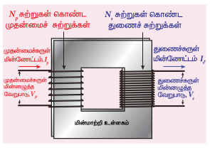
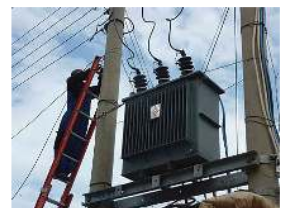
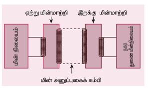
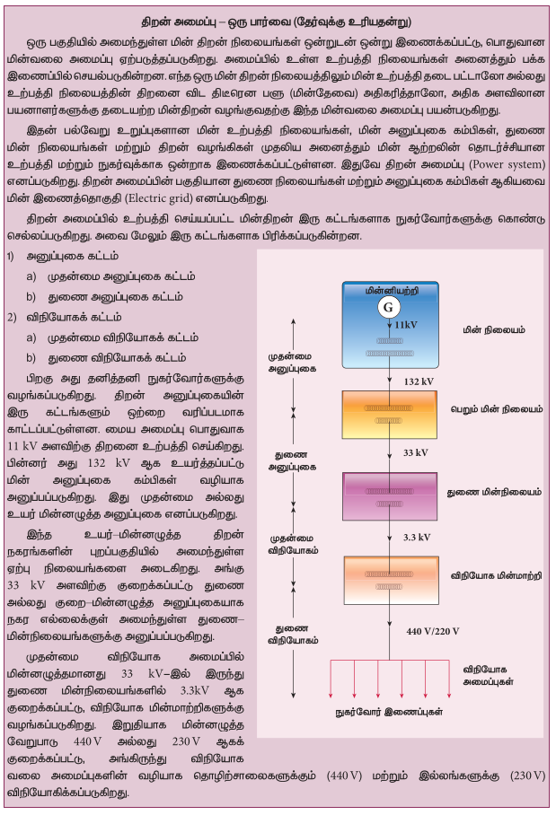

மின்மாற்றி என்பது ஒரு சுற்றிலிருந்து மற்றொன்றிற்கு மின்திறனை அதன் அதிர்வெண் மாறாமல் மாற்றுவதற்குப் பயன்படும் கருவியாகும். இதில் கொடுக்கப்பட்ட மாறுதிசை மின்னழுத்த வேறுபாடு அதிகரிக்கிறது அல்லது குறைகிறது மற்றும் தொடர்புடைய சுற்றின் மின்னோட்டத்தை குறைத்தோ அல்லது அதிகரித்தோ இது நிகழ்கிறது.

குறைந்த மின்னழுத்த வேறுபாடு கொண்ட மாறுதிசை மின்னோட்டத்தை அதிக மின்னழுத்த வேறுபாடு கொண்ட மின்னோட்டமாக மாற்றினால், அது ஏற்று மின்மாற்றி எனப்படும். மாறாக, மின்மாற்றியானது அதிக மின்னழுத்த வேறுபாடு கொண்ட மாறுதிசை மின்னோட்டத்தை குறைந்த மின்னழுத்த வேறுபாடு கொண்ட மாறுதிசை மின்னோட்டமாக மாற்றினால் அது இறக்கு மின்மாற்றி எனப்படும்.

### 4.6.1 மின்மாற்றியின் அமைப்பு மற்றும் செயல்பாடு

**தத்துவம்**

படம் 4.32 (அ) மின்மாற்றியின் அமைப்பு

படம் 4.32 (ஆ) சாலையோர மின்மாற்றி

மின்மாற்றியின் தத்துவமானது இரு கம்பிச்சுருள்களுக்கு இடையே உள்ள பரிமாற்று மின்தூண்டல் ஆகும். அதாவது ஒரு கம்பிச்சுருளின் வழியே பாயும் மின்னோட்டம் நேரத்தைப் பொருத்து மாறினால், அதனருகில் உள்ள கம்பிச்சுருளில் மின்னியக்கு விசை தூண்டப்படுகிறது.

**அமைப்பு**

மின்மாற்றிகளின் எளிமையான அமைப்பில், மின்மாற்றி உள்ளகத்தின் மீது அதிக பரிமாற்று மின்தூண்டல் என்ற கொண்ட இரு கம்பிச்சுருள்கள் சுற்றப்பட்டுள்ளன. பொதுவாக, உள்ளகமானது சிலிக்கான் எஃகு போன்ற நல்ல காந்தப்பொருளினால் செய்யப்பட்ட மெல்லிய தகடுகளால் கட்டமைக்கப்பட்டுள்ளது. கம்பிச்சுருள்கள் மின்னியலாக காப்பிடப்பட்டிருந்தாலும், உள்ளகம் மூலம் காந்தவியலாக இணைக்கப்பட்டுள்ளன (படம் 4.32 (அ)).

மாறுதிசை மின்னழுத்த வேறுபாடு அளிக்கப்படும் கம்பிச்சுருள் முதன்மைச்சுருள் P எனப்படும். வெளியீடு திறன் எடுக்கப்படும் கம்பிச்சுருள் துணைச்சுருள் S எனப்படும்.

கட்டமைக்கப்பட்ட உள்ளகம் மற்றும் கம்பிச்சுருள்கள் ஆகியவை சிறப்பான மின்காப்பு மற்றும் குளிர்ச்சியை தரத்தகுந்த ஊடகத்தால் நிரப்பப்பட்ட கொள்கலனில் வைக்கப்பட்டுள்ளன.

**செயல்பாடு**

முதன்மைச்சுருளானது மாறுதிசை மின்னழுத்த மூலத்துடன் இணைக்கப்பட்டால், மெல்லிய தகடுகளால் ஆன உள்ளகத்துடன் தொடர்பு கொண்ட காந்தப்பாயம் மாறுகிறது. காந்தப்பாயக் கசிவு இல்லையென்றால், முதன்மைச்சுருளோடு தொடர்புடைய காந்தப்பாயம் முழுவதும் துணைச்சுருளோடும் தொடர்பில் இருக்கும். இதன் பொருள் ஒரு சுற்று வழியே செல்லும் காந்தப்பாயம் மாறும் வீதம், முதன்மைச்சுருள் மற்றும் துணைச்சுருளுக்கு ஒரே அளவாக உள்ளது.

பாயமாற்றத்தின் விளைவாக, முதன்மைச்சுருள் மற்றும் துணைச்சுருள் இரண்டிலும் மின்னியக்கு விசை தூண்டப்படுகிறது. முதன்மைச்சுருளில் தூண்டப்படும் மின்னியக்கு விசை அல்லது பின்னோக்கிய மின்னியக்கு விசை $\varepsilon_p$ பின்வரும் சமன்பாட்டால் தரப்படுகிறது.

$$\varepsilon_p = -N_p \frac{d\Phi_B}{dt}$$

முதன்மைச்சுருளுக்கு அளிக்கப்படும் மின்னழுத்த வேறுபாடு $v_p$ ஆனது பின்னோக்கிய மின்னியக்கு விசைக்கு சமமாகும். எனவே

$$v_p = -N_p \frac{d\Phi_B}{dt} \qquad (4.24)$$

உள்ளகத்தில் உள்ள மாறுதிசை காந்தப்பாயத்தின் அதிர்வெண் அளிக்கப்பட்ட மின்னழுத்த வேறுபாட்டின் அதிர்வெண்ணுக்கு சமமாகும். எனவே துணைச்சுருளில் தூண்டப்பட்ட மின்னியக்கு விசையும் அளிக்கப்பட்ட மின்னழுத்த வேறுபாட்டின் அதிர்வெண்ணையே கொண்டிருக்கும். துணைச்சுருளில் தூண்டப்படும் மின்னியக்கு விசை $\varepsilon_s$ பின்வருமாறு:

$$\varepsilon_s = -N_s \frac{d\Phi_B}{dt}$$

இங்கு $N_p$ மற்றும் $N_s$ என்பவை முறையே முதன்மைச்சுருள் மற்றும் துணைச்சுருள்களில் உள்ள சுற்றுகளின் எண்ணிக்கை ஆகும். துணைச்சுற்று திறந்த நிலையில் இருந்தால், $\varepsilon_s = v_s$. இங்கு $v_s$ என்பது துணைச்சுருள் இடையே உள்ள மின்னழுத்த வேறுபாடு ஆகும்.

$$v_s = -N_s \frac{d\Phi_B}{dt} \qquad (4.25)$$

சமன்பாடுகள் (4.24) மற்றும் (4.25) – இல் இருந்து,

$$\frac{v_s}{v_p} = \frac{N_s}{N_p} = K \qquad (4.26)$$

இங்கு மாறிலி K ஆனது மின்னழுத்த மாற்ற விகிதம் எனப்படும். ஒரு இலட்சிய மின்மாற்றிக்கு

உள்ளீடு திறன் $v_p i_p$ = வெளியீடு திறன் $v_s i_s$

இங்கு $i_p$ மற்றும் $i_s$ என்பவை முறையே முதன்மைச்சுருள் மற்றும் துணைச்சுருளில் உள்ள மின்னோட்டம் ஆகும். எனவே,

$$\frac{v_s}{v_p} = \frac{N_s}{N_p} = \frac{i_p}{i_s} \qquad (4.27)$$

சமன்பாடு 4.27-இல் உள்ள அளவுகளை அவற்றின் பெரும மதிப்புகளில் எழுதினால்

$$\frac{V_s}{V_p} = \frac{N_s}{N_p} = \frac{I_p}{I_s} = K$$

i) $N_s > N_p$ ($K > 1$) எனில், $V_s > V_p$ மற்றும் $I_s < I_p$ ஆகும். இந்த நேர்வு ஏற்று மின்மாற்றி ஆகும். இதில் மின்னழுத்த வேறுபாடு அதிகரிக்கிறது மற்றும் தொடர்புடைய மின்னோட்டம் குறைகிறது.

ii) $N_s < N_p$ ($K < 1$) எனில், $V_s < V_p$ மற்றும் $I_s > I_p$ ஆகும். இது இறக்கு மின்மாற்றி ஆகும். இதில் மின்னழுத்த வேறுபாடு குறைகிறது மற்றும் தொடர்புடைய மின்னோட்டம் அதிகரிக்கிறது.

**மின்மாற்றியின் பயனுறுதிறன் (Efficiency of a transformer):**

மின்மாற்றியின் பயனுறுதிறன் $\eta$ என்பது பயனுள்ள வெளியீடு திறனுக்கும் உள்ளீடு திறனுக்கும் உள்ள தகவு என வரையறுக்கப்படுகிறது.

$$\eta = \frac{\text{வெளியீடு திறன்}}{\text{உள்ளீடு திறன்}} \times 100\% \qquad (4.28)$$

மின்மாற்றிகள் அதிக பயனுறு திறன் கொண்ட கருவிகள் ஆகும். $96 - 99\%$ என்ற வரம்பில் இவற்றின் பயனுறு திறன் அமையும். மின்மாற்றிகளில் உள்ள பல்வேறு ஆற்றல் இழப்புகள், அவற்றை $100\%$ பயனுறு திறன் கொண்டதாக இருக்க அனுமதிக்காது.

### 4.6.2 மின்மாற்றியில் ஏற்படும் ஆற்றல் இழப்புகள்

மின்மாற்றிகளில் இயங்கும் பாகங்கள் ஏதும் இல்லை என்பதால் அவற்றின் பயனுறுதிறன், சுழலும் இயந்திரங்களான மின்னியற்றிகள் மற்றும் மின்மோட்டார்களை விட அதிகமாக இருக்கும். இருந்தபோதிலும் மின்மாற்றியில் ஆற்றல் இழப்பை ஏற்படுத்தும் பல காரணிகள் உள்ளன. அவற்றில் சில பின்வருமாறு.

**i) உள்ளக இழப்பு அல்லது இரும்பு இழப்பு**

இந்த இழப்பு மின்மாற்றியின் உள்ளகத்தில் ஏற்படுகிறது. காந்தத்தயக்க இழப்பு (பகுதி 3.6 ஐக் காண்க) மற்றும் சுழல் மின்னோட்ட இழப்பு ஆகியவை உள்ளக இழப்பு அல்லது இரும்பு இழப்பு எனப்படும். முதன்மைச்சுருளில் அளிக்கப்படும் மாறுதிசை மின்னழுத்த வேறுபாட்டால் மின்மாற்றி உள்ளகம் திரும்பத்திரும்ப காந்தமாக்கப்பட்டும் மற்றும் காந்தநீக்கம் செய்யப்படும்போது, காந்தத் தயக்கம் ஏற்படுகிறது. அதனால் குறிப்பிட்ட அளவு ஆற்றல் இழப்பு வெப்ப வடிவில் ஏற்படுகிறது. அதிக சிலிக்கான் கொண்ட எஃகினால் மின்மாற்றியின் உள்ளகத்தை செய்வதன் மூலம் காந்தத்தயக்க இழப்பானது சிறுமமாக குறைக்கப்படுகிறது.

உள்ளகத்தில் மாறுகின்ற காந்தப்பாயம், அதில் சுழல் மின்னோட்டத்தை தூண்டுகிறது. எனவே சுழல் மின்னோட்டம் பாய்வதால் ஏற்படும் ஆற்றல் இழப்பு, சுழல் மின்னோட்ட இழப்பு எனப்படும். மெல்லிய தகடுகளால் உள்ளகம் செய்யப்படுவதன் மூலம் இது சிறுமமாக குறைக்கப்படுகிறது.

**ii) தாமிர இழப்பு**

மின்மாற்றியின் கம்பிச்சுற்றுகளுக்கு மின்தடை உள்ளது. அவற்றின் வழியே மின்னோட்டம் பாயும்போது, ஜூல் வெப்ப விளைவினால் குறிப்பிட்ட அளவிலான வெப்ப ஆற்றல் வெளிவிடப்படுகிறது. இந்த ஆற்றல் இழப்பு தாமிர இழப்பு எனப்படும். அதிக விட்டம் கொண்ட கம்பிகளைப் பயன்படுத்தி இது குறைக்கப்படுகிறது.

**iii) பாயக் கசிவு**

முதன்மைச்சுருளின் காந்தப்புலக் கோடுகள் துணைச்சுருளோடு முழுமையாக தொடர்பு கொள்ளாத போது பாயக் கசிவு ஏற்படுகிறது. கம்பிச்சுருள் சுற்றுகளை ஒன்றின் மீது ஒன்றாக சுற்றுவதன் மூலம் பாயக் கசிவினால் ஏற்படும் ஆற்றல் இழப்பானது குறைக்கப்படுகிறது.

### 4.6.3 நீண்ட தொலைவு மின்திறன் அனுப்புகையில் மாறுதிசை மின்னோட்டத்தின் நன்மைகள்

மின்திறன் பெருமளவில் AC மின்னியற்றியை பயன்படுத்தி, மின்திறன் நிலையங்களில் உற்பத்தி செய்யப்படுகிறது. பயன்படுத்தப்படும் எரிபொருள் வகையைப் பொருத்து இந்த மின்திறன் நிலையங்கள் அனல், நீர் மற்றும் அணு மின்நிலையங்கள் என வகைப்படுத்தப்படுகின்றன. பெரும்பாலான மின்நிலையங்கள் தொலைதூர இடங்களில் அமைந்துள்ளன. எனவே, உற்பத்தி செய்யப்படும் மின்திறனானது அவை நுகரப்படும் நகரங்கள் மற்றும் பெருநகரங்களை அடைய நீண்ட தொலைவுகளுக்கு அனுப்புகை கம்பிகள் வழியாக அனுப்பப்படுகிறது. இந்த செயல்முறை மின்திறன் அனுப்புகை எனப்படுகிறது.

ஆனால் திறன் அனுப்புகையில் ஒரு சிரமம் உள்ளது. சில நூறு கிலோமீட்டர் நீளம் உள்ள அனுப்புகை கம்பிகளில் ஏற்படும் ஜூல் வெப்ப விளைவினால் ($I^2 R$) ஒரு குறிப்பிடத்தக்க அளவிலான மின்திறன் இழப்பு ஏற்படுகிற다. இந்த திறன் இழப்பை i என்ற மின்னோட்டத்தை குறைப்பதாலோ அல்லது மின் அனுப்புகைக் கம்பிகளின் மின்தடை R ஐக் குறைப்பதாலோ சமாளிக்கலாம். மின்தடை R-ஐ தடிமனான தாமிரம் அல்லது அலுமினிய கம்பிகளைக் கொண்டு குறைக்கலாம். ஆனால், இது அனுப்புகை கம்பிகளின் உற்பத்தி விலை மற்றும் தொடர்புடைய செலவீனங்களை அதிகரிக்கிறது. எனவே இந்த வகையில் திறன் இழப்பைக் குறைக்கும் முறை பொருளாதார ரீதியாக சாத்தியமில்லை.

உற்பத்தி செய்யப்பட்ட திறன் மாறுதிசைப் பண்பு கொண்டதால், ஒரு வழி உள்ளது. மின்மாற்றிகளைக் கொண்டு, மாறுதிசை மின்னழுத்த வேறுபாட்டை உயர்த்தவோ அல்லது குறைக்கவோ முடியும். மாறுதிசை மின்னழுத்த வேறுபாட்டின் மிக முக்கியமான இந்தப் பண்பைப் பயன்படுத்தி, மின்னோட்டத்தை குறைத்து திறன் இழப்பை பெரும் அளவில் குறைக்கலாம்.

படம் 4.33 நீண்ட தொலைவிற்கான மின்திறன் அனுப்புகை

அனுப்பும் இடத்தில் ஏற்று மின்மாற்றியைப் பயன்படுத்தி மின்னழுத்த வேறுபாடு உயர்த்தப்படுகிறது மற்றும் தொடர்புடைய மின்னோட்டம் குறைக்கப்படுகிறது (படம் 4.33). பிறகு அது மின் அனுப்புகை கம்பிகள் மூலம் அனுப்பப்படுகிறது. இந்த அதிக மின்னழுத்த வேறுபாட்டில் உள்ள குறைக்கப்பட்ட மின்னோட்டமானது, எவ்வித கணிசமான இழப்பும் இன்றி சேரும் இடத்தை சென்றடைகிறது. ஏற்கப்படும் இடத்தில் இறக்கு மின்மாற்றியைப் பயன்படுத்தி மின்னழுத்த வேறுபாடு குறைக்கப்படுகிறது மற்றும் மின்னோட்டம் தகுந்த அளவுகளுக்கு உயர்த்தப்படுகிறது. பிறகு நுகர்வோர்களுக்கு விநியோகிக்கப்படுகிறது. இவ்வாறு மின்திறன் அனுப்புகை திறமையாகவும், சிக்கனமாகவும் செய்யப்படுகிறது.

**விளக்கம்:**

இரு வேறுபட்ட மின்னழுத்த வேறுபாட்டில், 2 MW மின்திறனானது மொத்த மின்தடை $R = 40 \Omega$ கொண்ட மின் அனுப்புகை கம்பிகள் வழியாக ஓரிடத்திற்கு அனுப்பப்படுகிறது. ஒன்று குறைவான மின்னழுத்த வேறுபாடு (10 kV) மற்றும் மற்றொன்று உயர் மின்னழுத்த வேறுபாடு (100 kV). இந்த இரு நேர்வுகளிலும் உள்ள திறன் இழப்புகளை தற்போது நாம் கணக்கிட்டு, பின் ஒப்பிடுவோம்.

**நேர்வு (i):** $P = 2 MW$; $R = 40 \Omega$; $V = 10 kV$

திறன், $P = VI \implies$ மின்னோட்டம், $I = \frac{P}{V} = \frac{2 \times 10^6}{10 \times 10^3} = 200 A$

திறன் இழப்பு = உருவாக்கப்பட்ட வெப்பம் $= I^2 R = (200)^2 \times 40 = 1.6 \times 10^6 W$

திறன் இழப்பு $\% = \frac{1.6 \times 10^6}{2 \times 10^6} \times 100\% = 0.8 \times 100\% = 80\%$

**நேர்வு (ii):** $P = 2 MW$; $R = 40 \Omega$; $V = 100 kV$

மின்னோட்டம், $I = \frac{P}{V} = \frac{2 \times 10^6}{100 \times 10^3} = 20 A$

திறன் இழப்பு $= I^2 R = (20)^2 \times 40 = 0.016 \times 10^6 W$

திறன் இழப்பு $\% = \frac{0.016 \times 10^6}{2 \times 10^6} \times 100\% = 0.008 \times 100\% = 0.8\%$

ஆகவே, உயர் மின்னழுத்த வேறுபாட்டில் மின்திறன் அனுப்பப்பட்டால், திறன் இழப்பு பெருமளவு குறைக்கப்படுகிறது என்பது தெளிவாகிறது.

   

**எடுத்துக்காட்டு 4.16**

ஒரு இலட்சிய மின்மாற்றியானது முதன்மைச்சுருள் மற்றும் துணைச்சுருளில் முறையே 460 மற்றும் 40,000 சுற்றுகளை கொண்டுள்ளது. மின்மாற்றியானது 230 V AC மூலத்துடன் இணைக்கப்பட்டால், துணைச்சுருளின் ஒரு சுற்றில் உருவாகும் மின்னழுத்த வேறுபாட்டைக் காண்க. துணைச்சுருளின் முனைகளில் \(10^4 \Omega\) மின்தடை ஒன்று இணைக்கப்படுகிறது. பின்னர் வழங்கப்பட்ட திறனைக் கணக்கிடுக.

**தீர்வு:**

\[
N_p = 460 \text{ சுற்றுகள்}; \quad N_s = 40,000 \text{ சுற்றுகள்}
\]
\[
V_p = 230 \text{ V}; \quad R = 10^4 \Omega
\]

(i) துணைச்சுருள் மின்னழுத்த வேறுபாடு,

\[
V_s = \frac{V_p N_s}{N_p} = \frac{230 \times 40,000}{460} = 20,000 \text{ V}
\]

துணைச்சுருளின் ஒரு சுற்றுக்கான மின்னழுத்த வேறுபாடு,

\[
\frac{V_s}{N_s} = \frac{20,000}{40,000} = 0.5 \text{ V}
\]

(ii) வழங்கப்பட்ட திறன்

\[
P = \frac{V_s^2}{R} = \frac{20,000 \times 20,000}{10^4} = 40 \text{ kW}
\]

**எடுத்துக்காட்டு 4.17**

இன்வெர்ட்டர் (inverter) என்பது நமது இல்லங்களில் பயன்படுத்தப்படும் மின்கருவி ஆகும். வீட்டில் மின்சாரம் இல்லாதபோது, மின்விசிறி அல்லது மின் விளக்கு போன்ற சில கருவிகளை இயக்கத் தேவையான மாறுதிசை மின்னழுத்தத்தை இன்வெர்ட்டர் வழங்குகிறது. இன்வெர்ட்டரில் மின்தேக்கிகள் உள்ள ஒரு சுற்றும் மின்மாற்றியும் பொருத்தப்பட்டுள்ளது. அது 12 V AC ஐ 240 V AC ஆக மாற்றுகிறது. முதன்மைச்சுருள் 100 சுற்றுகளை கொண்டுள்ளது. 50 mA மின்னோட்டத்தை புறச்சுற்றுக்கு இன்வெர்ட்டர் அளிக்கிறது. துணைச்சுருளில் உள்ள சுற்றுகளின் எண்ணிக்கை மற்றும் முதன்மை மின்னோட்டம் ஆகியவற்றைக் காண்க.

**தீர்வு:**

\[
V_p = 12 \text{ V}; \quad V_s = 240 \text{ V}
\]
\[
I_s = 50 \text{ mA}; \quad N_p = 100 \text{ சுற்றுகள்}
\]

\[
\frac{V_s}{V_p} = \frac{N_s}{N_p} = \frac{I_p}{I_s} = K
\]

மின்மாற்று விகிதம், \(K = \frac{240}{12} = 20\)

துணைச்சுருளில் உள்ள சுற்றுகளின் எண்ணிக்கை

\[
N_s = N_p \times K = 100 \times 20 = 2000
\]

முதன்மை மின்னோட்டம்,

\[
I_p = K \times I_s = 20 \times 50 \text{ mA} = 1 \text{ A}
\]