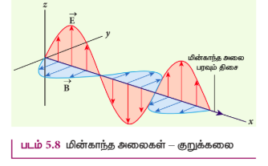
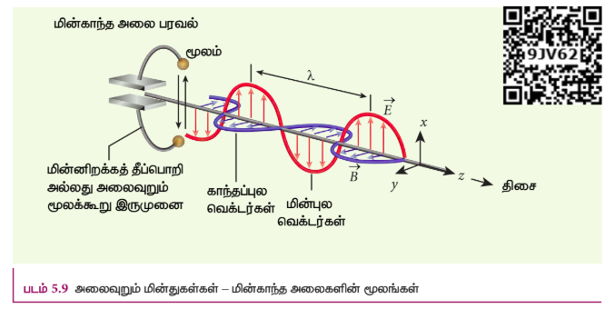
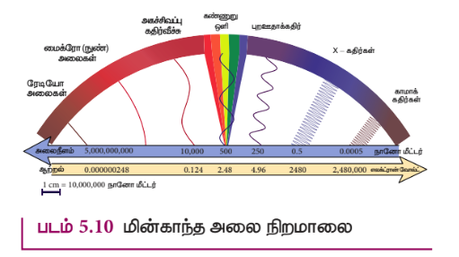

## 5.2 மின்காந்த அலைகள்

மின்காந்த அலைகள் என்பவை இயந்திர அலைகளிலிருந்து மாறுபட்ட வெற்றிடத்தில் ஒளியின் வேகத்திற்குச் சமமான வேகத்தில் செல்லும் அலைகளாகும். இது ஒரு குறுக்கலையாகும். இப்பகுதியில் நாம் மின்காந்த அலைகளின் உருவாக்கம், அவற்றின் பண்புகள், மின்காந்த அலைகளின் மூலங்கள் மற்றும் மின்காந்த அலைகளின் வகைப்பாடு பற்றி கற்கலாம்.

### 5.2.1 மின்காந்த அலைகளின் உருவாக்கம் மற்றும் பண்புகள் – ஹெர்ட்ஸ் ஆய்வு

மேக்ஸ்வெல்லின் கணிப்பு, ஆராய்ச்சி பூர்வமாக 1888 இல் ஹென்ரிக் ரூடால்ஃப் ஹெர்ட்ஸ் என்பாரால் நிரூபிக்கப்பட்டது. ஆய்வு அமைப்பு படம் 5.7 (ஆ) வில் காட்டப்பட்டுள்ளது.

இக்கருவியில் சிறிய உலோகக் கோளங்களால் செய்யப்பட்ட இரண்டு உலோக மின்வாய்கள் அமைக்கப்பட்டுள்ளன. இவை பெரிய கோளங்களுடன் இணைக்கப்பட்டுள்ளன. மின்வாய்களின் மறுமுனைகள் மிக அதிக சுற்றுகளையுடைய தூண்டுசுருளுடன் இணைக்கப்பட்டுள்ளன. இவ்வமைப்பு மிக அதிக மின்னியக்கு விசையை (emf) உருவாக்கும்.

கம்பிச்சுரள் மிக உயர்ந்த மின்னழுத்தத்தைப் பெற்றுள்ளதால் மின்வாய்களுக்கு இடையே உள்ள காற்று அயனியாகி தீப்பொறி ஏற்படுகின்றது (மின்னிறக்கத்தால் தீப்பொறி ஏற்படுகின்றது). மின்வாய்களுக்கிடையே உள்ள சிறிய இடைவெளியிலும் தீப்பொறி ஏற்படுகிறது (மின்வாய் முழுவதும் மூடப்படாமல் வளைய வடிவில் சிறிய இடைவெளியுடன் காணப்படுகின்றன). மின்வாயிலிருந்து ஆற்றல் ஏற்கும் முனைக்கு (வளைய மின்வாய்க்கு) ஆற்றல் அலை வடிவில் கடத்தப்படுகின்றது. இந்த அலையே மின்காந்த அலையாகும்.

ஏற்கும் முனையை 90° சுழற்றினால் ஏற்கும் முனை தீப்பொறி எதையும் பெறாது. இது மேக்ஸ்வெல் கணிப்புப்படி மின்காந்த அலைகள் குறுக்கலைகள்தான் என்பதை உறுதிப்படுத்துகிறது. ஹெர்ட்ஸ் இந்த ஆய்விலிருந்து ரேடியோ அலைகளை உருவாக்கினார். மேலும் இவை ஒளியின் வேகத்திற்கு சமமான வேகத்தில் \( 3 \times 10^8 \ \mathrm{m \ s^{-1}} \) செல்வதை உறுதிப்படுத்தினார்.

மின்காந்த அலைகளின் பண்புகள்

1. முடுக்கிவிடப்பட்ட மின்துகள்கள் (accelerated charges) மின்காந்த அலைகளை உருவாக்குகின்றன.

2. மின்காந்த அலைகள் பரவுவதற்கு எவ்விதமான ஊடகமும் தேவையில்லை. எனவே, மின்காந்த அலை இயந்திர அலையல்ல.

3. மின்காந்த அலைகள் குறுக்கலைப் பண்புடையவை. அதாவது அலைவுறும் மின்புல வெக்டர், அலைவுறும் காந்தப்புல வெக்டர் மற்றும் பரவு வெக்டர் (அலை பரவும் திசையைக் குறிக்கும் வெக்டர்) ஆகிய மூன்று வெக்டர்களும் ஒன்றுக்கொன்று செங்குத்து என்பதை இது காட்டுகிறது. மின்புலம் மற்றும் காந்தப்புலம் இரண்டும் படம் (5.8)ல் காட்டப்பட்டுள்ள திசையில் இருந்தால் மின்காந்த அலை X திசையில் பரவும்.

4. வெற்றிடத்தில் ஒளி செல்லும் வேகத்திற்கு சமமான வேகத்தில் மின்காந்த அலைகள் செல்கின்றன.

5. வெற்றிடத்தில் மின்காந்த அலையின் வேகத்தைவிட, மின்புகுதிறன் மற்றும் காந்த உட்புகுதிறன் கொண்ட ஊடகத்தில் மின்காந்த அலையின் வேகம் குறைவாகும். அதாவது \( v < c \); \( n = \frac{c}{v} = \frac{\sqrt{\varepsilon_0 \mu_0}}{\sqrt{\varepsilon \mu}} \)

\( \therefore n = \sqrt{\varepsilon_r \mu_r} \) இங்கு \( \varepsilon_r \) என்பது ஊடகத்தின் ஒப்புமை விருதிறன் (இதனை மின்காப்பு மாறிலி என்றும் அழைக்கலாம்). மேலும் \( \mu_r \) என்பது ஊடகத்தின் ஒப்புமை உட்புகுதிறனாகும்.

6. மின்காந்த அலைகள் மின்புலம் மற்றும் காந்தப்புலத்தால் விலகல் அடையாது.

7. மின்காந்த அலைகள் குறுக்கீட்டு விளைவு, விளிப்பு விளைவு ஆகியவற்றை ஏற்படுத்தும். மேலும் இவை தளவிளைவிற்கும் உட்படும்.

8. பிற அலைகளைப் போன்றே மின்காந்த அலைகளுக்கும் ஆற்றல், நேர்க்கோட்டு உந்தம் மற்றும் கோண உந்தம் ஆகியவை உள்ளன.

9. ஒரு பொருளின் பரப்பின் மீது விழும் மின்காந்த அலை முழுவதும் அப்பரப்பினால் உட்கவரப்பட்டால், செலுத்தப்பட்ட ஆற்றலானது \( U \) பரப்பின்மீது செலுத்திய உந்தம் \( p = \frac{U}{c} \)

10. பரவுகின்ற மின்காந்த அலையின் ஆற்றல் \( U \) முழுவதும் பரப்பினால் எதிரொளிக்கப்பட்டால், பரப்பிற்கு அளிக்கப்பட்ட உந்தம்

$$
\Delta p = \frac{U}{c} - \left( -\frac{U}{c} \right) = 2\frac{U}{c} \ \text{ஆகும்.}
$$

• துகள்களைப் போன்றே மின்காந்த அலைகளுக்கும் நேர்க்கோட்டு உந்தம் மற்றும் கோண உந்தம் ஆகிய பண்புகள் உள்ளன என்பது ஒரு வியப்பான இயல்பாகும். ஒளியியல் இழுவைகளின் (optical tweezers) கண்டுபிடிப்பு மற்றும் உயர் தீவிர ஒளித் துடிப்புகளின் உருவாக்கம் ஆகியவற்றிற்காக 2018 ஆம் ஆண்டு நோபல் பரிசு வழங்கப்பட்டது.

• நுண்ணுயிர்கள் மற்றும் மூலக்கூறுகள் ஆகியவற்றை ஒருஇடத்திலிருந்து மற்றொரு இடத்திற்கு நகர்த்தப் பயன்படும் ஒரு கருவியே ஒளியியல் இழுவை ஆகும். மருத்துவத் துறையில் இதற்கு பல பயன்பாடுகள் உள்ளன. உடலில் உள்ள திசுக்களிலிருந்து (normal tissues) பாக்டீரியா மற்றும் வைரசுகளைப் பிரித்தெடுப்பதிலும், புற்றுநோய் செல்களிலிருந்து நல்ல நிலையில் உள்ள செல்களை மட்டும் தனியே பிரித்தெடுப்பதிலும் இவை பயன்படுகின்றன. மின்காந்த அலைகளின் நேர்க்கோட்டு உந்தப் பண்பைப் பயன்படுத்தியே ஒளியியல் இழுவைகள் செயல்படுகின்றன.

• அதிகளவிலான நேர்க்கோட்டு உந்தத்தை சூரிய ஒளி அளிப்பதால் ஒரு வால் விண்மீனின் பரும்பொருள் நிறை பின்னோக்கி தள்ளப்படுவதால் தான் அதற்கு வால் போன்ற அமைப்பு உருவாகின்றது.

• மின்காந்த அலைகளின் கோண உந்தப் பண்பை எளிதில் புரிந்து கொள்ளலாம். எதிரெதிர் மின்னூட்டம் தாங்கிய, ஓரச்சில் அமைந்த இரு உள்ளீடற்ற உருளைகளுக்கு இடையில் வரிச்சுருள் ஒன்று வைக்கப்பட்டுள்ள அமைப்பு ஒன்றைக் கருதுக. அவ்வுருளைகளில் பாய்ந்து கொண்டிருக்கும் மாறுதிசை மின்னோட்டம் திடீரென நிறுத்தப்பட்டால், உள் உருளையும் வெளி உருளையும் எதிரெதிர் திசையில் சுழல ஆரம்பிக்கும். மாறுதிசை மின்னோட்டத்தினால் உருவாகும் மின்காந்தப் புலத்தின் கோண உந்தம் இவ்வுருளைகளுக்கு அளிக்கப்படுவதனாலேயே அவை சுழல்கின்றன.

### எடுத்துக்காட்டு 5.2

ஊடகம் ஒன்றின் ஒப்புமை காந்த உட்புகுதிறன் 2.5 மற்றும் ஒப்புமை மின் விருதிறன் 2.25 எனில் அவ்வூடகத்தின் ஒளிவிலகல் எண்ணைக் காண்க.

**தீர்வு**

ஊடகத்தின் மின்காப்பு மாறிலி (ஒப்புமை விருதிறன்) \( \varepsilon_r = 2.25 \)

காந்த உட்புகுதிறன் \( \mu_r = 2.5 \)

ஊடகத்தின் ஒளிவிலகல் எண்,

$$
n = \sqrt{\varepsilon_r \mu_r} = \sqrt{2.25 \times 2.5} = 2.37
$$

### 5.2.2 மின்காந்த அலைகளின் மூலங்கள்

ஓய்வில் உள்ள எந்த ஒரு மின்துகளும், மின்புலத்தை மட்டுமே உருவாக்கும் (அலகு 1 ஐ பார்க்கவும்). ஆனால் அம்மின்துகள் சீரான திசைவேகத்தில் இயங்கும்போது மாறாத மின்னோட்டத்தை கடத்தியில் உருவாக்கி, மின்துகள் பாயும் கடத்தியைச் சுற்றிலும் காந்தப்புலத்தை உருவாக்குகிறது (இக்காந்தப்புலம் நேரத்தைச் சார்ந்ததல்ல, வெளியைச் சார்ந்தது). மின்னூட்டப்பட்ட துகள்கள் முடுக்கமடையும் போது, மின்புலத்துடன் கூடுதலாக காந்தப்புலத்தையும் உருவாக்குகிறது. மின்புலம் மற்றும் காந்தப்புலம் இவ்விரண்டு புலங்களும் நேரத்தைப்பொறுத்து மாற்றமடையும் புலங்களாகும். மின்காந்த அலைகள் குறுக்கலைகளாகும். எனவே மின்புலம் மற்றும் காந்தப்புலம் உள்ள தளங்களுக்கு செங்குத்தாக உள்ள திசையில் மின்காந்த அலை பரவும்.

எந்த ஒரு அலைவு இயக்கமும், முடுக்கப்பட்ட இயக்கமாகும். எனவே, படம் 5.9இல் காட்டியுள்ளவாறு ஒரு மின்துகளானது மையப்புள்ளியைப் பொறுத்து அலைவுறும்போது, (அல்லது மூலக்கூறு இருமுனை அலைவுறும்போது) மின்காந்த அலைகளைத் தோற்றுவிக்கும்.

வெற்றிடத்தில் மின்காந்த அலை பரவும் திசை z-அச்சு எனவும், அதன் மின்புல வெக்டரின் திசை x-அச்சு எனவும் கொண்டால் காந்தப்புல வெக்டரின் திசை, அலைபரவும் திசை மற்றும் மின்புல வெக்டரின் திசை இவ்விரண்டு திசைகளுக்கும் செங்குத்தான திசையில் செயல்படும். அதாவது

$$
E_x = E_0 \sin(kz - \omega t)
$$

$$
B_y = B_0 \sin(kz - \omega t)
$$

இங்கு \( E_0 \) மற்றும் \( B_0 \) என்பவை முறையே அலைவுறும் மின்புலம் மற்றும் காந்தப்புலங்களின் வீச்சுகள் (amplitude) ஆகும். k என்பது அலை எண், \( \omega \) என்பது அலையின் கோண அதிர்வெண் மற்றும் \( \hat{k} \) (ஓரலகு வெக்டர். இதற்கு பரவு வெக்டர் என்று பெயர்) மின்காந்த அலை பரவும் திசையினைக் காட்டுகிறது.

மின்புலம் மற்றும் காந்தப்புலம் இரண்டும் ஒரு குறிப்பிட்ட அதிர்வெண்ணில் (மின்காந்த அலையின் அதிர்வெண்) அதிர்வுறுகின்றன. அந்த அதிர்வெண் மின்காந்த அலையின் மூலத்தின் (source of EM wave) அதிர்வெண்ணுக்குச் சமமாகும். (இங்கு அலைவுறும் மின்துகள் மின்காந்த அலைகளைத் தோற்றுவிக்கும் மூலமாகச் செயல்படுகிறது). வெற்றிடத்தில் \( E_0 \) மற்றும் \( B_0 \) இன் விகிதம் மின்காந்த அலையின் வேகத்திற்குச் சமமாகும். அதாவது ஒளியின் வேகத்திற்கு \( c \) சமமாகும்.

$$
c = \frac{E_0}{B_0}
$$

எந்த ஒரு ஊடகத்திலும் \( E_0 \) மற்றும் \( B_0 \) இன் விகிதம் அந்த ஊடகத்தில் பரவும் மின்காந்த அலையின் வேகத்திற்கு \( v \) சமமாகும். எனவே,

$$
v = \frac{E_0}{B_0} < c
$$

மேலும் மின்காந்த அலையின் ஆற்றல், அலைவுறும் மின்துகள்களின் இயக்க ஆற்றலிலிருந்து கிடைக்கிறது.

### எடுத்துக்காட்டு 5.3

மின்புலம் மற்றும் காந்தப்புலத்தின் வீச்சுகள் முறையே \( 3 \times 10^4 \ \mathrm{N \ C^{-1}} \) மற்றும் \( 2 \times 10^{-4} \ \mathrm{T} \) கொண்ட, ஊடகத்தின் வழியே செல்லும் மின்காந்த அலையின் வேகத்தைக் காண்க.

**தீர்வு**

மின்புலத்தின் வீச்சு, \( E_0 = 3 \times 10^4 \ \mathrm{N \ C^{-1}} \)

காந்தப்புலத்தின் வீச்சு, \( B_0 = 2 \times 10^{-4} \ \mathrm{T} \)

ஊடகத்தின் வழியே பாயும் மின்காந்த அலையின் வேகம்

$$
v = \frac{E_0}{B_0} = \frac{3 \times 10^4}{2 \times 10^{-4}} = 1.5 \times 10^8 \ \mathrm{m/s}
$$

### 5.2.3 மின்காந்த அலை நிறமாலை

அலைநீளம் அல்லது அதிர்வெண்ணின் அடிப்படையில் வரிசைக்கிரமமாக அமைக்கப்பட்ட மின்காந்த அலைகளின் தொகுப்பே, மின்காந்த நிறமாலை (Electromagnetic spectrum) என்று அழைக்கப்படும். இது படம் 5.10 இல் காட்டப்பட்டுள்ளது.

#### ரேடியோ அலைகள் (Radio waves)

மின்சுற்றில் உள்ள மின்னலை இயற்றிகளினால் ரேடியோ அலைகள் உருவாக்கப்படுகின்றன. இதன் அதிர்வெண் வரம்பு சில Hz முதல் \( 10^9 \ \mathrm{Hz} \) வரை இருக்கும்.

இவ்வகை அலைகள் எதிரொளிப்பு மற்றும் விளிம்பு விளைவிற்கு உட்படுகின்றன.

இது வானொலி மற்றும் தொலைக்காட்சி செய்தித்தொடர்பு அமைப்பில் பயன்படுகிறது. மேலும் மீடியம் அதிர்வெண் படைக்களில் செயல்படும் கைப்பேசிகள் குரல் தகவல் தொடர்பிலும் ரேடியோ அலைகள் பயன்படுகின்றன.

#### மைக்ரோ அலைகள் (Micro waves)

சிறப்பு வெற்றிடக் குழாய்களான கிளைஸ்ட்ரான், மேக்னட்ரான் மற்றும் கன் டையோடு (gunn diode) ஆகியவற்றால் மைக்ரோ அலைகள் உருவாக்கப்படுகின்றன. இதன் அதிர்வெண் வரம்பு \( 10^9 \ \mathrm{Hz} \) முதல் \( 10^{11} \ \mathrm{Hz} \) வரை இருக்கும். இவ்வகை அலைகள் எதிரொளிப்பு மற்றும் தளவிளைவிற்கு உட்படுகின்றன.

இது ராடார் கருவிகளில் விமானங்களை வழிநடத்தியும், அவற்றின் வேகங்களை கண்டறியவும் பயன்படுகிறது. மைக்ரோ அலை சமையல்களில் பயன்படுகிறது. மேலும் செயற்கைக்கோள் வழியே நடைபெறும் நீண்டதூர கம்பியில்லா செய்தித்தொடர்பிற்கும் இது பயன்படுகிறது.

#### அகச்சிவப்புக் கதிர்கள் (Infrared rays)

வெப்ப மூலங்களினால் அகச்சிவப்புக் கதிர்வீச்சு உருவாகிறது (இதனை வெப்ப அலைகள் என்றும் அழைக்கலாம்). மேலும் மூலக்கூறுகள் சுழற்சி இயக்கத்தையோ அல்லது அதிர்வு இயக்கத்தையோ மேற்கொள்ளும் போது அகச்சிவப்புக் கதிர்வீச்சு உருவாகிறது. இதன் அதிர்வெண் நெடுக்கம் \( 10^{11} \ \mathrm{Hz} \) முதல் \( 4 \times 10^{14} \ \mathrm{Hz} \) வரை காணப்படும்.

இவை சூரிய மின்கலன் வடிவில் செயற்கைக்கோள்களுக்கு ஆற்றலை அளிக்கிறது. அகச்சிவப்பு கதிர்களைக் கொண்டு பழங்களில் உள்ள நீரினை நீக்கி உலர் பழங்களை உருவாக்குகின்றனர். பசுமை இல்லங்களில் வெப்பக்காப்பாளனாக இவை பயன்படுகின்றன, தசையில் ஏற்படும் வலி மற்றும் சுருக்கத்தை சரிசெய்ய வெப்ப மருத்துவ சிகிச்சை முறையில் இது பயன்படுகிறது. தொலைக்காட்சி பெட்டியில் பயன்படும் தொலைக்கட்டுப்பாட்டு உணர்வியில் (Remote) இது பயன்படுகின்றது. மங்கலான மூடுபனியில் எதிரே வரும் வாகனங்களை பார்ப்பதற்கும், இரவு நேரங்களில் பார்ப்பதற்கும், அகச்சிவப்பு புகைப்படம் எடுக்கவும் அகச்சிவப்புக் கதிர்கள் பயன்படுகிறது.

#### புறஊதாக் கதிர்கள் (Ultraviolet rays)

சூரியன், மின்வில் மற்றும் அயனியாக்கப்பட்ட வாயுக்களிலிருந்து புறஊதாக் கதிர்வீச்சு கிடைக்கிறது. இதன் அதிர்வெண் நெடுக்கம் \( 8 \times 10^{14} \ \mathrm{Hz} \) முதல் \( 10^{17} \ \mathrm{Hz} \) வரை காணப்படும்.

இதன் ஊடுருவும் திறன் குறைவு. இப்புற ஊதாக் கதிர்கள் வளிமண்டலத்திலுள்ள ஓசோன் படலத்தால் உட்கவரப்படும். அதே நேரத்தில் இது மனித உடலுக்கு தீமை தரக்கூடியதாகும். பாக்டீரியாக்களைக் கொல்வதற்கும், அறுவை சிகிச்சை கருவிகளிலிருந்து நோய்க்கிருமிகளை நீக்குவதற்கும், திருடர் அறிவிப்பு மணியிலும், மறைந்துள்ள எழுத்துக்களை கண்டுணரவும், விரல் ரேகைகளை கண்டறியவும், மேலும் மூலக்கூறு அமைப்பை அறியவும் பயன்படுகிறது.

#### கண்ணுறு ஒளி (Visible light)

வெந்தழல் நிலையில் உள்ள பொருட்களிலிருந்து கண்ணுறு ஒளி கிடைக்கிறது. மேலும் வாயுக்களில் உள்ள கிளர்ச்சியுற்ற அணுக்களும் கண்ணுறு ஒளியை உமிழ்கின்றன. இதன் அதிர்வெண் நெடுக்கம் \( 4 \times 10^{14} \ \mathrm{Hz} \) முதல் \( 8 \times 10^{14} \ \mathrm{Hz} \) வரை காணப்படும்.

எதிரொளிப்பு, ஒளிவிலகல், குறுக்கீட்டு விளைவு, விளிப்பு விளைவு, தளவிளைவு, ஒளிமின் விளைவு விதிகளுக்கு உட்படுகின்றது. மேலும் புகைப்படம் எடுப்பதிலும் பயன்படுகின்றது. மூலக்கூறு அமைப்பை ஆராயவும், அணுக்களின் வெளிக்கூட்டிலுள்ள எலக்ட்ரான்களின் அமைப்பை அறியவும், கண்களுக்கு பார்வை உணர்வை அளிக்கவும் கண்ணுறு ஒளி பயன்படுகிறது.

#### X-கதிர்கள் (X-rays)

உயர் அணு எண் கொண்ட தனிமத்தினால் வேகமாகச் செல்லும் எலக்ட்ரானை திடீரென எதிர்முகமுடுக்கமடையச் செய்யும்போது (தடுக்கும்போது) X-கதிர்கள் கிடைக்கின்றன. மேலும் அணுவின் உட்புற சுற்றுப்பாதையில் உள்ள எலக்ட்ரான்களின் மாற்றத்தினாலும் X-கதிர்கள் உருவாகின்றன. இதன் அதிர்வெண் நெடுக்கம் \( 10^{17} \ \mathrm{Hz} \) முதல் \( 10^{19} \ \mathrm{Hz} \) வரை காணப்படும்.

புறஊதாக்கதிர்களைவிட X-கதிர்களின் ஊடுருவுதிறன் அதிகம். அணுவின் உட்புற எலக்ட்ரான் கூடுகளின் அமைப்பை ஆராயவும், படிக அமைப்பை ஆராயவும் X-கதிர்கள் அதிகமாக பயன்படுகின்றன. மேலும் எலும்புமுறிவைக் கண்டறியவும், எலும்புகள் மற்றும் சிறுநீரகக் கற்களின் உருவாக்கத்தை கண்டறியவும், சரிசெய்யப்பட்ட எலும்பின் வளர்ச்சியை கண்டறியவும் இது பயன்படுகிறது. மேலும் உலோக வார்ப்புகளில் உள்ள வெடிப்புகளையும், குறைபாடுகளையும் மற்றும் துளைகளையும் கண்டறிய X-கதிர்கள் பயன்படுகின்றன.

#### காமா கதிர்கள் (Gamma rays)

அணுக்கருக்களின் மாற்றத்தினாலும், சில அடிப்படைத் துகள்களின் சிதைவினாலும் காமா கதிர்வீச்சு பெறப்படுகிறது. புகைப்படத் தகடுகளில் வேதி வினையை காமா கதிர்கள் ஏற்படுத்துகின்றன. ஒளிர்தல், அயனியாதல், விளிம்பு விளைவு போன்றவற்றை ஏற்படுத்துகிறது. இதன் அதிர்வெண் நெடுக்கம் \( 10^{18} \ \mathrm{Hz} \)க்கு மேலாக இருக்கும்.

X-கதிர் மற்றும் புறஊதாக் கதிர்களைவிட காமா கதிரின் ஊடுருவுதிறன் அதிகம். இக்கதிர்வீச்சில் எவ்வித மின்னூட்டமும் இல்லை. ஆனால் இது மனித உடலுக்கு மிகவும் ஆபத்தானதாகும். அணுக்கருவின் அமைப்பை அறிவதற்கு காமா கதிர் பயன்படுகிறது. புற்றுநோய் சிகிச்சைக்குப் பயன்படும் கதிர்வீச்சு மருத்துவ முறையில் காமா கதிர்வீச்சு பெருமளவு பயன்படுகிறது. உணவுப் பொருட்கள் தயாரிப்பிலும், நோய் உருவாக்கும் நுண்கிருமிகளைக் கொல்வதற்கும் காமாக் கதிர்கள் பயன்படுகிறது.

### எடுத்துக்காட்டு 5.4

மைக்ரோ அலை சமையல்கலனில் உள்ள மேக்னட்ரான் ஒன்று \( f = 2450 \ \mathrm{MHz} \) அதிர்வெண் கொண்ட மின்காந்த அலையை உமிழ்கிறது. இந்த அதிர்வெண்ணில் எவ்வளவு காந்தப்புல வலிமைக்கு எலக்ட்ரான்கள் வட்டப்பாதையில் இயக்கத்தை மேற்கொள்ளும்.

**தீர்வு**

மின்காந்த அலையின் அதிர்வெண் \( f = 2450 \ \mathrm{MHz} \)

இதற்கான கோண அதிர்வெண்

\( \omega = 2\pi f = 2 \times 3.14 \times 2450 \times 10^6 = 15,386 \times 10^6 \ \mathrm{Hz} = 1.54 \times 10^{10} \ \mathrm{s^{-1}} \)

காந்தப்புலம் \( B = \frac{m\omega}{|q|} \)

எலக்ட்ரானின் நிறை, \( m_e = 9.11 \times 10^{-31} \ \mathrm{kg} \)

எலக்ட்ரானின் மின்னூட்டம் \( q = -1.60 \times 10^{-19} \ \mathrm{C} \Rightarrow |q| = 1.60 \times 10^{-19} \ \mathrm{C} \)

\( B = \frac{(9.11 \times 10^{-31})(1.54 \times 10^{10})}{1.60 \times 10^{-19}} \)

\( B = 0.08768 \ \mathrm{T} \)

இந்த காந்தப்புலத்தை ஓர் நிலையான காந்தத்தைக் கொண்டு உருவாக்கலாம். எனவே 2450 MHz அதிர்வெண் கொண்ட மின்காந்த அலைகளைக் கொண்டு உணவுப் பொருட்களை சூடாக்கலாம் மற்றும் சமைக்கலாம். ஏனெனில் இம் மின்காந்த அலைகளை நீர் மூலக்கூறுகள் வலிமையாக உட்கவரும்.
