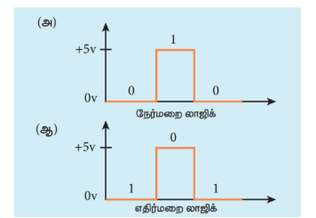
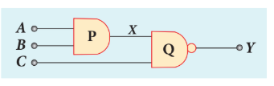
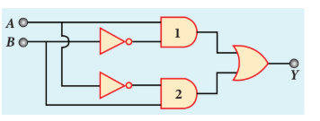

## 10.5 இலக்கமுறை எலக்ட்ரானியல் (Digital Electronics)

இலக்கமுறை எலக்ட்ரானியல் என்பது, இலக்கமுறை சைகைகளைக் கையாளும் எலக்ட்ரானியலின் ஒரு பிரிவு ஆகும். இது சைகை செயலாக்கம், தகவல்தொடர்பு ஆகிய பயன்பாடுகளில் உள்ள நவீன செயலாக்கச் சுற்றுகள் முதல் மிகச்சிறிய சுற்றுகள் வரை அதிக அளவில் பயன்படுகிறது. சிறந்த செயல்திறன், துல்லியம், வேகம், நெகிழ்வுத் தன்மை மற்றும் இரைச்சல் எதிர்ப்பு ஆகிய காரணங்களுக்காக தொடர் சைகைகளை விட இலக்கமுறை சைகைகள் தேர்ந்தெடுக்கப்படுகின்றன.

### 10.5.1 தொடர் மற்றும் இலக்கமுறை சைகைகள்

எலக்ட்ரானியலில் இரு வேறுபட்ட சைகைகள் பயன்படுத்தப்படுகின்றன. அவை (i) **தொடர் மின் சைகைகள்** மற்றும் (ii) **இலக்கமுறை சைகைகள்**. தொடர் மின் சைகையானது நேரத்தைப் பொருத்து, தொடர்ச்சியாக மாறுபடும் மின்னழுத்தம் அல்லது மின்னோட்டத்தைக் கொண்டது. அத்தகைய சைகைகள் திருத்தி சுற்றுகளிலும் மற்றும் டிரான்சிஸ்டர் பெருக்கிச் சுற்றுகளிலும் பயன்படுத்தப்படுகின்றன.

இலக்கமுறை சைகைகள் மின்னழுத்தங்களின் **தனித்தனி மதிப்புகள்** (discrete values) மட்டுமே கொண்ட சைகைகள் ஆகும். இலக்கமுறை சைகைகளுக்கு இரு நிலைகள் தேவை - இயக்க மற்றும் நிறுத்து. இயக்க ஒரு நிலையாகவும், நிறுத்து மற்றொரு நிலையாகவும் கருதப்படுகின்றன. இந்த இரு நிலைகளை உயர்நிலை (இயக்க) அல்லது தாழ்நிலை (நிறுத்து) மற்றும் மூடிய நிலை (இயக்க) அல்லது திறந்தநிலை (நிறுத்து) எனவும் வரையறுக்கலாம். **பூலியன் இயற்கணிதத்தில்**, இந்த உயர் மற்றும் தாழ் நிலைகள் 1 அல்லது 0 என்ற இரு எண்களைப் பயன்படுத்தி வரையறுக்கப்படுகின்றன. நிலை 1 குறிப்பது சுற்றின் இயக்க நிலை, உயர் மின்னழுத்தம், ஒரு மூடிய சாவி. அதுபோன்றே, நிலை 0 குறிப்பது சுற்றின் நிறுத்திய நிலை, தாழ் மின்னழுத்தம் அல்லது ஒரு திறந்த சுற்று.

**நேர்மறை மற்றும் எதிர்மறை லாஜிக்**

இலக்கமுறை அமைப்புகளில் இரு மின்னழுத்த மட்டங்கள் உள்ளன: 5 V (உயர் நிலை) மற்றும் 0 V (தாழ் நிலை). படம் 10.40 இல் காட்டியுள்ளவாறு, ஒரு **நேர் லாஜிக்** அமைப்பில் இரும எண் 1 ஆனது 5 V ஐக் குறிக்கிறது மற்றும் 0 ஆனது 0 V ஐக் குறிக்கிறது. ஆனால் **எதிர் லாஜிக்** அமைப்பில், நிலை 1 ஆனது 0 V யும் மற்றும் நிலை 0 ஆனது 5 V யும் குறிக்கின்றன.

### 10.5.2 லாஜிக் கேட்குகள் (Logic gates)

லாஜிக் கேட் என்பது, இலக்கமுறை சைகைகளை அடிப்படையாகக் கொண்டு செயல்படுகின்ற ஒரு எலக்ட்ரானியல் சுற்று ஆகும். இவை இரு அடிமான எண்களைக் கொண்டவை. பெரும்பாலான இலக்கமுறை அமைப்புகளின் அடிப்படைக் கட்டமைப்புகளாக லாஜிக் கேட்குகள் கருதப்படுகின்றன. இதில் ஒரு வெளியீடு மற்றும் ஒன்று அல்லது அதற்கு மேற்பட்ட உள்ளீடுகளும் உள்ளன. மூன்று வகையான அடிப்படை லாஜிக் கேட்குகள் உள்ளன; அவை **AND**, **OR** மற்றும் **NOT** ஆகும். பிற லாஜிக் கேட்குகள் **EX-OR**, **NAND** மற்றும் **NOR** ஆகும். இவற்றை அடிப்படை லாஜிக் கேட்குகளிலிருந்து உருவாக்கலாம்.

இலக்கமுறை எலக்ட்ரானியல், லாஜிக் செயல்பாடுகளைக் கையாளுகிறது. மாறிகள், **லாஜிக் மாறிகள்** (logical variables) என அழைக்கப்படுகின்றன. லாஜிக் கூட்டல் \( + \) மற்றும் லாஜிக் பெருக்கல் \( \cdot \) போன்ற செயலிகள் **லாஜிக் செயலிகள்** (logical operators) எனப்படும். லாஜிக் செயலிகள் \( +, \cdot \) ஆனது லாஜிக் மாறிகள் \( A, B \) மீது செயல்பட்டால், அது லாஜிக் மாறியை \( Y \) தருகிறது. இந்தச் செயல்பாட்டைக் குறிக்கும் சமன்பாடு **லாஜிக் கூற்று** (logical statement) எனப்படும்.

உதாரணமாக,

லாஜிக் செயலி : \( + \)

லாஜிக் மாறிகள்: \( A, B \)

லாஜிக் வெளியீடு: \( Y \)

லாஜிக் கூற்று: \( Y = A + B \)

உள்ளீடுகளின் சாத்தியமான சேர்க்கைகள் மற்றும் அதற்கேற்ற வெளியீடு ஆகியவை அட்டவணை வடிவில் கொடுக்கப்படுகின்றன. இந்த அட்டவணை, **உண்மை அட்டவணை** எனப்படும்.லாஜிக் கூட்டல்,பெருக்கல், புரட்டுதல் போன்ற அடிப்படை லாஜிக் செயல்பாடுகளை செயல்படுத்தும் சுற்றுகள் கீழே விவாதிக்கப்பட்டுள்ளன.

**AND கேட்**

**சுற்றுக் குறியீடு:**

 இரு உள்ளீடுகள் கொண்ட ஒரு AND கேட்டின் சுற்றுக் குறியீடு படம் 10.41 (அ) இல் காட்டப்பட்டுள்ளது. A மற்றும் B ஆகியவை உள்ளீடுகள் மற்றும் Y வெளியீடு ஆகும். இது ஒரு லாஜிக் கேட் எனவே \( A, B \) மற்றும் \( Y \) ஆகியவை 1 அல்லது 0 என்ற மதிப்பைக் கொண்டிருக்கலாம்.

**(அ)**
| உள்ளீடுகள் |  | வெளியீடு |
| --- | --- | --- |
| **A** | **B** | **Y = A . B** |
| 0 | 0 | 0 |
| 0 | 1 | 0 |
| 1 | 0 | 0 |
| 1 | 1 | 1 |

**(ஆ)**

**படம் 10.41** (அ) இரு உள்ளீடு AND கேட்
(ஆ) உண்மை அட்டவணை

**பூலியன் சமன்பாடு:** \( Y = A \cdot B \)

இது லாஜிக் பெருக்கலை மேற்கொள்கிறது மற்றும் எண்கணிதப் பெருக்கலில் இருந்து மாறுபட்டது.

**லாஜிக் செயல்பாடு:** அனைத்து உள்ளீடுகளும் உயர் நிலையில் (1) இருந்தால் மட்டுமே, AND கேட்டின் வெளியீடு உயர் நிலையில் (1) இருக்கும். பிற நேர்வுகளில் வெளியீடு தாழ்நிலையில் இருக்கும். அது உண்மை அட்டவணையில் காட்டப்பட்டுள்ளது (படம் 10.41 (ஆ)).

**OR கேட்**

**சுற்றுக் குறியீடு:** இரு உள்ளீடுகள் கொண்ட ஒரு OR கேட்டின் சுற்றுக் குறியீடு படம் 10.42 (அ) இல் காட்டப்பட்டுள்ளது. A மற்றும் B ஆகியவை உள்ளீடுகள் மற்றும் Y வெளியீடு ஆகும்.

**(அ)**

| உள்ளீடுகள் |  | வெளியீடு |
|---|---|---|
| A | B | Y = A + B |
| 0 | 0 | 0 |
| 0 | 1 | 1 |
| 1 | 0 | 1 |
| 1 | 1 | 1 |

**(ஆ)**

**படம் 10.42** (அ) இரு உள்ளீடு OR கேட்
(ஆ) உண்மை அட்டவணை

**பூலியன் சமன்பாடு:** \( Y = A + B \)

இது லாஜிக் கூட்டலை மேற்கொள்கிறது மற்றும் எண்கணிதக் கூட்டலில் இருந்து மாறுபட்டது.

**லாஜிக் செயல்பாடு:** உள்ளீடுகளில் ஏதேனும் ஒன்று அல்லது இரண்டுமே உயர் நிலையில் இருந்தால், OR கேட்டின் வெளியீடு உயர் நிலையில் (லாஜிக் நிலை 1) இருக்கும். OR கேட்டின் உண்மை அட்டவணை படம் 10.42 (ஆ) இல் காட்டப்பட்டுள்ளது.

**NOT கேட்**

**சுற்றுக் குறியீடு:** NOT கேட்டின் சுற்றுக் குறியீடு படம் 10.43 (அ) இல் காட்டப்பட்டுள்ளது. A ஆனது உள்ளீடு மற்றும் Y வெளியீடு ஆகும்.

**(அ)**

| உள்ளீடுகள்  | வெளியீடு |
|---|---|
| A | Y = \(\overline{A} \)|
| 0 | 1 |
| 1 | 0 |

**(ஆ)**

**படம் 10.43** (அ) NOT கேட் (ஆ) உண்மை
அட்டவணை

**பூலியன் சமன்பாடு:** \( Y = \overline{A} \)

**லாஜிக் செயல்பாடு:** வெளியீடானது உள்ளீட்டின் நிரப்பி ஆகும். இது ஒரு மேற்கோட்டால் குறிப்பிடப்படுகிறது. இது **தலைகீழாக்கி** (inverter) என்றும் அழைக்கப்படுகிறது. உள்ளீடு A ஆனது 0 எனில், வெளியீடு Y ஆனது 1. அதாவது மறுதலையாக இருப்பதை உண்மை அட்டவணை உணர்த்துகிறது. NOT கேட்டின் உண்மை அட்டவணை படம் 10.43 (ஆ) இல் காட்டப்பட்டுள்ளது.

**NAND கேட்**

**சுற்றுக் குறியீடு:** NAND கேட்டின் சுற்றுக் குறியீடு படம் 10.44 (அ) இல் காட்டப்பட்டுள்ளது. A மற்றும் B ஆனது உள்ளீடுகள் மற்றும் Y வெளியீடு ஆகும்.

**(அ)**

| உள்ளீடு || வெளியீடு (AND) | வெளியீடு (NAND) |
|---|---|---|---|
| A | B | Z = A.B | Y = \(\overline{A.B}\) |
| 0 | 0 | 0 | 1 |
| 0 | 1 | 0 | 1 |
| 1 | 0 | 0 | 1 |
| 1 | 1 | 1 | 0 |

**(ஆ)**

**படம் 10.44** (அ) இரு உள்ளீடு NAND கேட்
(ஆ) உண்மை அட்டவணை

**பூலியன் சமன்பாடு:** \( Y = \overline{A \cdot B} \)

**லாஜிக் செயல்பாடு:** வெளியீடு Y ஆனது AND செயல்பாட்டின் நிரப்பியாக உள்ளது. சுற்றானது ஒரு AND கேட் மற்றும் அதனைத் தொடர்ந்து ஒரு NOT கேட்டைக் கொண்டுள்ளது. எனவே அது NAND என குறிப்பிடப்படுகிறது. அனைத்து உள்ளீடுகளும் உயர் நிலையில் இருந்தால் மட்டுமே, வெளியீடு லாஜிக் நிலை 0 வில் இருக்கும். பிற நேர்வுகளில் வெளியீடு உயர் நிலையில் (லாஜிக் நிலை 1) இருக்கும். NAND கேட்டின் உண்மை அட்டவணை படம் 10.44 (ஆ) இல் காட்டப்பட்டுள்ளது.

**NOR கேட்**

**சுற்றுக் குறியீடு:** NOR கேட்டின் சுற்றுக் குறியீடு படம் 10.45 (அ) இல் காட்டப்பட்டுள்ளது. A மற்றும் B ஆனது உள்ளீடுகள் மற்றும் Y வெளியீடு ஆகும்.

**பூலியன் சமன்பாடு:** \( Y = \overline{A + B} \)

**லாஜிக் செயல்பாடு:** வெளியீடு Y ஆனது OR செயல்பாட்டின் நிரப்பி \( \overline{A + B} \) ஆகும். சுற்றானது ஒரு OR கேட் மற்றும் அதனைத் தொடர்ந்து ஒரு NOT கேட்டைக் கொண்டுள்ளது. இது NOR எனக் குறிப்பிடப்படுகிறது. அனைத்து உள்ளீடுகளும் தாழ் நிலையில் இருந்தால், வெளியீடு உயர் நிலையில் உள்ளது. உள்ளீடுகளின் பிற சேர்க்கைகளுக்கு, வெளியீடு தாழ் நிலையில் உள்ளது. NOR கேட்டின் உண்மை அட்டவணை படம் 10.45 (ஆ) இல் காட்டப்பட்டுள்ளது.

**(அ)**

| உள்ளீடு || வெளியீடு (AND) | வெளியீடு (NAND) |
|---|---|---|---|
| A | B | Z = A+B | Y = \(\overline{A+B} \)|
| 0 | 0 | 0 | 1 |
| 0 | 1 | 1 | 0 |
| 1 | 0 | 1 | 0 |
| 1 | 1 | 1 | 0 |

**(ஆ)**

**படம் 10.45** (அ) NOR கேட் (ஆ) உண்மை அட்டவணை

**EX-OR கேட்**

**சுற்றுக் குறியீடு:** EX-OR கேட்டின் சுற்றுக் குறியீடு படம் 10.46 (அ) இல் காட்டப்பட்டுள்ளது. A மற்றும் B ஆனவை உள்ளீடுகள் மற்றும் Y வெளியீடு ஆகும். EX-OR செயல்பாடு \( \oplus \) என குறிக்கப்படுகிறது.

**பூலியன் சமன்பாடு:** \( Y = A \cdot \overline{B} + \overline{A} \cdot B = A \oplus B \)

**லாஜிக் செயல்பாடு:**

**(அ)**

| உள்ளீடு| | வெளியீடு (EX-OR) |
|---|---|---|---|
| A | B | Y = A \(\oplus B \)|
| 0 | 0 | 0 |
| 0 | 1 | 1 |
| 1 | 0 | 1 |
| 1 | 1 | 0 |

**(ஆ)**

**படம் 10.46** (அ) EX-OR கேட் (ஆ) உண்மை
அட்டவணை

இரு உள்ளீடுகளில் ஏதேனும் ஒன்று உயர் நிலையில் இருந்தால், வெளியீடு உயர் நிலையில் உள்ளது. இரு உள்ளீடுகளுக்கு மேல் கொண்ட EX-OR கேட்டில் ஒற்றைப்படை எண்ணிக்கையிலான உள்ளீடுகள் உயர் நிலையில் உள்ளபோது, வெளியீடு உயர் நிலையில் இருக்கும். EX – OR கேட்டின் உண்மை அட்டவணை படம் 10.46 (ஆ) காட்டப்பட்டுள்ளது.

>**குறிப்பு** NAND மற்றும் NOR லாஜிக் கேட்டுகள் பொது கேட்டுகள் என அழைக்கப்படுகின்றன. ஏனெனில் பிற லாஜிக் கேட்டுகளை NAND அல்லது NOR கேட்டுகளிலிருந்து உருவாக்க முடியும்

>**எடுத்துக்காட்டு 10.9**
>
>கீழ்க்காணும் சுற்றில் A, B மற்றும் C ஆகிய மூன்று உள்ளீடுகள் அனைத்தும் முதலில் 0 மற்றும் பிறகு 1 என இருந்தால், வெளியீடு Y என்ன?
>
>**தீர்வு**
>
>| A | B | C | X = A·B | Y = X·C |
>|---|---|---|---|---|
>| 0 | 0 | 0 | 0 | 1 |
>| 1 | 1 | 1 | 1 | 0 |

>**எடுத்துக்காட்டு 10.10**
>
>கீழ்க்காணும் லாஜிக் கேட்களின் சேர்க்கையில், உள்ளீடுகள் A மற்றும் B ஐக் கொண்டு வெளியீடு Y – யிற்கான பூலியன் சமன்பாட்டை எழுதுக.
>
>**தீர்வு**
>
>1 வது AND கேட் வெளியீடு : \( A \cdot \overline{B} \)
>
>2 வது AND கேட் வெளியீடு : \( \overline{A} \cdot B \)
>
>OR கேட்டில் வெளியீடு: \( Y = A \cdot \overline{B} + \overline{A} \cdot B \)

