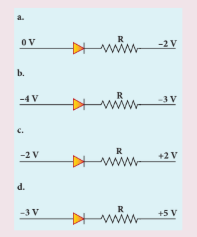
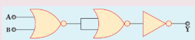
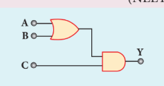
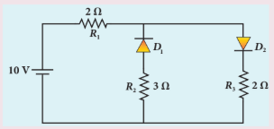
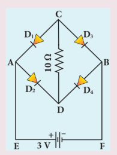
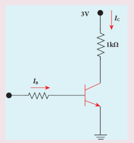
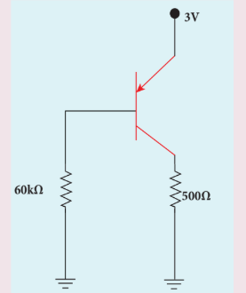
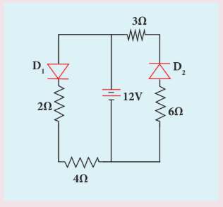
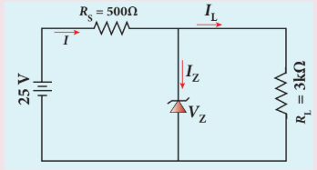
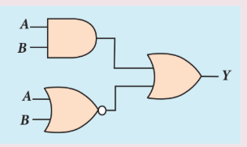

## மதிப்பீடு

**I சரியான விடையைத் தேர்ந்தெடுத்து எழுதுக**

1. ஒரு சிலிக்கான் டையோடின் மின்னழுத்த அரண் (தோராயமாக)

   a) 0.7 V  
   
   b) 0.3 V 

   c) 2.0 V 

   d) 2.2 V

2. சிறிய அளவு ஆண்டிமனி (Sb) ஆனது, ஜெர்மானியம் படிகத்துடன் சேர்க்கும் போது (AIPMT 2011)

   a) இது p-வகை குறைகடத்தியாக மாறுகிறது

   b) ஆண்டிமனி ஒரு ஏற்பான் அணுவாக மாறுகிறது

   c) குறைகடத்தியில் துளைகளை விட அதிகமான கட்டுறா எலக்ட்ரான்கள் இருக்கும்

   d) அதன் மின்தடை அதிகரிக்கிறது

3. சார்பளிக்கப்படாத p-n சந்தியில், p-பகுதியில் உள்ள பெரும்பான்மை மின்னூட்ட ஊர்திகள் (அதாவது, துளைகள்) n-பகுதிக்கு விரவல் அடைவதற்கு காரணம்.

   a) p-n சந்தியின் குறுக்கே உள்ள மின்னழுத்த வேறுபாடு

   b) n-பகுதியில் உள்ளதை விட, p-பகுதியில் உள்ள அதிக துளை செறிவு

   c) n-பகுதியில் உள்ள கட்டுறா எலக்ட்ரான் களின் கவர்ச்சி

   d) மேலே உள்ள அனைத்தும்

4. ஒர் நேர் அரை அலை திருத்தியில் திருத்தப்பட்ட மின்னழுத்தம் ஒரு பளு மின்தடைக்கு அளிக்கப்பட்டால், உள்ளீடு சைகை மாறுபாட்டின் எந்தப் பகுதியில் பளு மின்னோட்டம் பாயும்

   a) \( 0^\circ - 90^\circ \) 
   
    b) \( 90^\circ - 180^\circ \)

    c) \( 0^\circ - 180^\circ \)

    d) \( 0^\circ - 360^\circ \)

5. செனார் டையோடின் முதன்மைப் பயன்பாடு எது?

   a) அலை திருத்தி
   
    b) பெருக்கி 
    
   c) அலை இயற்றி 
     
    d) மின்னழுத்தச் சீரமைப்பான்

6. சூரிய மின்கலன் இந்தத் தத்துவத்தின் அடிப்படையில் செயல்படுகிறது.

   a) விரவல்
   
   b) மறு இணைப்பு 
   
   c) ஒளி வோல்டா செயல்பாடு 
   
   d) ஊர்தியின் பாய்வு

7. ஒளி உமிழ்வு டையோடில் ஒளி உமிழப்படக் காரணம்

   a) மின்னூட்ட ஊர்திகளின் மறு இணைப்பு

   b) லென்ஸ்களின் செயல்பாட்டால் ஏற்படும் ஒளி எதிரொளிப்பு

   c) சந்தியின்மீது படும் ஒளியின் பெருக்கம்

   d) மிகப்பெரிய மின்னோட்ட கடத்தும் திறன்

8. p-n சந்தியில் உள்ள மின்னழுத்த அரண்

   i) குறைகடத்திப் பொருளின் வகை

   ii) மாசூட்டலின் அளவு

   iii) வெப்பநிலை ஆகியவற்றைப் பொருத்து அமையும்.

   பின்வருவனவற்றில் எது சரியானது? (NEET)

   a) (i) மற்றும் (ii)
   
   b) (ii) மட்டும் 
   
   c) (ii) மற்றும் (iii) 
   
   d) (i) (ii) மற்றும் (iii)

9. ஒர் அலை இயற்றியில் தொடர்ச்சியான அலைவுகள் ஏற்பட

   a) நேர் பின்னூட்டம் இருக்க வேண்டும்.

   b) பின்னூட்ட மாநிலி ஒன்றாக இருக்க வேண்டும்.

   c) கட்டமாற்றம் சுழி அல்லது \( 2\pi \) யாக இருக்க வேண்டும்

   d) மேற்கூறிய அனைத்தும்.

10. ஒரு NOT கேட்டின் உள்ளீடு \( A = 1011 \) எனில், அதன் வெளியீடானது,

    a) 0100 
    
     b) 1000 
     
     c) 1100 
     
     d) 0011

11. பின்வருவனவற்றில் எது முன்னோக்குச் சார்பில் உள்ள டையோடினைக் குறிக்கும் (NEET)
   

12. பின்வரும் மின்சுற்று எந்த லாஜிக் கேட்டிற்குச் சமமானது

    a) AND கேட்
    
    b) OR கேட்
    
    c) NOR கேட் 
    
    d) NOT கேட்

13.  பின்வரும் மின்சுற்றின் வெளியீடு 1 ஆக இருக்கும்போது, உள்ளீடு ABC ஆனது

    a) 101 
    
    b)100
    
    c) 110 
    
    d) 010 

14. பண்பேற்றப்பட்ட சைகையின் கணநேர வீச்சிற்கு ஏற்ப ஊர்தி அலையின் அதிர்வெண் மாற்றப்படுவது --- எனப்படும்.

    a) வீச்சுப் பண்பேற்றம் 
    
    b) அதிர்வெண் பண்பேற்றம் 
    
    c) கட்டப் பண்பேற்றம் 
    
    d) துடிப்பு அகலப் பண்பேற்றம்

15. 3 MHz முதல் 30 MHz வரையிலான அதிர்வெண் நெடுக்கம் பயன்படுவது

    a) தரை அலைப் பரவல் 
    
    b) வெளி அலைப் பரவல் 
    
    c) வான் அலைப் பரவல் 
    
    d) செயற்கைக்கோள் தகவல்தொடர்பு 

**விடைகள்:**

1. a &nbsp;&nbsp;&nbsp; 2. c &nbsp;&nbsp;&nbsp; 3. b &nbsp;&nbsp;&nbsp; 4. c &nbsp;&nbsp;&nbsp; 5. d &nbsp;&nbsp;&nbsp; 6. c &nbsp;&nbsp;&nbsp; 7. a &nbsp;&nbsp;&nbsp; 8. d &nbsp;&nbsp;&nbsp; 9. d &nbsp;&nbsp;&nbsp; 10. a &nbsp;&nbsp;&nbsp; 11. a &nbsp;&nbsp;&nbsp; 12. c &nbsp;&nbsp;&nbsp; 13. a &nbsp;&nbsp;&nbsp; 14. b &nbsp;&nbsp;&nbsp; 15. c &nbsp;&nbsp;&nbsp;

**II சிறு விடை வினாக்கள்**

1. விலக்கப்பட்ட ஆற்றல் இடைவெளி வரையறு.

2. குறை கடத்தியின் வெப்பநிலை மின்தடை எண் எதிர்குறி உடையது ஏன்?

3. மாசூட்டல் என்பதன் பொருள் என்ன?

4. உள்ளார்ந்த மற்றும் புறவியலான குறைகடத்திகளை வேறுபடுத்துக.

5. ஒரு டையோடு "ஒத்திசைக்கும் கருவி" என அழைக்கப்படுகிறது என விளக்குக.

6. ஒரு டையோடில் கசிவு மின்னோட்டம் என்பதன் பொருள் என்ன?

7. ஒரு முழு அலை திருத்தியின் உள்ளீட்டு மற்றும் வெளியீட்டு அலை வடிவங்களை வரைக.

8. சரிவு முறிவு மற்றும் செனார் முறிவு ஆகியவற்றை வேறுபடுத்துக?

9. தொடர்ச்சியான அலைகளுக்கான பர்க்கௌசன்(Barkhausen) நிபந்தனைகளை கூறுக.

10. NPN டிரான்சிஸ்டரில் மின்னோட்ட பாய்வு பற்றி விளக்குக.

11. லாஜிக் கேட்குகள் என்றால் என்ன?

12. ஒரு டிரான்சிஸ்டர் பெருக்கியில் பின்னூட்டச் சுற்றுக்கான தேவையை விளக்குக.

13. PN சந்தியின் குறுக்கே பாயும் விரவல் மின்னோட்டம் பற்றி சிறு குறிப்பு வரைக.

14. சார்பளித்தல் என்றால் என்ன? அதன் வகைகள் யாவை?

15. ஒரே வகையான குறைகடத்தி பொருளால் செய்யப்பட்ட போதிலும் ஒரு டிரான்சிஸ்டரின் உமிழ்ப்பான் மற்றும் ஏற்பான் ஆகியவற்றை பரிமாற்றிப் பயன்படுத்த இயலாது ஏன்?

16. NOR மற்றும் NAND கேட்குகள் பொது கேட்குகள் என அழைக்கப்படுகின்றன ஏன்?

17. மின்னழுத்த அரண் வரையறு?

18. திருத்துதல் என்றால் என்ன?

19. ஒளி உமிழ்வு டையோடின் பயன்பாடுகளை வரிசைப்படுத்து.

20. சூரிய மின்கலங்களின் தத்துவத்தை தருக.

21. தொகுப்புச் சுற்றுகள் என்றால் என்ன?

22. பண்பேற்றம் வரையறு.

23. ஒரு பரப்பி அமைப்பின் பட்டை அகலம் என்பதை வரையறு.

24. தாவு தொலைவு வரையறு.

25. ரேடாரின் பயன்களை தருக.

26. செல்பேசி தகவல் தொடர்பு என்றால் என்ன?

27. அதிர்வெண் பண்பேற்றத்தில் மைய அதிர்வெண் அல்லது ஓய்வு நிலை அதிர்வெண் – விளக்குக.

28. RADAR என்பது எதனைக் குறிக்கிறது?

29. பல்வேறு வகைப்பட்ட தகவல் தொடர்புகளில் ஒளி இழை தகவல் தொடர்பு சிறந்ததாக விளங்குகிறது. நிரூபி.

**III பெரு விடை வினாக்கள்**

1. N-வகை புறவியலான குறைகடத்திகள் உருவாக்கப்படுவதை விளக்கமாக எழுதுக.

2. ஒரு PN சந்தி டையோடின் இயக்கமில்லாத பகுதி மற்றும் மின்னழுத்த அரண் ஆகியவை உருவாவதை விவரி.

3. ஒரு அரை அலை திருத்தியின் படம் வரைந்து அதன் செயல்பாட்டினை விளக்குக.

4. ஒரு முழு அலை திருத்தியின் அமைப்பு மற்றும் செயல்படும் விதத்தினை விளக்குக.

5. ஒளி உமிழ் டையோடு என்றால் என்ன? செயல்படும் தத்துவத்தைப் படத்துடன் தருக.

6. ஒளி டையோடு என்பதனைப் பற்றிக் குறிப்பெழுதுக.

7. சூரிய மின்கலம் வேலை செய்யும் தத்துவத்தை விவரி. அதன் பயன்பாடுகளைக் குறிப்பிடுக.

8. பொது உமிழ்ப்பான் டிரான்சிஸ்டரின் நிலை சிறப்பியல்புகளை வரைந்து உள்ளீடு மற்றும் வெளியீடு சிறப்பியல்புகளின் முக்கியமான கருத்துகளைத் தருக.

9. ஒரு டிரான்சிஸ்டர் சாவியாகச் செயல்படுவதை விவரி.

10. தெளிவான மின்சுற்று படத்துடன் டிரான்சிஸ்டர் பெருக்கியாகச் செயல்படுவதை விவரிக்கவும். உள்ளீடு மற்றும் வெளியீடு அலை வடிவங்களை வரைக.

11. பின்வரும் லாஜிக் கேட்குகளின் மின்சுற்று குறியீடு, லாஜிக் செயல்பாடு, உண்மை அட்டவணை மற்றும் பூலியன் சமன்பாடுகளை தருக. i) AND கேட் ii) OR கேட் iii) NOT கேட் iv) NAND கேட் v) NOR கேட் மற்றும் vi) EX-OR கேட்

12. டீ மார்கனின் முதல் மற்றும் இரண்டாவது தேற்றங்களைக் கூறி நிரூபிக்கவும்.

13. வீச்சு பண்பேற்றத்தை தேவையான படங்களுடன் விவரி.

14. தகவல்தொடர்பு அமைப்பின் அடிப்படை உறுப்புகளைத் தேவையான கட்டப்படத்துடன் விவரி.

15. வெளியின் வழியாக மின்காந்த அலை பரவுதலில் தரை அலை பரவல் மற்றும் வெளி அலை பரவல் ஆகியவற்றை விவரி.

16. அதிர்வெண் பண்பேற்றத்தின் நன்மை மற்றும் தீமைகளை வரிசைப்படுத்து.

17. செயற்கைக்கோள் தகவல் தொடர்பு என்பதன் பொருள் என்ன? அதன் பயன்பாடுகள் யாவை?

**IV பயிற்சிக் கணக்குகள்**

1. தரப்பட்டுள்ள மின்சுற்றில் இரண்டு நல்லியல்பு டையோடுகள் படத்தில் காட்டியுள்ளவாறு இணைக்கப்பட்டுள்ளன. மின்தடை \( R_1 \) வழியே பாயும் மின்னோட்டத்தைக் கணக்கிடுக.

   **[விடை:** 2.5 A **]**

2. பின்வரும் படத்தில் உள்ளவாறு நான்கு சிலிக்கான் டையோடுகள் மற்றும் ஒரு \( 10 \ \Omega \) மின்தடை ஆகியவை இணைக்கப்பட்டுள்ளன. ஒவ்வொரு டையோடும் \( 1 \ \Omega \) மின்தடை கொண்டவை எனில் \( 10 \ \Omega \) மின்தடை வழியாகப் பாயும் மின்னோட்டத்தினைக் கணக்கிடுக.

   **[விடை:** 0.13 A **]**

3. \( V_{CE(sat)} = 0.2 \ \mathrm{V} \) எனவும் \( \beta = 50 \) எனில், பின்வரும் படத்தில் காட்டியுள்ள டிரான்சிஸ்டரைத் தெவிட்டிய நிலைக்குக் கொண்டு செல்ல தேவைப்படும் சிறும அடிவாய் மின்னோட்டத்தை \( I_B \) கணக்கிடுக.

   **[விடை:** 56 \( \mu \)A **]**

4. பின்வரும் படத்தில் காட்டப்பட்ட மின்சுற்றில் உள்ள இருமுனை சந்தி டிரான்சிஸ்டரின் மின்னோட்ட பெருக்கம் \( \beta = 50 \) என்க. \( V_{EB} = 600 \ \mathrm{mV} \) என்ற உமிழ்ப்பான்-அடிவாய் மின்னழுத்த வேறுபாட்டிற்கு ஏற்ற, உமிழ்ப்பான்-ஏற்பான் மின்னழுத்த வேறுபாட்டினை \( V_{EC} \) வோல்ட்டில் கணக்கிடுக.

   **[விடை:** 2 V **]**

5. பின்வரும் மின்சுற்றில் \( 3 \ \Omega \) மற்றும் \( 4 \ \Omega \) மின்தடைகள் வழியாக பாயும் மின்னோட்டங்களைக் கண்டுபிடி. \( D_1 \) மற்றும் \( D_2 \) நல்லியல்பு டையோடுகள் எனக் கொள்க.

   **[விடை:** 0 மற்றும் 2 A **]**

6. பூலியன் இயற்கணிதத்தின் விதிகள் மற்றும் தேற்றங்களைப் பயன்படுத்தி பின்வரும் பூலியன் சமன்பாடுகளை நிரூபி.

   i) \( (A+B) (A+\overline{B}) = A \)

   ii) \( A(A+B) = AB \)

   iii) \( (A+B)(A+C) = A+BC \)

7. கொடுக்கப்பட்ட பூலியன் சமன்பாட்டை உண்மை அட்டவணையைக் கொண்டு நிரூபி \( A + \overline{A}B = A + B \).

8. பின்வரும் மின்னழுத்தச் சீரமைப்பான் மின்சுற்றில் 15 V முறிவு மின்னழுத்தம் உள்ள செனார் டையோடு பயன்படுத்தப்பட்டுள்ளது. பளு மின்தடை வழியாகப் பாயும் மின்னோட்டம், மொத்தம் மின்னோட்டம், மற்றும் டையோடு வழியாகப் பாயும் மின்னோட்டம் ஆகியவற்றைக் கண்டுபிடி. நல்லியல்பு டையோடு எனக் கொள்க.
[விடை: 5mA; 20 mA; 15 mA]

9. கொடுக்கப்பட்ட மின்சுற்றில் வெளியீடு Y க்கான பூலியன் சமன்பாடு மற்றும் அதன் உண்மை அட்டவணையை தருக.

   **[விடை:** \( Y = (AB) + (\overline{A} \ \overline{B}) \) **]**

## மேற்கோள் நூல்கள் (BOOKS FOR REFERENCE)

1. Albert Malvino and David J. Bates, Electronic Principles, 8th Edition, McGraw Hill Education (India) Private Limited.

2. Jacob Millman and Christos C. Halkias, Integrated Electronics, McGraw Hill Education.

3. Thomas L. Floyd, Electronic Devices, Pearson Education.

4. Ramakant A. Gayakwad, Op-Amps and Linear Integrated Circuits, 4th Edition, PHI.

5. George Kennedy, Bernard Davis, Electronic Communication Systems, McGraw Hill.

## இணையச் செயல்பாடு

# எலக்ட்ரானியல் மற்றும் தகவல் தொடர்பு அமைப்புகள்

**நோக்கம்:** இந்த செயல்பாட்டின் மூலம் மாணவர்கள் (i) லாஜிக் கேட்குகளை உருவாக்குவர் (ii) AND, OR, NOT, EX-OR, NAND மற்றும் NOR கேட்களின் உண்மை அட்டவணையை சரிபார்ப்பர்.

**தலைப்பு:** லாஜிக் கேட்குகள்

**படிகள்:**

- உலாவியைத் திறந்து முகவரிப் பட்டியில் "circuitverse.org/simulator" எனத் தட்டச்சு செய்க.

- circuit elements 'ல் இருந்து Gates என்ற தாவலை கிளிக் செய்க. நீங்கள் சரிபார்க்க விரும்பும் கேட்டைத் தேர்ந்தெடுத்து அதனை சுட்டியைப் பயன்படுத்தி மேடையில் இழுத்து வைக்கவும்.

- லாஜிக் கேட்டில் இருக்கும் கணுக்களை, சுட்டியைப் பயன்படுத்தி இழுப்பதன் மூலம் மின்சுற்றுக்குத் தேவையான இணைக்கும் கம்பிகளை உருவாக்கலாம்.

- 'input' தாவலை கிளிக் செய்து அதிலிருந்து 'input tool' ஐ சுட்டியை பயன்படுத்தி இழுத்து இரண்டு உள்ளீடுகளிலும் பொருத்தவும்.

- 'output' தாவலை கிளிக் செய்து அதிலிருந்து 'output tool' அல்லது 'digital LED' ஐ சுட்டியை பயன்படுத்தி இழுத்து வெளியீடு முனையில் பொருத்தவும்.

- 'input tool' ஐ கிளிக் செய்வதன் மூலம் உள்ளீடுகளை மாற்றலாம். AND, OR, NOT, EX-OR, NAND மற்றும் NOR கேட்டுக்களின் உண்மை அட்டவணையை சரி பார்க்கவும். நீங்கள் விரும்பினால் டி மார்கனின் இரண்டு விதிகளையும் சரிபார்க்கலாம்.

**குறிப்பு:** நீங்கள் உருவாக்கும் மின்சுற்றுக்களை ஆன்லைனில் சேமிக்க விரும்பினால் உங்கள் மின்னஞ்சல் முகவரியைப் பயன்படுத்தி உள் நுழைக (Login).

**உரலி:** https://circuitverse.org/simulator

*படங்கள் அடையாளத்திற்கு மட்டும். * தேவையெனில் Flash Player or Java Script அனுமதிக்க.