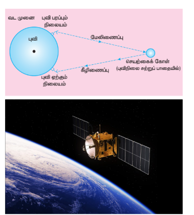
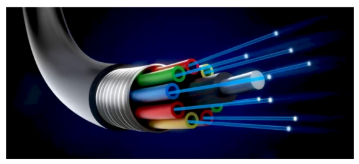
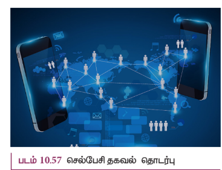

## 10.12 சில முக்கிய தகவல் தொடர்பு அமைப்புகள்

தேவைகளுக்கு ஏற்ப பல்வேறு வகையான தகவல் தொடர்பு அமைப்புகள் நடைமுறையில் காணப்படுகின்றன. இங்கு சில முக்கிய தகவல் தொடர்பு அமைப்புகள் அறிமுகம் செய்யப்பட்டு அவற்றின் பயன்பாடுகள் சுருக்கமாக விவாதிக்கப்பட்டுள்ளன.

### 10.12.1 செயற்கைக்கோள் மற்றும் செயற்கைக்கோள் தகவல்தொடர்பு (SATELLITE AND ITS COMMUNICATION)

செயற்கைக்கோள் தகவல்தொடர்பானது செயற்கைக்கோள் வழியாக பரப்பி மற்றும் ஏற்பி இடையே சைகையைப் பரிமாற்றும் தகவல்தொடர்பின் ஒரு வகையாகும். தகவல் சைகையானது நிலையத்தில் இருந்து, வானில் நிலை கொண்டுள்ள செயற்கைக்கோளுக்கு **மேலிணைப்பு** (Uplink) (அதிர்வெண் பட்டை 6 GHz) ஒன்றின் வாயிலாகப் பரப்பப்படுகிறது. பின்னர் அங்குள்ள **டிரான்ஸ்பாண்டர்** என்ற கருவியால் பெருக்கப்பட்டு, **கீழிணைப்பு** (Downlink) (அதிர்வெண் பட்டை 4 GHz) வாயிலாக மற்றொரு நிலையத்திற்கு மீண்டும் பரப்பப்படுகிறது (படம் 10.55).

**பயன்பாடுகள்**

செயற்கைக்கோள்கள் அவற்றின் பயன்பாடுகள் அடிப்படையில் பல்வேறு வகைகளாகப் பிரிக்கப்பட்டுள்ளன.

i) **வானிலை செயற்கைக்கோள்கள்:** இவை புவியின் வானிலை மற்றும் தட்பவெப்பநிலையைக் கண்காணிக்கப் பயன்படுகின்றன. மேகங்களின் நிறையை அளப்பதன் மூலம் மழை, அபாயகரமான சூறாவளி மற்றும் புயல்கள் ஆகியவற்றை முன்கணிப்பு செய்வதற்கு இந்தச் செயற்கைக்கோள்கள் நமக்கு உதவுகின்றன.

ii) **தகவல்தொடர்பு செயற்கைக்கோள்கள்:** இவை தொலைக்காட்சி, வானொலி, இணையச் சைகைகள் ஆகியவற்றைப் பரப்புவதற்குப் பயன்படுகின்றன. கண்டத் தொலைவுக்குப் பரப்ப, ஒன்றுக்கு மேற்பட்ட செயற்கைக்கோள்கள் பயன்படுத்தப்படுகின்றன.

iii) **வழிநடத்தும் செயற்கைக்கோள்கள்:** கப்பல்கள், விமானங்கள் அல்லது வேறு எந்த பொருளின் புவிசார் அமைவிடத்தைக் கண்டறியும் பணிகள் இவை ஈடுபடுகின்றன.

### 10.12.2 ஒளி இழைத் தகவல்தொடர்பு (FIBRE OPTIC COMMUNICATION)

ஓரிடத்தில் இருந்து மற்றொரு இடத்திற்கு ஒளி இழையின் வழியாக, ஒளித்துடிப்புகளின் மூலம் தகவல்களைப் பரப்பும் முறை ஒளி இழைத் தகவல்தொடர்பு எனப்படும். இது முழு அக எதிரொளிப்புத் தத்துவத்தின் அடிப்படையில் செயல்படுகிறது.

**பயன்பாடுகள்**

ஒளி இழை அமைப்பு பல்வேறு பயன்பாடுகளைக் கொண்டுள்ளது. அவை சர்வதேச தகவல்தொடர்பு, நகரங்கள் இடையே தகவல்தொடர்பு, தரவு இணைப்புகள், ஆலை மற்றும் போக்குவரத்துக் கட்டுப்பாடு மற்றும் இராணுவப் பயன்பாடுகள் ஆகியவை ஆகும்.

**நன்மைகள்**

i) ஒளி இழைகள் மிகவும் மலிவானது. தாமிர வடங்களை விட குறைவான எடை கொண்டவை.

ii) இந்த அமைப்பு மிக அதிக பட்டை அகலத்தைக் கொண்டுள்ளது. இதன் பொருள்: தகவல் சுமந்து செல்லும் திறன் அதிகம் என்பதாகும்.

iii) ஒளி இழை அமைப்பு மின் இடையூறுகளால் பாதிக்கப்படுவதில்லை.

iv) தாமிர வடங்களை விட ஒளி இழை மலிவானது.

**குறைபாடுகள்**

i) தாமிரக் கம்பிகளுடன் ஒப்பிடும்போது ஒளி இழை வடங்கள் எளிதில் உடையக் கூடியவை.

ii) இதன் தொழில்நுட்பம் விலையுயர்ந்தது ஆகும்.

### 10.12.3 ரேடார் மற்றும் அதன் பயன்பாடுகள் (RADAR AND APPLICATIONS)

**ரேடார்** (RADAR) என்பது **RAdio Detection And Ranging** என்ற சொற்றொடரின் சுருக்கமாகும். இது தகவல்தொடர்பு அமைப்புகளின் பயன்பாடுகளில் முக்கியமான ஒன்றாகும். இது வானூர்தி, கப்பல்கள், விண்கலன் ஆகிய தொலைதூரப் பொருட்களைக் கண்டுணர்வதற்கு மற்றும் அவற்றின் இருப்பிடத்தை அறிவதற்குப் பயன்படுகிறது. நமது கண்ணிற்குப் புலப்படாத பொருட்களின் கோணம், தொலைவு மற்றும் திசைவேகம் ஆகியவற்றை ரேடார் மூலம் கண்டறியலாம்.

ரேடார் ஆனது தகவல்தொடர்புக்கு மின்காந்த அலைகளைப் பயன்படுத்துகிறது. முதலில் மின்காந்த சைகையானது விண்ணலைக்கம்பி மூலம் வெளியின் அனைத்து திசைகளிலும் பரப்பப்படுகிறது. குறிப்பிட்ட இலக்குப் பொருளின் மீது மோதும் சைகையானது எதிரொளிக்கப்பட்டு, எல்லா திசைகளிலும் மீண்டும் பரப்பப்படுகிறது. இந்த எதிரொளிக்கப்பட்ட சைகை (எதிரொளி), ரேடார் விண்ணலைக்கம்பியால் பெறப்பட்டு ஏற்பிக்கு அளிக்கப்படுகிறது.

பிறகு அது செயல்முறைப்படுத்தப்பட்டு, பெருக்கப்பட்டு பொருளின் புவிசார் புள்ளிவிவரங்கள் கண்டறியப்படுகின்றன. சைகையானது ரேடாரில் இருந்து இலக்குப் பொருளுக்குச் சென்று, மீண்டும் திரும்பி வருவதற்கு எடுத்துக்கொள்ளும் நேரத்தில் இருந்து இலக்குகளின் நெடுக்கம் கண்டறியப்படுகிறது.

**பயன்பாடுகள்**

ரேடார்கள் அனேக துறைகளில் பயன்படுகிறது.

i) இராணுவத்தில், இலக்குகளை இடம் காணவும், கண்டறியவும் பயன்படுகின்றன.

ii) கப்பல் மூலம் கடல் பரப்பில் தேடுதல், வான் தேடுதல் மற்றும் ஏவுகணை வழிநடத்தும் அமைப்பு போன்ற வழிகாட்டும் அமைப்புகளில் பயன்படுகிறது.

iii) மழைப்பொழிவு வீதம் மற்றும் காற்றின் வேகம் ஆகியவற்றை அளவிட்டு, வானிலை கண்காணிப்பில் ரேடார் பயன்படுகின்றது.

iv) அவசரகால சூழ்நிலைகளில், மக்களின் இருப்பிடத்தைக் கண்டறிந்து, அவர்களை மீட்கும் பணியில் உதவுகிறது.

### 10.12.4 செல்பேசி தகவல்தொடர்பு (MOBILE COMMUNICATION)

செல்பேசி தகவல் தொடர்பானது கம்பிகள் அல்லது கம்பிவடங்கள் போன்ற எந்த இணைப்புகளும் இன்றி வெவ்வேறு இடங்களில் உள்ளவர்களுடன் தொடர்பு கொள்ள உதவுகிறது. அதிகமான பரப்பிற்கு இணைப்பு இன்றியே பரப்புகையை அனுமதிக்கிறது. வீடு, அலுவலகம் போன்ற குறிப்பிட்ட இடத்தில் இருந்து மட்டுமல்லாமல், எந்த இடத்திலிருந்தும் பிறருடன் தொடர்பு கொள்ள வழிசெய்கிறது. தொலைதூர இடங்களுக்கும் தகவல்தொடர்பு வசதியை ஏற்படுத்துகிறது.

இது இடம்பெயரும் (roaming) வசதியை அளிக்கிறது. அதாவது தகவல்தொடர்பு முறிவு இன்றி, பயனாளர் ஓரிடத்தில் இருந்து மற்றொரு இடத்திற்கு நகரலாம். இந்தத் தகவல்தொடர்பு வலை அமைப்பை நிறுவுவதற்கு மற்றும் பராமரிப்பதற்கு ஆகும் செலவு குறைவானதாகும்.

**பயன்பாடுகள்:**

i) இது தனிப்பட்ட தகவல்தொடர்புக்கு பயன்படுகிறது. மற்றும் செல்பேசிகளுக்கு உயர் வேகத்தில் குரல் மற்றும் தரவு இணைப்பை வழங்குகிறது.

ii) உலகம் முழுவதும் ஒரு சில வினாடிக்குள் செய்திகளைப் பரப்ப முடியும்.

iii) இணையத்தின் வழியே பொருட்களைப் பயன்படுத்தும் (Internet of Things, IoT) முறையில், ஒரு சாதனத்தின் மூலம் பல்வேறு சாதனங்களைக் கட்டுப்படுத்துவது சாத்தியமாகிறது. எடுத்துக்காட்டு செல்பேசியைப் பயன்படுத்தி, வீட்டு உபயோகப் பொருட்கள் அனைத்தையும் இயக்க முடியும்.

iv) இது கல்வித்துறையில் நவீன வசதிகளுடன் கூடிய வகுப்பறைகள், இணையதளத்தில் பாடம் தொடர்பான குறிப்புகள் கிடைப்பது, மாணவர்களின் செயல்பாடுகளைக் கவனித்தல் ஆகியவற்றில் பயன்படுகிறது.

### 10.12.5 இணையம் (INTERNET)

இணையம் என்பது தகவல்தொடர்பு அமைப்பில் பன்முகத்தன்மை கொண்ட கருவிகளுடன் வளர்ந்து வரும் ஒரு தொழில்நுட்பம் ஆகும். அது மக்களுடன் தொடர்பு கொள்ள புதிய வழிமுறைகளை வழங்குகிறது. இணையம் என்பது இலட்சக்கணக்கான மக்களை கணினி வழியே இணைக்கும், உலகளவில் அங்கீகரிக்கப்பட்டுள்ள மிகப்பெரும் கணினி வலை அமைப்பாகும். அது வாழ்க்கையின் அனைத்து நடைமுறைகளிலும் ஏராளமான பயன்பாடுகளைக் கொண்டுள்ளது.

**பயன்பாடுகள்**

i) **தேடுபொறி:** உலகளாவிய வலைத்தளங்களில் தகவல்களைத் தேடுவதற்குப் பயன்படும் இணையச் சேவைக் கருவியானது, தேடுபொறி எனப்படும்.

ii) **தகவல்தொடர்பு:** இ-மெயில், உடனடிச் செய்திச் சேவைகள் மற்றும் சமூக வலைத்தளங்கள் மூலம், இலட்சக்கணக்கான மக்கள் ஒன்றிணைந்து தொடர்பு கொள்வதற்கு இணையம் உதவுகிறது.

iii) **மின்-வணிகம்:** எலக்ட்ரானிய வலைத்தளம் மூலம் பொருட்களை வாங்குதல், விற்றல், சேவைகளைப் பெறுதல் மற்றும் நிதி பரிமாற்றம் ஆகிய செயல்பாடுகளில் இணையம் பயன்படுகிறது.

## பாடச்சுருக்கம்

- திண்மங்களில் உள்ள ஆற்றல் பட்டைகள் மூலம் அவை கடத்திகள், காப்பான்கள் மற்றும் குறைகடத்திகள் என வகைப்படுத்தப்படுகின்றன.

- N வகை குறைகடத்தியில் எலக்ட்ரான்கள் பெரும்பான்மை ஊர்திகளாகவும் துளைகள் சிறுபான்மை ஊர்திகளாகவும் உள்ளன.

- P வகை குறைகடத்தியில் துளைகள் பெரும்பான்மை ஊர்திகளாகவும், எலக்ட்ரான்கள் சிறுபான்மை ஊர்திகளாகவும் உள்ளன.

- சந்திக்கு அருகில் மின்னூட்டங்களற்ற [கட்டுறா எலக்ட்ரான்கள் மற்றும் துளைகள்] மெல்லிய பகுதி இயக்கமில்லாப் பகுதி எனப்படும்.

- PN சந்தி டையோடு முன்னோக்குச் சார்பில் இருக்கும்போது, இயக்கமில்லாப் பகுதியின் அகலம் குறைந்து, மின்னோட்டத்தைக் கடத்தும்.

- PN சந்தி டையோடு பின்னோக்குச் சார்பில் இருக்கும்போது திறந்த சாவியாகச் செயல்பட்டு மின்னோட்டத்தைக் கடத்தாது. இயக்கமில்லாப் பகுதியின் அகலம் அதிகரிக்கும்.

- முன்னோக்குச் சார்பில் உள்ள PN சந்தி டையோடு அலை திருத்தியாகச் செயல்படும். மாறுதிசை மின்னழுத்தம் அல்லது மாறுதிசை மின்னோட்டத்தை நேர்திசை மின்னழுத்தம் அல்லது நேர்திசை மின்னோட்டமாக மாற்றும் செயல் முறை திருத்துதல் எனப்படும்.

- அரை அலை திருத்தி உள்ளீடு சைகையின் அரை அலையை மட்டும் திருத்தித் துடிக்கும் DC வெளியீட்டை உருவாக்கும்.

- முழு அலை திருத்தி உள்ளீட்டின் இரு அரை அலைகளையும் திருத்தும்.

- மிக வலிமையான மின்புலம் செலுத்தப்படும்போது, செனார் முறிவானது அதிக அளவு மாசூட்டப்பட்ட PN சந்தி டையோடில் நடைபெறுகிறது.

- சரிவு முறிவானது குறைவாக மாசூட்டப்பட்டு மிக அகலமான இயக்கமில்லாப் பகுதியில் நடைபெறுகிறது. வெப்பத்தினால் உருவாக்கப்பட்ட சிறுபான்மை ஊர்திகளால் சகப்பிணைப்பு முறிக்கப்படும்போது இது நடைபெறுகிறது.

- செனார் டையோடு என்பது, மிக அதிகமாக மாசூட்டப்பட்டுப் பின்னோக்குச் சார்பில் செயல்படும் p-n சந்தி டையோடு ஆகும்.

- ஒளி உமிழ்வு டையோடு என்பது கட்புலனாகும் அல்லது கட்புலனாகாத ஒளியை உமிழும் முன்னோக்குச் சார்பில் அமைந்த குறைகடத்தி சாதனமாகும். பெரும்பான்மை ஊர்திகள் தங்களது பகுதிக்கு நுழையும் சிறுபான்மை ஊர்திகளுடன் மறு இணைப்பு மேற்கொள்வதால் ஆற்றலானது ஃபோட்டான் வடிவில் உமிழப்படும்.

- ஒளி சைகைகளை மின் சைகைகளாக மாற்றும் PN சந்தி டையோடு ஒளி டையோடு எனப்படும்.

- போதுமான ஆற்றல் கொண்ட ஃபோட்டான் டையோடு மீது படும்போது, எலக்ட்ரான் துளை ஜோடியை உருவாக்கும். இந்த எலக்ட்ரான்களும் துளைகளும் மறு இணைப்பு அடைவதற்கு முன்பே, பின்னோக்குச் சார்பினால் ஏற்படுத்தப்பட்ட மின் புலத்தினால் சந்திக்குக் குறுக்கே நகர்த்தப்பட்டு, அதனால் ஒளி மின்னோட்டம் உற்பத்தி செய்யப்படுகிறது.

- சூரிய மின்கலன் என்பது, ஒளி ஆற்றலை நேரடியாக மின் ஆற்றலாக மாற்றும் சாதனம். இது ஒளி வோல்டா விளைவின் அடிப்படையில் செயல்படும்.

- இருமுனை சந்தி டிரான்சிஸ்டர் (BJT) என்பது குறைக்கடத்தி கருவியாகும். NPN மற்றும் PNP என இரு வகைகள் உள்ளன.

- ஒரு BJT-க்கு மூன்று நிலை அமைப்புகள் உள்ளன. அவை பொது அடிவாய், பொது உமிழ்ப்பான் மற்றும் பொது ஏற்பான் ஆகும்.

- பொது அடிவாய் நிலை அமைப்பில், மின்னோட்டப் பெருக்கம் \( \alpha \) என்பது ஏற்பான் மின்னோட்டம் மற்றும் உமிழ்ப்பான் மின்னோட்டத்தின் விகிதம் ஆகும்.

- பொது உமிழ்ப்பான் நிலை அமைப்பில் மின்னோட்டப் பெருக்கம் \( \beta \) என்பது ஏற்பான் மின்னோட்டம் மற்றும் அடிவாய் மின்னோட்டம் ஆகியவற்றின் விகிதம் ஆகும்.

- பொது உமிழ்ப்பான் நிலை அமைப்பிலுள்ள டிரான்சிஸ்டரானது சாவியாகச் செயல்படும்.

- பொது உமிழ்ப்பான் நிலை அமைப்பிலுள்ள டிரான்சிஸ்டரானது, பெருக்கியாகச் செயல்படும். மேலும், பெருக்கப்பட்ட வெளியீட்டுச் சைகைக்கும் உள்ளீடு சைகைக்கும் இடையே \( 180^\circ \) கட்ட வேறுபாடு ஏற்படும்.

- ஒரு தொடுச் சுற்று மற்றும் நேர் பின்னூட்டம் இணைந்த ஒரு டிரான்சிஸ்டர் பெருக்கி அலை இயற்றியாகச் செயல்படும்.

- லாஜிக் கேட் என்பது உள்ளீடுகளின் சேர்க்கைக்கு ஏற்ப வெளியீட்டைத் தரும் தர்க்க சுற்றுகளாகும்.

- டி மார்கனின் முதல் தேற்றத்தின்படி, இரு லாஜிக் உள்ளீடுகளின் கூடுதலின் நிரப்பியானது அவற்றின் நிரப்பிகளின் பெருக்கல் பலனுக்குச் சமமாகும்.

- டி மார்கனின் இரண்டாவது தேற்றத்தின்படி, இரு உள்ளீடுகளின் பெருக்கல் பலனின் நிரப்பியானது அதன் நிரப்பிகளின் கூடுதலுக்குச் சமமாகும்.

- நீண்ட தொலைவுக்கு மின்காந்த அலைகளைப் பயன்படுத்தி ஒரு சைகையைப் பரப்பவும், ஏற்கவும் தேவையான அடிப்படை உறுப்புகள் வருமாறு: திறன் மாற்றி, பெருக்கி, ஊர்தி சைகை, பண்பேற்றி, திறன் பெருக்கி, பரப்புகை ஊடகம், பரப்பும் மற்றும் ஏற்கும் விண்ணலைக்கம்பி, பண்பிறக்கி, பகுப்பான்.

- நீண்ட தொலைவு பரப்புகைக்கு அடிக்கற்றை சைகையை ஊர்தி சைகையுடன் பண்பேற்றம் செய்யப்படுகிறது.

- அடிக்கற்றை சைகையின் கணநேர வீச்சிற்கு ஏற்ப ஊர்தி சைகையின் வீச்சு மாற்றப்பட்டால் அது வீச்சுப் பண்பேற்றம் எனப்படும்.

- அதிர்வெண் பண்பேற்றத்தில், அடிக்கற்றை சைகையின் கணநேர வீச்சிற்கு ஏற்றாற்போல் ஊர்தி சைகையின் அதிர்வெண் மாற்றப்படுகிறது.

- கட்டப் பண்பேற்றத்தில், அடிக்கற்றை சைகையின் கணநேர வீச்சானது ஊர்தி சைகையின் கட்டத்தை மாற்றுகிறது மற்றும் ஊர்தி அலையின் வீச்சு மற்றும் அதிர்வெண் மாறுவதில்லை.

- பரப்பியினால் பரப்பப்பட்ட மின்காந்த அலைகள் ஏற்பியைச் சென்றடைய புவியின் தரையை தழுவிக்கொண்டு சென்றால், இந்தப் பரவல் தரை அலைப் பரவல் எனப்படும்.

- விண்ணலைக்கம்பியிலிருந்து அதிக கோணத்தில் மேல்நோக்கி பரப்பப்பட்ட மின்காந்த அலைகள் மீண்டும் புவியை நோக்கி அயனிமண்டலத்தால் எதிரொளிக்கப்படுகின்றன. இந்த வகையான பரப்புகை வான் அலை பரவல் எனப்படுகிறது.

- தகவல் சைகையை வெளியின் வழியே அனுப்பும் மற்றும் பெறும் செயல்முறை வெளி அலைப் பரவல் எனப்படும்.

- செயற்கைக்கோள் தகவல்தொடர்பானது செயற்கைக்கோள் வழியாக பரப்பி மற்றும் ஏற்பி இடையே சைகையைப் பரிமாற்றும் தகவல்தொடர்பின் ஒரு வகையாகும்.

- ஓரிடத்தில் இருந்து மற்றொரு இடத்திற்கு ஒளி இழையின் வழியாக, ஒளித்துடிப்புகளின் மூலம் தகவல்களைப் பரப்பும் முறை ஒளி இழைத் தகவல்தொடர்பு எனப்படும்.

- ரேடார் (RADAR) என்பது RAdio Detection And Ranging என்ற சொற்றொடரின் சுருக்கமாகும். இது தகவல்தொடர்பு அமைப்புகளின் பயன்பாடுகளில் முக்கியமான ஒன்றாகும்.

- செல்பேசி தகவல்தொடர்பானது கம்பிகள் அல்லது கம்பிவடங்கள் போன்ற எந்த இணைப்புகளும் இன்றி வெவ்வேறு இடங்களில் உள்ளவர்களுடன் தொடர்பு கொள்ள உதவுகிறது.

## கருத்து வரைபடம்

