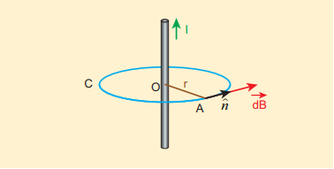
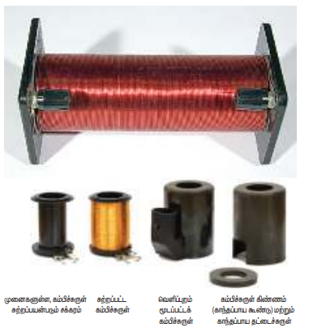
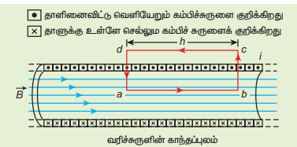

### 3.9 ஆம்பியரின் சுற்று விதி

சமச்சீர் (Symmetry) கொண்ட மின்னோட்ட அமைப்புகள் உள்ள கணக்குகளில், புள்ளி ஒன்றில் காந்தப்புலத்தைக் கணக்கிட ஆம்பியரின் சுற்று விதி பயன்படுகிறது. நிலை மின்னியலில் பயன்படுத்தப்படும் காஸ் விதியைப் போன்றதே ஆம்பியரின் சுற்று விதியாகும்.

#### 3.9.1 ஆம்பியரின் சுற்று விதி வரையறை மற்றும் விளக்கம்

**ஆம்பியரின் விதி :** ஒரு மூடிய வளையத்தின் மீதுள்ள காந்தப்புலத்தின் கோட்டு வழித்தொகையீட்டு மதிப்பு (Value of line integral) அவ்வளையத்தினால் மூடப்பட்ட நிகர மின்னோட்டத்தின் \(\mu_0\) மடங்கிற்குச் சமம்.

\[
\oint \vec{B} \cdot d\vec{l} = \mu_0 I_{\text{மூடப்பட்ட}}
\qquad (3.51)
\]

இங்கு \(I_{\text{மூடப்பட்ட}}\) என்பது மூடப்பட்ட வளையத்தின் வழியாகச் செல்லும் நிகர மின்னோட்டமாகும். கோட்டு வழித்தொகையீடு பாதையின் வடிவத்தையோ அல்லது காந்தப்புலத்துடன் உள்ள கடத்தியின் நிலையையோ சார்ந்ததில்லை என்பதை கவனிக்கவும்.

#### 3.9.2 ஆம்பியரின் விதியைப் பயன்படுத்தி மின்னோட்டம் பாயும் முடிவிலா நீளம் கொண்ட கம்பியினால் ஏற்படும் காந்தப்புலம்

முடிவிலா நீளம் கொண்ட \(I\) மின்னோட்டம் பாயும் நேரான கடத்தி ஒன்றைக் கருதுக. படம் 3.37 இல் காட்டியுள்ளவாறு காந்தப்புலக் கோடுகளின் திசை உள்ளது.

நுண்ணளவில் பார்க்கும்போது கம்பி உருளை வடிவிலும், அச்சினைப் பொறுத்து சமச்சீராகவும் உள்ளது. எனவே கடத்தியின் மையத்திலிருந்து \(r\) தொலைவில் வட்ட வடிவிலான ஆம்பியரின் வளையத்தை உருவாக்கலாம்.

\[
\oint \vec{B} \cdot d\vec{l} = \mu_0 I
\]

இங்கு \(d\vec{l}\) என்பது ஆம்பியரின் வளையம் வழியே செல்லும் வரிக்கூறாகும் (line element) (வட்ட வளையத்தின் தொடுகோடு). எனவே, காந்தப்புல வெக்டருக்கும் வரிக்கூறுக்கும் இடையே உள்ள கோணம் சுழியாகும். ஆகையால்

\[
\oint B dl = \mu_0 I
\]

இங்கு \(I\) என்பது ஆம்பியரின் வளையத்தால் சூழப்பட்ட மின்னோட்டத்தைக் குறிக்கும். சமச்சீரின் விளைவாக ஆம்பியரின் வளையம் முழுவதும் காந்தப்புலத்தின் எண்மதிப்பு மாறாமல் இருக்கும். எனவே \(B\) ஐ தொகையீட்டுக்கு வெளியே எடுக்கலாம்.

\[
B \oint dl = \mu_0 I
\]

ஆம்பியர் வளையத்தின் சுற்றளவு \(2\pi r\). இதிலிருந்து

\[B \int_{0}^{2\pi} dl = \mu_0 I\]

\[
B \cdot 2\pi r = \mu_0 I
\]

\[
B = \frac{\mu_0 I}{2\pi r}
\]

வெக்டர் வடிவில் காந்தப்புலம்

\[
\vec{B} = \frac{\mu_0 I}{2\pi r} \hat{n}
\qquad (3.36)
\]

இங்கு \(\hat{n}\) என்பது படம் 3.37 இல் காட்டியுள்ளவாறு தொடுகோட்டின் வழியே ஆம்பியரின் வளையத்திற்குச் செல்லும் ஒரலகு வெக்டராகும்.

**எடுத்துக்காட்டு 3.15**

1 A மின்னோட்டம் பாயும், நீண்ட நேரான கம்பியிலிருந்து 1 m தொலைவில் ஏற்படும் காந்தப்புலத்தின் எண்மதிப்பைக் கணக்கிடுக. இதை புவி காந்தப்புலத்துடன் ஒப்பிடுக.

**தீர்வு**

கொடுக்கப்பட்டவை \(I = 1\) A மற்றும் ஆரம் \(r = 1\) m

\[
B_{\text{நேரான்கம்பி}} = \frac{\mu_0 I}{2\pi r} = \frac{4\pi \times 10^{-7} \times 1}{2\pi \times 1} = 2 \times 10^{-7} \text{ T}
\]

ஆனால் புவி காந்தப்புலம் \(B_{\text{புவி}} \approx 10^{-5}\) T

எனவே \(B_{\text{நேரான்கம்பி}}\) ஆனது \(B_{\text{புவி}}\) யை விட நூறில் ஒரு பங்கு குறைவாகும்.

**வரிச்சுருள்**

வரிச்சுருள் என்பது, சுருள் வடிவில் நெருக்கமாகச் சுற்றப்பட்ட நீண்ட கம்பிச்சுருளாகும். இது படம் 3.38 இல் காட்டப்பட்டுள்ளது. வரிச்சுருளின் வழியே மின்னோட்டம் பாயும்போது காந்தப்புலம் உருவாகும். வரிச்சுருளின் மொத்த காந்தப்புலம் அதன் ஒவ்வொரு சுற்றுகளின் காந்தப்புலங்களும் ஒன்றுடன் ஒன்று மேற்பொருந்துவதால் ஏற்படுகிறது. வரிச்சுருளினால் ஏற்படும் காந்தப்புலத்தின் திசையை வலதுகை விதியிலிருந்து அறியலாம்.

வரிச்சுருளின் உள்ளே காந்தப்புலம் கிடைமட்டமாக சீராக இருக்கும். மேலும் இது வரிச்சுருளின் அச்சுக்கு இணையாகக் காணப்படும். ஆனால், வரிச்சுருளுக்கு வெளியே காந்தப்புலம் புறக்கணிக்கத்தக்க அளவு சிறிய மதிப்புடையதாகக் காணப்படும். வரிச்சுருளின் வழியே பாயும் மின்னோட்டத்தின் திசையைப் பொறுத்து வரிச்சுருளின் ஒரு முனை வடமுனை போன்றும், மற்றொரு முனை தென்முனை போன்றும் செயல்படும்.

ஒரு மின்னோட்டம் பாயும் வரிச்சுருளை வலதுகையால் பற்றிப் பிடிக்கும்போது மற்ற விரல்கள் மின்னோட்டம் பாயும் திசையில் சுற்றியிருந்தால், நீட்டப்பட்ட பெருவிரல் மின்னோட்டம் பாயும் வரிச்சுருளினால் ஏற்படும் காந்தப்புலத்தின் திசையைக் காட்டும்.

#### 3.9.3 மின்னோட்டம் பாயும் நீண்ட வரிச்சுருளினால் ஏற்படும் காந்தப்புலம்

\(L\) நீளமும் \(N\) சுற்றுகளும் கொண்ட நீண்ட வரிச்சுரள் ஒன்றைக் கருதுவோம். வரிச்சுருளின் நீளத்துடன் ஒப்பிடும்போது அதன் விட்டம் மிகவும் சிறியது. மேலும் கம்பிச்சுருள் மிக நெருக்கமாக சுற்றப்பட்டுள்ளது.

வரிச்சுருளின் உள்ளே ஏதேனும் ஒரு புள்ளியில் காந்தப்புலத்தைக் கணக்கிட ஆம்பியரின் சுற்று விதியைப் பயன்படுத்தலாம். படம் 3.41 இல் காட்டியுள்ளவாறு செவ்வக வடிவ ஒரு சுற்று \(abcd\) ஐக் கருதுக. ஆம்பியரின் சுற்று விதியிலிருந்து

\[
\oint \vec{B} \cdot d\vec{l} = \mu_0 I_{\text{மூடப்பட்ட}}
\]

\[
= \mu_0 \times (\text{ஆம்பியரின் சுற்றால் சூழப்பட்ட மொத்த மின்னோட்டம்})
\]

சமன்பாட்டின் இடதுகை பக்கத்தினை பின்வருமாறு எழுதலாம்

\[
\int_a^b \vec{B} \cdot d\vec{l} + \int_b^c \vec{B} \cdot d\vec{l} + \int_c^d \vec{B} \cdot d\vec{l} + \int_d^a \vec{B} \cdot d\vec{l} = \mu_0 I_{\text{மூடப்பட்ட}}
\]

\(b-c\) மற்றும் \(d-a\) பக்கங்களின் நீளக்கூறுகள் வரிச்சுருளின் அச்சின் வழியே அமைந்துள்ளது மட்டுமல்லாமல் காந்தப்புலத்திற்கு செங்குத்தாகவும் அமைந்துள்ளன. எனவே,

\[
\int_{b}^{c} \vec{B} \cdot d\vec{l} = \int_{b}^{c} |\vec{B}| \, |\vec{dl}| \cos 90^\circ = 0
\]

\[
\int_{a}^{d} \vec{B} \cdot d\vec{l} = 0
\]

மேலும் வரிச்சுருளுக்கு வெளியேயும் காந்தப்புலம் சுழி. எனவே தொகையீடு \(\int_c^d \vec{B} \cdot d\vec{l} = 0\).

\(ab\) வழியாக உள்ள பாதையின் தொகையீடு

\[
\int_a^b \vec{B} \cdot d\vec{l} = B \int_a^b dl \cos 0^\circ = B \int_a^b dl
\]

இங்கு காட்டப்பட்டுள்ள கோடு \(ab\) இன் நீளம் \(h\) ஆகும். ஆனால் இந்தக் கோட்டின் நீளத்தை நமக்குத்தக்கவாறு தேர்வு செய்து கொள்ளலாம். எனவே வரிச்சுருளின் நீளம் \(L\) க்குச் சமமான பெரிய கோட்டை நாம் தேர்வு செய்யும்போது, தொகையீடு பின்வருமாறு கிடைக்கும்

\[
\int_a^b \vec{B} \cdot d\vec{l} = B L
\]

\(N\) சுற்றுகளுக்கு வரிச்சுருளின் வழியே பாயும் மின்னோட்டம் \(NI\) என்க. எனவே

\[
\int_a^b \vec{B} \cdot d\vec{l} = BL = \mu_0 NI \Rightarrow B = \mu_0 \frac{NI}{L}
\]

ஓரலகு நீளத்திற்கான சுற்றுகளின் எண்ணிக்கை \(n = \frac{N}{L}\). ஆகவே,

\[
B = \mu_0 \frac{nLI}{L} = \mu_0 n I \qquad (3.52)
\]

கொடுக்கப்பட்ட வரிச்சுருளுக்கு \(n\) ஒரு மாறிலி. மேலும் \(\mu_0\) இன் மதிப்பும் ஒரு மாறிலி. ஒரு நிலையான மின்னோட்டத்திற்கு வரிச்சுருளின் உள்ளே ஏற்படும் காந்தப்புலம் சீரானது.

>வரிச்சுருளை மின்காந்தமாகவும் பயன்படுத்தலாம். ஒரு வலிமையான காந்தப்புலத்தை இது உருவாக்கும்.  
இதனை இயக்கவே அல்லது நிறுத்தவே முடியும். நிலையான காந்தத்தைப் பயன்படுத்தி இவ்வாறு நிகழ்த்த முடியாது. வரிச்சுருளின் உள்ளே இரும்புச் சட்டமொன்றை வைப்பதன் மூலம் காந்தப்புலத்தின் வலிமையை மேலும் அதிகரிக்கலாம். எவ்வாறெனில், வரிச்சுருளின் உள்ளேயுள்ள காந்தப்புலம் இரும்புச் சட்டத்தைக் காந்தமாக்கும். எனவே நிகர காந்தப்புலமானது வரிச்சுருளின் உள்ளேயுள்ள காந்தப்புலம் மற்றும் இரும்புச் சட்டம் காந்தமானதால் ஏற்பட்ட காந்தப்புலங்களின் கூடுதலாகும். இப்பண்புகளின் காரணமாகத்தான் பல்வேறு வகையான மின்காந்தங்களை வடிவமைப்பதில் வரிச்சுருள் முக்கியப் பங்காற்றுகிறது.

**எடுத்துக்காட்டு 3.16**
வரிச்சுருளின் உள்ளே ஏற்படும் காந்தப்புலத்தை பின்வரும் நேர்வுகளில் காண்க.  
(அ) சுற்றுகளின் எண்ணிக்கையை மாற்றாமல், நீளம் மட்டும் இருமடங்காக்கும் போது  
(ஆ) சுற்றுகளின் எண்ணிக்கை மற்றும் வரிச்சுருளின் நீளம் இரண்டையும் இருமடங்காக்கும் போது  
(இ) வரிச்சுருளின் நீளத்தை மாற்றாமல், சுற்றுகளின் எண்ணிக்கையை மட்டும் இருமடங்காக்கும் போது  
முடிவுகளை ஒப்பிடுக.

**தீர்வு**
வரிச்சுருளின் உள்ளே ஏற்படும் காந்தப்புலம்  
\[
B_{L,N} = \mu_0 \frac{NI}{L}
\]

(அ) சுற்றுகளின் எண்ணிக்கையை மாற்றாமல், நீளம் மட்டும் இருமடங்காக்கும் போது  
\(L \to 2L\) (நீளம் இருமடங்கு)  
\(N \to N\) (மாறாத சுற்றுகளின் எண்ணிக்கை)  
எனவே, காந்தப்புலம்

MRI (Magnetic Resonance Imaging) என்பது காந்த ஒத்திர்வு பொருட் பிம்பமாகும். தலை, மார்பு, அடிவயிறு மற்றும் இடுப்பெலும்பு போன்றவற்றில் ஏற்படும் அசாதாரணத் தன்மையைக் கண்டறியவும், மருத்துவம் செய்யவும் மருத்துவருக்குத் துணைபுரிகிறது. இது உடலைக் கெடுதல் செய்யாத மருத்துவச் சோதனையாகும். வட்ட வடிவ திறப்பின் உள்ளே நோயாளி படுக்க வைக்கப்படுகிறார். (உண்மையில் மீக்கடத்தியினால் உருவாக்கப்பட்ட வரிச்சுருளின் உட்பகுதியே இத்திறப்பாகும்). மீக்கடத்தியின் வழியே வலிமையான மின்னோட்டம் செலுத்தப்பட்டு வலிமை மிக்க காந்தப்புலம் உருவாக்கப்படுகிறது. இக்காந்தப்புலம் ரேடியோ அதிர்வுத் துடிப்புகளை உருவாக்கி கணினிக்குக் கொடுக்கும். இக்கணினி உடலுறுப்புகளின் பிம்பத்தைக் கொடுக்கிறது. இதன் துணையுடன் மருத்துவர் உடலுறுப்புகளுக்கு சிகிச்சையளிப்பார்.

\[
B_{L,2N} = \mu_0 \frac{2NI}{L} = 2B_{L,N}
\]

மேற்கண்ட முடிவுகளிலிருந்து,

\[
B_{L,2N} > B_{2L,2N} > B_{2L,N}
\]

எனவே, கொடுக்கப்பட்ட மின்னோட்டத்தில், வரிச்சுருளின் அதே நீளத்தில் மிக அதிக எண்ணிக்கையில் நெருக்கமாக சுற்றுகளை அமைத்தால் காந்தப்புலம் அதிகரிக்கும்.

### 3.9.4 வட்ட வரிச்சுருள் (Toroid)

வரிச்சுருளின் இரண்டு முனைகளும் ஒன்றுடன் ஒன்று தொடும் வகையில் வளைக்கப்பட்ட வட்ட அமைப்பே வட்ட வரிச்சுருளாகும். இது ஒரு மூடப்பட்ட வளையம் போன்று காணப்படும். இது படம் 3.42 இல் காட்டப்பட்டுள்ளது. வட்ட வரிச்சுருளின் உள்ளே காந்தப்புலம் மாறாத எண்மதிப்பைப் பெற்றிருக்கும். அதே நேரத்தில் வட்ட வரிச்சுருளின் உட்பகுதியில் (P புள்ளியில்) மற்றும் வெளிப்பகுதியில் (Q புள்ளியில்) காந்தப்புலம் சுழியாகும்.

(அ) வட்ட வரிச்சுருளின் திறந்தவெளி உட்புறப்பகுதி

\(P\) புள்ளியில் ஏற்படும் காந்தப்புலம் \(B_P\) ஐ நாம் கணக்கிட \(r_1\) ஆரமுடைய ஆம்பியரின் சுற்று 1 ஐ புள்ளி \(P\) ஐச் சுற்றி படம் 3.43 இல் காட்டியுள்ளவாறு அமைக்கலாம்.

கணக்கீட்டை எளிமையாக்க ஆம்பியர் சுற்றை வளையமாகக் கருதுவோம். எனவே, வளையத்தின் சுற்றளவு அதன் நீளமாகும்.

\[
L_1 = 2\pi r_1
\]

வளையம் 1 க்கான ஆம்பியரின் சுற்று விதி

\[
\oint \vec{B}_P \cdot d\vec{l} = \mu_0 I_{\text{மூடப்பட்ட}}
\]

இங்கு வளையம் 1 எவ்விதமான மின்னோட்டத்தையும் சூழ்ந்திருக்கவில்லை \(I_{\text{மூடப்பட்ட}} = 0\)

\[
\oint \vec{B}_P \cdot d\vec{l} = 0
\]

புள்ளி \(P\) யில் உள்ள காந்தப்புலம் சுழியானால் மட்டுமே இது சாத்தியமாகும். அதாவது

\[
\vec{B}_P = 0
\]

**(ஆ) வட்ட வரிச்சுருளின் வெளிப்புறத்தில் உள்ள திறந்தவெளிப்பகுதி**

\(Q\) புள்ளியில் உள்ள காந்தப்புலம் \(B_Q\) வைக் கணக்கிட \(Q\) புள்ளியைச் சுற்றி \(r_3\) ஆரமுடைய ஆம்பியரின் வளையம் 3 ஐ அமைக்கலாம்.

\[
L_3 = 2\pi r_3
\]

\[
\oint \vec{B}_Q \cdot d\vec{l} = \mu_0 I_{\text{மூடப்பட்ட}}
\]

இங்கு ஒவ்வொரு சுற்றிலும் தாளின் தளத்தை விட்டு வெளியே வரும் மின்னோட்டம், தாளின் தளத்திற்கு உள்ளே செல்லும் மின்னோட்டத்தினால் சமன்செய்யப்படுகிறது. எனவே, \(I_{\text{மூடப்பட்ட}} = 0\)

\[
\oint \vec{B}_Q \cdot d\vec{l} = 0
\]

புள்ளி \(Q\) வில் உள்ள காந்தப்புலம் சுழியானால் மட்டுமே இது சாத்தியமாகும். அதாவது

\[
\vec{B}_Q = 0
\]

**(இ) வட்ட வரிச்சுருளின் உள்ளே**

\(S\) புள்ளியில் உள்ள காந்தப்புலம் \(B_S\) ஐக் கணக்கிட, \(S\) புள்ளியைச் சுற்றி \(r_2\) ஆரமுடைய ஆம்பியரின் வளையம் 2 ஐ அமைக்கலாம்.

\[
\text{வளையத்தின் நீளம் } L_2 = 2\pi r_2
\]

\[
\oint \vec{B}_S \cdot d\vec{l} = \mu_0 I_{\text{மூடப்பட்ட}}
\]

வட்ட வரிச்சுருளின் வழியே பாயும் மின்னோட்டத்தை \(I\) எனவும் சுற்றுகளின் எண்ணிக்கையை \(N\) எனவும் கொண்டால்

\[
I_{\text{மூடப்பட்ட}} = NI
\]

\[
\oint \vec{B}_S \cdot d\vec{l} = \oint B_S dl \cos \theta = B_S 2\pi r_2
\]

\[
\oint \vec{B}_S \cdot d\vec{l} = \mu_0 NI
\]

\[
B_S = \mu_0 \frac{NI}{2\pi r_2}
\]

ஒரலகு நீளத்திற்கு சுற்றுகளின் எண்ணிக்கை \(n = \frac{N}{2\pi r_2}\), எனவே \(S\) புள்ளியில் உள்ள காந்தப்புலம்

\[
B_S = \mu_0 n I
\qquad (3.53)
\]