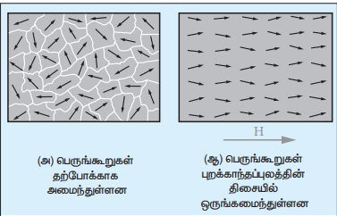
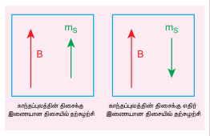
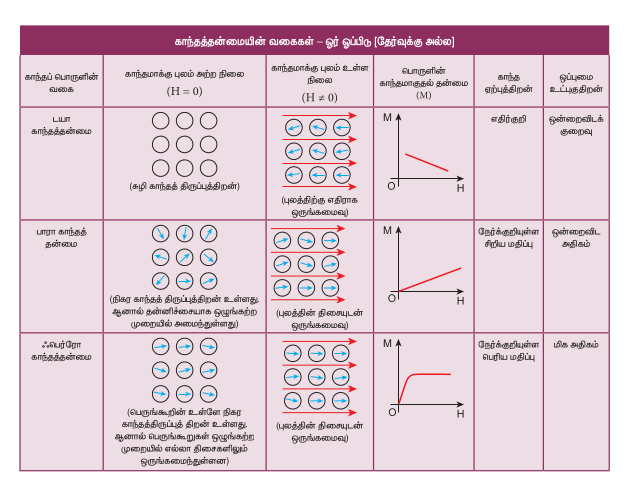

## 3.5 காந்தப்பொருட்களின் வகைப்பாடு

காந்தமாக்கும் புலத்தில் வைக்கப்பட்டுள்ள பொருட்களின் செயல்பாட்டின் அடிப்படையில் அவை மூன்று வகைகளாகப் பிரிக்கப்பட்டுள்ளன. அவை முறையே டயா, பாரா மற்றும் ஃபெர்ரோ காந்தப்பொருட்களாகும். இவற்றைப்பற்றி இப்பகுதியில் அறியலாம்.

**(அ) டயா காந்தப்பொருட்கள் (Diamagnetic materials)**

அணுக்கருவைச் சுற்றியுள்ள எலக்ட்ரான்களின் சுற்றுப்பாதை இயக்கம், சுற்றுப்பாதையின் தளத்திற்குச் செங்குத்தாக ஒரு காந்தப்புலத்தை உருவாக்கும். எனவே, ஒவ்வொரு எலக்ட்ரானும் ஒரு குறிப்பிட்ட அளவு சுற்றுப்பாதை காந்த இருமுனை திருப்புத்திறனைப் (Finite orbital magnetic dipole moment) பெற்றுள்ளது. ஆனால் சுற்றுப்பாதை தளங்கள் தற்போக்காக ஒழுங்கற்ற முறையில் எல்லா திசைகளிலும் அமைந்துள்ளதால், காந்த இருமுனை திருப்புத்திறன்களின் வெக்டர் கூடுதல் சுழியாகும். எனவே எந்த ஒரு அணுவும் தொகுபயன் காந்த இருமுனை திருப்புத்திறனைப் பெற்றிருக்காது.

புறகாந்தப்புலத்தில் இவற்றை வைக்கும்போது, சில எலக்ட்ரான்களின் வேகம் அதிகரிக்கும். சில எலக்ட்ரான்களின் வேகம் குறையும். லென்ஸ் விதியின் அடிப்படையில் இருமுனை திருப்புத்திறன்கள் எதிர் – இணையாக உள்ள எலக்ட்ரான்களின் வேகம் அதிகரிக்கும். இதன் காரணமாக புறகாந்தப்புலத்தின் திசைக்கு எதிராக ஒரு தூண்டப்பட்ட காந்த இருமுனை திருப்புத்திறன் உருவாகிறது. புறகாந்தப்புலம் நீக்கப்பட்ட உடன் இந்த தூண்டப்பட்ட காந்த இருமுனை திருப்புத்திறன் உடனடியாக மறைகிறது.

சீரற்ற காந்தப்புலத்தில் டயா காந்தப்பொருளொன்றை வைக்கும்போது, தூண்டப்பட்ட காந்த இருமுனை திருப்புத் திறனுக்கும் புறகாந்தப்புலத்திற்கும் இடையே ஓர் இடைவினை நடைபெற்று விசை உருவாகிறது. இந்த விசை டயா காந்தப்பொருளை புறகாந்தப்புலத்தின் வலிமை மிக்க பகுதியிலிருந்து, வலிமை குறைந்த பகுதிக்கு நகர்த்த முயற்சிக்கிறது. புறகாந்தப்புலத்தினால் டயா காந்தப்பொருள் விலக்கப்படுவதை இது காட்டுகிறது.

இச்செயலுக்கு டயா காந்தச்செயல் (Diamagnetic action) என்று பெயர். மேலும் இத்தகைய பொருட்களுக்கு டயாகாந்தப்பொருட்கள் (Diamagnetic materials) என்று பெயர். எடுத்துக்காட்டுகள் : பிஸ்மத், தாமிரம் மற்றும் தண்ணீர் மேலும் சில பொருட்கள்.

**டயா காந்தப்பொருட்களின் பண்புகள்**

i) இவை எதிர்க்குறி காந்த ஏற்புத்திறனைப் பெற்றுள்ளன.

ii) இவற்றின் ஒப்புமை காந்த உட்புகுதிறன் ஒன்றைவிட சற்றே குறைவாகும்.

iii) புறகாந்தப்புலத்தில் வைக்கும்போது, காந்தப்புலக் கோடுகள் டயா காந்தப்பொருளினால் விலக்கித் தள்ளப்படுகின்றன.

iv) காந்த ஏற்புத்திறன் கிட்டத்தட்ட வெப்பநிலையைச் சார்ந்ததல்ல.

>மீக்கடத்திகள் முழுமையான குறிப்பு டயா காந்தப்பொருட்களாகும். டயா காந்தப்பொருட்கள் மீக்கடத்திகளாக மாறும்போது மீக்கடத்தியிலிருந்து காந்தப்பாயம் விலக்கித் தள்ளப்படும். இந்நிகழ்வுக்கு மெய்ஸ்னர் (Meissner) விளைவு என்று பெயர். (படம் 3.18 ஐப் பார்க்கவும்)
>

**(ஆ) பாரா காந்தப்பொருட்கள் (Paramagnetic materials)**

சில காந்தப்பொருட்களில் அதன் ஒவ்வொரு அணுவும் அல்லது மூலக்கூறும் நிகர காந்த இருமுனை திருப்புத்திறன்களைப் பெற்றுள்ளன. இதற்குக் காரணம் அணுவிலுள்ள எலக்ட்ரான்களின் சுற்றுப்பாதை மற்றும் தற்சுழற்சி காந்த இருமுனை திருப்புத்திறன்களின் வெக்டர் கூடுதலாகும். இந்த காந்த இருமுனை திருப்புத்திறன்கள் (Spin magnetic dipole moment) தற்போக்காக ஒழுங்கற்ற முறையில் எல்லா திசைகளில் உள்ளதால் பொருளின் நிகர காந்த இருமுனை திருப்புத்திறனின் மதிப்பு சுழியாகும்.

புறகாந்தப்புலத்தில் இவற்றை வைக்கும்போது, அணு இருமுனை மீது செயல்படும் திருப்புவிசை அவற்றை புறகாந்தப்புலத்தின் திசையிலேயே ஒருங்கமைக்க முயலும். இதன் பயனாக ஒரு தொகுபயன் காந்த இருமுனை திருப்புத்திறன் புறகாந்தப்புலத்தின் திசையிலேயே தூண்டப்படும். புறகாந்தப்புலம் உள்ளவரை இந்த தூண்டப்பட்ட இருமுனை திருப்புத்திறன் நீடிக்கும்.

இவற்றை சீரற்ற காந்தப்புலத்தில் வைக்கும்போது, பாரா காந்தப்பொருட்கள் புலத்தின் வலிமை குறைந்த பகுதியிலிருந்து வலிமை மிக்க பகுதிக்கு நகர முயற்சிக்கும். புற காந்தப்புலம் செலுத்தப்படும் திசையில் வலிமையாக காந்தப்பண்பைக் காட்டும் பொருட்களுக்கு பாராகாந்தப்பொருட்கள் என்று பெயர். எடுத்துக்காட்டுகள்: அலுமினியம், பிளாட்டினம், குரோமியம் மற்றும் ஆக்ஸிஜன் மேலும் சில பொருட்கள்.

**பாரா காந்தப்பொருட்களின் பண்புகள்:**

i) இவை குறைந்த நேர்க்குறி காந்த ஏற்புத்திறன் கொண்டவை.

ii) இவற்றின் ஒப்புமை காந்த உட்புகுதிறன் ஒன்றைவிட அதிகம்.

iii) புறகாந்தப்புலத்தில் வைக்கும்போது காந்தப்புலக் கோடுகள் பாரா காந்தப்பொருளின் உள்ளே ஈர்க்கப்படுகின்றன.

iv) காந்த ஏற்புத்திறன் வெப்பநிலைக்கு எதிர்த்தகவாகும்.

**கியூரி விதி (Curie's law)**

வெப்பநிலை அதிகரிக்கும்போது, வெப்ப அதிர்வின் காரணமாக காந்த இருமுனை திருப்புத்திறன்களின் ஒருங்கமைவு (alignment) சிதைந்து விடுகிறது. எனவே வெப்பநிலை அதிகரிப்பால் காந்த ஏற்புத்திறன் குறைகிறது. பெரும்பாலான நிகழ்வுகளில் பொருளின் காந்த ஏற்புத்திறன்

\[
\chi_m \propto \frac{1}{T} \text{ அல்லது } \chi_m = \frac{C}{T}
\]

இத்தொடர்புக்கு கியூரியின் விதி என்று பெயர். இங்கு C என்று கியூரி மாறிலி மற்றும் T என்பது கெல்வின் வெப்பநிலையாகும். காந்த ஏற்புத்திறனுக்கும் வெப்பநிலைக்கும் உள்ள தொடர்பினை படம் 3.19 காட்டுகிறது. இது ஒரு செவ்வக அதிபரவளையம் என்பதை இங்கு கவனிக்க வேண்டும்.

**(இ) ஃபெர்ரோ காந்தப்பொருட்கள் (Ferromagnetic materials)**

பாரா காந்தப்பொருளைப் போன்றே, ஃபெர்ரோ காந்தப்பொருளிலுள்ள ஒரு அணு அல்லது மூலக்கூறு நிகர காந்த இருமுனை திருப்புத்திறனைப் பெற்றுள்ளது. ஃபெர்ரோ காந்தப்பொருட்கள் ஃபெர்ரோ காந்த பெருங்கூறுகள் (domains) எனப்படும் சிறிய பகுதிகளைப் பெற்றுள்ளது. (படம் 3.20) ஒவ்வொரு பெருங்கூறின் உள்ளே உள்ள காந்தத்திருப்புத்திறன்களும் தானாகவே ஒரு குறிப்பிட்ட திசையில் ஒருங்கமைந்துள்ளன. அணுக்களுக்கிடையேயான இடைத்தொலைவைப் பொறுத்து எலக்ட்ரான்களின் தற்சுழற்சியால் ஏற்படும் வலிமையான இடைவினையினால் இந்த ஒருங்கமைவு ஏற்பட்டுள்ளது.

ஒவ்வொரு பெருங்கூறும் ஒரு குறிப்பிட்ட திசையில் காந்தமாக்கப்படுகின்றன. இருந்த போதிலும் ஒவ்வொரு பெருங்கூறின் காந்தமாக்கத்திசையும் ஒன்றிலிருந்து மற்றொன்று வேறுபட்டு தற்போக்காக அமைந்துள்ளன. எனவே பொருளின் நிகர காந்தமாக்கல் சுழியாகும்.

புறகாந்தப்புலத்தில் வைக்கும்போது பின்வரும் இரண்டு நிகழ்வுகள் ஏற்படுகின்றன.

(1) புறகாந்தப்புலத்தின் திசைக்கு இணையாக காந்தத்திருப்புத்திறன்களைப் பெற்றுள்ள பெருங்கூறுகள் அளவில் பெரிதாகும்.

(2) புறகாந்தப்புலத்திற்கு இணையாக இல்லாத மற்ற பெருங்கூறுகள் சுழன்று புறகாந்தப்புலத்தின் திசையில் ஒருங்கமைகின்றன.

இவ்விரண்டு நிகழ்வுகளின் விளைவாக புறகாந்தப்புலத்தின் திசையிலேயே பொருளில் ஒரு வலிமையான நிகர காந்தமாக்கல் ஏற்படுகிறது.

சீரற்ற காந்தப்புலத்தில் ஃபெர்ரோ காந்தப்பொருளை வைக்கும்போது, காந்தப்புலத்தின் வலிமை குறைந்த பகுதியிலிருந்து, வலிமை மிக்க பகுதிக்கு நகர முயற்சிக்கும், புறகாந்தப்புலம் செலுத்தப்படும் திசையில் வலிமையாக காந்தப்பண்பைக் காட்டும் இப்பொருட்களுக்கு ஃபெர்ரோகாந்தப்பொருட்கள் என்று பெயர். எடுத்துக்காட்டுகள் : இரும்பு, நிக்கல் மற்றும் கோபால்ட்.

**ஃபெர்ரோ காந்தப்பொருட்களின் பண்புகள்:**

i) இவற்றின் காந்த ஏற்புத்திறன் நேர்க்குறி மற்றும் அதிக மதிப்புடையது.

ii) ஒப்புமை உட்புகுதிறன் அதிகம்.

iii) புறகாந்தப்புலத்தில் ஃபெர்ரோ காந்தப்பொருளை வைக்கும்போது, காந்தப்புலக் கோடுகள் ஃபெர்ரோ காந்தப்பொருளின் உள்ளே வலிமையாக ஈர்க்கப்படும்.

iv) காந்த ஏற்புத்திறன் வெப்பநிலைக்கு எதிர்த்தகவாகும்.
> **தற்குழற்சி (Spin)**
>
>நிறை, மின்னோட்டம் போன்றே அடிப்படைத் துகள்களின் மற்றொரு பண்பே தற்குழற்சி ஆகும். தற்குழற்சி என்பது குவாண்டம் எந்திரவியல் நிகழ்வாகும் (இது தொகுதி 2 இல் விவாதிக்கப்படுகிறது). பொருட்களின் காந்தப்பண்புக்கு இது ஒரு முக்கிய காரணியாகும். பழைய எந்திரவியலில் (Classical mechanics) நாம் விவரிக்கும் தற்குழற்சி, குவாண்டம் எந்திரவியலின் தற்குழற்சியிலிருந்து முற்றிலும் வேறுபட்டதாகும். குவாண்டம் எந்திரவியலில் கூறப்படும் தற்குழற்சி உண்மையில் சுழற்சியைக் குறிப்பதில்லை. இது உள்ளார்ந்த கோண உந்தத்தைக் குறிக்கிறது. உள்ளார்ந்த கோண உந்தத்தைப் பற்றி பழைய எந்திரவியலில் எவ்வித குறிப்பும் இல்லை. பழங்காலமாக தற்குழற்சி என்பது வழங்கப்படுவதால் இப்பெயரே நிலைத்து விட்டது. துகளின் தற்குழற்சி நேர்க்குறி மதிப்பை மட்டுமே பெறும். ஆனால் புறகாந்தப்புலத்தில் தற்குழற்சி வெக்டரின் ஒருங்கமைவு (Orientation of spin) நேர்க்குறி அல்லது எதிர்க்குறி மதிப்புகளைப் பெறும்.
>
>எடுத்துக்காட்டாக, எலக்ட்ரானின் தற்குழற்சி \( s = \frac{1}{2} \).
>
>புறகாந்தப்புலம் செயல்படும் நிலையில் தற்குழற்சி, காந்தப்புலத்தின் திசைக்கு இணையாகவோ அல்லது எதிர்-இணையாகவோ ஒருங்கமையும். இதிலிருந்து எலக்ட்ரானின் காந்தத் தற்குழற்சி \( m_s \) இரண்டு மதிப்புகளைப் பெறும். அவை முறையே
>
>\[
m_s = +\frac{1}{2} \quad (\text{மேல்நோக்கிய தற்குழற்சி})
\]
>
>\[
m_s = -\frac{1}{2} \quad (\text{கீழ்நோக்கிய தற்குழற்சி})
\]
>
>புரோட்டான் மற்றும் நியூட்ரானின் தற்குழற்சி \( s = \frac{1}{2} \). மேலும் ஃபோட்டானின் தற்குழற்சி \( s = 1 \).
>
>

**கியூரி – வெயிஸ் (Curie-Weiss) விதி**

வெப்பநிலை உயரும்போது, அணு இருமுனைகளின் வெப்பக்கிளர்ச்சி அதிகரிப்பால் ஃபெர்ரோ காந்தத்தன்மை குறையும். ஒரு குறிப்பிட்ட வெப்பநிலையில் ஃபெர்ரோ காந்தப்பொருள் பாரா காந்தப்பொருளாக மாறும். இந்த வெப்பநிலையே, கியூரி வெப்பநிலை (TC) எனப்படும். கியூரி வெப்பநிலையை விட அதிக வெப்பநிலையில் உள்ள பொருளின் காந்த ஏற்புத்திறன்

\[
\chi_m = \frac{C}{T - T_C}
\]

இச்சமன்பாடு கியூரி-வெயிஸ் விதி என்று அழைக்கப்படுகிறது. இங்கு C என்பது கியூரி மாறிலி மற்றும் T என்பது கெல்வின் வெப்பநிலையாகும். படம் 3.22 காந்த ஏற்புத்திறனுக்கும் வெப்பநிலைக்கும் உள்ள தொடர்பைக் காட்டுகின்றது.

