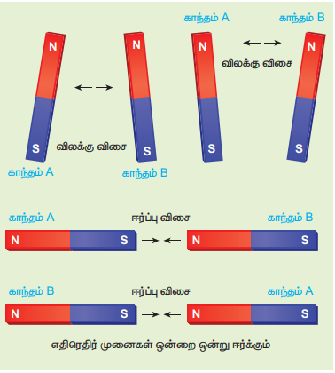
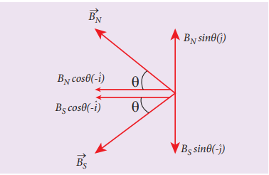

--- 
title: "காந்தவியலின் கூலூம் எதிர்த்தகவு இருமடி விதி"
weight: 2
--- 

## 3.2 காந்தவியலின் கூலும் எதிர்த்தகவு இருமடி விதி

A மற்றும் B என்ற இரண்டு சட்டகாந்தங்களைக் கருதுக. அவை படம் 3.11 இல் காட்டப்பட்டுள்ளன.

காந்தம் A மற்றும் B இவற்றின் வடமுனைகளை அல்லது தென்முனைகளை அருகருகே கொண்டு வரும்போது அவை ஒன்றை ஒன்று விலக்கும். மாறாக காந்தம் A-இன் வடமுனையை B-இன் தென்முனைக்கு அருகே அல்லது B-இன் வடமுனையை A-இன் தென்முனைக்கு அருகே கொண்டு செல்லும்போது அவை ஒன்றை ஒன்று ஈர்க்கும்.

படம் 3.11 மின்துகள்கள் போன்று செயல்படும் காந்தமுனைகள் – ஒத்த முனைகள் ஒன்றை ஒன்று விலக்கும், எதிரதிர் முனைகள் ஒன்றை ஒன்று ஈர்க்கும்

இது, அலகு 1 –இல் நாம் கற்ற நிலையான மின்துகள்களின் (Static charges) கூலும் எதிர்த்தகவு இருமடி விதியினை ஒத்துள்ளதை அறியலாம். (எதிரெதிர் மின்துகள்கள் ஒன்றை ஒன்று ஈர்க்கும் மற்றும் ஒத்த மின்துகள்கள் ஒன்றை ஒன்று விலக்கும்)

எனவே நிலைமின்னியலில் கற்ற கூலும் விதியினைப் போன்றே காந்தவியலில் கூலும் விதியினை பின்வருமாறு வரையறை செய்யலாம் (படம் 3.12)

இரண்டு காந்த முனைகளுக்கு இடையே உள்ள ஈர்ப்புவிசை அல்லது விலக்கு விசை அவற்றின் முனைவலிமைகளின் பெருக்கல் பலனுக்கு நேர்த்தகவிலும் அவற்றிற்கு இடையே உள்ள தொலைவின் இருமடிக்கு எதிர்த்தகவிலும் இருக்கும்.

கணிதவியல் முறையில் பின்வருமாறு நாம் எழுதலாம்

\[
\vec{F} \propto \frac{q_{m_A} q_{m_B}}{r^2} \hat{r}
\]

\[
\vec{F} = k \frac{q_{m_A} q_{m_B}}{r^2} \hat{r} \qquad (3.7)
\]

இங்கு \(q_{m_A}\) மற்றும் \(q_{m_B}\) என்பவை இரண்டு காந்த முனைகளின் முனை வலிமைகளைக் குறிக்கும். \(r\) என்பது இரண்டு காந்த முனைகளுக்கு இடையே உள்ள தொலைவைக் குறிக்கும்.

எண்மதிப்பில்,

\[
F = k \frac{q_{m_A} q_{m_B}}{r^2} \qquad (3.8)
\]

இங்கு \(k\) என்பது விகித மாறிலியாகும். இதன் மதிப்பு காந்த முனைகளை சூழ்ந்துள்ள ஊடகத்தினைப் பொறுத்ததாகும். SI அலகின் அடிப்படையில் வெற்றிடத்தில் \(k\) இன் மதிப்பு

\[
k = \frac{\mu_0}{4\pi} \approx 10^{-7} \text{ H m}^{-1}
\]

இங்கு \(\mu_0\) என்பது வெற்றிடத்தின் அல்லது காற்றின் உட்புகுதிறன் மற்றும் H என்பது henry அலகு ஆகும்.

படம் 3.12 கூலும் விதி – இரண்டு காந்த முனைகளுக்கு இடையே உள்ள விசை

**எடுத்துக்காட்டு 3.5**

காற்றில் வைக்கப்பட்டுள்ள இரண்டு காந்த முனைகளுக்கு இடையே உள்ள விலக்கு விசை \(9 \times 10^{-3}\) N. இரண்டு முனைகளும் சம வலிமைகொண்டவை. மேலும் இரண்டும் 10 cm தொலைவில் பிரித்து வைக்கப்பட்டுள்ளன எனில், ஒவ்வொரு காந்த முனையின் முனைவலிமையைக் காண்க.

**தீர்வு:**

இரண்டு காந்த முனைகளுக்கு இடையே உள்ள விசை

\[
F = k \frac{q_{m_A} q_{m_B}}{r^2}
\]

கொடுக்கப்பட்டவை : \(F = 9 \times 10^{-3} \text{ N}\),

\[
r = 10 \text{ cm} = 10 \times 10^{-2} \text{ m}
\]

எனவே, \(q_{m_A} = q_{m_B} = q_m\)

\[
9 \times 10^{-3} = 10^{-7} \frac{q_m^2}{(10 \times 10^{-2})^2} \Rightarrow q_m = 30 \text{ N T}^{-1}
\]

### 3.2.1 காந்த இருமுனையின் (சட்டகாந்தம்) அச்சுக்கோட்டில் உள்ள ஒரு புள்ளியில் காந்தப்புலம்

NS என்ற சட்டகாந்தம் ஒன்றைக் கருதுக. இது படம் 3.13 இல் காட்டப்பட்டுள்ளது. இங்கு N மற்றும் S என்பவை சட்டகாந்தத்தின் வட மற்றும் தென் முனைகளைக் குறிக்கின்றன. அவற்றின் முனைவலிமை \(q_m\) எனவும் அவற்றிற்கு இடையே உள்ள தொலைவு \(2l\) எனவும் கொள்க. சட்டகாந்தத்தின் வடிவியல் மையம் O விலிருந்து \(r\) தொலைவில் அதன் அச்சுக்கோட்டில் அமைந்த C என்ற புள்ளியில் காந்தப்புலத்தைக் காண்பதற்கு, அப்புள்ளியில் ஓரலகு வடமுனையை (\(q_{mC} = 1 \text{ A m}\)) வைக்க வேண்டும்.

படம் 3.13 காந்த இருமுனையின் அச்சுக்கோட்டில் உள்ள ஒரு புள்ளியில் காந்தப்புலம்

வடமுனையினால் புள்ளி Cல் ஏற்படும் காந்தப்புலம்

\[
\vec{B}_N = \frac{\mu_0}{4\pi} \frac{q_m}{(r-l)^2} \hat{i} \qquad (3.9)
\]

இங்கு \((r-l)\) என்பது சட்டகாந்தத்தின் வடமுனை மற்றும் C புள்ளியில் உள்ள ஓரலகு வடமுனைக்கும் இடையே உள்ள தொலைவாகும்.

தென்முனையினால் புள்ளி Cல் ஏற்படும் காந்தப்புலம்

\[
\vec{B}_S = -\frac{\mu_0}{4\pi} \frac{q_m}{(r+l)^2} \hat{i} \qquad (3.10)
\]

இங்கு \((r+l)\) என்பது சட்டகாந்தத்தின் தென்முனை மற்றும் C புள்ளியில் உள்ள ஓரலகு வடமுனைக்கும் இடையே உள்ள தொலைவாகும்.

புள்ளி Cல் உருவாகும் நிகர காந்தப்புலம்

\[
\vec{B} = \vec{B}_N + \vec{B}_S
\]

\[
\vec{B} = \frac{\mu_0}{4\pi} \frac{q_m}{(r-l)^2} \hat{i} + \left( -\frac{\mu_0}{4\pi} \frac{q_m}{(r+l)^2} \hat{i} \right)
\]

\[
\vec{B} = \frac{\mu_0 q_m}{4\pi} \left( \frac{1}{(r-l)^2} - \frac{1}{(r+l)^2} \right) \hat{i}
\]

\[
\vec{B} = \frac{\mu_0 q_m}{4\pi} \left( \frac{4rl}{(r^2 - l^2)^2} \right) \hat{i}
\]

\[
\vec{B} = \frac{\mu_0}{4\pi} \left( \frac{2r \cdot (q_m \cdot 2l)}{(r^2 - l^2)^2} \right) \hat{i} \qquad (3.11)
\]

காந்த இருமுனை திருப்பத்திறனின் எண்மதிப்பு \(|\vec{p}_m| = p_m = q_m \cdot 2l\). எனவே C புள்ளியில் உள்ள காந்தப்புலத்தை (3.11) பின்வருமாறு எழுதலாம்.

\[
\vec{B} = \frac{\mu_0}{4\pi} \left( \frac{2r p_m}{(r^2 - l^2)^2} \right) \hat{i} \qquad (3.12)
\]

சட்டகாந்தத்தின் வடிவ மையம் O மற்றும் C புள்ளிக்கு இடையே உள்ள தொலைவுடன் ஒப்பிடும்போது, காந்தமுனைகளுக்கு இடையே உள்ள தொலைவு சிறியது எனில் (சிறிய காந்தங்களுக்கு) அதாவது \(r \gg l\) எனில்,

\[
(r^2 - l^2)^2 \approx r^4 \qquad (3.13)
\]

எனவே சமன்பாடு (3.13) ஐ (3.12) இல் பயன்படுத்தும்போது

\[
\vec{B}_{\text{axis}} = \frac{\mu_0}{4\pi} \left( \frac{2p_m}{r^3} \right) \hat{i} = \frac{\mu_0}{4\pi} \frac{2}{r^3} \vec{p}_m \qquad (3.14)
\]

இங்கு \(\vec{p}_m = p_m \hat{i}\)

### 3.2.2 காந்த இருமுனையின் (சட்டகாந்தம்) நடுவரைக் கோட்டில் உள்ள ஒரு புள்ளியில் காந்தப்புலம்

NS என்ற சட்டகாந்தம் ஒன்றை கருதுக. இது படம் 3.14 இல் காட்டப்பட்டுள்ளது. N மற்றும் S என்பவை முறையே சட்டகாந்தத்தின் வட மற்றும் தென்முனைகளைக் குறிக்கின்றன. \(q_m\) முனைவலிமை கொண்ட இவ்விரண்டு காந்த முனைகளுக்கு இடையே உள்ள தொலைவு \(2l\) என்க. சட்டகாந்தத்தின் வடிவ மையம் O விலிருந்து \(r\) தொலைவில் அதன் நடுவரைக்கோட்டில் அமைந்த C என்ற புள்ளியில் காந்தப்புலத்தைக் காண்பதற்கு, அப்புள்ளியில் ஓரலகு வடமுனையை (\(q_{mC} = 1 \text{ A m}\)) வைக்க வேண்டும்.

படம் 3.14 காந்த இருமுனையால் நடுவரைக்கோட்டில் உள்ள ஒரு புள்ளியில் காந்தப்புலம்

வடமுனையால் புள்ளி Cல் உருவாகும் காந்தப்புலம்

\[
\vec{B}_N = -B_N \cos \theta \hat{i} + B_N \sin \theta \hat{j} \qquad (3.15)
\]

இங்கு \(B_N = \frac{\mu_0}{4\pi} \frac{q_m}{r'^2}\), \(r' = (r^2 + l^2)^{\frac{1}{2}}\)

தென்முனையால் புள்ளி Cல் உருவாகும் காந்தப்புலம்

படம் 3.15 விசையின் கூறுகள்

\[
\vec{B}_S = -B_S \cos \theta \hat{i} - B_S \sin \theta \hat{j} \qquad (3.16)
\]

இங்கு \(B_S = \frac{\mu_0}{4\pi} \frac{q_m}{r'^2}\)

சமன்பாடுகள் (3.15) மற்றும் (3.16) இவற்றிலிருந்து C புள்ளியில் ஏற்படும் நிகர காந்தப்புலம் \(\vec{B} = \vec{B}_N + \vec{B}_S\) ஆகும்.

\[
\vec{B} = -(B_N + B_S) \cos \theta \hat{i} \text{ மேலும், } B_N = B_S \text{ எனவே}
\]

\[
\vec{B} = -\frac{2\mu_0}{4\pi} \frac{q_m}{r'^2} \cos \theta \hat{i} = -\frac{2\mu_0}{4\pi} \frac{q_m}{(r^2 + l^2)} \cos \theta \hat{i} \qquad (3.17)
\]

படம் 3.14 -இல் காட்டப்பட்டுள்ள செங்கோண முக்கோணம் NOC இல்

\[
\cos \theta = \frac{\text{செங்குத்துள்ள பக்கம்}}{\text{கர்ணம்}} = \frac{l}{r'} = \frac{l}{(r^2 + l^2)^{\frac{1}{2}}} \qquad (3.18)
\]

சமன்பாடு (3.18) ஐ சமன்பாடு (3.17) இல் பிரதியிட, நமக்குக் கிடைப்பது

\[
\vec{B} = -\frac{\mu_0}{4\pi} \frac{q_m \times (2l)}{(r^2 + l^2)^{\frac{3}{2}}} \hat{i} \qquad (3.19)
\]

காந்த இருமுனைத்திருப்பத்திறனின் எண்மதிப்பு \(p_m = q_m \cdot 2l\). இதனை சமன்பாடு (3.19) இல் பிரதியிட,

\[
\vec{B} = -\frac{\mu_0}{4\pi} \frac{p_m}{(r^2 + l^2)^{\frac{3}{2}}} \hat{i} \qquad (3.20)
\]

சட்டகாந்தம் சிறியதாக இருப்பதால், \(r \gg l\) எனில்,

\[
(r^2 + l^2)^{3/2} \approx r^3 \qquad (3.21)
\]

சமன்பாடு (3.21) ஐ சமன்பாடு (3.20) இல் பிரதியிடும்போது

\[
\vec{B}_{\text{equatorial}} = -\frac{\mu_0}{4\pi} \frac{p_m}{r^3} \hat{i} = -\frac{\mu_0}{4\pi} \frac{\vec{p}_m}{r^3} \qquad (3.22)
\]

இங்கு \(\vec{p}_m = p_m \hat{i}\)

**குறிப்பு:** அச்சுக்கோட்டில் உள்ள காந்தப்புலம் (\(\vec{B}_{\text{axis}}\)) நடுவரைக்கோட்டில் உள்ள காந்தப்புலத்தைப்போன்று (\(\vec{B}_{\text{equatorial}}\)) இருமடங்காக இருக்கும். மேலும் இவ்விரண்டின் திசைகளும் ஒன்றுக்கொன்று எதிரதிரானது.

**எடுத்துக்காட்டு 3.6**

ஒரு சிறிய காந்தத்தின் காந்தத்திருப்புத்திறன் \(0.5 \text{ J T}^{-1}\). சட்டகாந்தத்தின் மையத்திலிருந்து 0.1 m தொலைவில் ஏற்படும் காந்தப்புலத்தின் எண்மதிப்பு மற்றும் திசையை (அ) அச்சுக்கோட்டில் அமைந்த புள்ளியிலும் (ஆ) செங்குத்து இருசமவெட்டியில் அமைந்த புள்ளியிலும் காண்க.

**தீர்வு:**

கொடுக்கப்பட்டவை: காந்தத்திருப்புத்திறன் \(p_m = 0.5 \text{ J T}^{-1}\), தொலைவு \(r = 0.1 \text{ m}\)

**(அ) சிறிய காந்தத்தின் அச்சுக்கோட்டில் அமைந்த புள்ளியில் ஏற்படும் காந்தப்புலம்**

\[
\vec{B}_{\text{axis}} = \frac{\mu_0}{4\pi} \frac{2p_m}{r^3} \hat{i}
\]

\[
\vec{B}_{\text{axis}} = 10^{-7} \times \left( \frac{2 \times 0.5}{(0.1)^3} \right) \hat{i} = 10^{-7} \times \left( \frac{1}{0.001} \right) \hat{i} = 10^{-7} \times 10^3 \hat{i} = 1 \times 10^{-4} \hat{i} \text{ T}
\]

எனவே, அச்சுக்கோட்டில் அமைந்த புள்ளியில் ஏற்படும் காந்தப்புலத்தின் எண்மதிப்பு \(B_{\text{axis}} = 1 \times 10^{-4} \text{ T}\). மேலும் இதன் திசை தெற்கிலிருந்து வடக்கு நோக்கி அமையும்.

**(ஆ) சிறிய காந்தத்தின் செங்குத்து இருசமவெட்டியில் (நடுவரைக் கோட்டில்) ஏற்படும் காந்தப்புலம்**

\[
\vec{B}_{\text{equatorial}} = -\frac{\mu_0}{4\pi} \frac{p_m}{r^3} \hat{i}
\]

\[
\vec{B}_{\text{equatorial}} = -10^{-7} \times \left( \frac{0.5}{(0.1)^3} \right) \hat{i} = -10^{-7} \times \left( \frac{0.5}{0.001} \right) \hat{i} = -10^{-7} \times 500 \hat{i} = -0.5 \times 10^{-4} \hat{i} \text{ T}
\]

எனவே, நடுவரைக்கோட்டில் அமைந்த புள்ளியில் ஏற்படும் காந்தப்புலத்தின் எண்மதிப்பு \(B_{\text{equatorial}} = 0.5 \times 10^{-4} \text{ T}\). மேலும் இதன் திசை வடக்கிலிருந்து தெற்கு நோக்கி அமையும்.

**முடிவு:** அச்சுக்கோட்டின் (\(B_{\text{axis}}\)) எண்மதிப்பு, நடுவரைக் கோட்டின் (\(B_{\text{equatorial}}\)) எண்மதிப்பைப் போன்று இருமடங்காக இருக்கும். மேலும் இவ்விரண்டின் திசைகளும் ஒன்றுக்கொன்று எதிரதிராக அமையும்.