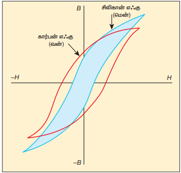
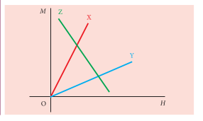

## 3.6 காந்தத்தயக்கம் (HYSTERESIS)

ஃபெர்ரோ காந்தப்பொருளான்றை காந்தமாக்குப் புலத்தில் வைக்கும்போது தூண்டலின் விளைவாக அப்பொருள் காந்தமாக்கப்படும். ஃபெர்ரோ காந்தப்பொருளின் ஒரு முக்கியப் பண்பு: காந்தமாக்குப் புலத்தைப் (H) பொறுத்து காந்தப்புலத்தில் (B) ஏற்படும் மாறுபாடு நேர்ப்போக்கு தன்மையற்றது (Non linear). அதாவது B/H = μ ஒரு மாறிலி அல்ல. இப்பண்பினைப் பற்றி விரிவாகக் காணலாம்.

ஒரு ஃபெர்ரோ காந்தப்பொருள் (எடுத்துக்காட்டாக இரும்பு) காந்தமாக்குப் புலம் H ஆல் மெதுவாக காந்தமாக்கப்படுகின்றது. காந்தமாக்கும் புலத்தின் எண்மதிப்புக்குச் சமமான காந்தப்புலம் B, A புள்ளியிலிருந்து அதிகரித்துக் கொண்டே சென்று தெவிட்டு நிலையை அடைகிறது. பொருளின் இந்த மாற்றம் வரைபடம் 3.23 இல் AC வளைகோட்டுப் பாதையில் குறிப்பிடப்பட்டுள்ளது. காந்தமாக்குப் புலத்தை செலுத்தும்போது பொருள் அடையும் பெரும் காந்தத்தன்மை புள்ளியே தெவிட்டிய காந்தமாதல் (Saturated magnetisation) என்று வரையறுக்கப்படுகிறது.

காந்தமாக்குப் புலத்தை இப்போது குறைக்கும்போது காந்தப்புலமும் குறையும். ஆனால் பழைய பாதையிலேயே CA குறையாது. அது CD என்ற வேறொரு பாதை வழியாக குறையும். காந்தமாக்குப்புலம் சுழி மதிப்பை அடையும்போதும் காந்தப்புலம் சுழியாகாமல், ஒரு நேர்க்குறி மதிப்பைப் பெற்றிருக்கும். \(H = 0\) எனினும் ஒரு குறிப்பிட்ட அளவு காந்தத்தன்மை பொருளில் தொடர்ந்து நீடிப்பதை இது நமக்கு உணர்த்துகிறது.

பொருளில் தொடர்ந்து நீடிக்கும் இந்த எஞ்சிய காந்தத்தன்மைக்கு (AD) காந்தத்தேக்குதன்மை (Remanence) அல்லது காந்தத்தேக்குதிறன் (Retentivity) என்று பெயர். காந்தமாக்குப்புலம் மறைந்த நிலையிலும் காந்தத்தன்மையைத் தக்கவைக்கும் பொருளின் இத்திறமையை காந்தத்தேக்குதன்மை அல்லது காந்தத்தேக்குதிறன் என்று வரையறுக்கலாம்.

பொருளின் காந்தத்தன்மையை நீக்குவதற்காக எதிர்த்திசையில் காந்தமாக்குப் புலத்தை அதிகரிக்க வேண்டும். இப்போது DE பாதையில் காந்தப்புலம் குறைந்த E புள்ளியில் சுழி மதிப்பை அடையும். பொருளின் எஞ்சிய காந்தத்தன்மையை சுழியாக்குவதற்காக எதிர்த்திசையில் செலுத்தப்பட்ட காந்தமாக்குப் புலம் வரைபடத்தில் AE பாதையினால் குறிப்பிடப்பட்டுள்ளது. பொருளின் எஞ்சிய காந்தத்தன்மையை முழுவதும் நீக்குவதற்காக, எதிர்த்திசையில் செலுத்தப்பட்ட காந்தமாக்குப் புலத்தின் எண்மதிப்பே காந்தநீக்குத்திறன் (Coercivity) என்று அழைக்கப்படுகிறது.

\(\vec{H}\) ஐ மேலும் எதிர்த்திசையில் அதிகரிக்கும்போது காந்தப்புலமும் EF பாதையின் வழியே தெவிட்டிய புள்ளி F ஐ அடையும்வரை எதிர்த்திசையில் அதிகரித்துக் கொண்டே செல்லும். எதிர்த்திசையில் காந்தமாக்கும் புலத்தை குறைத்து மீண்டும் அதிகரிக்கும்போது காந்தப்புலம் FGKC என்ற பாதையை மேற்கொள்ளும். ACDEFGKC என்ற மூடப்பட்ட இப்பாதைக்கு காந்தத்தயக்கக் கண்ணி (Hysteresis loop) என்று பெயர். இது பொருளொன்றின் காந்தமாக்கும் சுற்றை காட்டுகிறது.

இம்முழு சுற்றிலும் காந்தப்புலம் B, காந்தமாக்குப்புலம் H ஐ விட பின்தங்கி உள்ளது. காந்தப்புலம், காந்தமாக்குப் புலத்திற்குப் பின்தங்கும் இந்நிகழ்ச்சிக்கு காந்தத்தயக்கம் (Hysteresis) என்று பெயர். தயக்கம் என்றால் பின்தங்குதல் என்று பொருள்.

**தயக்க இழப்பு**

பொருளொன்றில் காந்தமாக்கும் சுற்றின்போது, வெப்ப வடிவில் ஆற்றல் இழக்கப்படும். இவ்வாற்றல் இழப்பிற்குக் காரணம் பல்வேறு திசைகளில் மூலக்கூறுகளின் சுழற்சி மற்றும் ஒருங்கமைவாகும். ஒரு முழுசுற்றில் காந்தமாக்கப்படும் பொருளின் ஓரலகு பருமனுக்கான ஆற்றல் இழப்பு, தயக்கக்கண்ணியின் பரப்புக்கு சமம் எனக் கண்டறியப்பட்டுள்ளது.

**வன் மற்றும் மென் காந்தப்பொருட்கள்**

காந்தத்தயக்கக் கண்ணியின் வடிவம் மற்றும் அளவின் அடிப்படையில் ஃபெர்ரோ காந்தப்பொருட்கள், குறைந்த பரப்புடைய மென்காந்தப்பொருட்கள் மற்றும் அதிக பரப்புடைய வன்காந்தப்பொருட்கள் என வகைப்படுத்தப்பட்டுள்ளன.

இவ்விரண்டு காந்தப் பொருட்களின் தயக்கக் கண்ணிகள் படம் 3.24 இல் ஒப்பிடுக காட்டப்பட்டுள்ளது. மென் மற்றும் வன் காந்தப் பொருள்களின் பண்புகள் அட்டவணை 3.2ல் ஒப்பிடப்பட்டுள்ளது.

**அட்டவணை 3.2 மென் ஃபெர்ரோ காந்தப்பொருட்களுக்கும் வன் ஃபெர்ரோ காந்தப்பொருட்களுக்கும் இடையே உள்ள வேறுபாடுகள்**

| வ.என் | பண்புகள் | மென் ஃபெர்ரோ காந்தப்பொருட்கள் | வன் ஃபெர்ரோ காந்தப் பொருட்கள் |
|---|---|---|---|
| 1 | புற காந்தப்புலத்தை நீக்கும்போது | காந்தத்தன்மை மறைந்துவிடும் | காந்தத்தன்மை மறையாது |
| 2 | தயக்கக்கண்ணியின் பரப்பு | சிறியது | பெரியது |
| 3 | காந்ததேக்குத்திறன் | குறைவு | அதிகம் |
| 4 | காந்தநீக்குத்திறன் | குறைவு | அதிகம் |
| 5 | காந்த ஏற்புத்திறன் மற்றும் காந்த உட்புகுதிறன் | அதிகம் | குறைவு |
| 6 | தயக்க இழப்பு | குறைவு | அதிகம் |
| 7 | பயன்கள் | வரிச்சுருள் உள்ளகம், மின்மாற்றி உள்ளகம் மற்றும் மின்காந்தங்கள் செய்ய பயன்படுகிறது | நிலையான காந்தங்கள் செய்ய பயன்படுகின்றது |
| 8 | எடுத்துக்காட்டுகள் | தேனிருப்பு, மியூமெட்டல், ஸ்டென்லெஸ் ஸ்டீல் மற்றும் சில பொருட்கள் | கார்பன் எஃகு, ஆல்நிக்கோ, காந்தக்கல் (Lode stone) மற்றும் சில பொருட்கள் |

**காந்தத் தயக்கக் கண்ணியின் பயன்பாடுகள்**

ஒவ்வொரு ஃபெர்ரோ காந்தப்பொருளின் காந்த தேக்குத்திறன், காந்த நீக்குத்திறன், காந்த உட்புகுதிறன், காந்த ஏற்புத்திறன் மற்றும் ஒரு முழுசுற்றில் காந்தமாகும்போது ஏற்படும் ஆற்றல் இழப்பு போன்ற தகவல்களை அளிப்பதில் காந்தத் தயக்கக்கண்ணி முக்கியத்துவம் வாய்ந்ததாகும். எனவே ஒரு குறிப்பிட்ட தேவைக்கேற்ப பொருளை தேர்வு செய்வதற்கு காந்தத்தயக்கக்கண்ணியைப் பற்றிய அறிவு அவசியமானதாகும். மேலும் சில உதாரணங்களை இங்கு காண்போம்.

**i) நிலையான காந்தங்கள்:**

அதிக காந்தத்தேக்குத்திறன், அதிக காந்த நீக்குத்திறன் மற்றும் அதிக காந்த உட்புகுதிறன் கொண்ட பொருட்கள் நிலையான காந்தங்களை உருவாக்குவதற்கு மிகவும் ஏற்றதாகும். எடுத்துக்காட்டுகள்: கார்பன் எஃகு மற்றும் ஆல்நிக்கோ

**ii) மின்காந்தங்கள்:**

அதிக தொடக்க காந்த ஏற்புத்திறன், குறைந்த காந்த தேக்குத்திறன், குறைந்த காந்த நீக்குத்திறன் மற்றும் குறைந்த பரப்புடைய மெல்லிய காந்த தயக்கக்கண்ணியைப் பெற்றுள்ள பொருட்கள் மின்காந்தங்கள் செய்ய விரும்பத்தக்கவைகளாகும்.

எடுத்துக்காட்டுகள்: தேனிருப்பு மற்றும் மியூமெட்டல் (நிக்கல்-இரும்பு உலோகக் கலவை).

**iii) மின்மாற்றி உள்ளகம்:**

அதிக தொடக்க காந்த ஏற்புத்திறன், உயர்ந்த காந்தப்புலம் மற்றும் குறைந்த பரப்பு கொண்ட மெல்லிய தயக்கக்கண்ணியைப் பெற்றுள்ள பொருட்கள் மின்மாற்றி உள்ளகங்களை வடிவமைக்க பயன்படுகின்றன. எடுத்துக்காட்டு: தேனிருப்பு

**எடுத்துக்காட்டு 3.11**

X, Y மற்றும் Z என்ற மூன்று காந்தப்பொருட்களின் காந்தமாகும் செறிவு மற்றும் செலுத்தப்படும் காந்தப்புலச் செறிவு இவற்றுக்கிடையேயான வேறுபாட்டை பின்வரும் வரைபடம் காட்டுகிறது. இவ்வரைபடத்தின் உதவியுடன் இம்மூன்று பொருட்களைக் கண்டுபிடி.

**தீர்வு**

M-H வரைபடத்தின் சரிவு காந்த ஏற்புத்திறனைக் கொடுக்கும். அதாவது

\[
\chi_m = \frac{M}{H}
\]

பொருள் X: நேர்க்குறி சரிவு மற்றும் அதிக மதிப்புடையது. எனவே, இது ஒரு ஃபெர்ரோ காந்தப்பொருளாகும்.

பொருள் Y: நேர்க்குறி சரிவு மற்றும் X பொருளைவிட குறைந்த மதிப்புடையது. எனவே இது ஒரு பாராகாந்தப் பொருளாக இருக்கலாம்.

பொருள் Z: எதிர்க்குறி சரிவு. எனவே இது ஒரு டயா காந்தப்பொருளாகும்.