## 3.10 லாரன்ஸ் விசை

காந்தப்புலம் ஒன்றினுள் ஓய்வு நிலையிலுள்ள q மின்னூட்டம் கொண்ட மின்துகள் ஒன்றை வைக்கும்போது அதன்மீது எந்த விசையும் செயல்படுவதில்லை. அதே நேரத்தில் அம்மின்துகள் காந்தப்புலத்தில் இயங்கும்போது, ஒரு விசையை உணர்கிறது. இந்த விசை அலகு 1 இல் பயின்ற கூலும் விசையிலிருந்து வேறுபட்டதாகும். இவ்விசைக்கு காந்தவிசை என்று பெயர். இது பின்வரும் சமன்பாட்டினால் குறிப்பிடப்படுகிறது.

\[ \vec{F} = q (\vec{v} \times \vec{B}) \] (3.54)

பொதுவாக, மின்துகளானது மின்புலம் மற்றும் காந்தப்புலம் இவ்விரண்டிலும் இயங்கும்போது உணரும் மொத்த விசை \(\vec{F} = q (\vec{E} + \vec{v} \times \vec{B})\) ஆகும். இதற்கு லாரன்ஸ் விசை என்று பெயர்.

### 3.10.1 காந்தப்புலத்தில் இயங்கும் மின்துகளானது உணரும் விசை

\(\vec{B}\) காந்தப்புலத்தில், \(q\) மின்னூட்டம் கொண்ட மின்துகளானது, \(\vec{v}\) திசைவேகத்தில் இயங்கும்போது அது ஒரு விசையை உணர்கிறது. அவ்விசைக்கு லாரன்ஸ் விசை என்று பெயர். கவனமாக செய்யப்பட்ட சோதனைகளுக்குப் பின்பு காந்தப்புலத்தில் இயங்கும் மின்துகள் உணரும் விசையை லாரன்ஸ் கண்டறிந்தார்.

\[ \vec{F}_m = q (\vec{v} \times \vec{B}) \] (3.55)

எண்மதிப்பில், \(F_m = q v B \sin \theta\) (3.56)

சமன்பாடுகள் (3.55) மற்றும் (3.56) விருந்து நாம் அறிந்து கொள்வது

1. \(\vec{F}_m\) ஆனது காந்தப்புலம் \(\vec{B}\) க்கு நேர்த்தகவு

2. \(\vec{F}_m\) ஆனது திசைவேகம் \(\vec{v}\) க்கு நேர்த்தகவு

3. \(\vec{F}_m\) ஆனது திசைவேகம் மற்றும் காந்தப்புலத்திற்கு இடைப்பட்ட கோணத்தின் சைன் மதிப்பிற்கு நேர்த்தகவு

4. \(\vec{F}_m\) ஆனது மின்னூட்டத்தின் எண்மதிப்பிற்கு நேர்த்தகவு

5. \(\vec{F}_m\) இன் திசை, \(\vec{v}\) மற்றும் \(\vec{B}\) இன் திசைகளுக்கு எப்போதும் செங்குத்தாகவே இருக்கும். ஏனென்றால் \(\vec{F}_m\) ஆனது \(\vec{v}\) மற்றும் \(\vec{B}\) இன் குறுக்குப்பெருக்கல் மூலமாக வரையறுக்கப்பட்டுள்ளது.

6. மற்ற காரணிகள் ஒன்றாக உள்ள நிலையில், படம் 3.44 (ஆ) இல் உள்ளவாறு, எதிர்மின் துகள் உணரும் \(\vec{F}_m\) இன் திசையானது, நேர்மின் துகள் உணரும் \(\vec{F}_m\) இன் திசைக்கு எதிர்த்திசையில் இருக்கும்.

7. மின் துகள் \(q\) வின் திசைவேகம் \(\vec{v}\) யானது காந்தப்புலம் \(\vec{B}\) இன் திசையில் இருந்தால் \(\vec{F}_m\) சுழியாகும்.

**டெஸ்லா வரையறை**

ஒரு அலகு திசை வேகத்தில் காந்தப்புலத்திற்கு செங்குத்தாக இயங்கும் ஒரு அலகு மின்னூட்டம் கொண்ட மின்துகளானது ஒரு அலகு விசையை உணர்ந்தால், அக்காந்தப்புலத்தின் வலிமை 1 டெஸ்லாவாகும்.

\[ 1 \text{ T} = \frac{1 \text{ Ns}}{C \text{ m}} = 1 \frac{\text{N}}{\text{A m}} = 1 \text{ N A}^{-1} \text{ m}^{-1} \]

**எடுத்துக்காட்டு 3.17**

\(q\) மின்னூட்டம் பெற்ற துகளொன்று \(\vec{B}\) காந்தப்புலத்தில் \(\vec{v}\) என்ற திசைவேகத்தில் நேர்க்குறி \(y\) - திசையில் செல்கிறது. பின்வரும் நிபந்தனைகளின்படி லாரன்ஸ் விசையைக் கணக்கிடுக. (அ) காந்தப்புலம் நேர்க்குறி \(y\) திசையில் உள்ள போது (ஆ) காந்தப்புலம் நேர்க்குறி \(z\) – திசையில் உள்ள போது (இ) துகளின் திசைவேகத்துடன் \(\theta\) கோணத்தை ஏற்படுத்தும் காந்தப்புலம் \(zy\) தளத்தில் உள்ள போது. மேற்கண்ட ஒவ்வொரு நிபந்தனைகளிலும் காந்தவிசையின் திசையினைக் குறிப்பிட்டுக் காட்டுக.

**தீர்வு:**

துகளின் திசைவேகம் \(\vec{v} = v \hat{j}\)

(அ) காந்தப்புலம், நேர்க்குறி \(y\) திசையில் உள்ளது. இதிலிருந்து \(\vec{B} = B \hat{j}\)
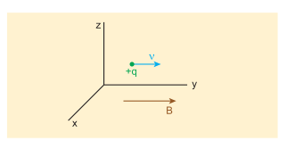
லாரன்ஸ் விசையிலிருந்து, \(\vec{F}_m = q(v \hat{j} \times B \hat{j}) = 0\)

எனவே, மின்துகள் காந்தப்புலத்தின் திசையில் இயங்கும்போது அதன் மீது எவ்வித விசையும் செயல்படுவதில்லை.

(ஆ) காந்தப்புலம் நேர்க்குறி \(z\) – திசையில் உள்ளது. இதிலிருந்து, \(\vec{B} = B \hat{k}\)
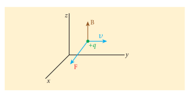
லாரன்ஸ் விசையிலிருந்து, \(\vec{F}_m = q(v \hat{j} \times B \hat{k}) = q v B \hat{i}\)

எனவே, லாரன்ஸ் விசையின் எண்மதிப்பு \(qvB\). மேலும் அதன் திசை நேர்க்குறி \(x\)-திசையின் வழியே அமையும்.

(இ) \(zy\) தளத்திலுள்ள காந்தப்புலம், துகளின் திசைவேகத்துடன் \(\theta\) கோணத்தை ஏற்படுத்தும். இதிலிருந்து \(\vec{B} = B \cos \theta \hat{j} + B \sin \theta \hat{k}\)
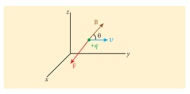
லாரன்ஸ் விசையிலிருந்து, \(\vec{F}_m = q(v \hat{j} \times (B \cos \theta \hat{j} + B \sin \theta \hat{k})) = q v B \sin \theta \hat{i}\)

**எடுத்துக்காட்டு 3.18**

\(\vec{v}\) திசைவேகத்தில் இயங்கும், \(q\) மின்னூட்டம் கொண்ட துகள் மீது செயல்படும் லாரன்ஸ் விசையினால் செய்யப்படும் வேலை மற்றும் விடுவிக்கப்படும் திறன் ஆகியவற்றைக் கணக்கிடுக. மேலும் லாரன்ஸ் விசைக்கும், மின்துகளின் திசைவேகத்திற்கும் இடையே ஏற்படும் கோணத்தையும் காண்க. இறுதியாக முடிவுகளின் உட்கருத்தை விளக்குக.

**தீர்வு**

காந்தப்புலத்தில் இயங்கும் மின்னூட்டப்பட்ட துகளின் மீது செயல்படும் விசை

\[
\vec{F} = q (\vec{v} \times \vec{B})
\]

காந்தப்புலத்தால் செய்யப்படும் வேலை

\[
W = \int \vec{F} \cdot d\vec{r} = \int \vec{F} \cdot \vec{v} \, dt
\]

\[
W = \int q (\vec{v} \times \vec{B}) \cdot \vec{v} \, dt
\]

இங்கு \(\vec{v} \times \vec{B}\) ஆனது \(\vec{v}\) க்கு செங்குத்தாக உள்ளது. எனவே,

\[
(\vec{v} \times \vec{B}) \cdot \vec{v} = 0
\]

\[
\Rightarrow W = 0
\]

அதாவது லாரன்ஸ் விசை மின்துகளின் மீது எவ்வித வேலையும் செய்யவில்லை என்பது இதன் பொருளாகும். வேலை இயக்க ஆற்றலை மாற்றுவதால் (11 – ஆம் வகுப்பு தொகுதி 1 – இல் பகுதி 4.2.6 ஐப் பார்க்கவும்)

\[
\frac{dW}{dt} = P = 0
\]

\(
\vec{F} \cdot \vec{v} = 0 \Rightarrow \vec{F}
\) மற்றும் \(\vec{v}\) இரண்டும் ஒன்றுக் கொன்று செங்குத்தாகும். எனவே லாரன்ஸ் விசைக்கும், மின்துகளின் திசைவேகத்திற்கும் உள்ள கோணம் \(90^\circ\) ஆகும். லாரன்ஸ் விசையானது திசைவேகத்தின் திசையை மட்டுமே மாற்றும். ஆனால் திசைவேகத்தின் எண்மதிப்பை மாற்றாது. முடிவாக லாரன்ஸ் விசை எவ்வித வேலையையும் செய்யவில்லை. மேலும் மின்துகளின் இயக்க ஆற்றலில் எந்த மாற்றத்தையும் நிகழ்த்தவில்லை.

### 3.10.2 சீரான காந்தப்புலத்திலுள்ள மின்துகளின் இயக்கம்

\(m\) நிறையும், \(q\) மின்னூட்டமும் கொண்ட மின்துகளானது, காந்தப்புலம் \(\vec{B}\) க்கு செங்குத்தாக, \(\vec{v}\) திசைவேகத்துடன் காந்தப்புலத்தினுள் நுழைகிறது எனக் கருதுக. துகள் காந்தப்புலத்தினுள் நுழைந்தவுடன், அத்துகளின் மீது, காந்தப்புலம் \(\vec{B}\) மற்றும் திசைவேகம் \(\vec{v}\) இவற்றிற்கு செங்குத்தான திசையில் லாரன்ஸ் விசையானது செயல்படும்.

இதன் பயனாக மின்துகளானது வட்டப்பாதையில் சுற்றிவருகிறது. இது படம் 3.45 இல் காட்டப்பட்டுள்ளது. இம்மின்துகளின் மீது செயல்படும் லாரன்ஸ் விசை

\[ \vec{F} = q (\vec{v} \times \vec{B}) \]

இங்கு துகளின் மீது லாரன்ஸ் விசை மட்டுமே செயல்படுவதால், இதன்மீது செயல்படும் நிகர விசையின் எண்மதிப்பு

\[ \sum F = q v B \]

இந்த லாரன்ஸ் விசை வட்டப்பாதையில் துகள் இயங்கத் தேவையான மையநோக்கு விசையை அளிக்கிறது. எனவே

\[ q v B = \frac{m v^2}{r} \]

வட்டப்பாதையின் ஆரம்

\[ r = \frac{m v}{q B} = \frac{p}{q B} \] (3.57)

இங்கு \(p = mv\) என்பது துகளின் நேர்க்கோட்டு உந்தத்தின் எண்மதிப்பாகும். \(T\) என்பது ஒரு முழு வட்டப்பாதையை நிறைவு செய்ய எடுத்துக்கொள்ளும் நேரம் எனக் கொண்டால்

\[ T = \frac{2 \pi r}{v} \] (3.58)

(3.57) ஐ (3.58) இல் பிரதியிடும்போது

\[ T = \frac{2 \pi m}{q B} \] (3.59)

சமன்பாடு (3.59) க்கு சைக்ளோட்ரான் அலைவு நேரம் என்று பெயர். அலைவு நேரத்தின் தலைகீழ் மதிப்பு அதிர்வெண் \(f\) எனப்படும். அதாவது

\[ f = \frac{1}{T} \]

\[ f = \frac{q B}{2 \pi m} \] (3.60)

கோண அதிர்வெண் \(\omega\) வின் அடிப்படையில்

\[ \omega = 2 \pi f = \frac{q}{m} B \] (3.61)

சமன்பாடுகள் (3.60) மற்றும் (3.61) ஐ சைக்ளோட்ரான் அதிர்வெண் அல்லது சுழல் அதிர்வெண் என்று அழைக்கலாம்.

\[ \vec{F} \cdot \vec{v} = 0 \Rightarrow \vec{F} \perp \vec{v} \]

\(\vec{a}\) மற்றும் \(\vec{v}\) இரண்டும் ஒன்றுக் கொன்று செங்குத்தாகும். எனவே லாரன்ஸ் விசைக்கும், மின்துகளின் திசைவேகத்திற்கும் உள்ள கோணம் \(90^\circ\) ஆகும். லாரன்ஸ் விசையானது திசைவேகத்தின் திசையை மட்டுமே மாற்றும். ஆனால் திசைவேகத்தின் எண்மதிப்பை மாற்றாது. முடிவாக லாரன்ஸ் விசை எவ்வித வேலையையும் செய்யவில்லை. மேலும் மின்துகளின் இயக்க ஆற்றலில் எந்த மாற்றத்தையும் நிகழ்த்தவில்லை.

திசைவேகம், காந்தப்புலத்திற்கு செங்குத்தாக இல்லாத நிலையில் மின்துகளானது சீரான காந்தப்புலத்தினுள் நுழையும்போது, துகளின் திசைவேகம் இரண்டு கூறுகளாக பிரியும்; ஒன்று காந்தப்புலத்திற்கு இணையாகவும், மற்றொன்று காந்தப்புலத்திற்கு செங்குத்தாகவும் இருக்கும். காந்தப்புலத்திற்கு இணையாக உள்ள திசைவேகத்தின் கூறு எவ்வித மாற்றத்திற்கும் உட்படாது. ஆனால் காந்தப்புலத்திற்கு செங்குத்தான கூறு லாரன்ஸ் விசையினால் தொடர்ந்து மாற்றமடையும். எனவே மின்துகள் வட்டப்பாதையில் சுற்றாமல் படம் 3.46 இல் காட்டியுள்ளவாறு காந்தப்புலக் கோடுகளைச் சுற்றி ஒரு சுருள் வட்டப் பாதையில் (helical path) சுற்றும்.

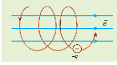

காந்தப்புலத்தில் சுருள் வட்டப்பாதையை மேற்கொள்ளும் எலக்ட்ரானின் இயக்கம் படம் 3.47 இல் காட்டப்பட்டுள்ளது. இதற்கு ஒரு சிறந்த எடுத்துக்காட்டாகும்.

**எடுத்துக்காட்டு 3.19**

0.500 T அளவுள்ள சீரான காந்தப்புலத்திற்குச் செங்குத்தாகச் செல்லும் எலக்ட்ரான் ஒன்று 2.50 mm ஆரமுள்ள வட்டப்பாதையை மேற்கொள்கிறது எனில் அதன் வேகத்தைக் காண்க.

**தீர்வு**

எலக்ட்ரானின் மின்னூட்டம் \(q = -1.60 \times 10^{-19} \text{ C}\) \(\Rightarrow |q| = 1.60 \times 10^{-19} \text{ C}\)

காந்தப்புலத்தின் எண்மதிப்பு \(B = 0.500 \text{ T}\)

எலக்ட்ரானின் நிறை, \(m = 9.11 \times 10^{-31} \text{ kg}\)

சுற்றுப்பாதையின் ஆரம், \(r = 2.50 \text{ mm} = 2.50 \times 10^{-3} \text{ m}\)

எலக்ட்ரானின் திசைவேகம், \(v = \frac{q r B}{m}\)

\[ v = \frac{1.60 \times 10^{-19} \times 2.50 \times 10^{-3} \times 0.500}{9.11 \times 10^{-31}} = 2.195 \times 10^8 \text{ m/s} \]

**எடுத்துக்காட்டு 3.20**

\(X\) – அச்சு திசையில் செயல்படும் 0.500 T வலிமை கொண்ட காந்தப்புலத்தினுள் புரோட்டான் ஒன்று செல்கிறது. தொடக்க நேரம் \(t = 0\) இல், புரோட்டானின் திசைவேகம் \(\vec{v} = 1.95 \times 10^5 \hat{i} + 2.00 \times 10^5 \hat{k} \text{ m/s}\) எனில், பின்வருவனவற்றைக் காண்க. (அ) தொடக்க நேரத்தில் புரோட்டானின் முடுக்கம் (ஆ) புரோட்டானின் பாதை ஒரு சுருள் வட்டப்பாதையா? அல்லது வட்டப்பாதையா? சுருள் வட்டப்பாதை எனில் அதன் ஆரத்தைக் காண்க. மேலும் ஒரு முழு சுழற்சிக்கு சுருள் வட்டப்பாதையின் அச்சின் வழியே புரோட்டான் கடந்த தொலைவைக் காண்க.

**தீர்வு**

காந்தப்புலம் \(\vec{B} = 0.500 \hat{i} \text{ T}\)

துகளின் திசைவேகம் \(\vec{v} = 1.95 \times 10^5 \hat{i} + 2.00 \times 10^5 \hat{k} \text{ m/s}\)

புரோட்டானின் மின்னூட்டம் \(q = 1.60 \times 10^{-19} \text{ C}\)

புரோட்டானின் நிறை \(m = 1.67 \times 10^{-27} \text{ kg}\)

(அ) புரோட்டான் உணரும் விசை

\[ \vec{F} = q(\vec{v} \times \vec{B}) = 1.60 \times 10^{-19} ((1.95 \times 10^5 \hat{i} + 2.00 \times 10^5 \hat{k}) \times (0.500 \hat{i})) \]

\[ \vec{F} = 1.60 \times 10^{-14} \hat{j} \text{ N} \]

எனவே, நியூட்டனின் இரண்டாம் விதியிலிருந்து,

\[ \vec{a} = \frac{1}{m} \vec{F} = \frac{1}{1.67 \times 10^{-27}} (1.60 \times 10^{-14} \hat{j}) = 9.58 \times 10^{12} \hat{j} \text{ m/s}^2 \]

(ஆ) புரோட்டானின் பாதை ஒரு சுருள் வட்டப்பாதை.

சுருள் வட்டப்பாதையின் ஆரம்

\[ R = \frac{m v_z}{|q| B} = \frac{1.67 \times 10^{-27} \times 2.00 \times 10^5}{1.60 \times 10^{-19} \times 0.500} = 4.175 \times 10^{-3} \text{ m} = 4.18 \text{ mm} \]

\(T\) நேரத்தில், \(x\)- அச்சு வழியே சுருள் வட்டப்பாதையில் புரோட்டான் கடந்த தொலைவு \(P = v_x T\)

\(T\) இன் மதிப்பு

\[ T = \frac{2 \pi}{\omega} = \frac{2 \pi m}{|q| B} = \frac{2 \times 3.14 \times 1.67 \times 10^{-27}}{1.60 \times 10^{-19} \times 0.500} = 13.1 \times 10^{-8} \text{ s} \]

எனவே கடந்த தொலைவு

\[ P = v_x T = (1.95 \times 10^5) \times (13.1 \times 10^{-8}) = 25.5 \times 10^{-3} \text{ m} = 25.5 \text{ mm} \]

புரோட்டான், காந்தப்புலத்தில் குறிப்பிடத்தக்க முடுக்கத்தைப் பெறுகிறது. எனவே ஒரு முழு சுற்றுக்கு அச்சின் வழியே கடந்த தொலைவு, சுருள் வட்டப்பாதையின் ஆரத்தைப் போன்று ஆறு மடங்காகும்.

**எடுத்துக்காட்டு 3.21**

ஒன்றை அயனியாக்கம் செய்யப்பட்ட இரண்டு யுரேனியம் ஐசோடோப்புகள் \( _{92}^{235}\text{U} \) மற்றும் \( _{92}^{238}\text{U} \) (ஒரே அணு எண்ணும், வேறுபட்ட நிறை எண்ணும் கொண்டிருப்பவை ஐசோடோப்புகளாகும்) 0.500 T வலிமை கொண்ட காந்தப்புலத்தினுள் \(1.00 \times 10^5 \text{ m/s}\) திசைவேகத்துடன் செங்குத்தாகச் செலுத்தப்படுகின்றன. அரை வட்டப்பாதையை இவ்விரண்டு ஐசோடோப்புகளும் நிறைவு செய்தவுடன் அவற்றிற்கு இடையே உள்ள தொலைவைக் காண்க. மேலும் இவ்விரண்டு ஐசோடோப்புகளும் அரை வட்டப்பாதையை நிறைவு செய்ய எடுத்துக்கொள்ளும் நேரங்களையும் கணக்கிடுக. (கொடுக்கப்பட்டவை: ஐசோடோப்புகளின் நிறைகள் \(m_{235} = 3.90 \times 10^{-25} \text{ kg}\) மற்றும் \(m_{238} = 3.95 \times 10^{-25} \text{ kg}\))

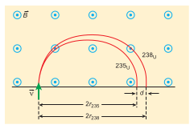

**தீர்வு**

இவ்விரண்டு ஐசோடோப்புகள் ஒன்றை அயனியாக்கம் செய்யப்பட்டவை. எனவே அவை இரண்டும் ஒரே மின்னூட்டத்தைப் பெற்றிருக்கும். அதாவது எலக்ட்ரானின் மின்னூட்டத்திற்குச் சமமான மின்னூட்டத்தைப் பெற்றிருக்கும். எலக்ட்ரானின் மின்னூட்டம் \(q = -1.6 \times 10^{-19} \text{ C}\). \( _{92}^{235}\text{U} \) மற்றும் \( _{92}^{238}\text{U} \) இன் நிறைகள் முறையே \(3.90 \times 10^{-25} \text{ kg}\) மற்றும் \(3.95 \times 10^{-25} \text{ kg}\) ஆகும். கொடுக்கப்படும் காந்தப்புலம் \(B = 0.500 \text{ T}\). ஐசோடோப்புகளின் திசைவேகம் \(1.00 \times 10^5 \text{ m/s}\), எனில்

(அ) \( _{92}^{235}\text{U} \) இன், பாதையின் ஆரம் \(r_{235}\) என்க.

\[ r_{235} = \frac{m_{235} v}{|q| B} = \frac{3.90 \times 10^{-25} \times 1.00 \times 10^5}{1.6 \times 10^{-19} \times 0.500} = 48.8 \times 10^{-2} \text{ m} \]

\[ r_{235} = 48.8 \text{ cm} \]

\( _{92}^{235}\text{U} \) ஐசோடோப்பு மேற்கொண்ட அரை வட்டப்பாதையின் விட்டம் \(d_{235} = 2r_{235} = 97.6 \text{ cm}\)

\( _{92}^{238}\text{U} \) இன் பாதையின் ஆரம் \(r_{238}\) என்க.

\[ r_{238} = \frac{m_{238} v}{|q| B} = \frac{3.95 \times 10^{-25} \times 1.00 \times 10^5}{1.6 \times 10^{-19} \times 0.500} = 49.4 \times 10^{-2} \text{ m} \]

\[ r_{238} = 49.4 \text{ cm} \]

\( _{92}^{238}\text{U} \) ஐசோடோப்பு மேற்கொண்ட அரை வட்டப்பாதையின் விட்டம் \(d_{238} = 2r_{238} = 98.8 \text{ cm}\)

இவ்விரண்டு ஐசோடோப்புகளுக்கு இடையே உள்ள தொலைவு

\[ \Delta d = d_{238} - d_{235} = 98.8 - 97.6 = 1.2 \text{ cm} \]

(ஆ) ஒவ்வொரு ஐசோடோப்பும் அரை வட்டப்பாதையை நிறைவு செய்ய எடுத்துக்கொண்ட நேரங்கள் முறையே

\[ t_{235} = \frac{\text{இடப்பெயர்ச்சியின் எண்மதிப்பு}}{\text{திசைவேகம்}} = \frac{97.6 \times 10^{-2}}{1.00 \times 10^5} = 9.76 \times 10^{-6} \text{ s} = 9.76 \mu\text{s} \]

\[ t_{238} = \frac{\text{இடப்பெயர்ச்சியின் எண்மதிப்பு}}{\text{திசைவேகம்}} = \frac{98.8 \times 10^{-2}}{1.00 \times 10^5} = 9.88 \times 10^{-6} \text{ s} = 9.88 \mu\text{s} \]

இவ்விரண்டு ஐசோடோப்புகளின் நிறைகளின் வேறுபாடு மிகக் குறைவானதாக இருந்தாலும் இவ்வமைப்பு இக்குறைந்த நிறை வேறுபாட்டை அளந்தறியத்தக்க பிரிந்துள்ள தூரமாக மாற்றியுள்ளது. இவ்வமைப்பிற்கு நிறைமாலைமானி (mass spectrometer) என்று பெயர். நிறைமாலைமானி அறிவியலின் பல்வேறு பகுதிகளில் குறிப்பாக மருத்துவம், விண்வெளி அறிவியல், மண்ணியல் போன்றவற்றில் பயன்படுகிறது.

எடுத்துக்காட்டாக மருத்துவத்தில் சுவாச வாயுக்களின் அளவை அளந்தறியவும், உயிரியலில் ஒளிச்சேர்க்கை நிகழ்ச்சியில் ஏற்படும் எதிர்வினை இயக்கத்தைக் கண்டறியவும் பயன்படுகிறது.

---

### 3.10.3 ஒன்றுக்கொன்று செங்குத்தாகச் செயல்படும் மின்புலம் மற்றும் காந்தப்புலத்தில் மின்துகளின் இயக்கம் (திசைவேகத் தேர்ந்தெடுப்பான்)

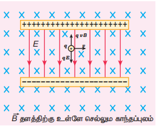

திசைவேகத் தேர்ந்தெடுப்பானை விளக்குவதற்காக ஒரு செய்முறை ஆய்வு அமைப்பைக் கருதுவோம் (படம் 3.48). மின்தேக்கியின் இணைத் தட்டுகளுக்கு இடையே உள்ள பகுதியில் சீரான மின்புலமும் (\(\vec{E}\)) அதற்கு செங்குத்தான திசையில் சீரான காந்தப்புலமும் (\(\vec{B}\)) நிறுவப்பட்டுள்ளன. மின்னூட்ட மதிப்பு \(q\) கொண்ட துகள் ஒன்று இடப்பக்கத்திலிருந்து \(\vec{v}\) திசை வேகத்துடன் இவ்வெளியில் நுழையும்போது அதன்மீது செலுத்தப்படும் நிகர விசை

\[ \vec{F} = q (\vec{E} + \vec{v} \times \vec{B}) \]

துகள் நேர்மின்துகளாக இருந்தால் அதன் மீது செயல்படும் மின்விசை கீழ்நோக்கிய திசையிலும், லாரன்ஸ் விசை மேல் நோக்கிய திசையிலும் செயல்படும். இவ்விரண்டு விசைகளும் ஒன்றை ஒன்று சமன் செய்யும் போது

\[ qE = q v B \]

\[ \Rightarrow v = \frac{E}{B} \] (3.62)

எனவே, முறையான மின்புலம் மற்றும் காந்தப்புலங்களை தேர்வு செய்வதன் மூலம் குறிப்பிட்ட வேகத்தில் செல்லும் மின்துகளை தேர்வு செய்ய இயலும். இதுபோன்ற புலங்களின் அமைப்பிற்கு திசைவேகத் தேர்ந்தெடுப்பான் என்று பெயர்.

**எடுத்துக்காட்டு 3.22**

\(6.0 \times 10^6 \text{ N C}^{-1}\) எண்மதிப்புடைய மின்புலம் \(\vec{E}\) மற்றும் 0.83 T எண்மதிப்புடைய காந்தப்புலம் \(\vec{B}\) இரண்டும் ஒன்றுக்கொன்று செங்குத்தாக செயல்படும் பகுதியில் 200 V மின்னழுத்தத்தால் எலக்ட்ரான் ஒன்று முடுக்கிவிடப்படுகிறது. முடுக்கமடைந்த எலக்ட்ரான் சுழி விலக்கத்தைக் காட்டுமா? இல்லை எனில் எந்த மின்னழுத்தத்திற்கு அது சுழி விலக்கத்தைக் காட்டும்.

**தீர்வு:**

மின்புலம், \(E = 6.0 \times 10^6 \text{ N C}^{-1}\) மற்றும் காந்தப்புலம், \(B = 0.83 \text{ T}\). எனவே,

\[ v = \frac{E}{B} = \frac{6.0 \times 10^6}{0.83} = 7.23 \times 10^6 \text{ m/s} \]

எலக்ட்ரான் இந்த திசைவேகத்தில் செல்லும்போது சுழி விலக்கத்தைக் காட்டும். இங்கு எலக்ட்ரானை முடுக்குவிக்கப் பயன்படும் மின்னழுத்தம் 200 V. இம்மின்னழுத்தத்தினால் எலக்ட்ரான் இயக்க ஆற்றலைப் பெறும். எனவே,

\[ \frac{1}{2} m v^2 = eV \]

\[ v = \sqrt{\frac{2eV}{m}} \]

எலக்ட்ரானின் நிறை \(m = 9.1 \times 10^{-31} \text{ kg}\). மேலும் அதன் மின்னூட்டம் \(|q| = e = 1.6 \times 10^{-19} \text{ C}\).

முடுக்குவிக்கும் மின்னழுத்தத்தால் எலக்ட்ரான் பெறும் திசைவேகம்

\[ v_{200} = \sqrt{\frac{2(1.6 \times 10^{-19})(200)}{(9.1 \times 10^{-31})}} = 8.39 \times 10^6 \text{ m/s} \]

இங்கு \(v_{200} > v\) எனவே எலக்ட்ரான் லாரன்ஸ் விசையின் திசையில் விலக்கமடையும். எலக்ட்ரான் விலக்கமடையாமல் நேரான பாதையில் செல்லத் தேவையான முடுக்குவிக்கும் மின்னழுத்தம்

\[ V = \frac{1}{2} \frac{m v^2}{e} = \frac{(9.1 \times 10^{-31}) \times (7.23 \times 10^6)^2}{2 \times (1.6 \times 10^{-19})} \]

\[ V = 148.65 \text{ V} \]

---

### 3.10.4 சைக்ளோட்ரான்

மின்துகள்களை முடுக்குவித்து, அவை பெறும் இயக்க ஆற்றலைப் பயன்படுத்த உதவும் கருவியே சைக்ளோட்ரான் ஆகும். இது படம் 3.49 இல் காட்டப்பட்டுள்ளது. இதனை உயர் ஆற்றல் முடுக்குவிப்பான் என்றும் அழைக்கலாம். இது லாரன்ஸ் மற்றும் லிவிங்ஸ்டன் என்பவர்களால் 1934 இல் உருவாக்கப்பட்டது.

**தத்துவம்**

மின்துகள் காந்தப்புலத்திற்கு செங்குத்தாகச் செல்லும்போது, அது லாரன்ஸ் விசையை உணரும்.

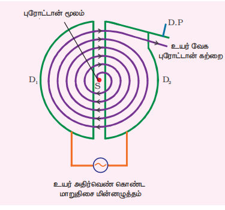

**கட்டமைப்பு**

சைக்ளோட்ரானின் திட்ட வரைபடம் படம் 3.50 இல் காட்டப்பட்டுள்ளது. ஆங்கில எழுத்து 'D' வடிவில் உள்ள இரண்டு அரை வட்ட உலோகக் கொள்கலன்களுக்குள் நேர்மின் மின்துகள்கள் செலுத்தப்படுகின்றன. இந்த அரை வட்ட உலோகக் கொள்கலன்கள் டீக்கள் (Dees) என்று அழைக்கப்படுகிறது. இந்த டீக்கள் வெற்றி அறையினுள் பொருத்தப்பட்டுள்ளன. இப்பகுதி முழுவதும் மின்காந்தங்களினால் உருவாக்கப்பட்ட சீரான காந்தப்புலத்தினால் சூழப்பட்டுள்ளது. டீக்களின் தளத்திற்கு செங்குத்தாக காந்தப்புலத்தின் திசை உள்ளது. இரண்டு டீக்களும் ஒரு சிறிய இடைவெளியால் பிரிக்கப்பட்டுள்ளன. அவ்விடைவெளியின் நடுவே முடுக்குவிக்க வேண்டிய மின்துகள்களை உமிழும் மூலம் \(S\) உள்ளது. உயர் அதிர்வெண் கொண்ட மாறுதிசை மின்னழுத்த வேறுபாட்டு மூலம் ஒன்றும் இணைக்கப்பட்டுள்ளது.

**வேலை செய்யும் முறை**

அயனிமூலம் \(S\), நேர்மின்னூட்டம் கொண்ட அயனி ஒன்றை உமிழ்கிறது எனக் கருதுக. அயனி உமிழப்பட்ட அதே நேரத்தில் எதிர் மின்னழுத்தம் கொண்ட டீயினால் அந்த அயனி முடுக்கப்படுகிறது. (\(D_1\) என்க). இங்கு டீக்களின் தளத்திற்கு செங்குத்தாக காந்தப்புலம் செயல்படுவதால் அயனி வட்டப்பாதையை மேற்கொள்ளும். \(D_1\) இல் அரை வட்டப்பாதையை அயனி நிறைவு செய்தவுடன், டீக்களுக்கு நடுவே உள்ள இடைவெளியை அடையும். அந்நேரத்தில் டீக்களின் துருவம் (Polarity) மாற்றப்படும். (டீக்களின் மின்னழுத்தம் மாற்றப்படும்). எனவே அயனி \(D_2\) ஐ நோக்கி அதிக திசைவேகத்துடன் முடுக்கப்படும். இதனால் அயனி ஒரு வட்டப்பாதையை நிறைவு செய்யும். மின்துகள் \(q\) வட்டப்பாதை இயக்கத்தை மேற்கொள்ளத் தேவையான மையநோக்கு விசையை லாரன்ஸ் விசை கொடுக்கிறது.

\[ \frac{m v^2}{r} = q v B \]

\[ \Rightarrow r = \frac{m}{qB} v \]

\[ \Rightarrow r \propto v \] (3.63)

சமன்பாடு (3.63) விருந்து, திசைவேகத்தில் ஏற்படும் அதிகரிப்பை அறியலாம். இவ்வாறு தொடர்ந்து நிகழும்போது மின்துகள் சுற்றும் சுருள் வட்டப்பாதையின் ஆரம் அதிகரித்துக் கொண்டே செல்லும். மின்துகளானது டீக்களின் ஓரத்தை நெருங்கும்போது, விலக்கத்தகடுகளின் (Deflection plate) உதவியுடன் அதனை வெளியேற்றி இலக்கின் (T) மீது மோதச் செய்யலாம்.

சைக்ளோட்ரான் செயல்பாட்டின் மிக முக்கிய நிபந்தனை ஒத்திசைவு நிபந்தனையாகும். காந்தப்புலத்தில் சுழலும் நேர்மின் அயனியின் அதிர்வெண் \(f\) ஆனது, மாறாத அதிர்வெண் கொண்ட மாறுதிசை மின்னழுத்த வேறுபாட்டு மூலத்தின் அதிர்வெண்ணுக்குச் சமமாக இருக்கும்போது மட்டுமே ஒத்திசைவு நிபந்தனை பூர்த்தியாகிறது.

சமன்பாடு (3.60) இல் இருந்து

\[ f = \frac{qB}{2\pi m} \]

மின்துகளின் அலைவுநேரம்

\[ T = \frac{2\pi m}{qB} \]

மின்துகளின் இயக்க ஆற்றல்

\[ KE = \frac{1}{2} m v^2 = \frac{q^2 B^2 r^2}{2m} \] (3.64)

**சைக்ளோட்ரானின் வரம்புகள்**

(அ) அயனியின் வேகம் வரம்புக்குட்பட்டது.

(ஆ) எலக்ட்ரானை முடுக்குவிக்க இயலாது.

(இ) மின்னூட்டமற்ற துகள்களை முடுக்குவிக்க இயலாது.

**எடுத்துக்காட்டு 3.23**

1T காந்தப்புல வலிமையில் செயல்படும் சைக்ளோட்ரானைப் பயன்படுத்தி புரோட்டான்களை முடுக்குவிக்கும் நிகழ்வில் டீக்களுக்கிடையே உள்ள மாறும் மின்புலத்தின் அதிர்வெண்ணைக் காண்க.

**தீர்வு**

காந்தப்புல வலிமை \(B = 1 \text{ T}\)

புரோட்டானின் நிறை, \(m_p = 1.67 \times 10^{-27} \text{ kg}\)

புரோட்டானின் மின்னூட்டம், \(q = 1.60 \times 10^{-19} \text{ C}\)

\[ f = \frac{qB}{2\pi m_p} = \frac{(1.60 \times 10^{-19})(1)}{2(3.14)(1.67 \times 10^{-27})} = 15.3 \times 10^6 \text{ Hz} = 15.3 \text{ MHz} \]

---

### 3.10.5 காந்தப்புலத்தில் உள்ள மின்னோட்டம் பாயும் கடத்தியின் மீது செயல்படும் விசை

மின்னோட்டம் பாயும் கடத்தி ஒன்றை காந்தப்புலத்தில் வைக்கும்போது, கடத்தி உணரும் விசை, அக்கடத்தியில் உள்ள ஒவ்வொரு மின்துகளின் மீது செயல்படும் விசையின் கூடுதலுக்குச் சமமாகும். படம் 3.51 இல் காட்டியுள்ளவாறு, \(I\) மின்னோட்டம் பாயும் \(A\) குறுக்குவெட்டுப்பரப்பு கொண்ட \(dl\) நீளமுள்ள கம்பியின் (கடத்தியின்) சிறுபகுதி ஒன்றைக் கருதுக.

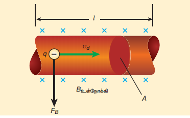

மின்னோட்டம் பாயும் கம்பியிலுள்ள கட்டுறா எலக்ட்ரான்கள் மின்னோட்டத்தின் (I) திசைக்கு எதிராக நகர்கின்றன. எனவே மின்னோட்டம் \(I\) மற்றும் இழுப்பு திசைவேகம் \(v_d\) யின் எண்மதிப்பு இவற்றுக்கான தொடர்பு பின்வருமாறு (அலகு 2 ஐப் பார்க்கவும்)

\[ I = n e A v_d \] (3.65)

மின்னோட்டம் பாயும் இந்த கடத்தியை காந்தப்புலத்தில் \(\vec{B}\) வைக்கும்போது, கடத்தியிலுள்ள மின்துகள் உணரும் சராசரி விசை (இங்கு எலக்ட்ரான்)

\[ \vec{f} = -e (\vec{v}_d \times \vec{B}) \]

\(n\) என்பதை ஒரலகு பருமனுக்கான கட்டுறா எலக்ட்ரான்களின் எண்ணிக்கை எனக் கொண்டால்

\[ n = \frac{N}{V} \]

இங்கு \(N\) என்பது \(V = A dl\) பருமனுள்ள கடத்தியின் சிறுபகுதியில் உள்ள கட்டுறா எலக்ட்ரான்களின் மொத்த எண்ணிக்கையாகும்.

எனவே \(dl\) நீளமுள்ள கடத்தியின் சிறுபகுதியின் மீது செயல்படும் லாரன்ஸ் விசையானது அப்பகுதியில் உள்ள எலக்ட்ரான்களின் எண்ணிக்கையையும் \((N = nA dl)\) ஒரு எலக்ட்ரானின் மீது செயல்படும் லாரன்ஸ் விசையையும் பெருக்கினால் கிடைக்கும்.

\[
d\vec{F} = -enA dl (\vec{v}_d \times \vec{B})
\]

\(dl\) இன் நீளம், கம்பியின் நீளத்தின் திசையிலேயே உள்ளது. எனவே கடத்தியின் மின்னோட்டக்கூறு \(
I d\vec{l} = -enA \vec{v}_d dl
\) எனவே கடத்தியின் மீது செயல்படும் விசை

\[ d\vec{F} = I (d\vec{l} \times \vec{B}) \] (3.66)

சீரான காந்தப்புலத்தில் உள்ள \(I\) மின்னோட்டம் பாயும் கடத்தி உணரும் விசை

\[ \vec{F} = (\vec{Il} \times \vec{B}) \] (3.67)

எண்மதிப்பில்,

\[ F = B I l \sin \theta \]

**சிறப்பு நேர்வுகள்**

(அ) காந்தப்புலத்தின் திசைக்கு இணையாக மின்னோட்டம் பாயும் கடத்தியை வைக்கும்போது, இவற்றுக்கிடையேயான கோணம் \(\theta = 0^\circ\). எனவே மின்னோட்டம் பாயும் கடத்தி உணரும் விசை சுழியாகும்.

(ஆ) காந்தப்புலத்தின் திசைக்கு செங்குத்தாக மின்னோட்டம் பாயும் கடத்தியை வைக்கும்போது, இவற்றுக்கிடையேயான கோணம் \(\theta = 90^\circ\). எனவே, மின்னோட்டம் பாயும் கடத்தி பெறும் விசை \(F = B I l\).

**பிளெமிங்கின் இடதுகை விதி**

காந்தப்புலத்திலுள்ள மின்னோட்டம் பாயும் கடத்தி ஒன்றின் மீது செயல்படும் விசையின் திசையை படம் 3.52 இல் காட்டியுள்ளவாறு பிளெமிங்கின் இடதுகை விதியிலிருந்து (FLHR) அறியலாம்.

ஒன்றுக்கொன்று செங்குத்தான திசையில் உள்ளவாறு இடதுகையின் ஆள்காட்டி விரல், நடுவிரல் மற்றும் பெருவிரலை நீட்டுவைக்கும்போது, ஆள்காட்டி விரல் காந்தப்புலத்தின் திசையையும், நடுவிரல் மின்னோட்டத்தின் திசையையும் காட்டினால், பெருவிரல் கடத்தி உணரும் விசையின் திசையைக் காட்டும்.

**எடுத்துக்காட்டு 3.24**

நீள் அடர்த்தி 0.25 kg m\(^{-1}\) கொண்ட உலோகத்தண்டு ஒன்று வழுவழுப்பான சாய்தளத்தின் மீது கிடைமட்டமாக வைக்கப்பட்டுள்ளது. சாய்தளம் கிடைத்தளப்பரப்புடன் ஏற்படுத்தும் கோணம் \(45^\circ\). உலோகத்தண்டு சாய்தளத்தில் வழுக்கிச் செல்வதைத் தவிர்ப்பதற்காக, அதன் வழியே குறிப்பிட்ட அளவு மின்னோட்டம் செலுத்தப்பட்டு, செங்குத்துத்திசையில் 0.25 T வலிமை கொண்ட காந்தப்புலம் உருவாக்கப்பட்டுள்ளது. உலோகத்தண்டு வழுக்காமல், சாய்தளத்தின்மீது நிலையாக இருக்க உலோகத்தண்டின் வழியே பாய வேண்டிய மின்னோட்டத்தின் அளவைக் காண்க.
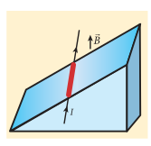
**தீர்வு**

தண்டின் நீள் அடர்த்தி அதாவது ஓரலகு நீளத்திற்கான நிறை \(0.25 \text{ kg m}^{-1}\) ஆகும்.

\[
\Rightarrow \frac{m}{l} = 0.25 \text{ kg m}^{-1}
\]

\(I\) அளவுள்ள மின்னோட்டம் இந்த உலோகத்தண்டின் வழியாக செல்வதாகக் கருதுக. இம்மின்னோட்டம் இப்புத்தகத்தாளின் உள்நோக்கிய திசையில் செல்ல வேண்டும். காந்தவிசை \(I B l\) இன் திசையை பிளெமிங்கின் இடதுகை விதியிலிருந்து அறியலாம்.
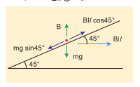
உலோகத்தண்டு சமநிலை அடைவதற்கு

\[
mg \sin 45^\circ = I B l \cos 45^\circ
\]

\[
\Rightarrow I = \frac{1}{B} \frac{m}{l} g \tan 45^\circ
\]

\[
= \frac{0.25 \, \text{kg m}^{-1}}{0.25 \, \text{T}} \times 1 \times 9.8 \, \text{m s}^{-2}
\]

\[
\Rightarrow I = 9.8 \, \text{A}
\]

எனவே உலோகத்தண்டு வழுக்காமல் நிலையாக சாய்தளத்தின்மீது நிற்க செலுத்த வேண்டிய மின்னோட்டம் \(9.8 \, \text{A}\) ஆகும்.

### 3.10.6 நீண்ட இணையான மின்னோட்டம் பாயும் இரு கடத்திகளுக்கிடையே ஏற்படும் விசை

நீண்ட இணையான மின்னோட்டம் பாயும் இரண்டு கடத்திகள் \(r\) இடைவெளியில் காற்றில் பிரித்து வைக்கப்பட்டுள்ளன. அவை படம் 3.53 இல் காட்டப்பட்டுள்ளன. கடத்திகள் A மற்றும் B யின் வழியே ஒரே திசையில் பாயும் மின்னோட்டங்கள் \(I_1\) மற்றும் \(I_2\) என்க. (அதாவது \(z\) - அச்சுத்திசையில்)

A கடத்தியில் பாயும் \(I_1\) மின்னோட்டத்தினால் \(r\) தொலைவில் ஏற்படும் நிகர காந்தப்புலம்

\[
\vec{B}_1 = -\frac{\mu_0 I_1}{2\pi r} \hat{i}
\]

வலதுகை பெருவிரல் விதியிலிருந்து, காந்தப்புலத்தின் திசை தாளின் தளத்திற்கு செங்குத்தாகவும் உள்நோக்கிச் செயல்படும் வகையிலும் காணப்படும் (அம்புக்குறி தாளுக்கு உள்நோக்கிச் செல்லும் வகையில் \(\otimes\)). அதாவது எதிர்க்குறி \(\hat{i}\) திசையில்.

B கடத்தியில் \(dl\) நீளமுள்ள சிறு கூறு ஒன்றைக் கருதுக. அச்சிறு கூறு \(\vec{B}_1\) காந்தப்புலத்தில் உள்ளது என்க. சமன்பாடு 3.66 இலிருந்து B கடத்தியின் \(dl\) நீளமுள்ள சிறு கூறின்மீது செயல்படும் லாரன்ஸ் விசை

\[
d\vec{F} = (I_2 d\vec{l} \times \vec{B}_1)
\]

\[
d\vec{F} = -I_2 dl \frac{\mu_0 I_1}{2\pi r} (\hat{k} \times \hat{i})
\]

\[
d\vec{F} = -\frac{\mu_0 I_1 I_2 dl}{2\pi r} \hat{j}
\]

எனவே B கடத்தியிலுள்ள \(dl\) நீள சிறு கூறு மீது செயல்படும் விசையின் திசை A கடத்தியை நோக்கி காணப்படும். எனவே \(dl\) நீளமுள்ள சிறு கூறு கடத்தி A வை நோக்கி ஈர்க்கப்படும். A கடத்தியினால், B கடத்தியின் ஓரலகு நீளத்தில் செயல்படும் விசை

\[
\frac{F}{l} = -\frac{\mu_0 I_1 I_2}{2\pi r} \hat{j}
\]

இதேபோன்று, \(I_2\) மின்னோட்டம் பாயும் B கடத்தியினால் \(r\) தொலைவிலுள்ள A கடத்தியின் \(dl\) நீளமுள்ள சிறு கூறினைச் சுற்றி உருவாகும் காந்தப்புலத்தின் (\(\vec{B}_2\)) மதிப்பைக் காணலாம்.

\[
\vec{B}_2 = \frac{\mu_0 I_2}{2\pi r} \hat{i}
\]

வலதுகை பெருவிரல் விதியிலிருந்து, காந்தப்புலத்தின் திசை தாளின் தளத்திற்கு செங்குத்தாகவும் வெளிநோக்கிச் செயல்படும் வகையிலும் காணப்படும் (அம்புக்குறி தாளிலிருந்து வெளியேறிச் செல்லும் வகையில் \(\odot\)). அதாவது நேர்க்குறி \(\hat{i}\) திசையில்.

எனவே A கடத்தியிலுள்ள \(dl\) நீள சிறு கூறின் மீது செயல்படும் காந்தவிசை

\[
d\vec{F} = (I_1 d\vec{l} \times \vec{B}_2)
\]

\[
d\vec{F} = I_1 dl \frac{\mu_0 I_2}{2\pi r} (\hat{k} \times \hat{i})
\]

\[
d\vec{F} = \frac{\mu_0 I_1 I_2 dl}{2\pi r} \hat{j}
\]

எனவே, A கடத்தியிலுள்ள \(dl\) நீள சிறு கூறு மீது செயல்படும் விசையின் திசை B கடத்தியை நோக்கி காணப்படும். எனவே \(dl\) நீளமுள்ள சிறு கூறு B கடத்தியை நோக்கி ஈர்க்கப்படும்.

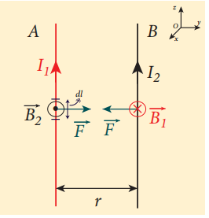

B கடத்தியினால், A கடத்தியின் ஓரலகு நீளத்தில் செயல்படும் விசை

\[
\frac{F}{l} = \frac{\mu_0 I_1 I_2}{2\pi r} \hat{j}
\]

இரு இணை கடத்திகளின் வழியே, ஒரே திசையில் மின்னோட்டம் பாயும்போது, அவற்றுக்கிடையே ஈர்ப்புவிசை தோன்றும். இது படம் 3.55 இல் காட்டப்பட்டுள்ளது.

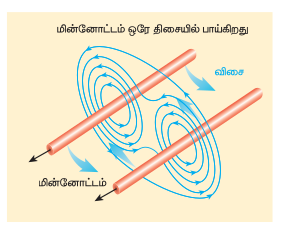

இரு இணை கடத்திகளின் வழியே, எதிரெதிர் திசைகளில் மின்னோட்டம் பாயும்போது அவற்றுக்கிடையே விலக்குவிசை தோன்றும். இது படம் 3.56 இல் காட்டப்பட்டுள்ளது.

**ஆம்பியர் வரையறை**

வெற்றிடத்தில் ஒரு மீட்டர் இடைவெளியில் பிரித்து வைக்கப்பட்டுள்ள முடிவிலா நீளம் கொண்ட இரு இணை கடத்திகள் ஒவ்வொன்றின் வழியாகவும் பாயும் மின்னோட்டத்தினால், ஒவ்வொரு கடத்தியும் ஓரலகு நீளத்திற்கு \(2 \times 10^{-7} \text{ N}\) விசையை உணர்ந்தால், ஒவ்வொரு கடத்தியின் வழியாகவும் பாயும் மின்னோட்டத்தின் அளவு ஒரு ஆம்பியராகும்.

>நவம்பர் 2018இல், கிலோகிராம் (நிறை), கெல்வின் (வெப்பநிலை) மற்றும் மோல் (பொருளின் அளவு) ஆகிய அலகுகளுடன் ஆம்பியர் மறுவரையறை செய்யப்படுவதற்கான ஒப்புதல் அளிக்கப்பட்டது. 2019 மே 20 முதல் அடிப்படை மின்னூட்டம் என்கிற ஓர் அடிப்படை இயற்பியல் மாறிலியை மூலமாகக் கொண்டு ஆம்பியர் வரையறுக்கப்படுகிறது. எனவே, ஓர் ஆம்பியர் என்பது ஒரு வினாடியில் \(1/(1.602 \ 176 \ 634 \times 10^{-19})\) அடிப்படை மின்துகள்கள் பாய்வதால் உருவாகும் மின்னோட்டம் ஆகும்.