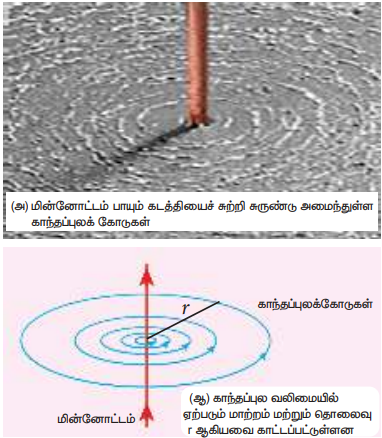
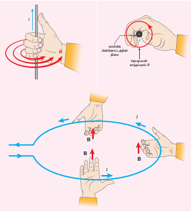

## 3.7 மின்னோட்டத்தின் காந்த விளைவுகள்

### 3.7.1 ஆர்ஸ்டெட் (Oersted) சோதனை

1820 இல் ஹான்ஸ் கிரிஸ்டியன் ஆர்ஸ்டெட் (Hans Christian Oersted) தன்னுடைய இயற்பியல் வகுப்புக்கு தயார் செய்து கொண்டிருக்கும்போது, கம்பியின் வழியே பாயும் மின்னோட்டம் அருகே இருந்த திசைகாட்டும் காந்தக் கருவியில் விலகலை ஏற்படுத்துகின்றது என்பதைக் கண்டறிந்தார். முறையான ஆய்வுகளுக்குப் பின்பு திசைகாட்டும் கருவியில் விலக்கம் ஏற்படுவதற்குக் காரணம் மின்னோட்டம் பாயும் கம்பியைச் சுற்றி உருவான காந்தப்புலத்தில் ஏற்பட்ட மாற்றமாகும் எனக் கண்டறிந்தார். மின்னோட்டம் பாயும் திசையை எதிராக மாற்றும்போது, திசைகாட்டும் கருவியிலும் எதிர்த்திசையில் விலகல் ஏற்படுவதை அறிந்தார். இது மின்காந்தக் கொள்கையின் வளர்ச்சிக்கு வழிவகுத்து, இயற்பியலின் இரு பிரிவுகளான மின்னோட்டவியல் மற்றும் காந்தவியலை ஒன்றினைத்தது.

### 3.7.2 மின்னோட்டம் பாயும் நேரான கடத்தி மற்றும் வட்டவடிவ கம்பிச்சுருளைச் சுற்றி உருவாகும் காந்தப்புலம்

**(அ) மின்னோட்டம் பாயும் நேரான கடத்தி:**

மின்னோட்டம் பாயும் நேரான கடத்தியின் அருகே ஒரு திசைகாட்டும் கருவியை வைக்கும்போது, திசைகாட்டும் கருவியில் உள்ள காந்த ஊசி ஒரு திருப்புவிசையை உணர்ந்து, விலகலடைந்து அப்புள்ளியில் உள்ள காந்தப்புலத்தின் திசையில் ஒருங்கமையும். காந்த ஊசி விலகலடையும் திசையைக் குறித்துக் கொண்டே சென்றால் காந்தப்புலக் கோடுகளை வரையலாம். மின்னோட்டம் பாயும் ஒரு நேரான கடத்திக்கு, படம் 3.26 (அ) வில் காட்டியுள்ளவாறு கடத்தியின் அச்சினைச் சுற்றி ஒருமைய வட்டங்களாக அதன் காந்தப்புலம் அமையும்.

கடத்தியில் பாயும் மின்னோட்டத்தின் திசையினைப் பொறுத்து வட்ட வடிவ காந்தப்புலக் கோடுகளின் திசை கடிகாரமுள் சுற்றும் திசையில் அல்லது அதற்கு எதிர்த்திசையில் அமையும். கடத்தியில் பாயும் மின்னோட்டத்தின் வலிமையை (அல்லது எண்மதிப்பை) அதிகரிக்கும்போது, காந்தப்புலத்தின் அடர்த்தியும் அதிகரிக்கும். கடத்தியிலிருந்து தொலைவு r-ஐ அதிகரிக்கும்போது, காந்தப்புலத்தின் (B) வலிமை குறையும். இது படம் 3.26 (ஆ) வில் காட்டப்பட்டுள்ளது.

**(ஆ) மின்னோட்டம் பாயும் வட்டவடிவ கம்பிச்சுருள்:**

மின்னோட்டம் பாயும் வட்ட வடிவ கம்பிச்சுருளின் அருகே ஒரு திசைகாட்டும் கருவியை வைக்கும்போது, திசைகாட்டும் கருவியில் உள்ள காந்த ஊசி ஒரு திருப்புவிசையை உணர்ந்து, விலகலடைந்து அப்புள்ளியில் உள்ள காந்தப்புலத்தின் திசையில் ஒருங்கமையும். கம்பிச்சுருளுக்கு அருகே உள்ள A மற்றும் B புள்ளிகளில் காந்தப்புலக்கோடுகள் வட்டவடிவில் உள்ளதை நாம் கவனிக்கலாம். கம்பிச்சுருளின் மையத்திற்கு அருகில் காந்தப்புலக்கோடுகள் கிட்டத்தட்ட இணையாக இருப்பதிலிருந்து, கம்பிச்சுருளின் மையத்தில் பெரும்பாலும் காந்தப்புலம் சீராக இருப்பதைக் காணலாம் (படம் 3.27).

கம்பிச்சுருளில் பாயும் மின்னோட்டம் அல்லது சுற்றுகளின் எண்ணிக்கை அல்லது இரண்டையுமே அதிகரிக்கும்போது காந்தப்புலத்தின் வலிமை அதிகரிக்கும். கம்பிச் சுருளில் பாயும் மின்னோட்டத்தின் திசையைப் பொருத்து காந்தமுனைகள் (வடமுனை அல்லது தென்முனை) அமையும்.

### 3.7.3 வலதுகை பெருவிரல் விதி

கடத்தியில் பாயும் மின்னோட்டத்தின் திசையைக் கொண்டு காந்தப்புலத்தின் திசையை அறிய வலதுகை பெருவிரல் விதி பயன்படுகிறது.

பெருவிரல் மின்னோட்டம் பாயும் திசையைக் காட்டும் வகையில், மின்னோட்டம் பாயும் கடத்தியை வலது கையினால் பிடிப்பதாகக் கொண்டால், கடத்தியைச் சுற்றி பற்றியுள்ள மற்ற விரல்கள் காந்தப்புலக்கோடுகளின் திசையைக் காட்டும்.

### 3.7.4 மேக்ஸ்வெல்லின் வலதுகை திருகு விதி

காந்தப்புலத்தின் திசையை அறிவதற்கு இவ்விதியும் பயன்படுகிறது. மின்னோட்டம் பாயும் திசையில் வலதுகை திருகு ஒன்றினை திருகு இயக்கினால் (Screw driver) முன்னோக்கி நகரும்போது, திருகு சுழலும் திசை காந்தப்புலத்தின் திசையைக் கொடுக்கும். இது படம் 3.29 இல் காட்டப்பட்டுள்ளது.

**எடுத்துக்காட்டு 3.12**

மின்னோட்டம் பாயும் கடத்தியினால் ஏற்பட்ட காந்தப்புலத்தை பின்வரும் படம் காட்டுகிறது. இப்படத்தின் உதவியுடன் கடத்தியில் மின்னோட்டம் பாயும் திசையைக் காண்க?

**தீர்வு**

வலதுகை பெருவிரல் விதியைப் பயன்படுத்தும் போது, மின்னோட்டம் கடத்தியில் மேல் நோக்கிப் பாய்வதை அறியலாம்.
